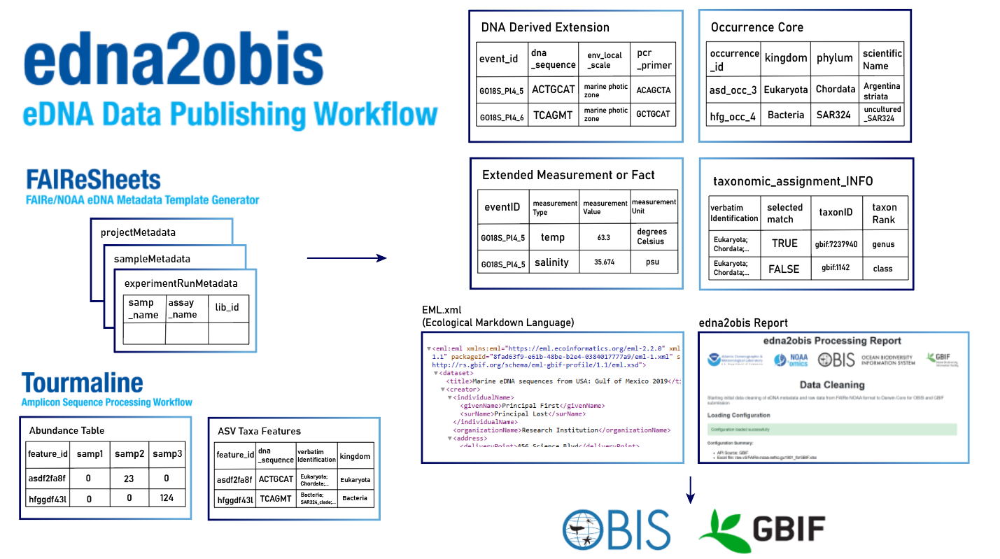
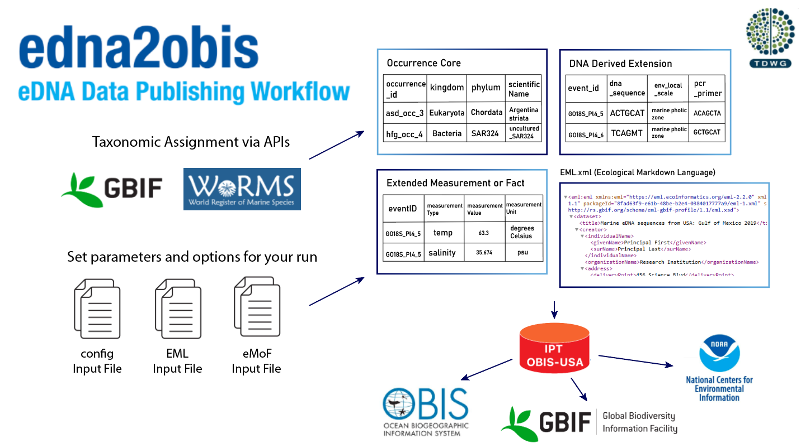

## Introduction

DNA derived data are increasingly being used to document taxon 
occurrences. To ensure these data are useful to the broadest possible 
community, [GBIF](https://www.gbif.org/) published a guide entitled "[Publishing DNA-derived 
data through biodiversity data platforms](https://docs.gbif.org/publishing-dna-derived-data/en/)." 
This guide is supported by the [DNA derived data extension](https://tools.gbif.org/dwca-validator/extension.do?id=http://rs.gbif.org/terms/1.0/DNADerivedData) 
for [Darwin Core](https://dwc.tdwg.org/), which incorporates [MIxS](https://gensc.org/mixs/) 
terms into the Darwin Core standard. 

This use case draws on both the guide and the extension to develop a workflow 
for incorporating a DNA derived data extension file into a Darwin Core
archive. 

The latest version of edna2obis (version 3) builds upon the original edna2obis, introducing new features:
- Moved from a Jupyter Notebook to script architecture (runs in one command)
- Specify parameters in configuration files, rather than in the code
- **Supports both generic FAIRe eDNA data format and FAIRe NOAA format** (compatible for upload to the [Ocean DNA Explorer](https://www.oceandnaexplorer.org/))
- Improved taxonomic assignment accuracy and performance, with new caching methods
  - Users can choose to perform their taxonomic assignment via [WoRMS](https://www.marinespecies.org/) or [GBIF](https://www.gbif.org/) APIs  
  - Users can specify which assays to NOT include species rank for taxonomic assignment (for example, Bacterial taxonomies often have the HOST organism as the species)
  - A new output file is created, `taxa_assignment_INFO.csv`, which gives information on how the taxonomies were assigned
- Generates an HTML output report, `edna2obis_report.html` to document your run
- Options to generate an extended Measurement of Fact file and a Project-level EML metadata file


### Example data abstract:

Seawater was collected on board the NOAA ship Ronald H. Brown as part of the fourth Gulf of Mexico Ecosystems and Carbon Cycle (GOMECC-4) cruise from September 13 to October 21, 2021. Sampling for GOMECC-4 occurred along 16 coastal-offshore transects across the entire Gulf of Mexico and an additional line at 27N latitude in the Atlantic Ocean. We also collected eDNA samples near Padre Island National Seashore (U.S. National Parks Service), a barrier island located off the coast of south Texas. Vertical CTD sampling was employed at each site to measure discrete chemical, physical, and biological properties. Water sampling for DNA filtration was conducted at 54 sites and three depths per site (surface, deep chlorophyll maximum, and near bottom) to capture horizontal and vertical gradients of bacterial, protistan, and metazoan diversity across the Gulf. The resulting ASVs, their assigned taxonomy, and the metadata associated with theircollection are the input data for the OBIS conversion scripts presented here.

### Published data
- [GBIF](https://www.gbif.org/dataset/9012def0-bd87-48a0-ac9e-e0e78dd37689)
- [OBIS](https://obis.org/dataset/210efc7c-4762-47ee-b4b5-22a0f436ef44)

## Input Data Format

Quick overview
- Metadata tables come from running [FAIReSheets](https://github.com/aomlomics/FAIReSheets) (projectMetadata, sampleMetadata, experimentRunMetadata; and the NOAA data format variation requires an analysisMetadata sheet per analysis run).
- Raw ASV taxonomy and abundance tables come from Tourmaline (or any amplicon workflow) as long as they follow Tourmaline's output structure.



### Supported Data Formats

edna2obis supports two FAIRe eDNA data formats (both formats can be generated by [FAIReSheets](https://github.com/aomlomics/FAIReSheets)):
- **FAIRe generic**: Standard FAIRe layout. Analysis settings live in `projectMetadata`. Sequence ID column is typically `seq_id` in raw tables.
- **FAIRe NOAA**: Adds `analysisMetadata` per analysis run; optimized for Ocean DNA Explorer compatibility.

Both share the same core table ideas; examples below show the NOAA flavor. Differences for the generic flavor are noted along the way.

### Metadata: NOAA Omics FAIR eDNA-based metadata template
The FAIRe NOAA Google Sheet metadata template developed by NOAA Omics at AOML, and based off the [FAIRe eDNA data standard](https://fair-edna.github.io/index.html). To use the sheet for your own data, run [FAIReSheets](https://github.com/aomlomics/FAIReSheets), and it will generate the FAIRe NOAA templates in Google Sheets. Here is a filled-in example:  

[FAIRe_NOAA_noaa-aoml-gomecc4_SHARING](https://docs.google.com/spreadsheets/d/1mkjfUQW3gTn3ezhMQmFDQn4EBoQ2Xv4SZeSd9sqagoU/edit?gid=0#gid=0)

### projectMetadata
Project wide (project_level) project metadata, and metadata unique to each assay

**Note**: In generic FAIRe format, analysis metadata is included in this sheet rather than in separate analysisMetadata files.

| **term_name** | project_level | ssu16sv4v5-emp (1st assay) | ssu18sv9-emp (2nd assay) |
|:--|:--|:--|:--|
| **recordedBy** | Luke Thompson |  |
| **recordedByID** | https://orcid.org/0000-0002-3911-1280 |  |
| **project_contact** | Luke Thompson |  |
| **institution** | NOAA/AOML |  |
| **institutionID** | https://www.aoml.noaa.gov/omics |  |
| **project_name** | eDNA from Gulf of Mexico Ecosystems and Carbon Cruise 2021 (GOMECC-4) |  |
| **project_id** | noaa-aoml-gomecc4 |  |
| **parent_project_id** | noaa-aoml-gomecc |  |
| **study_factor** | water column spatial series |  |
| **assay_type** | metabarcoding |  |
| **sterilise_method** | After sampling, run ~1 L of 5% bleach through tubing lines, then rep... |  |
| **checkls_ver** | FAIRe_checklist_v1.0.xlsx |  |
| **mod_date** | 2024-10-31 |  |
| **license** | http://creativecommons.org/publicdomain/zero/1.0/legalcode |  |
| **rightsHolder** | US Government |  |
| **accessRights** | no rights reserved ||
| **assay_name** |  | ssu16sv4v5-emp | ssu18sv9-emp |
| **ampliconSize** |  | 411 | 260 |
| **code_repo** | https://github.com/aomlomics/gomecc |  |
| **biological_rep** | 3 |  |

### sampleMetadata
Contextual data about the samples collected. Each row is a distinct sample (Event)

**Note**: This structure is largely the same between generic FAIRe and FAIRe NOAA formats.

| samp_name | materialSampleID | geo_loc_name | eventDate | decimalLatitude | decimalLongitude | sampleSizeValue | sampleSizeUnit | env_broad_scale | env_local_scale | env_medium | samp_collect_device | samp_vol_we_dna_ext | samp_mat_process | size_frac | 
|:--|:--|:--|:--|--:|--:|--:|:--|:--|:--|:--|:--|:--|:--|:--|
| GOMECC4_27N_Sta1_Deep_A | GOMECC4_27N_Sta1_Deep | USA: Atlantic Ocean, east of Florida (27 N) | 2021-09-14T11:00-04:00 | 26.997 | -79.618 | 1920 | mL | marine biome [ENVO:00000447] | marine mesopelagic zone [ENVO:00000213] | sea water [ENVO:00002149] | Niskin bottle on CTD rosette | 1920 mL | Pumped through Sterivex filter (0.22-µm) using peristaltic pump | 0.22 µm |  |
| GOMECC4_27N_Sta1_Deep_B | GOMECC4_PANAMACITY_Sta1_Deep | USA: Atlantic Ocean, east of Florida (27 N) | 2021-09-20T23:13-04:00 | 26.997 | -79.618 | 1920 | mL | marine biome [ENVO:00000447] | marine mesopelagic zone [ENVO:00000213] | sea water [ENVO:00002149] | Niskin bottle on CTD rosette | 1920 mL | Pumped through Sterivex filter (0.22-µm) using peristaltic pump | 0.22 µm |  |

### experimentRunMetadata
Library preparation and sequencing details

**Note**: This structure is largely the same between generic FAIRe and FAIRe NOAA formats.

| samp_name | assay_name | pcr_plate_id | lib_id | seq_run_id | mid_forward | mid_reverse | filename | filename2 | input_read_count |
|:--|:--|:--|:--|:--|:--|:--|:--|:--|--:|
| GOMECC4_NegativeControl_1 | ssu16sv4v5-emp | not applicable | GOMECC16S_Neg1 | 20220613_Amplicon_PE250 | TAGCAGCT | CTGTGCCTA | GOMECC16S_Neg1_S499_L001_R1_001.fastq.gz | GOMECC16S_Neg1_S499_L001_R2_001.fastq.gz | 29319 |
| GOMECC4_NegativeControl_2 | ssu16sv4v5-emp | not applicable | GOMECC16S_Neg2 | 20220613_Amplicon_PE250 | TAGCAGCT | CTAGGACTA | GOMECC16S_Neg2_S500_L001_R1_001.fastq.gz | GOMECC16S_Neg2_S500_L001_R2_001.fastq.gz | 30829 |

### analysisMetadata
Bioinformatic analysis configuration metadata. There is one analysisMetadata sheet PER analysis. Append the `analysis_run_name` to the filename, ex: analysisMetadata_gomecc4_16s_p1-2_v2024.10_241122.tsv

**Note**: analysisMetadata sheet(s) is **only present in FAIRe NOAA format**. In generic FAIRe format, this information is included in the projectMetadata sheet.

| **Field** | Value |
|:--|:--|
| **project_id** | noaa-aoml-gomecc4 |
| **assay_name** | ssu16sv4v5-emp |
| **analysis_run_name** | gomecc4_16s_p1-2_v2024.10_241122 |
| **sop_bioinformatics** | https://github.com/aomlomics/gomecc |
| **trim_method** | cutadapt |
| **trim_param** | qiime cutadapt trim-paired |
| **demux_tool** | qiime2-2021.2; bcl2fastq v2.20.0 |
| **merge_tool** | qiime2-2021.2; DADA2 1.18 |
| **min_len_cutoff** | 200 |
| **otu_db** | Silva SSU Ref NR 99 v138.1; 515f-926r region; 10.5281/zenodo.8392695 |
| **otu_seq_comp_appr** | Tourmaline; qiime2-2021.2 |

### Raw Data: ASV Taxonomies and Abundance Tables
You must have 2 raw data files associated with each analysis (analysisMetadata) in your submission. These files are generated by [Tourmaline v2](https://github.com/aomlomics/tourmaline), AOML Omic's amplicon sequence processing workflow. 

**Note**: Raw data structure is largely the same between formats, with one key difference: in generic FAIRe format, the sequence identifier column is named `seq_id` instead of `featureid`.

If your data was generated with Qiime2 or a previous version of Tourmaline, you can convert the `table.qza`, `taxonomy.qza`, and `repseqs.qza` outputs to the correct format using the `create_asv_seq_taxa_obis.sh` shell script.

Example:  

``` bash
#Run this with a qiime2 environment. 
bash create_asv_seq_taxa_obis.sh -f \
../gomecc_v2_raw/table-16S-merge.qza -t ../gomecc_v2_raw/taxonomy-16S-merge.qza -r ../gomecc_v2_raw/repseqs-16S-merge.qza \
-o ../gomecc_v2_raw/gomecc-16S-asv.tsv
```
Your ASV raw data files should look like this:

#### ASV Taxonomy Features:
| featureid | dna_sequence | taxonomy | verbatimIdentification | kingdom | phylum | other_ranks... | species | Confidence |
|:---------:|:------------:|:--------:|:---------------------:|:-------:|:------:|:--------------:|:-------:|:----------:|
| 1ce3b5c6d... | TACGA... | Bacteria;Proteobacteria;Alphaproteoba... | d__Bacteria;p__Proteoba... | Bacteria | Proteobacteria | ... | Clade_Ia | 0.88 |
| 4e38e8ced... | GCTACTAC... | Eukaryota;Obazoa;Opisthokonta;Metazoa... | Eukaryota;Obazoa;Opisthokonta;Metazoa... | Eukaryota | Obazoa | ... | Clausocalanus furcatus | 0.999 |

**Note**: In generic FAIRe format, the first column would be named `seq_id` instead of `featureid`.

NOTE: We understand taxonomy is complicated, so edna2obis is flexible and can receive any list of taxonomic ranks (as long as they are between columns `verbatimIdentification` and `Confidence`). For example, our 16S and 18S assay data use different taxonomic ranks, and even have a different number of taxonomic ranks. The code can account for this, and assigns taxonomies based on what ranks each API returns.

The verbatimIdentification strings may or may not have the prepending rank with underscores. The code will remove them during processing if they exist.

`featureid` is a hash of the DNA sequence, and they are unique identifiers.

**Note**: In generic FAIRe format, this column is named `seq_id` instead of `featureid`.

Some field's values have been truncated (...) for readability in the documentation. Please include the complete data for each field in your input files.

#### ASV Abundance Tables:
| featureid | GOMECC4_BROWNSVILLE_Sta63_DCM_A | GOMECC4_BROWNSVILLE_Sta63_DCM_B | GOMECC4_CAMPECHE_Sta91_DCM_A |
|:---------:|:----------------------------:|:----------------------------:|:----------------------------:|
| 1ce3b5c6d... | 0 | 32 | 2 |
| 4e38e8ced... | 15 | 0 | 45 | 

Each column name after `featureid` is a sample name, and must correspond with your sampleMetadata.

**Note**: In generic FAIRe format, the first column would be named `seq_id` instead of `featureid`.

If your abundance tables have decimal numbers, that is okay too.


## Configuration and Workflow



Configure your run using the files below; the graphic shows how these inputs flow through edna2obis to the outputs.

edna2obis uses several configuration files to customize the conversion process. All configuration files are located in the root directory.

### Main Configuration Files

#### `config.yaml`
The primary configuration file that controls the overall pipeline behavior:

- **Data file paths**: Specify paths to your Excel metadata file and raw data files
- **Taxonomic assignment**: Choose between "WoRMS" or "GBIF" APIs for taxonomic assignment
- **Output settings**: Configure output directory and file naming
- **Custom field handling**: Configure how to process specific metadata fields
- **Processing parameters**: Set parallel processing limits and caching options

#### `data_mapper.yaml`
Maps FAIRe metadata fields to Darwin Core terms:

- **Field mappings**: Maps FAIRe fields to Darwin Core standards
- **Format-specific mappings**: Different mappings for generic vs NOAA FAIRe formats

#### `EML_config.yaml`
Controls Ecological Metadata Language (EML) generation:

- **Dataset metadata**: Project descriptions, contact information, licensing
- **Geographic coverage**: Study area descriptions and bounding boxes
- **Temporal coverage**: Study period and sampling frequency
- **Method descriptions**: Detailed protocols and methodologies

### eMoF Configuration

The Extended Measurement or Fact (eMoF) file can be customized to include additional measurements:

- **Template file**: `raw-v3/eMoF_Fields_edna2obis.xlsx`
- **Custom measurements**: Add your own measurement types and values
- **Controlled vocabularies**: Use OBIS-approved terms for measurement types and units
- **Documentation**: See [OBIS eMoF formatting guide](https://manual.obis.org/format_emof.html) for detailed instructions

You can add custom fields to the eMoF template to include additional environmental measurements, sampling parameters, or any other data linked to your events. If there are fields in the eMoF template that are not in your data, don't worry, the code will account for that!

### Example Configuration Files

#### `config_FAIRe_noaa.yaml`
Example configuration for FAIRe NOAA format data:
- Pre-configured for Ocean DNA Explorer compatibility
- Optimized settings for NOAA-specific metadata structure
- Includes NOAA-specific field mappings

#### `config_FAIRe_generic.yaml`
Example configuration for generic FAIRe format data:
- Standard FAIRe eDNA data format settings
- Generic field mappings and processing parameters
- Compatible with standard FAIRe workflows

## 🚀 Setup and Installation

### Prerequisites

- [Conda](https://docs.conda.io/en/latest/miniconda.html) or [Anaconda](https://www.anaconda.com/products/distribution) installed
- [Git](https://git-scm.com/downloads) installed
- At least 8GB RAM recommended
- Internet connection required (for API calls to WoRMS/GBIF)

### Quick Start

#### 1. Clone the Repository

```bash
git clone https://github.com/aomlomics/edna2obis.git
cd edna2obis
```

#### 2. Create Conda Environment

```bash
# Create the environment from the environment.yml file
conda env create -f environment.yml

# Activate the environment
conda activate edna2obis
```

#### 3. Edit the Configuration Files

Edit the configuration files with your data filepaths and other parameters:

**Primary configuration**:
- Edit `config.yaml` for main pipeline settings
- You can copy `config_FAIRe_noaa.yaml` or `config_FAIRe_generic.yaml` into `config.yaml` as a starting point based on your data format

**Additional configuration** (optional):
- Modify `data_mapper.yaml` for custom field mappings
- Update `EML_config.yaml` for metadata generation settings, or specify you don't want an EML file in `config.yaml`
- Customize `raw-v3/eMoF_Fields_edna2obis.xlsx` for additional measurements, or specify you don't want an eMoF file in `config.yaml`

Key settings to update in `config.yaml`:
- `excel_file`: Path to your FAIRe Excel file (data template)
- `datafiles`: Paths to your ASV taxonomy and occurrence files  
- `taxonomic_api_source`: Choose "WoRMS" or "GBIF"
- `output_dir`: Where to save results (default: "processed-v3/")

#### 4. Run the Pipeline

```bash
python main.py
```

The pipeline will:
- Load and clean your metadata (according to OBIS/GBIF)
- Align data to Darwin Core data standard
- Generate an Occurrence Core
- Perform taxonomic assignment via WoRMS or GBIF APIs
- Generate a DNA Derived Extension
- Create an HTML report with results from your run


 

# Output Files

The pipeline generates several files in your output directory:

- `processed-v3/`
    *   `edna2obis_report_worms.html` / `edna2obis_report_gbif.html` - Detailed HTML report of the conversion process.
    *   `occurrence_core_worms.csv` / `occurrence_core_gbif.csv` - Final Occurrence Core with assigned taxonomies.
    *   `dna_derived_extension.csv` - DNA Derived Data extension file.
    *   `eMoF.csv` - eMoF (extended Measurement or Fact) extension file.

### Occurrence Core (GBIF example)

| occurrenceID | eventID | verbatimIdentification | kingdom | phylum | class | order | family | genus | scientificName | taxonRank | organismQuantity | organismQuantityType | recordedBy | materialSampleID | eventDate | locality | decimalLatitude | decimalLongitude | basisOfRecord | nameAccordingTo |
|:--|:--|:--|:--|:--|:--|:--|:--|:--|:--|:--|--:|:--|:--|:--|:--|:--|--:|--:|:--|:--|
| GU190706-CTD11-220_MiFish_S30_occ_18109634cc2f8e156e5402bf13cf4502 | GU190706-CTD11-220_MiFish_S30 | Eukaryota;Chordata;Actinopteri;Beloniformes;Exocoetidae;Cheilopogon | Animalia | Chordata |  | Beloniformes | Exocoetidae | Cheilopogon | Cheilopogon Lowe, 1841 | genus | 4 | DNA sequence reads | Lynsey Wilcox Talbot \| Katherine Silliman | GU190706-CTD11-220 | 2019-07-06 00:00:00 | USA: Gulf of Mexico | -85.793 | 28.662 | MaterialSample | GBIF |
| GU190706-CTD11-220_MiFish_S30_occ_183bc18f3e5eac45c6dd248fb86d64bf | GU190706-CTD11-220_MiFish_S30 | Eukaryota;Chordata;Actinopteri;Tetraodontiformes;Tetraodontidae;Lagocephalus;Lagocephalus laevigatus | Animalia | Chordata |  | Tetraodontiformes | Tetraodontidae | Lagocephalus | Lagocephalus laevigatus (Linnaeus, 1766) | species | 5317 | DNA sequence reads | Lynsey Wilcox Talbot \| Katherine Silliman | GU190706-CTD11-220 | 2019-07-06 00:00:00 | USA: Gulf of Mexico | -85.793 | 28.662 | MaterialSample | GBIF |

### DNA Derived Extension

| eventID | source_mat_id | samp_name | env_broad_scale | env_local_scale | env_medium | samp_vol_we_dna_ext | samp_collect_device | samp_mat_process | size_frac | concentration | lib_layout | seq_meth | nucl_acid_ext | target_gene | target_subfragment | pcr_primer_forward | pcr_primer_reverse | pcr_primer_name_forward | pcr_primer_name_reverse | pcr_primer_reference | pcr_cond | nucl_acid_amp | ampliconSize | otu_seq_comp_appr | otu_db | occurrenceID | DNA_sequence | concentrationUnit | otu_class_appr |
|:--|:--|:--|:--|:--|:--|--:|:--|:--|:--|--:|:--|:--|:--|:--|:--|:--|:--|:--|:--|:--|:--|:--|--:|:--|:--|:--|:--|:--|:--|
| GU190706-CTD11-220_MiFish_S30 | GU190706-CTD11-220 | GU190706-CTD11-220 | marine biome [ENVO:00000447] | marine mesopelagic zone [ENVO:00000213] | sea water [ENVO:00002149] | 2 | Niskin bottle | Samples were vacuum-filtered through a MilliporeSigma 47 mm diameter mixed cellulose ester (MCE) filter with... | 0.45 | 1.57 | paired end | Illumina MiSeq [OBI_0002003] | https://doi.org/10.1002/edn3.70074 | 12S rRNA (SSU mitochondria) | V5-V6 | GTCGGTAAAACTCGTGCCAGC | CATAGTGGGGTATCTAATCCCAGTTTGT | MiFish-U-F | MiFish-U-R2 | https://doi.org/10.1098/rsos.150088 | initial denaturation:98_30s; 40 cycles of denaturation: 98_20s, annealing:60_20s, elongation:72_20s; final elongation:72_5min | not applicable | 175 | qiime2-2023.5; naive-bayes classifier; scikit-learn 0.24.1 | custom | GU190706-CTD11-220_MiFish_S30_occ_18109634cc2f8e156e5402bf13cf4502 | CACCGCGGTTATACGAGAGGCCTAAGTTGACAGACAACGGCGTAAAGAGTGGTTAAGGAAAAATTTATACTAAAGCCGAACATCCTCAAGACTGTCGTACGTTTCCGAGGATATGAAGTCCCCCTACGAAAGTGGCTTTAACTCCCCTGACCCCACGAAAGCTGTGAC | ng/µl | qiime2-2023.5; DADA2 1.26.0 |
| GU190706-CTD11-220_MiFish_S30 | GU190706-CTD11-220 | GU190706-CTD11-220 | marine biome [ENVO:00000447] | marine mesopelagic zone [ENVO:00000213] | sea water [ENVO:00002149] | 2 | Niskin bottle | Samples were vacuum-filtered through a MilliporeSigma 47 mm diameter mixed cellulose ester (MCE) filter with... | 0.45 | 1.57 | paired end | Illumina MiSeq [OBI_0002003] | https://doi.org/10.1002/edn3.70074 | 12S rRNA (SSU mitochondria) | V5-V6 | GTCGGTAAAACTCGTGCCAGC | CATAGTGGGGTATCTAATCCCAGTTTGT | MiFish-U-F | MiFish-U-R2 | https://doi.org/10.1098/rsos.150088 | initial denaturation:98_30s; 40 cycles of denaturation: 98_20s, annealing:60_20s, elongation:72_20s; final elongation:72_5min | not applicable | 175 | qiime2-2023.5; naive-bayes classifier; scikit-learn 0.24.1 | custom | GU190706-CTD11-220_MiFish_S30_occ_183bc18f3e5eac45c6dd248fb86d64bf | CACCGCGGTTATACGATGAAGCCCAAGTTGTTAGCCTTCGGCGTAAAGAGTGGTTAGAGTACCCCAACAAAACTAAGGCCGAACACCTTCAGGGCAGTCATACGCTTTCGAAGGCATGAAGCACACCAACGAAAGTAGCCTTACCAGACTTGAACCCACGAAAGCTAAGAT | ng/µl | qiime2-2023.5; DADA2 1.26.0 |

## Taxonomic Assignment Algorithms
### WoRMS
- Clean `verbatimIdentification`: split by `;`, replace `_ - /` with spaces, trim, remove trailing “sp.”/“spp.” and numbers, drop empty/“unassigned”.
- If it exists as a species by AphiaID in the local reference database file provided (optionally), look up AphiaID directly and fill fields.
- Otherwise, use WoRMS “Match Names”:
  - Start from the most specific level (ex: species) and move broader only if needed.
  - Keep only records with status “accepted” and add every accepted alternative to the review list.
  - Use the most specific level that returns an accepted record for the assignment (ex: favors a genus assignment over a class assignment).
- If an assay is set to skip species, drop the last level before searching.
- If nothing accepted, set `scientificName=incertae sedis` and clear ranks.
- Fill: `scientificName`, `scientificNameID` (LSID), `taxonRank`, ranks (`kingdom … species`), `nameAccordingTo=WoRMS`, plus `cleanedTaxonomy` and `match_type_debug`.
- Endpoints: AphiaID record; Match Names.

### GBIF
- Clean `verbatimIdentification` as above and remove rank prefixes like `d__`, `p__`, etc.
- Try the most specific level first; move broader only if needed.
- For each candidate from the initial lookup, confirm against the GBIF backbone to get a confidence score.
- Choose the highest-confidence accepted match; include other accepted candidates in the review list. If none, set `scientificName=incertae sedis`.
- If an assay is set to skip species, drop the last level before searching.
- Cache results to speed up future runs.
- Fill: `scientificName`, `taxonID` (e.g., `gbif:<usageKey>`), `taxonRank`, ranks (`kingdom … genus`), `confidence`, `nameAccordingTo=GBIF`, plus `cleanedTaxonomy` and `match_type_debug`.
- Endpoints: name_lookup; name_backbone.

### Settings that affect matching
- `taxonomic_api_source`: `"WoRMS"` or `"GBIF"`
- `assays_to_skip_species_match`: assays where species level is ignored
- Per-assay maximum depth: inferred from your inputs; used for species skipping
- GBIF candidate limit and caching
- Local reference database (WoRMS only) for fast AphiaID lookups

Also writes `taxa_assignment_INFO_WoRMS.csv` or `taxa_assignment_INFO_GBIF.csv`, listing all candidate matches and indicating which one was selected.

### taxa_assignment_INFO (GBIF example)
This file displays all potential taxonomic assignments for each unique taxonomy. If a taxonomic assignment appears incorrect in your Occurrence Core, you can refer to this file to explore alternative assignments.

| verbatimIdentification | cleanedTaxonomy | selected_match | scientificName | confidence | taxonRank | taxonID | kingdom | phylum | class | order | family | genus | match_type_debug | nameAccordingTo |
|:--|:--|:--|:--|--:|:--|:--|:--|:--|:--|:--|:--|:--|:--|:--|
| Bacteria | Bacteria | True | Bacteria | 97 | kingdom | gbif:3 | Bacteria |  |  |  |  |  | GBIF_EXACT | GBIF |
| Eukaryota;Chordata;Actinopteri | Eukaryota;Chordata;Actinopteri | True | Chordata | 97 | phylum | gbif:44 | Animalia | Chordata |  |  |  |  | GBIF_EXACT | GBIF |

### eMoF (extendedMeasurementOrFact)

The eMoF file captures occurrence-level measurements linked to each occurrenceID that made it into the final occurrence file. This creates a larger file but is what GBIF requires for data submission.

- **What it contains**: One row per occurrence per configured measurement.
- **Where it comes from**: Measurement values are sourced from `sampleMetadata` first, otherwise `experimentRunMetadata`.
- **Units**:
  - If the eMoF template specifies a literal unit (e.g., `m`, `°C`), that unit is used for every emitted row of that measurementType.
  - If the template says `provided`, a column named `<measurementType>_unit` must be present in the chosen source sheet and must be non-blank for all emitted rows.
  - If the template leaves the unit blank, output unit is blank (no auto-fallback).
- **Template**: Configure measurements in `raw-v3/eMoF_Fields_edna2obis.xlsx` on the `input_file` sheet. Required columns: `measurementType`, `measurementValue`, `measurementUnit`, `measurementTypeID`, `measurementValueID`, `measurementUnitID`, `measurementRemarks`.
- **Output**: Written to `processed-v3/eMoF.csv`.

#### Customizing eMoF Measurements

You can add custom measurements to your eMoF file by editing the template file `raw-v3/eMoF_Fields_edna2obis.xlsx`. This allows you to include:

- **Environmental measurements**: Temperature, salinity, pH, dissolved oxygen, etc.
- **Sampling parameters**: Gear type, sampling depth, volume filtered, etc.
- **Laboratory measurements**: DNA concentration, extraction efficiency, etc.
- **Any other data**: Linked to your events or occurrences

For detailed guidance on formatting eMoF files and using controlled vocabularies, see the [OBIS eMoF formatting guide](https://manual.obis.org/format_emof.html).

### eMoF Preview (example)

Below is a small, illustrative preview of the eMoF structure. Your actual content will depend on your eMoF template and metadata.

| eventID | occurrenceID | verbatimMeasurementType | measurementType | measurementValue | measurementUnit | measurementTypeID | measurementValueID | measurementUnitID | measurementRemarks |
|:--|:--|:--|:--|:--|:--|:--|:--|:--|:--|
| GU190706-CTD11-220_MiFish_S30 | GU190706-CTD11-220_MiFish_S30_occ_ASV_001 | temperature | Temperature | 25.5 | °C | http://vocab.nerc.ac.uk/collection/P01/current/TEMPPR01/ | | http://vocab.nerc.ac.uk/collection/P06/current/UPAA/ | |
| GU190706-CTD11-220_MiFish_S30 | GU190706-CTD11-220_MiFish_S30_occ_ASV_002 | temperature | Temperature | 25.5 | °C | http://vocab.nerc.ac.uk/collection/P01/current/TEMPPR01/ | | http://vocab.nerc.ac.uk/collection/P06/current/UPAA/ | |


### Troubleshooting

#### Common Issues

1. **Environment creation fails**
   ```bash
   # Try updating conda first
   conda update conda
   conda env create -f environment.yml
   ```

2. **API timeout errors**
   - Reduce worms_n_proc or gbif_n_proc in `config.yaml`

3. **Missing data files**
   - Verify all file paths in config.yaml are correct
   - Use absolute paths if relative paths don't work

#### Getting Help

- Check the HTML report for detailed error messages
- Review the terminal output for specific error details
- **Ensure your input data follows the FAIRe NOAA format**

#### Recommended System Requirements
- Processing: 8GB+ RAM, 4+ CPU cores
- Storage: ~1GB free space for large datasets
- Network: Stable internet for API calls

## Disclaimer  
This repository is a scientific product and is not official communication of the National Oceanic and Atmospheric Administration, or the United States Department of Commerce. All NOAA GitHub project code is provided on an 'as is' basis and the user assumes responsibility for its use. Any claims against the Department of Commerce or Department of Commerce bureaus stemming from the use of this GitHub project will be governed by all applicable Federal law. Any reference to specific commercial products, processes, or services by service mark, trademark, manufacturer, or otherwise, does not constitute or imply their endorsement, recommendation or favoring by the Department of Commerce. The Department of Commerce seal and logo, or the seal and logo of a DOC bureau, shall not be used in any manner to imply endorsement of any commercial product or activity by DOC or the United States Government.
