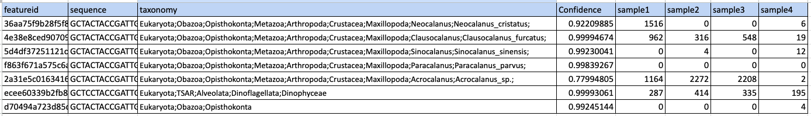

# Darwin Core Conversion of eDNA Sequence Data From the AOML_MIMARKS metadata template 

**Version:** 1.0.0

**Author:** Katherine Silliman

**Last Updated:** 2-Oct-2023

This notebook is for converting a [MIMARKS](https://fairsharing.org/FAIRsharing.zvrep1)-based data sheet to DarwinCore for submission to OBIS. It has been testing on a Mac M1 laptop running in Rosetta mode, with Python 3.11. 

[Metadata template Google Sheet](https://docs.google.com/spreadsheets/d/1jof9MBEll7Xluu8-_znLRBIP9JpyAd_5YvdioZ-REoY/edit?usp=sharing)

**Requirements:**
- Python 3
- Python 3 packages:
    - os
- External packages:
    - Bio.Entrez from biopython
    - numpy
    - pandas
    - openpyxl
    - pyworms
    - multiprocess
- Custom modules:
    - WoRMS_matching

**Resources:**
- Abarenkov K, Andersson AF, Bissett A, Finstad AG, Fossøy F, Grosjean M, Hope M, Jeppesen TS, Kõljalg U, Lundin D, Nilsson RN, Prager M, Provoost P, Schigel D, Suominen S, Svenningsen C & Frøslev TG (2023) Publishing DNA-derived data through biodiversity data platforms, v1.3. Copenhagen: GBIF Secretariat. https://doi.org/10.35035/doc-vf1a-nr22.https://doi.org/10.35035/doc-vf1a-nr22.
- [OBIS manual](https://manual.obis.org/dna_data.html)
- [TDWG Darwin Core Occurrence Core](https://dwc.tdwg.org/terms/#occurrence)
- [GBIF DNA Derived Data Extension](https://tools.gbif.org/dwca-validator/extension.do?id=http://rs.gbif.org/terms/1.0/DNADerivedData)
- https://github.com/iobis/dataset-edna

**Citation**  
Silliman K, Anderson S, Storo R, Thompson L (2023) A Case Study in Sharing Marine eDNA Metabarcoding Data to OBIS. Biodiversity Information Science and Standards 7: e111048. https://doi.org/10.3897/biss.7.111048


## Installation
```
conda create -n edna2obis
conda activate edna2obis
conda install -c conda-forge notebook
conda install -c conda-forge nb_conda_kernels

conda install -c conda-forge numpy pandas
conda install -c conda-forge openpyxl

#worms conversion
conda install -c conda-forge pyworms
conda install -c conda-forge multiprocess
conda install -c conda-forge biopython
```


```python
## Imports
import os

import numpy as np
import pandas as pd

import WoRMS_matching # custom functions for querying WoRMS API
```


```python
# jupyter notebook parameters
pd.set_option('display.max_colwidth', 0)
pd.set_option('display.max_columns', None)
```

Note that in a Jupyter Notebook, the current directory is always where the .ipynb file is being run.

## Prepare input data 

**Project data and metadata**  
This workflow assumes that you have your project metadata in an Excel sheet formatted like the template located [here](https://docs.google.com/spreadsheets/d/1jof9MBEll7Xluu8-_znLRBIP9JpyAd_5YvdioZ-REoY/edit?usp=sharing). Instructions for filling out the metadata template are located in the 'Readme' sheet.

**eDNA and taxonomy data**  
The eDNA data and assigned taxonomy should be in a specific tab-delimited format. 

This file is generated automatically by [Tourmaline v2023.5+](https://github.com/aomlomics/tourmaline), in X location. If your data was generated with Qiime2 or a previous version of Tourmaline, you can convert the `table.qza`, `taxonomy.qza`, and `repseqs.qza` outputs to the correct format using the `create_asv_seq_taxa_obis.sh` shell script.

Example:  

``` 
#Run this with a qiime2 environment. 
bash create_asv_seq_taxa_obis.sh -f \
../gomecc_v2_raw/table-16S-merge.qza -t ../gomecc_v2_raw/taxonomy-16S-merge.qza -r ../gomecc_v2_raw/repseqs-16S-merge.qza \
-o ../gomecc_v2_raw/gomecc-16S-asv.tsv
```


## Set configs  

Below you can set definitions for parameters used in the code. 

| Parameter           | Description                                                                                                       | Example                                                                                              |
|---------------------|-------------------------------------------------------------------------------------------------------------------|------------------------------------------------------------------------------------------------------|
| `sample_data`       | Name of sheet in project data Excel file with sample data.                                                        | "water_sample_data"                                                                                  |
| `prep_data`         | Name of sheet in project data Excel file with data about molecular preparation methods.                           | "amplicon_prep_data"                                                                                 |
| `analysis_data`     | Name of sheet in project data Excel file with data about analysis methods.                                        | "analysis_data"                                                                                      |
| `study_data`        | Name of sheet in project data Excel file with metadata about the study.                                           | "study_data"                                                                                         |
| `msmt_metadata`     | Name of sheet in project data Excel file with metadata about additional measurements. Not used in current code.   | "measurement_metadata"                                                                               |
| `excel_file`        | Path of project data Excel file.                                                                                  | "../raw/gomecc4_AOML_MIMARKS.survey.water.6.0.xlsx"                                                  |
| `md_excel`          | Path of data dictionary Excel file.                                                                               | "../raw/gomecc_AOML2DwC standards.xlsx"                                                              |
| `datafiles`         | Python dictionary, where keys are the amplicon names and the values are the paths to the cooresponding ASV table. | {'16S V4-V5': '../raw/gomecc-16S-asv.tsv', '18S V9': '../raw/gomecc-18S-asv.tsv'}                    |
| `skip_sample_types` | Python list of sample_type values to skip from OBIS submission, such as controls or blanks.                       | ['mock community','distilled water blank','extraction blank','PCR no-template control','RTSF blank'] |
| `skip_columns`      | Python list of columns to ignore when submitting to OBIS.                                                         | ['notes_sampling']                                                                                   |


```python
params = {}
params['sample_data'] = "water_sample_data"
params['prep_data']= "amplicon_prep_data"
params['analysis_data'] = "analysis_data"
params['study_data'] = "study_data"
params['msmt_metadata'] = "measurement_metadata"
params['excel_file'] = "../raw/gomecc4_AOML_MIMARKS.survey.water.6.0.xlsx"

params['datafiles'] = {'16S V4-V5': '../raw/gomecc-16S-asv.tsv',
                       '18S V9': '../raw/gomecc-18S-asv.tsv'}

params['skip_sample_types'] = ['mock community','distilled water blank','extraction blank','PCR no-template control','RTSF blank']
params['skip_columns']= ['notes_sampling']
params['md_excel'] = "../raw/gomecc_AOML2DwC standards.xlsx"

```

## Load data

Note that in a Jupyter Notebook, the current directory is always where the .ipynb file is being run.

### Load project data Excel file


```python

data = pd.read_excel(
    params['excel_file'], 
    [params['study_data'],params['sample_data'],params['prep_data'],params['analysis_data'],params['msmt_metadata']],
    index_col=None, na_values=[""], comment="#"
)
```


```python
#rename keys in data dictionary to a general term
data['sample_data'] = data.pop(params['sample_data'])
data['prep_data'] = data.pop(params['prep_data'])
data['analysis_data'] = data.pop(params['analysis_data'])
data['study_data'] = data.pop(params['study_data'])
```


```python
#remove * from headers (was required for NCBI submission, but no longer needed)
data['sample_data'].columns = data['sample_data'].columns.str.replace("*","")
```

#### sample_data  
Contextual data about the samples collected, such as when it was collected, where it was collected from, what kind of sample it is, and what were the properties of the environment or experimental condition from which the sample was taken. Each row is a distinct sample, or Event. Most of this information is recorded during sample collection. This sheet contains terms from the MIMARKS survey water 6.0 package. 


```python
data['sample_data'].head()
```


<div>
<style scoped>
    .dataframe tbody tr th:only-of-type {
        vertical-align: middle;
    }

    .dataframe tbody tr th {
        vertical-align: top;
    }

    .dataframe thead th {
        text-align: right;
    }
</style>
<table border="1" class="dataframe">
  <thead>
    <tr style="text-align: right;">
      <th></th>
      <th>sample_name</th>
      <th>serial_number</th>
      <th>cruise_id</th>
      <th>line_id</th>
      <th>station</th>
      <th>ctd_bottle_no</th>
      <th>sample_replicate</th>
      <th>source_mat_id</th>
      <th>biological_replicates</th>
      <th>extract_number</th>
      <th>sample_title</th>
      <th>bioproject_accession</th>
      <th>biosample_accession</th>
      <th>amplicon_sequenced</th>
      <th>metagenome_sequenced</th>
      <th>organism</th>
      <th>collection_date_local</th>
      <th>collection_date</th>
      <th>depth</th>
      <th>env_broad_scale</th>
      <th>env_local_scale</th>
      <th>env_medium</th>
      <th>geo_loc_name</th>
      <th>lat_lon</th>
      <th>decimalLatitude</th>
      <th>decimalLongitude</th>
      <th>samp_vol_we_dna_ext</th>
      <th>samp_collect_device</th>
      <th>samp_mat_process</th>
      <th>sample_type</th>
      <th>samp_size</th>
      <th>size_frac</th>
      <th>collection_method</th>
      <th>basisOfRecord</th>
      <th>cluster_16s</th>
      <th>cluster_18s</th>
      <th>notes_sampling</th>
      <th>notes_bottle_metadata</th>
      <th>line_position</th>
      <th>offshore_inshore_200m_isobath</th>
      <th>depth_category</th>
      <th>ocean_acidification_status</th>
      <th>seascape_class</th>
      <th>seascape_probability</th>
      <th>seascape_window</th>
      <th>dna_sample_number</th>
      <th>dna_conc</th>
      <th>dna_yield</th>
      <th>extraction_plate_name</th>
      <th>extraction_well_number</th>
      <th>extraction_well_position</th>
      <th>ship_crs_expocode</th>
      <th>woce_sect</th>
      <th>ammonium</th>
      <th>carbonate</th>
      <th>diss_inorg_carb</th>
      <th>diss_oxygen</th>
      <th>fluor</th>
      <th>hydrogen_ion</th>
      <th>nitrate</th>
      <th>nitrite</th>
      <th>nitrate_plus_nitrite</th>
      <th>omega_arag</th>
      <th>pco2</th>
      <th>ph</th>
      <th>phosphate</th>
      <th>pressure</th>
      <th>salinity</th>
      <th>samp_store_loc</th>
      <th>samp_store_temp</th>
      <th>silicate</th>
      <th>size_frac_low</th>
      <th>size_frac_up</th>
      <th>temp</th>
      <th>tot_alkalinity</th>
      <th>tot_depth_water_col</th>
      <th>transmittance</th>
      <th>date_sheet_modified</th>
      <th>modified_by</th>
    </tr>
  </thead>
  <tbody>
    <tr>
      <th>0</th>
      <td>GOMECC4_27N_Sta1_Deep_A</td>
      <td>GOMECC4_001</td>
      <td>GOMECC-4 (2021)</td>
      <td>27N</td>
      <td>Sta1</td>
      <td>3</td>
      <td>A</td>
      <td>GOMECC4_27N_Sta1_Deep</td>
      <td>GOMECC4_27N_Sta1_Deep_B, GOMECC4_27N_Sta1_Deep_C</td>
      <td>Plate4_52</td>
      <td>Atlantic Ocean seawater sample GOMECC4_27N_Sta1_Deep_A</td>
      <td>PRJNA887898</td>
      <td>SAMN37516091</td>
      <td>16S V4-V5 | 18S V9</td>
      <td>planned for FY24</td>
      <td>seawater metagenome</td>
      <td>2021-09-14T11:00-04:00</td>
      <td>2021-09-14T07:00</td>
      <td>618 m</td>
      <td>marine biome [ENVO:00000447]</td>
      <td>marine mesopelagic zone [ENVO:00000213]</td>
      <td>sea water [ENVO:00002149]</td>
      <td>USA: Atlantic Ocean, east of Florida (27 N)</td>
      <td>26.997 N 79.618 W</td>
      <td>26.997</td>
      <td>-79.618</td>
      <td>1920 ml</td>
      <td>Niskin bottle</td>
      <td>Pumped through Sterivex filter (0.22-µm) using peristaltic pµmp</td>
      <td>seawater</td>
      <td>NaN</td>
      <td>0.22 µm</td>
      <td>CTD rosette</td>
      <td>MaterialSample</td>
      <td>Cluster 3</td>
      <td>Cluster 3</td>
      <td>DCM = deep chlorophyl max.</td>
      <td>NaN</td>
      <td>Offshore</td>
      <td>offshore</td>
      <td>Deep</td>
      <td>Low</td>
      <td>13</td>
      <td>0.507214</td>
      <td>8-day</td>
      <td>1</td>
      <td>0.08038 ng/µl</td>
      <td>12.057 ng</td>
      <td>GOMECC2021_Plate4</td>
      <td>52</td>
      <td>D7</td>
      <td>WBTSRHB</td>
      <td>RB2103</td>
      <td>0.25971 µmol/kg</td>
      <td>88.434 µmol/kg</td>
      <td>2215.45 µmol/kg</td>
      <td>129.44 µmol/kg</td>
      <td>0.0308</td>
      <td>0.0000000142 M</td>
      <td>29.3256 µmol/kg</td>
      <td>0.00391 µmol/kg</td>
      <td>29.3295 µmol/kg</td>
      <td>1.168</td>
      <td>624 µatm</td>
      <td>7.849</td>
      <td>1.94489 µmol/kg</td>
      <td>623 dbar</td>
      <td>34.946 psu</td>
      <td>NOAA/AOML Room 248</td>
      <td>-20 °C</td>
      <td>20.3569 µmol/kg</td>
      <td>no pre-filter</td>
      <td>0.22 µm</td>
      <td>7.479 °C</td>
      <td>2318.9 µmol/kg</td>
      <td>623 m</td>
      <td>4.7221</td>
      <td>2023-10-03 13:28:31.916</td>
      <td>luke.thompson@noaa.gov</td>
    </tr>
    <tr>
      <th>1</th>
      <td>GOMECC4_27N_Sta1_Deep_B</td>
      <td>GOMECC4_002</td>
      <td>GOMECC-4 (2021)</td>
      <td>27N</td>
      <td>Sta1</td>
      <td>3</td>
      <td>B</td>
      <td>GOMECC4_27N_Sta1_Deep</td>
      <td>GOMECC4_27N_Sta1_Deep_A, GOMECC4_27N_Sta1_Deep_C</td>
      <td>Plate4_60</td>
      <td>Atlantic Ocean seawater sample GOMECC4_27N_Sta1_Deep_B</td>
      <td>PRJNA887898</td>
      <td>SAMN37516092</td>
      <td>16S V4-V5 | 18S V9</td>
      <td>planned for FY24</td>
      <td>seawater metagenome</td>
      <td>2021-09-14T11:00-04:00</td>
      <td>2021-09-14T07:00</td>
      <td>618 m</td>
      <td>marine biome [ENVO:00000447]</td>
      <td>marine mesopelagic zone [ENVO:00000213]</td>
      <td>sea water [ENVO:00002149]</td>
      <td>USA: Atlantic Ocean, east of Florida (27 N)</td>
      <td>26.997 N 79.618 W</td>
      <td>26.997</td>
      <td>-79.618</td>
      <td>1940 ml</td>
      <td>Niskin bottle</td>
      <td>Pumped through Sterivex filter (0.22-µm) using peristaltic pµmp</td>
      <td>seawater</td>
      <td>NaN</td>
      <td>0.22 µm</td>
      <td>CTD rosette</td>
      <td>MaterialSample</td>
      <td>Cluster 3</td>
      <td>Cluster 3</td>
      <td>DCM was around 80 m and not well defined.</td>
      <td>NaN</td>
      <td>Offshore</td>
      <td>offshore</td>
      <td>Deep</td>
      <td>Low</td>
      <td>13</td>
      <td>0.507214</td>
      <td>8-day</td>
      <td>2</td>
      <td>0.1141 ng/µl</td>
      <td>17.115 ng</td>
      <td>GOMECC2021_Plate4</td>
      <td>60</td>
      <td>D8</td>
      <td>WBTSRHB</td>
      <td>RB2103</td>
      <td>0.25971 µmol/kg</td>
      <td>88.434 µmol/kg</td>
      <td>2215.45 µmol/kg</td>
      <td>129.44 µmol/kg</td>
      <td>0.0308</td>
      <td>0.0000000142 M</td>
      <td>29.3256 µmol/kg</td>
      <td>0.00391 µmol/kg</td>
      <td>29.3295 µmol/kg</td>
      <td>1.168</td>
      <td>624 µatm</td>
      <td>7.849</td>
      <td>1.94489 µmol/kg</td>
      <td>623 dbar</td>
      <td>34.946 psu</td>
      <td>NOAA/AOML Room 248</td>
      <td>-20 °C</td>
      <td>20.3569 µmol/kg</td>
      <td>no pre-filter</td>
      <td>0.22 µm</td>
      <td>7.479 °C</td>
      <td>2318.9 µmol/kg</td>
      <td>623 m</td>
      <td>4.7221</td>
      <td>NaT</td>
      <td>NaN</td>
    </tr>
    <tr>
      <th>2</th>
      <td>GOMECC4_27N_Sta1_Deep_C</td>
      <td>GOMECC4_003</td>
      <td>GOMECC-4 (2021)</td>
      <td>27N</td>
      <td>Sta1</td>
      <td>3</td>
      <td>C</td>
      <td>GOMECC4_27N_Sta1_Deep</td>
      <td>GOMECC4_27N_Sta1_Deep_A, GOMECC4_27N_Sta1_Deep_B</td>
      <td>Plate4_62</td>
      <td>Atlantic Ocean seawater sample GOMECC4_27N_Sta1_Deep_C</td>
      <td>PRJNA887898</td>
      <td>SAMN37516093</td>
      <td>16S V4-V5 | 18S V9</td>
      <td>planned for FY24</td>
      <td>seawater metagenome</td>
      <td>2021-09-14T11:00-04:00</td>
      <td>2021-09-14T07:00</td>
      <td>618 m</td>
      <td>marine biome [ENVO:00000447]</td>
      <td>marine mesopelagic zone [ENVO:00000213]</td>
      <td>sea water [ENVO:00002149]</td>
      <td>USA: Atlantic Ocean, east of Florida (27 N)</td>
      <td>26.997 N 79.618 W</td>
      <td>26.997</td>
      <td>-79.618</td>
      <td>2000 ml</td>
      <td>Niskin bottle</td>
      <td>Pumped through Sterivex filter (0.22-µm) using peristaltic pµmp</td>
      <td>seawater</td>
      <td>NaN</td>
      <td>0.22 µm</td>
      <td>CTD rosette</td>
      <td>MaterialSample</td>
      <td>Cluster 3</td>
      <td>Cluster 3</td>
      <td>Surface CTD bottles did not fire correctly; hand niskin bottle used for the surface cast. PM cast.</td>
      <td>NaN</td>
      <td>Offshore</td>
      <td>offshore</td>
      <td>Deep</td>
      <td>Low</td>
      <td>13</td>
      <td>0.507214</td>
      <td>8-day</td>
      <td>3</td>
      <td>0.07223 ng/µl</td>
      <td>10.8345 ng</td>
      <td>GOMECC2021_Plate4</td>
      <td>62</td>
      <td>F8</td>
      <td>WBTSRHB</td>
      <td>RB2103</td>
      <td>0.25971 µmol/kg</td>
      <td>88.434 µmol/kg</td>
      <td>2215.45 µmol/kg</td>
      <td>129.44 µmol/kg</td>
      <td>0.0308</td>
      <td>0.0000000142 M</td>
      <td>29.3256 µmol/kg</td>
      <td>0.00391 µmol/kg</td>
      <td>29.3295 µmol/kg</td>
      <td>1.168</td>
      <td>624 µatm</td>
      <td>7.849</td>
      <td>1.94489 µmol/kg</td>
      <td>623 dbar</td>
      <td>34.946 psu</td>
      <td>NOAA/AOML Room 248</td>
      <td>-20 °C</td>
      <td>20.3569 µmol/kg</td>
      <td>no pre-filter</td>
      <td>0.22 µm</td>
      <td>7.479 °C</td>
      <td>2318.9 µmol/kg</td>
      <td>623 m</td>
      <td>4.7221</td>
      <td>NaT</td>
      <td>NaN</td>
    </tr>
    <tr>
      <th>3</th>
      <td>GOMECC4_27N_Sta1_DCM_A</td>
      <td>GOMECC4_004</td>
      <td>GOMECC-4 (2021)</td>
      <td>27N</td>
      <td>Sta1</td>
      <td>14</td>
      <td>A</td>
      <td>GOMECC4_27N_Sta1_DCM</td>
      <td>GOMECC4_27N_Sta1_DCM_B, GOMECC4_27N_Sta1_DCM_C</td>
      <td>Plate4_53</td>
      <td>Atlantic Ocean seawater sample GOMECC4_27N_Sta1_DCM_A</td>
      <td>PRJNA887898</td>
      <td>SAMN37516094</td>
      <td>16S V4-V5 | 18S V9</td>
      <td>planned for FY24</td>
      <td>seawater metagenome</td>
      <td>2021-09-14T11:00-04:00</td>
      <td>2021-09-14T07:00</td>
      <td>49 m</td>
      <td>marine biome [ENVO:00000447]</td>
      <td>marine photic zone [ENVO:00000209]</td>
      <td>sea water [ENVO:00002149]</td>
      <td>USA: Atlantic Ocean, east of Florida (27 N)</td>
      <td>26.997 N 79.618 W</td>
      <td>26.997</td>
      <td>-79.618</td>
      <td>1540 ml</td>
      <td>Niskin bottle</td>
      <td>Pumped through Sterivex filter (0.22-µm) using peristaltic pµmp</td>
      <td>seawater</td>
      <td>NaN</td>
      <td>0.22 µm</td>
      <td>CTD rosette</td>
      <td>MaterialSample</td>
      <td>Cluster 1</td>
      <td>Cluster 2</td>
      <td>Only enough water for 2 surface replicates.</td>
      <td>NaN</td>
      <td>Offshore</td>
      <td>offshore</td>
      <td>DCM</td>
      <td>High</td>
      <td>13</td>
      <td>0.507214</td>
      <td>8-day</td>
      <td>4</td>
      <td>1.49 ng/µl</td>
      <td>223.5 ng</td>
      <td>GOMECC2021_Plate4</td>
      <td>53</td>
      <td>E7</td>
      <td>WBTSRHB</td>
      <td>RB2103</td>
      <td>0.32968 µmol/kg</td>
      <td>229.99 µmol/kg</td>
      <td>2033.19 µmol/kg</td>
      <td>193.443 µmol/kg</td>
      <td>0.036</td>
      <td>0.0000000094 M</td>
      <td>0 µmol/kg</td>
      <td>0 µmol/kg</td>
      <td>0 µmol/kg</td>
      <td>3.805</td>
      <td>423 µatm</td>
      <td>8.027</td>
      <td>0.0517 µmol/kg</td>
      <td>49 dbar</td>
      <td>36.325 psu</td>
      <td>NOAA/AOML Room 248</td>
      <td>-20 °C</td>
      <td>1.05635 µmol/kg</td>
      <td>no pre-filter</td>
      <td>0.22 µm</td>
      <td>28.592 °C</td>
      <td>2371 µmol/kg</td>
      <td>623 m</td>
      <td>4.665</td>
      <td>NaT</td>
      <td>NaN</td>
    </tr>
    <tr>
      <th>4</th>
      <td>GOMECC4_27N_Sta1_DCM_B</td>
      <td>GOMECC4_005</td>
      <td>GOMECC-4 (2021)</td>
      <td>27N</td>
      <td>Sta1</td>
      <td>14</td>
      <td>B</td>
      <td>GOMECC4_27N_Sta1_DCM</td>
      <td>GOMECC4_27N_Sta1_DCM_A, GOMECC4_27N_Sta1_DCM_C</td>
      <td>Plate4_46</td>
      <td>Atlantic Ocean seawater sample GOMECC4_27N_Sta1_DCM_B</td>
      <td>PRJNA887898</td>
      <td>SAMN37516095</td>
      <td>16S V4-V5 | 18S V9</td>
      <td>planned for FY24</td>
      <td>seawater metagenome</td>
      <td>2021-09-14T11:00-04:00</td>
      <td>2021-09-14T07:00</td>
      <td>49 m</td>
      <td>marine biome [ENVO:00000447]</td>
      <td>marine photic zone [ENVO:00000209]</td>
      <td>sea water [ENVO:00002149]</td>
      <td>USA: Atlantic Ocean, east of Florida (27 N)</td>
      <td>26.997 N 79.618 W</td>
      <td>26.997</td>
      <td>-79.618</td>
      <td>1720 ml</td>
      <td>Niskin bottle</td>
      <td>Pumped through Sterivex filter (0.22-µm) using peristaltic pµmp</td>
      <td>seawater</td>
      <td>NaN</td>
      <td>0.22 µm</td>
      <td>CTD rosette</td>
      <td>MaterialSample</td>
      <td>Cluster 1</td>
      <td>Cluster 2</td>
      <td></td>
      <td>NaN</td>
      <td>Offshore</td>
      <td>offshore</td>
      <td>DCM</td>
      <td>High</td>
      <td>13</td>
      <td>0.507214</td>
      <td>8-day</td>
      <td>5</td>
      <td>0.6884 ng/µl</td>
      <td>103.26 ng</td>
      <td>GOMECC2021_Plate4</td>
      <td>46</td>
      <td>F6</td>
      <td>WBTSRHB</td>
      <td>RB2103</td>
      <td>0.32968 µmol/kg</td>
      <td>229.99 µmol/kg</td>
      <td>2033.19 µmol/kg</td>
      <td>193.443 µmol/kg</td>
      <td>0.036</td>
      <td>0.0000000094 M</td>
      <td>0 µmol/kg</td>
      <td>0 µmol/kg</td>
      <td>0 µmol/kg</td>
      <td>3.805</td>
      <td>423 µatm</td>
      <td>8.027</td>
      <td>0.0517 µmol/kg</td>
      <td>49 dbar</td>
      <td>36.325 psu</td>
      <td>NOAA/AOML Room 248</td>
      <td>-20 °C</td>
      <td>1.05635 µmol/kg</td>
      <td>no pre-filter</td>
      <td>0.22 µm</td>
      <td>28.592 °C</td>
      <td>2371 µmol/kg</td>
      <td>623 m</td>
      <td>4.665</td>
      <td>NaT</td>
      <td>NaN</td>
    </tr>
  </tbody>
</table>
</div>


#### prep_data  
Contextual data about how the samples were prepared for sequencing. Includes how they were extracted, what amplicon was targeted, how they were sequenced. Each row is a separate sequencing library preparation, distinguished by a unique library_id.


```python
data['prep_data'].head(2)
```


<div>
<style scoped>
    .dataframe tbody tr th:only-of-type {
        vertical-align: middle;
    }

    .dataframe tbody tr th {
        vertical-align: top;
    }

    .dataframe thead th {
        text-align: right;
    }
</style>
<table border="1" class="dataframe">
  <thead>
    <tr style="text-align: right;">
      <th></th>
      <th>sample_name</th>
      <th>library_id</th>
      <th>title</th>
      <th>library_strategy</th>
      <th>library_source</th>
      <th>library_selection</th>
      <th>lib_layout</th>
      <th>platform</th>
      <th>instrument_model</th>
      <th>design_description</th>
      <th>filetype</th>
      <th>filename</th>
      <th>filename2</th>
      <th>drive_location</th>
      <th>biosample_accession</th>
      <th>sra_accession</th>
      <th>seq_method</th>
      <th>nucl_acid_ext</th>
      <th>amplicon_sequenced</th>
      <th>target_gene</th>
      <th>target_subfragment</th>
      <th>pcr_primer_forward</th>
      <th>pcr_primer_reverse</th>
      <th>pcr_primer_name_forward</th>
      <th>pcr_primer_name_reverse</th>
      <th>pcr_primer_reference</th>
      <th>pcr_cond</th>
      <th>nucl_acid_amp</th>
      <th>adapters</th>
      <th>mid_barcode</th>
      <th>date_sheet_modified</th>
      <th>modified_by</th>
    </tr>
  </thead>
  <tbody>
    <tr>
      <th>0</th>
      <td>GOMECC4_NegativeControl_1</td>
      <td>GOMECC16S_Neg1</td>
      <td>16S amplicon metabarcoding of marine metagenome: Gulf of Mexico (USA)</td>
      <td>AMPLICON</td>
      <td>METAGENOMIC</td>
      <td>PCR</td>
      <td>paired</td>
      <td>ILLUMINA</td>
      <td>Illumina MiSeq</td>
      <td>Samples were collected and filtered onto Sterivex 0.22 um cartridge filters. DNA was extracted from Sterivex by adding lysis buffer and magnetic bead-based extraction kits (ZymoBIOMICS 96 DNA/RNA MagBead kit). Following bead beating in the cartridges, extractions were finished on an automated KingFisher Flex instrument (Thermo Fisher) in 96-well plates. A two-step PCR approach was used, targeting 16S V4-V5 rRNA with primers 515F (5-GTGYCAGCMGCCGCGGTAA-3) and 926R (5-CCGYCAATTYMTTTRAGTTT-3). Primers were constructed with Fluidigm common oligos CS1 forward (CS1-TS-F: 5-ACACTGACGACATGGTTCTACA-3) and CS2 reverse (CS2-TS-R: 5-TACGGTAGCAGAGACTTGGTCT-3) fused to their 5' ends. PCR products were sent to the Michigan State University Research Technology Support Facility Genomics Core for secondary PCR and sequencing. Secondary PCR used dual-indexed, Illumina-compatible primers, targeting the Fluidigm CS1/CS2 oligomers at the ends of the PCR products. Sequencing runs were performed on an Illumina MiSeq to produce 250+250 nt paired reads.</td>
      <td>fastq</td>
      <td>GOMECC16S_Neg1_S499_L001_R1_001.fastq.gz</td>
      <td>GOMECC16S_Neg1_S499_L001_R2_001.fastq.gz</td>
      <td>NaN</td>
      <td>SAMN37516589</td>
      <td>SRR26148505</td>
      <td>Illumina MiSeq 2x250</td>
      <td>https://github.com/aomlomics/protocols/blob/main/protocol_DNA_extraction_Sterivex.md</td>
      <td>16S V4-V5</td>
      <td>16S rRNA</td>
      <td>V4-V5</td>
      <td>GTGYCAGCMGCCGCGGTAA</td>
      <td>CCGYCAATTYMTTTRAGTTT</td>
      <td>515F-Y</td>
      <td>926R</td>
      <td>10.1111/1462-2920.13023</td>
      <td>initial denaturation:95_2;denaturation:95_0.75;annealing:50_0.75;elongation:68_1.5;final elongation:68_5;25</td>
      <td>10.1111/1462-2920.13023</td>
      <td>ACACTGACGACATGGTTCTACA;TACGGTAGCAGAGACTTGGTCT</td>
      <td>missing: not provided</td>
      <td>NaT</td>
      <td>NaN</td>
    </tr>
    <tr>
      <th>1</th>
      <td>GOMECC4_27N_Sta1_DCM_A</td>
      <td>GOMECC18S_Plate4_53</td>
      <td>18S amplicon metabarcoding of marine metagenome: Gulf of Mexico (USA)</td>
      <td>AMPLICON</td>
      <td>METAGENOMIC</td>
      <td>PCR</td>
      <td>paired</td>
      <td>ILLUMINA</td>
      <td>Illumina MiSeq</td>
      <td>Samples were collected and filtered onto Sterivex 0.22 um cartridge filters. DNA was extracted from Sterivex by adding lysis buffer and magnetic bead-based extraction kits (ZymoBIOMICS 96 DNA/RNA MagBead kit). Following bead beating in the cartridges, extractions were finished on an automated KingFisher Flex instrument (Thermo Fisher) in 96-well plates. A two-step PCR approach was used, targeting 18S V0 rRNA with primers 1391f; 5’-GTACACACCGCCCGTC-3’ and EukBr; 5’-TGATCCTTCTGCAGGTTCACCTAC-3’. Primers were constructed with Fluidigm common oligos CS1 forward (CS1-TS-F: 5-ACACTGACGACATGGTTCTACA-3) and CS2 reverse (CS2-TS-R: 5-TACGGTAGCAGAGACTTGGTCT-3) fused to their 5' ends. PCR products were sent to the Michigan State University Research Technology Support Facility Genomics Core for secondary PCR and sequencing. Secondary PCR used dual-indexed, Illumina-compatible primers, targeting the Fluidigm CS1/CS2 oligomers at the ends of the PCR products. Sequencing runs were performed on an Illumina MiSeq to produce 250+250 nt paired reads</td>
      <td>fastq</td>
      <td>GOMECC18S_Plate4_53_S340_L001_R1_001.fastq.gz</td>
      <td>GOMECC18S_Plate4_53_S340_L001_R2_001.fastq.gz</td>
      <td>NaN</td>
      <td>SAMN37516094</td>
      <td>SRR26161153</td>
      <td>Illumina MiSeq 2x250</td>
      <td>https://github.com/aomlomics/protocols/blob/main/protocol_DNA_extraction_Sterivex.md</td>
      <td>18S V9</td>
      <td>18S rRNA</td>
      <td>V9</td>
      <td>GTACACACCGCCCGTC</td>
      <td>TGATCCTTCTGCAGGTTCACCTAC</td>
      <td>1391f</td>
      <td>EukBr</td>
      <td>10.1371/journal.pone.0006372</td>
      <td>initial denaturation:94_3;denaturation:94_0.75;annealing:65_0.25;57_0.5;elongation:72_1.5;final elongation:72_10;35</td>
      <td>10.1371/journal.pone.0006372</td>
      <td>ACACTGACGACATGGTTCTACA;TACGGTAGCAGAGACTTGGTCT</td>
      <td>missing: not provided</td>
      <td>2023-10-03 12:49:23.878</td>
      <td>katherine.silliman@noaa.gov</td>
    </tr>
  </tbody>
</table>
</div>


### Drop samples with unwanted sample types  

Often with eDNA projects, we have control samples that are sequenced along with our survey samples. These can include filtering distilled water, using pure water instead of DNA in a PCR or DNA extraction protocol, or a mock community of known microbial taxa. Controls can help identify and mitigate contaminant DNA in our samples, but are not useful for biodiversity platforms like OBIS. You can select which sample_type values to drop with the `skip_sample_types` parameter.

### Drop samples with unwanted sample types


```python
samps_to_remove = data['sample_data']['sample_type'].isin(params['skip_sample_types'])
#data['sample_data'][samps_to_remove]
# list of samples to drop
samples_to_drop = data['sample_data']['sample_name'][samps_to_remove]
```

You can view the list of samples to be dropped below.


```python
samples_to_drop
```


    26     GOMECC4_Blank_DIW_20210915_A
    27     GOMECC4_Blank_DIW_20210915_B
    28     GOMECC4_Blank_DIW_20210915_C
    200    GOMECC4_Blank_DIW_20210930_A
    201    GOMECC4_Blank_DIW_20210930_B
    202    GOMECC4_Blank_DIW_20210930_C
    334    GOMECC4_Blank_DIW_20211011_A
    335    GOMECC4_Blank_DIW_20211011_B
    336    GOMECC4_Blank_DIW_20211011_C
    409    GOMECC4_Blank_DIW_20211016_A
    410    GOMECC4_Blank_DIW_20211016_B
    411    GOMECC4_Blank_DIW_20211016_C
    484       GOMECC4_ExtractionBlank_1
    485      GOMECC4_ExtractionBlank_11
    486      GOMECC4_ExtractionBlank_12
    487       GOMECC4_ExtractionBlank_3
    488       GOMECC4_ExtractionBlank_5
    489       GOMECC4_ExtractionBlank_7
    490       GOMECC4_ExtractionBlank_9
    491            GOMECC4_MSUControl_1
    492            GOMECC4_MSUControl_2
    493            GOMECC4_MSUControl_3
    494            GOMECC4_MSUControl_4
    495            GOMECC4_MSUControl_5
    496            GOMECC4_MSUControl_6
    497            GOMECC4_MSUControl_7
    498       GOMECC4_NegativeControl_1
    499       GOMECC4_NegativeControl_2
    500       GOMECC4_PositiveControl_1
    501       GOMECC4_PositiveControl_2
    Name: sample_name, dtype: object


```python
# remove samples from sample_data sheet
data['sample_data'] = data['sample_data'][~samps_to_remove]
```


```python
# remove samples from prep_data
prep_samps_to_remove = data['prep_data']['sample_name'].isin(samples_to_drop)
data['prep_data'] = data['prep_data'][~prep_samps_to_remove]
```


```python
# check the sample_type values left in your sample_data. We only want seawater.
data['sample_data']['sample_type'].unique()
```


    array(['seawater'], dtype=object)


### Drop columns with all NAs  

If your project data file has columns with only NAs, this code will check for those, provide their column headers for verification, then remove them.


```python
# which have all NAs?
dropped = pd.DataFrame()
for sheet in ['sample_data','prep_data','analysis_data']:
    res = pd.Series(data[sheet].columns[data[sheet].isnull().all(0)],
                name=sheet)
    dropped=pd.concat([dropped,res],axis=1)
    
```

Which columns in each sheet have only NA values?


```python
dropped
```


<div>
<style scoped>
    .dataframe tbody tr th:only-of-type {
        vertical-align: middle;
    }

    .dataframe tbody tr th {
        vertical-align: top;
    }

    .dataframe thead th {
        text-align: right;
    }
</style>
<table border="1" class="dataframe">
  <thead>
    <tr style="text-align: right;">
      <th></th>
      <th>sample_data</th>
      <th>prep_data</th>
      <th>analysis_data</th>
    </tr>
  </thead>
  <tbody>
    <tr>
      <th>0</th>
      <td>samp_size</td>
      <td>drive_location</td>
      <td>sop</td>
    </tr>
  </tbody>
</table>
</div>


If you are fine with leaving these columns out, proceed:


```python
for sheet in ['sample_data','prep_data','analysis_data']:
    data[sheet].dropna(axis=1, how='all',inplace=True)
```

Now let's check which columns have missing values in some of the rows. These should be filled in on the Excel sheet with the appropriate term ('not applicable', 'missing', or 'not collected'). Alternatively, you can drop the column if it is not needed for submission to OBIS.


```python
# which columns have missing data (NAs) in some rows
some = pd.DataFrame()
for sheet in ['sample_data','prep_data','analysis_data']:
    res = pd.Series(data[sheet].columns[data[sheet].isnull().any()].tolist(),
                name=sheet)
    some=pd.concat([some,res],axis=1)
```


```python
some
```


<div>
<style scoped>
    .dataframe tbody tr th:only-of-type {
        vertical-align: middle;
    }

    .dataframe tbody tr th {
        vertical-align: top;
    }

    .dataframe thead th {
        text-align: right;
    }
</style>
<table border="1" class="dataframe">
  <thead>
    <tr style="text-align: right;">
      <th></th>
      <th>sample_data</th>
      <th>prep_data</th>
      <th>analysis_data</th>
    </tr>
  </thead>
  <tbody>
    <tr>
      <th>0</th>
      <td>notes_bottle_metadata</td>
      <td>date_sheet_modified</td>
      <td>date_sheet_modified</td>
    </tr>
    <tr>
      <th>1</th>
      <td>date_sheet_modified</td>
      <td>modified_by</td>
      <td>modified_by</td>
    </tr>
    <tr>
      <th>2</th>
      <td>modified_by</td>
      <td>NaN</td>
      <td>NaN</td>
    </tr>
  </tbody>
</table>
</div>


```python
# drop columns with any missing data
for sheet in ['sample_data','prep_data','analysis_data']:
    data[sheet].dropna(axis=1, how='any',inplace=True)
```

### Load data dictionary Excel file 
This Excel file is used as a data dictionary for converting between terms used in the project data Excel file and Darwin Core terms for submission to OBIS. Currently, we are only preparing an Occurrence core file and a DNA-derived extension file, with Event information in the Occurrence file. Future versions of this workflow will prepare an extendedMeasurementOrFact file as well.


```python
# read in data dictionary excel file
dwc_data = pd.read_excel(
    params['md_excel'], 
    ['event','occurrence','dna'],
    index_col=0, na_values=[""]
)
```


```python
#example of a sheet in the data dictionary
dwc_data['event'].head()
```


<div>
<style scoped>
    .dataframe tbody tr th:only-of-type {
        vertical-align: middle;
    }

    .dataframe tbody tr th {
        vertical-align: top;
    }

    .dataframe thead th {
        text-align: right;
    }
</style>
<table border="1" class="dataframe">
  <thead>
    <tr style="text-align: right;">
      <th></th>
      <th>AOML_term</th>
      <th>AOML_file</th>
      <th>DwC_definition</th>
    </tr>
    <tr>
      <th>DwC_term</th>
      <th></th>
      <th></th>
      <th></th>
    </tr>
  </thead>
  <tbody>
    <tr>
      <th>eventID</th>
      <td>sample_name</td>
      <td>sample_data</td>
      <td>An identifier for the set of information associated with a dwc:Event (something that occurs at a place and time). https://dwc.tdwg.org/terms/#dwc:eventID</td>
    </tr>
    <tr>
      <th>eventDate</th>
      <td>collection_date_local</td>
      <td>sample_data</td>
      <td>this is the date-time when the dwc:Event was recorded. Recommended best practice is to use a date that conforms to ISO 8601-1:2019. https://dwc.tdwg.org/terms/#dwc:eventDate</td>
    </tr>
    <tr>
      <th>samplingProtocol</th>
      <td>collection_method</td>
      <td>sample_data</td>
      <td>The names of, references to, or descriptions of the methods or protocols used during a dwc:Event.</td>
    </tr>
    <tr>
      <th>locationID</th>
      <td>station</td>
      <td>sample_data</td>
      <td>An identifier for the set of dcterms:Location information. May be a global unique identifier or an identifier specific to the data set.</td>
    </tr>
    <tr>
      <th>decimalLatitude</th>
      <td>decimalLatitude</td>
      <td>sample_data</td>
      <td>The geographic latitude (in decimal degrees, using the spatial reference system given in dwc:geodeticDatum) of the geographic center of a dcterms:Location. Positive values are north of the Equator, negative values are south of it. Legal values lie between -90 and 90, inclusive. https://dwc.tdwg.org/terms/#dwc:decimalLatitude</td>
    </tr>
  </tbody>
</table>
</div>


### Load ASV data  
The ASV data files have one row for each unique amplicon sequence variants (ASVs). There is one ASV file for eacher marker sequences. They contain the ASV DNA sequence, a unique hash identifier the taxonomic assignment for each ASV, the confidence given that assignment by the naive-bayes classifier, and then the number of reads observed in each sample. 

| column name    | definition                                                                                                                                                                                                                                                                                                                                                                                              |
|----------------|---------------------------------------------------------------------------------------------------------------------------------------------------------------------------------------------------------------------------------------------------------------------------------------------------------------------------------------------------------------------------------------------------------|
| featureid      | A hash of the ASV sequence, used as a unique identifier for the ASV.                                                                                                                                                                                                                                                                                                                                    |
| sequence       | The DNA sequence of the ASV                                                                                                                                                                                                                                                                                                                                                                             |
| taxonomy       | The full taxonomy assigned to an ASV sequence. This string could be formatted in very different ways depending on the reference database used during classification, however it should always be in reverse rank order separated by ;. We provide examples for how to process results from a Silva classifier and the PR2 18S classifier. For other taxonomy formats, the code will need to be adapted. |
| Confidence     | This is the confidence score assigned the taxonomic classification with a naive-bayes classifier.                                                                                                                                                                                                                                                                                                       |
| sample columns | The next columns each represent a sample (or eventID), and the number of reads for that ASV observed in the sample.                                                                                                                                                                                                                                                                                     |


```python
# read in ASV tables, looping through amplicons
asv_tables = {}

for gene in params['datafiles'].keys():
    asv_tables[gene] = pd.read_table(params['datafiles'][gene])

```


```python
asv_tables.keys()
```


    dict_keys(['16S V4-V5', '18S V9'])


```python
asv_tables['16S V4-V5'].iloc[:,0:20].head()
```


<div>
<style scoped>
    .dataframe tbody tr th:only-of-type {
        vertical-align: middle;
    }

    .dataframe tbody tr th {
        vertical-align: top;
    }

    .dataframe thead th {
        text-align: right;
    }
</style>
<table border="1" class="dataframe">
  <thead>
    <tr style="text-align: right;">
      <th></th>
      <th>featureid</th>
      <th>sequence</th>
      <th>taxonomy</th>
      <th>Confidence</th>
      <th>GOMECC4_27N_Sta1_DCM_A</th>
      <th>GOMECC4_27N_Sta1_DCM_B</th>
      <th>GOMECC4_27N_Sta1_DCM_C</th>
      <th>GOMECC4_27N_Sta1_Deep_A</th>
      <th>GOMECC4_27N_Sta1_Deep_B</th>
      <th>GOMECC4_27N_Sta1_Deep_C</th>
      <th>GOMECC4_27N_Sta1_Surface_A</th>
      <th>GOMECC4_27N_Sta1_Surface_B</th>
      <th>GOMECC4_27N_Sta4_DCM_A</th>
      <th>GOMECC4_27N_Sta4_DCM_B</th>
      <th>GOMECC4_27N_Sta4_DCM_C</th>
      <th>GOMECC4_27N_Sta4_Deep_A</th>
      <th>GOMECC4_27N_Sta4_Deep_B</th>
      <th>GOMECC4_27N_Sta4_Deep_C</th>
      <th>GOMECC4_27N_Sta4_Surface_A</th>
      <th>GOMECC4_27N_Sta4_Surface_B</th>
    </tr>
  </thead>
  <tbody>
    <tr>
      <th>0</th>
      <td>00006f0784f7dbb2f162408abb6da629</td>
      <td>TACGGAGGGTGCGAGCGTTAATCGGAATTACTGGGCGTAAAGCGCATGCAGGTGGTTTGTTAAGTCAGATGTGAAAGCCCGGGGCTCAACCTCGGAATTGCATTTGAAACTGGCAGACTAGAGTACTGTAGAGGGGGGTAGAATTTCAGGTGTAGCGGTGAAATGCGTAGAGATCTGAAGGAATACCGGTGGCGAAGGCGGCCCCCTGGACAGATACTGACACTCAGATGCGAAAGCGTGGGGAGCAAACAGGATTAGATACCCTGGTAGTCCACGCCGTAAACGATGTCTACTTGGAGGTTGTGGCCTTGAGCCGTGGCTTTCGGAGCTAACGCGTTAAGTAGACCGCCTGGGGAGTACGGTCGCAAGATTA</td>
      <td>d__Bacteria; p__Proteobacteria; c__Gammaproteobacteria; o__Vibrionales; f__Vibrionaceae; g__Vibrio</td>
      <td>0.978926</td>
      <td>0</td>
      <td>0</td>
      <td>0</td>
      <td>0</td>
      <td>0</td>
      <td>0</td>
      <td>0</td>
      <td>0</td>
      <td>0</td>
      <td>0</td>
      <td>0</td>
      <td>0</td>
      <td>0</td>
      <td>0</td>
      <td>0</td>
      <td>25</td>
    </tr>
    <tr>
      <th>1</th>
      <td>000094731d4984ed41435a1bf65b7ef2</td>
      <td>TACAGAGAGTGCAAGCGTTAATCGGAATTACTGGGCGTAAAGCGCGCGTAGGTGGGTATTTAAGTCGGATGTGAAATCCCCGGGCTTAACCTGGGAACTGCATCCGAAACTATTTAACTAGAGTATGGGAGAGGTAAGTAGAATTTCCGGTGTAGCGGTGAAATGCGTAGATATCGGAAGGAATACCAGTGGCGAAGGCGGCTTACTGGACCAATACTGACGCTGAGGTGCGAAAGCGTGGGGAGCGAACAGGATTAGATACCCTCGTAGTCCATGCCGTAAACGATGTGTGTTAGACGTTGGAAATTTATTTTCAGTGTCGCAGCGAAAGCAGTAAACACACCGCCTGGGGAGTACGACCGCAAGGTTA</td>
      <td>d__Bacteria; p__Proteobacteria; c__Gammaproteobacteria; o__HOC36; f__HOC36; g__HOC36; s__Candidatus_Thioglobus</td>
      <td>0.881698</td>
      <td>0</td>
      <td>0</td>
      <td>0</td>
      <td>0</td>
      <td>0</td>
      <td>0</td>
      <td>0</td>
      <td>0</td>
      <td>0</td>
      <td>0</td>
      <td>0</td>
      <td>0</td>
      <td>0</td>
      <td>0</td>
      <td>0</td>
      <td>0</td>
    </tr>
    <tr>
      <th>2</th>
      <td>0001a3c11fcef1b1b8f4c72942efbbac</td>
      <td>TACGAAGGGGGCGAGCGTTGTTCGGAATTACTGGGCGTAAAGGGCGCGTAGGCGGTCTTCTAAGTTAGGCGTGAAAGCCCCGGGCTCAACCTGGGAACTGCGCTTAATACTGGAAGACTAGAAAACGGAAGAGGGTAGTGGAATTCCCAGTGTAGAGGTGAAATGCGTAGATATCGGGAAGAACACCAGTGGCGAAGGCGCTCTGCTGGGCCATCACTGACGCTCATGGACGAAAGCCAGGGGAGCGAAAGGGATTAGATACCCCTGTAGTCCTGGCCGTAAACGATGAACACTAGGTGTCGGGGGAATCGACCCCCTCGGTGTCGTAGCCAACGCGTTAAGTGTTCCGCCTGGGGAGTACGCACGCAAGTGTG</td>
      <td>d__Bacteria; p__Cyanobacteria; c__Cyanobacteriia; o__Synechococcales; f__Cyanobiaceae; g__Cyanobium_PCC-6307</td>
      <td>0.762793</td>
      <td>0</td>
      <td>0</td>
      <td>0</td>
      <td>0</td>
      <td>0</td>
      <td>0</td>
      <td>0</td>
      <td>0</td>
      <td>0</td>
      <td>0</td>
      <td>0</td>
      <td>0</td>
      <td>0</td>
      <td>0</td>
      <td>0</td>
      <td>0</td>
    </tr>
    <tr>
      <th>3</th>
      <td>0001ceef5162e6d689ef30418cfcc164</td>
      <td>TACAGAGGGTGCAAGCGTTGTTCGGAATCATTGGGCGTAAAGCGCGCGTAGGCGGCCAAATAAGTCTGATGTGAAGGCCCAGGGCTCAACCCTGGAAGTGCATCGGAAACTGTTTGGCTCGAGTCCCGGAGGGGGTGGTGGAATTCCTGGTGTAGAGGTGAAATTCGTAGATATCAGGAGGAACACCGGTGGCGAAGGCGACCACCTGGACGGTGACTGACGCTGAGGTGCGAAAGCATGGGTAGCAAACAGGATTAGATACCCTGGTAGTCCATGCCGTAAACGATGAGTACTAGGCGCTGCGGGTATTGACCCCTGCGGTGCCGAAGTTAACGCATTAAGTACTCCGCCTGGGAAGTACGGCCGCAAGGTTA</td>
      <td>d__Bacteria; p__Myxococcota; c__Myxococcia; o__Myxococcales; f__Myxococcaceae; g__P3OB-42; s__uncultured_bacterium</td>
      <td>0.997619</td>
      <td>0</td>
      <td>0</td>
      <td>0</td>
      <td>0</td>
      <td>0</td>
      <td>0</td>
      <td>0</td>
      <td>0</td>
      <td>0</td>
      <td>0</td>
      <td>0</td>
      <td>0</td>
      <td>0</td>
      <td>0</td>
      <td>0</td>
      <td>0</td>
    </tr>
    <tr>
      <th>4</th>
      <td>000235534662df05bb30219a4b978dac</td>
      <td>TACGGAAGGTCCAAGCGTTAATCGGAATTACTGGGCGTAAAGCGCGCGTAGGTGGTTTTTTAAGTTGGATGTGAAAGCCCTGGGCTCAACCTAGGAACTGCATCCAAAACTAGATGACTAGAGTACGAAAGAGGGAAGTAGAATTCACAGTGTAGCGGTGGAATGCGTAGATATTGTGAAGAATACCAATGGCGAAGGCAGCTTCCTGGTTCTGTACTGACACTGAGGTGCGAAAGCGTGGGGAGCAAACAGGATTAGATACCCTGGTAGTCCACGCCGTAAACGATGGTCACTAGCTGTTTGGACTTCGGTCTGAGTGGCTAAGCGAAAGTGATAAGTGACCCACCTGGGGAGTACGTTCGCAAGAATG</td>
      <td>d__Bacteria; p__Proteobacteria; c__Gammaproteobacteria; o__SAR86_clade; f__SAR86_clade; g__SAR86_clade</td>
      <td>0.999961</td>
      <td>0</td>
      <td>0</td>
      <td>0</td>
      <td>0</td>
      <td>0</td>
      <td>0</td>
      <td>0</td>
      <td>0</td>
      <td>0</td>
      <td>0</td>
      <td>0</td>
      <td>0</td>
      <td>0</td>
      <td>0</td>
      <td>0</td>
      <td>0</td>
    </tr>
  </tbody>
</table>
</div>


## Convert to Occurrence file
In order to link the DNA-derived extension metadata to our OBIS occurrence records, we have to use the Occurrence core. An 
For this data set, a `parentEvent` is a filtered water sample that was DNA extracted from a bigger niskin grab, a sequencing library from that DNA extraction is an `event`, and an `occurrence` is an ASV observed within a library. We will have an an occurence file, a DNA derived data file, and a measurements file.  
**Define files**


### Sampling event info


```python
dwc_data['event']
```


<div>
<style scoped>
    .dataframe tbody tr th:only-of-type {
        vertical-align: middle;
    }

    .dataframe tbody tr th {
        vertical-align: top;
    }

    .dataframe thead th {
        text-align: right;
    }
</style>
<table border="1" class="dataframe">
  <thead>
    <tr style="text-align: right;">
      <th></th>
      <th>AOML_term</th>
      <th>AOML_file</th>
      <th>DwC_definition</th>
    </tr>
    <tr>
      <th>DwC_term</th>
      <th></th>
      <th></th>
      <th></th>
    </tr>
  </thead>
  <tbody>
    <tr>
      <th>eventID</th>
      <td>sample_name</td>
      <td>sample_data</td>
      <td>An identifier for the set of information associated with a dwc:Event (something that occurs at a place and time). https://dwc.tdwg.org/terms/#dwc:eventID</td>
    </tr>
    <tr>
      <th>eventDate</th>
      <td>collection_date_local</td>
      <td>sample_data</td>
      <td>this is the date-time when the dwc:Event was recorded. Recommended best practice is to use a date that conforms to ISO 8601-1:2019. https://dwc.tdwg.org/terms/#dwc:eventDate</td>
    </tr>
    <tr>
      <th>samplingProtocol</th>
      <td>collection_method</td>
      <td>sample_data</td>
      <td>The names of, references to, or descriptions of the methods or protocols used during a dwc:Event.</td>
    </tr>
    <tr>
      <th>locationID</th>
      <td>station</td>
      <td>sample_data</td>
      <td>An identifier for the set of dcterms:Location information. May be a global unique identifier or an identifier specific to the data set.</td>
    </tr>
    <tr>
      <th>decimalLatitude</th>
      <td>decimalLatitude</td>
      <td>sample_data</td>
      <td>The geographic latitude (in decimal degrees, using the spatial reference system given in dwc:geodeticDatum) of the geographic center of a dcterms:Location. Positive values are north of the Equator, negative values are south of it. Legal values lie between -90 and 90, inclusive. https://dwc.tdwg.org/terms/#dwc:decimalLatitude</td>
    </tr>
    <tr>
      <th>decimalLongitude</th>
      <td>decimalLongitude</td>
      <td>sample_data</td>
      <td>The geographic longitude (in decimal degrees, using the spatial reference system given in dwc:geodeticDatum) of the geographic center of a dcterms:Location. Positive values are east of the Greenwich Meridian, negative values are west of it. Legal values lie between -180 and 180, inclusive. https://dwc.tdwg.org/list/#dwc_decimalLongitude</td>
    </tr>
    <tr>
      <th>geodeticDatum</th>
      <td>none</td>
      <td>pipeline</td>
      <td>The ellipsoid, geodetic datum, or spatial reference system (SRS) upon which the geographic coordinates given in dwc:decimalLatitude and dwc:decimalLongitude are based.</td>
    </tr>
    <tr>
      <th>countryCode</th>
      <td>none</td>
      <td>pipeline</td>
      <td>NaN</td>
    </tr>
    <tr>
      <th>minimumDepthInMeters</th>
      <td>depth</td>
      <td>sample_data</td>
      <td>NaN</td>
    </tr>
    <tr>
      <th>maximumDepthInMeters</th>
      <td>derived: depth</td>
      <td>sample_data</td>
      <td>NaN</td>
    </tr>
    <tr>
      <th>datasetID</th>
      <td>project_id_external</td>
      <td>study_data</td>
      <td>An identifier for the set of data. May be a global unique identifier or an identifier specific to a collection or institution.</td>
    </tr>
    <tr>
      <th>waterBody</th>
      <td>derived</td>
      <td>sample_data</td>
      <td>The name of the water body in which the dcterms:Location occurs.         Recommended best practice is to use a controlled vocabulary such as the Getty Thesaurus of Geographic Names.</td>
    </tr>
    <tr>
      <th>locality</th>
      <td>geo_loc_name</td>
      <td>sample_data</td>
      <td>NaN</td>
    </tr>
    <tr>
      <th>eventRemarks</th>
      <td>derived: controls_used</td>
      <td>analysis_data</td>
      <td>Comments or notes about the dwc:Event.</td>
    </tr>
  </tbody>
</table>
</div>


```python
event_dict = dwc_data['event'].to_dict('index')
```


```python
event_dict['eventID']
```


    {'AOML_term': 'sample_name',
     'AOML_file': 'sample_data',
     'DwC_definition': 'An identifier for the set of information associated with a dwc:Event (something that occurs at a place and time). https://dwc.tdwg.org/terms/#dwc:eventID'}


```python
# check which event terms are not in sample_data sheet
for key in event_dict.keys():
    if event_dict[key]['AOML_file'] == 'sample_data':
        if event_dict[key]['AOML_term'] not in data['sample_data'].columns:
            print(key,event_dict[key])
```

    maximumDepthInMeters {'AOML_term': 'derived: depth', 'AOML_file': 'sample_data', 'DwC_definition': nan}
    waterBody {'AOML_term': 'derived', 'AOML_file': 'sample_data', 'DwC_definition': 'The name of the water body in which the dcterms:Location occurs.         Recommended best practice is to use a controlled vocabulary such as the Getty Thesaurus of Geographic Names.'}


```python
# custom add waterBody

data['sample_data'].loc[data['sample_data']['geo_loc_name'].str.contains("Atlantic Ocean"), 'waterBody']= "Atlantic Ocean"
data['sample_data'].loc[data['sample_data']['geo_loc_name'].str.contains("Gulf"), 'waterBody']= "Mexico, Gulf of"

```

    /var/folders/_f/3hfwkwps2rq9q60vkv4fnd_n9rf1vk/T/ipykernel_16627/2121370784.py:3: FutureWarning: Setting an item of incompatible dtype is deprecated and will raise in a future error of pandas. Value 'Atlantic Ocean' has dtype incompatible with float64, please explicitly cast to a compatible dtype first.
      data['sample_data'].loc[data['sample_data']['geo_loc_name'].str.contains("Atlantic Ocean"), 'waterBody']= "Atlantic Ocean"


```python
# change locationID to line_id+station
data['sample_data']['station'] = data['sample_data']['line_id']+ "_"+data['sample_data']['station'] 

```


```python
# rename sample_data columns to fit DwC standard
gen = (x for x in event_dict.keys() if event_dict[x]['AOML_file'] == 'sample_data')
rename_dict = {}
for x in gen:
    #print(x)
    rename_dict[event_dict[x]['AOML_term']] = x

event_sample = data['sample_data'].rename(columns=rename_dict)
event_sample = event_sample.drop(columns=[col for col in event_sample if col not in rename_dict.values()])

```


```python
# add minimumDepthInMeters
#remove m in depth
event_sample['minimumDepthInMeters'] = event_sample['minimumDepthInMeters'].str.strip(" m")
event_sample['maximumDepthInMeters'] = event_sample['minimumDepthInMeters']
```


```python

event_sample.head()
```


<div>
<style scoped>
    .dataframe tbody tr th:only-of-type {
        vertical-align: middle;
    }

    .dataframe tbody tr th {
        vertical-align: top;
    }

    .dataframe thead th {
        text-align: right;
    }
</style>
<table border="1" class="dataframe">
  <thead>
    <tr style="text-align: right;">
      <th></th>
      <th>eventID</th>
      <th>locationID</th>
      <th>eventDate</th>
      <th>minimumDepthInMeters</th>
      <th>locality</th>
      <th>decimalLatitude</th>
      <th>decimalLongitude</th>
      <th>samplingProtocol</th>
      <th>waterBody</th>
      <th>maximumDepthInMeters</th>
    </tr>
  </thead>
  <tbody>
    <tr>
      <th>0</th>
      <td>GOMECC4_27N_Sta1_Deep_A</td>
      <td>27N_Sta1</td>
      <td>2021-09-14T11:00-04:00</td>
      <td>618</td>
      <td>USA: Atlantic Ocean, east of Florida (27 N)</td>
      <td>26.997</td>
      <td>-79.618</td>
      <td>CTD rosette</td>
      <td>Atlantic Ocean</td>
      <td>618</td>
    </tr>
    <tr>
      <th>1</th>
      <td>GOMECC4_27N_Sta1_Deep_B</td>
      <td>27N_Sta1</td>
      <td>2021-09-14T11:00-04:00</td>
      <td>618</td>
      <td>USA: Atlantic Ocean, east of Florida (27 N)</td>
      <td>26.997</td>
      <td>-79.618</td>
      <td>CTD rosette</td>
      <td>Atlantic Ocean</td>
      <td>618</td>
    </tr>
    <tr>
      <th>2</th>
      <td>GOMECC4_27N_Sta1_Deep_C</td>
      <td>27N_Sta1</td>
      <td>2021-09-14T11:00-04:00</td>
      <td>618</td>
      <td>USA: Atlantic Ocean, east of Florida (27 N)</td>
      <td>26.997</td>
      <td>-79.618</td>
      <td>CTD rosette</td>
      <td>Atlantic Ocean</td>
      <td>618</td>
    </tr>
    <tr>
      <th>3</th>
      <td>GOMECC4_27N_Sta1_DCM_A</td>
      <td>27N_Sta1</td>
      <td>2021-09-14T11:00-04:00</td>
      <td>49</td>
      <td>USA: Atlantic Ocean, east of Florida (27 N)</td>
      <td>26.997</td>
      <td>-79.618</td>
      <td>CTD rosette</td>
      <td>Atlantic Ocean</td>
      <td>49</td>
    </tr>
    <tr>
      <th>4</th>
      <td>GOMECC4_27N_Sta1_DCM_B</td>
      <td>27N_Sta1</td>
      <td>2021-09-14T11:00-04:00</td>
      <td>49</td>
      <td>USA: Atlantic Ocean, east of Florida (27 N)</td>
      <td>26.997</td>
      <td>-79.618</td>
      <td>CTD rosette</td>
      <td>Atlantic Ocean</td>
      <td>49</td>
    </tr>
  </tbody>
</table>
</div>


```python
# add amplicon_sequenced back 
event_sample['amplicon_sequenced'] = data['sample_data']['amplicon_sequenced']
```

Now add an event for each sequencing library, with replicate water sample as the parentEvent.  

**Future Update**: make this a for loop


```python
child_data_16S = event_sample[event_sample['amplicon_sequenced'].str.contains('16S V4-V5')].copy()
child_data_16S['parentEventID'] = child_data_16S['eventID']
child_data_16S['eventID'] = child_data_16S['eventID']+"_16S"
child_data_16S.head()
```


<div>
<style scoped>
    .dataframe tbody tr th:only-of-type {
        vertical-align: middle;
    }

    .dataframe tbody tr th {
        vertical-align: top;
    }

    .dataframe thead th {
        text-align: right;
    }
</style>
<table border="1" class="dataframe">
  <thead>
    <tr style="text-align: right;">
      <th></th>
      <th>eventID</th>
      <th>locationID</th>
      <th>eventDate</th>
      <th>minimumDepthInMeters</th>
      <th>locality</th>
      <th>decimalLatitude</th>
      <th>decimalLongitude</th>
      <th>samplingProtocol</th>
      <th>waterBody</th>
      <th>maximumDepthInMeters</th>
      <th>amplicon_sequenced</th>
      <th>parentEventID</th>
    </tr>
  </thead>
  <tbody>
    <tr>
      <th>0</th>
      <td>GOMECC4_27N_Sta1_Deep_A_16S</td>
      <td>27N_Sta1</td>
      <td>2021-09-14T11:00-04:00</td>
      <td>618</td>
      <td>USA: Atlantic Ocean, east of Florida (27 N)</td>
      <td>26.997</td>
      <td>-79.618</td>
      <td>CTD rosette</td>
      <td>Atlantic Ocean</td>
      <td>618</td>
      <td>16S V4-V5 | 18S V9</td>
      <td>GOMECC4_27N_Sta1_Deep_A</td>
    </tr>
    <tr>
      <th>1</th>
      <td>GOMECC4_27N_Sta1_Deep_B_16S</td>
      <td>27N_Sta1</td>
      <td>2021-09-14T11:00-04:00</td>
      <td>618</td>
      <td>USA: Atlantic Ocean, east of Florida (27 N)</td>
      <td>26.997</td>
      <td>-79.618</td>
      <td>CTD rosette</td>
      <td>Atlantic Ocean</td>
      <td>618</td>
      <td>16S V4-V5 | 18S V9</td>
      <td>GOMECC4_27N_Sta1_Deep_B</td>
    </tr>
    <tr>
      <th>2</th>
      <td>GOMECC4_27N_Sta1_Deep_C_16S</td>
      <td>27N_Sta1</td>
      <td>2021-09-14T11:00-04:00</td>
      <td>618</td>
      <td>USA: Atlantic Ocean, east of Florida (27 N)</td>
      <td>26.997</td>
      <td>-79.618</td>
      <td>CTD rosette</td>
      <td>Atlantic Ocean</td>
      <td>618</td>
      <td>16S V4-V5 | 18S V9</td>
      <td>GOMECC4_27N_Sta1_Deep_C</td>
    </tr>
    <tr>
      <th>3</th>
      <td>GOMECC4_27N_Sta1_DCM_A_16S</td>
      <td>27N_Sta1</td>
      <td>2021-09-14T11:00-04:00</td>
      <td>49</td>
      <td>USA: Atlantic Ocean, east of Florida (27 N)</td>
      <td>26.997</td>
      <td>-79.618</td>
      <td>CTD rosette</td>
      <td>Atlantic Ocean</td>
      <td>49</td>
      <td>16S V4-V5 | 18S V9</td>
      <td>GOMECC4_27N_Sta1_DCM_A</td>
    </tr>
    <tr>
      <th>4</th>
      <td>GOMECC4_27N_Sta1_DCM_B_16S</td>
      <td>27N_Sta1</td>
      <td>2021-09-14T11:00-04:00</td>
      <td>49</td>
      <td>USA: Atlantic Ocean, east of Florida (27 N)</td>
      <td>26.997</td>
      <td>-79.618</td>
      <td>CTD rosette</td>
      <td>Atlantic Ocean</td>
      <td>49</td>
      <td>16S V4-V5 | 18S V9</td>
      <td>GOMECC4_27N_Sta1_DCM_B</td>
    </tr>
  </tbody>
</table>
</div>


```python
child_data_18S = event_sample[event_sample['amplicon_sequenced'].str.contains('18S V9')].copy()
child_data_18S['parentEventID'] = child_data_18S['eventID']
child_data_18S['eventID'] = child_data_18S['eventID']+"_18S"
child_data_18S.head()
```


<div>
<style scoped>
    .dataframe tbody tr th:only-of-type {
        vertical-align: middle;
    }

    .dataframe tbody tr th {
        vertical-align: top;
    }

    .dataframe thead th {
        text-align: right;
    }
</style>
<table border="1" class="dataframe">
  <thead>
    <tr style="text-align: right;">
      <th></th>
      <th>eventID</th>
      <th>locationID</th>
      <th>eventDate</th>
      <th>minimumDepthInMeters</th>
      <th>locality</th>
      <th>decimalLatitude</th>
      <th>decimalLongitude</th>
      <th>samplingProtocol</th>
      <th>waterBody</th>
      <th>maximumDepthInMeters</th>
      <th>amplicon_sequenced</th>
      <th>parentEventID</th>
    </tr>
  </thead>
  <tbody>
    <tr>
      <th>0</th>
      <td>GOMECC4_27N_Sta1_Deep_A_18S</td>
      <td>27N_Sta1</td>
      <td>2021-09-14T11:00-04:00</td>
      <td>618</td>
      <td>USA: Atlantic Ocean, east of Florida (27 N)</td>
      <td>26.997</td>
      <td>-79.618</td>
      <td>CTD rosette</td>
      <td>Atlantic Ocean</td>
      <td>618</td>
      <td>16S V4-V5 | 18S V9</td>
      <td>GOMECC4_27N_Sta1_Deep_A</td>
    </tr>
    <tr>
      <th>1</th>
      <td>GOMECC4_27N_Sta1_Deep_B_18S</td>
      <td>27N_Sta1</td>
      <td>2021-09-14T11:00-04:00</td>
      <td>618</td>
      <td>USA: Atlantic Ocean, east of Florida (27 N)</td>
      <td>26.997</td>
      <td>-79.618</td>
      <td>CTD rosette</td>
      <td>Atlantic Ocean</td>
      <td>618</td>
      <td>16S V4-V5 | 18S V9</td>
      <td>GOMECC4_27N_Sta1_Deep_B</td>
    </tr>
    <tr>
      <th>2</th>
      <td>GOMECC4_27N_Sta1_Deep_C_18S</td>
      <td>27N_Sta1</td>
      <td>2021-09-14T11:00-04:00</td>
      <td>618</td>
      <td>USA: Atlantic Ocean, east of Florida (27 N)</td>
      <td>26.997</td>
      <td>-79.618</td>
      <td>CTD rosette</td>
      <td>Atlantic Ocean</td>
      <td>618</td>
      <td>16S V4-V5 | 18S V9</td>
      <td>GOMECC4_27N_Sta1_Deep_C</td>
    </tr>
    <tr>
      <th>3</th>
      <td>GOMECC4_27N_Sta1_DCM_A_18S</td>
      <td>27N_Sta1</td>
      <td>2021-09-14T11:00-04:00</td>
      <td>49</td>
      <td>USA: Atlantic Ocean, east of Florida (27 N)</td>
      <td>26.997</td>
      <td>-79.618</td>
      <td>CTD rosette</td>
      <td>Atlantic Ocean</td>
      <td>49</td>
      <td>16S V4-V5 | 18S V9</td>
      <td>GOMECC4_27N_Sta1_DCM_A</td>
    </tr>
    <tr>
      <th>4</th>
      <td>GOMECC4_27N_Sta1_DCM_B_18S</td>
      <td>27N_Sta1</td>
      <td>2021-09-14T11:00-04:00</td>
      <td>49</td>
      <td>USA: Atlantic Ocean, east of Florida (27 N)</td>
      <td>26.997</td>
      <td>-79.618</td>
      <td>CTD rosette</td>
      <td>Atlantic Ocean</td>
      <td>49</td>
      <td>16S V4-V5 | 18S V9</td>
      <td>GOMECC4_27N_Sta1_DCM_B</td>
    </tr>
  </tbody>
</table>
</div>


```python
# this is your full event file
all_event_data = pd.concat([child_data_16S,child_data_18S],axis=0,ignore_index=True)
```


```python
all_event_data = all_event_data.drop(columns=['amplicon_sequenced'])
```


```python
all_event_data.tail()
```


<div>
<style scoped>
    .dataframe tbody tr th:only-of-type {
        vertical-align: middle;
    }

    .dataframe tbody tr th {
        vertical-align: top;
    }

    .dataframe thead th {
        text-align: right;
    }
</style>
<table border="1" class="dataframe">
  <thead>
    <tr style="text-align: right;">
      <th></th>
      <th>eventID</th>
      <th>locationID</th>
      <th>eventDate</th>
      <th>minimumDepthInMeters</th>
      <th>locality</th>
      <th>decimalLatitude</th>
      <th>decimalLongitude</th>
      <th>samplingProtocol</th>
      <th>waterBody</th>
      <th>maximumDepthInMeters</th>
      <th>parentEventID</th>
    </tr>
  </thead>
  <tbody>
    <tr>
      <th>997</th>
      <td>GOMECC4_MSUControl_5_18S</td>
      <td>not applicable_not applicable</td>
      <td>not applicable</td>
      <td>not applicable</td>
      <td>not applicable</td>
      <td>not applicable</td>
      <td>not applicable</td>
      <td>not applicable</td>
      <td>NaN</td>
      <td>not applicable</td>
      <td>GOMECC4_MSUControl_5</td>
    </tr>
    <tr>
      <th>998</th>
      <td>GOMECC4_MSUControl_6_18S</td>
      <td>not applicable_not applicable</td>
      <td>not applicable</td>
      <td>not applicable</td>
      <td>not applicable</td>
      <td>not applicable</td>
      <td>not applicable</td>
      <td>not applicable</td>
      <td>NaN</td>
      <td>not applicable</td>
      <td>GOMECC4_MSUControl_6</td>
    </tr>
    <tr>
      <th>999</th>
      <td>GOMECC4_MSUControl_7_18S</td>
      <td>not applicable_not applicable</td>
      <td>not applicable</td>
      <td>not applicable</td>
      <td>not applicable</td>
      <td>not applicable</td>
      <td>not applicable</td>
      <td>not applicable</td>
      <td>NaN</td>
      <td>not applicable</td>
      <td>GOMECC4_MSUControl_7</td>
    </tr>
    <tr>
      <th>1000</th>
      <td>GOMECC4_NegativeControl_1_18S</td>
      <td>not applicable_not applicable</td>
      <td>not applicable</td>
      <td>not applicable</td>
      <td>not applicable</td>
      <td>not applicable</td>
      <td>not applicable</td>
      <td>not applicable</td>
      <td>NaN</td>
      <td>not applicable</td>
      <td>GOMECC4_NegativeControl_1</td>
    </tr>
    <tr>
      <th>1001</th>
      <td>GOMECC4_NegativeControl_2_18S</td>
      <td>not applicable_not applicable</td>
      <td>not applicable</td>
      <td>not applicable</td>
      <td>not applicable</td>
      <td>not applicable</td>
      <td>not applicable</td>
      <td>not applicable</td>
      <td>NaN</td>
      <td>not applicable</td>
      <td>GOMECC4_NegativeControl_2</td>
    </tr>
  </tbody>
</table>
</div>


```python
for key in event_dict.keys():
    if event_dict[key]['AOML_file'] != 'sample_data':
        print(key,event_dict[key])
```

    geodeticDatum {'AOML_term': 'none', 'AOML_file': 'pipeline', 'DwC_definition': 'The ellipsoid, geodetic datum, or spatial reference system (SRS) upon which the geographic coordinates given in dwc:decimalLatitude and dwc:decimalLongitude are based.'}
    countryCode {'AOML_term': 'none', 'AOML_file': 'pipeline', 'DwC_definition': nan}
    datasetID {'AOML_term': 'project_id_external', 'AOML_file': 'study_data', 'DwC_definition': 'An identifier for the set of data. May be a global unique identifier or an identifier specific to a collection or institution.'}
    eventRemarks {'AOML_term': 'derived: controls_used', 'AOML_file': 'analysis_data', 'DwC_definition': 'Comments or notes about the dwc:Event.'}


countryCode, leave blank because it spans multiple countries


```python
#datasetID
all_event_data['datasetID'] = data['study_data']['project_id_external'].values[0]
```


```python
#geodeticDatum
all_event_data['geodeticDatum'] = "WGS84"

```


```python
all_event_data.head()
```


<div>
<style scoped>
    .dataframe tbody tr th:only-of-type {
        vertical-align: middle;
    }

    .dataframe tbody tr th {
        vertical-align: top;
    }

    .dataframe thead th {
        text-align: right;
    }
</style>
<table border="1" class="dataframe">
  <thead>
    <tr style="text-align: right;">
      <th></th>
      <th>eventID</th>
      <th>locationID</th>
      <th>eventDate</th>
      <th>minimumDepthInMeters</th>
      <th>locality</th>
      <th>decimalLatitude</th>
      <th>decimalLongitude</th>
      <th>samplingProtocol</th>
      <th>waterBody</th>
      <th>maximumDepthInMeters</th>
      <th>parentEventID</th>
      <th>datasetID</th>
      <th>geodeticDatum</th>
    </tr>
  </thead>
  <tbody>
    <tr>
      <th>0</th>
      <td>GOMECC4_27N_Sta1_Deep_A_16S</td>
      <td>27N_Sta1</td>
      <td>2021-09-14T11:00-04:00</td>
      <td>618</td>
      <td>USA: Atlantic Ocean, east of Florida (27 N)</td>
      <td>26.997</td>
      <td>-79.618</td>
      <td>CTD rosette</td>
      <td>Atlantic Ocean</td>
      <td>618</td>
      <td>GOMECC4_27N_Sta1_Deep_A</td>
      <td>noaa-aoml-gomecc4</td>
      <td>WGS84</td>
    </tr>
    <tr>
      <th>1</th>
      <td>GOMECC4_27N_Sta1_Deep_B_16S</td>
      <td>27N_Sta1</td>
      <td>2021-09-14T11:00-04:00</td>
      <td>618</td>
      <td>USA: Atlantic Ocean, east of Florida (27 N)</td>
      <td>26.997</td>
      <td>-79.618</td>
      <td>CTD rosette</td>
      <td>Atlantic Ocean</td>
      <td>618</td>
      <td>GOMECC4_27N_Sta1_Deep_B</td>
      <td>noaa-aoml-gomecc4</td>
      <td>WGS84</td>
    </tr>
    <tr>
      <th>2</th>
      <td>GOMECC4_27N_Sta1_Deep_C_16S</td>
      <td>27N_Sta1</td>
      <td>2021-09-14T11:00-04:00</td>
      <td>618</td>
      <td>USA: Atlantic Ocean, east of Florida (27 N)</td>
      <td>26.997</td>
      <td>-79.618</td>
      <td>CTD rosette</td>
      <td>Atlantic Ocean</td>
      <td>618</td>
      <td>GOMECC4_27N_Sta1_Deep_C</td>
      <td>noaa-aoml-gomecc4</td>
      <td>WGS84</td>
    </tr>
    <tr>
      <th>3</th>
      <td>GOMECC4_27N_Sta1_DCM_A_16S</td>
      <td>27N_Sta1</td>
      <td>2021-09-14T11:00-04:00</td>
      <td>49</td>
      <td>USA: Atlantic Ocean, east of Florida (27 N)</td>
      <td>26.997</td>
      <td>-79.618</td>
      <td>CTD rosette</td>
      <td>Atlantic Ocean</td>
      <td>49</td>
      <td>GOMECC4_27N_Sta1_DCM_A</td>
      <td>noaa-aoml-gomecc4</td>
      <td>WGS84</td>
    </tr>
    <tr>
      <th>4</th>
      <td>GOMECC4_27N_Sta1_DCM_B_16S</td>
      <td>27N_Sta1</td>
      <td>2021-09-14T11:00-04:00</td>
      <td>49</td>
      <td>USA: Atlantic Ocean, east of Florida (27 N)</td>
      <td>26.997</td>
      <td>-79.618</td>
      <td>CTD rosette</td>
      <td>Atlantic Ocean</td>
      <td>49</td>
      <td>GOMECC4_27N_Sta1_DCM_B</td>
      <td>noaa-aoml-gomecc4</td>
      <td>WGS84</td>
    </tr>
  </tbody>
</table>
</div>


### Occurrence file


```python
occ = {}
```

#### 18S

##### drop unwanted samples


```python
asv_tables['18S V9'] = asv_tables['18S V9'].drop(columns=samples_to_drop,errors='ignore')
```


```python
asv_tables['18S V9'].head()
```


<div>
<style scoped>
    .dataframe tbody tr th:only-of-type {
        vertical-align: middle;
    }

    .dataframe tbody tr th {
        vertical-align: top;
    }

    .dataframe thead th {
        text-align: right;
    }
</style>
<table border="1" class="dataframe">
  <thead>
    <tr style="text-align: right;">
      <th></th>
      <th>featureid</th>
      <th>sequence</th>
      <th>taxonomy</th>
      <th>Confidence</th>
      <th>GOMECC4_27N_Sta1_DCM_A</th>
      <th>GOMECC4_27N_Sta1_DCM_B</th>
      <th>GOMECC4_27N_Sta1_DCM_C</th>
      <th>GOMECC4_27N_Sta1_Deep_A</th>
      <th>GOMECC4_27N_Sta1_Deep_B</th>
      <th>GOMECC4_27N_Sta1_Deep_C</th>
      <th>GOMECC4_27N_Sta1_Surface_A</th>
      <th>GOMECC4_27N_Sta1_Surface_B</th>
      <th>GOMECC4_27N_Sta4_DCM_A</th>
      <th>GOMECC4_27N_Sta4_DCM_B</th>
      <th>GOMECC4_27N_Sta4_DCM_C</th>
      <th>GOMECC4_27N_Sta4_Deep_A</th>
      <th>GOMECC4_27N_Sta4_Deep_B</th>
      <th>GOMECC4_27N_Sta4_Deep_C</th>
      <th>GOMECC4_27N_Sta4_Surface_A</th>
      <th>GOMECC4_27N_Sta4_Surface_B</th>
      <th>GOMECC4_27N_Sta4_Surface_C</th>
      <th>GOMECC4_27N_Sta6_DCM_A</th>
      <th>GOMECC4_27N_Sta6_DCM_B</th>
      <th>GOMECC4_27N_Sta6_DCM_C</th>
      <th>GOMECC4_27N_Sta6_Deep_A</th>
      <th>GOMECC4_27N_Sta6_Deep_B</th>
      <th>GOMECC4_27N_Sta6_Deep_C</th>
      <th>GOMECC4_27N_Sta6_Surface_A</th>
      <th>GOMECC4_27N_Sta6_Surface_B</th>
      <th>GOMECC4_27N_Sta6_Surface_C</th>
      <th>GOMECC4_BROWNSVILLE_Sta63_DCM_A</th>
      <th>GOMECC4_BROWNSVILLE_Sta63_DCM_B</th>
      <th>GOMECC4_BROWNSVILLE_Sta63_DCM_C</th>
      <th>GOMECC4_BROWNSVILLE_Sta63_Deep_A</th>
      <th>GOMECC4_BROWNSVILLE_Sta63_Deep_B</th>
      <th>GOMECC4_BROWNSVILLE_Sta63_Deep_C</th>
      <th>GOMECC4_BROWNSVILLE_Sta63_Surface_A</th>
      <th>GOMECC4_BROWNSVILLE_Sta63_Surface_B</th>
      <th>GOMECC4_BROWNSVILLE_Sta63_Surface_C</th>
      <th>GOMECC4_BROWNSVILLE_Sta66_DCM_A</th>
      <th>GOMECC4_BROWNSVILLE_Sta66_DCM_B</th>
      <th>GOMECC4_BROWNSVILLE_Sta66_DCM_C</th>
      <th>GOMECC4_BROWNSVILLE_Sta66_Surface_A</th>
      <th>GOMECC4_BROWNSVILLE_Sta66_Surface_B</th>
      <th>GOMECC4_BROWNSVILLE_Sta66_Surface_C</th>
      <th>GOMECC4_BROWNSVILLE_Sta66_Deep_A</th>
      <th>GOMECC4_BROWNSVILLE_Sta66_Deep_B</th>
      <th>GOMECC4_BROWNSVILLE_Sta66_Deep_C</th>
      <th>GOMECC4_BROWNSVILLE_Sta71_DCM_A</th>
      <th>GOMECC4_BROWNSVILLE_Sta71_DCM_B</th>
      <th>GOMECC4_BROWNSVILLE_Sta71_DCM_C</th>
      <th>GOMECC4_BROWNSVILLE_Sta71_Deep_A</th>
      <th>GOMECC4_BROWNSVILLE_Sta71_Deep_B</th>
      <th>GOMECC4_BROWNSVILLE_Sta71_Deep_C</th>
      <th>GOMECC4_BROWNSVILLE_Sta71_Surface_A</th>
      <th>GOMECC4_BROWNSVILLE_Sta71_Surface_B</th>
      <th>GOMECC4_BROWNSVILLE_Sta71_Surface_C</th>
      <th>GOMECC4_CAMPECHE_Sta90_DCM_A</th>
      <th>GOMECC4_CAMPECHE_Sta90_DCM_B</th>
      <th>GOMECC4_CAMPECHE_Sta90_DCM_C</th>
      <th>GOMECC4_CAMPECHE_Sta90_Deep_A</th>
      <th>GOMECC4_CAMPECHE_Sta90_Deep_B</th>
      <th>GOMECC4_CAMPECHE_Sta90_Deep_C</th>
      <th>GOMECC4_CAMPECHE_Sta90_Surface_A</th>
      <th>GOMECC4_CAMPECHE_Sta90_Surface_B</th>
      <th>GOMECC4_CAMPECHE_Sta90_Surface_C</th>
      <th>GOMECC4_CAMPECHE_Sta91_DCM_A</th>
      <th>GOMECC4_CAMPECHE_Sta91_DCM_B</th>
      <th>GOMECC4_CAMPECHE_Sta91_DCM_C</th>
      <th>GOMECC4_CAMPECHE_Sta91_Deep_A</th>
      <th>GOMECC4_CAMPECHE_Sta91_Deep_B</th>
      <th>GOMECC4_CAMPECHE_Sta91_Deep_C</th>
      <th>GOMECC4_CAMPECHE_Sta91_Surface_A</th>
      <th>GOMECC4_CAMPECHE_Sta91_Surface_B</th>
      <th>GOMECC4_CAMPECHE_Sta91_Surface_C</th>
      <th>GOMECC4_CAMPECHE_Sta93_Deep_A</th>
      <th>GOMECC4_CAMPECHE_Sta93_Deep_B</th>
      <th>GOMECC4_CAMPECHE_Sta93_Deep_C</th>
      <th>GOMECC4_CAMPECHE_Sta93_Surface_A</th>
      <th>GOMECC4_CAMPECHE_Sta93_Surface_B</th>
      <th>GOMECC4_CAMPECHE_Sta93_Surface_C</th>
      <th>GOMECC4_CANCUN_Sta117_DCM_A</th>
      <th>GOMECC4_CANCUN_Sta117_DCM_B</th>
      <th>GOMECC4_CANCUN_Sta117_DCM_C</th>
      <th>GOMECC4_CANCUN_Sta117_Deep_A</th>
      <th>GOMECC4_CANCUN_Sta117_Deep_B</th>
      <th>GOMECC4_CANCUN_Sta117_Deep_C</th>
      <th>GOMECC4_CANCUN_Sta117_Surface_A</th>
      <th>GOMECC4_CANCUN_Sta117_Surface_B</th>
      <th>GOMECC4_CANCUN_Sta117_Surface_C</th>
      <th>GOMECC4_CANCUN_Sta118_DCM_A</th>
      <th>GOMECC4_CANCUN_Sta118_DCM_B</th>
      <th>GOMECC4_CANCUN_Sta118_DCM_C</th>
      <th>GOMECC4_CANCUN_Sta118_Deep_A</th>
      <th>GOMECC4_CANCUN_Sta118_Deep_B</th>
      <th>GOMECC4_CANCUN_Sta118_Deep_C</th>
      <th>GOMECC4_CANCUN_Sta118_Surface_A</th>
      <th>GOMECC4_CANCUN_Sta118_Surface_B</th>
      <th>GOMECC4_CANCUN_Sta118_Surface_C</th>
      <th>GOMECC4_CAPECORAL_Sta131_DCM_A</th>
      <th>GOMECC4_CAPECORAL_Sta131_DCM_B</th>
      <th>GOMECC4_CAPECORAL_Sta131_DCM_C</th>
      <th>GOMECC4_CAPECORAL_Sta131_Deep_A</th>
      <th>GOMECC4_CAPECORAL_Sta131_Deep_B</th>
      <th>GOMECC4_CAPECORAL_Sta131_Deep_C</th>
      <th>GOMECC4_CAPECORAL_Sta131_Surface_A</th>
      <th>GOMECC4_CAPECORAL_Sta131_Surface_B</th>
      <th>GOMECC4_CAPECORAL_Sta131_Surface_C</th>
      <th>GOMECC4_CAPECORAL_Sta132_DCM_A</th>
      <th>GOMECC4_CAPECORAL_Sta132_DCM_B</th>
      <th>GOMECC4_CAPECORAL_Sta132_DCM_C</th>
      <th>GOMECC4_CAPECORAL_Sta132_Deep_A</th>
      <th>GOMECC4_CAPECORAL_Sta132_Deep_B</th>
      <th>GOMECC4_CAPECORAL_Sta132_Deep_C</th>
      <th>GOMECC4_CAPECORAL_Sta132_Surface_A</th>
      <th>GOMECC4_CAPECORAL_Sta132_Surface_B</th>
      <th>GOMECC4_CAPECORAL_Sta132_Surface_C</th>
      <th>GOMECC4_CAPECORAL_Sta135_DCM_A</th>
      <th>GOMECC4_CAPECORAL_Sta135_DCM_B</th>
      <th>GOMECC4_CAPECORAL_Sta135_DCM_C</th>
      <th>GOMECC4_CAPECORAL_Sta135_Deep_A</th>
      <th>GOMECC4_CAPECORAL_Sta135_Deep_B</th>
      <th>GOMECC4_CAPECORAL_Sta135_Deep_C</th>
      <th>GOMECC4_CAPECORAL_Sta135_Surface_A</th>
      <th>GOMECC4_CAPECORAL_Sta135_Surface_B</th>
      <th>GOMECC4_CAPECORAL_Sta135_Surface_C</th>
      <th>GOMECC4_CAPECORAL_Sta140_DCM_A</th>
      <th>GOMECC4_CAPECORAL_Sta140_DCM_B</th>
      <th>GOMECC4_CAPECORAL_Sta140_DCM_C</th>
      <th>GOMECC4_CAPECORAL_Sta140_Deep_A</th>
      <th>GOMECC4_CAPECORAL_Sta140_Deep_B</th>
      <th>GOMECC4_CAPECORAL_Sta140_Deep_C</th>
      <th>GOMECC4_CAPECORAL_Sta140_Surface_A</th>
      <th>GOMECC4_CAPECORAL_Sta140_Surface_B</th>
      <th>GOMECC4_CAPECORAL_Sta140_Surface_C</th>
      <th>GOMECC4_CAPECORAL_Sta141_DCM_A</th>
      <th>GOMECC4_CAPECORAL_Sta141_DCM_B</th>
      <th>GOMECC4_CAPECORAL_Sta141_DCM_C</th>
      <th>GOMECC4_CAPECORAL_Sta141_Deep_A</th>
      <th>GOMECC4_CAPECORAL_Sta141_Deep_B</th>
      <th>GOMECC4_CAPECORAL_Sta141_Deep_C</th>
      <th>GOMECC4_CAPECORAL_Sta141_Surface_A</th>
      <th>GOMECC4_CAPECORAL_Sta141_Surface_B</th>
      <th>GOMECC4_CAPECORAL_Sta141_Surface_C</th>
      <th>GOMECC4_CATOCHE_Sta107_DCM_A</th>
      <th>GOMECC4_CATOCHE_Sta107_DCM_B</th>
      <th>GOMECC4_CATOCHE_Sta107_DCM_C</th>
      <th>GOMECC4_CATOCHE_Sta107_Deep_A</th>
      <th>GOMECC4_CATOCHE_Sta107_Deep_B</th>
      <th>GOMECC4_CATOCHE_Sta107_Deep_C</th>
      <th>GOMECC4_CATOCHE_Sta107_Surface_A</th>
      <th>GOMECC4_CATOCHE_Sta107_Surface_B</th>
      <th>GOMECC4_CATOCHE_Sta107_Surface_C</th>
      <th>GOMECC4_CATOCHE_Sta109_Deep_C</th>
      <th>GOMECC4_CATOCHE_Sta109_DCM_B</th>
      <th>GOMECC4_CATOCHE_Sta109_DCM_C</th>
      <th>GOMECC4_CATOCHE_Sta109_Deep_A</th>
      <th>GOMECC4_CATOCHE_Sta109_Deep_B</th>
      <th>GOMECC4_CATOCHE_Sta109_DCM_A</th>
      <th>GOMECC4_CATOCHE_Sta109_Surface_A</th>
      <th>GOMECC4_CATOCHE_Sta109_Surface_B</th>
      <th>GOMECC4_CATOCHE_Sta109_Surface_C</th>
      <th>GOMECC4_CATOCHE_Sta115_DCM_A</th>
      <th>GOMECC4_CATOCHE_Sta115_DCM_B</th>
      <th>GOMECC4_CATOCHE_Sta115_DCM_C</th>
      <th>GOMECC4_CATOCHE_Sta115_Deep_A</th>
      <th>GOMECC4_CATOCHE_Sta115_Deep_B</th>
      <th>GOMECC4_CATOCHE_Sta115_Deep_C</th>
      <th>GOMECC4_CATOCHE_Sta115_Surface_A</th>
      <th>GOMECC4_CATOCHE_Sta115_Surface_B</th>
      <th>GOMECC4_CATOCHE_Sta115_Surface_C</th>
      <th>GOMECC4_FLSTRAITS_Sta121_DCM_A</th>
      <th>GOMECC4_FLSTRAITS_Sta121_DCM_B</th>
      <th>GOMECC4_FLSTRAITS_Sta121_DCM_C</th>
      <th>GOMECC4_FLSTRAITS_Sta121_Deep_A</th>
      <th>GOMECC4_FLSTRAITS_Sta121_Deep_B</th>
      <th>GOMECC4_FLSTRAITS_Sta121_Deep_C</th>
      <th>GOMECC4_FLSTRAITS_Sta121_Surface_A</th>
      <th>GOMECC4_FLSTRAITS_Sta121_Surface_B</th>
      <th>GOMECC4_FLSTRAITS_Sta121_Surface_C</th>
      <th>GOMECC4_FLSTRAITS_Sta122_DCM_A</th>
      <th>GOMECC4_FLSTRAITS_Sta122_DCM_B</th>
      <th>GOMECC4_FLSTRAITS_Sta122_DCM_C</th>
      <th>GOMECC4_FLSTRAITS_Sta122_Deep_A</th>
      <th>GOMECC4_FLSTRAITS_Sta122_Deep_B</th>
      <th>GOMECC4_FLSTRAITS_Sta122_Deep_C</th>
      <th>GOMECC4_FLSTRAITS_Sta122_Surface_A</th>
      <th>GOMECC4_FLSTRAITS_Sta122_Surface_B</th>
      <th>GOMECC4_FLSTRAITS_Sta122_Surface_C</th>
      <th>GOMECC4_FLSTRAITS_Sta123_DCM_A</th>
      <th>GOMECC4_FLSTRAITS_Sta123_DCM_B</th>
      <th>GOMECC4_FLSTRAITS_Sta123_DCM_C</th>
      <th>GOMECC4_FLSTRAITS_Sta123_Deep_A</th>
      <th>GOMECC4_FLSTRAITS_Sta123_Deep_B</th>
      <th>GOMECC4_FLSTRAITS_Sta123_Deep_C</th>
      <th>GOMECC4_FLSTRAITS_Sta123_Surface_A</th>
      <th>GOMECC4_FLSTRAITS_Sta123_Surface_B</th>
      <th>GOMECC4_FLSTRAITS_Sta123_Surface_C</th>
      <th>GOMECC4_GALVESTON_Sta49_DCM_A</th>
      <th>GOMECC4_GALVESTON_Sta49_DCM_B</th>
      <th>GOMECC4_GALVESTON_Sta49_DCM_C</th>
      <th>GOMECC4_GALVESTON_Sta49_Deep_A</th>
      <th>GOMECC4_GALVESTON_Sta49_Deep_B</th>
      <th>GOMECC4_GALVESTON_Sta49_Deep_C</th>
      <th>GOMECC4_GALVESTON_Sta49_Surface_A</th>
      <th>GOMECC4_GALVESTON_Sta49_Surface_B</th>
      <th>GOMECC4_GALVESTON_Sta49_Surface_C</th>
      <th>GOMECC4_GALVESTON_Sta50_DCM_A</th>
      <th>GOMECC4_GALVESTON_Sta50_DCM_B</th>
      <th>GOMECC4_GALVESTON_Sta50_DCM_C</th>
      <th>GOMECC4_GALVESTON_Sta50_Deep_A</th>
      <th>GOMECC4_GALVESTON_Sta50_Deep_B</th>
      <th>GOMECC4_GALVESTON_Sta50_Deep_C</th>
      <th>GOMECC4_GALVESTON_Sta50_Surface_A</th>
      <th>GOMECC4_GALVESTON_Sta50_Surface_B</th>
      <th>GOMECC4_GALVESTON_Sta50_Surface_C</th>
      <th>GOMECC4_GALVESTON_Sta54_DCM_A</th>
      <th>GOMECC4_GALVESTON_Sta54_DCM_B</th>
      <th>GOMECC4_GALVESTON_Sta54_DCM_C</th>
      <th>GOMECC4_GALVESTON_Sta54_Deep_A</th>
      <th>GOMECC4_GALVESTON_Sta54_Deep_B</th>
      <th>GOMECC4_GALVESTON_Sta54_Deep_C</th>
      <th>GOMECC4_GALVESTON_Sta54_Surface_A</th>
      <th>GOMECC4_GALVESTON_Sta54_Surface_B</th>
      <th>GOMECC4_GALVESTON_Sta54_Surface_C</th>
      <th>GOMECC4_GALVESTON_Sta59_DCM_A</th>
      <th>GOMECC4_GALVESTON_Sta59_DCM_B</th>
      <th>GOMECC4_GALVESTON_Sta59_DCM_C</th>
      <th>GOMECC4_GALVESTON_Sta59_Deep_A</th>
      <th>GOMECC4_GALVESTON_Sta59_Deep_B</th>
      <th>GOMECC4_GALVESTON_Sta59_Deep_C</th>
      <th>GOMECC4_GALVESTON_Sta59_Surface_A</th>
      <th>GOMECC4_GALVESTON_Sta59_Surface_B</th>
      <th>GOMECC4_GALVESTON_Sta59_Surface_C</th>
      <th>GOMECC4_LA_Sta38_DCM_A</th>
      <th>GOMECC4_LA_Sta38_DCM_B</th>
      <th>GOMECC4_LA_Sta38_DCM_C</th>
      <th>GOMECC4_LA_Sta38_Deep_A</th>
      <th>GOMECC4_LA_Sta38_Deep_B</th>
      <th>GOMECC4_LA_Sta38_Deep_C</th>
      <th>GOMECC4_LA_Sta38_Surface_A</th>
      <th>GOMECC4_LA_Sta38_Surface_B</th>
      <th>GOMECC4_LA_Sta38_Surface_C</th>
      <th>GOMECC4_LA_Sta39_DCM_A</th>
      <th>GOMECC4_LA_Sta39_DCM_B</th>
      <th>GOMECC4_LA_Sta39_DCM_C</th>
      <th>GOMECC4_LA_Sta39_Deep_A</th>
      <th>GOMECC4_LA_Sta39_Deep_B</th>
      <th>GOMECC4_LA_Sta39_Deep_C</th>
      <th>GOMECC4_LA_Sta39_Surface_A</th>
      <th>GOMECC4_LA_Sta39_Surface_B</th>
      <th>GOMECC4_LA_Sta39_Surface_C</th>
      <th>GOMECC4_LA_Sta40_DCM_A</th>
      <th>GOMECC4_LA_Sta40_DCM_B</th>
      <th>GOMECC4_LA_Sta40_DCM_C</th>
      <th>GOMECC4_LA_Sta40_Deep_A</th>
      <th>GOMECC4_LA_Sta40_Deep_B</th>
      <th>GOMECC4_LA_Sta40_Deep_C</th>
      <th>GOMECC4_LA_Sta40_Surface_A</th>
      <th>GOMECC4_LA_Sta40_Surface_B</th>
      <th>GOMECC4_LA_Sta40_Surface_C</th>
      <th>GOMECC4_LA_Sta45_DCM_A</th>
      <th>GOMECC4_LA_Sta45_DCM_B</th>
      <th>GOMECC4_LA_Sta45_DCM_C</th>
      <th>GOMECC4_LA_Sta45_Deep_A</th>
      <th>GOMECC4_LA_Sta45_Deep_B</th>
      <th>GOMECC4_LA_Sta45_Deep_C</th>
      <th>GOMECC4_LA_Sta45_Surface_A</th>
      <th>GOMECC4_LA_Sta45_Surface_B</th>
      <th>GOMECC4_LA_Sta45_Surface_C</th>
      <th>GOMECC4_MERIDA_Sta94_DCM_A</th>
      <th>GOMECC4_MERIDA_Sta94_DCM_B</th>
      <th>GOMECC4_MERIDA_Sta94_DCM_C</th>
      <th>GOMECC4_MERIDA_Sta94_Deep_A</th>
      <th>GOMECC4_MERIDA_Sta94_Deep_B</th>
      <th>GOMECC4_MERIDA_Sta94_Deep_C</th>
      <th>GOMECC4_MERIDA_Sta94_Surface_A</th>
      <th>GOMECC4_MERIDA_Sta94_Surface_B</th>
      <th>GOMECC4_MERIDA_Sta94_Surface_C</th>
      <th>GOMECC4_MERIDA_Sta97_DCM_A</th>
      <th>GOMECC4_MERIDA_Sta97_DCM_B</th>
      <th>GOMECC4_MERIDA_Sta97_DCM_C</th>
      <th>GOMECC4_MERIDA_Sta97_Deep_A</th>
      <th>GOMECC4_MERIDA_Sta97_Deep_B</th>
      <th>GOMECC4_MERIDA_Sta97_Deep_C</th>
      <th>GOMECC4_MERIDA_Sta97_Surface_A</th>
      <th>GOMECC4_MERIDA_Sta97_Surface_B</th>
      <th>GOMECC4_MERIDA_Sta97_Surface_C</th>
      <th>GOMECC4_MERIDA_Sta98_DCM_A</th>
      <th>GOMECC4_MERIDA_Sta98_DCM_B</th>
      <th>GOMECC4_MERIDA_Sta98_DCM_C</th>
      <th>GOMECC4_MERIDA_Sta98_Deep_A</th>
      <th>GOMECC4_MERIDA_Sta98_Deep_B</th>
      <th>GOMECC4_MERIDA_Sta98_Deep_C</th>
      <th>GOMECC4_MERIDA_Sta98_Surface_A</th>
      <th>GOMECC4_MERIDA_Sta98_Surface_B</th>
      <th>GOMECC4_MERIDA_Sta98_Surface_C</th>
      <th>GOMECC4_PAISNP_Sta61_DCM_A</th>
      <th>GOMECC4_PAISNP_Sta61_DCM_B</th>
      <th>GOMECC4_PAISNP_Sta61_DCM_C</th>
      <th>GOMECC4_PAISNP_Sta61_Deep_A</th>
      <th>GOMECC4_PAISNP_Sta61_Deep_B</th>
      <th>GOMECC4_PAISNP_Sta61_Deep_C</th>
      <th>GOMECC4_PAISNP_Sta61_Surface_A</th>
      <th>GOMECC4_PAISNP_Sta61_Surface_B</th>
      <th>GOMECC4_PAISNP_Sta61_Surface_C</th>
      <th>GOMECC4_PANAMACITY_Sta19_DCM_A</th>
      <th>GOMECC4_PANAMACITY_Sta19_DCM_B</th>
      <th>GOMECC4_PANAMACITY_Sta19_DCM_C</th>
      <th>GOMECC4_PANAMACITY_Sta19_Deep_A</th>
      <th>GOMECC4_PANAMACITY_Sta19_Deep_B</th>
      <th>GOMECC4_PANAMACITY_Sta19_Deep_C</th>
      <th>GOMECC4_PANAMACITY_Sta19_Surface_A</th>
      <th>GOMECC4_PANAMACITY_Sta19_Surface_B</th>
      <th>GOMECC4_PANAMACITY_Sta19_Surface_C</th>
      <th>GOMECC4_PANAMACITY_Sta21_DCM_A</th>
      <th>GOMECC4_PANAMACITY_Sta21_DCM_B</th>
      <th>GOMECC4_PANAMACITY_Sta21_DCM_C</th>
      <th>GOMECC4_PANAMACITY_Sta21_Deep_A</th>
      <th>GOMECC4_PANAMACITY_Sta21_Deep_B</th>
      <th>GOMECC4_PANAMACITY_Sta21_Deep_C</th>
      <th>GOMECC4_PANAMACITY_Sta21_Surface_A</th>
      <th>GOMECC4_PANAMACITY_Sta21_Surface_B</th>
      <th>GOMECC4_PANAMACITY_Sta21_Surface_C</th>
      <th>GOMECC4_PANAMACITY_Sta23_DCM_A</th>
      <th>GOMECC4_PANAMACITY_Sta23_DCM_B</th>
      <th>GOMECC4_PANAMACITY_Sta23_DCM_C</th>
      <th>GOMECC4_PANAMACITY_Sta23_Deep_A</th>
      <th>GOMECC4_PANAMACITY_Sta23_Deep_B</th>
      <th>GOMECC4_PANAMACITY_Sta23_Deep_C</th>
      <th>GOMECC4_PANAMACITY_Sta23_Surface_A</th>
      <th>GOMECC4_PANAMACITY_Sta23_Surface_B</th>
      <th>GOMECC4_PANAMACITY_Sta23_Surface_C</th>
      <th>GOMECC4_PANAMACITY_Sta28_DCM_A</th>
      <th>GOMECC4_PANAMACITY_Sta28_DCM_B</th>
      <th>GOMECC4_PANAMACITY_Sta28_DCM_C</th>
      <th>GOMECC4_PANAMACITY_Sta28_Deep_A</th>
      <th>GOMECC4_PANAMACITY_Sta28_Deep_B</th>
      <th>GOMECC4_PANAMACITY_Sta28_Deep_C</th>
      <th>GOMECC4_PANAMACITY_Sta28_Surface_A</th>
      <th>GOMECC4_PANAMACITY_Sta28_Surface_B</th>
      <th>GOMECC4_PANAMACITY_Sta28_Surface_C</th>
      <th>GOMECC4_PENSACOLA_Sta31_DCM_A</th>
      <th>GOMECC4_PENSACOLA_Sta31_DCM_B</th>
      <th>GOMECC4_PENSACOLA_Sta31_DCM_C</th>
      <th>GOMECC4_PENSACOLA_Sta31_Deep_A</th>
      <th>GOMECC4_PENSACOLA_Sta31_Deep_B</th>
      <th>GOMECC4_PENSACOLA_Sta31_Deep_C</th>
      <th>GOMECC4_PENSACOLA_Sta31_Surface_A</th>
      <th>GOMECC4_PENSACOLA_Sta31_Surface_B</th>
      <th>GOMECC4_PENSACOLA_Sta31_Surface_C</th>
      <th>GOMECC4_PENSACOLA_Sta33_DCM_A</th>
      <th>GOMECC4_PENSACOLA_Sta33_DCM_B</th>
      <th>GOMECC4_PENSACOLA_Sta33_DCM_C</th>
      <th>GOMECC4_PENSACOLA_Sta33_Deep_A</th>
      <th>GOMECC4_PENSACOLA_Sta33_Deep_B</th>
      <th>GOMECC4_PENSACOLA_Sta33_Deep_C</th>
      <th>GOMECC4_PENSACOLA_Sta33_Surface_A</th>
      <th>GOMECC4_PENSACOLA_Sta33_Surface_B</th>
      <th>GOMECC4_PENSACOLA_Sta33_Surface_C</th>
      <th>GOMECC4_PENSACOLA_Sta35_DCM_A</th>
      <th>GOMECC4_PENSACOLA_Sta35_DCM_B</th>
      <th>GOMECC4_PENSACOLA_Sta35_DCM_C</th>
      <th>GOMECC4_PENSACOLA_Sta35_Deep_A</th>
      <th>GOMECC4_PENSACOLA_Sta35_Deep_B</th>
      <th>GOMECC4_PENSACOLA_Sta35_Deep_C</th>
      <th>GOMECC4_PENSACOLA_Sta35_Surface_A</th>
      <th>GOMECC4_PENSACOLA_Sta35_Surface_B</th>
      <th>GOMECC4_PENSACOLA_Sta35_Surface_C</th>
      <th>GOMECC4_TAMPA_Sta10_DCM_A</th>
      <th>GOMECC4_TAMPA_Sta10_DCM_B</th>
      <th>GOMECC4_TAMPA_Sta10_DCM_C</th>
      <th>GOMECC4_TAMPA_Sta10_Deep_A</th>
      <th>GOMECC4_TAMPA_Sta10_Deep_B</th>
      <th>GOMECC4_TAMPA_Sta10_Deep_C</th>
      <th>GOMECC4_TAMPA_Sta10_Surface_A</th>
      <th>GOMECC4_TAMPA_Sta10_Surface_B</th>
      <th>GOMECC4_TAMPA_Sta10_Surface_C</th>
      <th>GOMECC4_TAMPA_Sta13_DCM_A</th>
      <th>GOMECC4_TAMPA_Sta13_DCM_B</th>
      <th>GOMECC4_TAMPA_Sta13_DCM_C</th>
      <th>GOMECC4_TAMPA_Sta13_Deep_A</th>
      <th>GOMECC4_TAMPA_Sta13_Deep_B</th>
      <th>GOMECC4_TAMPA_Sta13_Deep_C</th>
      <th>GOMECC4_TAMPA_Sta13_Surface_A</th>
      <th>GOMECC4_TAMPA_Sta13_Surface_B</th>
      <th>GOMECC4_TAMPA_Sta13_Surface_C</th>
      <th>GOMECC4_TAMPA_Sta18_Deep_A</th>
      <th>GOMECC4_TAMPA_Sta18_Deep_B</th>
      <th>GOMECC4_TAMPA_Sta18_Deep_C</th>
      <th>GOMECC4_TAMPA_Sta18_Surface_A</th>
      <th>GOMECC4_TAMPA_Sta18_Surface_B</th>
      <th>GOMECC4_TAMPA_Sta18_Surface_C</th>
      <th>GOMECC4_TAMPA_Sta9_Sediment_A</th>
      <th>GOMECC4_TAMPA_Sta9_Sediment_B</th>
      <th>GOMECC4_TAMPA_Sta9_Sediment_C</th>
      <th>GOMECC4_TAMPICO_Sta76_DCM_A</th>
      <th>GOMECC4_TAMPICO_Sta76_DCM_B</th>
      <th>GOMECC4_TAMPICO_Sta76_DCM_C</th>
      <th>GOMECC4_TAMPICO_Sta76_Deep_A</th>
      <th>GOMECC4_TAMPICO_Sta76_Deep_B</th>
      <th>GOMECC4_TAMPICO_Sta76_Deep_C</th>
      <th>GOMECC4_TAMPICO_Sta76_Surface_A</th>
      <th>GOMECC4_TAMPICO_Sta76_Surface_B</th>
      <th>GOMECC4_TAMPICO_Sta76_Surface_C</th>
      <th>GOMECC4_TAMPICO_Sta79_DCM_A</th>
      <th>GOMECC4_TAMPICO_Sta79_DCM_B</th>
      <th>GOMECC4_TAMPICO_Sta79_DCM_C</th>
      <th>GOMECC4_TAMPICO_Sta79_Deep_A</th>
      <th>GOMECC4_TAMPICO_Sta79_Deep_B</th>
      <th>GOMECC4_TAMPICO_Sta79_Deep_C</th>
      <th>GOMECC4_TAMPICO_Sta79_Surface_A</th>
      <th>GOMECC4_TAMPICO_Sta79_Surface_B</th>
      <th>GOMECC4_TAMPICO_Sta79_Surface_C</th>
      <th>GOMECC4_TAMPICO_Sta82_DCM_A</th>
      <th>GOMECC4_TAMPICO_Sta82_DCM_B</th>
      <th>GOMECC4_TAMPICO_Sta82_DCM_C</th>
      <th>GOMECC4_TAMPICO_Sta82_Deep_A</th>
      <th>GOMECC4_TAMPICO_Sta82_Deep_B</th>
      <th>GOMECC4_TAMPICO_Sta82_Deep_C</th>
      <th>GOMECC4_TAMPICO_Sta82_Surface_A</th>
      <th>GOMECC4_TAMPICO_Sta82_Surface_B</th>
      <th>GOMECC4_TAMPICO_Sta82_Surface_C</th>
      <th>GOMECC4_VERACRUZ_Sta85_DCM_A</th>
      <th>GOMECC4_VERACRUZ_Sta85_DCM_B</th>
      <th>GOMECC4_VERACRUZ_Sta85_DCM_C</th>
      <th>GOMECC4_VERACRUZ_Sta85_Deep_A</th>
      <th>GOMECC4_VERACRUZ_Sta85_Deep_B</th>
      <th>GOMECC4_VERACRUZ_Sta85_Deep_C</th>
      <th>GOMECC4_VERACRUZ_Sta85_Surface_A</th>
      <th>GOMECC4_VERACRUZ_Sta85_Surface_B</th>
      <th>GOMECC4_VERACRUZ_Sta87_DCM_A</th>
      <th>GOMECC4_VERACRUZ_Sta87_DCM_B</th>
      <th>GOMECC4_VERACRUZ_Sta87_DCM_C</th>
      <th>GOMECC4_VERACRUZ_Sta87_Deep_A</th>
      <th>GOMECC4_VERACRUZ_Sta87_Deep_B</th>
      <th>GOMECC4_VERACRUZ_Sta87_Deep_C</th>
      <th>GOMECC4_VERACRUZ_Sta87_Surface_A</th>
      <th>GOMECC4_VERACRUZ_Sta87_Surface_B</th>
      <th>GOMECC4_VERACRUZ_Sta87_Surface_C</th>
      <th>GOMECC4_VERACRUZ_Sta89_DCM_A</th>
      <th>GOMECC4_VERACRUZ_Sta89_DCM_B</th>
      <th>GOMECC4_VERACRUZ_Sta89_DCM_C</th>
      <th>GOMECC4_VERACRUZ_Sta89_Deep_A</th>
      <th>GOMECC4_VERACRUZ_Sta89_Deep_B</th>
      <th>GOMECC4_VERACRUZ_Sta89_Deep_C</th>
      <th>GOMECC4_VERACRUZ_Sta89_Surface_A</th>
      <th>GOMECC4_VERACRUZ_Sta89_Surface_B</th>
      <th>GOMECC4_VERACRUZ_Sta89_Surface_C</th>
      <th>GOMECC4_YUCATAN_Sta100_DCM_A</th>
      <th>GOMECC4_YUCATAN_Sta100_DCM_B</th>
      <th>GOMECC4_YUCATAN_Sta100_DCM_C</th>
      <th>GOMECC4_YUCATAN_Sta100_Deep_A</th>
      <th>GOMECC4_YUCATAN_Sta100_Deep_B</th>
      <th>GOMECC4_YUCATAN_Sta100_Deep_C</th>
      <th>GOMECC4_YUCATAN_Sta100_Surface_A</th>
      <th>GOMECC4_YUCATAN_Sta100_Surface_B</th>
      <th>GOMECC4_YUCATAN_Sta100_Surface_C</th>
      <th>GOMECC4_YUCATAN_Sta102_DCM_A</th>
      <th>GOMECC4_YUCATAN_Sta102_DCM_B</th>
      <th>GOMECC4_YUCATAN_Sta102_DCM_C</th>
      <th>GOMECC4_YUCATAN_Sta102_Deep_A</th>
      <th>GOMECC4_YUCATAN_Sta102_Deep_B</th>
      <th>GOMECC4_YUCATAN_Sta102_Deep_C</th>
      <th>GOMECC4_YUCATAN_Sta102_Surface_A</th>
      <th>GOMECC4_YUCATAN_Sta102_Surface_B</th>
      <th>GOMECC4_YUCATAN_Sta102_Surface_C</th>
      <th>GOMECC4_YUCATAN_Sta106_DCM_A</th>
      <th>GOMECC4_YUCATAN_Sta106_DCM_B</th>
      <th>GOMECC4_YUCATAN_Sta106_DCM_C</th>
      <th>GOMECC4_YUCATAN_Sta106_Deep_A</th>
      <th>GOMECC4_YUCATAN_Sta106_Deep_B</th>
      <th>GOMECC4_YUCATAN_Sta106_Deep_C</th>
      <th>GOMECC4_YUCATAN_Sta106_Surface_A</th>
      <th>GOMECC4_YUCATAN_Sta106_Surface_B</th>
      <th>GOMECC4_YUCATAN_Sta106_Surface_C</th>
    </tr>
  </thead>
  <tbody>
    <tr>
      <th>0</th>
      <td>36aa75f9b28f5f831c2d631ba65c2bcb</td>
      <td>GCTACTACCGATTGAACGTTTTAGTGAGGTCCTCGGACTGTTTGCCTGGCGGATTACTCTGCCTGGCTGGCGGGAAGACGACCAAACTGTAGCGTTTAGAGGAAGTAAAAGTCGTAACAAGGTTTCC</td>
      <td>Eukaryota;Obazoa;Opisthokonta;Metazoa;Arthropoda;Crustacea;Maxillopoda;Neocalanus;Neocalanus_cristatus;</td>
      <td>0.922099</td>
      <td>1516</td>
      <td>0</td>
      <td>0</td>
      <td>6</td>
      <td>0</td>
      <td>0</td>
      <td>0</td>
      <td>4257</td>
      <td>2005</td>
      <td>0</td>
      <td>14</td>
      <td>0</td>
      <td>0</td>
      <td>0</td>
      <td>9527</td>
      <td>1934</td>
      <td>2037</td>
      <td>0</td>
      <td>0</td>
      <td>11</td>
      <td>0</td>
      <td>0</td>
      <td>1696</td>
      <td>645</td>
      <td>0</td>
      <td>0</td>
      <td>0</td>
      <td>0</td>
      <td>0</td>
      <td>0</td>
      <td>0</td>
      <td>4479</td>
      <td>0</td>
      <td>0</td>
      <td>0</td>
      <td>0</td>
      <td>149</td>
      <td>0</td>
      <td>11573</td>
      <td>7644</td>
      <td>3480</td>
      <td>0</td>
      <td>0</td>
      <td>0</td>
      <td>0</td>
      <td>0</td>
      <td>0</td>
      <td>0</td>
      <td>0</td>
      <td>0</td>
      <td>40</td>
      <td>0</td>
      <td>0</td>
      <td>0</td>
      <td>0</td>
      <td>0</td>
      <td>0</td>
      <td>0</td>
      <td>0</td>
      <td>19</td>
      <td>3617</td>
      <td>15</td>
      <td>0</td>
      <td>0</td>
      <td>0</td>
      <td>0</td>
      <td>0</td>
      <td>0</td>
      <td>0</td>
      <td>10276</td>
      <td>7354</td>
      <td>0</td>
      <td>12</td>
      <td>0</td>
      <td>0</td>
      <td>0</td>
      <td>0</td>
      <td>0</td>
      <td>0</td>
      <td>0</td>
      <td>0</td>
      <td>0</td>
      <td>0</td>
      <td>0</td>
      <td>4055</td>
      <td>7992</td>
      <td>20</td>
      <td>0</td>
      <td>90</td>
      <td>23</td>
      <td>38</td>
      <td>14</td>
      <td>7300</td>
      <td>13</td>
      <td>6136</td>
      <td>0</td>
      <td>0</td>
      <td>21</td>
      <td>89</td>
      <td>0</td>
      <td>0</td>
      <td>0</td>
      <td>0</td>
      <td>0</td>
      <td>0</td>
      <td>0</td>
      <td>0</td>
      <td>0</td>
      <td>0</td>
      <td>0</td>
      <td>0</td>
      <td>0</td>
      <td>0</td>
      <td>0</td>
      <td>0</td>
      <td>0</td>
      <td>0</td>
      <td>0</td>
      <td>0</td>
      <td>0</td>
      <td>1061</td>
      <td>0</td>
      <td>0</td>
      <td>0</td>
      <td>0</td>
      <td>0</td>
      <td>0</td>
      <td>0</td>
      <td>1579</td>
      <td>2340</td>
      <td>0</td>
      <td>0</td>
      <td>0</td>
      <td>6956</td>
      <td>30</td>
      <td>0</td>
      <td>0</td>
      <td>0</td>
      <td>0</td>
      <td>2531</td>
      <td>0</td>
      <td>0</td>
      <td>0</td>
      <td>0</td>
      <td>21</td>
      <td>150</td>
      <td>0</td>
      <td>0</td>
      <td>0</td>
      <td>308</td>
      <td>0</td>
      <td>0</td>
      <td>25</td>
      <td>0</td>
      <td>12</td>
      <td>0</td>
      <td>0</td>
      <td>7</td>
      <td>0</td>
      <td>0</td>
      <td>999</td>
      <td>0</td>
      <td>989</td>
      <td>0</td>
      <td>0</td>
      <td>0</td>
      <td>1524</td>
      <td>0</td>
      <td>10</td>
      <td>0</td>
      <td>0</td>
      <td>0</td>
      <td>0</td>
      <td>0</td>
      <td>0</td>
      <td>10</td>
      <td>0</td>
      <td>0</td>
      <td>11</td>
      <td>13</td>
      <td>0</td>
      <td>15</td>
      <td>0</td>
      <td>8001</td>
      <td>0</td>
      <td>2820</td>
      <td>4403</td>
      <td>0</td>
      <td>62</td>
      <td>0</td>
      <td>0</td>
      <td>1067</td>
      <td>0</td>
      <td>0</td>
      <td>0</td>
      <td>0</td>
      <td>0</td>
      <td>0</td>
      <td>0</td>
      <td>0</td>
      <td>0</td>
      <td>1148</td>
      <td>0</td>
      <td>618</td>
      <td>0</td>
      <td>0</td>
      <td>617</td>
      <td>0</td>
      <td>0</td>
      <td>0</td>
      <td>4062</td>
      <td>0</td>
      <td>0</td>
      <td>0</td>
      <td>0</td>
      <td>0</td>
      <td>7</td>
      <td>0</td>
      <td>8804</td>
      <td>0</td>
      <td>0</td>
      <td>0</td>
      <td>0</td>
      <td>0</td>
      <td>0</td>
      <td>101</td>
      <td>0</td>
      <td>0</td>
      <td>0</td>
      <td>68</td>
      <td>0</td>
      <td>0</td>
      <td>19</td>
      <td>0</td>
      <td>0</td>
      <td>0</td>
      <td>8245</td>
      <td>0</td>
      <td>14</td>
      <td>0</td>
      <td>26</td>
      <td>0</td>
      <td>14</td>
      <td>0</td>
      <td>0</td>
      <td>0</td>
      <td>0</td>
      <td>2776</td>
      <td>0</td>
      <td>1485</td>
      <td>1471</td>
      <td>0</td>
      <td>0</td>
      <td>0</td>
      <td>5763</td>
      <td>8484</td>
      <td>14</td>
      <td>0</td>
      <td>0</td>
      <td>0</td>
      <td>0</td>
      <td>128</td>
      <td>41</td>
      <td>2342</td>
      <td>0</td>
      <td>0</td>
      <td>0</td>
      <td>0</td>
      <td>0</td>
      <td>0</td>
      <td>0</td>
      <td>0</td>
      <td>0</td>
      <td>49</td>
      <td>0</td>
      <td>0</td>
      <td>0</td>
      <td>0</td>
      <td>0</td>
      <td>15</td>
      <td>4341</td>
      <td>6942</td>
      <td>3170</td>
      <td>14</td>
      <td>0</td>
      <td>0</td>
      <td>0</td>
      <td>0</td>
      <td>18</td>
      <td>36</td>
      <td>51</td>
      <td>0</td>
      <td>40</td>
      <td>0</td>
      <td>0</td>
      <td>78</td>
      <td>0</td>
      <td>0</td>
      <td>0</td>
      <td>0</td>
      <td>0</td>
      <td>729</td>
      <td>0</td>
      <td>0</td>
      <td>0</td>
      <td>15</td>
      <td>0</td>
      <td>0</td>
      <td>0</td>
      <td>0</td>
      <td>0</td>
      <td>0</td>
      <td>0</td>
      <td>0</td>
      <td>0</td>
      <td>0</td>
      <td>0</td>
      <td>1145</td>
      <td>0</td>
      <td>0</td>
      <td>0</td>
      <td>0</td>
      <td>0</td>
      <td>0</td>
      <td>0</td>
      <td>0</td>
      <td>61</td>
      <td>0</td>
      <td>0</td>
      <td>0</td>
      <td>928</td>
      <td>0</td>
      <td>0</td>
      <td>0</td>
      <td>0</td>
      <td>0</td>
      <td>140</td>
      <td>0</td>
      <td>10</td>
      <td>0</td>
      <td>0</td>
      <td>0</td>
      <td>0</td>
      <td>0</td>
      <td>0</td>
      <td>0</td>
      <td>0</td>
      <td>0</td>
      <td>0</td>
      <td>0</td>
      <td>0</td>
      <td>0</td>
      <td>0</td>
      <td>0</td>
      <td>0</td>
      <td>1873</td>
      <td>0</td>
      <td>0</td>
      <td>0</td>
      <td>0</td>
      <td>6</td>
      <td>0</td>
      <td>1847</td>
      <td>1481</td>
      <td>2783</td>
      <td>0</td>
      <td>0</td>
      <td>0</td>
      <td>0</td>
      <td>7</td>
      <td>22</td>
      <td>0</td>
      <td>0</td>
      <td>0</td>
      <td>0</td>
      <td>0</td>
      <td>0</td>
      <td>0</td>
      <td>0</td>
      <td>0</td>
      <td>10052</td>
      <td>9663</td>
      <td>11791</td>
      <td>0</td>
      <td>0</td>
      <td>0</td>
      <td>0</td>
      <td>0</td>
      <td>0</td>
      <td>1418</td>
      <td>0</td>
      <td>0</td>
      <td>0</td>
      <td>963</td>
      <td>0</td>
      <td>0</td>
      <td>0</td>
      <td>0</td>
      <td>3440</td>
      <td>1978</td>
      <td>0</td>
      <td>7</td>
      <td>0</td>
      <td>1470</td>
      <td>0</td>
      <td>0</td>
      <td>0</td>
      <td>0</td>
      <td>0</td>
      <td>0</td>
      <td>0</td>
      <td>0</td>
      <td>0</td>
      <td>0</td>
      <td>0</td>
      <td>0</td>
      <td>0</td>
      <td>0</td>
      <td>0</td>
      <td>3576</td>
      <td>0</td>
      <td>804</td>
      <td>0</td>
      <td>0</td>
      <td>0</td>
      <td>353</td>
      <td>0</td>
      <td>584</td>
      <td>2310</td>
      <td>0</td>
      <td>13111</td>
      <td>0</td>
      <td>0</td>
      <td>0</td>
      <td>0</td>
      <td>12</td>
      <td>0</td>
      <td>0</td>
      <td>0</td>
      <td>333</td>
      <td>0</td>
      <td>0</td>
      <td>0</td>
      <td>0</td>
      <td>0</td>
      <td>32</td>
      <td>0</td>
      <td>0</td>
      <td>571</td>
      <td>0</td>
      <td>0</td>
      <td>1155</td>
      <td>4719</td>
      <td>194</td>
      <td>1451</td>
      <td>0</td>
      <td>1268</td>
      <td>0</td>
      <td>61</td>
      <td>53</td>
      <td>2294</td>
      <td>0</td>
      <td>2744</td>
      <td>0</td>
      <td>0</td>
      <td>0</td>
      <td>111</td>
      <td>0</td>
      <td>0</td>
      <td>30</td>
      <td>0</td>
      <td>8480</td>
    </tr>
    <tr>
      <th>1</th>
      <td>4e38e8ced9070952b314e1880bede1ca</td>
      <td>GCTACTACCGATTGAACGTTTTAGTGAGGTCCTCGGACTGTTTGGTAGTCGGATCACTCTGACTGCCTGGCGGGAAGACGACCAAACTGTAGCGTTTAGAGGAAGTAAAAGTCGTAACAAGGTTTCC</td>
      <td>Eukaryota;Obazoa;Opisthokonta;Metazoa;Arthropoda;Crustacea;Maxillopoda;Clausocalanus;Clausocalanus_furcatus;</td>
      <td>0.999947</td>
      <td>962</td>
      <td>316</td>
      <td>548</td>
      <td>19</td>
      <td>10</td>
      <td>0</td>
      <td>0</td>
      <td>0</td>
      <td>613</td>
      <td>561</td>
      <td>434</td>
      <td>0</td>
      <td>397</td>
      <td>297</td>
      <td>76</td>
      <td>916</td>
      <td>1444</td>
      <td>140</td>
      <td>0</td>
      <td>0</td>
      <td>174</td>
      <td>186</td>
      <td>249</td>
      <td>138</td>
      <td>117</td>
      <td>842</td>
      <td>322</td>
      <td>20</td>
      <td>0</td>
      <td>85</td>
      <td>370</td>
      <td>58</td>
      <td>0</td>
      <td>0</td>
      <td>7</td>
      <td>0</td>
      <td>77</td>
      <td>0</td>
      <td>95</td>
      <td>326</td>
      <td>2506</td>
      <td>10</td>
      <td>918</td>
      <td>0</td>
      <td>380</td>
      <td>0</td>
      <td>468</td>
      <td>15</td>
      <td>0</td>
      <td>0</td>
      <td>4536</td>
      <td>3888</td>
      <td>0</td>
      <td>655</td>
      <td>171</td>
      <td>0</td>
      <td>0</td>
      <td>0</td>
      <td>8</td>
      <td>539</td>
      <td>915</td>
      <td>590</td>
      <td>1828</td>
      <td>203</td>
      <td>164</td>
      <td>361</td>
      <td>148</td>
      <td>483</td>
      <td>1851</td>
      <td>1936</td>
      <td>0</td>
      <td>223</td>
      <td>3289</td>
      <td>1215</td>
      <td>3992</td>
      <td>1958</td>
      <td>1898</td>
      <td>56</td>
      <td>400</td>
      <td>786</td>
      <td>116</td>
      <td>6</td>
      <td>42</td>
      <td>0</td>
      <td>0</td>
      <td>0</td>
      <td>741</td>
      <td>1888</td>
      <td>740</td>
      <td>88</td>
      <td>158</td>
      <td>96</td>
      <td>1020</td>
      <td>305</td>
      <td>288</td>
      <td>371</td>
      <td>8</td>
      <td>0</td>
      <td>702</td>
      <td>0</td>
      <td>47</td>
      <td>42</td>
      <td>0</td>
      <td>380</td>
      <td>1461</td>
      <td>1283</td>
      <td>893</td>
      <td>2339</td>
      <td>1854</td>
      <td>1000</td>
      <td>237</td>
      <td>99</td>
      <td>657</td>
      <td>17</td>
      <td>0</td>
      <td>163</td>
      <td>135</td>
      <td>550</td>
      <td>2086</td>
      <td>3315</td>
      <td>1302</td>
      <td>2470</td>
      <td>30</td>
      <td>129</td>
      <td>795</td>
      <td>0</td>
      <td>13</td>
      <td>2966</td>
      <td>1438</td>
      <td>0</td>
      <td>663</td>
      <td>273</td>
      <td>0</td>
      <td>19</td>
      <td>0</td>
      <td>0</td>
      <td>0</td>
      <td>2731</td>
      <td>2071</td>
      <td>2386</td>
      <td>9</td>
      <td>18</td>
      <td>0</td>
      <td>198</td>
      <td>40</td>
      <td>0</td>
      <td>238</td>
      <td>0</td>
      <td>13</td>
      <td>59</td>
      <td>1312</td>
      <td>60</td>
      <td>0</td>
      <td>0</td>
      <td>0</td>
      <td>0</td>
      <td>0</td>
      <td>0</td>
      <td>0</td>
      <td>132</td>
      <td>0</td>
      <td>65</td>
      <td>266</td>
      <td>341</td>
      <td>0</td>
      <td>82</td>
      <td>45</td>
      <td>0</td>
      <td>0</td>
      <td>0</td>
      <td>0</td>
      <td>80</td>
      <td>0</td>
      <td>396</td>
      <td>0</td>
      <td>10</td>
      <td>96</td>
      <td>293</td>
      <td>50</td>
      <td>214</td>
      <td>399</td>
      <td>0</td>
      <td>1880</td>
      <td>0</td>
      <td>679</td>
      <td>1002</td>
      <td>1082</td>
      <td>28</td>
      <td>19</td>
      <td>69</td>
      <td>0</td>
      <td>87</td>
      <td>0</td>
      <td>526</td>
      <td>655</td>
      <td>412</td>
      <td>0</td>
      <td>506</td>
      <td>827</td>
      <td>769</td>
      <td>192</td>
      <td>1977</td>
      <td>2583</td>
      <td>2521</td>
      <td>736</td>
      <td>2091</td>
      <td>2944</td>
      <td>111</td>
      <td>1243</td>
      <td>33</td>
      <td>244</td>
      <td>20</td>
      <td>0</td>
      <td>0</td>
      <td>0</td>
      <td>0</td>
      <td>4</td>
      <td>7</td>
      <td>1511</td>
      <td>4301</td>
      <td>1672</td>
      <td>0</td>
      <td>12</td>
      <td>0</td>
      <td>0</td>
      <td>13</td>
      <td>0</td>
      <td>0</td>
      <td>18</td>
      <td>31</td>
      <td>1019</td>
      <td>1736</td>
      <td>398</td>
      <td>0</td>
      <td>81</td>
      <td>37</td>
      <td>250</td>
      <td>1199</td>
      <td>299</td>
      <td>192</td>
      <td>322</td>
      <td>327</td>
      <td>38</td>
      <td>0</td>
      <td>23</td>
      <td>557</td>
      <td>29</td>
      <td>1085</td>
      <td>1732</td>
      <td>3539</td>
      <td>1424</td>
      <td>0</td>
      <td>0</td>
      <td>18</td>
      <td>163</td>
      <td>512</td>
      <td>2093</td>
      <td>37</td>
      <td>18</td>
      <td>47</td>
      <td>5</td>
      <td>126</td>
      <td>0</td>
      <td>19</td>
      <td>0</td>
      <td>14</td>
      <td>888</td>
      <td>20</td>
      <td>540</td>
      <td>885</td>
      <td>192</td>
      <td>527</td>
      <td>496</td>
      <td>136</td>
      <td>327</td>
      <td>1093</td>
      <td>190</td>
      <td>0</td>
      <td>0</td>
      <td>436</td>
      <td>10</td>
      <td>1367</td>
      <td>1708</td>
      <td>0</td>
      <td>6272</td>
      <td>4382</td>
      <td>82</td>
      <td>210</td>
      <td>36</td>
      <td>268</td>
      <td>3249</td>
      <td>3755</td>
      <td>524</td>
      <td>125</td>
      <td>6</td>
      <td>494</td>
      <td>16</td>
      <td>120</td>
      <td>9</td>
      <td>42</td>
      <td>87</td>
      <td>17</td>
      <td>0</td>
      <td>0</td>
      <td>0</td>
      <td>0</td>
      <td>0</td>
      <td>0</td>
      <td>8</td>
      <td>12</td>
      <td>0</td>
      <td>526</td>
      <td>1593</td>
      <td>246</td>
      <td>2499</td>
      <td>1207</td>
      <td>1160</td>
      <td>553</td>
      <td>634</td>
      <td>2675</td>
      <td>2379</td>
      <td>1728</td>
      <td>463</td>
      <td>0</td>
      <td>7</td>
      <td>0</td>
      <td>1790</td>
      <td>832</td>
      <td>1860</td>
      <td>64</td>
      <td>52</td>
      <td>1133</td>
      <td>9</td>
      <td>0</td>
      <td>0</td>
      <td>55</td>
      <td>808</td>
      <td>108</td>
      <td>612</td>
      <td>595</td>
      <td>826</td>
      <td>1128</td>
      <td>3659</td>
      <td>0</td>
      <td>0</td>
      <td>0</td>
      <td>30</td>
      <td>992</td>
      <td>1878</td>
      <td>487</td>
      <td>0</td>
      <td>0</td>
      <td>0</td>
      <td>1534</td>
      <td>3186</td>
      <td>1040</td>
      <td>267</td>
      <td>221</td>
      <td>1512</td>
      <td>0</td>
      <td>534</td>
      <td>9</td>
      <td>134</td>
      <td>268</td>
      <td>0</td>
      <td>274</td>
      <td>0</td>
      <td>0</td>
      <td>4</td>
      <td>0</td>
      <td>0</td>
      <td>181</td>
      <td>5</td>
      <td>0</td>
      <td>0</td>
      <td>0</td>
      <td>1096</td>
      <td>617</td>
      <td>196</td>
      <td>180</td>
      <td>0</td>
      <td>464</td>
      <td>0</td>
      <td>0</td>
      <td>0</td>
      <td>0</td>
      <td>5</td>
      <td>0</td>
      <td>52</td>
      <td>62</td>
      <td>0</td>
      <td>0</td>
      <td>1448</td>
      <td>335</td>
      <td>1997</td>
      <td>2398</td>
      <td>734</td>
      <td>2585</td>
      <td>821</td>
      <td>120</td>
      <td>1047</td>
      <td>1096</td>
      <td>694</td>
      <td>674</td>
      <td>112</td>
      <td>64</td>
      <td>74</td>
      <td>2850</td>
      <td>2926</td>
      <td>2455</td>
      <td>0</td>
      <td>103</td>
      <td>89</td>
      <td>75</td>
      <td>0</td>
      <td>0</td>
      <td>1841</td>
      <td>3754</td>
      <td>2194</td>
      <td>0</td>
      <td>131</td>
      <td>0</td>
      <td>0</td>
      <td>0</td>
      <td>580</td>
      <td>3094</td>
      <td>544</td>
      <td>577</td>
      <td>0</td>
      <td>820</td>
      <td>0</td>
      <td>0</td>
      <td>0</td>
      <td>0</td>
      <td>2826</td>
      <td>447</td>
      <td>1695</td>
      <td>632</td>
      <td>1133</td>
      <td>1999</td>
      <td>1321</td>
      <td>417</td>
      <td>378</td>
      <td>0</td>
      <td>150</td>
      <td>17</td>
      <td>1385</td>
      <td>1253</td>
      <td>2696</td>
      <td>2413</td>
      <td>2758</td>
      <td>385</td>
      <td>410</td>
      <td>2987</td>
      <td>2746</td>
      <td>1562</td>
      <td>731</td>
      <td>2951</td>
      <td>1359</td>
      <td>511</td>
      <td>2022</td>
      <td>0</td>
      <td>1412</td>
      <td>777</td>
      <td>65</td>
      <td>287</td>
      <td>0</td>
      <td>0</td>
      <td>0</td>
      <td>1530</td>
      <td>0</td>
      <td>954</td>
    </tr>
    <tr>
      <th>2</th>
      <td>5d4df37251121c08397c6fbc27b06175</td>
      <td>GCTACTACCGATTGAGTGTTTTAGTGAGGTCCTCGGATTGCTTTCCTGGCGGTTAACGCTGCCTAGTTGGCGAAAAGACGACCAAACTGTAGCACTTAGAGGAAGTAAAAGTCGTAACAAGGTTTCC</td>
      <td>Eukaryota;Obazoa;Opisthokonta;Metazoa;Arthropoda;Crustacea;Maxillopoda;Sinocalanus;Sinocalanus_sinensis;</td>
      <td>0.992300</td>
      <td>0</td>
      <td>4</td>
      <td>0</td>
      <td>12</td>
      <td>5</td>
      <td>0</td>
      <td>0</td>
      <td>0</td>
      <td>9</td>
      <td>0</td>
      <td>0</td>
      <td>0</td>
      <td>0</td>
      <td>0</td>
      <td>0</td>
      <td>300</td>
      <td>0</td>
      <td>864</td>
      <td>408</td>
      <td>286</td>
      <td>395</td>
      <td>324</td>
      <td>1893</td>
      <td>1700</td>
      <td>5115</td>
      <td>0</td>
      <td>0</td>
      <td>1553</td>
      <td>251</td>
      <td>0</td>
      <td>0</td>
      <td>384</td>
      <td>67</td>
      <td>0</td>
      <td>0</td>
      <td>0</td>
      <td>43</td>
      <td>3</td>
      <td>0</td>
      <td>0</td>
      <td>0</td>
      <td>0</td>
      <td>7</td>
      <td>0</td>
      <td>0</td>
      <td>0</td>
      <td>3</td>
      <td>15</td>
      <td>0</td>
      <td>0</td>
      <td>0</td>
      <td>0</td>
      <td>12</td>
      <td>0</td>
      <td>0</td>
      <td>0</td>
      <td>0</td>
      <td>0</td>
      <td>3</td>
      <td>0</td>
      <td>0</td>
      <td>0</td>
      <td>0</td>
      <td>0</td>
      <td>0</td>
      <td>0</td>
      <td>0</td>
      <td>0</td>
      <td>0</td>
      <td>0</td>
      <td>0</td>
      <td>9</td>
      <td>3671</td>
      <td>972</td>
      <td>215</td>
      <td>634</td>
      <td>3144</td>
      <td>0</td>
      <td>0</td>
      <td>0</td>
      <td>32</td>
      <td>0</td>
      <td>0</td>
      <td>0</td>
      <td>0</td>
      <td>0</td>
      <td>0</td>
      <td>0</td>
      <td>59</td>
      <td>0</td>
      <td>135</td>
      <td>40</td>
      <td>0</td>
      <td>1214</td>
      <td>0</td>
      <td>1031</td>
      <td>0</td>
      <td>19</td>
      <td>0</td>
      <td>3492</td>
      <td>856</td>
      <td>681</td>
      <td>455</td>
      <td>602</td>
      <td>3420</td>
      <td>0</td>
      <td>566</td>
      <td>2563</td>
      <td>4019</td>
      <td>0</td>
      <td>2730</td>
      <td>2120</td>
      <td>2584</td>
      <td>0</td>
      <td>0</td>
      <td>0</td>
      <td>0</td>
      <td>0</td>
      <td>0</td>
      <td>0</td>
      <td>0</td>
      <td>0</td>
      <td>0</td>
      <td>0</td>
      <td>0</td>
      <td>11</td>
      <td>0</td>
      <td>0</td>
      <td>0</td>
      <td>1347</td>
      <td>0</td>
      <td>0</td>
      <td>0</td>
      <td>0</td>
      <td>0</td>
      <td>0</td>
      <td>0</td>
      <td>0</td>
      <td>0</td>
      <td>0</td>
      <td>0</td>
      <td>0</td>
      <td>0</td>
      <td>187</td>
      <td>0</td>
      <td>0</td>
      <td>0</td>
      <td>0</td>
      <td>0</td>
      <td>0</td>
      <td>0</td>
      <td>0</td>
      <td>25</td>
      <td>0</td>
      <td>0</td>
      <td>0</td>
      <td>0</td>
      <td>0</td>
      <td>413</td>
      <td>0</td>
      <td>217</td>
      <td>566</td>
      <td>1107</td>
      <td>141</td>
      <td>0</td>
      <td>0</td>
      <td>0</td>
      <td>0</td>
      <td>0</td>
      <td>0</td>
      <td>0</td>
      <td>0</td>
      <td>27</td>
      <td>266</td>
      <td>0</td>
      <td>7</td>
      <td>0</td>
      <td>0</td>
      <td>0</td>
      <td>56</td>
      <td>0</td>
      <td>9</td>
      <td>0</td>
      <td>0</td>
      <td>0</td>
      <td>69</td>
      <td>470</td>
      <td>0</td>
      <td>0</td>
      <td>0</td>
      <td>0</td>
      <td>353</td>
      <td>9</td>
      <td>1704</td>
      <td>392</td>
      <td>2487</td>
      <td>0</td>
      <td>0</td>
      <td>0</td>
      <td>0</td>
      <td>0</td>
      <td>5</td>
      <td>0</td>
      <td>85</td>
      <td>48</td>
      <td>0</td>
      <td>0</td>
      <td>0</td>
      <td>0</td>
      <td>0</td>
      <td>0</td>
      <td>0</td>
      <td>0</td>
      <td>0</td>
      <td>0</td>
      <td>0</td>
      <td>8</td>
      <td>0</td>
      <td>1403</td>
      <td>1930</td>
      <td>3023</td>
      <td>4658</td>
      <td>1322</td>
      <td>3726</td>
      <td>3049</td>
      <td>1159</td>
      <td>2491</td>
      <td>524</td>
      <td>557</td>
      <td>293</td>
      <td>0</td>
      <td>356</td>
      <td>18</td>
      <td>18</td>
      <td>0</td>
      <td>687</td>
      <td>315</td>
      <td>617</td>
      <td>1506</td>
      <td>0</td>
      <td>0</td>
      <td>16</td>
      <td>324</td>
      <td>0</td>
      <td>0</td>
      <td>115</td>
      <td>132</td>
      <td>9</td>
      <td>0</td>
      <td>0</td>
      <td>0</td>
      <td>0</td>
      <td>304</td>
      <td>0</td>
      <td>0</td>
      <td>0</td>
      <td>0</td>
      <td>774</td>
      <td>331</td>
      <td>1803</td>
      <td>21</td>
      <td>43</td>
      <td>0</td>
      <td>2013</td>
      <td>142</td>
      <td>1162</td>
      <td>2987</td>
      <td>6178</td>
      <td>2887</td>
      <td>2617</td>
      <td>3531</td>
      <td>1536</td>
      <td>1468</td>
      <td>2136</td>
      <td>1079</td>
      <td>0</td>
      <td>0</td>
      <td>0</td>
      <td>0</td>
      <td>0</td>
      <td>0</td>
      <td>3297</td>
      <td>319</td>
      <td>0</td>
      <td>9</td>
      <td>26</td>
      <td>0</td>
      <td>1523</td>
      <td>754</td>
      <td>888</td>
      <td>48</td>
      <td>1630</td>
      <td>0</td>
      <td>0</td>
      <td>1773</td>
      <td>11</td>
      <td>418</td>
      <td>107</td>
      <td>295</td>
      <td>511</td>
      <td>354</td>
      <td>104</td>
      <td>1393</td>
      <td>3355</td>
      <td>3011</td>
      <td>0</td>
      <td>56</td>
      <td>419</td>
      <td>5994</td>
      <td>5230</td>
      <td>4584</td>
      <td>0</td>
      <td>0</td>
      <td>682</td>
      <td>0</td>
      <td>0</td>
      <td>0</td>
      <td>2169</td>
      <td>6181</td>
      <td>1781</td>
      <td>0</td>
      <td>0</td>
      <td>8</td>
      <td>0</td>
      <td>1596</td>
      <td>0</td>
      <td>342</td>
      <td>1591</td>
      <td>278</td>
      <td>0</td>
      <td>0</td>
      <td>4</td>
      <td>0</td>
      <td>0</td>
      <td>5</td>
      <td>969</td>
      <td>3922</td>
      <td>1257</td>
      <td>524</td>
      <td>428</td>
      <td>399</td>
      <td>0</td>
      <td>0</td>
      <td>0</td>
      <td>355</td>
      <td>674</td>
      <td>1104</td>
      <td>23</td>
      <td>0</td>
      <td>0</td>
      <td>0</td>
      <td>955</td>
      <td>0</td>
      <td>0</td>
      <td>0</td>
      <td>0</td>
      <td>0</td>
      <td>0</td>
      <td>0</td>
      <td>0</td>
      <td>477</td>
      <td>0</td>
      <td>1335</td>
      <td>0</td>
      <td>1315</td>
      <td>0</td>
      <td>12</td>
      <td>0</td>
      <td>0</td>
      <td>0</td>
      <td>0</td>
      <td>1848</td>
      <td>765</td>
      <td>0</td>
      <td>0</td>
      <td>0</td>
      <td>0</td>
      <td>0</td>
      <td>0</td>
      <td>0</td>
      <td>0</td>
      <td>0</td>
      <td>0</td>
      <td>3010</td>
      <td>421</td>
      <td>269</td>
      <td>387</td>
      <td>0</td>
      <td>1240</td>
      <td>0</td>
      <td>0</td>
      <td>0</td>
      <td>0</td>
      <td>2364</td>
      <td>2408</td>
      <td>0</td>
      <td>4214</td>
      <td>1233</td>
      <td>1296</td>
      <td>1271</td>
      <td>1025</td>
      <td>0</td>
      <td>0</td>
      <td>0</td>
      <td>0</td>
      <td>0</td>
      <td>0</td>
      <td>0</td>
      <td>0</td>
      <td>0</td>
      <td>0</td>
      <td>0</td>
      <td>0</td>
      <td>0</td>
      <td>0</td>
      <td>0</td>
      <td>0</td>
      <td>2391</td>
      <td>0</td>
      <td>0</td>
      <td>0</td>
      <td>0</td>
      <td>0</td>
      <td>0</td>
      <td>15</td>
      <td>18</td>
      <td>0</td>
      <td>0</td>
      <td>0</td>
      <td>0</td>
      <td>0</td>
      <td>45</td>
      <td>0</td>
      <td>0</td>
      <td>842</td>
      <td>0</td>
      <td>0</td>
      <td>0</td>
      <td>124</td>
      <td>989</td>
      <td>446</td>
      <td>825</td>
      <td>4441</td>
      <td>3916</td>
      <td>4151</td>
      <td>1088</td>
      <td>203</td>
      <td>2121</td>
      <td>2015</td>
      <td>0</td>
      <td>356</td>
      <td>0</td>
      <td>0</td>
      <td>67</td>
      <td>0</td>
      <td>0</td>
      <td>0</td>
      <td>101</td>
      <td>8</td>
      <td>20</td>
      <td>0</td>
      <td>0</td>
      <td>0</td>
      <td>0</td>
      <td>17</td>
      <td>0</td>
      <td>0</td>
      <td>0</td>
      <td>0</td>
      <td>0</td>
      <td>0</td>
      <td>0</td>
    </tr>
    <tr>
      <th>3</th>
      <td>f863f671a575c6ab587e8de0190d3335</td>
      <td>GCTACTACCGATTGAACATTTTAGTGAGGTCCTCGGACTGTGAGCCAGGCGGGTCGCCCTGCCTGGTCTACGGGAAGACGACCAAACTGTAGTGTTTAGAGGAAGTAAAAGTCGTAACAAGGTTTCC</td>
      <td>Eukaryota;Obazoa;Opisthokonta;Metazoa;Arthropoda;Crustacea;Maxillopoda;Paracalanus;Paracalanus_parvus;</td>
      <td>0.998393</td>
      <td>0</td>
      <td>0</td>
      <td>0</td>
      <td>0</td>
      <td>0</td>
      <td>0</td>
      <td>0</td>
      <td>0</td>
      <td>0</td>
      <td>0</td>
      <td>5</td>
      <td>0</td>
      <td>0</td>
      <td>0</td>
      <td>92</td>
      <td>2668</td>
      <td>2423</td>
      <td>2604</td>
      <td>1920</td>
      <td>2277</td>
      <td>0</td>
      <td>0</td>
      <td>466</td>
      <td>3362</td>
      <td>3622</td>
      <td>1765</td>
      <td>1249</td>
      <td>372</td>
      <td>502</td>
      <td>3168</td>
      <td>1682</td>
      <td>523</td>
      <td>804</td>
      <td>441</td>
      <td>2007</td>
      <td>0</td>
      <td>186</td>
      <td>0</td>
      <td>1472</td>
      <td>0</td>
      <td>269</td>
      <td>0</td>
      <td>0</td>
      <td>0</td>
      <td>0</td>
      <td>0</td>
      <td>0</td>
      <td>0</td>
      <td>0</td>
      <td>0</td>
      <td>1298</td>
      <td>3681</td>
      <td>3210</td>
      <td>0</td>
      <td>0</td>
      <td>0</td>
      <td>0</td>
      <td>0</td>
      <td>0</td>
      <td>0</td>
      <td>44</td>
      <td>0</td>
      <td>0</td>
      <td>0</td>
      <td>0</td>
      <td>0</td>
      <td>4</td>
      <td>0</td>
      <td>0</td>
      <td>33</td>
      <td>1342</td>
      <td>1839</td>
      <td>58</td>
      <td>366</td>
      <td>1409</td>
      <td>482</td>
      <td>786</td>
      <td>0</td>
      <td>0</td>
      <td>0</td>
      <td>0</td>
      <td>0</td>
      <td>0</td>
      <td>0</td>
      <td>1655</td>
      <td>0</td>
      <td>0</td>
      <td>0</td>
      <td>0</td>
      <td>0</td>
      <td>0</td>
      <td>140</td>
      <td>0</td>
      <td>472</td>
      <td>0</td>
      <td>2718</td>
      <td>436</td>
      <td>282</td>
      <td>0</td>
      <td>564</td>
      <td>1386</td>
      <td>751</td>
      <td>831</td>
      <td>1472</td>
      <td>393</td>
      <td>752</td>
      <td>738</td>
      <td>678</td>
      <td>138</td>
      <td>0</td>
      <td>0</td>
      <td>592</td>
      <td>254</td>
      <td>0</td>
      <td>0</td>
      <td>0</td>
      <td>0</td>
      <td>0</td>
      <td>0</td>
      <td>0</td>
      <td>0</td>
      <td>0</td>
      <td>0</td>
      <td>0</td>
      <td>0</td>
      <td>31</td>
      <td>60</td>
      <td>0</td>
      <td>0</td>
      <td>328</td>
      <td>0</td>
      <td>0</td>
      <td>0</td>
      <td>0</td>
      <td>0</td>
      <td>0</td>
      <td>0</td>
      <td>528</td>
      <td>0</td>
      <td>0</td>
      <td>0</td>
      <td>0</td>
      <td>0</td>
      <td>406</td>
      <td>0</td>
      <td>5</td>
      <td>0</td>
      <td>0</td>
      <td>0</td>
      <td>21</td>
      <td>0</td>
      <td>0</td>
      <td>0</td>
      <td>0</td>
      <td>7</td>
      <td>0</td>
      <td>0</td>
      <td>0</td>
      <td>1050</td>
      <td>499</td>
      <td>1427</td>
      <td>1143</td>
      <td>1051</td>
      <td>1381</td>
      <td>1635</td>
      <td>2096</td>
      <td>1389</td>
      <td>0</td>
      <td>0</td>
      <td>0</td>
      <td>49</td>
      <td>0</td>
      <td>48</td>
      <td>0</td>
      <td>0</td>
      <td>71</td>
      <td>0</td>
      <td>0</td>
      <td>0</td>
      <td>81</td>
      <td>0</td>
      <td>0</td>
      <td>0</td>
      <td>0</td>
      <td>0</td>
      <td>2189</td>
      <td>166</td>
      <td>2287</td>
      <td>14</td>
      <td>0</td>
      <td>0</td>
      <td>1027</td>
      <td>0</td>
      <td>0</td>
      <td>450</td>
      <td>1240</td>
      <td>935</td>
      <td>0</td>
      <td>0</td>
      <td>243</td>
      <td>3436</td>
      <td>392</td>
      <td>671</td>
      <td>142</td>
      <td>338</td>
      <td>0</td>
      <td>0</td>
      <td>0</td>
      <td>0</td>
      <td>1761</td>
      <td>273</td>
      <td>1444</td>
      <td>0</td>
      <td>0</td>
      <td>0</td>
      <td>0</td>
      <td>0</td>
      <td>0</td>
      <td>0</td>
      <td>933</td>
      <td>355</td>
      <td>1285</td>
      <td>1379</td>
      <td>1959</td>
      <td>1337</td>
      <td>410</td>
      <td>1778</td>
      <td>1360</td>
      <td>931</td>
      <td>1352</td>
      <td>323</td>
      <td>62</td>
      <td>165</td>
      <td>16</td>
      <td>6</td>
      <td>444</td>
      <td>71</td>
      <td>0</td>
      <td>1337</td>
      <td>0</td>
      <td>0</td>
      <td>0</td>
      <td>948</td>
      <td>6</td>
      <td>323</td>
      <td>1567</td>
      <td>574</td>
      <td>0</td>
      <td>0</td>
      <td>2475</td>
      <td>0</td>
      <td>0</td>
      <td>836</td>
      <td>0</td>
      <td>0</td>
      <td>0</td>
      <td>0</td>
      <td>498</td>
      <td>214</td>
      <td>53</td>
      <td>273</td>
      <td>0</td>
      <td>0</td>
      <td>117</td>
      <td>93</td>
      <td>106</td>
      <td>5592</td>
      <td>477</td>
      <td>3707</td>
      <td>2674</td>
      <td>3967</td>
      <td>2291</td>
      <td>958</td>
      <td>2013</td>
      <td>1677</td>
      <td>0</td>
      <td>13</td>
      <td>0</td>
      <td>0</td>
      <td>0</td>
      <td>669</td>
      <td>0</td>
      <td>0</td>
      <td>0</td>
      <td>0</td>
      <td>477</td>
      <td>0</td>
      <td>3185</td>
      <td>49</td>
      <td>1620</td>
      <td>943</td>
      <td>795</td>
      <td>54</td>
      <td>2328</td>
      <td>821</td>
      <td>2364</td>
      <td>1353</td>
      <td>1305</td>
      <td>545</td>
      <td>1416</td>
      <td>1628</td>
      <td>4270</td>
      <td>162</td>
      <td>114</td>
      <td>187</td>
      <td>392</td>
      <td>42</td>
      <td>623</td>
      <td>1672</td>
      <td>1014</td>
      <td>1925</td>
      <td>0</td>
      <td>0</td>
      <td>0</td>
      <td>0</td>
      <td>0</td>
      <td>0</td>
      <td>648</td>
      <td>2448</td>
      <td>1580</td>
      <td>0</td>
      <td>0</td>
      <td>0</td>
      <td>65</td>
      <td>0</td>
      <td>8</td>
      <td>428</td>
      <td>372</td>
      <td>815</td>
      <td>0</td>
      <td>0</td>
      <td>0</td>
      <td>0</td>
      <td>0</td>
      <td>0</td>
      <td>991</td>
      <td>428</td>
      <td>799</td>
      <td>0</td>
      <td>221</td>
      <td>0</td>
      <td>0</td>
      <td>0</td>
      <td>6</td>
      <td>1592</td>
      <td>865</td>
      <td>1066</td>
      <td>0</td>
      <td>0</td>
      <td>0</td>
      <td>0</td>
      <td>17</td>
      <td>30</td>
      <td>365</td>
      <td>189</td>
      <td>0</td>
      <td>0</td>
      <td>0</td>
      <td>0</td>
      <td>0</td>
      <td>0</td>
      <td>0</td>
      <td>491</td>
      <td>1558</td>
      <td>825</td>
      <td>0</td>
      <td>0</td>
      <td>0</td>
      <td>0</td>
      <td>0</td>
      <td>0</td>
      <td>3862</td>
      <td>3369</td>
      <td>4562</td>
      <td>0</td>
      <td>0</td>
      <td>0</td>
      <td>8</td>
      <td>0</td>
      <td>0</td>
      <td>800</td>
      <td>0</td>
      <td>0</td>
      <td>1878</td>
      <td>1095</td>
      <td>1284</td>
      <td>1718</td>
      <td>1199</td>
      <td>1236</td>
      <td>0</td>
      <td>0</td>
      <td>0</td>
      <td>603</td>
      <td>905</td>
      <td>0</td>
      <td>978</td>
      <td>453</td>
      <td>180</td>
      <td>0</td>
      <td>165</td>
      <td>759</td>
      <td>0</td>
      <td>0</td>
      <td>0</td>
      <td>0</td>
      <td>0</td>
      <td>0</td>
      <td>0</td>
      <td>0</td>
      <td>0</td>
      <td>0</td>
      <td>0</td>
      <td>0</td>
      <td>0</td>
      <td>0</td>
      <td>0</td>
      <td>83</td>
      <td>0</td>
      <td>0</td>
      <td>0</td>
      <td>0</td>
      <td>0</td>
      <td>0</td>
      <td>0</td>
      <td>85</td>
      <td>0</td>
      <td>0</td>
      <td>0</td>
      <td>0</td>
      <td>0</td>
      <td>0</td>
      <td>0</td>
      <td>0</td>
      <td>0</td>
      <td>11</td>
      <td>0</td>
      <td>0</td>
      <td>0</td>
      <td>0</td>
      <td>0</td>
      <td>0</td>
      <td>0</td>
      <td>776</td>
      <td>1190</td>
      <td>846</td>
      <td>1627</td>
      <td>281</td>
      <td>949</td>
      <td>1377</td>
      <td>711</td>
      <td>677</td>
      <td>896</td>
      <td>1505</td>
      <td>135</td>
      <td>0</td>
      <td>0</td>
      <td>0</td>
      <td>112</td>
      <td>0</td>
      <td>0</td>
      <td>0</td>
      <td>0</td>
      <td>0</td>
      <td>0</td>
      <td>0</td>
      <td>0</td>
      <td>47</td>
      <td>0</td>
      <td>75</td>
      <td>0</td>
      <td>0</td>
      <td>0</td>
    </tr>
    <tr>
      <th>4</th>
      <td>2a31e5c01634165da99e7381279baa75</td>
      <td>GCTACTACCGATTGGACGTTTTAGTGAGACATTTGGACTGGGTTAAGATAGTCGCAAGACTACCTTTTCTCCGGAAAGACTTTCAAACTTGAGCGTCTAGAGGAAGTAAAAGTCGTAACAAGGTTTCC</td>
      <td>Eukaryota;Obazoa;Opisthokonta;Metazoa;Arthropoda;Crustacea;Maxillopoda;Acrocalanus;Acrocalanus_sp.;</td>
      <td>0.779948</td>
      <td>1164</td>
      <td>2272</td>
      <td>2208</td>
      <td>2</td>
      <td>0</td>
      <td>0</td>
      <td>0</td>
      <td>0</td>
      <td>0</td>
      <td>0</td>
      <td>0</td>
      <td>0</td>
      <td>2</td>
      <td>0</td>
      <td>1103</td>
      <td>157</td>
      <td>0</td>
      <td>104</td>
      <td>938</td>
      <td>305</td>
      <td>0</td>
      <td>53</td>
      <td>0</td>
      <td>275</td>
      <td>654</td>
      <td>632</td>
      <td>1277</td>
      <td>1960</td>
      <td>1344</td>
      <td>0</td>
      <td>0</td>
      <td>0</td>
      <td>1132</td>
      <td>376</td>
      <td>1174</td>
      <td>0</td>
      <td>20</td>
      <td>343</td>
      <td>181</td>
      <td>74</td>
      <td>44</td>
      <td>0</td>
      <td>0</td>
      <td>0</td>
      <td>0</td>
      <td>0</td>
      <td>0</td>
      <td>0</td>
      <td>0</td>
      <td>0</td>
      <td>588</td>
      <td>7</td>
      <td>0</td>
      <td>518</td>
      <td>0</td>
      <td>0</td>
      <td>1</td>
      <td>0</td>
      <td>3</td>
      <td>22</td>
      <td>190</td>
      <td>115</td>
      <td>0</td>
      <td>0</td>
      <td>0</td>
      <td>0</td>
      <td>0</td>
      <td>0</td>
      <td>338</td>
      <td>0</td>
      <td>0</td>
      <td>234</td>
      <td>964</td>
      <td>121</td>
      <td>129</td>
      <td>111</td>
      <td>0</td>
      <td>196</td>
      <td>0</td>
      <td>422</td>
      <td>18</td>
      <td>5</td>
      <td>0</td>
      <td>0</td>
      <td>792</td>
      <td>6</td>
      <td>69</td>
      <td>0</td>
      <td>1217</td>
      <td>20</td>
      <td>0</td>
      <td>64</td>
      <td>0</td>
      <td>1233</td>
      <td>0</td>
      <td>1081</td>
      <td>540</td>
      <td>93</td>
      <td>0</td>
      <td>2005</td>
      <td>248</td>
      <td>1599</td>
      <td>704</td>
      <td>341</td>
      <td>144</td>
      <td>133</td>
      <td>203</td>
      <td>13</td>
      <td>42</td>
      <td>500</td>
      <td>1318</td>
      <td>452</td>
      <td>477</td>
      <td>820</td>
      <td>0</td>
      <td>0</td>
      <td>0</td>
      <td>0</td>
      <td>0</td>
      <td>118</td>
      <td>61</td>
      <td>265</td>
      <td>480</td>
      <td>0</td>
      <td>0</td>
      <td>45</td>
      <td>0</td>
      <td>0</td>
      <td>0</td>
      <td>34</td>
      <td>94</td>
      <td>3473</td>
      <td>0</td>
      <td>0</td>
      <td>7</td>
      <td>0</td>
      <td>0</td>
      <td>1615</td>
      <td>119</td>
      <td>0</td>
      <td>0</td>
      <td>0</td>
      <td>0</td>
      <td>0</td>
      <td>0</td>
      <td>0</td>
      <td>850</td>
      <td>0</td>
      <td>94</td>
      <td>0</td>
      <td>2</td>
      <td>382</td>
      <td>32</td>
      <td>11</td>
      <td>204</td>
      <td>529</td>
      <td>0</td>
      <td>334</td>
      <td>0</td>
      <td>0</td>
      <td>0</td>
      <td>0</td>
      <td>0</td>
      <td>0</td>
      <td>0</td>
      <td>0</td>
      <td>0</td>
      <td>0</td>
      <td>4</td>
      <td>0</td>
      <td>0</td>
      <td>0</td>
      <td>0</td>
      <td>796</td>
      <td>0</td>
      <td>0</td>
      <td>174</td>
      <td>216</td>
      <td>328</td>
      <td>70</td>
      <td>0</td>
      <td>7</td>
      <td>1931</td>
      <td>0</td>
      <td>0</td>
      <td>826</td>
      <td>855</td>
      <td>348</td>
      <td>12</td>
      <td>0</td>
      <td>0</td>
      <td>0</td>
      <td>7</td>
      <td>157</td>
      <td>1383</td>
      <td>825</td>
      <td>1942</td>
      <td>0</td>
      <td>0</td>
      <td>0</td>
      <td>287</td>
      <td>1768</td>
      <td>5452</td>
      <td>45</td>
      <td>46</td>
      <td>0</td>
      <td>0</td>
      <td>0</td>
      <td>0</td>
      <td>544</td>
      <td>687</td>
      <td>586</td>
      <td>0</td>
      <td>0</td>
      <td>0</td>
      <td>0</td>
      <td>12</td>
      <td>0</td>
      <td>73</td>
      <td>0</td>
      <td>0</td>
      <td>0</td>
      <td>77</td>
      <td>0</td>
      <td>0</td>
      <td>42</td>
      <td>0</td>
      <td>14</td>
      <td>12</td>
      <td>40</td>
      <td>4651</td>
      <td>3589</td>
      <td>1438</td>
      <td>0</td>
      <td>0</td>
      <td>79</td>
      <td>88</td>
      <td>0</td>
      <td>557</td>
      <td>1758</td>
      <td>2206</td>
      <td>72</td>
      <td>957</td>
      <td>4</td>
      <td>46</td>
      <td>546</td>
      <td>184</td>
      <td>2611</td>
      <td>833</td>
      <td>77</td>
      <td>0</td>
      <td>0</td>
      <td>9</td>
      <td>10</td>
      <td>437</td>
      <td>334</td>
      <td>1678</td>
      <td>64</td>
      <td>53</td>
      <td>0</td>
      <td>24</td>
      <td>35</td>
      <td>0</td>
      <td>27</td>
      <td>13</td>
      <td>0</td>
      <td>1558</td>
      <td>1700</td>
      <td>1669</td>
      <td>1849</td>
      <td>1217</td>
      <td>2387</td>
      <td>53</td>
      <td>256</td>
      <td>0</td>
      <td>0</td>
      <td>0</td>
      <td>0</td>
      <td>0</td>
      <td>94</td>
      <td>0</td>
      <td>0</td>
      <td>0</td>
      <td>0</td>
      <td>51</td>
      <td>560</td>
      <td>0</td>
      <td>1030</td>
      <td>214</td>
      <td>1605</td>
      <td>202</td>
      <td>40</td>
      <td>0</td>
      <td>1854</td>
      <td>1139</td>
      <td>2005</td>
      <td>107</td>
      <td>459</td>
      <td>70</td>
      <td>1632</td>
      <td>700</td>
      <td>347</td>
      <td>0</td>
      <td>0</td>
      <td>0</td>
      <td>0</td>
      <td>0</td>
      <td>0</td>
      <td>0</td>
      <td>0</td>
      <td>0</td>
      <td>38</td>
      <td>0</td>
      <td>0</td>
      <td>2</td>
      <td>0</td>
      <td>19</td>
      <td>0</td>
      <td>95</td>
      <td>77</td>
      <td>0</td>
      <td>374</td>
      <td>0</td>
      <td>0</td>
      <td>0</td>
      <td>0</td>
      <td>591</td>
      <td>852</td>
      <td>457</td>
      <td>321</td>
      <td>647</td>
      <td>189</td>
      <td>0</td>
      <td>9</td>
      <td>5</td>
      <td>0</td>
      <td>413</td>
      <td>161</td>
      <td>642</td>
      <td>966</td>
      <td>850</td>
      <td>0</td>
      <td>0</td>
      <td>0</td>
      <td>280</td>
      <td>345</td>
      <td>20</td>
      <td>0</td>
      <td>0</td>
      <td>61</td>
      <td>5</td>
      <td>0</td>
      <td>0</td>
      <td>1055</td>
      <td>881</td>
      <td>103</td>
      <td>0</td>
      <td>0</td>
      <td>49</td>
      <td>3</td>
      <td>193</td>
      <td>0</td>
      <td>95</td>
      <td>0</td>
      <td>0</td>
      <td>0</td>
      <td>0</td>
      <td>0</td>
      <td>0</td>
      <td>0</td>
      <td>0</td>
      <td>0</td>
      <td>0</td>
      <td>0</td>
      <td>0</td>
      <td>0</td>
      <td>0</td>
      <td>0</td>
      <td>0</td>
      <td>0</td>
      <td>520</td>
      <td>0</td>
      <td>0</td>
      <td>0</td>
      <td>0</td>
      <td>0</td>
      <td>0</td>
      <td>0</td>
      <td>0</td>
      <td>4</td>
      <td>0</td>
      <td>0</td>
      <td>1922</td>
      <td>1218</td>
      <td>2227</td>
      <td>759</td>
      <td>886</td>
      <td>819</td>
      <td>440</td>
      <td>300</td>
      <td>486</td>
      <td>220</td>
      <td>0</td>
      <td>0</td>
      <td>0</td>
      <td>0</td>
      <td>0</td>
      <td>791</td>
      <td>2453</td>
      <td>24</td>
      <td>0</td>
      <td>0</td>
      <td>0</td>
      <td>0</td>
      <td>6</td>
      <td>2</td>
      <td>1520</td>
      <td>175</td>
      <td>1392</td>
      <td>0</td>
      <td>0</td>
      <td>0</td>
      <td>3</td>
      <td>0</td>
      <td>121</td>
      <td>253</td>
      <td>1240</td>
      <td>0</td>
      <td>244</td>
      <td>1423</td>
      <td>0</td>
      <td>2</td>
      <td>0</td>
      <td>0</td>
      <td>0</td>
      <td>0</td>
      <td>0</td>
      <td>0</td>
      <td>0</td>
      <td>0</td>
      <td>0</td>
      <td>0</td>
      <td>0</td>
      <td>0</td>
      <td>0</td>
      <td>0</td>
      <td>1439</td>
      <td>744</td>
      <td>0</td>
      <td>5</td>
      <td>0</td>
      <td>130</td>
      <td>100</td>
      <td>529</td>
      <td>206</td>
      <td>0</td>
      <td>1008</td>
      <td>70</td>
      <td>0</td>
      <td>0</td>
      <td>739</td>
      <td>1743</td>
      <td>526</td>
      <td>0</td>
      <td>1953</td>
      <td>0</td>
      <td>0</td>
      <td>0</td>
      <td>0</td>
      <td>2107</td>
      <td>3962</td>
      <td>1627</td>
    </tr>
  </tbody>
</table>
</div>


##### format taxonomy

How to automate this? Everyone's taxonomy might be different?


```python
#18S 
taxa_ranks_18S = ['domain','supergroup','division','subdivision','class','order','family','genus','species']

asv_tables['18S V9'][['domain','supergroup','division','subdivision','class','order','family','genus','species']] = ["","","","","","","","",""]
for index, row in asv_tables['18S V9'].iterrows():
    taxa = row['taxonomy'].split(";")
    for i in range(0,len(taxa)):
        if i < len(taxa_ranks_18S):
            asv_tables['18S V9'].loc[index,taxa_ranks_18S[i]] = taxa[i]

    
```


```python
# replace None with NA
asv_tables['18S rRNA'] = asv_tables['18S rRNA'].fillna(value=np.nan)
## Replace 'unknown', 'unassigned', etc. in species and taxonomy columns with NaN

asv_tables['18S rRNA'][taxa_ranks_18S] = asv_tables['18S rRNA'][taxa_ranks_18S].replace({'unassigned':np.nan,
                            'Unassigned':np.nan,
                              's_':np.nan,
                              'g_':np.nan,
                              'unknown':np.nan,
                              'no_hit':np.nan,
                               '':np.nan})
asv_tables['18S rRNA'].head(20)
```


<div>
<style scoped>
    .dataframe tbody tr th:only-of-type {
        vertical-align: middle;
    }

    .dataframe tbody tr th {
        vertical-align: top;
    }

    .dataframe thead th {
        text-align: right;
    }
</style>
<table border="1" class="dataframe">
  <thead>
    <tr style="text-align: right;">
      <th></th>
      <th>featureid</th>
      <th>sequence</th>
      <th>taxonomy</th>
      <th>Confidence</th>
      <th>GOMECC4_27N_Sta1_DCM_A</th>
      <th>GOMECC4_27N_Sta1_DCM_B</th>
      <th>GOMECC4_27N_Sta1_DCM_C</th>
      <th>GOMECC4_27N_Sta1_Deep_A</th>
      <th>GOMECC4_27N_Sta1_Deep_B</th>
      <th>GOMECC4_27N_Sta1_Deep_C</th>
      <th>...</th>
      <th>GOMECC4_YUCATAN_Sta106_Surface_C</th>
      <th>domain</th>
      <th>supergroup</th>
      <th>division</th>
      <th>subdivision</th>
      <th>class</th>
      <th>order</th>
      <th>family</th>
      <th>genus</th>
      <th>species</th>
    </tr>
  </thead>
  <tbody>
    <tr>
      <th>0</th>
      <td>36aa75f9b28f5f831c2d631ba65c2bcb</td>
      <td>GCTACTACCGATTGAACGTTTTAGTGAGGTCCTCGGACTGTTTGCC...</td>
      <td>Eukaryota;Obazoa;Opisthokonta;Metazoa;Arthropo...</td>
      <td>0.922099</td>
      <td>1516</td>
      <td>0</td>
      <td>0</td>
      <td>6</td>
      <td>0</td>
      <td>0</td>
      <td>...</td>
      <td>8480</td>
      <td>Eukaryota</td>
      <td>Obazoa</td>
      <td>Opisthokonta</td>
      <td>Metazoa</td>
      <td>Arthropoda</td>
      <td>Crustacea</td>
      <td>Maxillopoda</td>
      <td>Neocalanus</td>
      <td>Neocalanus_cristatus</td>
    </tr>
    <tr>
      <th>1</th>
      <td>4e38e8ced9070952b314e1880bede1ca</td>
      <td>GCTACTACCGATTGAACGTTTTAGTGAGGTCCTCGGACTGTTTGGT...</td>
      <td>Eukaryota;Obazoa;Opisthokonta;Metazoa;Arthropo...</td>
      <td>0.999947</td>
      <td>962</td>
      <td>316</td>
      <td>548</td>
      <td>19</td>
      <td>10</td>
      <td>0</td>
      <td>...</td>
      <td>954</td>
      <td>Eukaryota</td>
      <td>Obazoa</td>
      <td>Opisthokonta</td>
      <td>Metazoa</td>
      <td>Arthropoda</td>
      <td>Crustacea</td>
      <td>Maxillopoda</td>
      <td>Clausocalanus</td>
      <td>Clausocalanus_furcatus</td>
    </tr>
    <tr>
      <th>2</th>
      <td>5d4df37251121c08397c6fbc27b06175</td>
      <td>GCTACTACCGATTGAGTGTTTTAGTGAGGTCCTCGGATTGCTTTCC...</td>
      <td>Eukaryota;Obazoa;Opisthokonta;Metazoa;Arthropo...</td>
      <td>0.992300</td>
      <td>0</td>
      <td>4</td>
      <td>0</td>
      <td>12</td>
      <td>5</td>
      <td>0</td>
      <td>...</td>
      <td>0</td>
      <td>Eukaryota</td>
      <td>Obazoa</td>
      <td>Opisthokonta</td>
      <td>Metazoa</td>
      <td>Arthropoda</td>
      <td>Crustacea</td>
      <td>Maxillopoda</td>
      <td>Sinocalanus</td>
      <td>Sinocalanus_sinensis</td>
    </tr>
    <tr>
      <th>3</th>
      <td>f863f671a575c6ab587e8de0190d3335</td>
      <td>GCTACTACCGATTGAACATTTTAGTGAGGTCCTCGGACTGTGAGCC...</td>
      <td>Eukaryota;Obazoa;Opisthokonta;Metazoa;Arthropo...</td>
      <td>0.998393</td>
      <td>0</td>
      <td>0</td>
      <td>0</td>
      <td>0</td>
      <td>0</td>
      <td>0</td>
      <td>...</td>
      <td>0</td>
      <td>Eukaryota</td>
      <td>Obazoa</td>
      <td>Opisthokonta</td>
      <td>Metazoa</td>
      <td>Arthropoda</td>
      <td>Crustacea</td>
      <td>Maxillopoda</td>
      <td>Paracalanus</td>
      <td>Paracalanus_parvus</td>
    </tr>
    <tr>
      <th>4</th>
      <td>2a31e5c01634165da99e7381279baa75</td>
      <td>GCTACTACCGATTGGACGTTTTAGTGAGACATTTGGACTGGGTTAA...</td>
      <td>Eukaryota;Obazoa;Opisthokonta;Metazoa;Arthropo...</td>
      <td>0.779948</td>
      <td>1164</td>
      <td>2272</td>
      <td>2208</td>
      <td>2</td>
      <td>0</td>
      <td>0</td>
      <td>...</td>
      <td>1627</td>
      <td>Eukaryota</td>
      <td>Obazoa</td>
      <td>Opisthokonta</td>
      <td>Metazoa</td>
      <td>Arthropoda</td>
      <td>Crustacea</td>
      <td>Maxillopoda</td>
      <td>Acrocalanus</td>
      <td>Acrocalanus_sp.</td>
    </tr>
    <tr>
      <th>5</th>
      <td>ecee60339b2fb88ea6d1c8d18054bed4</td>
      <td>GCTCCTACCGATTGAGTGATCCGGTGAATAATTCGGACTGCAGCAG...</td>
      <td>Eukaryota;TSAR;Alveolata;Dinoflagellata;Dinoph...</td>
      <td>0.999931</td>
      <td>287</td>
      <td>414</td>
      <td>335</td>
      <td>195</td>
      <td>228</td>
      <td>298</td>
      <td>...</td>
      <td>373</td>
      <td>Eukaryota</td>
      <td>TSAR</td>
      <td>Alveolata</td>
      <td>Dinoflagellata</td>
      <td>Dinophyceae</td>
      <td>NaN</td>
      <td>NaN</td>
      <td>NaN</td>
      <td>NaN</td>
    </tr>
    <tr>
      <th>6</th>
      <td>d70494a723d85d66aa88d2d8a975aeec</td>
      <td>GCTACTACCGATTGAATGGTTCCGTGAATTCTTGAGATCGGCGCGG...</td>
      <td>Eukaryota;Obazoa;Opisthokonta</td>
      <td>0.992451</td>
      <td>0</td>
      <td>0</td>
      <td>0</td>
      <td>4</td>
      <td>0</td>
      <td>0</td>
      <td>...</td>
      <td>0</td>
      <td>Eukaryota</td>
      <td>Obazoa</td>
      <td>Opisthokonta</td>
      <td>NaN</td>
      <td>NaN</td>
      <td>NaN</td>
      <td>NaN</td>
      <td>NaN</td>
      <td>NaN</td>
    </tr>
    <tr>
      <th>7</th>
      <td>fa1f1a97dd4ae7c826009186bad26384</td>
      <td>GCTCCTACCGATTGAGTGATCCGGTGAATAATTCGGACTGCAGCAA...</td>
      <td>Eukaryota;TSAR;Alveolata;Dinoflagellata;Dinoph...</td>
      <td>0.986908</td>
      <td>250</td>
      <td>323</td>
      <td>194</td>
      <td>51</td>
      <td>59</td>
      <td>55</td>
      <td>...</td>
      <td>305</td>
      <td>Eukaryota</td>
      <td>TSAR</td>
      <td>Alveolata</td>
      <td>Dinoflagellata</td>
      <td>Dinophyceae</td>
      <td>Gymnodiniales</td>
      <td>Gymnodiniaceae</td>
      <td>NaN</td>
      <td>NaN</td>
    </tr>
    <tr>
      <th>8</th>
      <td>bbaaf7bb4e71c80de970677779e3bf3a</td>
      <td>GCTACTACCGATTGAATGGTTTAGTGAGATCTTCGGATTGGCACAA...</td>
      <td>Eukaryota;Obazoa;Opisthokonta;Metazoa;Cnidaria...</td>
      <td>0.864777</td>
      <td>212</td>
      <td>50</td>
      <td>237</td>
      <td>552</td>
      <td>1278</td>
      <td>480</td>
      <td>...</td>
      <td>67</td>
      <td>Eukaryota</td>
      <td>Obazoa</td>
      <td>Opisthokonta</td>
      <td>Metazoa</td>
      <td>Cnidaria</td>
      <td>Cnidaria_X</td>
      <td>Hydrozoa</td>
      <td>Sulculeolaria</td>
      <td>Sulculeolaria_quadrivalvis</td>
    </tr>
    <tr>
      <th>9</th>
      <td>7a8324bb4448b65f7adc73d70e5901da</td>
      <td>GCTACTACCGATTGAACGTTTTAGTGAGGTATTTGGACTGGGCCTT...</td>
      <td>Eukaryota;Obazoa;Opisthokonta;Metazoa;Arthropo...</td>
      <td>0.992088</td>
      <td>0</td>
      <td>0</td>
      <td>0</td>
      <td>15</td>
      <td>0</td>
      <td>0</td>
      <td>...</td>
      <td>405</td>
      <td>Eukaryota</td>
      <td>Obazoa</td>
      <td>Opisthokonta</td>
      <td>Metazoa</td>
      <td>Arthropoda</td>
      <td>Crustacea</td>
      <td>Maxillopoda</td>
      <td>Delibus</td>
      <td>Delibus_sp.</td>
    </tr>
    <tr>
      <th>10</th>
      <td>fe57d269b68215339f9003c7f3ee7a02</td>
      <td>GCTACTACCGATTGGACGTTTTAGTGAGACATTTGGACTGGGTCAG...</td>
      <td>Eukaryota;Obazoa;Opisthokonta;Metazoa;Arthropo...</td>
      <td>0.999999</td>
      <td>0</td>
      <td>0</td>
      <td>0</td>
      <td>0</td>
      <td>0</td>
      <td>0</td>
      <td>...</td>
      <td>0</td>
      <td>Eukaryota</td>
      <td>Obazoa</td>
      <td>Opisthokonta</td>
      <td>Metazoa</td>
      <td>Arthropoda</td>
      <td>Crustacea</td>
      <td>Maxillopoda</td>
      <td>Corycaeus</td>
      <td>Corycaeus_speciosus</td>
    </tr>
    <tr>
      <th>11</th>
      <td>fcaab82b1754b0701a7d6dfc963e5fd6</td>
      <td>GCTCCTACCGATGAATGTTCCGATGAAATTTTCGGAGAGTGCCTGT...</td>
      <td>Eukaryota;TSAR;Rhizaria;Radiolaria;Polycystine...</td>
      <td>0.996328</td>
      <td>0</td>
      <td>0</td>
      <td>0</td>
      <td>0</td>
      <td>0</td>
      <td>0</td>
      <td>...</td>
      <td>0</td>
      <td>Eukaryota</td>
      <td>TSAR</td>
      <td>Rhizaria</td>
      <td>Radiolaria</td>
      <td>Polycystinea</td>
      <td>Spumellaria</td>
      <td>Astrosphaeridae</td>
      <td>Heliosphaera</td>
      <td>Heliosphaera_sp.</td>
    </tr>
    <tr>
      <th>12</th>
      <td>9f8c0544a864bb0f0a14a4b747f18eaf</td>
      <td>GCTCCTACCGATTGAATGGTCCGGTGAAGCGTTTGGACTATGGTTT...</td>
      <td>Eukaryota;Archaeplastida;Chlorophyta;Chlorophy...</td>
      <td>1.000000</td>
      <td>0</td>
      <td>0</td>
      <td>4</td>
      <td>9</td>
      <td>0</td>
      <td>0</td>
      <td>...</td>
      <td>0</td>
      <td>Eukaryota</td>
      <td>Archaeplastida</td>
      <td>Chlorophyta</td>
      <td>Chlorophyta_X</td>
      <td>Mamiellophyceae</td>
      <td>Mamiellales</td>
      <td>Bathycoccaceae</td>
      <td>Ostreococcus</td>
      <td>NaN</td>
    </tr>
    <tr>
      <th>13</th>
      <td>1b13e125454669ac7f22760665bcbdc0</td>
      <td>GCTCCTACCGATTGAGTGATCCGGTGAATAATTCGGACTGCAGCAG...</td>
      <td>Eukaryota;TSAR;Alveolata;Dinoflagellata;Dinoph...</td>
      <td>0.999858</td>
      <td>268</td>
      <td>306</td>
      <td>290</td>
      <td>135</td>
      <td>168</td>
      <td>0</td>
      <td>...</td>
      <td>179</td>
      <td>Eukaryota</td>
      <td>TSAR</td>
      <td>Alveolata</td>
      <td>Dinoflagellata</td>
      <td>Dinophyceae</td>
      <td>NaN</td>
      <td>NaN</td>
      <td>NaN</td>
      <td>NaN</td>
    </tr>
    <tr>
      <th>14</th>
      <td>8bbe50c736574078a3a79144290d0234</td>
      <td>GCTACTACCGATTGAGTGTTTTAGTGAGGTCCTCGGATTGCCTTCC...</td>
      <td>Eukaryota;Obazoa;Opisthokonta;Metazoa;Arthropo...</td>
      <td>0.999996</td>
      <td>0</td>
      <td>0</td>
      <td>0</td>
      <td>0</td>
      <td>0</td>
      <td>0</td>
      <td>...</td>
      <td>0</td>
      <td>Eukaryota</td>
      <td>Obazoa</td>
      <td>Opisthokonta</td>
      <td>Metazoa</td>
      <td>Arthropoda</td>
      <td>Crustacea</td>
      <td>Maxillopoda</td>
      <td>NaN</td>
      <td>NaN</td>
    </tr>
    <tr>
      <th>15</th>
      <td>d785682c0a83be9275e095d76cabbe36</td>
      <td>GCTCCTACCGATTGAGTGATCCGGTGAATAATTCGGACTGCAGCAG...</td>
      <td>Eukaryota;TSAR;Alveolata;Dinoflagellata;Dinoph...</td>
      <td>0.818596</td>
      <td>89</td>
      <td>136</td>
      <td>119</td>
      <td>0</td>
      <td>0</td>
      <td>0</td>
      <td>...</td>
      <td>129</td>
      <td>Eukaryota</td>
      <td>TSAR</td>
      <td>Alveolata</td>
      <td>Dinoflagellata</td>
      <td>Dinophyceae</td>
      <td>Gymnodiniales</td>
      <td>Gymnodiniaceae</td>
      <td>Gyrodinium</td>
      <td>NaN</td>
    </tr>
    <tr>
      <th>16</th>
      <td>ab5a60662ae7e1e268811d578973fe58</td>
      <td>GCTACTACCGATTGAACGTTTTAGTGAGGTCCACGGACTGTTTGCA...</td>
      <td>Eukaryota;Obazoa;Opisthokonta;Metazoa;Arthropo...</td>
      <td>0.927008</td>
      <td>0</td>
      <td>0</td>
      <td>0</td>
      <td>10</td>
      <td>0</td>
      <td>0</td>
      <td>...</td>
      <td>0</td>
      <td>Eukaryota</td>
      <td>Obazoa</td>
      <td>Opisthokonta</td>
      <td>Metazoa</td>
      <td>Arthropoda</td>
      <td>Crustacea</td>
      <td>Maxillopoda</td>
      <td>Metridia</td>
      <td>Metridia_longa</td>
    </tr>
    <tr>
      <th>17</th>
      <td>4eeed41258406c33ec57c50936d14a75</td>
      <td>GCTACTACCGATTGAACATTTTAGTGAGGTCCTCGGACTGTGAGCC...</td>
      <td>Eukaryota;Obazoa;Opisthokonta;Metazoa;Arthropo...</td>
      <td>0.974467</td>
      <td>0</td>
      <td>0</td>
      <td>0</td>
      <td>31</td>
      <td>0</td>
      <td>0</td>
      <td>...</td>
      <td>0</td>
      <td>Eukaryota</td>
      <td>Obazoa</td>
      <td>Opisthokonta</td>
      <td>Metazoa</td>
      <td>Arthropoda</td>
      <td>Crustacea</td>
      <td>Maxillopoda</td>
      <td>Paracalanus</td>
      <td>Paracalanus_parvus</td>
    </tr>
    <tr>
      <th>18</th>
      <td>e069d06675910c19a1f20ea9c566d632</td>
      <td>GCTACTACCGATTGAACGTTTTAGTGAGGTCCTCGGACTGTGAGCC...</td>
      <td>Eukaryota;Obazoa;Opisthokonta;Metazoa;Arthropo...</td>
      <td>0.917869</td>
      <td>0</td>
      <td>2355</td>
      <td>0</td>
      <td>0</td>
      <td>0</td>
      <td>0</td>
      <td>...</td>
      <td>174</td>
      <td>Eukaryota</td>
      <td>Obazoa</td>
      <td>Opisthokonta</td>
      <td>Metazoa</td>
      <td>Arthropoda</td>
      <td>Crustacea</td>
      <td>Maxillopoda</td>
      <td>Delibus</td>
      <td>Delibus_nudus</td>
    </tr>
    <tr>
      <th>19</th>
      <td>edbe2e93cd941256132c9d6b7521743d</td>
      <td>GCTACTACCGATTGGACGTTTTAGTGAGACATTTGGACTGGGTCAG...</td>
      <td>Eukaryota;Obazoa;Opisthokonta;Metazoa;Arthropo...</td>
      <td>1.000000</td>
      <td>0</td>
      <td>0</td>
      <td>0</td>
      <td>0</td>
      <td>0</td>
      <td>0</td>
      <td>...</td>
      <td>0</td>
      <td>Eukaryota</td>
      <td>Obazoa</td>
      <td>Opisthokonta</td>
      <td>Metazoa</td>
      <td>Arthropoda</td>
      <td>Crustacea</td>
      <td>Maxillopoda</td>
      <td>Corycaeus</td>
      <td>Corycaeus_speciosus</td>
    </tr>
  </tbody>
</table>
<p>20 rows × 485 columns</p>
</div>


```python
# replace _,- with space, remove sp. 

asv_tables['18S rRNA'][taxa_ranks_18S] = asv_tables['18S rRNA'][taxa_ranks_18S].replace('_',' ',regex=True)
asv_tables['18S rRNA'][taxa_ranks_18S] = asv_tables['18S rRNA'][taxa_ranks_18S].replace(' sp\.','',regex=True)
asv_tables['18S rRNA'][taxa_ranks_18S] = asv_tables['18S rRNA'][taxa_ranks_18S].replace(' spp\.','',regex=True)
asv_tables['18S rRNA'][taxa_ranks_18S] = asv_tables['18S rRNA'][taxa_ranks_18S].replace('-',' ',regex=True)
asv_tables['18S rRNA'][taxa_ranks_18S] = asv_tables['18S rRNA'][taxa_ranks_18S].replace('\/',' ',regex=True)
```


```python
asv_tables['18S rRNA'].shape

```


    (24067, 485)


```python
occ['18S rRNA'] = pd.melt(asv_tables['18S rRNA'],id_vars=['featureid','sequence','taxonomy','Confidence','domain','supergroup','division','subdivision','class','order','family','genus','species'],
               var_name='eventID',value_name='organismQuantity')
```


```python
occ['18S rRNA'].shape
```


    (11359624, 15)


```python
## Drop records where organismQuantity = 0 (absences are not meaningful for this data set)

occ['18S rRNA'] = occ['18S rRNA'][occ['18S rRNA']['organismQuantity'] > 0]
print(occ['18S rRNA'].shape)
```

    (146232, 15)


```python
occ['18S rRNA'].head()
```


<div>
<style scoped>
    .dataframe tbody tr th:only-of-type {
        vertical-align: middle;
    }

    .dataframe tbody tr th {
        vertical-align: top;
    }

    .dataframe thead th {
        text-align: right;
    }
</style>
<table border="1" class="dataframe">
  <thead>
    <tr style="text-align: right;">
      <th></th>
      <th>featureid</th>
      <th>sequence</th>
      <th>taxonomy</th>
      <th>Confidence</th>
      <th>domain</th>
      <th>supergroup</th>
      <th>division</th>
      <th>subdivision</th>
      <th>class</th>
      <th>order</th>
      <th>family</th>
      <th>genus</th>
      <th>species</th>
      <th>eventID</th>
      <th>organismQuantity</th>
    </tr>
  </thead>
  <tbody>
    <tr>
      <th>0</th>
      <td>36aa75f9b28f5f831c2d631ba65c2bcb</td>
      <td>GCTACTACCGATTGAACGTTTTAGTGAGGTCCTCGGACTGTTTGCC...</td>
      <td>Eukaryota;Obazoa;Opisthokonta;Metazoa;Arthropo...</td>
      <td>0.922099</td>
      <td>Eukaryota</td>
      <td>Obazoa</td>
      <td>Opisthokonta</td>
      <td>Metazoa</td>
      <td>Arthropoda</td>
      <td>Crustacea</td>
      <td>Maxillopoda</td>
      <td>Neocalanus</td>
      <td>Neocalanus cristatus</td>
      <td>GOMECC4_27N_Sta1_DCM_A</td>
      <td>1516</td>
    </tr>
    <tr>
      <th>1</th>
      <td>4e38e8ced9070952b314e1880bede1ca</td>
      <td>GCTACTACCGATTGAACGTTTTAGTGAGGTCCTCGGACTGTTTGGT...</td>
      <td>Eukaryota;Obazoa;Opisthokonta;Metazoa;Arthropo...</td>
      <td>0.999947</td>
      <td>Eukaryota</td>
      <td>Obazoa</td>
      <td>Opisthokonta</td>
      <td>Metazoa</td>
      <td>Arthropoda</td>
      <td>Crustacea</td>
      <td>Maxillopoda</td>
      <td>Clausocalanus</td>
      <td>Clausocalanus furcatus</td>
      <td>GOMECC4_27N_Sta1_DCM_A</td>
      <td>962</td>
    </tr>
    <tr>
      <th>4</th>
      <td>2a31e5c01634165da99e7381279baa75</td>
      <td>GCTACTACCGATTGGACGTTTTAGTGAGACATTTGGACTGGGTTAA...</td>
      <td>Eukaryota;Obazoa;Opisthokonta;Metazoa;Arthropo...</td>
      <td>0.779948</td>
      <td>Eukaryota</td>
      <td>Obazoa</td>
      <td>Opisthokonta</td>
      <td>Metazoa</td>
      <td>Arthropoda</td>
      <td>Crustacea</td>
      <td>Maxillopoda</td>
      <td>Acrocalanus</td>
      <td>Acrocalanus</td>
      <td>GOMECC4_27N_Sta1_DCM_A</td>
      <td>1164</td>
    </tr>
    <tr>
      <th>5</th>
      <td>ecee60339b2fb88ea6d1c8d18054bed4</td>
      <td>GCTCCTACCGATTGAGTGATCCGGTGAATAATTCGGACTGCAGCAG...</td>
      <td>Eukaryota;TSAR;Alveolata;Dinoflagellata;Dinoph...</td>
      <td>0.999931</td>
      <td>Eukaryota</td>
      <td>TSAR</td>
      <td>Alveolata</td>
      <td>Dinoflagellata</td>
      <td>Dinophyceae</td>
      <td>NaN</td>
      <td>NaN</td>
      <td>NaN</td>
      <td>NaN</td>
      <td>GOMECC4_27N_Sta1_DCM_A</td>
      <td>287</td>
    </tr>
    <tr>
      <th>7</th>
      <td>fa1f1a97dd4ae7c826009186bad26384</td>
      <td>GCTCCTACCGATTGAGTGATCCGGTGAATAATTCGGACTGCAGCAA...</td>
      <td>Eukaryota;TSAR;Alveolata;Dinoflagellata;Dinoph...</td>
      <td>0.986908</td>
      <td>Eukaryota</td>
      <td>TSAR</td>
      <td>Alveolata</td>
      <td>Dinoflagellata</td>
      <td>Dinophyceae</td>
      <td>Gymnodiniales</td>
      <td>Gymnodiniaceae</td>
      <td>NaN</td>
      <td>NaN</td>
      <td>GOMECC4_27N_Sta1_DCM_A</td>
      <td>250</td>
    </tr>
  </tbody>
</table>
</div>


Add occurenceID


```python
## Create an occurrenceID that will uniquely identify each ASV observed within a water sample

occ['18S rRNA']['occurrenceID'] = occ['18S rRNA']['featureid']
occ['18S rRNA']['occurrenceID'] = occ['18S rRNA']['eventID'] + '_occ' + occ['18S rRNA']['occurrenceID'].astype(str)
```


```python
occ['18S rRNA'].head()
```


<div>
<style scoped>
    .dataframe tbody tr th:only-of-type {
        vertical-align: middle;
    }

    .dataframe tbody tr th {
        vertical-align: top;
    }

    .dataframe thead th {
        text-align: right;
    }
</style>
<table border="1" class="dataframe">
  <thead>
    <tr style="text-align: right;">
      <th></th>
      <th>featureid</th>
      <th>sequence</th>
      <th>taxonomy</th>
      <th>Confidence</th>
      <th>domain</th>
      <th>supergroup</th>
      <th>division</th>
      <th>subdivision</th>
      <th>class</th>
      <th>order</th>
      <th>family</th>
      <th>genus</th>
      <th>species</th>
      <th>eventID</th>
      <th>organismQuantity</th>
      <th>occurrenceID</th>
    </tr>
  </thead>
  <tbody>
    <tr>
      <th>0</th>
      <td>36aa75f9b28f5f831c2d631ba65c2bcb</td>
      <td>GCTACTACCGATTGAACGTTTTAGTGAGGTCCTCGGACTGTTTGCC...</td>
      <td>Eukaryota;Obazoa;Opisthokonta;Metazoa;Arthropo...</td>
      <td>0.922099</td>
      <td>Eukaryota</td>
      <td>Obazoa</td>
      <td>Opisthokonta</td>
      <td>Metazoa</td>
      <td>Arthropoda</td>
      <td>Crustacea</td>
      <td>Maxillopoda</td>
      <td>Neocalanus</td>
      <td>Neocalanus cristatus</td>
      <td>GOMECC4_27N_Sta1_DCM_A</td>
      <td>1516</td>
      <td>GOMECC4_27N_Sta1_DCM_A_occ36aa75f9b28f5f831c2d...</td>
    </tr>
    <tr>
      <th>1</th>
      <td>4e38e8ced9070952b314e1880bede1ca</td>
      <td>GCTACTACCGATTGAACGTTTTAGTGAGGTCCTCGGACTGTTTGGT...</td>
      <td>Eukaryota;Obazoa;Opisthokonta;Metazoa;Arthropo...</td>
      <td>0.999947</td>
      <td>Eukaryota</td>
      <td>Obazoa</td>
      <td>Opisthokonta</td>
      <td>Metazoa</td>
      <td>Arthropoda</td>
      <td>Crustacea</td>
      <td>Maxillopoda</td>
      <td>Clausocalanus</td>
      <td>Clausocalanus furcatus</td>
      <td>GOMECC4_27N_Sta1_DCM_A</td>
      <td>962</td>
      <td>GOMECC4_27N_Sta1_DCM_A_occ4e38e8ced9070952b314...</td>
    </tr>
    <tr>
      <th>4</th>
      <td>2a31e5c01634165da99e7381279baa75</td>
      <td>GCTACTACCGATTGGACGTTTTAGTGAGACATTTGGACTGGGTTAA...</td>
      <td>Eukaryota;Obazoa;Opisthokonta;Metazoa;Arthropo...</td>
      <td>0.779948</td>
      <td>Eukaryota</td>
      <td>Obazoa</td>
      <td>Opisthokonta</td>
      <td>Metazoa</td>
      <td>Arthropoda</td>
      <td>Crustacea</td>
      <td>Maxillopoda</td>
      <td>Acrocalanus</td>
      <td>Acrocalanus</td>
      <td>GOMECC4_27N_Sta1_DCM_A</td>
      <td>1164</td>
      <td>GOMECC4_27N_Sta1_DCM_A_occ2a31e5c01634165da99e...</td>
    </tr>
    <tr>
      <th>5</th>
      <td>ecee60339b2fb88ea6d1c8d18054bed4</td>
      <td>GCTCCTACCGATTGAGTGATCCGGTGAATAATTCGGACTGCAGCAG...</td>
      <td>Eukaryota;TSAR;Alveolata;Dinoflagellata;Dinoph...</td>
      <td>0.999931</td>
      <td>Eukaryota</td>
      <td>TSAR</td>
      <td>Alveolata</td>
      <td>Dinoflagellata</td>
      <td>Dinophyceae</td>
      <td>NaN</td>
      <td>NaN</td>
      <td>NaN</td>
      <td>NaN</td>
      <td>GOMECC4_27N_Sta1_DCM_A</td>
      <td>287</td>
      <td>GOMECC4_27N_Sta1_DCM_A_occecee60339b2fb88ea6d1...</td>
    </tr>
    <tr>
      <th>7</th>
      <td>fa1f1a97dd4ae7c826009186bad26384</td>
      <td>GCTCCTACCGATTGAGTGATCCGGTGAATAATTCGGACTGCAGCAA...</td>
      <td>Eukaryota;TSAR;Alveolata;Dinoflagellata;Dinoph...</td>
      <td>0.986908</td>
      <td>Eukaryota</td>
      <td>TSAR</td>
      <td>Alveolata</td>
      <td>Dinoflagellata</td>
      <td>Dinophyceae</td>
      <td>Gymnodiniales</td>
      <td>Gymnodiniaceae</td>
      <td>NaN</td>
      <td>NaN</td>
      <td>GOMECC4_27N_Sta1_DCM_A</td>
      <td>250</td>
      <td>GOMECC4_27N_Sta1_DCM_A_occfa1f1a97dd4ae7c82600...</td>
    </tr>
  </tbody>
</table>
</div>


#### 16S

##### 1st, format ASV file

##### drop unwanted samples


```python
asv_tables['16S rRNA'] = asv_tables['16S rRNA'].drop(columns=samples_to_drop,errors='ignore')
```


```python
asv_tables['16S rRNA'].head()
```


<div>
<style scoped>
    .dataframe tbody tr th:only-of-type {
        vertical-align: middle;
    }

    .dataframe tbody tr th {
        vertical-align: top;
    }

    .dataframe thead th {
        text-align: right;
    }
</style>
<table border="1" class="dataframe">
  <thead>
    <tr style="text-align: right;">
      <th></th>
      <th>featureid</th>
      <th>sequence</th>
      <th>taxonomy</th>
      <th>Confidence</th>
      <th>GOMECC4_27N_Sta1_DCM_A</th>
      <th>GOMECC4_27N_Sta1_DCM_B</th>
      <th>GOMECC4_27N_Sta1_DCM_C</th>
      <th>GOMECC4_27N_Sta1_Deep_A</th>
      <th>GOMECC4_27N_Sta1_Deep_B</th>
      <th>GOMECC4_27N_Sta1_Deep_C</th>
      <th>...</th>
      <th>GOMECC4_YUCATAN_Sta100_Surface_C</th>
      <th>GOMECC4_YUCATAN_Sta102_DCM_A</th>
      <th>GOMECC4_YUCATAN_Sta102_DCM_B</th>
      <th>GOMECC4_YUCATAN_Sta102_DCM_C</th>
      <th>GOMECC4_YUCATAN_Sta102_Deep_A</th>
      <th>GOMECC4_YUCATAN_Sta102_Deep_B</th>
      <th>GOMECC4_YUCATAN_Sta102_Deep_C</th>
      <th>GOMECC4_YUCATAN_Sta102_Surface_A</th>
      <th>GOMECC4_YUCATAN_Sta102_Surface_B</th>
      <th>GOMECC4_YUCATAN_Sta102_Surface_C</th>
    </tr>
  </thead>
  <tbody>
    <tr>
      <th>0</th>
      <td>00006f0784f7dbb2f162408abb6da629</td>
      <td>TACGGAGGGTGCGAGCGTTAATCGGAATTACTGGGCGTAAAGCGCA...</td>
      <td>d__Bacteria; p__Proteobacteria; c__Gammaproteo...</td>
      <td>0.978926</td>
      <td>0</td>
      <td>0</td>
      <td>0</td>
      <td>0</td>
      <td>0</td>
      <td>0</td>
      <td>...</td>
      <td>5</td>
      <td>0</td>
      <td>0</td>
      <td>0</td>
      <td>0</td>
      <td>0</td>
      <td>0</td>
      <td>11</td>
      <td>0</td>
      <td>7</td>
    </tr>
    <tr>
      <th>1</th>
      <td>000094731d4984ed41435a1bf65b7ef2</td>
      <td>TACAGAGAGTGCAAGCGTTAATCGGAATTACTGGGCGTAAAGCGCG...</td>
      <td>d__Bacteria; p__Proteobacteria; c__Gammaproteo...</td>
      <td>0.881698</td>
      <td>0</td>
      <td>0</td>
      <td>0</td>
      <td>0</td>
      <td>0</td>
      <td>0</td>
      <td>...</td>
      <td>0</td>
      <td>0</td>
      <td>0</td>
      <td>0</td>
      <td>0</td>
      <td>0</td>
      <td>0</td>
      <td>0</td>
      <td>0</td>
      <td>0</td>
    </tr>
    <tr>
      <th>2</th>
      <td>0001a3c11fcef1b1b8f4c72942efbbac</td>
      <td>TACGAAGGGGGCGAGCGTTGTTCGGAATTACTGGGCGTAAAGGGCG...</td>
      <td>d__Bacteria; p__Cyanobacteria; c__Cyanobacteri...</td>
      <td>0.762793</td>
      <td>0</td>
      <td>0</td>
      <td>0</td>
      <td>0</td>
      <td>0</td>
      <td>0</td>
      <td>...</td>
      <td>0</td>
      <td>0</td>
      <td>0</td>
      <td>0</td>
      <td>0</td>
      <td>0</td>
      <td>0</td>
      <td>0</td>
      <td>0</td>
      <td>0</td>
    </tr>
    <tr>
      <th>3</th>
      <td>0001ceef5162e6d689ef30418cfcc164</td>
      <td>TACAGAGGGTGCAAGCGTTGTTCGGAATCATTGGGCGTAAAGCGCG...</td>
      <td>d__Bacteria; p__Myxococcota; c__Myxococcia; o_...</td>
      <td>0.997619</td>
      <td>0</td>
      <td>0</td>
      <td>0</td>
      <td>0</td>
      <td>0</td>
      <td>0</td>
      <td>...</td>
      <td>0</td>
      <td>0</td>
      <td>0</td>
      <td>0</td>
      <td>0</td>
      <td>0</td>
      <td>0</td>
      <td>0</td>
      <td>0</td>
      <td>0</td>
    </tr>
    <tr>
      <th>4</th>
      <td>000235534662df05bb30219a4b978dac</td>
      <td>TACGGAAGGTCCAAGCGTTAATCGGAATTACTGGGCGTAAAGCGCG...</td>
      <td>d__Bacteria; p__Proteobacteria; c__Gammaproteo...</td>
      <td>0.999961</td>
      <td>0</td>
      <td>0</td>
      <td>0</td>
      <td>0</td>
      <td>0</td>
      <td>0</td>
      <td>...</td>
      <td>0</td>
      <td>0</td>
      <td>0</td>
      <td>0</td>
      <td>0</td>
      <td>0</td>
      <td>0</td>
      <td>0</td>
      <td>0</td>
      <td>0</td>
    </tr>
  </tbody>
</table>
<p>5 rows × 476 columns</p>
</div>


```python
asv_tables['16S rRNA']['taxonomy'][0]
```


    'd__Bacteria; p__Proteobacteria; c__Gammaproteobacteria; o__Vibrionales; f__Vibrionaceae; g__Vibrio'


```python
taxa_ranks_16S = ['domain','phylum','class','order','family','genus','species']

```


```python
asv_tables['16S rRNA'][['domain','phylum','class','order','family','genus','species']] = asv_tables['16S rRNA']['taxonomy'].str.split("; ",expand=True)
asv_tables['16S rRNA'].head()
```


<div>
<style scoped>
    .dataframe tbody tr th:only-of-type {
        vertical-align: middle;
    }

    .dataframe tbody tr th {
        vertical-align: top;
    }

    .dataframe thead th {
        text-align: right;
    }
</style>
<table border="1" class="dataframe">
  <thead>
    <tr style="text-align: right;">
      <th></th>
      <th>featureid</th>
      <th>sequence</th>
      <th>taxonomy</th>
      <th>Confidence</th>
      <th>GOMECC4_27N_Sta1_DCM_A</th>
      <th>GOMECC4_27N_Sta1_DCM_B</th>
      <th>GOMECC4_27N_Sta1_DCM_C</th>
      <th>GOMECC4_27N_Sta1_Deep_A</th>
      <th>GOMECC4_27N_Sta1_Deep_B</th>
      <th>GOMECC4_27N_Sta1_Deep_C</th>
      <th>...</th>
      <th>GOMECC4_YUCATAN_Sta102_Surface_A</th>
      <th>GOMECC4_YUCATAN_Sta102_Surface_B</th>
      <th>GOMECC4_YUCATAN_Sta102_Surface_C</th>
      <th>domain</th>
      <th>phylum</th>
      <th>class</th>
      <th>order</th>
      <th>family</th>
      <th>genus</th>
      <th>species</th>
    </tr>
  </thead>
  <tbody>
    <tr>
      <th>0</th>
      <td>00006f0784f7dbb2f162408abb6da629</td>
      <td>TACGGAGGGTGCGAGCGTTAATCGGAATTACTGGGCGTAAAGCGCA...</td>
      <td>d__Bacteria; p__Proteobacteria; c__Gammaproteo...</td>
      <td>0.978926</td>
      <td>0</td>
      <td>0</td>
      <td>0</td>
      <td>0</td>
      <td>0</td>
      <td>0</td>
      <td>...</td>
      <td>11</td>
      <td>0</td>
      <td>7</td>
      <td>d__Bacteria</td>
      <td>p__Proteobacteria</td>
      <td>c__Gammaproteobacteria</td>
      <td>o__Vibrionales</td>
      <td>f__Vibrionaceae</td>
      <td>g__Vibrio</td>
      <td>None</td>
    </tr>
    <tr>
      <th>1</th>
      <td>000094731d4984ed41435a1bf65b7ef2</td>
      <td>TACAGAGAGTGCAAGCGTTAATCGGAATTACTGGGCGTAAAGCGCG...</td>
      <td>d__Bacteria; p__Proteobacteria; c__Gammaproteo...</td>
      <td>0.881698</td>
      <td>0</td>
      <td>0</td>
      <td>0</td>
      <td>0</td>
      <td>0</td>
      <td>0</td>
      <td>...</td>
      <td>0</td>
      <td>0</td>
      <td>0</td>
      <td>d__Bacteria</td>
      <td>p__Proteobacteria</td>
      <td>c__Gammaproteobacteria</td>
      <td>o__HOC36</td>
      <td>f__HOC36</td>
      <td>g__HOC36</td>
      <td>s__Candidatus_Thioglobus</td>
    </tr>
    <tr>
      <th>2</th>
      <td>0001a3c11fcef1b1b8f4c72942efbbac</td>
      <td>TACGAAGGGGGCGAGCGTTGTTCGGAATTACTGGGCGTAAAGGGCG...</td>
      <td>d__Bacteria; p__Cyanobacteria; c__Cyanobacteri...</td>
      <td>0.762793</td>
      <td>0</td>
      <td>0</td>
      <td>0</td>
      <td>0</td>
      <td>0</td>
      <td>0</td>
      <td>...</td>
      <td>0</td>
      <td>0</td>
      <td>0</td>
      <td>d__Bacteria</td>
      <td>p__Cyanobacteria</td>
      <td>c__Cyanobacteriia</td>
      <td>o__Synechococcales</td>
      <td>f__Cyanobiaceae</td>
      <td>g__Cyanobium_PCC-6307</td>
      <td>None</td>
    </tr>
    <tr>
      <th>3</th>
      <td>0001ceef5162e6d689ef30418cfcc164</td>
      <td>TACAGAGGGTGCAAGCGTTGTTCGGAATCATTGGGCGTAAAGCGCG...</td>
      <td>d__Bacteria; p__Myxococcota; c__Myxococcia; o_...</td>
      <td>0.997619</td>
      <td>0</td>
      <td>0</td>
      <td>0</td>
      <td>0</td>
      <td>0</td>
      <td>0</td>
      <td>...</td>
      <td>0</td>
      <td>0</td>
      <td>0</td>
      <td>d__Bacteria</td>
      <td>p__Myxococcota</td>
      <td>c__Myxococcia</td>
      <td>o__Myxococcales</td>
      <td>f__Myxococcaceae</td>
      <td>g__P3OB-42</td>
      <td>s__uncultured_bacterium</td>
    </tr>
    <tr>
      <th>4</th>
      <td>000235534662df05bb30219a4b978dac</td>
      <td>TACGGAAGGTCCAAGCGTTAATCGGAATTACTGGGCGTAAAGCGCG...</td>
      <td>d__Bacteria; p__Proteobacteria; c__Gammaproteo...</td>
      <td>0.999961</td>
      <td>0</td>
      <td>0</td>
      <td>0</td>
      <td>0</td>
      <td>0</td>
      <td>0</td>
      <td>...</td>
      <td>0</td>
      <td>0</td>
      <td>0</td>
      <td>d__Bacteria</td>
      <td>p__Proteobacteria</td>
      <td>c__Gammaproteobacteria</td>
      <td>o__SAR86_clade</td>
      <td>f__SAR86_clade</td>
      <td>g__SAR86_clade</td>
      <td>None</td>
    </tr>
  </tbody>
</table>
<p>5 rows × 483 columns</p>
</div>


```python
asv_tables['16S rRNA']['domain'] = asv_tables['16S rRNA']['domain'].str.replace("d__", "")
asv_tables['16S rRNA']['phylum'] = asv_tables['16S rRNA']['phylum'].str.replace("p__", "")
asv_tables['16S rRNA']['class'] = asv_tables['16S rRNA']['class'].str.replace("c__", "")
asv_tables['16S rRNA']['order'] = asv_tables['16S rRNA']['order'].str.replace("o__", "")
asv_tables['16S rRNA']['family'] = asv_tables['16S rRNA']['family'].str.replace("f__", "")
asv_tables['16S rRNA']['genus'] = asv_tables['16S rRNA']['genus'].str.replace("g__", "")
asv_tables['16S rRNA']['species'] = asv_tables['16S rRNA']['species'].str.replace("s__", "")
```


```python
# replace None with NA
asv_tables['16S rRNA'] = asv_tables['16S rRNA'].fillna(value=np.nan)
## Replace 'unknown', 'unassigned', etc. in species and taxonomy columns with NaN

asv_tables['16S rRNA'][taxa_ranks_16S] = asv_tables['16S rRNA'][taxa_ranks_16S].replace({'unassigned':np.nan,'Unassigned':np.nan,
                              's_':np.nan,
                              'g_':np.nan,
                              'unknown':np.nan,
                              'no_hit':np.nan,
                               '':np.nan})
asv_tables['16S rRNA'].head()
```


<div>
<style scoped>
    .dataframe tbody tr th:only-of-type {
        vertical-align: middle;
    }

    .dataframe tbody tr th {
        vertical-align: top;
    }

    .dataframe thead th {
        text-align: right;
    }
</style>
<table border="1" class="dataframe">
  <thead>
    <tr style="text-align: right;">
      <th></th>
      <th>featureid</th>
      <th>sequence</th>
      <th>taxonomy</th>
      <th>Confidence</th>
      <th>GOMECC4_27N_Sta1_DCM_A</th>
      <th>GOMECC4_27N_Sta1_DCM_B</th>
      <th>GOMECC4_27N_Sta1_DCM_C</th>
      <th>GOMECC4_27N_Sta1_Deep_A</th>
      <th>GOMECC4_27N_Sta1_Deep_B</th>
      <th>GOMECC4_27N_Sta1_Deep_C</th>
      <th>...</th>
      <th>GOMECC4_YUCATAN_Sta102_Surface_A</th>
      <th>GOMECC4_YUCATAN_Sta102_Surface_B</th>
      <th>GOMECC4_YUCATAN_Sta102_Surface_C</th>
      <th>domain</th>
      <th>phylum</th>
      <th>class</th>
      <th>order</th>
      <th>family</th>
      <th>genus</th>
      <th>species</th>
    </tr>
  </thead>
  <tbody>
    <tr>
      <th>0</th>
      <td>00006f0784f7dbb2f162408abb6da629</td>
      <td>TACGGAGGGTGCGAGCGTTAATCGGAATTACTGGGCGTAAAGCGCA...</td>
      <td>d__Bacteria; p__Proteobacteria; c__Gammaproteo...</td>
      <td>0.978926</td>
      <td>0</td>
      <td>0</td>
      <td>0</td>
      <td>0</td>
      <td>0</td>
      <td>0</td>
      <td>...</td>
      <td>11</td>
      <td>0</td>
      <td>7</td>
      <td>Bacteria</td>
      <td>Proteobacteria</td>
      <td>Gammaproteobacteria</td>
      <td>Vibrionales</td>
      <td>Vibrionaceae</td>
      <td>Vibrio</td>
      <td>NaN</td>
    </tr>
    <tr>
      <th>1</th>
      <td>000094731d4984ed41435a1bf65b7ef2</td>
      <td>TACAGAGAGTGCAAGCGTTAATCGGAATTACTGGGCGTAAAGCGCG...</td>
      <td>d__Bacteria; p__Proteobacteria; c__Gammaproteo...</td>
      <td>0.881698</td>
      <td>0</td>
      <td>0</td>
      <td>0</td>
      <td>0</td>
      <td>0</td>
      <td>0</td>
      <td>...</td>
      <td>0</td>
      <td>0</td>
      <td>0</td>
      <td>Bacteria</td>
      <td>Proteobacteria</td>
      <td>Gammaproteobacteria</td>
      <td>HOC36</td>
      <td>HOC36</td>
      <td>HOC36</td>
      <td>Candidatus_Thioglobus</td>
    </tr>
    <tr>
      <th>2</th>
      <td>0001a3c11fcef1b1b8f4c72942efbbac</td>
      <td>TACGAAGGGGGCGAGCGTTGTTCGGAATTACTGGGCGTAAAGGGCG...</td>
      <td>d__Bacteria; p__Cyanobacteria; c__Cyanobacteri...</td>
      <td>0.762793</td>
      <td>0</td>
      <td>0</td>
      <td>0</td>
      <td>0</td>
      <td>0</td>
      <td>0</td>
      <td>...</td>
      <td>0</td>
      <td>0</td>
      <td>0</td>
      <td>Bacteria</td>
      <td>Cyanobacteria</td>
      <td>Cyanobacteriia</td>
      <td>Synechococcales</td>
      <td>Cyanobiaceae</td>
      <td>Cyanobium_PCC-6307</td>
      <td>NaN</td>
    </tr>
    <tr>
      <th>3</th>
      <td>0001ceef5162e6d689ef30418cfcc164</td>
      <td>TACAGAGGGTGCAAGCGTTGTTCGGAATCATTGGGCGTAAAGCGCG...</td>
      <td>d__Bacteria; p__Myxococcota; c__Myxococcia; o_...</td>
      <td>0.997619</td>
      <td>0</td>
      <td>0</td>
      <td>0</td>
      <td>0</td>
      <td>0</td>
      <td>0</td>
      <td>...</td>
      <td>0</td>
      <td>0</td>
      <td>0</td>
      <td>Bacteria</td>
      <td>Myxococcota</td>
      <td>Myxococcia</td>
      <td>Myxococcales</td>
      <td>Myxococcaceae</td>
      <td>P3OB-42</td>
      <td>uncultured_bacterium</td>
    </tr>
    <tr>
      <th>4</th>
      <td>000235534662df05bb30219a4b978dac</td>
      <td>TACGGAAGGTCCAAGCGTTAATCGGAATTACTGGGCGTAAAGCGCG...</td>
      <td>d__Bacteria; p__Proteobacteria; c__Gammaproteo...</td>
      <td>0.999961</td>
      <td>0</td>
      <td>0</td>
      <td>0</td>
      <td>0</td>
      <td>0</td>
      <td>0</td>
      <td>...</td>
      <td>0</td>
      <td>0</td>
      <td>0</td>
      <td>Bacteria</td>
      <td>Proteobacteria</td>
      <td>Gammaproteobacteria</td>
      <td>SAR86_clade</td>
      <td>SAR86_clade</td>
      <td>SAR86_clade</td>
      <td>NaN</td>
    </tr>
  </tbody>
</table>
<p>5 rows × 483 columns</p>
</div>


```python
# replace _,- with space, remove sp. 

asv_tables['16S rRNA'][taxa_ranks_16S] = asv_tables['16S rRNA'][taxa_ranks_16S].replace('_',' ',regex=True)
asv_tables['16S rRNA'][taxa_ranks_16S] = asv_tables['16S rRNA'][taxa_ranks_16S].replace(' sp\.','',regex=True)
asv_tables['16S rRNA'][taxa_ranks_16S] = asv_tables['16S rRNA'][taxa_ranks_16S].replace('-',' ',regex=True)
asv_tables['16S rRNA'][taxa_ranks_16S] = asv_tables['16S rRNA'][taxa_ranks_16S].replace(' spp\.','',regex=True)
asv_tables['16S rRNA'][taxa_ranks_16S] = asv_tables['16S rRNA'][taxa_ranks_16S].replace('\/',' ',regex=True)
```

##### Melt asv_tables to long format


```python
asv_tables['16S rRNA'].shape

```


    (65048, 483)


```python
occ['16S rRNA'] = pd.melt(asv_tables['16S rRNA'],id_vars=['featureid','sequence','taxonomy','Confidence','domain','phylum','class','order','family','genus','species'],
               var_name='eventID',value_name='organismQuantity')
```


```python
occ['16S rRNA'].shape
```


    (30702656, 13)


```python
## Drop records where organismQuantity = 0 (absences are not meaningful for this data set)

occ['16S rRNA'] = occ['16S rRNA'][occ['16S rRNA']['organismQuantity'] > 0]
print(occ['16S rRNA'].shape)
```

    (165158, 13)


```python
## Create an occurrenceID that will uniquely identify each ASV observed within a water sample

occ['16S rRNA']['occurrenceID'] = occ['16S rRNA']['featureid']
occ['16S rRNA']['occurrenceID'] = occ['16S rRNA']['eventID'] + '_16S_occ' + occ['16S rRNA']['occurrenceID'].astype(str)
```


```python
occ['16S rRNA'].head()
```


<div>
<style scoped>
    .dataframe tbody tr th:only-of-type {
        vertical-align: middle;
    }

    .dataframe tbody tr th {
        vertical-align: top;
    }

    .dataframe thead th {
        text-align: right;
    }
</style>
<table border="1" class="dataframe">
  <thead>
    <tr style="text-align: right;">
      <th></th>
      <th>featureid</th>
      <th>sequence</th>
      <th>taxonomy</th>
      <th>Confidence</th>
      <th>domain</th>
      <th>phylum</th>
      <th>class</th>
      <th>order</th>
      <th>family</th>
      <th>genus</th>
      <th>species</th>
      <th>eventID</th>
      <th>organismQuantity</th>
      <th>occurrenceID</th>
    </tr>
  </thead>
  <tbody>
    <tr>
      <th>182</th>
      <td>00c4c1c65d8669ed9f07abe149f9a01d</td>
      <td>TACGGAGGGGGCTAACGTTGTTCGGAATTACTGGGCGTAAAGCGCG...</td>
      <td>d__Bacteria; p__Proteobacteria; c__Alphaproteo...</td>
      <td>0.832190</td>
      <td>Bacteria</td>
      <td>Proteobacteria</td>
      <td>Alphaproteobacteria</td>
      <td>Parvibaculales</td>
      <td>OCS116 clade</td>
      <td>OCS116 clade</td>
      <td>uncultured marine</td>
      <td>GOMECC4_27N_Sta1_DCM_A</td>
      <td>18</td>
      <td>GOMECC4_27N_Sta1_DCM_A_16S_occ00c4c1c65d8669ed...</td>
    </tr>
    <tr>
      <th>225</th>
      <td>00e6c13fe86364a5084987093afa1916</td>
      <td>TACGAAGGGGGCGAGCGTTGTTCGGAATTACTGGGCGTAAAGGGCG...</td>
      <td>d__Bacteria; p__Proteobacteria; c__Alphaproteo...</td>
      <td>0.867040</td>
      <td>Bacteria</td>
      <td>Proteobacteria</td>
      <td>Alphaproteobacteria</td>
      <td>Puniceispirillales</td>
      <td>SAR116 clade</td>
      <td>SAR116 clade</td>
      <td>NaN</td>
      <td>GOMECC4_27N_Sta1_DCM_A</td>
      <td>36</td>
      <td>GOMECC4_27N_Sta1_DCM_A_16S_occ00e6c13fe86364a5...</td>
    </tr>
    <tr>
      <th>347</th>
      <td>015dad1fafca90944d905beb2a980bc3</td>
      <td>TACCGGCGCCTCAAGTGGTAGTCGCTTTTATTGGGCCTAAAACGTC...</td>
      <td>d__Archaea; p__Thermoplasmatota; c__Thermoplas...</td>
      <td>1.000000</td>
      <td>Archaea</td>
      <td>Thermoplasmatota</td>
      <td>Thermoplasmata</td>
      <td>Marine Group II</td>
      <td>Marine Group II</td>
      <td>Marine Group II</td>
      <td>NaN</td>
      <td>GOMECC4_27N_Sta1_DCM_A</td>
      <td>49</td>
      <td>GOMECC4_27N_Sta1_DCM_A_16S_occ015dad1fafca9094...</td>
    </tr>
    <tr>
      <th>412</th>
      <td>019c88c6ade406f731954f38e3461564</td>
      <td>TACAGGAGGGACGAGTGTTACTCGGAATGATTAGGCGTAAAGGGTC...</td>
      <td>d__Bacteria; p__Proteobacteria; c__Alphaproteo...</td>
      <td>0.952911</td>
      <td>Bacteria</td>
      <td>Proteobacteria</td>
      <td>Alphaproteobacteria</td>
      <td>Rickettsiales</td>
      <td>Mitochondria</td>
      <td>Mitochondria</td>
      <td>uncultured bacterium</td>
      <td>GOMECC4_27N_Sta1_DCM_A</td>
      <td>2</td>
      <td>GOMECC4_27N_Sta1_DCM_A_16S_occ019c88c6ade406f7...</td>
    </tr>
    <tr>
      <th>719</th>
      <td>02dfb0869af4bf549d290d48e66e2196</td>
      <td>TACGAGGGGTGCTAGCGTTGTCCGGAATAACTGGGCGTAAAGGGTC...</td>
      <td>d__Bacteria; p__Marinimicrobia_(SAR406_clade);...</td>
      <td>0.818195</td>
      <td>Bacteria</td>
      <td>Marinimicrobia (SAR406 clade)</td>
      <td>Marinimicrobia (SAR406 clade)</td>
      <td>Marinimicrobia (SAR406 clade)</td>
      <td>Marinimicrobia (SAR406 clade)</td>
      <td>Marinimicrobia (SAR406 clade)</td>
      <td>uncultured bacterium</td>
      <td>GOMECC4_27N_Sta1_DCM_A</td>
      <td>3</td>
      <td>GOMECC4_27N_Sta1_DCM_A_16S_occ02dfb0869af4bf54...</td>
    </tr>
  </tbody>
</table>
</div>


##### WORMS conversion. 
Note, can't use multiprocessing in a Jupyter notebook, need multiprocess. See [here](https://stackoverflow.com/questions/41385708/multiprocessing-example-giving-attributeerror)

The data providers for this dataset used the [NCBI taxonomy database](https://www.ncbi.nlm.nih.gov/taxonomy) as their reference database when assigning taxonomies to ASVs. **It's important to note** that this taxonomy database is not a taxonomic authority, and the taxonomic ranks for any given scientific name on WoRMS may not directly compare. There are ongoing discussions about this problem (see [this](https://github.com/iobis/Project-team-Genetic-Data/issues/5) GitHub issue). At the moment, I don't see a way to definitively ensure that a given scientific name actually has the same taxonomic ranks on both platforms without going case-by-case.

In addition, there are still names in the data that will not match on WoRMS at all, despite appearing to be Linnaean names. This is because the name may not have been fully and officially adopted by the scientific community. I therefore need a system for searching through the higher taxonomic ranks given, finding the lowest one that will match on WoRMS, and putting that name in the `scientificName` column. The following few code blocks do this - they're clunky, but they were sufficient for this data set.


```python
import multiprocess as mp
import pyworms
```


```python
def get_worms_from_scientific_name(tax_df, ordered_rank_columns, queue,full_tax_column="taxonomy", like=False, marine_only=False,full_tax_vI = False):
    matches = []
    w_ranks = ['kingdom','phylum','class','order','family','genus']
    for index, row in tax_df.iterrows():
        full_tax = row[full_tax_column]
        if full_tax_vI:
            row_data = {'full_tax':full_tax,'verbatimIdentification': full_tax}
        else:   
            row_data = {'full_tax':full_tax,'verbatimIdentification': 'Null'}
        for i in ordered_rank_columns:
            rank = i
            old_name = row[i]
            if pd.isna(old_name):
                continue 
            else:
                row_data.update({'old_taxonRank': rank, 'old name': old_name})
                if row_data['verbatimIdentification'] == 'Null':
                    row_data['verbatimIdentification'] = old_name
                s_match = pyworms.aphiaRecordsByName(old_name,like=like,marine_only=marine_only)
                #time.sleep(1)
                if s_match == None:
                    row_data['scientificName'] = "No match"
                    row_data['scientificNameID'] = "None"
                    print(old_name+": No match, "+rank)
                    continue
                elif len(s_match) > 1:
                    mult = []
                    for m in s_match:
                        if m['status'] == 'accepted':
                            mult = mult + [m]
                    if len(mult) > 1:
                        row_data['scientificName'] = "Multiple matches"
                        row_data['scientificNameID'] = "None"
                        print(old_name+": Multiple matches, "+rank+" ")
                    elif len(mult) < 1:
                        row_data['scientificName'] = "Multiple unaccepted matches"
                        row_data['scientificNameID'] = "None"
                        print(old_name+": Multiple unaccepted matches, "+rank+" ")
                    elif len(mult) == 1:
                        row_data['scientificName'] = mult[0]['scientificname']
                        row_data['scientificNameID'] = mult[0]['lsid']
                        row_data.update(dict(zip(w_ranks, [mult[0].get(key) for key in w_ranks])))
                        row_data.update({'taxonRank': mult[0]['rank']})
                        break
                elif len(s_match) == 1:
                    if s_match[0]['status'] == 'accepted':
                        row_data['scientificName'] = s_match[0]['scientificname']
                        row_data['scientificNameID'] = s_match[0]['lsid']
                        row_data.update(dict(zip(w_ranks, [s_match[0].get(key) for key in w_ranks])))
                        row_data.update({'taxonRank': s_match[0]['rank']})
                        break
                    elif s_match[0]['status'] == 'unaccepted':
                        valid_name = s_match[0]['valid_name']
                        if valid_name != None:
                            v_match = pyworms.aphiaRecordsByName(valid_name,like=like,marine_only=marine_only)
                            row_data['scientificName'] = v_match[0]['scientificname']
                            row_data['scientificNameID'] = v_match[0]['lsid']
                            row_data.update(dict(zip(w_ranks, [v_match[0].get(key) for key in w_ranks])))
                            row_data.update({'taxonRank': v_match[0]['rank']})
                            print(old_name+": Unaccepted, using "+valid_name+", "+rank+" ")
                        else:
                            print(old_name+": Unaccepted, no valid name, "+rank+" ")
        matches += [row_data]
    matches = pd.DataFrame.from_dict(matches)
    queue.put(matches)
                        
```


```python
def get_worms_from_scientific_name_parallel(tax_df, ordered_rank_columns, full_tax_column="taxonomy",like=False, marine_only=False,full_tax_vI = False,n_proc=0):
    queue = mp.Queue()
    if n_proc == 0:
    # create as many processes as there are CPUs on your machine
        num_processes = mp.cpu_count()
    else:
        num_processes = n_proc
        
    # calculate the chunk size as an integer
    chunk_size = int(tax_df.shape[0]/num_processes)
    procs = []
    for job in range(num_processes):
        start = job * chunk_size
        end = start + chunk_size
        df_chunk = tax_df.iloc[start:end]
        proc = mp.Process(
            target=get_worms_from_scientific_name,
            args=(df_chunk,ordered_rank_columns, queue,full_tax_column,like,marine_only,full_tax_vI)
        )
        procs.append(proc)
        proc.start()
    
    new_df = pd.DataFrame()
    for _ in procs:
        new_df = pd.concat([new_df,queue.get()])
    
    #new_df = queue.get()
    
    for proc in procs:
        proc.join()
    
    return new_df

```

Had some [issues with the parallelization](https://stackoverflow.com/questions/50168647/multiprocessing-causes-python-to-crash-and-gives-an-error-may-have-been-in-progr) on Mac M1. Adding 'OBJC_DISABLE_INITIALIZE_FORK_SAFETY = YES' to .bash_profile and then [This](https://github.com/python/cpython/issues/74570) fixed it.   
Try to run without the bash_profile fix LATER.


```python
os.environ["no_proxy"]="*"
```

### 16S worms

Species level IDs might be trash, [see here](https://forum.qiime2.org/t/processing-filtering-and-evaluating-the-silva-database-and-other-reference-sequence-data-with-rescript/15494), so look at genus and up.


```python
tax_16S = asv_tables['16S rRNA'][['taxonomy','domain','phylum','class','order','family','genus','species']]
```


```python
tax_16S = tax_16S.drop_duplicates()
```


```python
tax_16S.shape
```


    (2729, 8)


```python
if __name__ == '__main__':
    worms_16s = get_worms_from_scientific_name_parallel(
    tax_df = tax_16S,ordered_rank_columns=['genus','family','order','class','phylum','domain'],
    full_tax_column="taxonomy",full_tax_vI=True,n_proc=7)
```

    Arenicellaceae: No match, familyBlfdi19: No match, genus
    
    Blfdi19: No match, family
    Blfdi19: No match, order
    Mitochondria: No match, genus
    Mitochondria: No match, family
    uncultured: No match, genusuncultured: No match, genus
    
    uncultured: No match, family
    uncultured: No match, order
    Arenicellales: No match, orderPolyangia: No match, class
    
    Candidatus Tenderia: No match, genus
    HOC36: No match, genus
    HOC36: No match, family
    HOC36: No match, order
    vadinHA49: No match, genus
    Tenderiaceae: No match, familyvadinHA49: No match, familyMyxococcota: No match, phylumOM60(NOR5) clade: No match, genus
    
    
    
    vadinHA49: No match, order
    vadinHA49: No match, class
    Planctomycetota: No match, phylum
    Cyanobium PCC 6307: No match, genus
    Halieaceae: No match, familyTenderiales: No match, orderZixibacteria: No match, genus
    
    
    Zixibacteria: No match, family
    Zixibacteria: No match, order
    Zixibacteria: No match, class
    Zixibacteria: No match, phylum
    Cellvibrionales: No match, order
    Cyanobiaceae: No match, family
    BD1 7 clade: No match, genus
    MSB 1D1: No match, genus
    vadinHA49: No match, genus
    vadinHA49: No match, familyChloroplast: No match, genus
    
    vadinHA49: No match, orderChloroplast: No match, family
    
    vadinHA49: No match, class
    Chloroplast: No match, order
    Spongiibacteraceae: No match, family
    Nitrosococcaceae: No match, familyPlanctomycetota: No match, phylum
    
    Cyanobacteriia: No match, class
    Chitinophagales: No match, orderCellvibrionales: No match, order
    
    P3OB 42: No match, genus
    Phaeodactylibacter: No match, genusNitrosococcales: No match, order
    
    Aquibacter: No match, genus
    uncultured: No match, genus
    SAR86 clade: No match, genus
    SAR86 clade: No match, family
    SAR86 clade: No match, order
    Omnitrophales: No match, genus
    Omnitrophales: No match, family
    Omnitrophales: No match, order
    uncultured: No match, genus
    Methylophagaceae: No match, familyOmnitrophia: No match, classArenicellaceae: No match, family
    
    
    NS7 marine group: No match, genusLitoribacillus: No match, genusCandidatus Nitrosopelagicus: No match, genusNitrosococcales: No match, order
    
    
    
    NS7 marine group: No match, family
    Arenicellales: No match, orderuncultured: No match, genus
    
    Aliikangiella: No match, genusuncultured: No match, family
    
    uncultured: No match, order
    uncultured: No match, class
    Verrucomicrobiota: No match, phylum
    uncultured: No match, genusDesulfobacterota: No match, phylumKangiellaceae: No match, family
    
    
    uncultured: No match, family
    Schekmanbacteria: No match, genusSUP05 cluster: No match, genus
    
    Schekmanbacteria: No match, family
    Schekmanbacteria: No match, order
    Schekmanbacteria: No match, class
    Schekmanbacteria: No match, phylum
    Ardenticatenales: No match, order
    P.palmC41: No match, genus
    P.palmC41: No match, family
    Thioglobaceae: No match, familyP.palmC41: No match, order
    
    AEGEAN 169 marine group: No match, genus
    AEGEAN 169 marine group: No match, family
    Thiomicrospirales: No match, order
    Lentisphaeria: No match, class
    uncultured: No match, genus
    SBR1031: No match, genus
    SBR1031: No match, family
    SBR1031: No match, order
    Candidatus Omnitrophus: No match, genus
    Chloroplast: No match, genus
    Chloroplast: No match, family
    Chloroplast: No match, order
    Verrucomicrobiota: No match, phylum
    uncultured: No match, genus
    Omnitrophaceae: No match, family
    Cyanobacteriia: No match, class
    Omnitrophales: No match, order
    Chloroplast: No match, genus
    Chloroplast: No match, family
    Chloroplast: No match, order
    Prochlorococcus MIT9313: No match, genus
    Omnitrophia: No match, class
    Chloroplast: No match, genusCyanobiaceae: No match, family
    
    Chloroplast: No match, family
    Chloroplast: No match, order
    Cyanobacteriia: No match, class
    Cyanobacteriia: No match, classVerrucomicrobiota: No match, phylum
    
    Pla3 lineage: No match, genus
    Pla3 lineage: No match, family
    Pla3 lineage: No match, order
    Pla3 lineage: No match, class
    Planctomycetota: No match, phylum
    cvE6: No match, genus
    cvE6: No match, family
    MSB 1D1: No match, genus
    Nitrosococcaceae: No match, family
    Micavibrionales: No match, order
    RCP2 54: No match, genus
    Candidatus Actinomarina: No match, genusRCP2 54: No match, family
    
    RCP2 54: No match, order
    Nitrosococcales: No match, orderRCP2 54: No match, class
    
    EV818SWSAP88: No match, genusRCP2 54: No match, phylum
    
    EV818SWSAP88: No match, family
    EV818SWSAP88: No match, order
    Aliiroseovarius: No match, genus
    uncultured: No match, genus
    Luteivirga: No match, genus
    PAUC26f: No match, genusuncultured: No match, genus
    
    SAR116 clade: No match, genusuncultured: No match, family
    PAUC26f: No match, family
    
    SAR116 clade: No match, familyPAUC26f: No match, order
    
    Actinomarinaceae: No match, family
    Amylibacter: No match, genus
    Puniceispirillales: No match, orderAcidobacteriae: No match, classArdenticatenales: No match, order
    
    
    Actinomarinales: No match, order
    uncultured: No match, genus
    uncultured: No match, family
    uncultured: No match, order
    uncultured: No match, genus
    MD3 55: No match, genus
    Acidobacteriota: No match, phylumAcidimicrobiia: No match, class
    
    Leptospiraceae: No match, family
    uncultured: No match, genus
    uncultured: No match, family
    Fokiniaceae: No match, family
    NB1 j: No match, genusCandidatus Kaiserbacteria: No match, genus
    
    Oligoflexales: No match, orderCandidatus Kaiserbacteria: No match, familyNB1 j: No match, family
    
    
    Candidatus Kaiserbacteria: No match, orderActinobacteriota: No match, phylumNB1 j: No match, order
    
    
    NB1 j: No match, class
    NB1 j: No match, phylumLeptospirales: No match, order
    
    Oligoflexia: No match, classParcubacteria: No match, class
    
    Leptospirae: No match, classQipengyuania: No match, genusCellvibrionaceae: No match, genus
    
    
    Cellvibrionaceae: No match, family
    BD2 11 terrestrial group: No match, genus
    BD2 11 terrestrial group: No match, family
    BD2 11 terrestrial group: No match, order
    BD2 11 terrestrial group: No match, class
    Spirochaetota: No match, phylum
    Patescibacteria: No match, phylum
    uncultured: No match, genus
    Bdellovibrionota: No match, phylum
    Cellvibrionales: No match, order
    uncultured: No match, genus
    Clade I: No match, family
    Gemmatimonadota: No match, phylum
    SAR11 clade: No match, order
    Marine Group II: No match, genus
    Marine Group II: No match, familyDissulfuribacteraceae: No match, family
    
    Marine Group II: No match, order
    Marine Group III: No match, genus
    Nitrospira: Multiple matches, genus 
    Dissulfuribacterales: No match, order
    Chloroplast: No match, genus
    Chloroplast: No match, family
    Chloroplast: No match, order
    Cyanobacteriia: No match, class
    Magnetospira: No match, genus
    Dissulfuribacteria: No match, classMarinimicrobia (SAR406 clade): No match, genusAB1: No match, genus
    
    
    Marinimicrobia (SAR406 clade): No match, familyAB1: No match, family
    
    Marinimicrobia (SAR406 clade): No match, order
    Marinimicrobia (SAR406 clade): No match, class
    Marinimicrobia (SAR406 clade): No match, phylum
    SAR11 clade: No match, order
    Magnetospiraceae: No match, family
    Obscuribacteraceae: No match, genus
    Obscuribacteraceae: No match, family
    Chloroplast: No match, genus
    Desulfobacterota: No match, phylumChloroplast: No match, family
    
    PAUC34f: No match, genusuncultured: No match, genus
    Chloroplast: No match, order
    uncultured: No match, familyPAUC34f: No match, family
    
    
    PAUC34f: No match, order
    PAUC34f: No match, class
    PAUC34f: No match, phylum
    Obscuribacterales: No match, order
    Cyanobacteriia: No match, class
    SAR11 clade: No match, order
    MB11C04 marine group: No match, genus
    Vampirivibrionia: No match, class
    KD4 96: No match, genus
    KD4 96: No match, family
    KD4 96: No match, order
    KD4 96: No match, class
    Pedosphaeraceae: No match, genus
    Pedosphaeraceae: No match, family
    uncultured: No match, genus
    [Caedibacter] taeniospiralis group: No match, genus
    Pedosphaerales: No match, order
    Chloroflexi: Multiple matches, phylum 
    FS140 16B 02 marine group: No match, genus
    uncultured: No match, genus
    Vermiphilaceae: No match, genus
    Vermiphilaceae: No match, family
    SAR116 clade: No match, genus
    SAR116 clade: No match, family
    SAR86 clade: No match, genus
    SAR86 clade: No match, family
    SAR86 clade: No match, order
    Babeliales: No match, order
    NS7 marine group: No match, genus
    NS7 marine group: No match, family
    Bythopirellula: No match, genus
    Puniceispirillales: No match, order
    Coxiella: Multiple matches, genus 
    Candidatus Peribacteria: No match, genus
    Candidatus Peribacteria: No match, family
    Candidatus Peribacteria: No match, order
    Pirellulaceae: No match, family
    Babeliae: No match, class
    JGI 0000069 P22: No match, genus
    JGI 0000069 P22: No match, family
    JGI 0000069 P22: No match, order
    Prochlorococcus MIT9313: No match, genusGracilibacteria: No match, class
    
    Pirellulales: No match, orderCandidatus Cryptoprodotis: No match, genusDependentiae: No match, phylum
    
    
    Gracilibacteria: No match, class
    Cyanobiaceae: No match, family
    Rubripirellula: No match, genus
    Patescibacteria: No match, phylum
    MVP 88: No match, genus
    MVP 88: No match, family
    MVP 88: No match, order
    Patescibacteria: No match, phylum
    Marinimicrobia (SAR406 clade): No match, genus
    Marinimicrobia (SAR406 clade): No match, family
    Marinimicrobia (SAR406 clade): No match, order
    Marinimicrobia (SAR406 clade): No match, class
    Marinimicrobia (SAR406 clade): No match, phylum
    Pirellulaceae: No match, family
    TK17: No match, genus
    TK17: No match, family
    TK17: No match, order
    TK17: No match, class
    TK10: No match, genus
    TK10: No match, family
    TK10: No match, order
    TK10: No match, class
    Chloroflexi: Multiple matches, phylum 
    Elusimicrobia: Multiple matches, class 
    Arctic97B 4 marine group: No match, genus
    Arctic97B 4 marine group: No match, family
    Arctic97B 4 marine group: No match, order
    Pirellulales: No match, order
    Chloroflexi: Multiple matches, phylum 
    Ilumatobacteraceae: No match, familyClade II: No match, genus
    
    Clade II: No match, family
    Elusimicrobiota: No match, phylum
    Sva0996 marine group: No match, genus
    SAR11 clade: No match, order
    Microtrichales: No match, order
    NS10 marine group: No match, genus
    NS2b marine group: No match, genus
    Microtrichaceae: No match, familyJTB23: No match, genus
    
    JTB23: No match, family
    JTB23: No match, order
    Acidimicrobiia: No match, class
    Marinimicrobia (SAR406 clade): No match, genus
    Marinimicrobia (SAR406 clade): No match, family
    Marinimicrobia (SAR406 clade): No match, order
    Marinimicrobia (SAR406 clade): No match, class
    Marinimicrobia (SAR406 clade): No match, phylum
    Microtrichales: No match, order
    Clade II: No match, genus
    Clade II: No match, family
    Candidatus Terrybacteria: No match, genus
    Candidatus Terrybacteria: No match, family
    Prochlorococcus MIT9313: No match, genusCandidatus Terrybacteria: No match, order
    
    Actinobacteriota: No match, phylumPirellulaceae: No match, genus
    
    Pirellulaceae: No match, family
    uncultured: No match, genus
    Acidimicrobiia: No match, class
    SAR11 clade: No match, order
    Parcubacteria: No match, class
    Cyanobiaceae: No match, family
    Pirellulales: No match, order
    uncultured: No match, genus
    Actinobacteriota: No match, phylum
    Patescibacteria: No match, phylumuncultured: No match, genus
    
    uncultured: No match, family
    uncultured: No match, order
    AEGEAN 169 marine group: No match, genus
    AEGEAN 169 marine group: No match, family
    uncultured: No match, genus
    uncultured: No match, genus
    Ilumatobacteraceae: No match, family
    Microtrichales: No match, order
    Acidimicrobiia: No match, class
    Actinobacteriota: No match, phylum
    uncultured: No match, genus
    uncultured: No match, family
    Marine Group II: No match, genus
    Marine Group II: No match, family
    Marine Group II: No match, order
    JL ETNP F27: No match, genus
    Marinifilaceae: No match, family
    Oligoflexales: No match, order
    Nitrospinota: No match, genus
    Nitrospinota: No match, family
    Nitrospinota: No match, order
    Nitrospinota: No match, class
    Nitrospinota: No match, phylum
    Chloroplast: No match, genus
    Chloroplast: No match, family
    Chloroplast: No match, order
    Cyanobacteriia: No match, class
    uncultured: No match, genus
    Oligoflexia: No match, class
    mle1 8: No match, genus
    mle1 8: No match, family
    mle1 8: No match, order
    SAR202 clade: No match, genus
    SAR202 clade: No match, family
    SAR202 clade: No match, order
    Limibaculum: No match, genus
    uncultured: No match, genus
    Bdellovibrionota: No match, phylum
    uncultured: No match, genus
    uncultured: No match, family
    Limimaricola: No match, genus
    Clade IV: No match, genus
    Clade IV: No match, family
    Dehalococcoidia: No match, class
    Rubinisphaeraceae: No match, family
    Chitinophagales: No match, order
    Rubinisphaeraceae: No match, family
    Halobacteriovorax: No match, genus
    SAR11 clade: No match, order
    Chloroflexi: Multiple matches, phylum 
    uncultured: No match, genus
    WS2: No match, genus
    WS2: No match, family
    WS2: No match, order
    WS2: No match, class
    WS2: No match, phylum
    uncultured: No match, genus
    Rubinisphaeraceae: No match, family
    Magnetospiraceae: No match, family
    Candidatus Megaira: No match, genus
    MB11C04 marine group: No match, genus
    Chloroplast: No match, genus
    Chloroplast: No match, family
    Chloroplast: No match, order
    Cyanobacteriia: No match, class
    Candidatus Amoebophilus: No match, genus
    OM43 clade: No match, genus
    OM182 clade: No match, genus
    OM182 clade: No match, family
    OM182 clade: No match, order
    uncultured: No match, genus
    uncultured: No match, genus
    Amoebophilaceae: No match, family
    Prochlorococcus MIT9313: No match, genus
    Cyanobiaceae: No match, family
    Marinimicrobia (SAR406 clade): No match, genus
    Marinimicrobia (SAR406 clade): No match, family
    Marinimicrobia (SAR406 clade): No match, order
    Marinimicrobia (SAR406 clade): No match, class
    Marinimicrobia (SAR406 clade): No match, phylum
    Gemmataceae: No match, family
    NS9 marine group: No match, genus
    NS9 marine group: No match, family
    HgCo23: No match, genus
    HgCo23: No match, family
    HgCo23: No match, order
    NS2b marine group: No match, genus
    Sva0996 marine group: No match, genus
    Gemmatales: No match, order
    Mucilaginibacter: No match, genusCandidatus Nitrosopumilus: No match, genus
    
    Omnitrophales: No match, genusSalinirepens: No match, genus
    
    Omnitrophales: No match, family
    Omnitrophales: No match, order
    Clade Ia: No match, genus
    Clade I: No match, family
    SAR11 clade: No match, order
    uncultured: No match, genus
    Microtrichaceae: No match, family
    Crocinitomicaceae: No match, family
    Omnitrophia: No match, class
    Microtrichales: No match, order
    CL500 3: No match, genus
    Boseongicola: No match, genus
    Verrucomicrobiota: No match, phylum
    SAR324 clade(Marine group B): No match, genus
    SAR324 clade(Marine group B): No match, family
    SAR324 clade(Marine group B): No match, order
    SAR324 clade(Marine group B): No match, class
    SAR324 clade(Marine group B): No match, phylum
    Acidimicrobiia: No match, class
    Marinicella: No match, genus
    AKYG587: No match, genus
    Hydrogenedensaceae: No match, genus
    Hydrogenedensaceae: No match, family
    Actinobacteriota: No match, phylum
    uncultured: No match, genus
    Pla4 lineage: No match, genus
    Pla4 lineage: No match, family
    Pla4 lineage: No match, order
    Pla4 lineage: No match, class
    Planctomycetota: No match, phylum
    uncultured: No match, genus
    Chloroplast: No match, genus
    Unknown Family: No match, family
    Chloroplast: No match, family
    Chloroplast: No match, order
    uncultured: No match, genus
    Hydrogenedentiales: No match, order
    GW2011 GWC1 47 15: No match, genus
    GW2011 GWC1 47 15: No match, family
    Steroidobacteraceae: No match, family
    uncultured: No match, genus
    Cyanobacteriia: No match, class
    Subgroup 23: No match, genus
    Woesearchaeales: No match, order
    Flavicella: No match, genus
    Hydrogenedentia: No match, class
    Chloroplast: No match, genusMethyloligellaceae: No match, familySteroidobacterales: No match, order
    
    
    Chloroplast: No match, family
    Chloroplast: No match, order
    Cyanobacteriia: No match, class
    Thermoanaerobaculaceae: No match, family
    Thioglobaceae: No match, family
    Thiomicrospirales: No match, order
    uncultured: No match, genus
    uncultured: No match, family
    Hydrogenedentes: No match, phylum
    Desulfuromonadia: No match, class
    OM182 clade: No match, genus
    OM182 clade: No match, family
    OM182 clade: No match, order
    Chloroflexi: Multiple matches, phylum 
    Thermoanaerobaculales: No match, order
    Defluviicoccales: No match, order
    Vicingus: No match, genus
    Desulfobacterota: No match, phylum
    Subgroup 13: No match, genus
    Subgroup 13: No match, family
    Subgroup 13: No match, order
    Thermoanaerobaculia: No match, class
    PB19: No match, genus
    PB19: No match, family
    PB19: No match, order
    Heimdallarchaeia: No match, genus
    Heimdallarchaeia: No match, family
    Heimdallarchaeia: No match, order
    Heimdallarchaeia: No match, class
    0319 6G20: No match, genus
    0319 6G20: No match, family
    uncultured: No match, genus0319 6G20: No match, order
    
    Oligoflexia: No match, class
    Bdellovibrionota: No match, phylum
    Acidobacteriae: No match, class
    Acidobacteriota: No match, phylum
    Desulfuromonadia: No match, class
    Asgardarchaeota: No match, phylum
    Nitrincolaceae: No match, familyAT s2 59: No match, genus
    
    AT s2 59: No match, family
    AT s2 59: No match, order
    uncultured: No match, genus
    uncultured: No match, genus
    Acidobacteriota: No match, phylum
    Desulfobacterota: No match, phylum
    uncultured: No match, genus
    Roseobacter clade NAC11 7 lineage: No match, genus
    OM27 clade: No match, genus
    Chloroplast: No match, genus
    Chloroplast: No match, family
    Chloroplast: No match, order
    Cyanobacteriia: No match, class
    IMCC26256: No match, genus
    IMCC26256: No match, family
    IMCC26256: No match, order
    Motiliproteus: No match, genus
    Candidatus Fritschea: No match, genus
    uncultured: No match, genus
    Acidimicrobiia: No match, class
    Candidatus Woesebacteria: No match, genus
    Candidatus Woesebacteria: No match, family
    Candidatus Woesebacteria: No match, order
    Nitrincolaceae: No match, family
    SCGC AAA011 D5: No match, genus
    SCGC AAA011 D5: No match, family
    Woesearchaeales: No match, order
    Actinobacteriota: No match, phylum
    Microgenomatia: No match, class
    Patescibacteria: No match, phylum
    SAR202 clade: No match, genus
    SAR202 clade: No match, family
    SAR202 clade: No match, order
    NS5 marine group: No match, genus
    uncultured: No match, genus
    Taibaiella: No match, genus
    Chloroplast: No match, genus
    Chloroplast: No match, family
    Chloroplast: No match, order
    Dehalococcoidia: No match, class
    Arenicellaceae: No match, family
    Cyanobacteriia: No match, class
    Chloroflexi: Multiple matches, phylum 
    Arenicellales: No match, order
    uncultured: No match, genus
    LS NOB: No match, genus
    uncultured: No match, genus
    Chloroplast: No match, genus
    Chloroplast: No match, family
    Chloroplast: No match, order
    Cyanobacteriia: No match, class
    Vicinamibacteraceae: No match, genus
    Vicinamibacteraceae: No match, family
    OM190: No match, genus
    OM190: No match, family
    OM190: No match, order
    OM190: No match, class
    Woeseia: No match, genus
    Sandaracinaceae: No match, family
    Napoli 4B 65: No match, genus
    Napoli 4B 65: No match, family
    Napoli 4B 65: No match, order
    Planctomycetota: No match, phylum
    uncultured: No match, genusVicinamibacterales: No match, order
    
    bacteriap25: No match, genus
    bacteriap25: No match, family
    bacteriap25: No match, order
    bacteriap25: No match, class
    Woeseiaceae: No match, family
    uncultured: No match, genus
    Polyangiales: No match, order
    Dehalococcoidia: No match, class
    Chloroflexi: Multiple matches, phylum 
    Nitrincolaceae: No match, family
    Vicinamibacteria: No match, class
    Myxococcota: No match, phylum
    uncultured: No match, genus
    Steroidobacterales: No match, order
    uncultured: No match, genus
    uncultured: No match, family
    Polyangia: No match, class
    Acidobacteriota: No match, phylum
    uncultured: No match, genus
    uncultured: No match, genus
    uncultured: No match, genus
    Chitinophagales: No match, order
    Myxococcota: No match, phylum
    DEV007: No match, genus
    DEV007: No match, family
    uncultured: No match, genus
    DEV007: No match, genus
    DEV007: No match, family
    uncultured: No match, genus
    uncultured: No match, family
    uncultured: No match, order
    Sva0996 marine group: No match, genus
    Microtrichaceae: No match, family
    Microtrichales: No match, order
    Acidimicrobiia: No match, class
    Actinobacteriota: No match, phylum
    Thermodesulfovibrionia: No match, class
    uncultured: No match, genus
    Stappiaceae: No match, genus
    Stappiaceae: No match, family
    Phreatobacter: No match, genusMarinimicrobia (SAR406 clade): No match, genus
    
    Marinimicrobia (SAR406 clade): No match, family
    Marinimicrobia (SAR406 clade): No match, order
    Marinimicrobia (SAR406 clade): No match, class
    Marinimicrobia (SAR406 clade): No match, phylum
    Nitrospirota: No match, phylum
    Absconditabacteriales (SR1): No match, genus
    Absconditabacteriales (SR1): No match, family
    Absconditabacteriales (SR1): No match, order
    SAR324 clade(Marine group B): No match, genus
    SAR324 clade(Marine group B): No match, family
    SAR324 clade(Marine group B): No match, order
    SAR324 clade(Marine group B): No match, class
    SAR324 clade(Marine group B): No match, phylum
    SUP05 cluster: No match, genus
    Thioglobaceae: No match, family
    Thiomicrospirales: No match, order
    NS11 12 marine group: No match, genus
    NS11 12 marine group: No match, family
    Gracilibacteria: No match, class
    Patescibacteria: No match, phylum
    S25 593: No match, genus
    S25 593: No match, family
    SAR324 clade(Marine group B): No match, genus
    SAR324 clade(Marine group B): No match, family
    SAR324 clade(Marine group B): No match, order
    SAR324 clade(Marine group B): No match, class
    SAR324 clade(Marine group B): No match, phylum
    uncultured: No match, genus
    Subgroup 15: No match, genus
    Subgroup 15: No match, family
    Subgroup 15: No match, order
    Clade Ib: No match, genus
    NB1 j: No match, genus
    NB1 j: No match, family
    NB1 j: No match, order
    NB1 j: No match, class
    NB1 j: No match, phylum
    OM27 clade: No match, genus
    Acidobacteriae: No match, class
    koll11: No match, genus
    koll11: No match, family
    Omnitrophales: No match, order
    Omnitrophia: No match, class
    Verrucomicrobiota: No match, phylum
    uncultured: No match, genus
    Clade I: No match, family
    SAR11 clade: No match, order
    AqS1: No match, genusClade Ib: No match, genus
    
    Nitrosococcaceae: No match, familyClade I: No match, family
    
    Nitrosococcales: No match, orderSAR11 clade: No match, order
    
    HIMB11: No match, genus
    Acidobacteriota: No match, phylum
    Chloroplast: No match, genus
    Chloroplast: No match, family
    Chloroplast: No match, order
    Cyanobacteriia: No match, class
    Aliiroseovarius: No match, genus
    Sedimentitalea: No match, genus
    SAR202 clade: No match, genus
    SAR202 clade: No match, family
    SAR202 clade: No match, order
    Dehalococcoidia: No match, class
    Chloroflexi: Multiple matches, phylum 
    uncultured: No match, genus
    AT s3 28: No match, genus
    AT s3 28: No match, family
    AT s3 28: No match, order
    AT s3 28: No match, class
    JTB23: No match, genus
    JTB23: No match, family
    JTB23: No match, order
    DEV007: No match, genus
    DEV007: No match, family
    Arctic95B 14: No match, genus
    Arctic95B 14: No match, family
    SM1A02: No match, genus
    Acidobacteriota: No match, phylum
    uncultured: No match, genus
    Victivallales: No match, order
    Babeliales: No match, order
    AT s3 44: No match, genus
    AT s3 44: No match, family
    AT s3 44: No match, order
    uncultured: No match, genus
    Cyanobium PCC 6307: No match, genus
    Thiohalorhabdaceae: No match, familyLentisphaeria: No match, classuncultured: No match, genus
    
    
    Verrucomicrobiota: No match, phylumuncultured: No match, family
    
    Babeliae: No match, class
    Thiomicrorhabdus: No match, genus
    Cyanobiaceae: No match, family
    Paracaedibacteraceae: No match, family
    SAR86 clade: No match, genus
    SAR86 clade: No match, family
    SAR86 clade: No match, order
    Thiohalorhabdales: No match, order
    Dependentiae: No match, phylum
    Thiomicrospiraceae: No match, family
    KI89A clade: No match, genusParacaedibacterales: No match, order
    
    KI89A clade: No match, family
    NS7 marine group: No match, genusKI89A clade: No match, order
    
    NS7 marine group: No match, family
    PAUC26f: No match, genus
    PAUC26f: No match, family
    PAUC26f: No match, order
    Dadabacteriales: No match, genus
    Dadabacteriales: No match, family
    Dadabacteriales: No match, order
    Thiomicrospirales: No match, order
    Pseudohongiella: No match, genus
    Acidobacteriae: No match, class
    Marinimicrobia (SAR406 clade): No match, genus
    Marinimicrobia (SAR406 clade): No match, family
    Marinimicrobia (SAR406 clade): No match, order
    Marinimicrobia (SAR406 clade): No match, class
    Marinimicrobia (SAR406 clade): No match, phylum
    Prochlorococcus MIT9313: No match, genus
    Cyanobiaceae: No match, family
    Dadabacteriia: No match, class
    PS1 clade: No match, genus
    PS1 clade: No match, family
    Acidobacteriota: No match, phylum
    Oligoflexia: No match, classPseudohongiellaceae: No match, family
    
    Bdellovibrionota: No match, phylum
    BD7 11: No match, genus
    BD7 11: No match, family
    BD7 11: No match, order
    BD7 11: No match, class
    Planctomycetota: No match, phylum
    Hydrogenedensaceae: No match, genus
    Hydrogenedensaceae: No match, family
    Dadabacteria: No match, phylum
    Parvibaculales: No match, order
    SGST604: No match, genus
    SGST604: No match, familyGa0077536: No match, genus
    
    SGST604: No match, orderGa0077536: No match, family
    
    Ga0077536: No match, orderSGST604: No match, class
    
    Planctomycetota: No match, phylum
    uncultured: No match, genus
    Hydrogenedentiales: No match, order
    Sva0485: No match, genus
    Sva0485: No match, family
    Sva0485: No match, order
    Sva0485: No match, class
    Sva0485: No match, phylum
    Unknown Family: No match, familyMarine Group III: No match, genus
    
    MB11C04 marine group: No match, genus
    Pseudorhodoferax: No match, genus
    Hydrogenedentia: No match, class
    UBA10353 marine group: No match, genusQipengyuania: No match, genus
    
    UBA10353 marine group: No match, family
    uncultured: No match, genusUBA10353 marine group: No match, order
    
    uncultured: No match, genus
    Pedosphaeraceae: No match, family
    Hydrogenedentes: No match, phylum
    Omnitrophales: No match, genus
    Omnitrophales: No match, familyPedosphaerales: No match, order
    
    Omnitrophales: No match, order
    Omnitrophia: No match, class
    Verrucomicrobiota: No match, phylum
    Latescibacteraceae: No match, genus
    Latescibacteraceae: No match, family
    uncultured: No match, genus
    uncultured: No match, family
    Bryobacter: No match, genus
    Latescibacterales: No match, order
    UBA12409: No match, genus
    UBA12409: No match, family
    Babeliales: No match, order
    Babeliae: No match, class
    Dependentiae: No match, phylum
    Oligoflexales: No match, order
    CCM11a: No match, genusCL500 3: No match, genus
    
    Bryobacteraceae: No match, familyLatescibacteria: No match, classCCM11a: No match, family
    
    
    CCM11a: No match, order
    Candidatus Abawacabacteria: No match, genus
    Candidatus Abawacabacteria: No match, family
    Candidatus Abawacabacteria: No match, order
    SAR92 clade: No match, genus
    Oligoflexia: No match, class
    Kistimonas: No match, genusSchleiferia: No match, genus
    
    Bryobacterales: No match, order
    Acidobacteriae: No match, classLatescibacterota: No match, phylum
    
    Acidobacteriota: No match, phylum
    Gracilibacteria: No match, class
    Porticoccaceae: No match, family
    Cellvibrionales: No match, order
    Bdellovibrionota: No match, phylum
    Schleiferiaceae: No match, familySAR86 clade: No match, genus
    Candidatus Nitrosopumilus: No match, genus
    Endozoicomonadaceae: No match, family
    SAR86 clade: No match, family
    
    SAR86 clade: No match, order
    uncultured: No match, genus
    uncultured: No match, genus
    uncultured: No match, family
    Patescibacteria: No match, phylum
    Polyangiales: No match, order
    SCGC AAA164 E04: No match, genus
    Gaiellales: No match, order
    Sericytochromatia: No match, genus
    Sericytochromatia: No match, family
    Sericytochromatia: No match, order
    Sericytochromatia: No match, class
    Polyangia: No match, class
    Pedosphaeraceae: No match, familyMyxococcota: No match, phylum
    
    uncultured: No match, genus
    Thermoleophilia: No match, classUnknown Family: No match, familySM1A02: No match, genus
    
    
    Pedosphaerales: No match, order
    uncultured: No match, genus
    uncultured: No match, family
    Actinobacteriota: No match, phylum
    SUP05 cluster: No match, genus
    Candidatus Hepatoplasma: No match, genus
    uncultured: No match, genus
    Chitinophagales: No match, order
    Bradymonadales: No match, genus
    Entomoplasmatales Incertae Sedis: No match, familyBradymonadales: No match, family
    
    Bradymonadales: No match, order
    S085: No match, genusThioglobaceae: No match, family
    
    S085: No match, family
    S085: No match, order
    JGI 0000069 P22: No match, genus
    SAR324 clade(Marine group B): No match, genusJGI 0000069 P22: No match, family
    
    SAR324 clade(Marine group B): No match, familyJGI 0000069 P22: No match, order
    
    SAR324 clade(Marine group B): No match, orderGracilibacteria: No match, class
    
    SAR324 clade(Marine group B): No match, classPatescibacteria: No match, phylum
    
    SAR324 clade(Marine group B): No match, phylum
    Desulfuromonadia: No match, classThiomicrospirales: No match, order
    
    Dehalococcoidia: No match, classuncultured: No match, genus
    
    Chloroflexi: Multiple matches, phylum 
    AEGEAN 169 marine group: No match, genus
    AEGEAN 169 marine group: No match, familyS25 593: No match, genus
    
    S25 593: No match, family
    uncultured: No match, genus
    uncultured: No match, genus
    uncultured: No match, family
    P0X4b2H11: No match, genus
    Magnetospiraceae: No match, familyP0X4b2H11: No match, family
    
    P0X4b2H11: No match, order
    uncultured: No match, genuskoll11: No match, genus
    
    koll11: No match, family
    Deferrisoma: No match, genus
    Desulfobacterota: No match, phylum
    Pseudohongiella: No match, genus
    Vicinamibacterales: No match, order
    Candidatus Actinomarina: No match, genusCellvibrionaceae: No match, family
    
    Omnitrophales: No match, order
    uncultured: No match, genus
    Defferrisomataceae: No match, family
    Pseudohongiellaceae: No match, family
    Vicinamibacteria: No match, class
    Acidobacteriota: No match, phylum
    uncultured: No match, genus
    Cellvibrionales: No match, order
    Omnitrophia: No match, class
    Verrucomicrobiota: No match, phylum
    Actinomarinaceae: No match, familyDefferrisomatales: No match, order
    
    [Caedibacter] taeniospiralis group: No match, genus
    KF JG30 B3: No match, genus
    Actinomarinales: No match, orderCalditrichaceae: No match, genus
    KF JG30 B3: No match, family
    Acidimicrobiia: No match, class
    Calditrichaceae: No match, family
    Actinobacteriota: No match, phylum
    
    uncultured: No match, genus
    Defferrisomatia: No match, class
    EPR3968 O8a Bc78: No match, genus
    EPR3968 O8a Bc78: No match, family
    EPR3968 O8a Bc78: No match, order
    Sva0996 marine group: No match, genus
    Calditrichales: No match, order
    Luminiphilus: No match, genus
    Sumerlaea: No match, genus
    Deferrisomatota: No match, phylum
    Microtrichaceae: No match, family
    BD2 11 terrestrial group: No match, genus
    BD2 11 terrestrial group: No match, family
    BD2 11 terrestrial group: No match, order
    BD2 11 terrestrial group: No match, class
    Gemmatimonadota: No match, phylum
    Halieaceae: No match, familyCalditrichia: No match, classHIMB11: No match, genus
    
    
    Sumerlaeaceae: No match, familyCellvibrionales: No match, order
    
    Lentimonas: No match, genus
    Chloroplast: No match, genus
    Chloroplast: No match, family
    Chloroplast: No match, order
    Cyanobacteriia: No match, class
    Microtrichales: No match, order
    Acidimicrobiia: No match, class
    Actinobacteriota: No match, phylum
    MB11C04 marine group: No match, genus
    SCGC AAA164 E04: No match, genus
    Pedosphaeraceae: No match, family
    Pedosphaerales: No match, order
    Sumerlaeales: No match, orderCalditrichota: No match, phylum
    
    SCGC AAA011 D5: No match, genus
    SCGC AAA011 D5: No match, family
    uncultured: No match, genus
    Phaeodactylibacter: No match, genusSumerlaeia: No match, class
    
    Woesearchaeales: No match, order
    uncultured: No match, genus
    Clade II: No match, genus
    Clade II: No match, family
    SAR11 clade: No match, order
    Candidatus Actinomarina: No match, genus
    Actinomarinaceae: No match, family
    Actinomarinales: No match, order
    Acidimicrobiia: No match, class
    Actinobacteriota: No match, phylum
    Sumerlaeota: No match, phylum
    Crocinitomicaceae: No match, family
    Marinimicrobia (SAR406 clade): No match, genus
    Marinimicrobia (SAR406 clade): No match, family
    Marinimicrobia (SAR406 clade): No match, order
    Marinimicrobia (SAR406 clade): No match, class
    Marinimicrobia (SAR406 clade): No match, phylum
    HOC36: No match, genus
    HOC36: No match, family
    HOC36: No match, order
    Profundimonas: No match, genus
    Nitrincolaceae: No match, family
    SAR202 clade: No match, genus
    SAR202 clade: No match, family
    SAR202 clade: No match, order
    Dehalococcoidia: No match, class
    Chloroflexi: Multiple matches, phylum 
    uncultured: No match, genus
    PS1 clade: No match, genus
    PS1 clade: No match, family
    Candidatus Omnitrophus: No match, genus
    Marine Benthic Group A: No match, genus
    Marine Benthic Group A: No match, family
    Marine Benthic Group A: No match, order
    PHOS HE36: No match, genus
    PHOS HE36: No match, family
    Iainarchaeales: No match, genus
    Iainarchaeales: No match, family
    Iainarchaeales: No match, order
    Clade II: No match, genus
    Clade II: No match, family
    SAR11 clade: No match, order
    MB11C04 marine group: No match, genus
    PB19: No match, genus
    PB19: No match, family
    PB19: No match, order
    Desulfuromonadia: No match, class
    Desulfobacterota: No match, phylum
    Parvibaculales: No match, order
    Chloroplast: No match, genus
    Chloroplast: No match, family
    Chloroplast: No match, order
    Cyanobacteriia: No match, class
    Nitrososphaeria: No match, class
    Omnitrophaceae: No match, family
    Omnitrophales: No match, order
    Omnitrophia: No match, class
    Verrucomicrobiota: No match, phylum
    Ignavibacteriales: No match, order
    Maricurvus: No match, genus
    Iainarchaeia: No match, class
    Marinimicrobia (SAR406 clade): No match, genus
    Marinimicrobia (SAR406 clade): No match, family
    Marinimicrobia (SAR406 clade): No match, order
    Marinimicrobia (SAR406 clade): No match, class
    Marinimicrobia (SAR406 clade): No match, phylum
    Cyanobiaceae: No match, family
    uncultured: No match, genus
    AKYH767: No match, genusIgnavibacteria: No match, class
    
    AKYH767: No match, family
    Chloroplast: No match, genus
    Chloroplast: No match, family
    Chloroplast: No match, order
    Cyanobacteriia: No match, class
    Lentimonas: No match, genus
    uncultured: No match, genus
    Pirellulaceae: No match, family
    Pirellulales: No match, order
    BD7 11: No match, genus
    BD7 11: No match, family
    Cellvibrionaceae: No match, familyBD7 11: No match, order
    
    BD7 11: No match, class
    Planctomycetota: No match, phylum
    SAR202 clade: No match, genus
    SAR202 clade: No match, family
    SAR202 clade: No match, order
    Dehalococcoidia: No match, class
    Chloroflexi: Multiple matches, phylum 
    Iainarchaeota: No match, phylum
    WCHB1 41: No match, genus
    WCHB1 41: No match, family
    WCHB1 41: No match, order
    Gimesiaceae: No match, family
    Bacteroidota: No match, phylum
    Cellvibrionales: No match, orderNS5 marine group: No match, genus
    
    Kiritimatiellae: No match, class
    Candidatus Endobugula: No match, genus
    Cyanobium PCC 6307: No match, genusCellvibrionaceae: No match, family
    
    Cellvibrionales: No match, order
    Verrucomicrobiota: No match, phylum
    uncultured: No match, genus
    Cm1 21: No match, genus
    Cyanobiaceae: No match, family
    Yoonia Loktanella: No match, genus
    Sva0081 sediment group: No match, genus
    Nitrosococcaceae: No match, family
    Limibacillus: No match, genus
    JTB23: No match, genus
    JTB23: No match, family
    JTB23: No match, order
    Cellvibrionaceae: No match, genus
    Cellvibrionaceae: No match, family
    Cellvibrionales: No match, order
    Desulfosarcinaceae: No match, family
    Singulisphaera: No match, genus
    Marine Group II: No match, genus
    Marine Group II: No match, family
    Marine Group II: No match, order
    Nitrosococcales: No match, order
    BD7 11: No match, genus
    BD7 11: No match, family
    BD7 11: No match, order
    BD7 11: No match, class
    Planctomycetota: No match, phylum
    AB1: No match, genus
    AB1: No match, family
    SAR324 clade(Marine group B): No match, genus
    SAR324 clade(Marine group B): No match, family
    SAR324 clade(Marine group B): No match, order
    SAR324 clade(Marine group B): No match, class
    SAR324 clade(Marine group B): No match, phylum
    uncultured: No match, genus
    Isosphaeraceae: No match, family
    SAR86 clade: No match, genus
    SAR86 clade: No match, family
    SAR86 clade: No match, order
    Candidatus Bealeia: No match, genus
    Synechocystis PCC 6803: No match, genus
    uncultured: No match, genus
    uncultured: No match, family
    Sumerlaea: No match, genus
    Sumerlaeaceae: No match, family
    Sumerlaeales: No match, order
    Sumerlaeia: No match, class
    Sumerlaeota: No match, phylum
    Isosphaerales: No match, order
    PS1 clade: No match, genus
    PS1 clade: No match, family
    028H05 P BN P5: No match, genus
    028H05 P BN P5: No match, family
    028H05 P BN P5: No match, order
    028H05 P BN P5: No match, class
    Defluviicoccales: No match, order
    uncultured: No match, genus
    SCGC AAA164 E04: No match, genus
    Parvibaculales: No match, order
    Chloroplast: No match, genus
    Chloroplast: No match, family
    Chloroplast: No match, order
    Cyanobacteriia: No match, class
    Planctomycetota: No match, phylum
    uncultured: No match, genus
    SM2D12: No match, genus
    SM2D12: No match, family
    SAR92 clade: No match, genus
    Pedosphaeraceae: No match, family
    uncultured: No match, genus
    Luminiphilus: No match, genus
    Halieaceae: No match, family
    Cellvibrionales: No match, order
    Veillonella: No match, genus
    uncultured: No match, genus
    S085: No match, genus
    S085: No match, family
    S085: No match, order
    Dehalococcoidia: No match, class
    Chloroflexi: Multiple matches, phylum 
    uncultured: No match, genus
    Porticoccaceae: No match, family
    Pedosphaerales: No match, orderCellvibrionales: No match, order
    
    OM75 clade: No match, genus
    Pir4 lineage: No match, genus
    Pirellulaceae: No match, family
    Synechococcus CC9902: No match, genus
    Cyanobiaceae: No match, family
    uncultured: No match, genus
    Nisaeaceae: No match, family
    Pirellulaceae: No match, family
    Pirellulales: No match, order
    SAR116 clade: No match, family
    Thalassobaculales: No match, order
    SBR1031: No match, genus
    SBR1031: No match, family
    SBR1031: No match, order
    Pirellulales: No match, order
    SAR324 clade(Marine group B): No match, genus
    SAR324 clade(Marine group B): No match, family
    SAR324 clade(Marine group B): No match, order
    SAR324 clade(Marine group B): No match, class
    SAR324 clade(Marine group B): No match, phylum
    uncultured: No match, genus
    SAR324 clade(Marine group B): No match, genus
    SAR324 clade(Marine group B): No match, family
    SAR324 clade(Marine group B): No match, order
    SAR324 clade(Marine group B): No match, class
    SAR324 clade(Marine group B): No match, phylum
    Candidatus Nitrosopelagicus: No match, genus
    uncultured: No match, genus
    Puniceispirillales: No match, order
    Parahaliea: No match, genusuncultured: No match, genus
    
    Methyloligellaceae: No match, family
    uncultured: No match, genus
    AT s3 44: No match, genusEdaphobaculum: No match, genusHalieaceae: No match, family
    
    
    AT s3 44: No match, family
    Cellvibrionales: No match, order
    AT s3 44: No match, order
    Synechocystis CCALA 700: No match, genus
    uncultured: No match, genus
    Unknown Family: No match, family
    Sediminibacterium: No match, genus
    uncultured: No match, genusRichelia HH01: No match, genus
    
    Puia: No match, genusuncultured: No match, family
    
    Ga0077536: No match, genus
    Ga0077536: No match, family
    Ga0077536: No match, order
    uncultured: No match, genus
    Clade III: No match, genus
    Clade III: No match, family
    SAR11 clade: No match, order
    SAR202 clade: No match, genus
    SAR202 clade: No match, family
    SAR202 clade: No match, order
    Dehalococcoidia: No match, class
    Chloroflexi: Multiple matches, phylum 
    Oligoflexales: No match, order
    Chloroplast: No match, genus
    Chloroplast: No match, family
    Chloroplast: No match, order
    Cyanobacteriia: No match, class
    SAR116 clade: No match, genus
    SAR116 clade: No match, family
    Puniceispirillales: No match, order
    Halobacteriovorax: No match, genus
    Parvibaculaceae: No match, family
    Parvibaculales: No match, order
    Woeseia: No match, genus
    Oligoflexia: No match, class
    SAR86 clade: No match, genus
    SAR86 clade: No match, family
    SAR86 clade: No match, order
    uncultured: No match, genus
    R76 B128: No match, genus
    Nitrospira: Multiple matches, genus 
    Synechococcus CC9902: No match, genus
    Cyanobiaceae: No match, family
    uncultured: No match, genus
    Woeseiaceae: No match, family
    Bdellovibrionota: No match, phylum
    Kiritimatiellaceae: No match, family
    uncultured: No match, genus
    uncultured: No match, family
    Thalassotalea: No match, genus
    Steroidobacterales: No match, order
    Clade II: No match, genus
    Clade II: No match, family
    SAR11 clade: No match, order
    Clade Ib: No match, genus
    Clade I: No match, family
    SAR11 clade: No match, order
    SUP05 cluster: No match, genus
    Thioglobaceae: No match, family
    Thiomicrospirales: No match, order
    Marine Group II: No match, genus
    Marine Group II: No match, family
    Marine Group II: No match, order
    Candidatus Actinomarina: No match, genusuncultured: No match, genus
    
    Kiritimatiellales: No match, order
    Pseudohongiella: No match, genus
    Methanofastidiosales: No match, order
    Actinomarinaceae: No match, family
    Clade I: No match, family
    Kiritimatiellae: No match, class
    Verrucomicrobiota: No match, phylum
    Pseudohongiellaceae: No match, family
    Candidatus Megaira: No match, genus
    Sinobacterium: No match, genus
    Actinomarinales: No match, order
    SAR11 clade: No match, order
    OM60(NOR5) clade: No match, genus
    Halieaceae: No match, family
    Cellvibrionales: No match, order
    Chloroplast: No match, genus
    Chloroplast: No match, family
    Chloroplast: No match, order
    Cyanobacteriia: No match, class
    Sumerlaea: No match, genus
    Spongiibacteraceae: No match, family
    Urania 1B 19 marine sediment group: No match, genus
    Acidimicrobiia: No match, class
    Actinobacteriota: No match, phylum
    LD29: No match, genus
    Sumerlaeaceae: No match, family
    Candidatus Megaira: No match, genus
    Cellvibrionales: No match, orderSubgroup 13: No match, genus
    
    Subgroup 13: No match, familyClade III: No match, genusKD3 93: No match, genus
    
    
    Subgroup 13: No match, orderClade III: No match, familyKD3 93: No match, family
    
    
    SAR11 clade: No match, orderAcidobacteriae: No match, class
    
    Acidobacteriota: No match, phylum
    Chthoniobacteraceae: No match, family
    Sumerlaeales: No match, order
    Atopobium: No match, genus
    Marinimicrobia (SAR406 clade): No match, genus
    Marinimicrobia (SAR406 clade): No match, family
    Marinimicrobia (SAR406 clade): No match, order
    Marinimicrobia (SAR406 clade): No match, class
    Marinimicrobia (SAR406 clade): No match, phylum
    NS9 marine group: No match, genus
    NS9 marine group: No match, familyGallicola: No match, genus
    
    Chthoniobacterales: No match, order
    Woesearchaeales: No match, genus
    Woesearchaeales: No match, family
    Woesearchaeales: No match, order
    Coxiella: Multiple matches, genus 
    Sumerlaeia: No match, class
    Atopobiaceae: No match, family
    OM60(NOR5) clade: No match, genus
    Halieaceae: No match, family
    Cellvibrionales: No match, order
    Peptostreptococcales Tissierellales: No match, family
    Peptostreptococcales Tissierellales: No match, order
    Portibacter: No match, genus
    OCS116 clade: No match, genus
    OCS116 clade: No match, family
    Sumerlaeota: No match, phylum
    NS4 marine group: No match, genus
    C1 B045: No match, genus
    Parvibaculales: No match, order
    OM60(NOR5) clade: No match, genus
    uncultured: No match, genus
    Omnitrophales: No match, genusPorticoccaceae: No match, family
    
    Omnitrophales: No match, familyCellvibrionales: No match, order
    
    Omnitrophales: No match, order
    Algitalea: No match, genus
    Oxalobacteraceae: No match, family
    Mitochondria: No match, genus
    Mitochondria: No match, family
    SAR116 clade: No match, genus
    SAR116 clade: No match, family
    Puniceispirillales: No match, order
    OM27 clade: No match, genus
    uncultured: No match, genus
    Halieaceae: No match, family
    Cellvibrionales: No match, order
    Omnitrophia: No match, class
    Nitrincolaceae: No match, family
    P.palmC41: No match, genus
    P.palmC41: No match, family
    P.palmC41: No match, order
    Lentisphaeria: No match, class
    Verrucomicrobiota: No match, phylum
    Marine Group II: No match, genus
    Marine Group II: No match, family
    Marine Group II: No match, order
    uncultured: No match, genus
    uncultured: No match, genus
    Unknown Family: No match, family
    Verrucomicrobiota: No match, phylum
    Arcobacteraceae: No match, family
    SM1A02: No match, genus
    Woesearchaeales: No match, genus
    Woesearchaeales: No match, family
    Woesearchaeales: No match, order
    Desulfocapsaceae: No match, family
    Prochlorococcus MIT9313: No match, genus
    uncultured: No match, genus
    Cyanobiaceae: No match, familyPla3 lineage: No match, genus
    
    Pla3 lineage: No match, family
    Pla3 lineage: No match, order
    Pla3 lineage: No match, class
    Desulfobulbales: No match, orderPlanctomycetota: No match, phylum
    
    Crassaminicella: No match, genus
    Sva0081 sediment group: No match, genus
    SAR116 clade: No match, genus
    SAR116 clade: No match, family
    Puniceispirillales: No match, order
    uncultured: No match, genus
    uncultured: No match, family
    Defluviicoccales: No match, order
    Arctic95B 14: No match, genus
    Arctic95B 14: No match, family
    Bacteroidetes VC2.1 Bac22: No match, genus
    Bacteroidetes VC2.1 Bac22: No match, family
    Bacteroidetes VC2.1 Bac22: No match, order
    Desulfobulbia: No match, class
    Desulfobacterota: No match, phylum
    Candidatus Omnitrophus: No match, genus
    Desulfosarcinaceae: No match, family
    Thermotaleaceae: No match, family
    Peptostreptococcales Tissierellales: No match, order
    Profundimonas: No match, genus
    Nitrincolaceae: No match, family
    Chloroplast: No match, genus
    Chloroplast: No match, family
    Chloroplast: No match, order
    Cyanobacteriia: No match, class
    [Synechococcus] spongiarum group: No match, genus
    Cyanobiaceae: No match, family
    Victivallales: No match, order
    MBMPE27: No match, genus
    MBMPE27: No match, family
    MBMPE27: No match, order
    Omnitrophaceae: No match, family
    uncultured: No match, genus
    Candidatus Bacilloplasma: No match, genus
    Sandaracinus: No match, genus
    Lentisphaeria: No match, class
    Omnitrophales: No match, order
    Magnetospiraceae: No match, family
    Sva0996 marine group: No match, genus
    Arctic97B 4 marine group: No match, genus
    Arctic97B 4 marine group: No match, family
    Arctic97B 4 marine group: No match, order
    Sandaracinaceae: No match, familyVerrucomicrobiota: No match, phylum
    
    Omnitrophia: No match, class
    Verrucomicrobiota: No match, phylum
    Microtrichaceae: No match, family
    Halobacteriovorax: No match, genus
    Polyangiales: No match, order
    SS1 B 02 17: No match, genus
    SS1 B 02 17: No match, family
    SS1 B 02 17: No match, order
    Lentisphaeria: No match, class
    Verrucomicrobiota: No match, phylum
    Candidatus Kerfeldbacteria: No match, genus
    Candidatus Kerfeldbacteria: No match, family
    Candidatus Kerfeldbacteria: No match, order
    Microtrichales: No match, order
    AEGEAN 169 marine group: No match, genus
    AEGEAN 169 marine group: No match, family
    NS9 marine group: No match, genus
    NS9 marine group: No match, family
    Marine Group II: No match, genus
    Marine Group II: No match, family
    Marine Group II: No match, order
    uncultured: No match, genus
    uncultured: No match, family
    Polyangia: No match, class
    Poribacteria: No match, genus
    Poribacteria: No match, family
    Poribacteria: No match, order
    Poribacteria: No match, class
    Poribacteria: No match, phylum
    Acidimicrobiia: No match, class
    ABY1: No match, class
    Patescibacteria: No match, phylum
    uncultured: No match, genus
    uncultured: No match, family
    Methanofastidiosales: No match, order
    Clade II: No match, genus
    Clade II: No match, family
    Myxococcota: No match, phylum
    uncultured: No match, genus
    SAR202 clade: No match, genus
    SAR202 clade: No match, family
    SAR202 clade: No match, order
    Defluviicoccales: No match, order
    SAR11 clade: No match, order
    vadinHA49: No match, genus
    vadinHA49: No match, family
    vadinHA49: No match, order
    vadinHA49: No match, class
    Planctomycetota: No match, phylum
    Litoribacillus: No match, genus
    Actinobacteriota: No match, phylum
    uncultured: No match, genus
    uncultured: No match, family
    Amoebophilaceae: No match, family
    Dehalococcoidia: No match, class
    Chloroflexi: Multiple matches, phylum 
    Sandaracinaceae: No match, family
    OM190: No match, genus
    OM190: No match, family
    OM190: No match, order
    OM190: No match, class
    Planctomycetota: No match, phylumBalneolaceae: No match, family
    
    Chloroplast: No match, genus
    Chloroplast: No match, family
    Chloroplast: No match, order
    Cyanobacteriia: No match, class
    Defluviicoccales: No match, order
    Coxiella: Multiple matches, genus 
    uncultured: No match, genus
    uncultured: No match, family
    Polyangiales: No match, order
    OCS116 clade: No match, genusBalneolales: No match, order
    
    OCS116 clade: No match, family
    Parvibaculales: No match, order
    Morganellaceae: No match, genus
    Morganellaceae: No match, family
    Lachnotalea: No match, genus
    Micavibrionales: No match, order
    Polyangia: No match, class
    Rhodothermia: No match, classNS4 marine group: No match, genus
    
    NS5 marine group: No match, genus
    uncultured: No match, genus
    uncultured: No match, genus
    HgCo23: No match, genus
    HgCo23: No match, family
    HgCo23: No match, order
    Myxococcota: No match, phylum
    Clade Ia: No match, genus
    Clade I: No match, family
    SAR11 clade: No match, order
    Mitochondria: No match, genus
    Mitochondria: No match, family
    Bacteroidota: No match, phylum
    Profundimonas: No match, genus
    Pla3 lineage: No match, genus
    Pla3 lineage: No match, family
    Pla3 lineage: No match, order
    Pla3 lineage: No match, class
    Planctomycetota: No match, phylum
    Lineage IV: No match, genusLS NOB: No match, genus
    
    Lineage IV: No match, family
    Lineage IV: No match, order
    Elusimicrobia: Multiple matches, class 
    Elusimicrobiota: No match, phylum
    Nitrincolaceae: No match, family
    bacteriap25: No match, genus
    bacteriap25: No match, family
    bacteriap25: No match, order
    bacteriap25: No match, class
    Myxococcota: No match, phylum
    Blfdi19: No match, genus
    Blfdi19: No match, family
    Blfdi19: No match, order
    Polyangia: No match, class
    Myxococcota: No match, phylum
    NS9 marine group: No match, genus
    NS9 marine group: No match, family
    mle1 7: No match, genus
    Woesearchaeales: No match, genus
    Woesearchaeales: No match, family
    Woesearchaeales: No match, order
    uncultured: No match, genus
    Nitrincolaceae: No match, family
    SAR86 clade: No match, genus
    SAR86 clade: No match, family
    SAR86 clade: No match, order
    Marinimicrobia (SAR406 clade): No match, genus
    Marinimicrobia (SAR406 clade): No match, family
    Marinimicrobia (SAR406 clade): No match, order
    Marinimicrobia (SAR406 clade): No match, class
    Marinimicrobia (SAR406 clade): No match, phylum
    Acidobacteriota: No match, phylum
    Defluviicoccales: No match, order
    Sumerlaea: No match, genus
    Pir4 lineage: No match, genus
    Candidatus Hemipteriphilus: No match, genus
    uncultured: No match, genus
    UBA10353 marine group: No match, genus
    UBA10353 marine group: No match, family
    UBA10353 marine group: No match, order
    Sumerlaeaceae: No match, family
    Pirellulaceae: No match, family
    Candidatus Hepatoplasma: No match, genus
    EPR3968 O8a Bc78: No match, genus
    EPR3968 O8a Bc78: No match, family
    EPR3968 O8a Bc78: No match, order
    Gracilibacteria: No match, genus
    Gracilibacteria: No match, family
    Gracilibacteria: No match, order
    Gracilibacteria: No match, class
    Patescibacteria: No match, phylum
    Sumerlaeales: No match, order
    Pirellulales: No match, order
    Entomoplasmatales Incertae Sedis: No match, family
    Clade Ib: No match, genus
    Urania 1B 19 marine sediment group: No match, genus
    NS3a marine group: No match, genus
    AB1: No match, genus
    AB1: No match, family
    Sumerlaeia: No match, class
    Clade I: No match, family
    SAR11 clade: No match, order
    Subgroup 10: No match, genus
    C86: No match, genus
    C86: No match, family
    C86: No match, order
    uncultured: No match, genus
    uncultured: No match, family
    uncultured: No match, order
    Sumerlaeota: No match, phylum
    uncultured: No match, genus
    uncultured: No match, genus
    Thermoanaerobaculaceae: No match, family
    P9X2b3D02: No match, genus
    P9X2b3D02: No match, family
    P9X2b3D02: No match, order
    P9X2b3D02: No match, class
    BIrii41: No match, genus
    BIrii41: No match, family
    Polyangiales: No match, order
    Polyangia: No match, class
    Myxococcota: No match, phylum
    uncultured: No match, genus
    uncultured: No match, family
    uncultured: No match, order
    Sumerlaeia: No match, class
    Sumerlaeota: No match, phylum
    Woesearchaeales: No match, genus
    Woesearchaeales: No match, familyPAUC34f: No match, genus
    
    Woesearchaeales: No match, orderPAUC34f: No match, family
    
    PAUC34f: No match, order
    PAUC34f: No match, class
    PAUC34f: No match, phylum
    uncultured: No match, genus
    uncultured: No match, family
    uncultured: No match, order
    Thermoanaerobaculales: No match, order
    Nitrospinota: No match, phylum
    Unknown Family: No match, genus
    Unknown Family: No match, family
    uncultured: No match, genus
    eub62A3: No match, genus
    eub62A3: No match, family
    eub62A3: No match, order
    BIrii41: No match, genus
    BIrii41: No match, family
    Polyangiales: No match, order
    Polyangia: No match, class
    Myxococcota: No match, phylum
    Thermoanaerobaculia: No match, class
    Acidobacteriota: No match, phylum
    Marinimicrobia (SAR406 clade): No match, genus
    Marinimicrobia (SAR406 clade): No match, family
    Marinimicrobia (SAR406 clade): No match, order
    Marinimicrobia (SAR406 clade): No match, class
    Marinimicrobia (SAR406 clade): No match, phylum
    Arctic97B 4 marine group: No match, genus
    Arctic97B 4 marine group: No match, familyCellvibrionaceae: No match, family
    
    Arctic97B 4 marine group: No match, orderCellvibrionales: No match, order
    
    PLTA13: No match, genus
    PLTA13: No match, family
    PLTA13: No match, order
    Ga0077536: No match, genus
    Ga0077536: No match, family
    Ga0077536: No match, order
    uncultured: No match, genus
    uncultured: No match, genus
    Caenarcaniphilales: No match, genus
    Caenarcaniphilales: No match, family
    Caenarcaniphilales: No match, order
    PS1 clade: No match, genusJL ETNP F27: No match, genus
    
    PS1 clade: No match, family
    Parvibaculales: No match, order
    Vicinamibacteraceae: No match, family
    Vampirivibrionia: No match, class
    uncultured: No match, genus
    uncultured: No match, family
    Candidatus Amoebophilus: No match, genus
    Vicinamibacterales: No match, order
    AqS1: No match, genus
    Nitrosococcaceae: No match, family
    Nitrosococcales: No match, order
    Dadabacteriales: No match, genusPusillimonas: No match, genus
    
    Dadabacteriales: No match, family
    Dadabacteriales: No match, order
    Amoebophilaceae: No match, family
    Marinicaulis: No match, genus
    Dadabacteriia: No match, class
    Vicinamibacteria: No match, class
    Acidobacteriota: No match, phylum
    uncultured: No match, genus
    uncultured: No match, genus
    DEV007: No match, genus
    DEV007: No match, family
    Dadabacteria: No match, phylum
    Arcobacteraceae: No match, family
    uncultured: No match, genus
    Subgroup 22: No match, genusuncultured: No match, genus
    
    Magnetospiraceae: No match, familySubgroup 22: No match, family
    
    uncultured: No match, genusSubgroup 22: No match, order
    
    uncultured: No match, familySubgroup 22: No match, class
    
    Acidobacteriota: No match, phylumVicinamibacterales: No match, order
    
    Vicinamibacteria: No match, class
    Acidobacteriota: No match, phylum
    uncultured: No match, genus
    Magnetospiraceae: No match, family
    uncultured: No match, genus
    uncultured: No match, family
    Defluviicoccales: No match, order
    uncultured: No match, genus
    NS2b marine group: No match, genus
    uncultured: No match, genus
    Candidatus Nitrosopelagicus: No match, genus
    Deep Sea Euryarchaeotic Group(DSEG): No match, genus
    Deep Sea Euryarchaeotic Group(DSEG): No match, family
    Deep Sea Euryarchaeotic Group(DSEG): No match, order
    Deep Sea Euryarchaeotic Group(DSEG): No match, class
    Cellvibrionaceae: No match, genus
    Cellvibrionaceae: No match, family
    Rubripirellula: No match, genus
    Pirellulaceae: No match, family
    AT s2 59: No match, genusPirellulales: No match, order
    
    AT s2 59: No match, family
    AT s2 59: No match, order
    uncultured: No match, genus
    Aenigmarchaeota: No match, phylum
    Cellvibrionales: No match, order
    NS7 marine group: No match, genus
    NS7 marine group: No match, family
    SAR86 clade: No match, genus
    SAR86 clade: No match, family
    SAR86 clade: No match, order
    Terasakiellaceae: No match, family
    AB1: No match, genus
    AB1: No match, family
    MWH UniP1 aquatic group: No match, genusPAUC34f: No match, genus
    
    MWH UniP1 aquatic group: No match, familyPAUC34f: No match, family
    
    PAUC34f: No match, order
    PAUC34f: No match, class
    PAUC34f: No match, phylum
    WPS 2: No match, genus
    WPS 2: No match, family
    WPS 2: No match, order
    WPS 2: No match, class
    WPS 2: No match, phylum
    uncultured: No match, genus
    Unknown Family: No match, family
    Wenyingzhuangia: No match, genus
    SM1A02: No match, genus
    Bdellovibrionota: No match, phylum
    Synechococcus PCC 7336: No match, genus
    Pseudobacteriovorax: No match, genus
    Oligoflexales: No match, family
    Oligoflexales: No match, order
    Oligoflexia: No match, class
    Bdellovibrionota: No match, phylum
    Omnitrophales: No match, order
    Omnitrophia: No match, class
    Verrucomicrobiota: No match, phylum
    Chloroplast: No match, genus
    Chloroplast: No match, family
    Chloroplast: No match, order
    Cyanobacteriia: No match, class
    Eurycoccales Incertae Sedis: No match, family
    Chryseobacterium: No match, genus
    CCM11a: No match, genus
    CCM11a: No match, family
    CCM11a: No match, orderCandidatus Paraholospora: No match, genus
    
    NB1 j: No match, genus
    NB1 j: No match, family
    NB1 j: No match, order
    NB1 j: No match, class
    NB1 j: No match, phylum
    EC3: No match, genus
    EC3: No match, family
    EC3: No match, order
    Chloroplast: No match, genus
    Chloroplast: No match, family
    Chloroplast: No match, order
    Cyanobacteriia: No match, class
    uncultured: No match, genus
    uncultured: No match, family
    uncultured: No match, order
    Eurycoccales: No match, order
    Cyanobacteriia: No match, class
    Weeksellaceae: No match, family
    Clade II: No match, genus
    Clade II: No match, family
    SAR11 clade: No match, order
    SAR116 clade: No match, family
    Puniceispirillales: No match, order
    uncultured: No match, genus
    BD2 3: No match, genus
    BD2 3: No match, family
    Eel 36e1D6: No match, genus
    Eel 36e1D6: No match, family
    Polyangiales: No match, order
    Polyangia: No match, class
    Myxococcota: No match, phylum
    PeM15: No match, genus
    PeM15: No match, family
    PeM15: No match, orderCandidatus Colwellbacteria: No match, genus
    
    Candidatus Colwellbacteria: No match, family
    Candidatus Colwellbacteria: No match, order
    Parcubacteria: No match, class
    Patescibacteria: No match, phylum
    uncultured: No match, genus
    Methyloligellaceae: No match, family
    Pseudofulvibacter: No match, genus
    Chloroplast: No match, genus
    Chloroplast: No match, family
    Chloroplast: No match, order
    Cyanobacteriia: No match, class
    Victivallales: No match, order
    Arenicella: No match, genus
    uncultured: No match, genus
    uncultured: No match, family
    uncultured: No match, genus
    MWH UniP1 aquatic group: No match, genus
    MWH UniP1 aquatic group: No match, family
    Actinobacteria: Multiple matches, class Hydrogenedensaceae: No match, genus
    
    Candidatus Hepatincola: No match, genusActinobacteriota: No match, phylumHydrogenedensaceae: No match, family
    
    
    Candidatus Hepatincola: No match, family
    Lentisphaeria: No match, class
    Verrucomicrobiota: No match, phylum
    Chloroplast: No match, genus
    Chloroplast: No match, family
    Chloroplast: No match, orderArenicellaceae: No match, family
    
    Cyanobacteriia: No match, class
    Marinimicrobia (SAR406 clade): No match, genus
    Marinimicrobia (SAR406 clade): No match, family
    Marinimicrobia (SAR406 clade): No match, order
    Marinimicrobia (SAR406 clade): No match, class
    Marinimicrobia (SAR406 clade): No match, phylum
    NS9 marine group: No match, genus
    NS9 marine group: No match, family
    SAR116 clade: No match, genus
    SAR116 clade: No match, family
    Puniceispirillales: No match, order
    NS4 marine group: No match, genus
    wb1 A12: No match, genusHydrogenedentiales: No match, order
    
    Chloroplast: No match, genus
    Chloroplast: No match, family
    Chloroplast: No match, order
    Cyanobacteriia: No match, class
    Arenicellales: No match, order
    Sva0996 marine group: No match, genus
    Microtrichaceae: No match, family
    Microtrichales: No match, order
    Acidimicrobiia: No match, class
    Actinobacteriota: No match, phylum
    Margulisbacteria: No match, genus
    Margulisbacteria: No match, family
    Margulisbacteria: No match, order
    Margulisbacteria: No match, class
    Margulisbacteria: No match, phylum
    OM27 clade: No match, genus
    Hydrogenedentia: No match, class
    Synechocystis PCC 6803: No match, genusMethylomirabilaceae: No match, family
    
    DS001: No match, genusuncultured: No match, genus
    
    FS140 16B 02 marine group: No match, genus
    Sva0996 marine group: No match, genus
    Microtrichaceae: No match, family
    Microtrichales: No match, order
    Acidimicrobiia: No match, class
    Actinobacteriota: No match, phylum
    Candidatus Actinomarina: No match, genus
    Actinomarinaceae: No match, family
    Actinomarinales: No match, order
    Acidimicrobiia: No match, class
    Actinobacteriota: No match, phylum
    Arctic97B 4 marine group: No match, genus
    Arctic97B 4 marine group: No match, family
    Arctic97B 4 marine group: No match, order
    Pirellulaceae: No match, family
    Pirellulales: No match, order
    Hydrogenedentes: No match, phylum
    Methylomirabilales: No match, order
    Leptotrichiaceae: No match, family
    Clade IV: No match, genus
    Clade IV: No match, family
    SAR11 clade: No match, order
    Clade Ib: No match, genus
    Clade I: No match, family
    SAR11 clade: No match, order
    uncultured: No match, genus
    uncultured: No match, genus
    uncultured: No match, family
    uncultured: No match, genus
    Cm1 21: No match, genus
    Nitrosococcaceae: No match, family
    Nitrosococcales: No match, order
    Methylomirabilia: No match, class
    UBA10353 marine group: No match, genus
    UBA10353 marine group: No match, family
    UBA10353 marine group: No match, order
    Lentimonas: No match, genus
    uncultured: No match, genus
    SCGC AAA164 E04: No match, genus
    Pedosphaeraceae: No match, family
    Pedosphaerales: No match, order
    Subgroup 10: No match, genus
    Thermoanaerobaculaceae: No match, family
    Thermoanaerobaculales: No match, order
    Thermoanaerobaculia: No match, class
    Acidobacteriota: No match, phylum
    uncultured: No match, genus
    uncultured: No match, genus
    Parvibaculales: No match, order
    Methylomirabilota: No match, phylum
    Parvibaculaceae: No match, familyNS9 marine group: No match, genus
    
    Parvibaculales: No match, orderNS9 marine group: No match, family
    
    Marine Group II: No match, genusuncultured: No match, genus
    
    Clade I: No match, familyMarine Group II: No match, family
    
    Marine Group II: No match, orderSAR11 clade: No match, order
    
    P3OB 42: No match, genusuncultured: No match, genus
    
    BD1 7 clade: No match, genus
    Subgroup 17: No match, genusSediminispirochaeta: No match, genus
    
    Subgroup 17: No match, familyPla3 lineage: No match, genus
    
    Subgroup 17: No match, orderPla3 lineage: No match, family
    
    Vicinamibacteria: No match, classPla3 lineage: No match, order
    
    Acidobacteriota: No match, phylumPla3 lineage: No match, class
    
    Planctomycetota: No match, phylumuncultured: No match, genus
    
    NS9 marine group: No match, genusuncultured: No match, family
    
    Defluviicoccales: No match, orderNS9 marine group: No match, family
    
    Clade II: No match, genusLatescibacteraceae: No match, genus
    
    Clade II: No match, family
    Latescibacteraceae: No match, familySAR11 clade: No match, order
    
    Trichodesmium IMS101: No match, genus
    Spongiibacteraceae: No match, family
    Cellvibrionales: No match, order
    NS4 marine group: No match, genus
    MB11C04 marine group: No match, genus
    CL500 3: No match, genusHaloplasma: No match, genus
    
    Chloroplast: No match, genus
    Chloroplast: No match, family
    Chloroplast: No match, order
    Cyanobacteriia: No match, class
    AEGEAN 169 marine group: No match, genus
    AEGEAN 169 marine group: No match, family
    uncultured: No match, genus
    uncultured: No match, family
    Latescibacterales: No match, orderVicinamibacterales: No match, order
    
    Vicinamibacteria: No match, class
    Acidobacteriota: No match, phylum
    uncultured: No match, genus
    Vermiphilaceae: No match, genus
    Vermiphilaceae: No match, family
    Pla4 lineage: No match, genusHaloplasmataceae: No match, family
    
    Latescibacteria: No match, classPla4 lineage: No match, family
    
    Pla4 lineage: No match, order
    Pla4 lineage: No match, class
    Planctomycetota: No match, phylum
    Candidatus Wolfebacteria: No match, genus
    Candidatus Wolfebacteria: No match, family
    Candidatus Wolfebacteria: No match, order
    uncultured: No match, genus
    uncultured: No match, family
    Gemmataceae: No match, family
    Babeliales: No match, order
    Haloplasmatales: No match, orderParcubacteria: No match, class
    
    Patescibacteria: No match, phylum
    NS5 marine group: No match, genus
    NS4 marine group: No match, genus
    Coxiella: Multiple matches, genus 
    Latescibacterota: No match, phylumuncultured: No match, genus
    
    Ardenticatenales: No match, order
    Gemmatales: No match, order
    SAR202 clade: No match, genus
    SAR202 clade: No match, family
    SAR202 clade: No match, order
    Dehalococcoidia: No match, class
    Chloroflexi: Multiple matches, phylum 
    NS9 marine group: No match, genus
    NS9 marine group: No match, family
    Babeliae: No match, class
    Bacilli: No match, class
    Tistlia: No match, genus
    SM23 30: No match, genus
    SM23 30: No match, family
    uncultured: No match, genus
    uncultured: No match, genus
    Lentimicrobiaceae: No match, genus
    Lentimicrobiaceae: No match, family
    Dependentiae: No match, phylum
    MSBL9: No match, order
    Chloroplast: No match, genusuncultured: No match, genus
    SAR202 clade: No match, genus
    Chloroplast: No match, family
    Microtrichaceae: No match, family
    
    SAR202 clade: No match, familyChloroplast: No match, order
    Microtrichales: No match, orderSAR202 clade: No match, order
    
    Acidimicrobiia: No match, class
    Cyanobacteriia: No match, class
    
    Dehalococcoidia: No match, classActinobacteriota: No match, phylum
    uncultured: No match, genusChloroflexi: Multiple matches, phylum 
    
    
    Micavibrionaceae: No match, family
    Micavibrionales: No match, order
    Kapabacteriales: No match, genus
    Kapabacteriales: No match, family
    Kapabacteriales: No match, order
    PAUC43f marine benthic group: No match, genus
    PAUC43f marine benthic group: No match, family
    PAUC43f marine benthic group: No match, order
    PAUC43f marine benthic group: No match, class
    Sedimenticolaceae: No match, family
    vadinHA49: No match, genus
    vadinHA49: No match, family
    vadinHA49: No match, order
    vadinHA49: No match, class
    Planctomycetota: No match, phylum
    uncultured: No match, genus
    uncultured: No match, genus
    Candidatus Kuenenbacteria: No match, genus
    Candidatus Kuenenbacteria: No match, family
    Candidatus Kuenenbacteria: No match, order
    OM60(NOR5) clade: No match, genus
    Kapabacteria: No match, class
    Gemmatimonadota: No match, phylum
    Ilumatobacteraceae: No match, family
    Microtrichales: No match, order
    Acidimicrobiia: No match, class
    Actinobacteriota: No match, phylum
    Rubinisphaeraceae: No match, family
    ABY1: No match, class
    Halieaceae: No match, family
    Cellvibrionales: No match, order
    Bacteroidota: No match, phylumoc32: No match, genus
    
    Polyangia: No match, class
    Criblamydiaceae: No match, genus
    Criblamydiaceae: No match, family
    Patescibacteria: No match, phylum
    uncultured: No match, genus
    Candidatus Altiarchaeum: No match, genus
    Myxococcota: No match, phylum
    uncultured: No match, genus
    Romboutsia: No match, genus
    S25 593: No match, genus
    S25 593: No match, family
    Myxococcota: No match, phylum
    Methylomonadaceae: No match, family
    Altiarchaeaceae: No match, family
    Flavicella: No match, genus
    BD7 11: No match, genus
    BD7 11: No match, family
    BD7 11: No match, order
    BD7 11: No match, class
    Planctomycetota: No match, phylum
    NS7 marine group: No match, genusHalomicrobiaceae: No match, family
    
    NS7 marine group: No match, family
    Marine Benthic Group A: No match, genus
    Marine Benthic Group A: No match, family
    Marine Benthic Group A: No match, order
    Nitrososphaeria: No match, class
    Pla4 lineage: No match, genus
    Pla4 lineage: No match, family
    Pla4 lineage: No match, order
    Pla4 lineage: No match, class
    Planctomycetota: No match, phylum
    SAR202 clade: No match, genus
    SAR202 clade: No match, family
    SAR202 clade: No match, order
    Dehalococcoidia: No match, class
    Chloroflexi: Multiple matches, phylum 
    Salinirepens: No match, genus
    uncultured: No match, genus
    Altiarchaeales: No match, order
    Halobacterales: No match, order
    Crocinitomicaceae: No match, familyMVP 88: No match, genus
    
    MVP 88: No match, family
    MVP 88: No match, order
    Aestuariicella: No match, genus
    Cellvibrionaceae: No match, family
    Cellvibrionales: No match, order
    Chloroplast: No match, genus
    Chloroplast: No match, family
    Chloroplast: No match, order
    Cyanobacteriia: No match, class
    Altiarchaeia: No match, class
    OCS116 clade: No match, genus
    OCS116 clade: No match, family
    Parvibaculales: No match, order
    NB1 j: No match, genus
    NB1 j: No match, family
    NB1 j: No match, order
    NB1 j: No match, class
    NB1 j: No match, phylum
    Omnitrophales: No match, genus
    Omnitrophales: No match, family
    Omnitrophales: No match, order
    Omnitrophia: No match, class
    Verrucomicrobiota: No match, phylumSB 5: No match, genus
    
    SB 5: No match, familyMitochondria: No match, genusAEGEAN 169 marine group: No match, genus
    
    
    Mitochondria: No match, familyAEGEAN 169 marine group: No match, family
    
    Marinimicrobia (SAR406 clade): No match, genusNS7 marine group: No match, genus
    
    Marinimicrobia (SAR406 clade): No match, familyNS7 marine group: No match, family
    
    Marinimicrobia (SAR406 clade): No match, order
    Marinimicrobia (SAR406 clade): No match, class
    Marinimicrobia (SAR406 clade): No match, phylum
    uncultured: No match, genus
    uncultured: No match, family
    Defluviicoccales: No match, order
    Arctic97B 4 marine group: No match, genus
    Arctic97B 4 marine group: No match, family
    Arctic97B 4 marine group: No match, order
    uncultured: No match, genus
    Magnetospiraceae: No match, family
    Elusimicrobia: Multiple matches, class 
    uncultured: No match, genus
    uncultured: No match, family
    uncultured: No match, order
    Sumerlaeia: No match, class
    Sumerlaeota: No match, phylum
    Chloroplast: No match, genus
    Chloroplast: No match, family
    Chloroplast: No match, order
    Cyanobacteriia: No match, class
    uncultured: No match, genus
    Lentisphaeria: No match, class
    Verrucomicrobiota: No match, phylum
    Desulfosarcinaceae: No match, family
    uncultured: No match, genus
    uncultured: No match, family
    Gaiellales: No match, order
    Thermoleophilia: No match, class
    Actinobacteriota: No match, phylum
    Altiarchaeota: No match, phylum
    Aquibacter: No match, genus
    Elusimicrobiota: No match, phylum
    NS9 marine group: No match, genus
    NS9 marine group: No match, family
    Nitrospira: Multiple matches, genus 
    Subgroup 10: No match, genus
    Draconibacterium: No match, genus
    053A03 B DI P58: No match, genus
    053A03 B DI P58: No match, family
    053A03 B DI P58: No match, order
    Oligoflexia: No match, class
    Bdellovibrionota: No match, phylum
    SAR86 clade: No match, genus
    SAR86 clade: No match, family
    SAR86 clade: No match, order
    Thermoanaerobaculaceae: No match, family
    67 14: No match, genusProlixibacteraceae: No match, family
    
    67 14: No match, family
    Bradymonadales: No match, genus
    Arctic97B 4 marine group: No match, genusBradymonadales: No match, family
    Arctic97B 4 marine group: No match, family
    
    Bradymonadales: No match, orderArctic97B 4 marine group: No match, order
    
    Desulfuromonadia: No match, class
    Desulfobacterota: No match, phylum
    uncultured: No match, genus
    Clade I: No match, family
    SAR11 clade: No match, order
    Lentilitoribacter: No match, genus
    Thermoanaerobaculales: No match, order
    Fuerstia: No match, genus
    oc32: No match, genus
    Caproiciproducens: No match, genus
    HOC36: No match, genus
    HOC36: No match, family
    HOC36: No match, order
    Thermoanaerobaculia: No match, class
    Acidobacteriota: No match, phylum
    Rubinisphaeraceae: No match, family
    OM190: No match, genus
    OM190: No match, family
    OM190: No match, order
    OM190: No match, class
    Planctomycetota: No match, phylum
    Marine Group III: No match, genus
    Parcubacteria: No match, class
    Patescibacteria: No match, phylum
    Chloroplast: No match, genus
    Chloroplast: No match, family
    Chloroplast: No match, order
    Cyanobacteriia: No match, class
    Verrucomicrobiota: No match, phylum
    uncultured: No match, genus
    Arctic95B 14: No match, genus
    Arctic95B 14: No match, family
    Victivallales: No match, order
    Lentisphaeria: No match, class
    Verrucomicrobiota: No match, phylum
    Bacteroidetes VC2.1 Bac22: No match, genus
    Bacteroidetes VC2.1 Bac22: No match, family
    Bacteroidetes VC2.1 Bac22: No match, orderuncultured: No match, genus
    
    uncultured: No match, family
    Chloroplast: No match, genus
    Weeksellaceae: No match, familyChloroplast: No match, family
    
    uncultured: No match, genusChloroplast: No match, order
    
    Magnetospiraceae: No match, familyCyanobacteriia: No match, class
    
    Kiritimatiellaceae: No match, family
    Candidatus Endoecteinascidia: No match, genus
    Actinomarinales: No match, order
    Acidimicrobiia: No match, class
    Actinobacteriota: No match, phylum
    Latescibacterota: No match, genus
    Latescibacterota: No match, family
    Latescibacterota: No match, order
    Latescibacterota: No match, class
    Latescibacterota: No match, phylum
    NS10 marine group: No match, genus
    SAR116 clade: No match, family
    Puniceispirillales: No match, order
    SAR116 clade: No match, genus
    SAR116 clade: No match, family
    Puniceispirillales: No match, order
    Kiritimatiellales: No match, order
    NB1 j: No match, genus
    NB1 j: No match, family
    NB1 j: No match, order
    NB1 j: No match, class
    NB1 j: No match, phylum
    Thalassotalea: No match, genus
    Marine Methylotrophic Group 2: No match, genus
    Methylomonadaceae: No match, family
    Magnetospiraceae: No match, familyCandidatus Gortzia: No match, genus
    
    NS10 marine group: No match, genus
    Kiritimatiellae: No match, class
    Verrucomicrobiota: No match, phylum
    OM182 clade: No match, genus
    OM182 clade: No match, family
    OM182 clade: No match, order
    uncultured: No match, genus
    Crocinitomicaceae: No match, family
    uncultured: No match, genusuncultured: No match, genus
    uncultured: No match, family
    
    uncultured: No match, order
    PB19: No match, genus
    PB19: No match, family
    PB19: No match, order
    Desulfuromonadia: No match, class
    Desulfobacterota: No match, phylum
    OM190: No match, genus
    OM190: No match, familyRubripirellula: No match, genus
    
    OM190: No match, order
    Pirellulaceae: No match, familyOM190: No match, class
    Pirellulales: No match, order
    
    Planctomycetota: No match, phylum
    Subgroup 21: No match, genus
    Subgroup 21: No match, family
    Subgroup 21: No match, order
    Subgroup 21: No match, class
    Acidobacteriota: No match, phylum
    Burkholderia Caballeronia Paraburkholderia: No match, genus
    LS NOB: No match, genus
    PeM15: No match, genus
    PeM15: No match, family
    PeM15: No match, order
    Sedimentitalea: No match, genus
    EPR3968 O8a Bc78: No match, genus
    EPR3968 O8a Bc78: No match, family
    EPR3968 O8a Bc78: No match, order
    Candidatus Actinomarina: No match, genus
    Actinomarinaceae: No match, family
    Actinomarinales: No match, order
    Acidimicrobiia: No match, class
    Actinobacteriota: No match, phylum
    Microtrichales: No match, order
    Acidimicrobiia: No match, class
    Actinobacteriota: No match, phylum
    Chloroplast: No match, genus
    Chloroplast: No match, family
    Chloroplast: No match, order
    Actinobacteria: Multiple matches, class Cyanobacteriia: No match, class
    
    Actinobacteriota: No match, phylumCellvibrionaceae: No match, family
    
    P3OB 42: No match, genusCellvibrionales: No match, order
    
    A714019: No match, genus
    uncultured: No match, genus
    uncultured: No match, family
    Defluviicoccales: No match, order
    Entotheonellaceae: No match, genus
    Entotheonellaceae: No match, family
    I3A: No match, genus
    I3A: No match, family
    I3A: No match, order
    I3A: No match, genus
    I3A: No match, family
    I3A: No match, order
    Clade IV: No match, genus
    SAR202 clade: No match, genusClade IV: No match, family
    
    SAR202 clade: No match, familySAR11 clade: No match, order
    
    SAR202 clade: No match, order
    Entotheonellales: No match, order
    NS10 marine group: No match, genus
    JG30 KF CM66: No match, genus
    OCS116 clade: No match, genusJG30 KF CM66: No match, family
    
    OCS116 clade: No match, familyJG30 KF CM66: No match, order
    
    Parvibaculales: No match, orderJG30 KF CM66: No match, class
    
    NB1 j: No match, genusChloroflexi: Multiple matches, phylum 
    
    NB1 j: No match, familyuncultured: No match, genus
    
    NB1 j: No match, order
    NB1 j: No match, class
    NB1 j: No match, phylum
    WCHB1 41: No match, genus
    WCHB1 41: No match, family
    WCHB1 41: No match, order
    Kiritimatiellae: No match, class
    Verrucomicrobiota: No match, phylum
    Coxiella: Multiple matches, genus 
    SM2D12: No match, genus
    SM2D12: No match, family
    Dehalococcoidia: No match, classEntotheonellia: No match, class
    
    Lineage IIc: No match, genus
    Lineage IIc: No match, family
    Lineage IIc: No match, order
    Lineage IIc: No match, class
    Elusimicrobiota: No match, phylum
    SAR116 clade: No match, genus
    SAR116 clade: No match, family
    Puniceispirillales: No match, order
    NB1 j: No match, genus
    NB1 j: No match, family
    NB1 j: No match, orderEntotheonellaeota: No match, phylum
    
    NB1 j: No match, class
    NB1 j: No match, phylum
    Pla4 lineage: No match, genus
    Pla4 lineage: No match, family
    Pla4 lineage: No match, order
    Pla4 lineage: No match, class
    Planctomycetota: No match, phylum
    Arctic97B 4 marine group: No match, genus
    Arctic97B 4 marine group: No match, family
    Arctic97B 4 marine group: No match, order
    uncultured: No match, genus
    Chloroflexi: Multiple matches, phylum Pirellulaceae: No match, family
    
    uncultured: No match, genusPirellulales: No match, order
    
    Ilumatobacteraceae: No match, familyPAUC26f: No match, genus
    
    Microtrichales: No match, orderPAUC26f: No match, family
    
    Acidimicrobiia: No match, classPAUC26f: No match, order
    
    Actinobacteriota: No match, phylumAcidobacteriae: No match, class
    
    uncultured: No match, genusAcidobacteriota: No match, phylum
    
    uncultured: No match, family
    Subgroup 26: No match, genus
    Subgroup 26: No match, family
    Subgroup 26: No match, order
    Subgroup 26: No match, class
    Acidobacteriota: No match, phylum
    Subgroup 22: No match, genus
    Subgroup 22: No match, family
    Subgroup 22: No match, order
    Subgroup 22: No match, class
    Acidobacteriota: No match, phylum
    Chloroplast: No match, genus
    Chloroplast: No match, family
    Chloroplast: No match, order
    Cyanobacteriia: No match, class
    Magnetospira: No match, genus
    Magnetospiraceae: No match, family
    SAR86 clade: No match, genus
    SAR86 clade: No match, family
    SAR86 clade: No match, order
    Marinimicrobia (SAR406 clade): No match, genus
    Marinimicrobia (SAR406 clade): No match, family
    Marinimicrobia (SAR406 clade): No match, order
    Marinimicrobia (SAR406 clade): No match, class
    Marinimicrobia (SAR406 clade): No match, phylum
    Woesearchaeales: No match, genus
    Woesearchaeales: No match, family
    Woesearchaeales: No match, order
    uncultured: No match, genus
    PAUC43f marine benthic group: No match, genus
    PAUC43f marine benthic group: No match, family
    PAUC43f marine benthic group: No match, order
    PAUC43f marine benthic group: No match, class
    Actinomarinales: No match, order
    Acidimicrobiia: No match, class
    Actinobacteriota: No match, phylum
    uncultured: No match, genus
    Gemmataceae: No match, family
    Gemmatales: No match, order
    uncultured: No match, genus
    Magnetospiraceae: No match, family
    Kistimonas: No match, genus
    Candidatus Ovatusbacter: No match, genusJL ETNP F27: No match, genusMethyloprofundus: No match, genus
    
    
    Unknown Family: No match, familyGemmatimonadota: No match, phylumPS1 clade: No match, genus
    
    
    PS1 clade: No match, family
    Parvibaculales: No match, orderCandidatus Jidaibacter: No match, genus
    
    NB1 j: No match, genus
    NB1 j: No match, family
    NB1 j: No match, order
    NB1 j: No match, class
    NB1 j: No match, phylum
    PB19: No match, genus
    PB19: No match, family
    PB19: No match, order
    Desulfuromonadia: No match, class
    Desulfobacterota: No match, phylum
    Endozoicomonadaceae: No match, family
    Sumerlaea: No match, genus
    Sumerlaeaceae: No match, family
    Sumerlaeales: No match, order
    Sumerlaeia: No match, class
    Sumerlaeota: No match, phylum
    Methylomonadaceae: No match, family
    Planctomycetota: No match, phylumcvE6: No match, genus
    
    PeM15: No match, genuscvE6: No match, family
    
    PeM15: No match, family
    PeM15: No match, order
    Chloroplast: No match, genus
    Chloroplast: No match, family
    Chloroplast: No match, order
    Cyanobacteriia: No match, class
    uncultured: No match, genus
    Marine Group II: No match, genus
    Marine Group II: No match, family
    Marine Group II: No match, order
    PAUC34f: No match, genus
    PAUC34f: No match, family
    PAUC34f: No match, order
    PAUC34f: No match, class
    PAUC34f: No match, phylum
    Pir4 lineage: No match, genus
    Pirellulaceae: No match, family
    Pirellulales: No match, order
    VHS B3 70: No match, genus
    VHS B3 70: No match, family
    Actinobacteria: Multiple matches, class 
    VHS B3 70: No match, orderActinobacteriota: No match, phylum
    
    Polyangia: No match, class
    uncultured: No match, genusMyxococcota: No match, phylum
    
    BD2 11 terrestrial group: No match, genusSubgroup 11: No match, genus
    BD2 11 terrestrial group: No match, family
    Subgroup 11: No match, family
    
    BD2 11 terrestrial group: No match, order
    Subgroup 11: No match, order
    BD2 11 terrestrial group: No match, classSubgroup 11: No match, class
    
    Gemmatimonadota: No match, phylumAcidobacteriota: No match, phylum
    
    uncultured: No match, genusuncultured: No match, genus
    
    Gimesiaceae: No match, familyMicrotrichaceae: No match, family
    
    Microtrichales: No match, order
    Acidimicrobiia: No match, class
    Actinobacteriota: No match, phylum
    Aquabacterium: No match, genus
    TK10: No match, genus
    TK10: No match, familyUBA10353 marine group: No match, genusCaedibacteraceae: No match, family
    
    
    TK10: No match, orderUBA10353 marine group: No match, family
    
    TK10: No match, classUBA10353 marine group: No match, order
    
    Chloroflexi: Multiple matches, phylum 
    Pla3 lineage: No match, genus
    Pla3 lineage: No match, family
    Pla3 lineage: No match, order
    Pla3 lineage: No match, class
    Planctomycetota: No match, phylum
    NS5 marine group: No match, genus
    NS7 marine group: No match, genus
    NS7 marine group: No match, family
    NS4 marine group: No match, genus
    uncultured: No match, genus
    Eukaryota: No match, domain
    OM27 clade: No match, genus
    uncultured: No match, genus
    Caedibacterales: No match, order
    Phaeocystidibacter: No match, genusHelcococcus: No match, genus
    
    MB11C04 marine group: No match, genus
    OM182 clade: No match, genus
    OM182 clade: No match, family
    OM182 clade: No match, order
    A714019: No match, genus
    Vicingus: No match, genus
    Peptostreptococcales Tissierellales: No match, familyBlfdi19: No match, genusuncultured: No match, genus
    
    
    Peptostreptococcales Tissierellales: No match, orderBlfdi19: No match, family
    
    Blfdi19: No match, order
    Polyangia: No match, class
    MD3 55: No match, genusMyxococcota: No match, phylum
    
    SAR202 clade: No match, genus
    SAR202 clade: No match, family
    SAR202 clade: No match, order
    Dehalococcoidia: No match, class
    Chloroflexi: Multiple matches, phylum 
    Magnetospira: No match, genus
    Magnetospiraceae: No match, family
    [Ruminococcus] gnavus group: No match, genus
    uncultured: No match, genus
    Candidatus Endobugula: No match, genus
    Cellvibrionaceae: No match, family
    Cellvibrionales: No match, order
    uncultured: No match, genus
    SG8 4: No match, genus
    SG8 4: No match, family
    Zixibacteria: No match, genus
    Zixibacteria: No match, family
    Zixibacteria: No match, order
    Zixibacteria: No match, class
    Zixibacteria: No match, phylum
    Fokiniaceae: No match, family
    uncultured: No match, genus
    Microtrichaceae: No match, family
    Microtrichales: No match, order
    Acidimicrobiia: No match, class
    Actinobacteriota: No match, phylum
    AEGEAN 169 marine group: No match, genus
    AEGEAN 169 marine group: No match, family
    uncultured: No match, genus
    uncultured: No match, family
    Defluviicoccales: No match, order
    Clade II: No match, genus
    Clade II: No match, family
    SAR11 clade: No match, order
    uncultured: No match, genus
    Flavicella: No match, genusSubgroup 10: No match, genus
    
    MSBL9: No match, order
    OM60(NOR5) clade: No match, genus
    Desulfocapsaceae: No match, family
    Halieaceae: No match, family
    Cellvibrionales: No match, orderThermoanaerobaculaceae: No match, family
    
    Spongiibacteraceae: No match, family
    Cellvibrionales: No match, order
    Cyanobacteriia: No match, class
    Candidatus Hepatoplasma: No match, genus
    Entomoplasmatales Incertae Sedis: No match, family
    Desulfobulbales: No match, orderUBA12411: No match, genus
    
    UBA12411: No match, family
    Babeliales: No match, order
    Babeliae: No match, class
    Dependentiae: No match, phylum
    Thermoanaerobaculales: No match, order
    SS1 B 02 17: No match, genus
    SS1 B 02 17: No match, family
    SS1 B 02 17: No match, order
    Lentisphaeria: No match, class
    Verrucomicrobiota: No match, phylum
    Subgroup 5: No match, genus
    Subgroup 5: No match, family
    Subgroup 5: No match, order
    Subgroup 5: No match, class
    Acidobacteriota: No match, phylum
    Desulfobulbia: No match, classhgcI clade: No match, genus
    
    S085: No match, genusThermoanaerobaculia: No match, class
    
    S085: No match, familyAcidobacteriota: No match, phylum
    
    S085: No match, order
    Pla3 lineage: No match, genusDehalococcoidia: No match, class
    
    Pla3 lineage: No match, familyMitochondria: No match, genusChloroflexi: Multiple matches, phylum 
    
    
    Pla3 lineage: No match, orderMitochondria: No match, familyChloroplast: No match, genus
    
    Pla3 lineage: No match, class
    Chloroplast: No match, family
    Planctomycetota: No match, phylum
    
    Chloroplast: No match, order
    Cyanobacteriia: No match, class
    uncultured: No match, genus
    NS4 marine group: No match, genus
    uncultured: No match, genus
    uncultured: No match, family
    Desulfobacterota: No match, phylum
    uncultured: No match, genus
    Methyloligellaceae: No match, family
    uncultured: No match, genus
    uncultured: No match, family
    uncultured: No match, order
    Clade II: No match, genusCandidatus Nitrosopumilus: No match, genus
    
    Clade II: No match, family
    SAR11 clade: No match, order
    Candidatus Berkiella: No match, genus
    Unknown Family: No match, family
    Subgroup 13: No match, genus
    Subgroup 13: No match, family
    Subgroup 13: No match, order
    Acidobacteriae: No match, class
    Acidobacteriota: No match, phylum
    Puniceispirillales: No match, order
    Sva0996 marine group: No match, genus
    Microtrichaceae: No match, family
    Microtrichales: No match, order
    Acidimicrobiia: No match, class
    Actinobacteriota: No match, phylum
    Spirochaeta 2: No match, genus
    Chloroplast: No match, genus
    Chloroplast: No match, family
    Chloroplast: No match, order
    Cyanobacteriia: No match, class
    Chloroplast: No match, genus
    Chloroplast: No match, family
    Chloroplast: No match, order
    Cyanobacteriia: No match, class
    Candidatus Magasanikbacteria: No match, genus
    Candidatus Magasanikbacteria: No match, family
    Candidatus Magasanikbacteria: No match, order
    OCS116 clade: No match, genus
    OCS116 clade: No match, family
    Parvibaculales: No match, order
    Candidatus Omnitrophus: No match, genus
    Omnitrophaceae: No match, family
    Omnitrophales: No match, order
    Omnitrophia: No match, class
    Verrucomicrobiota: No match, phylum
    SAR116 clade: No match, genus
    SAR116 clade: No match, family
    Puniceispirillales: No match, order
    OM190: No match, genus
    OM190: No match, family
    OM190: No match, order
    OM190: No match, class
    Planctomycetota: No match, phylum
    SAR116 clade: No match, genus
    SAR116 clade: No match, family
    Puniceispirillales: No match, order
    Subgroup 17: No match, genus
    Subgroup 17: No match, family
    Subgroup 17: No match, order
    Vicinamibacteria: No match, class
    Acidobacteriota: No match, phylum
    Chloroplast: No match, genus
    Chloroplast: No match, family
    Chloroplast: No match, order
    Cyanobacteriia: No match, class
    uncultured: No match, genus
    Vibrionimonas: No match, genus
    uncultured: No match, genus
    ABY1: No match, classSubgroup 9: No match, genus
    
    Subgroup 9: No match, family
    Subgroup 9: No match, order
    Candidatus Peregrinibacteria: No match, genus
    Candidatus Peregrinibacteria: No match, family
    Candidatus Peregrinibacteria: No match, order
    Gracilibacteria: No match, class
    Patescibacteria: No match, phylumPeM15: No match, genus
    
    PeM15: No match, family
    PeM15: No match, order
    Patescibacteria: No match, phylum
    Vicinamibacteria: No match, class
    Acidobacteriota: No match, phylum
    S25 593: No match, genus
    S25 593: No match, family
    JTB23: No match, genus
    JTB23: No match, family
    JTB23: No match, order
    Actinobacteria: Multiple matches, class 
    Actinobacteriota: No match, phylum
    FS140 16B 02 marine group: No match, genus
    OM27 clade: No match, genus
    Arctic95B 14: No match, genusMSB 4B10: No match, genus
    
    Arctic95B 14: No match, familyMSB 4B10: No match, family
    
    MSB 4B10: No match, order
    Polyangia: No match, class
    Myxococcota: No match, phylum
    uncultured: No match, genus
    SUP05 cluster: No match, genus
    Thioglobaceae: No match, family
    Thiomicrospirales: No match, order
    uncultured: No match, genus
    Zixibacteria: No match, genus
    Zixibacteria: No match, family
    Zixibacteria: No match, order
    Zixibacteria: No match, class
    Zixibacteria: No match, phylum
    Victivallales: No match, order
    Bradymonadales: No match, genus
    Bradymonadales: No match, family
    Bradymonadales: No match, order
    uncultured: No match, genus
    IheB3 7: No match, genus
    BD7 8: No match, genus
    BD7 8: No match, family
    BD7 8: No match, order
    uncultured: No match, genus
    uncultured: No match, genus
    Latescibacterota: No match, genus
    Latescibacterota: No match, family
    Latescibacterota: No match, order
    Latescibacterota: No match, class
    Latescibacterota: No match, phylum
    uncultured: No match, genus
    OM190: No match, genus
    OM190: No match, family
    OM190: No match, order
    OM190: No match, class
    Planctomycetota: No match, phylum
    Lentisphaeria: No match, class
    Verrucomicrobiota: No match, phylum
    Candidatus Nitrosopumilus: No match, genus
    Synechococcus CC9902: No match, genus
    Cyanobiaceae: No match, family
    Eel 36e1D6: No match, genus
    Eel 36e1D6: No match, family
    Polyangiales: No match, order
    Polyangia: No match, class
    Myxococcota: No match, phylum
    Desulfuromonadia: No match, class
    Melioribacteraceae: No match, family
    Candidatus Endoecteinascidia: No match, genus
    P3OB 42: No match, genus
    Desulfobacterota: No match, phylum
    Vicingus: No match, genus
    DEV007: No match, genus
    DEV007: No match, family
    Ignavibacteriales: No match, order
    Sediminispirochaeta: No match, genus
    Cm1 21: No match, genus
    Ignavibacteria: No match, class
    Bacteroidota: No match, phylum
    Bacteroidetes BD2 2: No match, genus
    Bacteroidetes BD2 2: No match, family
    OM27 clade: No match, genus
    Iainarchaeales: No match, genus
    Iainarchaeales: No match, family
    Iainarchaeales: No match, order
    Nitrosococcaceae: No match, family
    Sedimenticola: No match, genus
    Lentimicrobiaceae: No match, genus
    Lentimicrobiaceae: No match, family
    uncultured: No match, genus
    Chloroplast: No match, genusCellvibrionaceae: No match, family
    
    Chloroplast: No match, familyCellvibrionales: No match, order
    
    Chloroplast: No match, order
    Cyanobacteriia: No match, class
    Iainarchaeia: No match, class
    Nitrosococcales: No match, order
    Chloroplast: No match, genus
    Chloroplast: No match, family
    Chloroplast: No match, order
    Cyanobacteriia: No match, class
    WCHB1 41: No match, genus
    WCHB1 41: No match, family
    WCHB1 41: No match, order
    Kiritimatiellae: No match, class
    Verrucomicrobiota: No match, phylum
    Chloroplast: No match, genus
    Chloroplast: No match, family
    Chloroplast: No match, order
    Cyanobacteriia: No match, class
    uncultured: No match, genus
    Sedimenticolaceae: No match, family
    Deep Sea Euryarchaeotic Group(DSEG): No match, genus
    Deep Sea Euryarchaeotic Group(DSEG): No match, family
    Deep Sea Euryarchaeotic Group(DSEG): No match, order
    Deep Sea Euryarchaeotic Group(DSEG): No match, class
    Clostridiisalibacter: No match, genus
    Iainarchaeota: No match, phylum
    Gimesiaceae: No match, family
    Peptostreptococcales Tissierellales: No match, family
    Peptostreptococcales Tissierellales: No match, order
    Aenigmarchaeota: No match, phylum
    0319 6G20: No match, genus
    0319 6G20: No match, family
    0319 6G20: No match, order
    Oligoflexia: No match, class
    Bdellovibrionota: No match, phylum
    uncultured: No match, genus
    Salinimicrobium: No match, genus
    Candidatus Actinomarina: No match, genus
    Actinomarinaceae: No match, family
    Actinomarinales: No match, order
    Acidimicrobiia: No match, class
    Actinobacteriota: No match, phylum
    KI89A clade: No match, genus
    KI89A clade: No match, family
    KI89A clade: No match, order
    Luminiphilus: No match, genusGa0077536: No match, genus
    Halieaceae: No match, family
    
    Ga0077536: No match, family
    Cellvibrionales: No match, orderGa0077536: No match, order
    
    Chloroplast: No match, genus
    Chloroplast: No match, familyBD2 11 terrestrial group: No match, genus
    
    Chloroplast: No match, orderBD2 11 terrestrial group: No match, family
    
    Cyanobacteriia: No match, class
    BD2 11 terrestrial group: No match, order
    BD2 11 terrestrial group: No match, class
    Gemmatimonadota: No match, phylum
    uncultured: No match, genus
    Amoebophilaceae: No match, family
    Synechococcus PCC 7336: No match, genus
    SAR202 clade: No match, genus
    SAR202 clade: No match, family
    SAR202 clade: No match, order
    Dehalococcoidia: No match, class
    Chloroflexi: Multiple matches, phylum 
    MD3 55: No match, genus
    Fokiniaceae: No match, family
    SAR116 clade: No match, genus
    SAR116 clade: No match, family
    Puniceispirillales: No match, order
    Ascidiaceihabitans: No match, genus
    uncultured: No match, genus
    Sandaracinaceae: No match, family
    Polyangiales: No match, order
    Polyangia: No match, class
    Myxococcota: No match, phylum
    SAR202 clade: No match, genus
    SAR202 clade: No match, family
    Alloprevotella: No match, genusSAR202 clade: No match, order
    
    Dehalococcoidia: No match, class
    Chloroflexi: Multiple matches, phylum 
    Magnetospira: No match, genus
    endosymbionts: No match, genus
    Eurycoccales Incertae Sedis: No match, family
    Dadabacteriales: No match, genus
    Dadabacteriales: No match, family
    Dadabacteriales: No match, order
    KI89A clade: No match, genus
    Methylobacterium Methylorubrum: No match, genusKI89A clade: No match, family
    
    KI89A clade: No match, order
    Magnetospiraceae: No match, family
    Thiomicrospiraceae: No match, family
    Thiomicrospirales: No match, order
    Eurycoccales: No match, order
    Cyanobacteriia: No match, classDadabacteriia: No match, class
    
    Salinirepens: No match, genus
    Flexithrix: No match, genus
    uncultured: No match, genus
    SB 5: No match, genus
    SB 5: No match, family
    Dadabacteria: No match, phylum
    OM190: No match, genus
    OM190: No match, family
    OM190: No match, order
    OM190: No match, class
    Planctomycetota: No match, phylum
    Crocinitomicaceae: No match, family
    0319 6G20: No match, genus
    0319 6G20: No match, family
    uncultured: No match, genus0319 6G20: No match, orderuncultured: No match, genus
    
    
    BD7 11: No match, genus
    BD7 11: No match, family
    BD7 11: No match, order
    BD7 11: No match, class
    Planctomycetota: No match, phylum
    Coxiella: Multiple matches, genus 
    Gimesiaceae: No match, familyuncultured: No match, genus
    
    Unknown Family: No match, family
    uncultured: No match, genus
    uncultured: No match, family
    uncultured: No match, order
    Sumerlaeia: No match, class
    Sumerlaeota: No match, phylum
    Porticoccaceae: No match, family
    Cellvibrionales: No match, order
    Oligoflexia: No match, class
    NS5 marine group: No match, genus
    Hydrothermarchaeales: No match, genusuncultured: No match, genus
    Hydrothermarchaeales: No match, family
    Clade I: No match, family
    
    Hydrothermarchaeales: No match, orderSAR11 clade: No match, order
    
    uncultured: No match, genus
    uncultured: No match, family
    Defluviicoccales: No match, order
    SAR324 clade(Marine group B): No match, genus
    SAR324 clade(Marine group B): No match, family
    SAR324 clade(Marine group B): No match, order
    SAR324 clade(Marine group B): No match, class
    SAR324 clade(Marine group B): No match, phylum
    Babeliales: No match, genus
    Babeliales: No match, family
    Luminiphilus: No match, genusBabeliales: No match, order
    
    Halieaceae: No match, family
    Cellvibrionales: No match, order
    Limnochordia: No match, class
    CCM11a: No match, genus
    Bdellovibrionota: No match, phylumCCM11a: No match, family
    
    CCM11a: No match, order
    Hydrothermarchaeia: No match, class
    Babeliae: No match, class
    NB1 j: No match, genus
    NB1 j: No match, family
    NB1 j: No match, orderPlanctomicrobium: No match, genus
    
    NB1 j: No match, class
    NB1 j: No match, phylum
    uncultured: No match, genus
    Candidatus Omnitrophus: No match, genus
    Hydrothermarchaeota: No match, phylum
    uncultured: No match, genus
    Ga0077536: No match, genus
    Ga0077536: No match, family
    Ga0077536: No match, order
    uncultured: No match, genus
    Rubinisphaeraceae: No match, family
    Dependentiae: No match, phylum
    Reyranella: No match, genus
    Omnitrophaceae: No match, family
    Chloroplast: No match, genus
    Chloroplast: No match, family
    Chloroplast: No match, order
    Cyanobacteriia: No match, class
    Woesearchaeales: No match, genus
    Woesearchaeales: No match, family
    Woesearchaeales: No match, order
    FS140 16B 02 marine group: No match, genus
    Diplorickettsiaceae: No match, family
    PS1 clade: No match, genus
    PS1 clade: No match, family
    Parvibaculales: No match, order
    uncultured: No match, genus
    NS10 marine group: No match, genus
    Omnitrophales: No match, order
    Reyranellaceae: No match, family
    PAUC34f: No match, genus
    PAUC34f: No match, family
    PAUC34f: No match, order
    PAUC34f: No match, class
    PAUC34f: No match, phylum
    Diplorickettsiales: No match, order
    Mitochondria: No match, genus
    Mitochondria: No match, family
    LS NOB: No match, genusOmnitrophia: No match, class
    
    Verrucomicrobiota: No match, phylum
    Reyranellales: No match, order
    Clade III: No match, genus
    Clade III: No match, family
    SAR11 clade: No match, order
    Microtrichaceae: No match, family
    Lentimonas: No match, genus
    Clade II: No match, genus
    Clade II: No match, family
    67 14: No match, genusSAR11 clade: No match, order
    67 14: No match, family
    
    Halarcobacter: No match, genus
    Microtrichales: No match, order
    Acidimicrobiia: No match, class
    Actinobacteriota: No match, phylum
    Marine Group III: No match, genus
    uncultured: No match, genus
    Ilumatobacteraceae: No match, family
    Microtrichales: No match, order
    Acidimicrobiia: No match, class
    Actinobacteriota: No match, phylum
    Chloroplast: No match, genus
    Chloroplast: No match, family
    Chloroplast: No match, order
    Cyanobacteriia: No match, class
    uncultured: No match, genus
    uncultured: No match, family
    NS5 marine group: No match, genus
    Nitrosococcaceae: No match, family
    Nitrosococcales: No match, order
    Chloroplast: No match, genus
    Chloroplast: No match, family
    Chloroplast: No match, order
    Cyanobacteriia: No match, class
    Arcobacteraceae: No match, family
    uncultured: No match, genus
    Candidatus Lloydbacteria: No match, genus
    Candidatus Lloydbacteria: No match, family
    Candidatus Lloydbacteria: No match, order
    RCP2 54: No match, genus
    RCP2 54: No match, family
    RCP2 54: No match, order
    RCP2 54: No match, class
    RCP2 54: No match, phylum
    SAR86 clade: No match, genus
    SAR86 clade: No match, family
    SAR86 clade: No match, order
    Subgroup 22: No match, genus
    Subgroup 22: No match, family
    Subgroup 22: No match, order
    Subgroup 22: No match, class
    Acidobacteriota: No match, phylum
    Chloroplast: No match, genus
    Chloroplast: No match, family
    Chloroplast: No match, order
    Cyanobacteriia: No match, class
    Cyanobium PCC 6307: No match, genus
    uncultured: No match, genus
    Psychrosphaera: No match, genus
    uncultured: No match, genus
    Parcubacteria: No match, class
    Patescibacteria: No match, phylum
    Blfdi19: No match, genus
    Blfdi19: No match, family
    Blfdi19: No match, order
    Polyangia: No match, class
    Myxococcota: No match, phylum
    HOC36: No match, genus
    HOC36: No match, family
    HOC36: No match, order
    Clade II: No match, genus
    Clade II: No match, family
    SAR11 clade: No match, order
    Margulisbacteria: No match, genus
    Margulisbacteria: No match, family
    Margulisbacteria: No match, order
    Margulisbacteria: No match, class
    Margulisbacteria: No match, phylum
    Candidatus Actinomarina: No match, genus
    Actinomarinaceae: No match, family
    Actinomarinales: No match, order
    Acidimicrobiia: No match, class
    Actinobacteriota: No match, phylum
    Cyanobiaceae: No match, family
    uncultured: No match, genus
    uncultured: No match, family
    Profundimonas: No match, genus
    uncultured: No match, genusNitrincolaceae: No match, family
    
    uncultured: No match, family
    uncultured: No match, genus
    Sva0996 marine group: No match, genus
    Candidatus Nitrosopelagicus: No match, genusPRD18C08: No match, genus
    
    PRD18C08: No match, family
    Victivallales: No match, order
    Lentisphaeria: No match, class
    Verrucomicrobiota: No match, phylum
    Acidimicrobiia: No match, class
    Actinobacteriota: No match, phylum
    Thalassobaculales: No match, order
    uncultured: No match, genus
    Microtrichaceae: No match, familyThalassobaculales: No match, order
    
    MSBL8: No match, genus
    MSBL8: No match, family
    [Caedibacter] taeniospiralis group: No match, genus
    Microtrichales: No match, order
    Acidimicrobiia: No match, class
    Actinobacteriota: No match, phylum
    Coxiella: Multiple matches, genus 
    KD4 96: No match, genus
    KD4 96: No match, family
    KD4 96: No match, order
    KD4 96: No match, class
    Chloroflexi: Multiple matches, phylum 
    [Caedibacter] taeniospiralis group: No match, genus
    Magnetospira: No match, genus
    Magnetospiraceae: No match, family
    Cloacimonadales: No match, order
    NS2b marine group: No match, genus
    WPS 2: No match, genus
    WPS 2: No match, family
    WPS 2: No match, order
    WPS 2: No match, class
    WPS 2: No match, phylum
    Kapabacteriales: No match, genus
    Kapabacteriales: No match, family
    Kapabacteriales: No match, order
    Cloacimonadia: No match, class
    Perspicuibacter: No match, genus
    MD3 55: No match, genus
    Candidatus Berkiella: No match, genus
    HIMB11: No match, genus
    Kapabacteria: No match, class
    Arenicellaceae: No match, family
    Fokiniaceae: No match, family
    Unknown Family: No match, family
    Candidatus Yanofskybacteria: No match, genus
    Candidatus Yanofskybacteria: No match, family
    Candidatus Yanofskybacteria: No match, order
    Parcubacteria: No match, class
    Patescibacteria: No match, phylum
    Bacteroidota: No match, phylum
    Candidatus Nitrosopelagicus: No match, genus
    Sva0996 marine group: No match, genus
    Microtrichaceae: No match, family
    Microtrichales: No match, order
    Acidimicrobiia: No match, class
    Actinobacteriota: No match, phylum
    uncultured: No match, genus
    Arenicellales: No match, order
    Cloacimonadota: No match, phylum
    uncultured: No match, genus
    uncultured: No match, genus
    uncultured: No match, family
    uncultured: No match, order
    SAR202 clade: No match, genus
    SAR202 clade: No match, family
    SAR202 clade: No match, order
    Dehalococcoidia: No match, class
    Chloroflexi: Multiple matches, phylum 
    Candidatus Amoebophilus: No match, genus
    uncultured: No match, genus
    Chloroplast: No match, genus
    Chloroplast: No match, family
    Chloroplast: No match, order
    Cyanobacteriia: No match, class
    uncultured: No match, genus
    Gimesiaceae: No match, family
    OM43 clade: No match, genus
    Candidatus Peribacteria: No match, genus
    Candidatus Peribacteria: No match, family
    Candidatus Peribacteria: No match, order
    Amoebophilaceae: No match, family
    bacteriap25: No match, genus
    bacteriap25: No match, family
    bacteriap25: No match, order
    bacteriap25: No match, class
    Myxococcota: No match, phylum
    Halobacteriovorax: No match, genus
    Anaerococcus: No match, genus
    Peptostreptococcales Tissierellales: No match, family
    Peptostreptococcales Tissierellales: No match, order
    Clade II: No match, genus
    Clade II: No match, family
    SAR11 clade: No match, order
    Chloroplast: No match, genus
    Chloroplast: No match, family
    Chloroplast: No match, order
    Cyanobacteriia: No match, class
    BD1 7 clade: No match, genus
    Spongiibacteraceae: No match, family
    Cellvibrionales: No match, order
    OM182 clade: No match, genus
    OM182 clade: No match, family
    OM182 clade: No match, order
    Gracilibacteria: No match, class
    Patescibacteria: No match, phylum
    Woeseia: No match, genus
    UBA10353 marine group: No match, genus
    UBA10353 marine group: No match, family
    UBA10353 marine group: No match, order
    Rikenellaceae RC9 gut group: No match, genus
    SCGC AAA164 E04: No match, genus
    Pedosphaeraceae: No match, family
    Pedosphaerales: No match, order
    P9X2b3D02: No match, genus
    P9X2b3D02: No match, family
    uncultured: No match, genusP9X2b3D02: No match, order
    
    uncultured: No match, familyP9X2b3D02: No match, class
    
    uncultured: No match, orderNitrospinota: No match, phylum
    
    Chloroplast: No match, genus
    Chloroplast: No match, family
    Chloroplast: No match, order
    Cyanobacteriia: No match, class
    WS1: No match, genus
    WS1: No match, family
    WS1: No match, order
    WS1: No match, class
    WS1: No match, phylum
    Woeseiaceae: No match, family
    P.palmC41: No match, genus
    P.palmC41: No match, family
    P.palmC41: No match, order
    Rubripirellula: No match, genus
    Pirellulaceae: No match, family
    Pirellulales: No match, order
    uncultured: No match, genus
    uncultured: No match, family
    SAR11 clade: No match, order
    uncultured: No match, genus
    Chloroplast: No match, genus
    Chloroplast: No match, family
    Chloroplast: No match, order
    Cyanobacteriia: No match, class
    Crocinitomicaceae: No match, family
    Trichodesmium IMS101: No match, genusEel 36e1D6: No match, genus
    
    Eel 36e1D6: No match, family
    SBR1031: No match, order
    Lentisphaeria: No match, class
    Verrucomicrobiota: No match, phylum
    Steroidobacterales: No match, order
    uncultured: No match, genus
    uncultured: No match, genus
    uncultured: No match, family
    uncultured: No match, order
    Roseimarinus: No match, genus
    ADurb.Bin180: No match, genus
    ADurb.Bin180: No match, family
    ADurb.Bin180: No match, order
    uncultured: No match, genus
    Rubinisphaeraceae: No match, family
    Marine Group II: No match, genus
    Marine Group II: No match, family
    Marine Group II: No match, order
    SAR202 clade: No match, genus
    SAR202 clade: No match, family
    SAR202 clade: No match, order
    Dehalococcoidia: No match, class
    Chloroflexi: Multiple matches, phylum 
    Polyangiales: No match, order
    Polyangia: No match, class
    Myxococcota: No match, phylum
    Coxiella: Multiple matches, genus 
    Portibacter: No match, genus
    Subgroup 18: No match, genus
    Subgroup 18: No match, family
    Subgroup 18: No match, order
    Subgroup 18: No match, class
    Acidobacteriota: No match, phylum
    Prolixibacteraceae: No match, family
    Umboniibacter: No match, genus
    Cellvibrionaceae: No match, family
    Cellvibrionales: No match, orderThermoplasmatota: No match, phylum
    
    SG8 4: No match, genus
    SG8 4: No match, family
    MSBL9: No match, order
    Pseudohongiella: No match, genus
    uncultured: No match, genus
    Pajaroellobacter: No match, genus
    Schizothrix LEGE 07164: No match, genus
    Sva0996 marine group: No match, genus
    Microtrichaceae: No match, family
    Microtrichales: No match, order
    Acidimicrobiia: No match, class
    Actinobacteriota: No match, phylum
    uncultured: No match, genus
    Pirellulaceae: No match, family
    Pirellulales: No match, order
    Pseudohongiellaceae: No match, family
    Lineage IIb: No match, genus
    Lineage IIb: No match, family
    Lineage IIb: No match, order
    Lineage IIb: No match, class
    Babeliales: No match, genus
    Babeliales: No match, family
    Babeliales: No match, order
    Gracilibacteria: No match, genus
    Gracilibacteria: No match, family
    Gracilibacteria: No match, order
    Gracilibacteria: No match, class
    Patescibacteria: No match, phylum
    A714019: No match, genus
    Spirulina DRTO 55.2: No match, genus
    Elusimicrobiota: No match, phylum
    Clade Ia: No match, genus
    Clade I: No match, family
    SAR11 clade: No match, order
    uncultured: No match, genus
    Babeliae: No match, class
    HgCo23: No match, genus
    HgCo23: No match, family
    HgCo23: No match, order
    BD1 7 clade: No match, genus
    Spongiibacteraceae: No match, family
    Cellvibrionales: No match, order
    S25 593: No match, genus
    S25 593: No match, family
    AEGEAN 169 marine group: No match, genus
    AEGEAN 169 marine group: No match, family
    Prochlorococcus MIT9313: No match, genus
    Cyanobiaceae: No match, family
    SAR86 clade: No match, genus
    SAR86 clade: No match, family
    SAR86 clade: No match, order
    PAUC34f: No match, genus
    PAUC34f: No match, family
    PAUC34f: No match, order
    PAUC34f: No match, class
    PAUC34f: No match, phylum
    S25 593: No match, genus
    S25 593: No match, family
    Clade I: No match, genus
    Clade I: No match, family
    SAR11 clade: No match, order
    Paraspirulinaceae: No match, family
    Christensenellaceae: No match, familyuncultured: No match, genus
    
    Dependentiae: No match, phylum
    IheB2 23: No match, genus
    Methylomonadaceae: No match, family
    Marinimicrobia (SAR406 clade): No match, genus
    Marinimicrobia (SAR406 clade): No match, family
    Marinimicrobia (SAR406 clade): No match, order
    Marinimicrobia (SAR406 clade): No match, class
    Marinimicrobia (SAR406 clade): No match, phylum
    Synechococcus CC9902: No match, genus
    Cyanobiaceae: No match, family
    FS140 16B 02 marine group: No match, genus
    SAR116 clade: No match, family
    Puniceispirillales: No match, order
    Cyanobacteriales: No match, order
    Cyanobacteriia: No match, class
    uncultured: No match, genus
    uncultured: No match, family
    Christensenellales: No match, order
    Desulfuromonadia: No match, order
    Desulfuromonadia: No match, class
    Desulfobacterota: No match, phylum
    Malaciobacter: No match, genus
    Arcobacteraceae: No match, family
    uncultured: No match, genus
    uncultured: No match, family
    uncultured: No match, order
    uncultured: No match, class
    Desulfobacterota: No match, phylum
    Chloroplast: No match, genus
    Chloroplast: No match, family
    Chloroplast: No match, order
    Cyanobacteriia: No match, class
    JG30 KF CM66: No match, genus
    JG30 KF CM66: No match, family
    JG30 KF CM66: No match, order
    JG30 KF CM66: No match, class
    Chloroflexi: Multiple matches, phylum 
    OM75 clade: No match, genus
    Vicinamibacteraceae: No match, genus
    Vicinamibacteraceae: No match, familyEV818SWSAP88: No match, genus
    
    EV818SWSAP88: No match, family
    EV818SWSAP88: No match, order
    Actinobacteria: Multiple matches, class 
    Actinobacteriota: No match, phylum
    SCGC AAA286 E23: No match, genus
    SCGC AAA286 E23: No match, family
    Chloroplast: No match, genus
    Chloroplast: No match, family
    Chloroplast: No match, order
    Cyanobacteriia: No match, class
    uncultured: No match, genus
    Marine Group II: No match, genus
    Marine Group II: No match, family
    Marine Group II: No match, order
    Nisaeaceae: No match, family
    Vicinamibacterales: No match, order
    Group 1.1c: No match, genus
    Group 1.1c: No match, family
    Group 1.1c: No match, order
    Morganellaceae: No match, family
    Rubinisphaeraceae: No match, family
    Woesearchaeales: No match, order
    Pir4 lineage: No match, genus
    Pirellulaceae: No match, family
    Pirellulales: No match, order
    SAR116 clade: No match, genus
    Thalassobaculales: No match, orderSAR116 clade: No match, family
    
    Marine Group II: No match, genusPuniceispirillales: No match, order
    
    Marine Group II: No match, family
    Marine Group II: No match, order
    KI89A clade: No match, genus
    KI89A clade: No match, family
    KI89A clade: No match, order
    Chloroplast: No match, genus
    Chloroplast: No match, family
    Chloroplast: No match, order
    Cyanobacteriia: No match, class
    uncultured: No match, genus
    Arenicellaceae: No match, family
    Arenicellales: No match, order
    Woeseia: No match, genus
    Woeseiaceae: No match, family
    Steroidobacterales: No match, order
    MB11C04 marine group: No match, genus
    SAR324 clade(Marine group B): No match, genus
    SAR324 clade(Marine group B): No match, family
    SAR324 clade(Marine group B): No match, order
    SAR324 clade(Marine group B): No match, class
    SAR324 clade(Marine group B): No match, phylum
    Vicinamibacteria: No match, class
    Acidobacteriota: No match, phylum
    Nitrososphaeria: No match, class
    MND1: No match, genus
    MB11C04 marine group: No match, genus
    BD2 11 terrestrial group: No match, genus
    BD2 11 terrestrial group: No match, family
    BD2 11 terrestrial group: No match, order
    BD2 11 terrestrial group: No match, class
    Gemmatimonadota: No match, phylum
    Chloroplast: No match, genus
    Chloroplast: No match, family
    Chloroplast: No match, order
    Cyanobacteriia: No match, class
    Subgroup 26: No match, genus
    Subgroup 26: No match, family
    Subgroup 26: No match, order
    Subgroup 26: No match, classObscuribacteraceae: No match, genus
    
    Acidobacteriota: No match, phylum
    Obscuribacteraceae: No match, family
    Margulisbacteria: No match, genus
    Margulisbacteria: No match, family
    Margulisbacteria: No match, order
    Margulisbacteria: No match, class
    Margulisbacteria: No match, phylum
    SAR86 clade: No match, genus
    SAR86 clade: No match, family
    SAR86 clade: No match, order
    A4b: No match, genusTK30: No match, genus
    
    TK30: No match, familyA4b: No match, family
    
    TK30: No match, order
    TK30: No match, class
    Obscuribacterales: No match, order
    Vampirivibrionia: No match, class
    Arenicellaceae: No match, genus
    Arenicellaceae: No match, family
    NB1 j: No match, genus
    NB1 j: No match, family
    NB1 j: No match, order
    NB1 j: No match, class
    NB1 j: No match, phylum
    SBR1031: No match, order
    uncultured: No match, genus
    Pirellulaceae: No match, family
    Pirellulales: No match, order
    Rubripirellula: No match, genus
    Pirellulaceae: No match, family
    Pirellulales: No match, order
    Chloroflexi: Multiple matches, phylum 
    0319 6G20: No match, genus
    0319 6G20: No match, family
    Candidatus Hepatoplasma: No match, genus0319 6G20: No match, order
    
    Oligoflexia: No match, classEntomoplasmatales Incertae Sedis: No match, family
    
    Bdellovibrionota: No match, phylum
    UBA10353 marine group: No match, genus
    UBA10353 marine group: No match, family
    UBA10353 marine group: No match, order
    Arenicellales: No match, order
    Pla4 lineage: No match, genus
    Pla4 lineage: No match, family
    Pla4 lineage: No match, order
    Pla4 lineage: No match, class
    Planctomycetota: No match, phylum
    uncultured: No match, genus
    uncultured: No match, family
    PAUC34f: No match, genus
    PAUC34f: No match, family
    PAUC34f: No match, order
    PAUC34f: No match, class
    PAUC34f: No match, phylum
    JGI 0000069 P22: No match, genus
    JGI 0000069 P22: No match, family
    JGI 0000069 P22: No match, order
    Gracilibacteria: No match, class
    Patescibacteria: No match, phylum
    KI89A clade: No match, genus
    KI89A clade: No match, family
    KI89A clade: No match, order
    PAUC26f: No match, genus
    SM23 31: No match, genusPAUC26f: No match, family
    Subgroup 26: No match, genus
    
    Subgroup 26: No match, familyPAUC26f: No match, order
    
    Subgroup 26: No match, order
    Subgroup 26: No match, class
    Acidobacteriota: No match, phylum
    DSSD61: No match, genus
    Latescibacterota: No match, genus
    Latescibacterota: No match, family
    Latescibacterota: No match, order
    Latescibacterota: No match, class
    Latescibacterota: No match, phylum
    NB1 j: No match, genus
    NB1 j: No match, family
    NB1 j: No match, order
    NB1 j: No match, class
    NB1 j: No match, phylum
    NS2b marine group: No match, genus
    Calditrichaceae: No match, family
    Acidobacteriae: No match, class
    Acidobacteriota: No match, phylum
    mle1 8: No match, genus
    mle1 8: No match, family
    mle1 8: No match, order
    uncultured: No match, genus
    Magnetospiraceae: No match, family
    Poseidonibacter: No match, genus
    Nitrospira: Multiple matches, genus 
    Sandaracinus: No match, genus
    Calditrichales: No match, order
    Arcobacteraceae: No match, family
    Sandaracinaceae: No match, family
    Polyangiales: No match, order
    Polyangia: No match, class
    Myxococcota: No match, phylum
    uncultured: No match, genus
    Subgroup 17: No match, genus
    Subgroup 17: No match, family
    Subgroup 17: No match, order
    Vicinamibacteria: No match, class
    Acidobacteriota: No match, phylum
    Candidatus Peregrinibacteria: No match, genus
    Candidatus Peregrinibacteria: No match, familyCalditrichia: No match, class
    
    Candidatus Peregrinibacteria: No match, order
    Gracilibacteria: No match, class
    Patescibacteria: No match, phylum
    uncultured: No match, genus
    Magnetospiraceae: No match, family
    JTB23: No match, genus
    JTB23: No match, family
    JTB23: No match, order
    Clade IV: No match, genus
    Clade IV: No match, family
    SAR11 clade: No match, order
    P3OB 42: No match, genus
    Bathyarchaeia: No match, genus
    Bathyarchaeia: No match, family
    Bathyarchaeia: No match, order
    Bathyarchaeia: No match, class
    NB1 j: No match, genus
    NB1 j: No match, family
    NB1 j: No match, order
    NB1 j: No match, class
    NB1 j: No match, phylum
    uncultured: No match, genus
    Calditrichota: No match, phylum
    Micavibrionaceae: No match, family
    Roseobacter clade NAC11 7 lineage: No match, genus
    EPR3968 O8a Bc78: No match, genus
    EPR3968 O8a Bc78: No match, family
    EPR3968 O8a Bc78: No match, order
    Ascidiaceihabitans: No match, genus
    Chloroplast: No match, genus
    Chloroplast: No match, family
    Chloroplast: No match, order
    Cyanobacteriia: No match, class
    Bauldia: No match, genus
    Micavibrionales: No match, order
    uncultured: No match, genus
    OM182 clade: No match, genus
    OM182 clade: No match, family
    OM182 clade: No match, order
    Prochlorothrix PCC 9006: No match, genus
    MSB 4B10: No match, genus
    MSB 4B10: No match, family
    MSB 4B10: No match, order
    Polyangia: No match, class
    Myxococcota: No match, phylum
    Pseudohongiella: No match, genusPS1 clade: No match, genus
    
    PS1 clade: No match, familyPseudohongiellaceae: No match, family
    
    Parvibaculales: No match, order
    OCS116 clade: No match, genus
    OCS116 clade: No match, family
    Parvibaculales: No match, order
    uncultured: No match, genus
    Bacilli: No match, class
    uncultured: No match, genus
    Balneolaceae: No match, family
    Lenti 02: No match, genus
    Lenti 02: No match, family
    ML602M 17: No match, genusAminicenantales: No match, genus
    
    ML602M 17: No match, familyBalneolales: No match, order
    Aminicenantales: No match, family
    ML602M 17: No match, order
    
    Aminicenantales: No match, order
    uncultured: No match, genus
    Pleionea: No match, genus
    Oligosphaerales: No match, order
    Lentisphaeria: No match, class
    Verrucomicrobiota: No match, phylum
    Bacteroidetes BD2 2: No match, genus
    Marine Methylotrophic Group 3: No match, genus
    Bacteroidetes BD2 2: No match, familyAminicenantia: No match, classRhodothermia: No match, class
    
    
    Acidobacteriota: No match, phylumBacteroidota: No match, phylum
    
    SAR11 clade: No match, genus
    SAR11 clade: No match, family
    SAR11 clade: No match, order
    Desulfocapsaceae: No match, family
    Kangiellaceae: No match, family
    Methylophagaceae: No match, familyPla3 lineage: No match, genusNS9 marine group: No match, genus
    
    
    NS9 marine group: No match, familyNitrosococcales: No match, orderPla3 lineage: No match, family
    
    
    uncultured: No match, genusPla3 lineage: No match, order
    
    uncultured: No match, familyPla3 lineage: No match, class
    
    Puniceispirillales: No match, orderPlanctomycetota: No match, phylum
    
    SM23 31: No match, genus
    MWH UniP1 aquatic group: No match, genusDesulfobulbales: No match, order
    
    MWH UniP1 aquatic group: No match, family
    SAR324 clade(Marine group B): No match, genusBathyarchaeia: No match, genusCalditrichaceae: No match, family
    
    Candidatus Endoecteinascidia: No match, genus
    SAR324 clade(Marine group B): No match, familyBathyarchaeia: No match, family
    
    
    Bathyarchaeia: No match, orderSAR324 clade(Marine group B): No match, order
    
    Bathyarchaeia: No match, classSAR324 clade(Marine group B): No match, class
    
    SAR324 clade(Marine group B): No match, phylum
    Desulfobulbia: No match, class
    Desulfobacterota: No match, phylum
    Chloroplast: No match, genus
    Chloroplast: No match, family
    Chloroplast: No match, order
    Cyanobacteriia: No match, class
    Chloroplast: No match, genus
    Chloroplast: No match, family
    Chloroplast: No match, order
    uncultured: No match, genusCyanobacteriia: No match, class
    
    Calditrichales: No match, order
    Fimbriimonadaceae: No match, genus
    Fimbriimonadaceae: No match, family
    Gimesiaceae: No match, family
    JG30 KF CM45: No match, genus
    JG30 KF CM45: No match, family
    Calditrichia: No match, class
    OM190: No match, genus
    OM190: No match, family
    OM190: No match, order
    OM190: No match, class
    Planctomycetota: No match, phylum
    Margulisbacteria: No match, genusUCG 004: No match, genus
    
    Margulisbacteria: No match, family
    Margulisbacteria: No match, order
    Margulisbacteria: No match, class
    Margulisbacteria: No match, phylum
    Coxiella: Multiple matches, genus 
    Fimbriimonadales: No match, order
    Fangia: No match, genus
    Chloroplast: No match, genus
    Chloroplast: No match, family
    Chloroplast: No match, order
    Cyanobacteriia: No match, class
    Chloroplast: No match, genus
    Chloroplast: No match, family
    Chloroplast: No match, order
    Cyanobacteriia: No match, class
    PLTA13: No match, genusCalditrichota: No match, phylum
    
    PLTA13: No match, family
    PLTA13: No match, order
    Fimbriimonadia: No match, class
    Erysipelatoclostridiaceae: No match, family
    RS62 marine group: No match, genus
    Lineage IV: No match, genus
    Lineage IV: No match, family
    Lineage IV: No match, order
    HTCC5015: No match, genusGW2011 GWC1 47 15: No match, genus
    Armatimonadota: No match, phylum
    Arenicellaceae: No match, familyBD7 8: No match, genus
    uncultured: No match, genusGW2011 GWC1 47 15: No match, family
    
    
    
    OM60(NOR5) clade: No match, genusArenicellales: No match, orderBD7 8: No match, family
    uncultured: No match, family
    
    
    Halieaceae: No match, familyBD7 8: No match, orderUrania 1B 19 marine sediment group: No match, genus
    
    
    Cellvibrionales: No match, orderuncultured: No match, genus
    
    Candidatus Omnitrophus: No match, genus
    Omnitrophaceae: No match, family
    Omnitrophales: No match, order
    Omnitrophia: No match, class
    Verrucomicrobiota: No match, phylum
    Elusimicrobia: Multiple matches, class 
    Woesearchaeales: No match, order
    BD2 11 terrestrial group: No match, genus
    BD2 11 terrestrial group: No match, family
    BD2 11 terrestrial group: No match, orderLimibaculum: No match, genus
    
    BD2 11 terrestrial group: No match, classuncultured: No match, genus
    
    Gemmatimonadota: No match, phylum
    Elusimicrobiota: No match, phylum
    uncultured: No match, genus
    Woesearchaeales: No match, genus
    Woesearchaeales: No match, family
    Woesearchaeales: No match, order
    OM27 clade: No match, genus
    Elusimicrobiota: No match, phylum
    Vicinamibacterales: No match, order
    Vicinamibacteria: No match, class
    Acidobacteriota: No match, phylum
    SAR324 clade(Marine group B): No match, genus
    SAR324 clade(Marine group B): No match, family
    SAR324 clade(Marine group B): No match, order
    SAR324 clade(Marine group B): No match, class
    SAR324 clade(Marine group B): No match, phylum
    Mitochondria: No match, genus
    Mitochondria: No match, family
    Chloroplast: No match, genus
    Chloroplast: No match, family
    Chloroplast: No match, order
    Cyanobacteriia: No match, class
    uncultured: No match, genus
    PB19: No match, genus
    PB19: No match, family
    PB19: No match, order
    Desulfuromonadia: No match, class
    Desulfobacterota: No match, phylum
    uncultured: No match, genus
    SAR86 clade: No match, genus
    SAR86 clade: No match, family
    SAR86 clade: No match, order
    Clade III: No match, genus
    Clade III: No match, family
    SAR11 clade: No match, order
    uncultured: No match, genus
    uncultured: No match, family
    Oligoflexales: No match, order
    Oligoflexia: No match, class
    Bdellovibrionota: No match, phylum
    Candidatus Nitrosopumilus: No match, genus
    Verruc 01: No match, genus
    FCPU426: No match, genus
    FCPU426: No match, family053A03 B DI P58: No match, genus
    
    053A03 B DI P58: No match, familyFCPU426: No match, order
    
    FCPU426: No match, class053A03 B DI P58: No match, order
    
    FCPU426: No match, phylumOligoflexia: No match, class
    
    Bdellovibrionota: No match, phylumCellvibrionales: No match, order
    
    uncultured: No match, genus
    AT s3 44: No match, genusMethanomethylophilaceae: No match, family
    
    AT s3 44: No match, family
    AT s3 44: No match, order
    uncultured: No match, genus
    Candidatus Aquiluna: No match, genus
    Caedibacteraceae: No match, family
    Pla3 lineage: No match, genus
    Pla3 lineage: No match, family
    Pla3 lineage: No match, order
    Pla3 lineage: No match, class
    Planctomycetota: No match, phylum
    Candidatus Endoecteinascidia: No match, genus
    Methanomassiliicoccales: No match, order
    Caedibacterales: No match, order
    HglApr721: No match, genus
    HglApr721: No match, family
    HglApr721: No match, order
    uncultured: No match, genus
    uncultured: No match, family
    uncultured: No match, order
    uncultured: No match, class
    Annamia HOs24: No match, genus
    UBA10353 marine group: No match, genus
    UBA10353 marine group: No match, family
    UBA10353 marine group: No match, order
    Candidatus Endoecteinascidia: No match, genus
    Marine Group III: No match, genus
    Dermabacter: No match, genus
    Sva0485: No match, genus
    Sva0485: No match, family
    Sva0485: No match, order
    Sva0485: No match, class
    Sva0485: No match, phylum
    uncultured: No match, genus
    Armatimonadota: No match, phylumParahaliea: No match, genus
    
    Halieaceae: No match, family
    Cellvibrionales: No match, order
    uncultured: No match, genus
    uncultured: No match, family
    Defluviicoccales: No match, order
    IS 44: No match, genus
    Lentimicrobiaceae: No match, genus
    Lentimicrobiaceae: No match, family
    Ignavibacteriales: No match, order
    Ignavibacteria: No match, class
    Bacteroidota: No match, phylum
    uncultured: No match, genus
    Arenicella: No match, genus
    Halieaceae: No match, family
    Cellvibrionales: No match, order
    uncultured: No match, genus
    uncultured: No match, family
    uncultured: No match, order
    DTB120: No match, genusC1 B045: No match, genus
    
    Porticoccaceae: No match, familyDTB120: No match, family
    
    Cellvibrionales: No match, orderDTB120: No match, order
    
    DTB120: No match, class
    DTB120: No match, phylum
    Arenicellaceae: No match, family
    Candidatus Nitrosopumilus: No match, genus
    uncultured: No match, genus
    Clade I: No match, family
    SAR11 clade: No match, order
    Thermodesulfovibrionia: No match, class
    Pseudahrensia: No match, genus
    AB1: No match, genus
    AB1: No match, family
    AKAU4049: No match, genus
    AKAU4049: No match, family
    AKAU4049: No match, order
    AKAU4049: No match, class
    Arenicellales: No match, order
    bacteriap25: No match, genus
    bacteriap25: No match, family
    bacteriap25: No match, order
    bacteriap25: No match, class
    Myxococcota: No match, phylum
    SAR116 clade: No match, genus
    SAR116 clade: No match, family
    Puniceispirillales: No match, order
    Varunaivibrio: No match, genus
    Magnetospiraceae: No match, family
    Omnitrophales: No match, genus
    Omnitrophales: No match, family
    Omnitrophales: No match, order
    Omnitrophia: No match, class
    Verrucomicrobiota: No match, phylum
    Magnetospira: No match, genus
    Magnetospiraceae: No match, family
    Nitrospirota: No match, phylum
    Silvanigrella: No match, genus
    uncultured: No match, genus
    Gemmatimonadota: No match, phylum
    Rubripirellula: No match, genus
    Pirellulaceae: No match, family
    Pirellulales: No match, order
    Aureitalea: No match, genus
    Silvanigrellaceae: No match, familyMitochondria: No match, genus
    
    Mitochondria: No match, family
    Marine Benthic Group A: No match, genus
    Marine Benthic Group A: No match, family
    Marine Benthic Group A: No match, order
    Nitrososphaeria: No match, class
    uncultured: No match, genus
    Sandaracinaceae: No match, family
    Polyangiales: No match, order
    Polyangia: No match, class
    Myxococcota: No match, phylum
    Unknown Family: No match, genus
    Unknown Family: No match, family
    Limnochordaceae: No match, genus
    Limnochordaceae: No match, family
    Candidatus Megaira: No match, genus
    R76 B128: No match, genus
    Silvanigrellales: No match, orderCandidatus Finniella: No match, genus
    
    Limnochordales: No match, order
    Hydrogenedensaceae: No match, genus
    Hydrogenedensaceae: No match, family
    Hydrogenedentiales: No match, order
    Hydrogenedentia: No match, class
    Hydrogenedentes: No match, phylum
    koll11: No match, genus
    koll11: No match, family
    Omnitrophales: No match, order
    Omnitrophia: No match, class
    Verrucomicrobiota: No match, phylum
    Kiritimatiellaceae: No match, family
    Paracaedibacteraceae: No match, family
    Oligoflexia: No match, class
    Bdellovibrionota: No match, phylum
    Limnochordia: No match, class
    Urania 1B 19 marine sediment group: No match, genus
    SM23 30: No match, genus
    SM23 30: No match, family
    Kiritimatiellales: No match, order
    Caproiciproducens: No match, genus
    Paracaedibacterales: No match, order
    uncultured: No match, genus
    FS140 16B 02 marine group: No match, genus
    S25 593: No match, genus
    S25 593: No match, family
    Halioglobus: No match, genus
    MSBL9: No match, order
    Kiritimatiellae: No match, classSva0485: No match, genus
    
    Sva0485: No match, familyVerrucomicrobiota: No match, phylum
    
    Sva0485: No match, orderuncultured: No match, genus
    
    Sva0485: No match, class
    Sva0485: No match, phylum
    uncultured: No match, genus
    KD3 93: No match, genus
    NS2b marine group: No match, genusKD3 93: No match, family
    
    uncultured: No match, genusuncultured: No match, genus
    
    Pir4 lineage: No match, genus
    Magnetospiraceae: No match, family
    Pirellulaceae: No match, family
    Pirellulales: No match, order
    Candidatus Jidaibacter: No match, genus
    Halieaceae: No match, family
    Cellvibrionales: No match, order
    Chloroplast: No match, genus
    Chloroplast: No match, family
    Chloroplast: No match, order
    Cyanobacteriia: No match, class
    Candidatus Omnitrophus: No match, genus
    Roseobacter clade CHAB I 5 lineage: No match, genus
    bacteriap25: No match, genusPAUC34f: No match, genus
    
    bacteriap25: No match, familyPAUC34f: No match, familyNB1 j: No match, genus
    
    
    bacteriap25: No match, orderPAUC34f: No match, orderNB1 j: No match, family
    
    
    bacteriap25: No match, classPAUC34f: No match, classNB1 j: No match, order
    
    
    Myxococcota: No match, phylumPAUC34f: No match, phylumNB1 j: No match, class
    
    
    NB1 j: No match, phylumuncultured: No match, genus
    
    Sedimenticolaceae: No match, family
    Aurantivirga: No match, genus
    uncultured: No match, genus
    Omnitrophaceae: No match, family
    Omnitrophales: No match, order
    Omnitrophia: No match, class
    Verrucomicrobiota: No match, phylum
    Parahaliea: No match, genus
    PAUC34f: No match, genusHalieaceae: No match, family
    
    PAUC34f: No match, familyCellvibrionales: No match, order
    PAUC34f: No match, order
    
    uncultured: No match, genusPAUC34f: No match, class
    
    uncultured: No match, familyPAUC34f: No match, phylum
    uncultured: No match, order
    JGI 0000069 P22: No match, genus
    
    uncultured: No match, genusJGI 0000069 P22: No match, family
    
    JGI 0000069 P22: No match, order
    Gracilibacteria: No match, class
    Patescibacteria: No match, phylum
    uncultured: No match, genus
    Cellvibrionaceae: No match, family
    Cellvibrionales: No match, order
    Vicingus: No match, genus
    P13 46: No match, genus
    P13 46: No match, family
    Kistimonas: No match, genus
    Endozoicomonadaceae: No match, family
    Pseudofulvibacter: No match, genus
    Verruc 01: No match, genus
    uncultured: No match, genus
    uncultured: No match, family
    uncultured: No match, order
    Dadabacteriales: No match, genus
    Dadabacteriales: No match, family
    Dadabacteriales: No match, order
    Magnetospira: No match, genus
    Magnetospiraceae: No match, family
    Rs M47: No match, genus
    Rs M47: No match, family
    Rs M47: No match, order
    Rs M47: No match, class
    Elusimicrobiota: No match, phylum
    SEEP SRB1: No match, genus
    Dadabacteriia: No match, classDEV007: No match, genus
    
    DEV007: No match, family
    LCP 89: No match, genus
    LCP 89: No match, family
    LCP 89: No match, order
    LCP 89: No match, class
    LCP 89: No match, phylum
    TG3: No match, genus
    TG3: No match, family
    Desulfosarcinaceae: No match, familyuncultured: No match, genusCandidatus Nitrosopelagicus: No match, genus
    
    
    OM190: No match, genus
    OM190: No match, family
    OM190: No match, order
    OM190: No match, class
    Planctomycetota: No match, phylum
    uncultured: No match, genus
    Dadabacteria: No match, phylum
    uncultured: No match, genus
    uncultured: No match, family
    Thalassobaculales: No match, order
    Chloroplast: No match, genus
    Chloroplast: No match, family
    Chloroplast: No match, order
    Cyanobacteriia: No match, class
    uncultured: No match, genus
    Richelia HH01: No match, genus
    Methylotenera: No match, genus
    uncultured: No match, genus
    Paludibacteraceae: No match, family
    Hungateiclostridiaceae: No match, family
    uncultured: No match, genus
    uncultured: No match, family
    4572 13: No match, genus
    4572 13: No match, family
    Acidocella: No match, genus
    uncultured: No match, genus
    uncultured: No match, genusuncultured: No match, family
    
    Methanofastidiosales: No match, order
    Gaiellales: No match, order
    MSBL9: No match, order
    SS1 B 02 17: No match, genus
    SS1 B 02 17: No match, family
    SS1 B 02 17: No match, order
    Lentisphaeria: No match, class
    Verrucomicrobiota: No match, phylum
    uncultured: No match, genusSAR324 clade(Marine group B): No match, genus
    
    Arcobacteraceae: No match, familySAR324 clade(Marine group B): No match, family
    
    Chloroplast: No match, genusSAR324 clade(Marine group B): No match, order
    
    Chloroplast: No match, familySAR324 clade(Marine group B): No match, class
    
    Chloroplast: No match, orderGracilibacteria: No match, classSAR324 clade(Marine group B): No match, phylum
    
    
    Cyanobacteriia: No match, classPatescibacteria: No match, phylumNB1 j: No match, genus
    
    
    NB1 j: No match, family
    NB1 j: No match, order
    Desulfoprunum: No match, genusNB1 j: No match, class
    
    NB1 j: No match, phylum
    Thermoleophilia: No match, class
    Actinobacteriota: No match, phylum
    uncultured: No match, genus
    Endozoicomonadaceae: No match, familyDesulfocapsaceae: No match, family
    
    Oligosphaeraceae: No match, genusNS9 marine group: No match, genusUBA12411: No match, genus
    
    
    Oligosphaeraceae: No match, familyNS9 marine group: No match, familyUBA12411: No match, family
    
    
    Babeliales: No match, orderSAR324 clade(Marine group B): No match, genus
    
    Babeliae: No match, classSAR324 clade(Marine group B): No match, family
    
    Dependentiae: No match, phylumSAR324 clade(Marine group B): No match, order
    
    NS10 marine group: No match, genusSAR324 clade(Marine group B): No match, class
    
    uncultured: No match, genusSAR324 clade(Marine group B): No match, phylum
    
    Desulfosarcinaceae: No match, familyBD2 11 terrestrial group: No match, genus
    
    BD2 11 terrestrial group: No match, family
    BD2 11 terrestrial group: No match, order
    BD2 11 terrestrial group: No match, class
    Gemmatimonadota: No match, phylum
    PAUC34f: No match, genus
    PAUC34f: No match, family
    PAUC34f: No match, order
    PAUC34f: No match, class
    PAUC34f: No match, phylum
    LD1 PA32: No match, genus
    LD1 PA32: No match, family
    LD1 PA32: No match, order
    Aquabacterium: No match, genus
    Oligosphaerales: No match, order
    Lentisphaeria: No match, class
    Verrucomicrobiota: No match, phylum
    KI89A clade: No match, genusDesulfobulbales: No match, order
    
    KI89A clade: No match, family
    KI89A clade: No match, order
    OM182 clade: No match, genus
    OM182 clade: No match, family
    OM182 clade: No match, order
    AEGEAN 169 marine group: No match, genusAcaryochloris MBIC11017: No match, genus
    
    AEGEAN 169 marine group: No match, family
    Lentimicrobiaceae: No match, genusDesulfobulbia: No match, class
    
    Lentimicrobiaceae: No match, familyDesulfobacterota: No match, phylum
    
    AncK6: No match, genus
    AncK6: No match, family
    AncK6: No match, order
    AncK6: No match, class
    AncK6: No match, phylumUmboniibacter: No match, genus
    
    NB1 j: No match, genusCellvibrionaceae: No match, family
    
    NB1 j: No match, familyCellvibrionales: No match, order
    
    NB1 j: No match, orderuncultured: No match, genus
    
    NB1 j: No match, class
    NB1 j: No match, phylum
    uncultured: No match, genus
    Nitrincolaceae: No match, family
    koll11: No match, genus
    koll11: No match, familyuncultured: No match, genus
    
    Omnitrophales: No match, order
    Omnitrophia: No match, class
    Verrucomicrobiota: No match, phylum
    Bradymonadales: No match, genus
    Bradymonadales: No match, family
    Bradymonadales: No match, order
    Desulfuromonadia: No match, class
    Desulfobacterota: No match, phylum
    uncultured: No match, genus
    Fimbriimonadales: No match, genus
    Fimbriimonadales: No match, family
    Fimbriimonadales: No match, order
    Draconibacterium: No match, genus
    Synechococcus CC9902: No match, genusThiohalophilus: No match, genus
    
    Woeseia: No match, genusCyanobiaceae: No match, family
    
    uncultured: No match, genus
    Fimbriimonadia: No match, class
    Armatimonadota: No match, phylum
    Prolixibacteraceae: No match, family
    Diplorickettsiaceae: No match, family
    NS9 marine group: No match, genus
    NS9 marine group: No match, family
    uncultured: No match, genus
    uncultured: No match, family
    Oligoflexales: No match, order
    Oligoflexia: No match, class
    Bdellovibrionota: No match, phylum
    NS10 marine group: No match, genus
    uncultured: No match, genus
    uncultured: No match, family
    UBA10353 marine group: No match, genus
    Woeseiaceae: No match, familyThioalkalispiraceae: No match, familyUBA10353 marine group: No match, family
    
    
    UBA10353 marine group: No match, order
    uncultured: No match, genus
    uncultured: No match, family
    OM43 clade: No match, genus
    Diplorickettsiales: No match, order
    AEGEAN 169 marine group: No match, genus
    AEGEAN 169 marine group: No match, family
    0319 6G20: No match, genus
    0319 6G20: No match, familySteroidobacterales: No match, order
    Ectothiorhodospirales: No match, order
    0319 6G20: No match, order
    uncultured: No match, genus
    
    Oligoflexia: No match, class
    Micavibrionaceae: No match, familyBdellovibrionota: No match, phylum
    Micavibrionales: No match, order
    
    Pedosphaeraceae: No match, genusLS NOB: No match, genus
    
    Pedosphaeraceae: No match, family
    Pedosphaerales: No match, order
    Micavibrionales: No match, order
    Lineage IIc: No match, genus
    Lineage IIc: No match, family
    Lineage IIc: No match, order
    Lineage IIc: No match, classCaenarcaniphilales: No match, genus
    
    Caenarcaniphilales: No match, family
    Caenarcaniphilales: No match, order
    Marine Group II: No match, genus
    Marine Group II: No match, family
    Marine Group II: No match, order
    Chloroplast: No match, genus
    Chloroplast: No match, family
    Chloroplast: No match, order
    Cyanobacteriia: No match, class
    Elusimicrobiota: No match, phylumVampirivibrionia: No match, class
    
    uncultured: No match, genus
    uncultured: No match, family
    Chitinophagales: No match, order
    IS 44: No match, genusBIrii41: No match, genus
    
    BIrii41: No match, family
    Polyangiales: No match, order
    Polyangia: No match, class
    Myxococcota: No match, phylum
    Pla3 lineage: No match, genus
    Pla3 lineage: No match, family
    Pla3 lineage: No match, order
    Pla3 lineage: No match, class
    MWH UniP1 aquatic group: No match, genus
    A4b: No match, genusMWH UniP1 aquatic group: No match, family
    
    A4b: No match, family
    Candidatus Megaira: No match, genusSBR1031: No match, order
    
    Spirulina DRTO 55.2: No match, genusWoeseia: No match, genus
    
    Woeseiaceae: No match, family
    Steroidobacterales: No match, order
    Planctomycetota: No match, phylum
    uncultured: No match, genus
    EC3: No match, genusWoeseia: No match, genus
    
    Paraspirulinaceae: No match, familyLentimonas: No match, genusSubgroup 5: No match, genusEC3: No match, family
    
    
    
    Subgroup 5: No match, familyEC3: No match, order
    
    Subgroup 5: No match, order
    Latescibacterota: No match, genusSubgroup 5: No match, class
    
    Latescibacterota: No match, family
    Acidobacteriota: No match, phylumLatescibacterota: No match, order
    
    Latescibacterota: No match, class
    Latescibacterota: No match, phylum
    BD2 7: No match, genus
    BD2 7: No match, family
    Cellvibrionales: No match, order
    Arcobacteraceae: No match, familyCyanobacteriales: No match, order
    Woeseiaceae: No match, family
    
    Cyanobacteriia: No match, class
    Steroidobacterales: No match, order
    uncultured: No match, genus
    BD2 11 terrestrial group: No match, genus
    BD2 11 terrestrial group: No match, family
    BD2 11 terrestrial group: No match, order
    BD2 11 terrestrial group: No match, class
    uncultured: No match, genus
    uncultured: No match, family
    Defluviicoccales: No match, order
    Candidatus Nitrosopumilus: No match, genus
    Chloroplast: No match, genus
    Chloroplast: No match, family
    Chloroplast: No match, order
    Cyanobacteriia: No match, class
    P3OB 42: No match, genus
    Gemmatimonadota: No match, phylum
    R76 B128: No match, genus
    Kiritimatiellaceae: No match, family
    Kiritimatiellales: No match, order
    Kiritimatiellae: No match, class
    Verrucomicrobiota: No match, phylumMD2896 B216: No match, genus
    
    MD2896 B216: No match, familySAR202 clade: No match, genus
    
    MD2896 B216: No match, orderSAR202 clade: No match, family
    
    MD2896 B216: No match, classSAR202 clade: No match, order
    
    Patescibacteria: No match, phylumDehalococcoidia: No match, class
    
    Chloroflexi: Multiple matches, phylum Vicingus: No match, genus
    
    uncultured: No match, genus
    uncultured: No match, genus
    uncultured: No match, family
    Ardenticatenales: No match, order
    Candidatus Aquiluna: No match, genus
    Desulfosarcinaceae: No match, familyuncultured: No match, genus
    
    Clade Ia: No match, genus
    Clade I: No match, family
    SAR11 clade: No match, order
    NB1 j: No match, genus
    NB1 j: No match, family
    NB1 j: No match, order
    NB1 j: No match, class
    NB1 j: No match, phylum
    Aliikangiella: No match, genus
    Candidatus Magasanikbacteria: No match, genus
    Candidatus Magasanikbacteria: No match, family
    Candidatus Magasanikbacteria: No match, order
    Terasakiellaceae: No match, familyNS11 12 marine group: No match, genus
    
    DEV007: No match, genusNS11 12 marine group: No match, family
    
    DEV007: No match, family
    CL500 3: No match, genus
    uncultured: No match, genus
    Kangiellaceae: No match, family
    ABY1: No match, class
    Patescibacteria: No match, phylum
    Chloroplast: No match, genus
    Chloroplast: No match, family
    Chloroplast: No match, order
    Cyanobacteriia: No match, class
    uncultured: No match, genus
    Kangiellaceae: No match, family
    Candidatus Berkiella: No match, genus
    Unknown Family: No match, family
    uncultured: No match, genus
    BD1 7 clade: No match, genus
    Spongiibacteraceae: No match, family
    Cellvibrionales: No match, orderChloroplast: No match, genus
    
    Chloroplast: No match, family
    Chloroplast: No match, order
    Cyanobacteriia: No match, class
    Bathyarchaeia: No match, genus
    Bathyarchaeia: No match, family
    Bathyarchaeia: No match, order
    Bathyarchaeia: No match, class
    Trichodesmium IMS101: No match, genus
    SPG12 343 353 B69: No match, genus
    SPG12 343 353 B69: No match, family
    SPG12 343 353 B69: No match, order
    SPG12 343 353 B69: No match, class
    Planctomycetota: No match, phylum
    NS4 marine group: No match, genus
    EPR3968 O8a Bc78: No match, genus
    EPR3968 O8a Bc78: No match, family
    EPR3968 O8a Bc78: No match, order
    Subgroup 22: No match, genus
    Subgroup 22: No match, family
    Subgroup 22: No match, order
    Subgroup 22: No match, class
    Acidobacteriota: No match, phylum
    Candidatus Nitrosopelagicus: No match, genus
    Desulfobacterota: No match, phylum
    AKAU3564 sediment group: No match, genus
    AKAU3564 sediment group: No match, family
    Methyloligellaceae: No match, genus
    Methyloligellaceae: No match, family
    uncultured: No match, genus
    uncultured: No match, family
    Defluviicoccales: No match, order
    Halioglobus: No match, genus
    Halieaceae: No match, family
    Cellvibrionales: No match, order
    JTB23: No match, genus
    JTB23: No match, family
    JTB23: No match, order
    Synechocystis PCC 6803: No match, genus
    A4b: No match, genusSUP05 cluster: No match, genus
    
    A4b: No match, family
    SBR1031: No match, order
    MBMPE27: No match, genus
    MBMPE27: No match, family
    MBMPE27: No match, order
    Eel 36e1D6: No match, genusMarine Benthic Group A: No match, genus
    
    Eel 36e1D6: No match, familyMarine Benthic Group A: No match, family
    
    Polyangiales: No match, orderMarine Benthic Group A: No match, order
    
    Polyangia: No match, class
    Myxococcota: No match, phylum
    Actinobacteriota: No match, phylum
    Gracilibacteria: No match, genus
    Gracilibacteria: No match, family
    Gracilibacteria: No match, order
    Gracilibacteria: No match, class
    Patescibacteria: No match, phylum
    Kistimonas: No match, genus
    Thioglobaceae: No match, family
    Nitrososphaeria: No match, class
    BD2 11 terrestrial group: No match, genus
    BD2 11 terrestrial group: No match, family
    BD2 11 terrestrial group: No match, order
    BD2 11 terrestrial group: No match, class
    Gemmatimonadota: No match, phylum
    Arcticiflavibacter: No match, genus
    Thiomicrospirales: No match, order
    Endozoicomonadaceae: No match, family
    67 14: No match, genus
    67 14: No match, family
    AKAU4049: No match, genus
    AKAU4049: No match, family
    AKAU4049: No match, order
    AKAU4049: No match, class
    Gemmatimonadota: No match, phylum
    Pla3 lineage: No match, genus
    Pla3 lineage: No match, family
    Pla3 lineage: No match, order
    Pla3 lineage: No match, class
    Planctomycetota: No match, phylum
    SCGC AAA011 D5: No match, genus
    SCGC AAA011 D5: No match, family
    CCM11a: No match, genus
    CCM11a: No match, family
    CCM11a: No match, order
    hgcI clade: No match, genus
    Pir4 lineage: No match, genus
    Pirellulaceae: No match, family
    Pirellulales: No match, order
    Woesearchaeales: No match, order
    Sva0081 sediment group: No match, genus
    Trichodesmium IMS101: No match, genusvadinHA49: No match, genus
    
    vadinHA49: No match, family
    vadinHA49: No match, order
    vadinHA49: No match, class
    Planctomycetota: No match, phylum
    uncultured: No match, genus
    uncultured: No match, family
    Desulfosarcinaceae: No match, family
    Vicinamibacteraceae: No match, genus
    Vicinamibacteraceae: No match, family
    Vicinamibacterales: No match, order
    Vicinamibacteria: No match, class
    Acidobacteriota: No match, phylum
    SCGC AAA164 E04: No match, genus
    Pedosphaeraceae: No match, family
    Pedosphaerales: No match, order
    uncultured: No match, genus
    Ardenticatenales: No match, order
    Leptospiraceae: No match, family
    Unknown Family: No match, genus
    Unknown Family: No match, family
    uncultured: No match, genus
    Criblamydiaceae: No match, genusFokiniaceae: No match, family
    
    Criblamydiaceae: No match, family
    Leptospirales: No match, order
    SCGC AAA164 E04: No match, genus
    uncultured: No match, genus
    SAR86 clade: No match, genus
    SAR86 clade: No match, family
    SAR86 clade: No match, order
    Ectothiorhodospirales: No match, order
    Leptospirae: No match, class
    Pedosphaeraceae: No match, family
    LD1 PA32: No match, genus
    LD1 PA32: No match, family
    LD1 PA32: No match, order
    JL ETNP F27: No match, genus
    uncultured: No match, genus
    NS10 marine group: No match, genusuncultured: No match, genus
    
    uncultured: No match, genus
    Unknown Family: No match, family
    uncultured: No match, genus
    uncultured: No match, genus
    uncultured: No match, genus
    Spirochaetota: No match, phylum
    Pedosphaerales: No match, order
    Woesearchaeales: No match, order
    Marinicella: No match, genus
    C1 B045: No match, genus
    uncultured: No match, genus
    Pseudahrensia: No match, genus
    Unknown Family: No match, family
    Candidatus Nitrosopumilus: No match, genus
    AT s2 59: No match, genus
    AT s2 59: No match, family
    AT s2 59: No match, order
    Porticoccaceae: No match, family
    Cellvibrionales: No match, order
    uncultured: No match, genus
    uncultured: No match, family
    uncultured: No match, order
    BIrii41: No match, genus
    BIrii41: No match, family
    Polyangiales: No match, order
    Polyangia: No match, class
    Myxococcota: No match, phylum
    Dehalococcoidia: No match, class
    Chloroflexi: Multiple matches, phylum 
    uncultured: No match, genus
    Unknown Family: No match, family
    uncultured: No match, genus
    uncultured: No match, family
    uncultured: No match, order
    Nitrososphaeria: No match, class
    NS11 12 marine group: No match, genus
    NS11 12 marine group: No match, family
    Thermodesulfovibrionia: No match, class
    B2M28: No match, genus
    B2M28: No match, family
    B2M28: No match, order
    P3OB 42: No match, genusCognatishimia: No match, genus
    
    Magnetovibrio: No match, genus
    Magnetospiraceae: No match, family
    uncultured: No match, genus
    Sandaracinaceae: No match, family
    Polyangiales: No match, order
    Polyangia: No match, class
    Myxococcota: No match, phylum
    Nitrospirota: No match, phylum
    Silvanigrella: No match, genusDadabacteriales: No match, genus
    
    Gastranaerophilales: No match, genusDadabacteriales: No match, family
    
    Gastranaerophilales: No match, familyDadabacteriales: No match, order
    
    Gastranaerophilales: No match, orderDadabacteriia: No match, class
    
    Vampirivibrionia: No match, classDadabacteria: No match, phylum
    
    Arctic97B 4 marine group: No match, genus
    Arctic97B 4 marine group: No match, family
    Arctic97B 4 marine group: No match, order
    MND1: No match, genus
    Candidatus Berkiella: No match, genus
    Silvanigrellaceae: No match, family
    Clostridium sensu stricto 1: No match, genus
    Unknown Family: No match, family
    Silvanigrellales: No match, order
    Oligoflexia: No match, class
    Bdellovibrionota: No match, phylum
    uncultured: No match, genus
    Rubrivirga: No match, genus
    Coxiella: Multiple matches, genus 
    IMCC26207: No match, genusNitrospira: Multiple matches, genus 
    
    uncultured: No match, genus
    Microtrichaceae: No match, family
    Microtrichales: No match, order
    Acidimicrobiia: No match, class
    Actinobacteriota: No match, phylum
    Rhodococcus: Multiple matches, genus 
    NS5 marine group: No match, genusAliiglaciecola: No match, genus
    
    Hydrogenedensaceae: No match, genus
    Hydrogenedensaceae: No match, family
    Hydrogenedentiales: No match, order
    Hydrogenedentia: No match, class
    Hydrogenedentes: No match, phylum
    Moduliflexaceae: No match, genus
    Moduliflexaceae: No match, family
    Portibacter: No match, genus
    Temperatibacter: No match, genus
    uncultured: No match, genus
    Clade Ia: No match, genus
    Moduliflexales: No match, order
    Temperatibacteraceae: No match, family
    Anaerovoracaceae: No match, family
    Peptostreptococcales Tissierellales: No match, order
    Clade I: No match, family
    SAR11 clade: No match, order
    Moduliflexia: No match, class
    IS 44: No match, genus
    Chloroplast: No match, genus
    Chloroplast: No match, family
    Chloroplast: No match, order
    Cyanobacteriia: No match, class
    Modulibacteria: No match, phylum
    JG30 KF CM66: No match, genus
    JG30 KF CM66: No match, family
    JG30 KF CM66: No match, order
    JG30 KF CM66: No match, class
    Chloroflexi: Multiple matches, phylum 
    Cocleimonas: No match, genus
    uncultured: No match, genus
    uncultured: No match, genus
    Subgroup 22: No match, genus
    Subgroup 22: No match, family
    Subgroup 22: No match, order
    Subgroup 22: No match, class
    Acidobacteriota: No match, phylum
    Pedosphaeraceae: No match, genus
    Pedosphaeraceae: No match, family
    Pedosphaerales: No match, order
    Margulisbacteria: No match, genus
    Margulisbacteria: No match, family
    Margulisbacteria: No match, order
    Margulisbacteria: No match, class
    Margulisbacteria: No match, phylum
    Thiohalorhabdaceae: No match, family
    Balneolaceae: No match, family
    Lineage IV: No match, genus
    Lineage IV: No match, family
    Lineage IV: No match, order
    Trichodesmium IMS101: No match, genus
    Luteibaculum: No match, genus
    Thiohalorhabdales: No match, order
    Balneolales: No match, order
    Elusimicrobia: Multiple matches, class 
    Elusimicrobiota: No match, phylum
    SAR116 clade: No match, genus
    SAR116 clade: No match, family
    Puniceispirillales: No match, order
    GIF3: No match, genus
    uncultured: No match, genus
    GIF3: No match, familyuncultured: No match, family
    GIF3: No match, order
    
    Actinomarinales: No match, order
    Dehalococcoidia: No match, class
    Acidimicrobiia: No match, classChloroflexi: Multiple matches, phylum 
    
    Actinobacteriota: No match, phylum
    uncultured: No match, genus
    CHAB XI 27: No match, genus
    CHAB XI 27: No match, family
    Rhodothermia: No match, classCHAB XI 27: No match, order
    
    B2706 C7: No match, genus
    Blastocatella: No match, genusWCHB1 41: No match, genus
    
    WCHB1 41: No match, family
    WCHB1 41: No match, order
    Balneolaceae: No match, familyBacteroidota: No match, phylum
    
    uncultured: No match, genus
    Kiritimatiellae: No match, classBlastocatellaceae: No match, family
    
    Verrucomicrobiota: No match, phylum
    Terasakiellaceae: No match, family
    Balneolales: No match, order
    NS5 marine group: No match, genus
    Blastocatellales: No match, order
    LS NOB: No match, genus
    Yoonia Loktanella: No match, genus
    NS5 marine group: No match, genus
    Blastocatellia: No match, class
    Acidobacteriota: No match, phylum
    uncultured: No match, genus
    type III: No match, genus
    uncultured: No match, familytype III: No match, family
    
    uncultured: No match, order
    Rhodothermia: No match, class
    Bacteroidota: No match, phylum
    [Desulfobacterium] catecholicum group: No match, genus
    Desulfocapsaceae: No match, family
    Desulfobulbales: No match, order
    Desulfobulbia: No match, class
    Desulfobacterota: No match, phylum
    Acidobacteriae: No match, class
    Acidobacteriota: No match, phylum
    Cyanobium PCC 6307: No match, genus
    Cyanobiaceae: No match, family
    SCGC AB 179 E04: No match, genus
    SCGC AB 179 E04: No match, family
    SCGC AB 179 E04: No match, order
    LD1 PA32: No match, genus
    LD1 PA32: No match, family
    LD1 PA32: No match, order
    Planctomicrobium: No match, genus
    Rubinisphaeraceae: No match, family
    uncultured: No match, genus
    uncultured: No match, genus
    Thermoflexus: No match, genus
    Nitrososphaeria: No match, class
    Thermoflexaceae: No match, family
    Chloroplast: No match, genus
    Chloroplast: No match, family
    Chloroplast: No match, order
    Cyanobacteriia: No match, class
    bacteriap25: No match, genus
    bacteriap25: No match, family
    bacteriap25: No match, order
    bacteriap25: No match, class
    Myxococcota: No match, phylum
    uncultured: No match, genus
    uncultured: No match, family
    Lentimonas: No match, genus
    Pseudohongiella: No match, genus
    Pseudohongiellaceae: No match, family
    uncultured: No match, genus
    uncultured: No match, family
    Chitinophagales: No match, orderThermoflexales: No match, order
    
    uncultured: No match, genus
    uncultured: No match, family
    Izemoplasmatales: No match, genus
    Izemoplasmatales: No match, family
    Izemoplasmatales: No match, order
    uncultured: No match, genus
    Sandaracinaceae: No match, family
    Polyangiales: No match, order
    Polyangia: No match, class
    Myxococcota: No match, phylum
    NS5 marine group: No match, genus
    uncultured: No match, genus
    uncultured: No match, family
    Micavibrionales: No match, order
    Latescibacteraceae: No match, genus
    Latescibacteraceae: No match, family
    Latescibacterales: No match, order
    Latescibacteria: No match, class
    Latescibacterota: No match, phylum
    Puniceispirillales: No match, order
    Bacilli: No match, class
    Chloroplast: No match, genus
    Chloroplast: No match, family
    Chloroplast: No match, order
    Cyanobacteriia: No match, class
    Oligoflexales: No match, order
    Oligoflexia: No match, class
    Bdellovibrionota: No match, phylum
    uncultured: No match, genus
    Sva0485: No match, genus
    Sva0485: No match, family
    Sva0485: No match, order
    Sva0485: No match, class
    Sva0485: No match, phylum
    P9X2b3D02: No match, genusNoviherbaspirillum: No match, genus
    
    Oxalobacteraceae: No match, familyP9X2b3D02: No match, family
    
    P9X2b3D02: No match, order
    P9X2b3D02: No match, class
    OM75 clade: No match, genus
    uncultured: No match, genus
    MSBL3: No match, genus
    Nitrospinota: No match, phylumKiritimatiellaceae: No match, family
    
    Kiritimatiellales: No match, order
    Kiritimatiellae: No match, class
    Verrucomicrobiota: No match, phylum
    Nisaeaceae: No match, family
    Thiohalorhabdaceae: No match, family
    Vampirovibrionaceae: No match, genus
    Vampirovibrionaceae: No match, family
    Thalassotalea: No match, genus
    Gracilibacteria: No match, genus
    Gracilibacteria: No match, family
    Gracilibacteria: No match, order
    Gracilibacteria: No match, class
    Patescibacteria: No match, phylum
    Thalassobaculales: No match, order
    Thiohalorhabdales: No match, order
    uncultured: No match, genus
    uncultured: No match, family
    Oligoflexales: No match, order
    Oligoflexia: No match, class
    Bdellovibrionota: No match, phylum
    uncultured: No match, genus
    NS5 marine group: No match, genus
    Vampirovibrionales: No match, order
    Romboutsia: No match, genus
    N9D0: No match, genus
    N9D0: No match, family
    N9D0: No match, order
    N9D0: No match, class
    Chloroflexi: Multiple matches, phylum 
    Chloroplast: No match, genus
    Chloroplast: No match, family
    Chloroplast: No match, order
    Cyanobacteriia: No match, class
    Vampirivibrionia: No match, class
    Vicingus: No match, genus
    PAUC43f marine benthic group: No match, genus
    PAUC43f marine benthic group: No match, family
    PAUC43f marine benthic group: No match, order
    PAUC43f marine benthic group: No match, class
    Gemmatimonadota: No match, phylum
    MBMPE27: No match, genus
    MBMPE27: No match, family
    MBMPE27: No match, order
    Silvanigrella: No match, genus
    Nitriliruptoraceae: No match, genus
    Nitriliruptoraceae: No match, family
    Limnochordaceae: No match, genus
    Limnochordaceae: No match, family
    Fusicatenibacter: No match, genus
    Silvanigrellaceae: No match, family
    Nitriliruptorales: No match, order
    Actinobacteria: Multiple matches, class 
    Actinobacteriota: No match, phylum
    Limnochordales: No match, order
    Acidibacter: No match, genus
    Unknown Family: No match, family
    PAUC43f marine benthic group: No match, genus
    PAUC43f marine benthic group: No match, family
    PAUC43f marine benthic group: No match, order
    PAUC43f marine benthic group: No match, class
    Gemmatimonadota: No match, phylum
    Silvanigrellales: No match, order
    Oligoflexia: No match, class
    Bdellovibrionota: No match, phylum
    Limnochordia: No match, class
    Blfdi19: No match, genus
    Blfdi19: No match, family
    Blfdi19: No match, order
    SAR324 clade(Marine group B): No match, genus
    SAR324 clade(Marine group B): No match, family
    SAR324 clade(Marine group B): No match, order
    SAR324 clade(Marine group B): No match, class
    SAR324 clade(Marine group B): No match, phylum
    uncultured: No match, genus
    Unknown Family: No match, family
    Candidatus Hepatoplasma: No match, genus
    Entomoplasmatales Incertae Sedis: No match, family
    Arctic97B 4 marine group: No match, genus
    Arctic97B 4 marine group: No match, family
    Arctic97B 4 marine group: No match, order
    Latescibacterota: No match, genus
    Latescibacterota: No match, family
    Latescibacterota: No match, order
    Latescibacterota: No match, class
    Latescibacterota: No match, phylum
    Polyangia: No match, class
    Unknown Family: No match, genus
    Unknown Family: No match, family
    AT s2 59: No match, genus
    AT s2 59: No match, family
    AT s2 59: No match, order
    SM23 30: No match, genus
    SM23 30: No match, family
    Aenigmarchaeales: No match, genus
    Aenigmarchaeales: No match, family
    Aenigmarchaeales: No match, order
    Myxococcota: No match, phylum
    MSBL9: No match, order
    Aenigmarchaeia: No match, class
    Aenigmarchaeota: No match, phylum
    Caenarcaniphilales: No match, genus
    Caenarcaniphilales: No match, family
    Caenarcaniphilales: No match, order
    Marine Methylotrophic Group 3: No match, genus
    Methylophagaceae: No match, family
    Nitrosococcales: No match, order
    uncultured: No match, genus
    SZB85: No match, genus
    028H05 P BN P5: No match, genus
    028H05 P BN P5: No match, family
    028H05 P BN P5: No match, order
    028H05 P BN P5: No match, class
    Planctomycetota: No match, phylum
    Vampirivibrionia: No match, class
    NS11 12 marine group: No match, genus
    NS11 12 marine group: No match, family
    Nitrosococcaceae: No match, family
    P9X2b3D02: No match, genus
    P9X2b3D02: No match, family
    P9X2b3D02: No match, order
    P9X2b3D02: No match, class
    Desulfatiglans: No match, genus
    uncultured: No match, genus
    uncultured: No match, family
    Defluviicoccales: No match, order
    uncultured: No match, genus
    Nitrospinota: No match, phylumNitrosococcales: No match, order
    
    uncultured: No match, genus
    Desulfatiglandaceae: No match, family
    [Eubacterium] eligens group: No match, genus
    bacteriap25: No match, genus
    bacteriap25: No match, family
    bacteriap25: No match, order
    bacteriap25: No match, class
    Myxococcota: No match, phylum
    SCM38C39 marine group: No match, genus
    Desulfatiglandales: No match, order
    Dasania: No match, genus
    Desulfobacteria: No match, class
    Desulfobacterota: No match, phylum
    uncultured: No match, genus
    Spongiibacteraceae: No match, family
    Cellvibrionales: No match, order
    BIrii41: No match, genus
    BIrii41: No match, family
    CL500 3: No match, genus
    Thermoplasmatota: No match, family
    Thermoplasmatota: No match, order
    Thermoplasmatota: No match, class
    Thermoplasmatota: No match, phylum
    Epulopiscium: No match, genus
    uncultured: No match, genus
    uncultured: No match, family
    Chitinophagales: No match, orderPolyangiales: No match, order
    
    Polyangia: No match, classuncultured: No match, genus
    
    Myxococcota: No match, phylumuncultured: No match, family
    
    Halieaceae: No match, genusChitinophagales: No match, order
    
    Halieaceae: No match, familyuncultured: No match, genus
    
    Cellvibrionales: No match, order
    EV818SWSAP88: No match, genus
    EV818SWSAP88: No match, family
    EV818SWSAP88: No match, order
    uncultured: No match, genus
    Escherichia Shigella: No match, genus
    Micavibrionaceae: No match, family
    Aminicenantales: No match, genusMicavibrionales: No match, order
    
    Aminicenantales: No match, family
    Pseudohongiella: No match, genusAminicenantales: No match, order
    
    Pseudohongiellaceae: No match, family
    BD7 11: No match, genus
    BD7 11: No match, family
    BD7 11: No match, order
    BD7 11: No match, class
    Planctomycetota: No match, phylum
    uncultured: No match, genus
    uncultured: No match, genus
    uncultured: No match, family
    SAR11 clade: No match, order
    uncultured: No match, genus
    Aureisphaera: No match, genus
    Aminicenantia: No match, class
    Acidobacteriota: No match, phylum
    uncultured: No match, genus
    Micavibrionaceae: No match, family
    Micavibrionales: No match, order
    A4b: No match, genus
    A4b: No match, family
    Woeseia: No match, genus
    Roseobacter clade NAC11 7 lineage: No match, genus
    MD3 55: No match, genus
    Fokiniaceae: No match, family
    Aliiglaciecola: No match, genus
    SAR92 clade: No match, genus
    Porticoccaceae: No match, family
    Cellvibrionales: No match, order
    Agaribacterium: No match, genus
    Cellvibrionaceae: No match, family
    Cellvibrionales: No match, order
    uncultured: No match, genus
    Nitrincolaceae: No match, family
    uncultured: No match, genusWoeseiaceae: No match, family
    
    uncultured: No match, family
    SBR1031: No match, order
    Lentimonas: No match, genus
    Candidatus Ryanbacteria: No match, genus
    Candidatus Ryanbacteria: No match, family
    Candidatus Ryanbacteria: No match, order
    Methanofastidiosales: No match, orderSteroidobacterales: No match, order
    
    MD2904 B13: No match, genus
    MD2904 B13: No match, family
    MD2904 B13: No match, order
    Candidatus Omnitrophus: No match, genus
    Omnitrophaceae: No match, family
    Omnitrophales: No match, order
    Omnitrophia: No match, class
    Verrucomicrobiota: No match, phylum
    Parcubacteria: No match, class
    Patescibacteria: No match, phylum
    Aquibacter: No match, genusSBR1031: No match, genus
    
    SBR1031: No match, family
    SBR1031: No match, order
    Deferrisoma: No match, genus
    W5053: No match, genus
    Babeliaceae: No match, genus
    Waddlia: No match, genusBabeliaceae: No match, family
    
    Babeliales: No match, order
    Babeliae: No match, class
    Dependentiae: No match, phylum
    Defferrisomataceae: No match, family
    Peptostreptococcales Tissierellales: No match, family
    Peptostreptococcales Tissierellales: No match, order
    Verruc 01: No match, genus
    uncultured: No match, genusWaddliaceae: No match, family
    
    uncultured: No match, genus
    uncultured: No match, genus
    Aestuariispira: No match, genus
    Defferrisomatales: No match, order
    Cyanobacteriales: No match, order
    Cyanobacteriia: No match, class
    Limibaculum: No match, genus
    Leptospiraceae: No match, family
    Terasakiellaceae: No match, family
    Omnitrophales: No match, genus
    Omnitrophales: No match, family
    Omnitrophales: No match, order
    Omnitrophia: No match, class
    Verrucomicrobiota: No match, phylum
    uncultured: No match, genus
    uncultured: No match, family
    uncultured: No match, order
    uncultured: No match, genus
    Subgroup 26: No match, genus
    Subgroup 26: No match, family
    Subgroup 26: No match, order
    Subgroup 26: No match, class
    Acidobacteriota: No match, phylum
    Defferrisomatia: No match, class
    Leptospirales: No match, order
    Annamia HOs24: No match, genus
    Zixibacteria: No match, genus
    Zixibacteria: No match, family
    Zixibacteria: No match, order
    Zixibacteria: No match, class
    Zixibacteria: No match, phylum
    Deferrisomatota: No match, phylum
    uncultured: No match, genus
    Leptospirae: No match, class
    Bauldia: No match, genus
    Portibacter: No match, genus
    uncultured: No match, genus
    uncultured: No match, family
    Defluviicoccales: No match, order
    uncultured: No match, genus
    Balneolaceae: No match, family
    Balneolales: No match, order
    Rhodothermia: No match, class
    Bacteroidota: No match, phylum
    Blfdi19: No match, genus
    Blfdi19: No match, family
    Blfdi19: No match, order
    Polyangia: No match, class
    Myxococcota: No match, phylum
    Spirochaetota: No match, phylum
    Fokiniaceae: No match, family
    PAUC26f: No match, genus
    PAUC26f: No match, family
    PAUC26f: No match, order
    Acidobacteriae: No match, class
    Acidobacteriota: No match, phylum
    Arctic95B 14: No match, genus
    Arctic95B 14: No match, family
    Victivallales: No match, order
    Lentisphaeria: No match, class
    Verrucomicrobiota: No match, phylum
    Chloroplast: No match, genus
    Chloroplast: No match, family
    Chloroplast: No match, order
    Cyanobacteriia: No match, class
    Gemmataceae: No match, familyCarboxylicivirga: No match, genus
    
    Micrococcales: No match, order
    Marinilabiliaceae: No match, familyUrania 1B 19 marine sediment group: No match, genus
    
    Gemmatales: No match, order
    Actinobacteria: Multiple matches, class 
    Actinobacteriota: No match, phylum
    uncultured: No match, genus
    uncultured: No match, family
    Chitinophagales: No match, order
    HOC36: No match, genus
    HOC36: No match, family
    HOC36: No match, order
    AT s2 59: No match, genus
    AT s2 59: No match, family
    AT s2 59: No match, order
    PAUC43f marine benthic group: No match, genus
    PAUC43f marine benthic group: No match, family
    PAUC43f marine benthic group: No match, order
    PAUC43f marine benthic group: No match, class
    Gemmatimonadota: No match, phylum
    OM60(NOR5) clade: No match, genus
    Halieaceae: No match, family
    Cellvibrionales: No match, order
    Marine Methylotrophic Group 2: No match, genus
    Anaeromicrobium: No match, genus
    Peptostreptococcales Tissierellales: No match, familyPseudofulvibacter: No match, genus
    
    NS4 marine group: No match, genusPeptostreptococcales Tissierellales: No match, order
    
    Methylomonadaceae: No match, family
    Pseudobacteriovorax: No match, genus
    053A03 B DI P58: No match, genus
    ZOR0006: No match, genus053A03 B DI P58: No match, family
    
    053A03 B DI P58: No match, order
    Oligoflexia: No match, class
    Bdellovibrionota: No match, phylum
    Nannocystis: No match, genus
    NB1 j: No match, genus
    NB1 j: No match, family
    NB1 j: No match, order
    NB1 j: No match, class
    NB1 j: No match, phylum
    Sh765B AG 111: No match, genus
    Oligoflexales: No match, familySh765B AG 111: No match, family
    
    Oligoflexales: No match, orderSh765B AG 111: No match, order
    
    Dehalococcoidia: No match, class
    Chloroflexi: Multiple matches, phylum 
    Cocleimonas: No match, genus
    IS 44: No match, genus
    uncultured: No match, genus
    Clade I: No match, family
    SAR11 clade: No match, order
    Oligoflexia: No match, class
    Acidibacter: No match, genus
    Unknown Family: No match, family
    LS NOB: No match, genus
    NS5 marine group: No match, genus
    Candidatus Endoecteinascidia: No match, genus
    Bdellovibrionota: No match, phylum
    uncultured: No match, genus
    Thermicanus: No match, genus
    BIrii41: No match, genus
    BIrii41: No match, family
    Polyangiales: No match, order
    Polyangia: No match, class
    Myxococcota: No match, phylum
    Thermicanaceae: No match, family
    MB11C04 marine group: No match, genus
    Chloroplast: No match, genus
    Chloroplast: No match, family
    Chloroplast: No match, order
    Cyanobacteriia: No match, classTK10: No match, genus
    
    TK10: No match, family
    TK10: No match, order
    TK10: No match, class
    Chloroflexi: Multiple matches, phylum 
    Candidatus Captivus: No match, genus
    Paracaedibacteraceae: No match, family
    Paracaedibacterales: No match, order
    Thermicanales: No match, order
    PB19: No match, genus
    PB19: No match, family
    PB19: No match, order
    Candidatus Endobugula: No match, genus
    Cellvibrionaceae: No match, family
    Cellvibrionales: No match, order
    JG30 KF CM66: No match, genus
    JG30 KF CM66: No match, family
    JG30 KF CM66: No match, order
    JG30 KF CM66: No match, class
    Chloroflexi: Multiple matches, phylum 
    Bacilli: No match, class
    Desulfuromonadia: No match, class
    Desulfobacterota: No match, phylum
    Bacteroidetes VC2.1 Bac22: No match, genus
    Bacteroidetes VC2.1 Bac22: No match, family
    Bacteroidetes VC2.1 Bac22: No match, order
    Candidatus Iainarchaeum: No match, genus
    UBA4486: No match, genus
    UBA4486: No match, family
    UBA4486: No match, order
    uncultured: No match, genus
    Thalassobaculales: No match, order
    T34: No match, genus
    T34: No match, family
    uncultured: No match, genus
    Bacteroidota: No match, phylum
    uncultured: No match, genus
    uncultured: No match, genus
    Diplorickettsiaceae: No match, family
    Diplorickettsiales: No match, order
    uncultured: No match, genus
    Pirellulaceae: No match, family
    Iainarchaeales: No match, family
    Iainarchaeales: No match, order
    Lineage IIb: No match, genus
    Lineage IIb: No match, family
    Lineage IIb: No match, order
    Lineage IIb: No match, class
    Geminicoccaceae: No match, family
    AKYH767: No match, genus
    AKYH767: No match, family
    uncultured: No match, genus
    Rubinisphaeraceae: No match, family
    Candidatus Endoecteinascidia: No match, genus
    BD7 11: No match, genus
    BD7 11: No match, family
    BD7 11: No match, order
    BD7 11: No match, class
    Planctomycetota: No match, phylum
    Iainarchaeia: No match, class
    Pirellulales: No match, order
    JGI 0000069 P22: No match, genus
    JGI 0000069 P22: No match, family
    JGI 0000069 P22: No match, order
    Gracilibacteria: No match, class
    Patescibacteria: No match, phylum
    Elusimicrobiota: No match, phylum
    N9D0: No match, genus
    N9D0: No match, family
    N9D0: No match, order
    N9D0: No match, class
    Chloroflexi: Multiple matches, phylum 
    Tistrellales: No match, order
    Dasania: No match, genus
    Spongiibacteraceae: No match, family
    Cellvibrionales: No match, order
    Iainarchaeota: No match, phylum
    OM190: No match, genus
    OM190: No match, family
    OM190: No match, order
    OM190: No match, class
    Planctomycetota: No match, phylum
    OM190: No match, genus
    OM190: No match, family
    OM190: No match, order
    OM190: No match, class
    Planctomycetota: No match, phylum
    Clade I: No match, genus
    Clade I: No match, family
    SAR11 clade: No match, order
    uncultured: No match, genus
    uncultured: No match, genus
    uncultured: No match, family
    uncultured: No match, order
    uncultured: No match, genus
    Pirellulaceae: No match, family
    Pirellulales: No match, order
    uncultured: No match, genus
    Pirellulaceae: No match, family
    Pirellulales: No match, order
    Unknown Family: No match, genus
    Unknown Family: No match, family
    Clostridium sensu stricto 1: No match, genus
    Geminocystis PCC 6308: No match, genusBabeliaceae: No match, genus
    
    Babeliaceae: No match, family
    Babeliales: No match, order
    Babeliae: No match, class
    Dependentiae: No match, phylum
    Chloroplast: No match, genus
    Chloroplast: No match, family
    Chloroplast: No match, order
    Cyanobacteriia: No match, class
    Arctic97B 4 marine group: No match, genus
    Arctic97B 4 marine group: No match, family
    Arctic97B 4 marine group: No match, order
    PeM15: No match, genus
    PeM15: No match, family
    PeM15: No match, order
    Actinobacteria: Multiple matches, class 
    Actinobacteriota: No match, phylum
    BD7 11: No match, genus
    BD7 11: No match, family
    BD7 11: No match, order
    BD7 11: No match, class
    Planctomycetota: No match, phylum
    uncultured: No match, genus
    uncultured: No match, family
    uncultured: No match, order
    Chloroplast: No match, genus
    Chloroplast: No match, family
    Chloroplast: No match, order
    Cyanobacteriia: No match, class
    Bathyarchaeia: No match, genus
    Bathyarchaeia: No match, family
    Bathyarchaeia: No match, order
    Bathyarchaeia: No match, class
    uncultured: No match, genus
    uncultured: No match, family
    uncultured: No match, order
    uncultured: No match, class
    pItb vmat 80: No match, genusDesulfobacterota: No match, phylum
    
    pItb vmat 80: No match, family
    pItb vmat 80: No match, order
    Candidatus Komeilibacteria: No match, genus
    Candidatus Komeilibacteria: No match, family
    Candidatus Komeilibacteria: No match, order
    ABY1: No match, class
    Patescibacteria: No match, phylum
    Candidatus Nitrosopelagicus: No match, genus
    wb1 A12: No match, genus
    Methylomirabilaceae: No match, family
    Methylomirabilales: No match, order
    Methylomirabilia: No match, class
    Methylomirabilota: No match, phylum
    Magnetospira: No match, genus
    Magnetospiraceae: No match, family
    Sumerlaea: No match, genus
    Sumerlaeaceae: No match, family
    Sumerlaeales: No match, order
    Sumerlaeia: No match, class
    Sumerlaeota: No match, phylum
    Dadabacteriales: No match, genus
    Dadabacteriales: No match, family
    Dadabacteriales: No match, order
    Candidatus Berkiella: No match, genus
    Unknown Family: No match, family
    CHAB XI 27: No match, genus
    CHAB XI 27: No match, family
    CHAB XI 27: No match, order
    0319 6G20: No match, genus
    0319 6G20: No match, family
    0319 6G20: No match, order
    Oligoflexia: No match, class
    Bdellovibrionota: No match, phylum
    Oligoflexales: No match, genus
    Oligoflexales: No match, family
    Oligoflexales: No match, order
    Oligoflexia: No match, class
    Bdellovibrionota: No match, phylum
    NB1 j: No match, genus
    NB1 j: No match, family
    NB1 j: No match, order
    NB1 j: No match, class
    NB1 j: No match, phylum
    Woesearchaeales: No match, genus
    Woesearchaeales: No match, family
    Woesearchaeales: No match, order
    SEEP SRB1: No match, genus
    Desulfosarcinaceae: No match, family
    Dadabacteriia: No match, class
    Pseudolabrys: No match, genus
    Dadabacteria: No match, phylum
    AqS1: No match, genus
    Nitrosococcaceae: No match, family
    Nitrosococcales: No match, order
    Milano WF1B 03: No match, genus
    Anaerovorax: No match, genus
    Anaerovoracaceae: No match, family
    Peptostreptococcales Tissierellales: No match, order
    Candidatus Chisholmbacteria: No match, genus
    Candidatus Chisholmbacteria: No match, family
    Candidatus Chisholmbacteria: No match, order
    Microgenomatia: No match, class
    Patescibacteria: No match, phylum
    OM27 clade: No match, genus
    Methylomonadaceae: No match, family
    Spirochaeta 2: No match, genus
    uncultured: No match, genus
    uncultured: No match, family
    Prochlorococcus MIT9313: No match, genus
    Cyanobiaceae: No match, family
    SJA 15: No match, genus
    SJA 15: No match, family
    SJA 15: No match, order
    Candidatus Hepatoplasma: No match, genus
    uncultured: No match, genus
    Aliikangiella: No match, genus
    Kangiellaceae: No match, family
    BD2 7: No match, genusHungateiclostridiaceae: No match, family
    
    BD2 7: No match, family
    Cellvibrionales: No match, order
    Entomoplasmatales Incertae Sedis: No match, family
    Marinifilaceae: No match, family
    Marine Methylotrophic Group 2: No match, genus
    Marine Benthic Group A: No match, genus
    Marine Benthic Group A: No match, family
    Marine Benthic Group A: No match, order
    Roseobacter clade NAC11 7 lineage: No match, genus
    Latescibacteraceae: No match, genus
    Latescibacteraceae: No match, family
    Nitrososphaeria: No match, classMethylomonadaceae: No match, family
    
    Pir4 lineage: No match, genus
    Pirellulaceae: No match, family
    Pirellulales: No match, order
    Chloroplast: No match, genus
    Chloroplast: No match, family
    Chloroplast: No match, order
    Cyanobacteriia: No match, class
    Prolixibacteraceae: No match, family
    uncultured: No match, genus
    Latescibacterales: No match, order
    Oceanobacterium: No match, genus
    uncultured: No match, genus
    Latescibacteria: No match, class
    Candidatus Obscuribacter: No match, genusuncultured: No match, genus
    
    Calditrichaceae: No match, genus
    Calditrichaceae: No match, family
    Calditrichales: No match, order
    Calditrichia: No match, class
    Calditrichota: No match, phylum
    Latescibacterota: No match, phylum
    Obscuribacteraceae: No match, family
    SG8 4: No match, genus
    SG8 4: No match, family
    Obscuribacterales: No match, order
    Vampirivibrionia: No match, class
    Schekmanbacteria: No match, genus
    Schekmanbacteria: No match, family
    Schekmanbacteria: No match, order
    Schekmanbacteria: No match, class
    Schekmanbacteria: No match, phylum
    OM75 clade: No match, genus
    Nisaeaceae: No match, family
    Thalassobaculales: No match, order
    MSBL9: No match, order
    Chloroplast: No match, genus
    Chloroplast: No match, family
    Chloroplast: No match, order
    Cyanobacteriia: No match, class
    OM190: No match, genus
    OM190: No match, family
    OM190: No match, order
    OM27 clade: No match, genusOM190: No match, class
    
    Planctomycetota: No match, phylum
    Chloroplast: No match, genus
    Chloroplast: No match, family
    Chloroplast: No match, order
    Cyanobacteriia: No match, class
    uncultured: No match, genus
    Vicingus: No match, genus
    Patescibacteria: No match, phylum
    Marinimicrobia (SAR406 clade): No match, genus
    Marinimicrobia (SAR406 clade): No match, family
    Marinimicrobia (SAR406 clade): No match, order
    Marinimicrobia (SAR406 clade): No match, class
    Marinimicrobia (SAR406 clade): No match, phylum
    MBNT15: No match, genus
    MBNT15: No match, family
    MBNT15: No match, order
    MBNT15: No match, class
    MBNT15: No match, phylum
    Lentimonas: No match, genus
    HOC36: No match, genus
    HOC36: No match, family
    HOC36: No match, order
    JG30 KF CM66: No match, genus
    JG30 KF CM66: No match, family
    JG30 KF CM66: No match, order
    JG30 KF CM66: No match, class
    Chloroflexi: Multiple matches, phylum 
    Calorithrix: No match, genus
    S085: No match, genus
    S085: No match, family
    S085: No match, order
    Dehalococcoidia: No match, class
    Chloroflexi: Multiple matches, phylum 
    4572 13: No match, genus
    4572 13: No match, family
    MSBL9: No match, order
    A714019: No match, genus
    NS11 12 marine group: No match, genus
    NS11 12 marine group: No match, familyCalditrichaceae: No match, family
    Psychrosphaera: No match, genus
    
    Calditrichales: No match, order
    HTCC5015: No match, genus
    Arenicellaceae: No match, family
    Arenicellales: No match, order
    Candidatus Yanofskybacteria: No match, genus
    Candidatus Yanofskybacteria: No match, family
    Candidatus Yanofskybacteria: No match, order
    Parcubacteria: No match, class
    Patescibacteria: No match, phylum
    uncultured: No match, genus
    Calditrichia: No match, classArenicellaceae: No match, family
    
    Arenicellales: No match, order
    Calditrichota: No match, phylum
    uncultured: No match, genus
    uncultured: No match, family
    NKB5: No match, genus
    NKB5: No match, family
    NKB5: No match, order
    Salinirepens: No match, genus
    Crocinitomicaceae: No match, family
    Cutibacterium: No match, genus
    uncultured: No match, genus
    uncultured: No match, family
    Geothermarchaeaceae: No match, genus
    Geothermarchaeaceae: No match, family
    Woeseia: No match, genusKapabacteriales: No match, genus
    
    Woeseiaceae: No match, familyKapabacteriales: No match, family
    
    Steroidobacterales: No match, orderKapabacteriales: No match, order
    
    uncultured: No match, genus
    uncultured: No match, family
    Caldiarchaeales: No match, order
    Nitrososphaeria: No match, class
    Kapabacteria: No match, class
    Bacteroidota: No match, phylum
    Granulosicoccales: No match, order
    Macellibacteroides: No match, genus
    MSBL3: No match, genus
    Richelia HH01: No match, genus
    Tannerellaceae: No match, family
    uncultured: No match, genus
    uncultured: No match, genus
    Kiritimatiellaceae: No match, family
    MSBL3: No match, genus
    Kiritimatiellaceae: No match, family
    Kiritimatiellales: No match, order
    Kiritimatiellae: No match, class
    Verrucomicrobiota: No match, phylum
    Salinicola: No match, genus
    Kiritimatiellales: No match, order
    C86: No match, genus
    C86: No match, family
    C86: No match, order
    Nitrospira: Multiple matches, genus 
    Kiritimatiellae: No match, class
    Verrucomicrobiota: No match, phylum
    Nordella: No match, genus
    FS142 36B 02: No match, genus
    Nitrosococcaceae: No match, family
    Nitrosococcales: No match, order
    hgcI clade: No match, genus
    uncultured: No match, genus
    Sandaracinaceae: No match, family
    Polyangiales: No match, order
    Polyangia: No match, class
    Myxococcota: No match, phylum
    Chloroplast: No match, genus
    Chloroplast: No match, family
    Chloroplast: No match, order
    Cyanobacteriia: No match, class
    Unknown Family: No match, genus
    Unknown Family: No match, family
    uncultured: No match, genus
    BD7 8: No match, genus
    BD7 8: No match, family
    BD7 8: No match, order
    Vallitalea: No match, genus
    uncultured: No match, genus
    uncultured: No match, family
    uncultured: No match, order
    Acuticoccus: No match, genus
    Unknown Family: No match, family
    IMCC26256: No match, genus
    IMCC26256: No match, family
    IMCC26256: No match, order
    Acidimicrobiia: No match, class
    Actinobacteriota: No match, phylum
    uncultured: No match, genus
    uncultured: No match, family
    Desulfobulbales: No match, order
    Desulfobulbia: No match, class
    Desulfobacterota: No match, phylum
    UASB TL25: No match, genus
    UASB TL25: No match, family
    UASB TL25: No match, order
    Polyangia: No match, class
    Myxococcota: No match, phylum
    Erysipelatoclostridium: No match, genus
    Edaphobaculum: No match, genus
    Erysipelatoclostridiaceae: No match, family
    Chalicogloea CCALA 975: No match, genus
    IMCC26207: No match, genus
    Microtrichaceae: No match, family
    Microtrichales: No match, order
    Acidimicrobiia: No match, class
    Actinobacteriota: No match, phylum
    C86: No match, genus
    C86: No match, family
    C86: No match, order
    P.palmC41: No match, genus
    P.palmC41: No match, family
    P.palmC41: No match, order
    0319 6G20: No match, genus
    0319 6G20: No match, family
    0319 6G20: No match, order
    Oligoflexia: No match, class
    Bdellovibrionota: No match, phylum
    Lentisphaeria: No match, class
    Verrucomicrobiota: No match, phylum
    uncultured: No match, genus
    uncultured: No match, family
    SAR11 clade: No match, order
    NS11 12 marine group: No match, genus
    NS11 12 marine group: No match, family
    WCHB1 41: No match, genus
    WCHB1 41: No match, family
    WCHB1 41: No match, order
    AncK6: No match, genus
    AncK6: No match, family
    AncK6: No match, order
    AncK6: No match, class
    AncK6: No match, phylum
    Kiritimatiellae: No match, class
    Verrucomicrobiota: No match, phylum
    BD1 7 clade: No match, genus
    Spongiibacteraceae: No match, family
    Cellvibrionales: No match, order
    Rubidimonas: No match, genus
    Candidatus Raymondbacteria: No match, genus
    Candidatus Raymondbacteria: No match, family
    Silicimonas: No match, genus
    Chloroplast: No match, genus
    Chloroplast: No match, family
    Chloroplast: No match, order
    Cyanobacteriia: No match, class
    uncultured: No match, genus
    Halocynthiibacter: No match, genus
    Geothermomicrobium: No match, genus
    Dadabacteriales: No match, genus
    Dadabacteriales: No match, family
    Dadabacteriales: No match, order
    Dadabacteriia: No match, class
    Dadabacteria: No match, phylum
    AKAU3564 sediment group: No match, genus
    AKAU3564 sediment group: No match, family
    Sinobacterium: No match, genus
    Spongiibacteraceae: No match, family
    Cellvibrionales: No match, order
    NS5 marine group: No match, genus
    vadinHA49: No match, genus
    vadinHA49: No match, family
    vadinHA49: No match, order
    vadinHA49: No match, class
    Planctomycetota: No match, phylum
    uncultured: No match, genus
    uncultured: No match, family
    uncultured: No match, genus
    Candidatus Latescibacter: No match, genus
    Latescibacteraceae: No match, family
    Latescibacterales: No match, order
    Latescibacteria: No match, class
    Latescibacterota: No match, phylum
    Nitrososphaeria: No match, class
    uncultured: No match, genus
    Peptostreptococcales Tissierellales: No match, family
    Peptostreptococcales Tissierellales: No match, order
    Verruc 01: No match, genus
    Allorhizobium Neorhizobium Pararhizobium Rhizobium: No match, genus
    Blastocatella: No match, genus
    Blastocatellaceae: No match, family
    Blastocatellales: No match, order
    Blastocatellia: No match, class
    Acidobacteriota: No match, phylum
    Thaumasiovibrio: No match, genus
    MD2894 B20: No match, genus
    MD2894 B20: No match, family
    MD2894 B20: No match, order
    NS9 marine group: No match, genus
    NS9 marine group: No match, family
    Chloroplast: No match, genus
    Chloroplast: No match, family
    Chloroplast: No match, order
    Cyanobacteriia: No match, class
    Elusimicrobia: Multiple matches, class 
    Elusimicrobiota: No match, phylum
    Bradymonadales: No match, genus
    Bradymonadales: No match, family
    Bradymonadales: No match, order
    BD2 11 terrestrial group: No match, genusOM43 clade: No match, genus
    
    BD2 11 terrestrial group: No match, family
    BD2 11 terrestrial group: No match, order
    BD2 11 terrestrial group: No match, class
    Desulfuromonadia: No match, class
    Desulfobacterota: No match, phylum
    Nisaeaceae: No match, family
    Thalassobaculales: No match, order
    Gemmatimonadota: No match, phylum
    Chloroplast: No match, genus
    Chloroplast: No match, family
    Chloroplast: No match, order
    Cyanobacteriia: No match, class
    Verruc 01: No match, genus
    Calditrichaceae: No match, genus
    Calditrichaceae: No match, family
    Calditrichales: No match, order
    Calditrichia: No match, class
    Calditrichota: No match, phylum
    S1 3 65: No match, genus
    Woeseia: No match, genusS1 3 65: No match, family
    
    S1 3 65: No match, orderWoeseiaceae: No match, family
    
    Steroidobacterales: No match, order
    Clostridia vadinBB60 group: No match, genus
    Clostridia vadinBB60 group: No match, family
    Clostridia vadinBB60 group: No match, order
    NS4 marine group: No match, genusRoseimarinus: No match, genus
    
    Prolixibacteraceae: No match, family
    Salinimicrobium: No match, genus
    IheB3 7: No match, genus
    Melioribacteraceae: No match, family
    Ignavibacteriales: No match, order
    Ignavibacteria: No match, class
    Bacteroidota: No match, phylum
    uncultured: No match, genus
    WD2101 soil group: No match, genus
    WD2101 soil group: No match, family
    Marinilabiliaceae: No match, family
    Tepidisphaerales: No match, order
    Deferrisoma: No match, genus
    Defferrisomataceae: No match, familyHalobacteriovorax: No match, genus
    
    Defferrisomatales: No match, orderWenyingzhuangia: No match, genus
    
    uncultured: No match, genus
    Defferrisomatia: No match, classIlumatobacteraceae: No match, family
    
    Microtrichales: No match, order
    Acidimicrobiia: No match, class
    Actinobacteriota: No match, phylum
    Deferrisomatota: No match, phylum
    SM1A02: No match, genus
    uncultured: No match, genus
    uncultured: No match, family
    uncultured: No match, genus
    uncultured: No match, family
    uncultured: No match, order
    NS11 12 marine group: No match, genus
    NS11 12 marine group: No match, family
    Nitrospira: Multiple matches, genus 
    LS NOB: No match, genus
    uncultured: No match, genus
    Symphothece PCC 7002: No match, genus
    Phaeodactylibacter: No match, genus
    uncultured: No match, genus
    uncultured: No match, family
    Chitinophagales: No match, order
    uncultured: No match, genus
    uncultured: No match, family
    uncultured: No match, order
    uncultured: No match, class
    Desulfobacterota: No match, phylum
    FS142 36B 02: No match, genus
    Nitrosococcaceae: No match, family
    Nitrosococcales: No match, order
    37 13: No match, genus
    37 13: No match, family
    Chitinophagales: No match, order
    uncultured: No match, genus
    Chloroplast: No match, genus
    Chloroplast: No match, family
    Chloroplast: No match, order
    Cyanobacteriia: No match, class
    uncultured: No match, genus
    Blastocatellaceae: No match, family
    Chloroplast: No match, genus
    Chloroplast: No match, family
    Chloroplast: No match, order
    Cyanobacteriia: No match, class
    Omnitrophales: No match, genus
    Omnitrophales: No match, family
    Omnitrophales: No match, order
    Omnitrophia: No match, class
    Verrucomicrobiota: No match, phylum
    DEV007: No match, genus
    DEV007: No match, family
    Fusibacter: No match, genusBlastocatellales: No match, order
    
    Blastocatellia: No match, classFusibacteraceae: No match, family
    
    Acidobacteriota: No match, phylumPeptostreptococcales Tissierellales: No match, order
    
    Pir4 lineage: No match, genus
    Pirellulaceae: No match, family
    Pirellulales: No match, order
    S25 593: No match, genus
    S25 593: No match, family
    uncultured: No match, genus
    Microscillaceae: No match, familyCraurococcus Caldovatus: No match, genus
    
    Polyangia: No match, genus
    Polyangia: No match, family
    Polyangia: No match, order
    Polyangia: No match, class
    Myxococcota: No match, phylum
    Emcibacter: No match, genus
    Emcibacteraceae: No match, family
    Emcibacterales: No match, order
    uncultured: No match, genus
    Leptotrichiaceae: No match, family
    uncultured: No match, genus
    Candidatus Bacilloplasma: No match, genus
    Spongiibacteraceae: No match, genus
    Spongiibacteraceae: No match, family
    Cellvibrionales: No match, order
    vadinBA26: No match, genus
    vadinBA26: No match, family
    vadinBA26: No match, order
    Dehalococcoidia: No match, class
    Chloroflexi: Multiple matches, phylum 
    Marimicrobium: No match, genus
    Halieaceae: No match, family
    Cellvibrionales: No match, order
    Hyphococcus: No match, genus
    uncultured: No match, genus
    Labrys: Multiple matches, genus 
    Labraceae: No match, family
    Thiohalophilus: No match, genus
    Thioalkalispiraceae: No match, family
    Ectothiorhodospirales: No match, order
    Fervidicella: No match, genus
    Caloramatoraceae: No match, family
    JL ETNP F27: No match, genus
    Clade Ia: No match, genus
    Clade I: No match, family
    SAR11 clade: No match, order
    Flavivirga: No match, genus
    Roseimarinus: No match, genus
    Prolixibacteraceae: No match, family
    Litoribrevibacter: No match, genus


```python
worms_16s.head(15)
```


<div>
<style scoped>
    .dataframe tbody tr th:only-of-type {
        vertical-align: middle;
    }

    .dataframe tbody tr th {
        vertical-align: top;
    }

    .dataframe thead th {
        text-align: right;
    }
</style>
<table border="1" class="dataframe">
  <thead>
    <tr style="text-align: right;">
      <th></th>
      <th>full_tax</th>
      <th>verbatimIdentification</th>
      <th>old_taxonRank</th>
      <th>old name</th>
      <th>scientificName</th>
      <th>scientificNameID</th>
      <th>kingdom</th>
      <th>phylum</th>
      <th>class</th>
      <th>order</th>
      <th>family</th>
      <th>genus</th>
      <th>taxonRank</th>
    </tr>
  </thead>
  <tbody>
    <tr>
      <th>0</th>
      <td>d__Bacteria; p__Proteobacteria; c__Gammaproteo...</td>
      <td>d__Bacteria; p__Proteobacteria; c__Gammaproteo...</td>
      <td>genus</td>
      <td>Vibrio</td>
      <td>Vibrio</td>
      <td>urn:lsid:marinespecies.org:taxname:480248</td>
      <td>Bacteria</td>
      <td>Proteobacteria</td>
      <td>Gammaproteobacteria</td>
      <td>Vibrionales</td>
      <td>Vibrionaceae</td>
      <td>Vibrio</td>
      <td>Genus</td>
    </tr>
    <tr>
      <th>1</th>
      <td>d__Bacteria; p__Proteobacteria; c__Gammaproteo...</td>
      <td>d__Bacteria; p__Proteobacteria; c__Gammaproteo...</td>
      <td>class</td>
      <td>Gammaproteobacteria</td>
      <td>Gammaproteobacteria</td>
      <td>urn:lsid:marinespecies.org:taxname:393018</td>
      <td>Bacteria</td>
      <td>Proteobacteria</td>
      <td>Gammaproteobacteria</td>
      <td>None</td>
      <td>None</td>
      <td>None</td>
      <td>Class</td>
    </tr>
    <tr>
      <th>2</th>
      <td>d__Bacteria; p__Cyanobacteria; c__Cyanobacteri...</td>
      <td>d__Bacteria; p__Cyanobacteria; c__Cyanobacteri...</td>
      <td>order</td>
      <td>Synechococcales</td>
      <td>Synechococcales</td>
      <td>urn:lsid:marinespecies.org:taxname:345514</td>
      <td>Bacteria</td>
      <td>Cyanobacteria</td>
      <td>Cyanophyceae</td>
      <td>Synechococcales</td>
      <td>None</td>
      <td>None</td>
      <td>Order</td>
    </tr>
    <tr>
      <th>3</th>
      <td>d__Bacteria; p__Myxococcota; c__Myxococcia; o_...</td>
      <td>d__Bacteria; p__Myxococcota; c__Myxococcia; o_...</td>
      <td>family</td>
      <td>Myxococcaceae</td>
      <td>Myxococcaceae</td>
      <td>urn:lsid:marinespecies.org:taxname:570956</td>
      <td>Bacteria</td>
      <td>Proteobacteria</td>
      <td>Deltaproteobacteria</td>
      <td>Myxococcales</td>
      <td>Myxococcaceae</td>
      <td>None</td>
      <td>Family</td>
    </tr>
    <tr>
      <th>4</th>
      <td>d__Bacteria; p__Proteobacteria; c__Gammaproteo...</td>
      <td>d__Bacteria; p__Proteobacteria; c__Gammaproteo...</td>
      <td>class</td>
      <td>Gammaproteobacteria</td>
      <td>Gammaproteobacteria</td>
      <td>urn:lsid:marinespecies.org:taxname:393018</td>
      <td>Bacteria</td>
      <td>Proteobacteria</td>
      <td>Gammaproteobacteria</td>
      <td>None</td>
      <td>None</td>
      <td>None</td>
      <td>Class</td>
    </tr>
    <tr>
      <th>5</th>
      <td>d__Archaea; p__Crenarchaeota; c__Nitrososphaer...</td>
      <td>d__Archaea; p__Crenarchaeota; c__Nitrososphaer...</td>
      <td>family</td>
      <td>Nitrosopumilaceae</td>
      <td>Nitrosopumilaceae</td>
      <td>urn:lsid:marinespecies.org:taxname:559432</td>
      <td>Archaea</td>
      <td>Thaumarchaeota</td>
      <td>Thaumarchaeota incertae sedis</td>
      <td>Nitrosopumilales</td>
      <td>Nitrosopumilaceae</td>
      <td>None</td>
      <td>Family</td>
    </tr>
    <tr>
      <th>6</th>
      <td>d__Bacteria; p__Proteobacteria; c__Gammaproteo...</td>
      <td>d__Bacteria; p__Proteobacteria; c__Gammaproteo...</td>
      <td>class</td>
      <td>Gammaproteobacteria</td>
      <td>Gammaproteobacteria</td>
      <td>urn:lsid:marinespecies.org:taxname:393018</td>
      <td>Bacteria</td>
      <td>Proteobacteria</td>
      <td>Gammaproteobacteria</td>
      <td>None</td>
      <td>None</td>
      <td>None</td>
      <td>Class</td>
    </tr>
    <tr>
      <th>7</th>
      <td>d__Bacteria; p__Cyanobacteria; c__Cyanobacteri...</td>
      <td>d__Bacteria; p__Cyanobacteria; c__Cyanobacteri...</td>
      <td>phylum</td>
      <td>Cyanobacteria</td>
      <td>Cyanobacteria</td>
      <td>urn:lsid:marinespecies.org:taxname:146537</td>
      <td>Bacteria</td>
      <td>Cyanobacteria</td>
      <td>None</td>
      <td>None</td>
      <td>None</td>
      <td>None</td>
      <td>Phylum</td>
    </tr>
    <tr>
      <th>8</th>
      <td>d__Bacteria; p__Planctomycetota; c__Pla3_linea...</td>
      <td>d__Bacteria; p__Planctomycetota; c__Pla3_linea...</td>
      <td>domain</td>
      <td>Bacteria</td>
      <td>Bacteria</td>
      <td>urn:lsid:marinespecies.org:taxname:6</td>
      <td>Bacteria</td>
      <td>None</td>
      <td>None</td>
      <td>None</td>
      <td>None</td>
      <td>None</td>
      <td>Kingdom</td>
    </tr>
    <tr>
      <th>9</th>
      <td>d__Bacteria; p__Actinobacteriota; c__Acidimicr...</td>
      <td>d__Bacteria; p__Actinobacteriota; c__Acidimicr...</td>
      <td>domain</td>
      <td>Bacteria</td>
      <td>Bacteria</td>
      <td>urn:lsid:marinespecies.org:taxname:6</td>
      <td>Bacteria</td>
      <td>None</td>
      <td>None</td>
      <td>None</td>
      <td>None</td>
      <td>None</td>
      <td>Kingdom</td>
    </tr>
    <tr>
      <th>10</th>
      <td>d__Bacteria; p__Proteobacteria; c__Gammaproteo...</td>
      <td>d__Bacteria; p__Proteobacteria; c__Gammaproteo...</td>
      <td>genus</td>
      <td>Comamonas</td>
      <td>Comamonas</td>
      <td>urn:lsid:marinespecies.org:taxname:569917</td>
      <td>Bacteria</td>
      <td>Proteobacteria</td>
      <td>Betaproteobacteria</td>
      <td>Burkholderiales</td>
      <td>Comamonadaceae</td>
      <td>Comamonas</td>
      <td>Genus</td>
    </tr>
    <tr>
      <th>11</th>
      <td>d__Bacteria; p__Proteobacteria; c__Alphaproteo...</td>
      <td>d__Bacteria; p__Proteobacteria; c__Alphaproteo...</td>
      <td>class</td>
      <td>Alphaproteobacteria</td>
      <td>Alphaproteobacteria</td>
      <td>urn:lsid:marinespecies.org:taxname:392750</td>
      <td>Bacteria</td>
      <td>Proteobacteria</td>
      <td>Alphaproteobacteria</td>
      <td>None</td>
      <td>None</td>
      <td>None</td>
      <td>Class</td>
    </tr>
    <tr>
      <th>12</th>
      <td>d__Bacteria; p__Cyanobacteria; c__Cyanobacteri...</td>
      <td>d__Bacteria; p__Cyanobacteria; c__Cyanobacteri...</td>
      <td>phylum</td>
      <td>Cyanobacteria</td>
      <td>Cyanobacteria</td>
      <td>urn:lsid:marinespecies.org:taxname:146537</td>
      <td>Bacteria</td>
      <td>Cyanobacteria</td>
      <td>None</td>
      <td>None</td>
      <td>None</td>
      <td>None</td>
      <td>Phylum</td>
    </tr>
    <tr>
      <th>13</th>
      <td>d__Bacteria; p__Marinimicrobia_(SAR406_clade);...</td>
      <td>d__Bacteria; p__Marinimicrobia_(SAR406_clade);...</td>
      <td>domain</td>
      <td>Bacteria</td>
      <td>Bacteria</td>
      <td>urn:lsid:marinespecies.org:taxname:6</td>
      <td>Bacteria</td>
      <td>None</td>
      <td>None</td>
      <td>None</td>
      <td>None</td>
      <td>None</td>
      <td>Kingdom</td>
    </tr>
    <tr>
      <th>14</th>
      <td>d__Bacteria; p__Proteobacteria; c__Alphaproteo...</td>
      <td>d__Bacteria; p__Proteobacteria; c__Alphaproteo...</td>
      <td>class</td>
      <td>Alphaproteobacteria</td>
      <td>Alphaproteobacteria</td>
      <td>urn:lsid:marinespecies.org:taxname:392750</td>
      <td>Bacteria</td>
      <td>Proteobacteria</td>
      <td>Alphaproteobacteria</td>
      <td>None</td>
      <td>None</td>
      <td>None</td>
      <td>Class</td>
    </tr>
  </tbody>
</table>
</div>


```python
worms_16s[worms_16s["scientificName"]=="No match"]
```


<div>
<style scoped>
    .dataframe tbody tr th:only-of-type {
        vertical-align: middle;
    }

    .dataframe tbody tr th {
        vertical-align: top;
    }

    .dataframe thead th {
        text-align: right;
    }
</style>
<table border="1" class="dataframe">
  <thead>
    <tr style="text-align: right;">
      <th></th>
      <th>full_tax</th>
      <th>verbatimIdentification</th>
      <th>old_taxonRank</th>
      <th>old name</th>
      <th>scientificName</th>
      <th>scientificNameID</th>
      <th>kingdom</th>
      <th>phylum</th>
      <th>class</th>
      <th>order</th>
      <th>family</th>
      <th>genus</th>
      <th>taxonRank</th>
    </tr>
  </thead>
  <tbody>
    <tr>
      <th>242</th>
      <td>d__Eukaryota</td>
      <td>d__Eukaryota</td>
      <td>domain</td>
      <td>Eukaryota</td>
      <td>No match</td>
      <td>None</td>
      <td>NaN</td>
      <td>NaN</td>
      <td>NaN</td>
      <td>NaN</td>
      <td>NaN</td>
      <td>NaN</td>
      <td>NaN</td>
    </tr>
  </tbody>
</table>
</div>


```python
worms_16s.loc[worms_16s["scientificName"]=="No match",'scientificName'] = "Biota"
worms_16s.loc[worms_16s["scientificName"]=="Biota",'scientificNameID'] = "urn:lsid:marinespecies.org:taxname:1"

```


```python
worms_16s[worms_16s['scientificName'].isna() == True]
```


<div>
<style scoped>
    .dataframe tbody tr th:only-of-type {
        vertical-align: middle;
    }

    .dataframe tbody tr th {
        vertical-align: top;
    }

    .dataframe thead th {
        text-align: right;
    }
</style>
<table border="1" class="dataframe">
  <thead>
    <tr style="text-align: right;">
      <th></th>
      <th>full_tax</th>
      <th>verbatimIdentification</th>
      <th>old_taxonRank</th>
      <th>old name</th>
      <th>scientificName</th>
      <th>scientificNameID</th>
      <th>kingdom</th>
      <th>phylum</th>
      <th>class</th>
      <th>order</th>
      <th>family</th>
      <th>genus</th>
      <th>taxonRank</th>
    </tr>
  </thead>
  <tbody>
    <tr>
      <th>97</th>
      <td>Unassigned</td>
      <td>Unassigned</td>
      <td>NaN</td>
      <td>NaN</td>
      <td>NaN</td>
      <td>NaN</td>
      <td>NaN</td>
      <td>NaN</td>
      <td>NaN</td>
      <td>NaN</td>
      <td>NaN</td>
      <td>NaN</td>
      <td>NaN</td>
    </tr>
  </tbody>
</table>
</div>


```python

print(worms_16s[worms_16s['scientificName'].isna() == True].shape)
worms_16s.loc[worms_16s['scientificName'].isna() == True,'scientificName'] = 'incertae sedis'
worms_16s.loc[worms_16s['scientificName'] == 'incertae sedis','scientificNameID'] =  'urn:lsid:marinespecies.org:taxname:12'
print(worms_16s[worms_16s['scientificName'].isna() == True].shape)
```

    (1, 13)
    (0, 13)


```python
worms_16s.to_csv("../gomecc_v2_processed/worms_16S_matching.tsv",sep="\t",index=False)
```


```python
worms_16s.drop(columns=['old name','old_taxonRank'],inplace=True)
worms_16s.head()
```


<div>
<style scoped>
    .dataframe tbody tr th:only-of-type {
        vertical-align: middle;
    }

    .dataframe tbody tr th {
        vertical-align: top;
    }

    .dataframe thead th {
        text-align: right;
    }
</style>
<table border="1" class="dataframe">
  <thead>
    <tr style="text-align: right;">
      <th></th>
      <th>full_tax</th>
      <th>verbatimIdentification</th>
      <th>scientificName</th>
      <th>scientificNameID</th>
      <th>kingdom</th>
      <th>phylum</th>
      <th>class</th>
      <th>order</th>
      <th>family</th>
      <th>genus</th>
      <th>taxonRank</th>
    </tr>
  </thead>
  <tbody>
    <tr>
      <th>0</th>
      <td>d__Bacteria; p__Proteobacteria; c__Gammaproteo...</td>
      <td>d__Bacteria; p__Proteobacteria; c__Gammaproteo...</td>
      <td>Vibrio</td>
      <td>urn:lsid:marinespecies.org:taxname:480248</td>
      <td>Bacteria</td>
      <td>Proteobacteria</td>
      <td>Gammaproteobacteria</td>
      <td>Vibrionales</td>
      <td>Vibrionaceae</td>
      <td>Vibrio</td>
      <td>Genus</td>
    </tr>
    <tr>
      <th>1</th>
      <td>d__Bacteria; p__Proteobacteria; c__Gammaproteo...</td>
      <td>d__Bacteria; p__Proteobacteria; c__Gammaproteo...</td>
      <td>Gammaproteobacteria</td>
      <td>urn:lsid:marinespecies.org:taxname:393018</td>
      <td>Bacteria</td>
      <td>Proteobacteria</td>
      <td>Gammaproteobacteria</td>
      <td>None</td>
      <td>None</td>
      <td>None</td>
      <td>Class</td>
    </tr>
    <tr>
      <th>2</th>
      <td>d__Bacteria; p__Cyanobacteria; c__Cyanobacteri...</td>
      <td>d__Bacteria; p__Cyanobacteria; c__Cyanobacteri...</td>
      <td>Synechococcales</td>
      <td>urn:lsid:marinespecies.org:taxname:345514</td>
      <td>Bacteria</td>
      <td>Cyanobacteria</td>
      <td>Cyanophyceae</td>
      <td>Synechococcales</td>
      <td>None</td>
      <td>None</td>
      <td>Order</td>
    </tr>
    <tr>
      <th>3</th>
      <td>d__Bacteria; p__Myxococcota; c__Myxococcia; o_...</td>
      <td>d__Bacteria; p__Myxococcota; c__Myxococcia; o_...</td>
      <td>Myxococcaceae</td>
      <td>urn:lsid:marinespecies.org:taxname:570956</td>
      <td>Bacteria</td>
      <td>Proteobacteria</td>
      <td>Deltaproteobacteria</td>
      <td>Myxococcales</td>
      <td>Myxococcaceae</td>
      <td>None</td>
      <td>Family</td>
    </tr>
    <tr>
      <th>4</th>
      <td>d__Bacteria; p__Proteobacteria; c__Gammaproteo...</td>
      <td>d__Bacteria; p__Proteobacteria; c__Gammaproteo...</td>
      <td>Gammaproteobacteria</td>
      <td>urn:lsid:marinespecies.org:taxname:393018</td>
      <td>Bacteria</td>
      <td>Proteobacteria</td>
      <td>Gammaproteobacteria</td>
      <td>None</td>
      <td>None</td>
      <td>None</td>
      <td>Class</td>
    </tr>
  </tbody>
</table>
</div>


```python
occ['16S rRNA'].head()
```


<div>
<style scoped>
    .dataframe tbody tr th:only-of-type {
        vertical-align: middle;
    }

    .dataframe tbody tr th {
        vertical-align: top;
    }

    .dataframe thead th {
        text-align: right;
    }
</style>
<table border="1" class="dataframe">
  <thead>
    <tr style="text-align: right;">
      <th></th>
      <th>featureid</th>
      <th>sequence</th>
      <th>taxonomy</th>
      <th>Confidence</th>
      <th>domain</th>
      <th>phylum</th>
      <th>class</th>
      <th>order</th>
      <th>family</th>
      <th>genus</th>
      <th>species</th>
      <th>eventID</th>
      <th>organismQuantity</th>
      <th>occurrenceID</th>
    </tr>
  </thead>
  <tbody>
    <tr>
      <th>182</th>
      <td>00c4c1c65d8669ed9f07abe149f9a01d</td>
      <td>TACGGAGGGGGCTAACGTTGTTCGGAATTACTGGGCGTAAAGCGCG...</td>
      <td>d__Bacteria; p__Proteobacteria; c__Alphaproteo...</td>
      <td>0.832190</td>
      <td>Bacteria</td>
      <td>Proteobacteria</td>
      <td>Alphaproteobacteria</td>
      <td>Parvibaculales</td>
      <td>OCS116 clade</td>
      <td>OCS116 clade</td>
      <td>uncultured marine</td>
      <td>GOMECC4_27N_Sta1_DCM_A</td>
      <td>18</td>
      <td>GOMECC4_27N_Sta1_DCM_A_16S_occ00c4c1c65d8669ed...</td>
    </tr>
    <tr>
      <th>225</th>
      <td>00e6c13fe86364a5084987093afa1916</td>
      <td>TACGAAGGGGGCGAGCGTTGTTCGGAATTACTGGGCGTAAAGGGCG...</td>
      <td>d__Bacteria; p__Proteobacteria; c__Alphaproteo...</td>
      <td>0.867040</td>
      <td>Bacteria</td>
      <td>Proteobacteria</td>
      <td>Alphaproteobacteria</td>
      <td>Puniceispirillales</td>
      <td>SAR116 clade</td>
      <td>SAR116 clade</td>
      <td>NaN</td>
      <td>GOMECC4_27N_Sta1_DCM_A</td>
      <td>36</td>
      <td>GOMECC4_27N_Sta1_DCM_A_16S_occ00e6c13fe86364a5...</td>
    </tr>
    <tr>
      <th>347</th>
      <td>015dad1fafca90944d905beb2a980bc3</td>
      <td>TACCGGCGCCTCAAGTGGTAGTCGCTTTTATTGGGCCTAAAACGTC...</td>
      <td>d__Archaea; p__Thermoplasmatota; c__Thermoplas...</td>
      <td>1.000000</td>
      <td>Archaea</td>
      <td>Thermoplasmatota</td>
      <td>Thermoplasmata</td>
      <td>Marine Group II</td>
      <td>Marine Group II</td>
      <td>Marine Group II</td>
      <td>NaN</td>
      <td>GOMECC4_27N_Sta1_DCM_A</td>
      <td>49</td>
      <td>GOMECC4_27N_Sta1_DCM_A_16S_occ015dad1fafca9094...</td>
    </tr>
    <tr>
      <th>412</th>
      <td>019c88c6ade406f731954f38e3461564</td>
      <td>TACAGGAGGGACGAGTGTTACTCGGAATGATTAGGCGTAAAGGGTC...</td>
      <td>d__Bacteria; p__Proteobacteria; c__Alphaproteo...</td>
      <td>0.952911</td>
      <td>Bacteria</td>
      <td>Proteobacteria</td>
      <td>Alphaproteobacteria</td>
      <td>Rickettsiales</td>
      <td>Mitochondria</td>
      <td>Mitochondria</td>
      <td>uncultured bacterium</td>
      <td>GOMECC4_27N_Sta1_DCM_A</td>
      <td>2</td>
      <td>GOMECC4_27N_Sta1_DCM_A_16S_occ019c88c6ade406f7...</td>
    </tr>
    <tr>
      <th>719</th>
      <td>02dfb0869af4bf549d290d48e66e2196</td>
      <td>TACGAGGGGTGCTAGCGTTGTCCGGAATAACTGGGCGTAAAGGGTC...</td>
      <td>d__Bacteria; p__Marinimicrobia_(SAR406_clade);...</td>
      <td>0.818195</td>
      <td>Bacteria</td>
      <td>Marinimicrobia (SAR406 clade)</td>
      <td>Marinimicrobia (SAR406 clade)</td>
      <td>Marinimicrobia (SAR406 clade)</td>
      <td>Marinimicrobia (SAR406 clade)</td>
      <td>Marinimicrobia (SAR406 clade)</td>
      <td>uncultured bacterium</td>
      <td>GOMECC4_27N_Sta1_DCM_A</td>
      <td>3</td>
      <td>GOMECC4_27N_Sta1_DCM_A_16S_occ02dfb0869af4bf54...</td>
    </tr>
  </tbody>
</table>
</div>


#### Merge Occurrence and worms


```python
occ['16S rRNA'].shape
```


    (165158, 14)


```python

occ16_test = occ['16S rRNA'].copy()
occ16_test.drop(columns=['domain','phylum','class','order','family','genus','species'],inplace=True)
#occ16_test.drop(columns=['old name'],inplace=True)

occ16_test = occ16_test.merge(worms_16s, how='left', left_on ='taxonomy', right_on='full_tax')
occ16_test.drop(columns='full_tax', inplace=True)
occ16_test.head()
```


<div>
<style scoped>
    .dataframe tbody tr th:only-of-type {
        vertical-align: middle;
    }

    .dataframe tbody tr th {
        vertical-align: top;
    }

    .dataframe thead th {
        text-align: right;
    }
</style>
<table border="1" class="dataframe">
  <thead>
    <tr style="text-align: right;">
      <th></th>
      <th>featureid</th>
      <th>sequence</th>
      <th>taxonomy</th>
      <th>Confidence</th>
      <th>eventID</th>
      <th>organismQuantity</th>
      <th>occurrenceID</th>
      <th>verbatimIdentification</th>
      <th>scientificName</th>
      <th>scientificNameID</th>
      <th>kingdom</th>
      <th>phylum</th>
      <th>class</th>
      <th>order</th>
      <th>family</th>
      <th>genus</th>
      <th>taxonRank</th>
    </tr>
  </thead>
  <tbody>
    <tr>
      <th>0</th>
      <td>00c4c1c65d8669ed9f07abe149f9a01d</td>
      <td>TACGGAGGGGGCTAACGTTGTTCGGAATTACTGGGCGTAAAGCGCG...</td>
      <td>d__Bacteria; p__Proteobacteria; c__Alphaproteo...</td>
      <td>0.832190</td>
      <td>GOMECC4_27N_Sta1_DCM_A</td>
      <td>18</td>
      <td>GOMECC4_27N_Sta1_DCM_A_16S_occ00c4c1c65d8669ed...</td>
      <td>d__Bacteria; p__Proteobacteria; c__Alphaproteo...</td>
      <td>Alphaproteobacteria</td>
      <td>urn:lsid:marinespecies.org:taxname:392750</td>
      <td>Bacteria</td>
      <td>Proteobacteria</td>
      <td>Alphaproteobacteria</td>
      <td>None</td>
      <td>None</td>
      <td>None</td>
      <td>Class</td>
    </tr>
    <tr>
      <th>1</th>
      <td>00e6c13fe86364a5084987093afa1916</td>
      <td>TACGAAGGGGGCGAGCGTTGTTCGGAATTACTGGGCGTAAAGGGCG...</td>
      <td>d__Bacteria; p__Proteobacteria; c__Alphaproteo...</td>
      <td>0.867040</td>
      <td>GOMECC4_27N_Sta1_DCM_A</td>
      <td>36</td>
      <td>GOMECC4_27N_Sta1_DCM_A_16S_occ00e6c13fe86364a5...</td>
      <td>d__Bacteria; p__Proteobacteria; c__Alphaproteo...</td>
      <td>Alphaproteobacteria</td>
      <td>urn:lsid:marinespecies.org:taxname:392750</td>
      <td>Bacteria</td>
      <td>Proteobacteria</td>
      <td>Alphaproteobacteria</td>
      <td>None</td>
      <td>None</td>
      <td>None</td>
      <td>Class</td>
    </tr>
    <tr>
      <th>2</th>
      <td>015dad1fafca90944d905beb2a980bc3</td>
      <td>TACCGGCGCCTCAAGTGGTAGTCGCTTTTATTGGGCCTAAAACGTC...</td>
      <td>d__Archaea; p__Thermoplasmatota; c__Thermoplas...</td>
      <td>1.000000</td>
      <td>GOMECC4_27N_Sta1_DCM_A</td>
      <td>49</td>
      <td>GOMECC4_27N_Sta1_DCM_A_16S_occ015dad1fafca9094...</td>
      <td>d__Archaea; p__Thermoplasmatota; c__Thermoplas...</td>
      <td>Thermoplasmata</td>
      <td>urn:lsid:marinespecies.org:taxname:416268</td>
      <td>Archaea</td>
      <td>Euryarchaeota</td>
      <td>Thermoplasmata</td>
      <td>None</td>
      <td>None</td>
      <td>None</td>
      <td>Class</td>
    </tr>
    <tr>
      <th>3</th>
      <td>019c88c6ade406f731954f38e3461564</td>
      <td>TACAGGAGGGACGAGTGTTACTCGGAATGATTAGGCGTAAAGGGTC...</td>
      <td>d__Bacteria; p__Proteobacteria; c__Alphaproteo...</td>
      <td>0.952911</td>
      <td>GOMECC4_27N_Sta1_DCM_A</td>
      <td>2</td>
      <td>GOMECC4_27N_Sta1_DCM_A_16S_occ019c88c6ade406f7...</td>
      <td>d__Bacteria; p__Proteobacteria; c__Alphaproteo...</td>
      <td>Rickettsiales</td>
      <td>urn:lsid:marinespecies.org:taxname:570969</td>
      <td>Bacteria</td>
      <td>Proteobacteria</td>
      <td>Alphaproteobacteria</td>
      <td>Rickettsiales</td>
      <td>None</td>
      <td>None</td>
      <td>Order</td>
    </tr>
    <tr>
      <th>4</th>
      <td>02dfb0869af4bf549d290d48e66e2196</td>
      <td>TACGAGGGGTGCTAGCGTTGTCCGGAATAACTGGGCGTAAAGGGTC...</td>
      <td>d__Bacteria; p__Marinimicrobia_(SAR406_clade);...</td>
      <td>0.818195</td>
      <td>GOMECC4_27N_Sta1_DCM_A</td>
      <td>3</td>
      <td>GOMECC4_27N_Sta1_DCM_A_16S_occ02dfb0869af4bf54...</td>
      <td>d__Bacteria; p__Marinimicrobia_(SAR406_clade);...</td>
      <td>Bacteria</td>
      <td>urn:lsid:marinespecies.org:taxname:6</td>
      <td>Bacteria</td>
      <td>None</td>
      <td>None</td>
      <td>None</td>
      <td>None</td>
      <td>None</td>
      <td>Kingdom</td>
    </tr>
  </tbody>
</table>
</div>


#### identificationRemarks


```python
data['analysis_data'].head()
```


<div>
<style scoped>
    .dataframe tbody tr th:only-of-type {
        vertical-align: middle;
    }

    .dataframe tbody tr th {
        vertical-align: top;
    }

    .dataframe thead th {
        text-align: right;
    }
</style>
<table border="1" class="dataframe">
  <thead>
    <tr style="text-align: right;">
      <th></th>
      <th>target_gene</th>
      <th>ampliconSize</th>
      <th>trim_method</th>
      <th>cluster_method</th>
      <th>pid_clustering</th>
      <th>taxa_class_method</th>
      <th>taxa_ref_db</th>
      <th>code_repo</th>
      <th>identificationReferences</th>
      <th>controls_used</th>
    </tr>
  </thead>
  <tbody>
    <tr>
      <th>0</th>
      <td>16S rRNA</td>
      <td>411</td>
      <td>cutadapt</td>
      <td>Tourmaline; qiime2-2021.2; dada2</td>
      <td>ASV</td>
      <td>Tourmaline; qiime2-2021.2; naive-bayes classifier</td>
      <td>Silva SSU Ref NR 99 v138.1; 515f-926r region; ...</td>
      <td>https://github.com/aomlomics/gomecc</td>
      <td>10.5281/zenodo.8392695 | https://github.com/ao...</td>
      <td>12 distilled water blanks | 2 PCR no-template ...</td>
    </tr>
    <tr>
      <th>1</th>
      <td>18S rRNA</td>
      <td>260</td>
      <td>cutadapt</td>
      <td>Tourmaline; qiime2-2021.2; dada2</td>
      <td>ASV</td>
      <td>Tourmaline; qiime2-2021.2; naive-bayes classifier</td>
      <td>PR2 v5.0.1; V9 1391f-1510r region; 10.5281/zen...</td>
      <td>https://github.com/aomlomics/gomecc</td>
      <td>10.5281/zenodo.8392706 | https://pr2-database....</td>
      <td>12 distilled water blanks | 2 PCR no-template ...</td>
    </tr>
  </tbody>
</table>
</div>


```python
occ16_test['taxa_class_method'] = data['analysis_data'].loc[data['analysis_data']['target_gene'] == '16S rRNA','taxa_class_method'].item()
occ16_test['taxa_ref_db'] = data['analysis_data'].loc[data['analysis_data']['target_gene'] == '16S rRNA','taxa_ref_db'].item()

occ16_test['identificationRemarks'] = occ16_test['taxa_class_method'] +", confidence (at lowest specified taxon): "+occ16_test['Confidence'].astype(str) +", against reference database: "+occ16_test['taxa_ref_db']
```


```python
occ16_test['identificationRemarks'][0]
```


    'Tourmaline; qiime2-2021.2; naive-bayes classifier, confidence (at lowest specified taxon): 0.832189583, against reference database: Silva SSU Ref NR 99 v138.1; 515f-926r region; 10.5281/zenodo.8392695'


#### taxonID, basisOfRecord, eventID, nameAccordingTo, organismQuantityType


```python
occ16_test['taxonID'] = 'ASV:'+occ16_test['featureid']
occ16_test['basisOfRecord'] = 'MaterialSample'
occ16_test['nameAccordingTo'] = "WoRMS"
occ16_test['organismQuantityType'] = "DNA sequence reads"
occ16_test['recordedBy'] = data['study_data']['recordedBy'].values[0]
```

#### associatedSequences, materialSampleID


```python
data['prep_data'].columns
```


    Index(['sample_name', 'library_id', 'title', 'library_strategy',
           'library_source', 'library_selection', 'lib_layout', 'platform',
           'instrument_model', 'design_description', 'filetype', 'filename',
           'filename2', 'biosample_accession', 'sra_accession', 'seq_method',
           'nucl_acid_ext', 'target_gene', 'target_subfragment',
           'pcr_primer_forward', 'pcr_primer_reverse', 'pcr_primer_name_forward',
           'pcr_primer_name_reverse', 'pcr_primer_reference', 'pcr_cond',
           'nucl_acid_amp', 'adapters', 'mid_barcode'],
          dtype='object')


```python
occ16_test = occ16_test.merge(data['prep_data'].loc[data['prep_data']['target_gene'] == '16S rRNA',['sample_name','sra_accession','biosample_accession']], how='left', left_on ='eventID', right_on='sample_name')
```


```python
occ16_test.head()
```


<div>
<style scoped>
    .dataframe tbody tr th:only-of-type {
        vertical-align: middle;
    }

    .dataframe tbody tr th {
        vertical-align: top;
    }

    .dataframe thead th {
        text-align: right;
    }
</style>
<table border="1" class="dataframe">
  <thead>
    <tr style="text-align: right;">
      <th></th>
      <th>featureid</th>
      <th>sequence</th>
      <th>taxonomy</th>
      <th>Confidence</th>
      <th>eventID</th>
      <th>organismQuantity</th>
      <th>occurrenceID</th>
      <th>verbatimIdentification</th>
      <th>scientificName</th>
      <th>scientificNameID</th>
      <th>...</th>
      <th>taxa_ref_db</th>
      <th>identificationRemarks</th>
      <th>taxonID</th>
      <th>basisOfRecord</th>
      <th>nameAccordingTo</th>
      <th>organismQuantityType</th>
      <th>recordedBy</th>
      <th>sample_name</th>
      <th>sra_accession</th>
      <th>biosample_accession</th>
    </tr>
  </thead>
  <tbody>
    <tr>
      <th>0</th>
      <td>00c4c1c65d8669ed9f07abe149f9a01d</td>
      <td>TACGGAGGGGGCTAACGTTGTTCGGAATTACTGGGCGTAAAGCGCG...</td>
      <td>d__Bacteria; p__Proteobacteria; c__Alphaproteo...</td>
      <td>0.832190</td>
      <td>GOMECC4_27N_Sta1_DCM_A</td>
      <td>18</td>
      <td>GOMECC4_27N_Sta1_DCM_A_16S_occ00c4c1c65d8669ed...</td>
      <td>d__Bacteria; p__Proteobacteria; c__Alphaproteo...</td>
      <td>Alphaproteobacteria</td>
      <td>urn:lsid:marinespecies.org:taxname:392750</td>
      <td>...</td>
      <td>Silva SSU Ref NR 99 v138.1; 515f-926r region; ...</td>
      <td>Tourmaline; qiime2-2021.2; naive-bayes classif...</td>
      <td>ASV:00c4c1c65d8669ed9f07abe149f9a01d</td>
      <td>MaterialSample</td>
      <td>WoRMS</td>
      <td>DNA sequence reads</td>
      <td>Luke Thompson | Katherine Silliman</td>
      <td>GOMECC4_27N_Sta1_DCM_A</td>
      <td>SRR26148187</td>
      <td>SAMN37516094</td>
    </tr>
    <tr>
      <th>1</th>
      <td>00e6c13fe86364a5084987093afa1916</td>
      <td>TACGAAGGGGGCGAGCGTTGTTCGGAATTACTGGGCGTAAAGGGCG...</td>
      <td>d__Bacteria; p__Proteobacteria; c__Alphaproteo...</td>
      <td>0.867040</td>
      <td>GOMECC4_27N_Sta1_DCM_A</td>
      <td>36</td>
      <td>GOMECC4_27N_Sta1_DCM_A_16S_occ00e6c13fe86364a5...</td>
      <td>d__Bacteria; p__Proteobacteria; c__Alphaproteo...</td>
      <td>Alphaproteobacteria</td>
      <td>urn:lsid:marinespecies.org:taxname:392750</td>
      <td>...</td>
      <td>Silva SSU Ref NR 99 v138.1; 515f-926r region; ...</td>
      <td>Tourmaline; qiime2-2021.2; naive-bayes classif...</td>
      <td>ASV:00e6c13fe86364a5084987093afa1916</td>
      <td>MaterialSample</td>
      <td>WoRMS</td>
      <td>DNA sequence reads</td>
      <td>Luke Thompson | Katherine Silliman</td>
      <td>GOMECC4_27N_Sta1_DCM_A</td>
      <td>SRR26148187</td>
      <td>SAMN37516094</td>
    </tr>
    <tr>
      <th>2</th>
      <td>015dad1fafca90944d905beb2a980bc3</td>
      <td>TACCGGCGCCTCAAGTGGTAGTCGCTTTTATTGGGCCTAAAACGTC...</td>
      <td>d__Archaea; p__Thermoplasmatota; c__Thermoplas...</td>
      <td>1.000000</td>
      <td>GOMECC4_27N_Sta1_DCM_A</td>
      <td>49</td>
      <td>GOMECC4_27N_Sta1_DCM_A_16S_occ015dad1fafca9094...</td>
      <td>d__Archaea; p__Thermoplasmatota; c__Thermoplas...</td>
      <td>Thermoplasmata</td>
      <td>urn:lsid:marinespecies.org:taxname:416268</td>
      <td>...</td>
      <td>Silva SSU Ref NR 99 v138.1; 515f-926r region; ...</td>
      <td>Tourmaline; qiime2-2021.2; naive-bayes classif...</td>
      <td>ASV:015dad1fafca90944d905beb2a980bc3</td>
      <td>MaterialSample</td>
      <td>WoRMS</td>
      <td>DNA sequence reads</td>
      <td>Luke Thompson | Katherine Silliman</td>
      <td>GOMECC4_27N_Sta1_DCM_A</td>
      <td>SRR26148187</td>
      <td>SAMN37516094</td>
    </tr>
    <tr>
      <th>3</th>
      <td>019c88c6ade406f731954f38e3461564</td>
      <td>TACAGGAGGGACGAGTGTTACTCGGAATGATTAGGCGTAAAGGGTC...</td>
      <td>d__Bacteria; p__Proteobacteria; c__Alphaproteo...</td>
      <td>0.952911</td>
      <td>GOMECC4_27N_Sta1_DCM_A</td>
      <td>2</td>
      <td>GOMECC4_27N_Sta1_DCM_A_16S_occ019c88c6ade406f7...</td>
      <td>d__Bacteria; p__Proteobacteria; c__Alphaproteo...</td>
      <td>Rickettsiales</td>
      <td>urn:lsid:marinespecies.org:taxname:570969</td>
      <td>...</td>
      <td>Silva SSU Ref NR 99 v138.1; 515f-926r region; ...</td>
      <td>Tourmaline; qiime2-2021.2; naive-bayes classif...</td>
      <td>ASV:019c88c6ade406f731954f38e3461564</td>
      <td>MaterialSample</td>
      <td>WoRMS</td>
      <td>DNA sequence reads</td>
      <td>Luke Thompson | Katherine Silliman</td>
      <td>GOMECC4_27N_Sta1_DCM_A</td>
      <td>SRR26148187</td>
      <td>SAMN37516094</td>
    </tr>
    <tr>
      <th>4</th>
      <td>02dfb0869af4bf549d290d48e66e2196</td>
      <td>TACGAGGGGTGCTAGCGTTGTCCGGAATAACTGGGCGTAAAGGGTC...</td>
      <td>d__Bacteria; p__Marinimicrobia_(SAR406_clade);...</td>
      <td>0.818195</td>
      <td>GOMECC4_27N_Sta1_DCM_A</td>
      <td>3</td>
      <td>GOMECC4_27N_Sta1_DCM_A_16S_occ02dfb0869af4bf54...</td>
      <td>d__Bacteria; p__Marinimicrobia_(SAR406_clade);...</td>
      <td>Bacteria</td>
      <td>urn:lsid:marinespecies.org:taxname:6</td>
      <td>...</td>
      <td>Silva SSU Ref NR 99 v138.1; 515f-926r region; ...</td>
      <td>Tourmaline; qiime2-2021.2; naive-bayes classif...</td>
      <td>ASV:02dfb0869af4bf549d290d48e66e2196</td>
      <td>MaterialSample</td>
      <td>WoRMS</td>
      <td>DNA sequence reads</td>
      <td>Luke Thompson | Katherine Silliman</td>
      <td>GOMECC4_27N_Sta1_DCM_A</td>
      <td>SRR26148187</td>
      <td>SAMN37516094</td>
    </tr>
  </tbody>
</table>
<p>5 rows × 28 columns</p>
</div>


#### eventID


```python
occ16_test['eventID'] = occ16_test['eventID']+"_16S"
```


```python
# get sampleSize by total number of reads per sample
x = asv_tables['16S rRNA'].sum(numeric_only=True).astype('int')
x.index = x.index+"_16S"
occ16_test['occurrenceRemarks'] = "Total sampleSize in DNA sequence reads: "+occ16_test['eventID'].map(x).astype('str')
```


```python
# drop unnneeded columns
occ16_test.drop(columns=['sample_name','featureid','taxonomy','Confidence','taxa_class_method','taxa_ref_db'],inplace=True)
```


```python
occ16_test['associatedSequences'] = occ16_test['sra_accession']+' | '+ occ16_test['biosample_accession']+' | '+data['study_data']['bioproject_accession'].values[0]
```


```python
occ16_test.rename(columns={'biosample_accession': 'materialSampleID',
                  'sequence': 'DNA_sequence'},inplace=True)
                   
```


```python
# drop unnneeded columns
occ16_test.drop(columns=['sra_accession'],inplace=True)
```


```python
occ16_test.columns
```


    Index(['DNA_sequence', 'eventID', 'organismQuantity', 'occurrenceID',
           'verbatimIdentification', 'scientificName', 'scientificNameID',
           'kingdom', 'phylum', 'class', 'order', 'family', 'genus', 'taxonRank',
           'identificationRemarks', 'taxonID', 'basisOfRecord', 'nameAccordingTo',
           'organismQuantityType', 'recordedBy', 'materialSampleID',
           'occurrenceRemarks', 'associatedSequences'],
          dtype='object')


```python
occ16_test.head()
```


<div>
<style scoped>
    .dataframe tbody tr th:only-of-type {
        vertical-align: middle;
    }

    .dataframe tbody tr th {
        vertical-align: top;
    }

    .dataframe thead th {
        text-align: right;
    }
</style>
<table border="1" class="dataframe">
  <thead>
    <tr style="text-align: right;">
      <th></th>
      <th>DNA_sequence</th>
      <th>eventID</th>
      <th>organismQuantity</th>
      <th>occurrenceID</th>
      <th>verbatimIdentification</th>
      <th>scientificName</th>
      <th>scientificNameID</th>
      <th>kingdom</th>
      <th>phylum</th>
      <th>class</th>
      <th>...</th>
      <th>taxonRank</th>
      <th>identificationRemarks</th>
      <th>taxonID</th>
      <th>basisOfRecord</th>
      <th>nameAccordingTo</th>
      <th>organismQuantityType</th>
      <th>recordedBy</th>
      <th>materialSampleID</th>
      <th>occurrenceRemarks</th>
      <th>associatedSequences</th>
    </tr>
  </thead>
  <tbody>
    <tr>
      <th>0</th>
      <td>TACGGAGGGGGCTAACGTTGTTCGGAATTACTGGGCGTAAAGCGCG...</td>
      <td>GOMECC4_27N_Sta1_DCM_A_16S</td>
      <td>18</td>
      <td>GOMECC4_27N_Sta1_DCM_A_16S_occ00c4c1c65d8669ed...</td>
      <td>d__Bacteria; p__Proteobacteria; c__Alphaproteo...</td>
      <td>Alphaproteobacteria</td>
      <td>urn:lsid:marinespecies.org:taxname:392750</td>
      <td>Bacteria</td>
      <td>Proteobacteria</td>
      <td>Alphaproteobacteria</td>
      <td>...</td>
      <td>Class</td>
      <td>Tourmaline; qiime2-2021.2; naive-bayes classif...</td>
      <td>ASV:00c4c1c65d8669ed9f07abe149f9a01d</td>
      <td>MaterialSample</td>
      <td>WoRMS</td>
      <td>DNA sequence reads</td>
      <td>Luke Thompson | Katherine Silliman</td>
      <td>SAMN37516094</td>
      <td>Total sampleSize in DNA sequence reads: 16187</td>
      <td>SRR26148187 | SAMN37516094 | PRJNA887898</td>
    </tr>
    <tr>
      <th>1</th>
      <td>TACGAAGGGGGCGAGCGTTGTTCGGAATTACTGGGCGTAAAGGGCG...</td>
      <td>GOMECC4_27N_Sta1_DCM_A_16S</td>
      <td>36</td>
      <td>GOMECC4_27N_Sta1_DCM_A_16S_occ00e6c13fe86364a5...</td>
      <td>d__Bacteria; p__Proteobacteria; c__Alphaproteo...</td>
      <td>Alphaproteobacteria</td>
      <td>urn:lsid:marinespecies.org:taxname:392750</td>
      <td>Bacteria</td>
      <td>Proteobacteria</td>
      <td>Alphaproteobacteria</td>
      <td>...</td>
      <td>Class</td>
      <td>Tourmaline; qiime2-2021.2; naive-bayes classif...</td>
      <td>ASV:00e6c13fe86364a5084987093afa1916</td>
      <td>MaterialSample</td>
      <td>WoRMS</td>
      <td>DNA sequence reads</td>
      <td>Luke Thompson | Katherine Silliman</td>
      <td>SAMN37516094</td>
      <td>Total sampleSize in DNA sequence reads: 16187</td>
      <td>SRR26148187 | SAMN37516094 | PRJNA887898</td>
    </tr>
    <tr>
      <th>2</th>
      <td>TACCGGCGCCTCAAGTGGTAGTCGCTTTTATTGGGCCTAAAACGTC...</td>
      <td>GOMECC4_27N_Sta1_DCM_A_16S</td>
      <td>49</td>
      <td>GOMECC4_27N_Sta1_DCM_A_16S_occ015dad1fafca9094...</td>
      <td>d__Archaea; p__Thermoplasmatota; c__Thermoplas...</td>
      <td>Thermoplasmata</td>
      <td>urn:lsid:marinespecies.org:taxname:416268</td>
      <td>Archaea</td>
      <td>Euryarchaeota</td>
      <td>Thermoplasmata</td>
      <td>...</td>
      <td>Class</td>
      <td>Tourmaline; qiime2-2021.2; naive-bayes classif...</td>
      <td>ASV:015dad1fafca90944d905beb2a980bc3</td>
      <td>MaterialSample</td>
      <td>WoRMS</td>
      <td>DNA sequence reads</td>
      <td>Luke Thompson | Katherine Silliman</td>
      <td>SAMN37516094</td>
      <td>Total sampleSize in DNA sequence reads: 16187</td>
      <td>SRR26148187 | SAMN37516094 | PRJNA887898</td>
    </tr>
    <tr>
      <th>3</th>
      <td>TACAGGAGGGACGAGTGTTACTCGGAATGATTAGGCGTAAAGGGTC...</td>
      <td>GOMECC4_27N_Sta1_DCM_A_16S</td>
      <td>2</td>
      <td>GOMECC4_27N_Sta1_DCM_A_16S_occ019c88c6ade406f7...</td>
      <td>d__Bacteria; p__Proteobacteria; c__Alphaproteo...</td>
      <td>Rickettsiales</td>
      <td>urn:lsid:marinespecies.org:taxname:570969</td>
      <td>Bacteria</td>
      <td>Proteobacteria</td>
      <td>Alphaproteobacteria</td>
      <td>...</td>
      <td>Order</td>
      <td>Tourmaline; qiime2-2021.2; naive-bayes classif...</td>
      <td>ASV:019c88c6ade406f731954f38e3461564</td>
      <td>MaterialSample</td>
      <td>WoRMS</td>
      <td>DNA sequence reads</td>
      <td>Luke Thompson | Katherine Silliman</td>
      <td>SAMN37516094</td>
      <td>Total sampleSize in DNA sequence reads: 16187</td>
      <td>SRR26148187 | SAMN37516094 | PRJNA887898</td>
    </tr>
    <tr>
      <th>4</th>
      <td>TACGAGGGGTGCTAGCGTTGTCCGGAATAACTGGGCGTAAAGGGTC...</td>
      <td>GOMECC4_27N_Sta1_DCM_A_16S</td>
      <td>3</td>
      <td>GOMECC4_27N_Sta1_DCM_A_16S_occ02dfb0869af4bf54...</td>
      <td>d__Bacteria; p__Marinimicrobia_(SAR406_clade);...</td>
      <td>Bacteria</td>
      <td>urn:lsid:marinespecies.org:taxname:6</td>
      <td>Bacteria</td>
      <td>None</td>
      <td>None</td>
      <td>...</td>
      <td>Kingdom</td>
      <td>Tourmaline; qiime2-2021.2; naive-bayes classif...</td>
      <td>ASV:02dfb0869af4bf549d290d48e66e2196</td>
      <td>MaterialSample</td>
      <td>WoRMS</td>
      <td>DNA sequence reads</td>
      <td>Luke Thompson | Katherine Silliman</td>
      <td>SAMN37516094</td>
      <td>Total sampleSize in DNA sequence reads: 16187</td>
      <td>SRR26148187 | SAMN37516094 | PRJNA887898</td>
    </tr>
  </tbody>
</table>
<p>5 rows × 23 columns</p>
</div>


### merge event and occurrence


```python
all_event_data.tail()
```


<div>
<style scoped>
    .dataframe tbody tr th:only-of-type {
        vertical-align: middle;
    }

    .dataframe tbody tr th {
        vertical-align: top;
    }

    .dataframe thead th {
        text-align: right;
    }
</style>
<table border="1" class="dataframe">
  <thead>
    <tr style="text-align: right;">
      <th></th>
      <th>eventID</th>
      <th>locationID</th>
      <th>eventDate</th>
      <th>minimumDepthInMeters</th>
      <th>locality</th>
      <th>decimalLatitude</th>
      <th>decimalLongitude</th>
      <th>samplingProtocol</th>
      <th>waterBody</th>
      <th>maximumDepthInMeters</th>
      <th>parentEventID</th>
      <th>datasetID</th>
      <th>geodeticDatum</th>
    </tr>
  </thead>
  <tbody>
    <tr>
      <th>939</th>
      <td>GOMECC4_CAPECORAL_Sta141_DCM_B_18S</td>
      <td>CAPECORAL_Sta141</td>
      <td>2021-10-20T12:47-04:00</td>
      <td>59</td>
      <td>USA: Gulf of Mexico</td>
      <td>25.574</td>
      <td>-84.843</td>
      <td>CTD rosette</td>
      <td>Mexico, Gulf of</td>
      <td>59</td>
      <td>GOMECC4_CAPECORAL_Sta141_DCM_B</td>
      <td>noaa-aoml-gomecc4</td>
      <td>WGS84</td>
    </tr>
    <tr>
      <th>940</th>
      <td>GOMECC4_CAPECORAL_Sta141_DCM_C_18S</td>
      <td>CAPECORAL_Sta141</td>
      <td>2021-10-20T12:47-04:00</td>
      <td>59</td>
      <td>USA: Gulf of Mexico</td>
      <td>25.574</td>
      <td>-84.843</td>
      <td>CTD rosette</td>
      <td>Mexico, Gulf of</td>
      <td>59</td>
      <td>GOMECC4_CAPECORAL_Sta141_DCM_C</td>
      <td>noaa-aoml-gomecc4</td>
      <td>WGS84</td>
    </tr>
    <tr>
      <th>941</th>
      <td>GOMECC4_CAPECORAL_Sta141_Surface_A_18S</td>
      <td>CAPECORAL_Sta141</td>
      <td>2021-10-20T12:47-04:00</td>
      <td>4</td>
      <td>USA: Gulf of Mexico</td>
      <td>25.574</td>
      <td>-84.843</td>
      <td>CTD rosette</td>
      <td>Mexico, Gulf of</td>
      <td>4</td>
      <td>GOMECC4_CAPECORAL_Sta141_Surface_A</td>
      <td>noaa-aoml-gomecc4</td>
      <td>WGS84</td>
    </tr>
    <tr>
      <th>942</th>
      <td>GOMECC4_CAPECORAL_Sta141_Surface_B_18S</td>
      <td>CAPECORAL_Sta141</td>
      <td>2021-10-20T12:47-04:00</td>
      <td>4</td>
      <td>USA: Gulf of Mexico</td>
      <td>25.574</td>
      <td>-84.843</td>
      <td>CTD rosette</td>
      <td>Mexico, Gulf of</td>
      <td>4</td>
      <td>GOMECC4_CAPECORAL_Sta141_Surface_B</td>
      <td>noaa-aoml-gomecc4</td>
      <td>WGS84</td>
    </tr>
    <tr>
      <th>943</th>
      <td>GOMECC4_CAPECORAL_Sta141_Surface_C_18S</td>
      <td>CAPECORAL_Sta141</td>
      <td>2021-10-20T12:47-04:00</td>
      <td>4</td>
      <td>USA: Gulf of Mexico</td>
      <td>25.574</td>
      <td>-84.843</td>
      <td>CTD rosette</td>
      <td>Mexico, Gulf of</td>
      <td>4</td>
      <td>GOMECC4_CAPECORAL_Sta141_Surface_C</td>
      <td>noaa-aoml-gomecc4</td>
      <td>WGS84</td>
    </tr>
  </tbody>
</table>
</div>


```python
occ16_merged = occ16_test.merge(all_event_data,how='left',on='eventID')
```


```python
occ16_merged.head()
```


<div>
<style scoped>
    .dataframe tbody tr th:only-of-type {
        vertical-align: middle;
    }

    .dataframe tbody tr th {
        vertical-align: top;
    }

    .dataframe thead th {
        text-align: right;
    }
</style>
<table border="1" class="dataframe">
  <thead>
    <tr style="text-align: right;">
      <th></th>
      <th>DNA_sequence</th>
      <th>eventID</th>
      <th>organismQuantity</th>
      <th>occurrenceID</th>
      <th>verbatimIdentification</th>
      <th>scientificName</th>
      <th>scientificNameID</th>
      <th>kingdom</th>
      <th>phylum</th>
      <th>class</th>
      <th>...</th>
      <th>minimumDepthInMeters</th>
      <th>locality</th>
      <th>decimalLatitude</th>
      <th>decimalLongitude</th>
      <th>samplingProtocol</th>
      <th>waterBody</th>
      <th>maximumDepthInMeters</th>
      <th>parentEventID</th>
      <th>datasetID</th>
      <th>geodeticDatum</th>
    </tr>
  </thead>
  <tbody>
    <tr>
      <th>0</th>
      <td>TACGGAGGGGGCTAACGTTGTTCGGAATTACTGGGCGTAAAGCGCG...</td>
      <td>GOMECC4_27N_Sta1_DCM_A_16S</td>
      <td>18</td>
      <td>GOMECC4_27N_Sta1_DCM_A_16S_occ00c4c1c65d8669ed...</td>
      <td>d__Bacteria; p__Proteobacteria; c__Alphaproteo...</td>
      <td>Alphaproteobacteria</td>
      <td>urn:lsid:marinespecies.org:taxname:392750</td>
      <td>Bacteria</td>
      <td>Proteobacteria</td>
      <td>Alphaproteobacteria</td>
      <td>...</td>
      <td>49</td>
      <td>USA: Atlantic Ocean, east of Florida (27 N)</td>
      <td>26.997</td>
      <td>-79.618</td>
      <td>CTD rosette</td>
      <td>Atlantic Ocean</td>
      <td>49</td>
      <td>GOMECC4_27N_Sta1_DCM_A</td>
      <td>noaa-aoml-gomecc4</td>
      <td>WGS84</td>
    </tr>
    <tr>
      <th>1</th>
      <td>TACGAAGGGGGCGAGCGTTGTTCGGAATTACTGGGCGTAAAGGGCG...</td>
      <td>GOMECC4_27N_Sta1_DCM_A_16S</td>
      <td>36</td>
      <td>GOMECC4_27N_Sta1_DCM_A_16S_occ00e6c13fe86364a5...</td>
      <td>d__Bacteria; p__Proteobacteria; c__Alphaproteo...</td>
      <td>Alphaproteobacteria</td>
      <td>urn:lsid:marinespecies.org:taxname:392750</td>
      <td>Bacteria</td>
      <td>Proteobacteria</td>
      <td>Alphaproteobacteria</td>
      <td>...</td>
      <td>49</td>
      <td>USA: Atlantic Ocean, east of Florida (27 N)</td>
      <td>26.997</td>
      <td>-79.618</td>
      <td>CTD rosette</td>
      <td>Atlantic Ocean</td>
      <td>49</td>
      <td>GOMECC4_27N_Sta1_DCM_A</td>
      <td>noaa-aoml-gomecc4</td>
      <td>WGS84</td>
    </tr>
    <tr>
      <th>2</th>
      <td>TACCGGCGCCTCAAGTGGTAGTCGCTTTTATTGGGCCTAAAACGTC...</td>
      <td>GOMECC4_27N_Sta1_DCM_A_16S</td>
      <td>49</td>
      <td>GOMECC4_27N_Sta1_DCM_A_16S_occ015dad1fafca9094...</td>
      <td>d__Archaea; p__Thermoplasmatota; c__Thermoplas...</td>
      <td>Thermoplasmata</td>
      <td>urn:lsid:marinespecies.org:taxname:416268</td>
      <td>Archaea</td>
      <td>Euryarchaeota</td>
      <td>Thermoplasmata</td>
      <td>...</td>
      <td>49</td>
      <td>USA: Atlantic Ocean, east of Florida (27 N)</td>
      <td>26.997</td>
      <td>-79.618</td>
      <td>CTD rosette</td>
      <td>Atlantic Ocean</td>
      <td>49</td>
      <td>GOMECC4_27N_Sta1_DCM_A</td>
      <td>noaa-aoml-gomecc4</td>
      <td>WGS84</td>
    </tr>
    <tr>
      <th>3</th>
      <td>TACAGGAGGGACGAGTGTTACTCGGAATGATTAGGCGTAAAGGGTC...</td>
      <td>GOMECC4_27N_Sta1_DCM_A_16S</td>
      <td>2</td>
      <td>GOMECC4_27N_Sta1_DCM_A_16S_occ019c88c6ade406f7...</td>
      <td>d__Bacteria; p__Proteobacteria; c__Alphaproteo...</td>
      <td>Rickettsiales</td>
      <td>urn:lsid:marinespecies.org:taxname:570969</td>
      <td>Bacteria</td>
      <td>Proteobacteria</td>
      <td>Alphaproteobacteria</td>
      <td>...</td>
      <td>49</td>
      <td>USA: Atlantic Ocean, east of Florida (27 N)</td>
      <td>26.997</td>
      <td>-79.618</td>
      <td>CTD rosette</td>
      <td>Atlantic Ocean</td>
      <td>49</td>
      <td>GOMECC4_27N_Sta1_DCM_A</td>
      <td>noaa-aoml-gomecc4</td>
      <td>WGS84</td>
    </tr>
    <tr>
      <th>4</th>
      <td>TACGAGGGGTGCTAGCGTTGTCCGGAATAACTGGGCGTAAAGGGTC...</td>
      <td>GOMECC4_27N_Sta1_DCM_A_16S</td>
      <td>3</td>
      <td>GOMECC4_27N_Sta1_DCM_A_16S_occ02dfb0869af4bf54...</td>
      <td>d__Bacteria; p__Marinimicrobia_(SAR406_clade);...</td>
      <td>Bacteria</td>
      <td>urn:lsid:marinespecies.org:taxname:6</td>
      <td>Bacteria</td>
      <td>None</td>
      <td>None</td>
      <td>...</td>
      <td>49</td>
      <td>USA: Atlantic Ocean, east of Florida (27 N)</td>
      <td>26.997</td>
      <td>-79.618</td>
      <td>CTD rosette</td>
      <td>Atlantic Ocean</td>
      <td>49</td>
      <td>GOMECC4_27N_Sta1_DCM_A</td>
      <td>noaa-aoml-gomecc4</td>
      <td>WGS84</td>
    </tr>
  </tbody>
</table>
<p>5 rows × 35 columns</p>
</div>


```python
occ16_merged.drop(columns=['DNA_sequence']).to_csv("../gomecc_v2_processed/occurrence_16S.tsv",sep="\t",index=False)
```


```python

```


```python

```


```python

```


```python

```


```python

```


```python

```


```python

```


```python

```


```python

```


```python

```

### 18S worms

18S PR2 database provides WORMS IDs for species that are in worms. We will read in that file, assign known worms ids, the do a search for unannotated taxa.


```python
pr2_18S = pd.read_excel("../../../databases/18S_PR2/pr2_v5.0.0_SSU/pr2_version_5.0.0_taxonomy.xlsx",
    index_col=None, na_values=[""])
pr2_18S = pr2_18S.dropna(subset=['worms_id'])
pr2_18S['worms_id'] = pr2_18S['worms_id'].astype('int').astype('str')
pr2_18S['species'] = pr2_18S['species'].replace('_',' ',regex=True)
pr2_18S['species'] = pr2_18S['species'].replace(' sp\.','',regex=True)
pr2_18S['species'] = pr2_18S['species'].replace(' spp\.','',regex=True)
pr2_18S['species'] = pr2_18S['species'].replace('-',' ',regex=True)
pr2_18S['species'] = pr2_18S['species'].replace('\/',' ',regex=True)
```


```python
pr2_18S_dict = dict(zip(pr2_18S.species,pr2_18S.worms_id))

```


```python
(pr2_18S_dict['Aphanocapsa feldmannii'])
```


    '614894'


#### code to get record from aphia id


```python
import multiprocess as mp
import pyworms
```


```python
def get_worms_from_aphiaid_or_name(tax_df, worms_dict,ordered_rank_columns, queue,full_tax_column="taxonomy", like=False, marine_only=False,full_tax_vI = False):
    matches = []
    w_ranks = ['kingdom','phylum','class','order','family','genus']
    for index, row in tax_df.iterrows():
        full_tax = row[full_tax_column]
        if row['species'] in worms_dict.keys():
            row_data = {'full_tax':full_tax,'verbatimIdentification': row['species']}
            aid = worms_dict[row['species']]
            record = pyworms.aphiaRecordByAphiaID(aid)
            row_data.update({'taxonRank': 'species', 'old name': 'aphiaID'})
            if record['status'] == 'accepted':
                row_data['scientificName'] = record['scientificname']
                row_data['scientificNameID'] = record['lsid']
                row_data.update(dict(zip(w_ranks, [record.get(key) for key in w_ranks])))
                row_data.update({'taxonRank': record['rank']})
            elif record['status'] == 'unaccepted':
                valid_name = record['valid_name']
                if valid_name != None:
                    v_match = pyworms.aphiaRecordsByName(valid_name,like=like,marine_only=marine_only)
                    row_data['scientificName'] = v_match[0]['scientificname']
                    row_data['scientificNameID'] = v_match[0]['lsid']
                    row_data.update(dict(zip(w_ranks, [v_match[0].get(key) for key in w_ranks])))
                    row_data.update({'taxonRank': v_match[0]['rank']})
                    print(aid+": Unaccepted, using "+valid_name)
                else:
                    print(aid+": Unaccepted, no valid name ")
        else:
            if full_tax_vI:
                row_data = {'full_tax':full_tax,'verbatimIdentification': full_tax}
            else:   
                row_data = {'full_tax':full_tax,'verbatimIdentification': 'Null'}
            for i in ordered_rank_columns:
                rank = i
                old_name = row[i]
                if pd.isna(old_name):
                    continue 
                else:
                    row_data.update({'old_taxonRank': rank, 'old name': old_name})
                    if row_data['verbatimIdentification'] == 'Null':
                        row_data['verbatimIdentification'] = old_name
                    s_match = pyworms.aphiaRecordsByName(old_name,like=like,marine_only=marine_only)
                    #time.sleep(1)
                    if s_match == None:
                        row_data['scientificName'] = "No match"
                        row_data['scientificNameID'] = "None"
                        print(old_name+": No match, "+rank)
                        continue
                    elif len(s_match) > 1:
                        mult = []
                        for m in s_match:
                            if m['status'] == 'accepted':
                                mult = mult + [m]
                        if len(mult) > 1:
                            row_data['scientificName'] = "Multiple matches"
                            row_data['scientificNameID'] = "None"
                            print(old_name+": Multiple matches, "+rank+" ")
                        elif len(mult) < 1:
                            row_data['scientificName'] = "Multiple unaccepted matches"
                            row_data['scientificNameID'] = "None"
                            print(old_name+": Multiple unaccepted matches, "+rank+" ")
                        elif len(mult) == 1:
                            row_data['scientificName'] = mult[0]['scientificname']
                            row_data['scientificNameID'] = mult[0]['lsid']
                            row_data.update(dict(zip(w_ranks, [mult[0].get(key) for key in w_ranks])))
                            row_data.update({'taxonRank': mult[0]['rank']})
                            break
                    elif len(s_match) == 1:
                        if s_match[0]['status'] == 'accepted':
                            row_data['scientificName'] = s_match[0]['scientificname']
                            row_data['scientificNameID'] = s_match[0]['lsid']
                            row_data.update(dict(zip(w_ranks, [s_match[0].get(key) for key in w_ranks])))
                            row_data.update({'taxonRank': s_match[0]['rank']})
                            break
                        elif s_match[0]['status'] == 'unaccepted':
                            valid_name = s_match[0]['valid_name']
                            if valid_name != None:
                                v_match = pyworms.aphiaRecordsByName(valid_name,like=like,marine_only=marine_only)
                                row_data['scientificName'] = v_match[0]['scientificname']
                                row_data['scientificNameID'] = v_match[0]['lsid']
                                row_data.update(dict(zip(w_ranks, [v_match[0].get(key) for key in w_ranks])))
                                row_data.update({'taxonRank': v_match[0]['rank']})
                                print(old_name+": Unaccepted, using "+valid_name+", "+rank+" ")
                            else:
                                print(old_name+": Unaccepted, no valid name, "+rank+" ")
        matches += [row_data]
    matches = pd.DataFrame.from_dict(matches)
    queue.put(matches)
                        
```


```python
def get_worms_from_aphiaid_or_name_parallel(tax_df, worms_dict,ordered_rank_columns, full_tax_column="taxonomy",like=False, marine_only=False,full_tax_vI = False,n_proc=0):
    queue = mp.Queue()
    if n_proc == 0:
    # create as many processes as there are CPUs on your machine
        num_processes = mp.cpu_count()
    else:
        num_processes = n_proc
        
    # calculate the chunk size as an integer
    chunk_size = int(tax_df.shape[0]/num_processes)
    procs = []
    for job in range(num_processes):
        start = job * chunk_size
        end = start + chunk_size
        df_chunk = tax_df.iloc[start:end]
        proc = mp.Process(
            target=get_worms_from_aphiaid_or_name,
            args=(df_chunk,worms_dict,ordered_rank_columns, queue,full_tax_column,like,marine_only,full_tax_vI)
        )
        procs.append(proc)
        proc.start()
    
    new_df = pd.DataFrame()
    for _ in procs:
        new_df = pd.concat([new_df,queue.get()])
    
    #new_df = queue.get()
    
    for proc in procs:
        proc.join()
    
    return new_df

```

Had some [issues with the parallelization](https://stackoverflow.com/questions/50168647/multiprocessing-causes-python-to-crash-and-gives-an-error-may-have-been-in-progr) on Mac M1. Adding 'OBJC_DISABLE_INITIALIZE_FORK_SAFETY = YES' to .bash_profile and then [This](https://github.com/python/cpython/issues/74570) fixed it.   
Try to run without the bash_profile fix LATER.


```python
os.environ["no_proxy"]="*"
```


```python
tax_18S = asv_tables['18S rRNA'][['taxonomy','domain','supergroup','division','subdivision','class','order','family','genus','species']]
```


```python
tax_18S = tax_18S.drop_duplicates()
tax_18S.shape
```


    (1374, 10)


```python
if __name__ == '__main__':
    worms_18s = get_worms_from_aphiaid_or_name_parallel(
    tax_df = tax_18S,worms_dict=pr2_18S_dict,ordered_rank_columns=['species','genus','family','order','class','subdivision','division','supergroup'],
    full_tax_column="taxonomy",full_tax_vI=True,n_proc=6)
    
```

    Aspergillus penicillioides: No match, speciesProtoscenium cf intricatum: No match, species
    
    Euglypha acanthophora: No match, species
    RAD B X Group IVe X: No match, species
    RAD B X Group IVe X: No match, genus
    RAD B X Group IVe: No match, family
    Eimeriida: No match, order
    Nibbleromonas: No match, genus
    RAD B X: No match, order
    Coccidiomorphea: No match, class
    MAST 12A: No match, species
    MAST 12A: No match, genus
    Solemya reidi: Unaccepted, using Petrasma pervernicosa, species 
    Nibbleridae: No match, family
    RAD B: No match, class
    MAST 12: No match, family
    Nibbleridida: No match, order
    Opalozoa X: No match, order
    Malus x: No match, species
    Nibbleridea: No match, class
    Radiolaria: Unaccepted, using Radiozoa, subdivision 
    Euduboscquella cachoni: No match, species
    Obazoa: No match, supergroup
    Malus: No match, genus
    Nibbleridia X: No match, subdivision
    Pectinoida: No match, familyEmbryophyceae XX: No match, family
    
    Nibbleridia: No match, division
    Skeletonema menzellii: No match, species
    Embryophyceae X: No match, order
    Provora: No match, supergroup
    Dictyochales X: No match, species
    Embryophyceae: No match, classDictyochales X: No match, genus
    
    Archaeplastida: No match, supergroup
    Streptophyta X: No match, subdivision
    Oligotrichida XX: No match, species
    Oligotrichida XX: No match, genus
    Haplosporidium littoralis: No match, species
    MAST 4D: No match, species
    MAST 4D: No match, genus
    Oligotrichida X: No match, family
    MAST 4: No match, family
    Uroleptus gallina: No match, species
    Chlamydomonadales X: No match, family
    Maxillopoda: Unaccepted, no valid name, family 
    Sagenista X: No match, order
    Dinophyceae XX: No match, family
    Choreotrichida Tintinnina: No match, order
    Siphonosphaera cyathina: No match, species
    Dinophyceae X: No match, order
    Siphonosphaera: Multiple matches, genus 
    MAST 3I: No match, species
    MAST 3I: No match, genus
    MAST 3: No match, family
    Maxillopoda X: No match, species
    Maxillopoda X: No match, genus
    Maxillopoda: Unaccepted, no valid name, family 
    Dino Group II Clade 30 X: No match, species
    Dino Group II Clade 30 X: No match, genus
    Nanomonadea: No match, order
    Amphibelone: No match, genus
    Dino Group II Clade 30: No match, family
    Acantharea F2: No match, family
    Dino Group II: No match, order
    Acantharea F: No match, order
    Cordagalma cordiforme: Unaccepted, using Cordagalma ordinatum, species 
    Acantharea: Unaccepted, using Acantharia, class 
    Chlorochromonas: Unaccepted, using Ochromonas, species 
    Chlorochromonas: Unaccepted, using Ochromonas, genus 
    Caecitellaceae X: No match, species
    Caecitellaceae X: No match, genus
    Caecitellaceae: No match, family
    Dino Group II Clade 4 X: No match, species
    Dino Group II Clade 4 X: No match, genus
    Radiolaria: Unaccepted, using Radiozoa, subdivision 
    Oikopleura dioica: No match, species
    Anoecales: No match, order
    Dino Group II Clade 4: No match, family
    Diplonemidae: No match, family
    Dino Group II: No match, order
    Chlorellales X: No match, family
    Haliphthorales X: No match, species
    Haliphthorales X: No match, genus
    LOS7N I lineage: No match, family
    Thalassophysa pelagica: No match, speciesLychnaspis E2 giltschii: No match, species
    
    Haliphthorales: No match, family
    Echinodermata XXX: No match, species
    Echinodermata XXX: No match, genusDino Group II Clade 16 X: No match, species
    
    Dino Group II Clade 16 X: No match, genus
    Lychnaspis E2: No match, genus
    Peronosporomycetes X: No match, order
    Dino Group II Clade 16: No match, family
    Echinodermata XX: No match, family
    Acantharea E2: No match, family
    Peronosporomycetes: No match, class
    Rhodococcus rhodochrous: No match, species
    Echinodermata X: No match, order
    Dino Group II: No match, order
    Acantharea E: No match, order
    Gyrista: No match, subdivision
    Eustigmatophyceae XX: No match, family
    Rhodococcus: Multiple matches, genus 
    Stramenopiles: No match, division
    Eustigmatophyceae X: No match, order
    Parmales env 2 X: No match, speciesAcantharea: Unaccepted, using Acantharia, class 
    
    Parmales env 2 X: No match, genusRadiolaria: Unaccepted, using Radiozoa, subdivision 
    
    TSAR: No match, supergroup
    Gigartinales X: No match, family
    Parmales env 2: No match, family
    Dino Group II Clade 1 X: No match, species
    Peronosporomycetes XXX: No match, speciesDino Group II Clade 1 X: No match, genus
    
    Peronosporomycetes XXX: No match, genus
    Gregarinomorphea: No match, class
    Dino Group II Clade 1: No match, family
    Dino Group II: No match, orderPeronosporomycetes XX: No match, family
    
    Peronosporomycetes X: No match, order
    Peronosporomycetes: No match, class
    Gyrista: No match, subdivision
    Stramenopiles: No match, division
    TSAR: No match, supergroup
    Microrhizoidea pickettheapsiorum: No match, species
    Picozoa X: No match, subdivision
    Microrhizoidea: No match, genus
    Dino Group II Clade 7 X: No match, species
    Dino Group II Clade 7 X: No match, genus
    Dino Group II Clade 7: No match, family
    Dino Group II Clade 33 X: No match, speciesDino Group II: No match, order
    
    Dino Group II Clade 33 X: No match, genus
    Rotifera XXX: No match, species
    Rotifera XXX: No match, genus
    Cryptista: Unaccepted, using Cryptophyta, supergroup 
    Rotifera XX: No match, familyDino Group II Clade 33: No match, familyRAD B X Group IVd X: No match, species
    
    
    Eupelagonemidae X: No match, speciesDino Group II: No match, orderRAD B X Group IVd X: No match, genus
    
    
    Eupelagonemidae X: No match, genus
    MAST 8: No match, family
    Eupelagonemidae: No match, family
    Rotifera X: No match, orderRAD B X Group IVd: No match, family
    
    RAD B X: No match, order
    RAD B: No match, class
    Radiolaria: Unaccepted, using Radiozoa, subdivision 
    Ochromonadales clade VII X: No match, species
    Ochromonadales clade VII X: No match, genus
    Sagenista X: No match, order
    MAST 1B: No match, species
    MAST 1B: No match, genus
    Ochromonadales clade VII: No match, family
    MAST 1: No match, family
    Plagiopylea X: No match, order
    Gyrista XX: No match, order
    Chloroparvula B2: No match, species
    Gyrista X: No match, class
    Eupetalomonads XX: No match, species
    Eupetalomonads XX: No match, genus
    Metazoa: Unaccepted, using Animalia, subdivision 
    Obazoa: No match, supergroup
    Gyrista: No match, subdivision
    Eupetalomonads X: No match, family
    Stramenopiles: No match, division
    Nemertea XX: No match, family
    Peronosporomycetes X: No match, order
    Peronosporomycetes: No match, class
    Gyrista: No match, subdivision
    Dino Group I Clade 1 X: No match, speciesStramenopiles: No match, division
    
    Dino Group I Clade 1 X: No match, genusTSAR: No match, supergroup
    
    TSAR: No match, supergroup
    MAST 3: No match, family
    Nemertea X: No match, order
    Dino Group I Clade 1: No match, family
    RAD B X Group Ic X: No match, speciesTeratosphaeria: No match, genus
    
    RAD B X Group Ic X: No match, genus
    Nanomonadea: No match, order
    Bicoecea XXX: No match, species
    Bicoecea XXX: No match, genusDino Group I: No match, order
    
    RAD B X Group Ic: No match, family
    RAD B X: No match, order
    RAD B: No match, class
    Radiolaria: Unaccepted, using Radiozoa, subdivision 
    Bicoecea XX: No match, family
    Dino Group II Clade 26 X: No match, species
    Dino Group II Clade 26 X: No match, genus
    Dino Group I Clade 4 X: No match, species
    Dino Group I Clade 4 X: No match, genusBicoecea X: No match, order
    
    Dino Group II Clade 26: No match, family
    Dino Group II: No match, order
    Ventrifissuridae: No match, familyDino Group I Clade 4: No match, family
    
    Dino Group I: No match, order
    Peromelissa tricuspidata: No match, species
    Picozoa XXXXX: No match, species
    Picozoa XXXXX: No match, genus
    Dino Group II Clade 5 X: No match, species
    Dino Group II Clade 5 X: No match, genus
    Picozoa XXXX: No match, family
    Dino Group II Clade 5: No match, family
    Dino Group II: No match, orderBlastocladiomycetes: No match, family
    
    Haptophyta XXXXX: No match, species
    Picozoa XXX: No match, order
    Haptophyta XXXXX: No match, genus
    Blastocladiomycotina: No match, order
    RAD B X Group IVb X: No match, species
    Ochromonadales clade VIII X: No match, species
    RAD B X Group IVb X: No match, genus
    Ochromonadales clade VIII X: No match, genus
    Picozoa XX: No match, class
    Haptophyta XXXX: No match, family
    Ochromonadales clade VIII: No match, familyPicozoa X: No match, subdivisionBlastocladiomycota: No match, class
    
    
    Haptophyta XXX: No match, order
    RAD B X Group IVb: No match, family
    RAD B X: No match, order
    RAD B: No match, class
    Radiolaria: Unaccepted, using Radiozoa, subdivision 
    Haptophyta XX: No match, classSpumellaria 3 X: No match, species
    
    Spumellaria 3 X: No match, genus
    Gamasiphis pulchellus: No match, speciesAcantharea 4: No match, orderSpumellaria 3: No match, family
    
    
    Haptophyta X: No match, subdivision
    Gamasiphis: No match, genus
    Acantharea: Unaccepted, using Acantharia, class Acantharea 1 XX: No match, species
    
    Acantharea 1 XX: No match, genus
    Cryptosporidium1: No match, genusAcantharea 1 X: No match, family
    Acantharea C: No match, order
    
    Acantharea: Unaccepted, using Acantharia, class 
    Radiolaria: Unaccepted, using Radiozoa, subdivision 
    Acantharea 1: No match, order
    Radiolaria: Unaccepted, using Radiozoa, subdivision 
    LC104 lineage X: No match, species
    Blastodinium mangini: No match, species
    LC104 lineage X: No match, genus
    LC104 lineage: No match, family
    Pyloniidae 3: No match, species
    Pyloniidae 3: No match, genus
    Acantharea: Unaccepted, using Acantharia, class 
    Chlorarachniophyceae X: No match, order
    MAST 10 X: No match, species
    MAST 10 X: No match, genus
    Radiolaria: Unaccepted, using Radiozoa, subdivision MAST 10: No match, family
    
    Sagenista X: No match, order
    Chlorarachniophyceae: Unaccepted, using Chlorarachnea, class 
    MAST 8A: No match, species
    MAST 8A: No match, genus
    Scoloplos johnstonei: Unaccepted, using Leodamas johnstonei, species 
    Heterocapsa nei rotundata: No match, species
    MAST 8: No match, family
    Dolichomastigaceae A: No match, species
    Dolichomastigaceae A: No match, genus
    Dino Group II Clade 32 X: No match, species
    Dino Group II Clade 32 X: No match, genus
    Sagenista X: No match, order
    Dino Group II Clade 32: No match, family
    Dino Group II: No match, order
    Williopsis pratensis: No match, species
    Williopsis: No match, genus
    Telonemia Group 2 X: No match, species
    Telonemia Group 2 X: No match, genus
    Kefersteinia cirrata: Unaccepted, using Psamathe fusca, species 
    Radiolaria: Unaccepted, using Radiozoa, subdivision 
    Cnidaria X: No match, order
    Telonemia Group 2: No match, family
    Kefersteinia: Multiple unaccepted matches, genus 
    Antetintinnidium mucicola: No match, species
    Telonemia XXX: No match, order
    Annelida XX: No match, family
    Typosyllis: Unaccepted, using Syllis, species 
    Typosyllis: Unaccepted, using Syllis, genus 
    Antetintinnidium: No match, genusTelonemia XX: No match, class
    
    Annelida X: No match, order
    Annelida XX: No match, family
    Phaeodarea: No match, classTelonemia X: No match, subdivision
    
    Mataza lineage X: No match, species
    Mataza lineage X: No match, genus
    Annelida X: No match, order
    Telonemia: No match, division
    Mataza lineage: No match, family
    TSAR: No match, supergroup
    Filosa Thecofilosea X: No match, order
    Collophidium serpentinum: No match, species
    Filosa Thecofilosea: No match, class
    Craniata X: No match, order
    Colpodea X: No match, order
    Collophidium: No match, genus
    Acantharea: Unaccepted, using Acantharia, class 
    Radiolaria: Unaccepted, using Radiozoa, subdivision 
    Centroplasthelida XXXXX: No match, species
    Centroplasthelida XXXXX: No match, genus
    Collophidiidae: No match, family
    Suessiaceae X: No match, species
    Suessiaceae X: No match, genus
    Hemiselmis aquamarina: No match, species
    Dino Group II Clade 3 X: No match, species
    Dino Group II Clade 3 X: No match, genus
    Centroplasthelida XXXX: No match, family
    Dino Group II Clade 3: No match, family
    Dino Group II: No match, order
    Centroplasthelida XXX: No match, order
    Leptophryidae: No match, family
    Dino Group II Clade 27 X: No match, species
    Dino Group II Clade 27 X: No match, genus
    Centroplasthelida XX: No match, class
    Vampyrellida: No match, order
    RAD B X Group Ie X: No match, species
    RAD B X Group Ie X: No match, genus
    Micromonas bravo B2: No match, species
    Dino Group II Clade 27: No match, family
    Goussia6 janae: No match, speciesDino Group II: No match, order
    
    Centroplasthelida X: No match, subdivision
    RAD B X Group Ie: No match, family
    Cryptomonadales:nucl: No match, order
    Goussia6: No match, genus
    Centroplasthelida: No match, division
    RAD B X: No match, order
    Cryptophyceae:nucl: No match, class
    Haptista: Unaccepted, no valid name, supergroup 
    RAD B: No match, class
    Radiolaria: Unaccepted, using Radiozoa, subdivision 
    Mariager Fjord lineage X: No match, speciesCryptophyta X:nucl: No match, subdivision
    
    Mariager Fjord lineage X: No match, genus
    Gigartacon C1 muelleri: No match, species
    Mariager Fjord lineage: No match, family
    Cryptophyta:nucl: No match, division
    Gigartacon C1: No match, genus
    Cryptista:nucl: No match, supergroup
    Variosea X: No match, order
    Thraustochytriaceae HK10: No match, species
    Thraustochytriaceae HK10: No match, genus
    Acantharea C1: No match, family
    Stephanoecidae Group D X: No match, species
    Stephanoecidae Group D X: No match, genus
    Prymnesiophyceae: Unaccepted, using Coccolithophyceae, class 
    Acantharea C: No match, order
    Dipodomys ordii: No match, species
    Haptophyta X: No match, subdivision
    Stephanoecidae Group D: No match, family
    Dipodomys: No match, genus
    Acantharea: Unaccepted, using Acantharia, class 
    Liosphaeroidea XX: No match, species
    Liosphaeroidea XX: No match, genus
    MAST 7C: No match, species
    MAST 7C: No match, genus
    Liosphaeroidea X: No match, family
    MAST 7: No match, family
    Sagenista X: No match, order
    Radiolaria: Unaccepted, using Radiozoa, subdivision 
    Prymnesiophyceae Clade B3 X: No match, species
    Prymnesiophyceae Clade B3 X: No match, genus
    Prymnesiophyceae Clade B3: No match, family
    Nusuttodinium desymbiontum: No match, species
    Pelagomonadaceae clade D1: No match, species
    Pseudoplatyophrya nana: No match, speciesPelagomonadaceae clade D1: No match, genus
    
    Gyrista: No match, subdivision
    Pseudoplatyophrya: No match, genus
    Stramenopiles: No match, division
    TSAR: No match, supergroup
    Dino Group I Clade 5 X: No match, species
    Dino Group I Clade 5 X: No match, genus
    Coccidiomorphea: No match, class
    Philaenus spumarius: No match, species
    Lophophaenidae: No match, family
    Dino Group I Clade 5: No match, family
    Discocephalus pararotatorius: No match, species
    Dino Group I: No match, order
    Stephanoecidae Group E X: No match, species
    Stephanoecidae Group E X: No match, genus
    Philaenus: No match, genus
    Nebulomonas marisrubri: No match, species
    Prasino Clade 9 XXX: No match, species
    Prasino Clade 9 XXX: No match, genus
    Stephanoecidae Group E: No match, family
    Nebulomonas: No match, genus
    Haptophyta X: No match, subdivision
    Prasino Clade 9 XX: No match, familyChlorellales X: No match, family
    
    Nebulidae: No match, family
    Dino Group II Clade 57 X: No match, species
    Dino Group II Clade 57 X: No match, genus
    Thraustochytriaceae LAB17: No match, species
    Thraustochytriaceae LAB17: No match, genus
    Prasino Clade 9 X: No match, order
    Rogersella griseliniae: No match, species
    Nebulidida: No match, order
    Dino Group II Clade 57: No match, family
    Prasino Clade 9: No match, class
    Apionsoma misakianum: No match, species
    Rogersella: No match, genus
    Nebulidea: No match, class
    Dino Group II: No match, order
    Chlorophyta X: No match, subdivision
    Nebulidia X: No match, subdivision
    Diplonemida DSPDII X: No match, species
    Diplonemida DSPDII X: No match, genus
    Fabomonas tropica: No match, species
    Nebulidia: No match, division
    Provora: No match, supergroup
    Chytridiales XX: No match, species
    Chytridiales XX: No match, genus
    Dino Group V XX: No match, species
    Dino Group V XX: No match, genus
    Diplonemida DSPDII: No match, family
    Ancyromonadida Group 1 X: No match, genus
    Chytridiales X: No match, family
    Dino Group V X: No match, family
    Ancyromonadida Group 1: No match, family
    Nemastomatales X: No match, family
    Dino Group V: No match, order
    RAD A X: No match, order
    Ancyromonadida XXX: No match, order
    Dino Group III XX: No match, speciesRAD A: No match, class
    
    Dino Group III XX: No match, genusRadiolaria: Unaccepted, using Radiozoa, subdivision 
    
    Crustomastigaceae AB: No match, species
    Crustomastigaceae AB: No match, genus
    Ancyromonadida XX: No match, class
    Micromonas clade B4: No match, species
    Crustomastigaceae: No match, family
    Dino Group III X: No match, familyCorallinales X: No match, family
    
    Bryozoa XX: No match, family
    Ancyromonadida X: No match, subdivision
    Dino Group III: No match, order
    Bryozoa X: No match, order
    MAST 1D: No match, species
    MAST 1D: No match, genus
    Paraphysomonadales Clade EC1Ga X: No match, species
    Paraphysomonadales Clade EC1Ga X: No match, genus
    MAST 1: No match, family
    Paraphysomonadales Clade EC1Ga: No match, family
    Gyrista XX: No match, order
    Bicosoeca vacillans: No match, species
    Olpidiopsis porphyrae: No match, species
    Gyrista X: No match, class
    Gyrista: No match, subdivisionTSAR: No match, supergroup
    
    Stramenopiles: No match, division
    TSAR: No match, supergroup
    Alveolata XXXXX: No match, species
    Alveolata XXXXX: No match, genus
    Drosophila ananassae: No match, species
    Conchoecia annelida: No match, species
    Conchoecia annelida: No match, genus
    Spumellaria 6 X: No match, species
    Spumellaria 6 X: No match, genus
    Alveolata XXXX: No match, family
    Annelida XX: No match, family
    Spumellaria 6: No match, familyAlveolata XXX: No match, order
    
    Monosigidae Group B X: No match, speciesAnnelida X: No match, order
    
    Monosigidae Group B X: No match, genus
    Alveolata XX: No match, class
    Alveolata X: No match, subdivision
    Breviata lineage X: No match, species
    Breviata lineage X: No match, genus
    Perkinsus qugwadi: Unaccepted, using Perkinsus qugwadii, species 
    MAST 4C: No match, species
    MAST 4C: No match, genus
    Breviata lineage: No match, family
    Ctenophora XX: No match, family
    Monosigidae Group B: No match, family
    MAST 4: No match, family
    Breviatea XXX: No match, order
    Ctenophora X: No match, order
    Strobilidiidae X: No match, species
    Strobilidiidae X: No match, genus
    Sagenista X: No match, order
    Breviatea XX: No match, class
    Ctenophora: Multiple matches, class 
    Breviatea X: No match, subdivision
    Diplonema: Multiple matches, species 
    Diplonema: Multiple matches, genus 
    Diplonemidae: No match, family
    MOCH 5 XXX: No match, species
    MOCH 5 XXX: No match, genus
    Breviatea: Multiple matches, division 
    Metazoa: Unaccepted, using Animalia, subdivision 
    Obazoa: No match, supergroupMOCH 5 XX: No match, family
    
    Chaetoceros debilis 2: No match, species
    Labyrinthulaceae ANT10 3: No match, speciesPrymnesiophyceae Clade E XX: No match, species
    
    Labyrinthulaceae ANT10 3: No match, genusPrymnesiophyceae Clade E XX: No match, genus
    
    MOCH 5 X: No match, order
    Obazoa: No match, supergroup
    Vermamoebidae: No match, family
    Prymnesiophyceae Clade E X: No match, family
    MOCH 5: No match, class
    Gyrista: No match, subdivision
    Stramenopiles: No match, division
    TSAR: No match, supergroup
    Hyphodontia rimosissima: No match, species
    Prymnesiophyceae Clade E: No match, order
    Sagenista X: No match, order
    Spongopylidae: No match, family
    Prymnesiophyceae: Unaccepted, using Coccolithophyceae, class 
    Haptophyta X: No match, subdivision
    Florenciellales X: No match, species
    Florenciellales X: No match, genus
    Hexaconus serratus: No match, species
    Aureobasidium pullulans: Multiple matches, species 
    Hexaconus: No match, genus
    Acantharea E4: No match, family
    Acantharea E: No match, order
    Acantharea: Unaccepted, using Acantharia, class 
    Radiolaria: Unaccepted, using Radiozoa, subdivision 
    Demodex: No match, genus
    MAST 7E: No match, species
    MAST 7E: No match, genus
    MAST 7: No match, family
    Sagenista X: No match, order
    Acantharea 4a X: No match, species
    Acantharea 4a X: No match, genus
    Melkoniana: No match, species
    Melkoniana: No match, genus
    Acantharea 4a: No match, family
    Cephalopoda X: No match, family
    Ventricleftida XX: No match, species
    Ventricleftida XX: No match, genus
    MAST 7: No match, family
    Sagenista X: No match, order
    Acantharea 4: No match, order
    Acantharea: Unaccepted, using Acantharia, class 
    Radiolaria: Unaccepted, using Radiozoa, subdivision 
    Ventricleftida X: No match, family
    Dino Group I Clade 7 X: No match, species
    Dino Group I Clade 7 X: No match, genus
    Flectonema neradi: No match, species
    Dino Group I Clade 7: No match, family
    Dino Group I: No match, order
    Acantharea F3: No match, family
    MAST 8C: No match, species
    MAST 8C: No match, genus
    MAST 8: No match, family
    Sagenista X: No match, order
    Flectonema: No match, genus
    MAST 3B: No match, species
    MAST 3B: No match, genus
    Acantharea F: No match, order
    Acantharea: Unaccepted, using Acantharia, class 
    Radiolaria: Unaccepted, using Radiozoa, subdivision 
    Diplonemidae: No match, family
    Thalassomyces fagei: Unaccepted, using Amallocystis fagei, species 
    MAST 3: No match, family
    Nanomonadea: No match, order
    Chrysocampanula spinifera: Unaccepted, using Chrysochromulina spinifera, species 
    Dino Group II Clade 35 X: No match, species
    Dino Group II Clade 35 X: No match, genus
    RAD B X Group IV XX: No match, species
    RAD B X Group IV XX: No match, genus
    Dino Group II Clade 35: No match, family
    Dino Group II: No match, order
    Adelina grylli: No match, species
    RAD B X Group IV X: No match, family
    Chrysocampanula: Unaccepted, using Chrysochromulina, genus RAD B X: No match, order
    
    RAD B: No match, class
    Micromonas clade B5: No match, speciesRadiolaria: Unaccepted, using Radiozoa, subdivision 
    
    Prymnesiales X: No match, familyMAST 7D: No match, species
    
    MAST 7D: No match, genus
    MAST 7: No match, family
    Sagenista X: No match, order
    Chlorellales X: No match, family
    Cannobotryidae X: No match, species
    Cannobotryidae X: No match, genus
    Dino Group II Clade 39 X: No match, species
    Dino Group II Clade 39 X: No match, genus
    Phyllostaurus B2 echinoides: No match, species
    Knufia cryptophialidica: No match, species
    RAD A Xb X: No match, species
    RAD A Xb X: No match, genus
    Papiliotrema laurentii: No match, species
    Dino Group II Clade 39: No match, family
    Dino Group II: No match, order
    Microhelida XX: No match, species
    Microhelida XX: No match, genus
    Phyllostaurus B2: No match, genus
    RAD A Xb: No match, family
    Microhelida X: No match, familyVentrifissuridae X: No match, species
    
    Ventrifissuridae X: No match, genus
    RAD A X: No match, order
    Acantharea B2: No match, family
    Microhelida: No match, order
    RAD A: No match, class
    Radiolaria: Unaccepted, using Radiozoa, subdivision 
    Acantharea B: No match, order
    Acantharea: Unaccepted, using Acantharia, class 
    Radiolaria: Unaccepted, using Radiozoa, subdivision 
    Pterocystida: No match, class
    MAST 1A: No match, species
    MAST 1A: No match, genus
    MAST 1: No match, family
    MAST 4B: No match, speciesGyrista XX: No match, order
    
    MAST 4B: No match, genusGyrista X: No match, class
    
    MAST 4: No match, familyGyrista: No match, subdivision
    
    Sagenista X: No match, orderStramenopiles: No match, division
    
    Stramenopiles: No match, divisionTSAR: No match, supergroup
    
    TSAR: No match, supergroup
    Centroplasthelida X: No match, subdivision
    Minorisa minuta: No match, species
    Amphibelone heteracanthum: No match, species
    Ventrifissuridae: No match, family
    Centroplasthelida: No match, division
    Minorisa: No match, genus
    MAST 22D: No match, species
    MAST 22D: No match, genus
    Pseudo nitzschia: No match, species
    Pseudo nitzschia: No match, genus
    Amphibelone: No match, genus
    Haptista: Unaccepted, no valid name, supergroup 
    Minorisa lineage: No match, family
    MAST 22: No match, family
    Acantharea F2: No match, family
    Chlorarachnida: No match, order
    Bicosoecida: No match, orderAcantharea F: No match, orderExobasidiomycetes X: No match, species
    
    
    Monosigidae Group A X: No match, speciesExobasidiomycetes X: No match, genusAcantharea: Unaccepted, using Acantharia, class 
    
    
    Monosigidae Group A X: No match, genusRadiolaria: Unaccepted, using Radiozoa, subdivision 
    
    Gorilla gorilla: No match, species
    Dino Group II Clade 6 X: No match, speciesMonosigidae Group A: No match, family
    
    Exobasidiomycetes: No match, familyDino Group II Clade 6 X: No match, genus
    
    Gorilla: No match, genus
    Chlorarachniophyceae: Unaccepted, using Chlorarachnea, class 
    Dino Group II Clade 6: No match, family
    Dino Group II: No match, order
    Gastrotricha XX: No match, family
    Craniata XX: No match, family
    Clausidium vancouverense: No match, species
    Gastrotricha X: No match, order
    Craniata X: No match, order
    Pseudo nitzschia: No match, genus
    MAST 7B: No match, species
    MAST 7B: No match, genus
    Labyrinthulomycetes LAB15 X: No match, speciesMAST 12: No match, family
    
    Labyrinthulomycetes LAB15 X: No match, genus
    Acantharea F: No match, order
    MAST 7: No match, family
    Sagenista X: No match, order
    Cryptomonas:nucl: No match, genus
    Opalozoa X: No match, order
    Labyrinthulomycetes LAB15: No match, family
    Kathablepharidida XX: No match, species
    Kathablepharidida XX: No match, genus
    Cryptomonadales X:nucl: No match, family
    Acantharea: Unaccepted, using Acantharia, class 
    Kathablepharidida X: No match, familyStramenopiles X Group 7 XXX: No match, species
    
    Stramenopiles X Group 7 XXX: No match, genus
    Cryptomonadales:nucl: No match, order
    Stramenopiles X Group 7 XX: No match, family
    Kathablepharidida: No match, orderLabyrinthulomycetes: Unaccepted, using Labyrinthulea, order 
    
    Cryptophyceae:nucl: No match, class
    Stramenopiles X Group 7 X: No match, order
    RAD A Xe X: No match, species
    RAD A Xe X: No match, genusKathablepharidea: No match, class
    
    Radiolaria: Unaccepted, using Radiozoa, subdivision 
    Cryptophyta X:nucl: No match, subdivision
    RAD A Xe: No match, family
    RAD A X: No match, orderStramenopiles X Group 7: No match, class
    
    RAD A: No match, classKathablepharida: No match, subdivision
    
    Radiolaria: Unaccepted, using Radiozoa, subdivision 
    Chaetoceros brevis 2: No match, species
    Cryptophyta:nucl: No match, division
    Stramenopiles X: No match, subdivision
    Kathablepharidacea: No match, divisionStramenopiles: No match, division
    
    TSAR: No match, supergroup
    Cryptista:nucl: No match, supergroup
    MAST 12B: No match, species
    MAST 12B: No match, genus
    MAST 12: No match, family
    Opalozoa X: No match, order
    Cryptista: Unaccepted, using Cryptophyta, supergroup Sphaeropleales X: No match, family
    
    Ostreococcus clade B: No match, species
    Acantharea 4d X: No match, species
    Acantharea 4d X: No match, genus
    Dactylodinium arachnoides: No match, species
    Salpa: Multiple matches, genus Acantharea 4d: No match, family
    
    Acantharea 4: No match, order
    Acantharea: Unaccepted, using Acantharia, class 
    Radiolaria: Unaccepted, using Radiozoa, subdivision 
    Dino Group I Clade 2 X: No match, species
    Dino Group I Clade 2 X: No match, genus
    Ceraceomyces americanus: No match, species
    Dino Group I Clade 2: No match, family
    Dino Group I: No match, order
    Chaetoceros pumilum: No match, species
    Ceraceomyces: No match, genus
    Hemichordata XX: No match, family
    Hemichordata X: No match, order
    Dino Group II Clade 22 X: No match, species
    Dino Group II Clade 22 X: No match, genus
    Galeomma takii: Unaccepted, using Lepirodes layardi, species 
    Malassezia sympodialis: No match, species
    Dino Group II Clade 22: No match, familyHaliphthorales: No match, family
    
    Dino Group II: No match, order
    Galeomma: Multiple matches, genus 
    Malassezia: No match, genus
    Rhinomonas nottbecki: No match, species
    Peronosporomycetes X: No match, order
    Exobasidiomycetes: No match, family
    Peronosporomycetes: No match, class
    Micromonas commoda A1: No match, species
    Pedinellales X: No match, species
    Pedinellales X: No match, genus
    Rhodomonas:nucl: No match, species
    Rhodomonas:nucl: No match, genus
    Gyrista: No match, subdivision
    Stramenopiles: No match, divisionPyrenomonadaceae:nucl: No match, family
    
    TSAR: No match, supergroup
    Pyrenomonadales:nucl: No match, order
    Cryptophyceae:nucl: No match, class
    Cryptophyta X:nucl: No match, subdivision
    Cryptophyta:nucl: No match, division
    Cryptista:nucl: No match, supergroup
    Voromonas pontica: No match, species
    Acanthoecida XX: No match, species
    Acanthoecida XX: No match, genus
    Prymnesiophyceae Clade D XX: No match, species
    Prymnesiophyceae Clade D XX: No match, genus
    Voromonas: No match, genus
    Dictyochophyceae X: No match, order
    Acanthoecida X: No match, familyParatetrahymena parawassi: No match, species
    
    Prymnesiophyceae Clade D X: No match, family
    Colpodellaceae: No match, family
    Prymnesiophyceae Clade D: No match, order
    Prymnesiophyceae: Unaccepted, using Coccolithophyceae, class 
    Haptophyta X: No match, subdivision
    Brassica rapa: No match, species
    Ctenophora XXX: No match, species
    Ctenophora XXX: No match, genus
    Ctenophora XX: No match, family
    Ctenophora X: No match, order
    Paradinidae: No match, family
    Ctenophora: Multiple matches, class 
    Metazoa: Unaccepted, using Animalia, subdivision 
    Obazoa: No match, supergroup
    Sargassum wightii: Unaccepted, using Sargassum swartzii, species 
    Perkinsida XXX: No match, species
    Perkinsida XXX: No match, genus
    Dino Group II Clade 2 X: No match, species
    Dino Group II Clade 2 X: No match, genus
    Perkinsida XX: No match, family
    Chaetoceros muellerii: No match, species
    Dino Group II Clade 2: No match, family
    Dino Group II: No match, order
    Bacillariophyceae XXX: No match, species
    Bacillariophyceae XXX: No match, genus
    Perkinsida X: No match, order
    Rhizopus oryzae: No match, species
    Haptophyta Clade HAP4 XXX: No match, species
    Haptophyta Clade HAP4 XXX: No match, genus
    Bacillariophyceae XX: No match, family
    Haptophyta Clade HAP4 XX: No match, family
    Bacillariophyceae X: No match, order
    Conchellium capsula: No match, species
    Mediocremonas mediterraneus: No match, species
    Filosa Imbricatea XXX: No match, species
    Filosa Imbricatea XXX: No match, genus
    Haptophyta Clade HAP4 X: No match, order
    Conchellium: No match, genusMediocremonas: No match, genus
    
    Telonemia Group 2: No match, family
    Filosa Imbricatea XX: No match, family
    Haptophyta Clade HAP4: No match, class
    Telonemia XXX: No match, order
    Developea XX: No match, family
    Conchariidae: No match, family
    Filosa Imbricatea X: No match, order
    Haptophyta X: No match, subdivision
    Telonemia XX: No match, class
    Developea X: No match, order
    Filosa Imbricatea: No match, class
    Telonemia X: No match, subdivision
    Developea: No match, class
    Phascolion strombus: Multiple unaccepted matches, species 
    Malassezia globosa: No match, species
    Telonemia: No match, divisionGyrista: No match, subdivision
    
    TSAR: No match, supergroup
    Malassezia: No match, genus
    Stramenopiles: No match, division
    Thoracosphaeraceae X: No match, species
    Thoracosphaeraceae X: No match, genus
    Exobasidiomycetes: No match, family
    Dino Group II Clade 17 X: No match, species
    Dino Group II Clade 17 X: No match, genus
    TSAR: No match, supergroup
    CONThreeP XXX: No match, species
    CONThreeP XXX: No match, genus
    Dino Group II Clade 17: No match, family
    Dino Group II: No match, order
    Pterocystida: No match, class
    Symbiontida XXX: No match, species
    Symbiontida XXX: No match, genus
    CONThreeP XX: No match, family
    Appendicularia X: No match, species
    Appendicularia X: No match, genus
    Centroplasthelida X: No match, subdivision
    RAD C Xa X: No match, species
    RAD C Xa X: No match, genus
    Mediophyceae XXX: No match, speciesSymbiontida XX: No match, family
    
    Mediophyceae XXX: No match, genus
    CONThreeP X: No match, order
    Appendicularia: Multiple matches, family 
    Centroplasthelida: No match, division
    RAD C Xa: No match, family
    Mediophyceae XX: No match, family
    Symbiontida X: No match, order
    CONThreeP: No match, class
    Haptista: Unaccepted, no valid name, supergroup Urochordata X: No match, order
    
    RAD C X: No match, order
    Mediophyceae X: No match, order
    Symbiontida: No match, class
    RAD C: No match, class
    Radiolaria: Unaccepted, using Radiozoa, subdivision 
    Euglenozoa: Multiple matches, subdivision 
    Mediophyceae: Unaccepted, no valid name, class 
    Gyrista: No match, subdivision
    Stramenopiles: No match, division
    TSAR: No match, supergroup
    Ventrifissura: No match, species
    Ventrifissura: No match, genus
    Dino Group II Clade 13 X: No match, species
    Dino Group II Clade 13 X: No match, genus
    Urochordata: Unaccepted, using Tunicata, class 
    Metazoa: Unaccepted, using Animalia, subdivision 
    Obazoa: No match, supergroup
    Echinamoeba silvestris: No match, species
    Ventrifissuridae: No match, family
    Dino Group II Clade 13: No match, family
    Dino Group II: No match, order
    Metasychis disparidentata: No match, species
    Nassellaria 3 X: No match, species
    Nassellaria 3 X: No match, genus
    RAD A Xc X: No match, species
    RAD A Xc X: No match, genus
    Fibrophrys: No match, species
    Fibrophrys: No match, genus
    Nassellaria 3: No match, family
    RAD A Xc: No match, family
    RAD A X: No match, order
    RAD A: No match, classChoreotrichida Tintinnina X: No match, family
    
    Radiolaria: Unaccepted, using Radiozoa, subdivision Choreotrichida Tintinnina: No match, order
    
    Kodamaea ohmeri: No match, species
    Euduboscquella crenulata: No match, species
    Amphifilaceae: No match, family
    Turbellaria: Unaccepted, no valid name, order 
    Kodamaea: No match, genus
    Chytridiomycota XXX: No match, species
    Chytridiomycota XXX: No match, genus
    Actinocyclus: Multiple matches, species 
    Actinocyclus: Multiple matches, genus 
    Labyrinthulomycetes: Unaccepted, using Labyrinthulea, order 
    Chytridiomycota XX: No match, family
    Opisthokonta XXXXX: No match, species
    Chytridiomycota X: No match, orderOpisthokonta XXXXX: No match, genus
    
    MAST 11 X: No match, species
    MAST 11 X: No match, genus
    Opisthokonta XXXX: No match, family
    MAST 11: No match, family
    Sagenista X: No match, order
    Diplonema: Multiple matches, genus 
    Diplonemidae: No match, family
    Microciona prolifera: Unaccepted, using Clathria (Clathria) prolifera, species 
    Opisthokonta XXX: No match, order
    Rhodotorula lamellibrachiae: No match, species
    Dino Group II Clade 10 and 11 X: No match, species
    Dino Group II Clade 10 and 11 X: No match, genus
    MAST 2: No match, family
    Ebriacea: No match, order
    Opisthokonta XX: No match, class
    Dino Group II Clade 10 and 11: No match, family
    Dino Group II: No match, order
    Gyrista XX: No match, order
    Filosa Thecofilosea: No match, class
    Microciona: Unaccepted, using Clathria (Microciona), genus Opisthokonta X: No match, subdivision
    
    Obazoa: No match, supergroup
    Gyrista X: No match, class
    Gyrista: No match, subdivision
    Stramenopiles: No match, division
    TSAR: No match, supergroup
    Haptista: Unaccepted, no valid name, supergroup 
    Dipodascus ingens: No match, species
    Echinodermata XX: No match, family
    Chondria: Multiple matches, species 
    Chondria: Multiple matches, genus 
    Echinodermata X: No match, order
    Dino Group II: No match, order
    CCW10 lineage X: No match, species
    Thalassema thalassemum: Unaccepted, using Thalassema thalassema, species 
    CCW10 lineage X: No match, genus
    RAD A Xa X: No match, species
    RAD A Xa X: No match, genus
    RAD B X Group IVa X: No match, species
    RAD B X Group IVa X: No match, genus
    RAD A Xa: No match, familyCCW10 lineage: No match, family
    
    RAD A X: No match, order
    RAD A: No match, class
    Radiolaria: Unaccepted, using Radiozoa, subdivision 
    RAD B X Group IVa: No match, family
    Rhizosphaera: No match, species
    Rhizosphaera: No match, genus
    RAD B X: No match, order
    Rhizosphaeridae: No match, family
    RAD B: No match, class
    Radiolaria: Unaccepted, using Radiozoa, subdivision 
    Dino Group II Clade 20 X: No match, species
    Dino Group II Clade 20 X: No match, genus
    Trentepohliales X: No match, family
    MAST 2C: No match, speciesDino Group II Clade 38 X: No match, species
    
    MAST 2C: No match, genusDino Group II Clade 38 X: No match, genus
    
    MAST 2: No match, family
    Gyrista XX: No match, order
    Gyrista X: No match, class
    Gyrista: No match, subdivision
    Stramenopiles: No match, division
    TSAR: No match, supergroup
    Dino Group II Clade 20: No match, family
    Dino Group II: No match, order
    Annelida XX: No match, family
    Annelida X: No match, order
    Margolisiellidae X: No match, species
    Margolisiellidae X: No match, genus
    Dino Group II Clade 38: No match, family
    Dino Group II: No match, order
    Dino Group II XX: No match, species
    Dino Group II XX: No match, genus
    Margolisiellidae: No match, family
    Dino Group II X: No match, family
    Dino Group II: No match, order
    Saccamminidae X: No match, species
    Saccamminidae X: No match, genus
    Paralecudina polymorpha: No match, species
    Marosporida: No match, order
    Coccidiomorphea: No match, class
    Syndiniales XXX: No match, species
    Syndiniales XXX: No match, genus
    Paralecudina: No match, genus
    Streptophyta X: No match, subdivision
    Syndiniales XX: No match, family
    Paralecudinids: No match, family
    Cryomonadida XX: No match, species
    Cryomonadida XX: No match, genusSyndiniales X: No match, order
    
    Thraustochytriaceae QPX: No match, species
    Thraustochytriaceae QPX: No match, genus
    Spizellomycetales XX: No match, speciesCryomonadida X: No match, family
    
    Spizellomycetales XX: No match, genus
    Dino Group II Clade 4: No match, family
    Dino Group II: No match, order
    Spizellomycetales X: No match, family
    Vannella contorta: No match, species
    Monosigidae Group A: No match, family
    Chaetoceros curvisetus 3: No match, species
    Dino Group II Clade 15 X: No match, species
    Dino Group II Clade 15 X: No match, genus
    Vampyrellida: No match, species
    Dino Group II Clade 15: No match, family
    Dino Group II: No match, order
    MAST 4E: No match, species
    MAST 4E: No match, genus
    MAST 4: No match, family
    Sagenista X: No match, order
    Vampyrellida clade B: No match, genus
    MAST 3E: No match, species
    MAST 3E: No match, genus
    MAST 3: No match, family
    Nanomonadea: No match, order
    Vampyrellida X: No match, family
    Vampyrellida: No match, order
    MAST 4: No match, family
    Sagenista X: No match, order
    MAST 3K: No match, species
    MAST 3K: No match, genus
    MAST 3: No match, family
    Nanomonadea: No match, order
    Dino Group II Clade 9 X: No match, species
    RAD B X Group II X: No match, speciesDino Group II Clade 9 X: No match, genus
    
    RAD B X Group II X: No match, genus
    Tintinnidae X: No match, species
    Tintinnidae X: No match, genus
    Stagonosporopsis cucurbitacearum: No match, species
    RAD B X Group II: No match, family
    Dino Group II Clade 9: No match, family
    RAD B X: No match, order
    Dino Group II: No match, order
    RAD B: No match, class
    Radiolaria: Unaccepted, using Radiozoa, subdivision 
    Malassezia: No match, genus
    Dino Group I Clade 4: No match, family
    Exobasidiomycetes: No match, family
    Rhynchopus: Multiple matches, species 
    Rhynchopus: Multiple matches, genus 
    Dino Group I: No match, order
    Bullacta exarata: Unaccepted, using Bullacta caurina, species 
    Diplonemidae: No match, family
    RAD B X Group IVc X: No match, species
    RAD B X Group IVc X: No match, genus
    Phalachroma: No match, genus
    Chlorarachnida: No match, order
    RAD B X Group IVc: No match, family
    RAD B X: No match, order
    RAD B: No match, class
    Radiolaria: Unaccepted, using Radiozoa, subdivision 
    Cryptomonadales XX: No match, species
    Cryptomonadales XX: No match, genus
    Oxyphysiaceae: No match, family
    Paramoeba branchiphila: No match, species
    Cryptomonadales X: No match, family
    Chlorarachniophyceae: Unaccepted, using Chlorarachnea, class 
    Chlorodendrales X: No match, species
    Chlorodendrales XX: No match, genus
    Cercozoa XXXX: No match, species
    Cercozoa XXXX: No match, genus
    Excentroconchidae X: No match, species
    Excentroconchidae X: No match, genus
    Cercozoa XXX: No match, family
    Scytomonadidae: No match, family
    Chaetocerotales: Unaccepted, using Chaetocerotanae, order 
    Excentroconchidae: No match, family
    Cercozoa XX: No match, order
    Heliocephala: No match, genus
    Mediophyceae: Unaccepted, no valid name, class 
    Gyrista: No match, subdivision
    Stramenopiles: No match, division
    TSAR: No match, supergroup
    Dino Group I Clade 3 X: No match, speciesCercozoa X: No match, class
    
    Dino Group I Clade 3 X: No match, genus
    Pezizomycotina X: No match, familyChrysophyceae XXX: No match, species
    Vexillifera tasmaniana: No match, species
    
    Chrysophyceae XXX: No match, genus
    Dino Group I Clade 3: No match, family
    Dino Group I: No match, order
    Chrysophyceae XX: No match, family
    MAST 1C: No match, species
    MAST 1C: No match, genus
    MAST 1: No match, familyStephanoecidae Group I: No match, family
    
    Gyrista XX: No match, order
    Gyrista X: No match, class
    Gyrista: No match, subdivision
    Stramenopiles: No match, division
    TSAR: No match, supergroup
    Chrysophyceae X: No match, order
    Dino Group II Clade 29 X: No match, species
    Dino Group II Clade 29 X: No match, genus
    MAST 4F: No match, species
    MAST 4F: No match, genus
    MAST 4: No match, family
    Sagenista X: No match, order
    Neoparamoeba branchiphila: No match, species
    Rhodophyta X: No match, subdivision
    Dino Group II Clade 29: No match, family
    Dino Group II: No match, order
    Euglenozoa: Multiple matches, subdivision 
    Chaetoceros sp Clade Na26B1: No match, species
    Euglyphida XX: No match, species
    Euglyphida XX: No match, genus
    Euglyphida X: No match, familyMAST 3J: No match, species
    
    Parvilucifera prorocentri: No match, species
    MAST 3J: No match, genus
    MAST 3: No match, family
    Nanomonadea: No match, order
    RAD B X: No match, order
    RAD B: No match, class
    Radiolaria: Unaccepted, using Radiozoa, subdivision 
    MAST 2D: No match, species
    MAST 2D: No match, genus
    Dino Group II Clade 12 X: No match, species
    Dino Group II Clade 12 X: No match, genus
    MAST 2: No match, family
    Neosiphonia: Multiple matches, species 
    Neosiphonia: Multiple matches, genus 
    Gyrista XX: No match, order
    Thaumatomastigidae: Unaccepted, using Thaumatomonadidae, species 
    Thaumatomastigidae: Unaccepted, using Thaumatomonadidae, genus Dino Group II Clade 12: No match, family
    
    Dino Group II: No match, order
    Paracoccidioides: No match, genus
    Chrysophyceae Clade EC2H XX: No match, species
    Chrysophyceae Clade EC2H XX: No match, genus
    Gyrista X: No match, class
    Gyrista: No match, subdivision
    Stramenopiles: No match, division
    TSAR: No match, supergroup
    Chlorarachnida XX: No match, species
    Chlorarachnida XX: No match, genus
    Chrysophyceae Clade EC2H X: No match, family
    Paramoeba invadens: No match, species
    Chlorarachnida X: No match, family
    Frankliniella occidentalis: No match, species
    Chrysophyceae Clade EC2H: No match, order
    Chlorarachnida: No match, order
    Acantharea E XX: No match, species
    Acantharea E XX: No match, genus
    Acantharea E X: No match, family
    Tricolocamptra aff urnula: No match, species
    Dinophyceae XXX: No match, species
    Dinophyceae XXX: No match, genus
    Chlorarachniophyceae: Unaccepted, using Chlorarachnea, class 
    Acantharea E: No match, order
    Acantharea: Unaccepted, using Acantharia, class 
    Radiolaria: Unaccepted, using Radiozoa, subdivision 
    Tricolocamptra: No match, genus
    Dinophyceae XX: No match, family
    Verrucomonas: No match, genus
    Theopiliidae: No match, family
    Dinophyceae X: No match, order
    Verrucomonadidae: No match, family
    Basal Cryptophyceae 2 X: No match, species
    Basal Cryptophyceae 2 X: No match, genus
    MAST 7A: No match, species
    MAST 7A: No match, genus
    Dictyocoryne truncata: No match, species
    MAST 7: No match, familyBasal Cryptophyceae 2: No match, family
    
    Sagenista X: No match, order
    Cryptophyceae X: No match, order
    Termitomyces heimii: No match, species
    Chaetoceros protuberans: Multiple unaccepted matches, species 
    Gregarinomorphea X GRE1 XX: No match, species
    Gregarinomorphea X GRE1 XX: No match, genus
    Termitomyces: No match, genus
    Gregarinomorphea X GRE1 X: No match, family
    RAD B X Group If X: No match, species
    RAD B X Group If X: No match, genus
    Gregarinomorphea X GRE1: No match, order
    Stephanoecidae Group I X: No match, species
    Stephanoecidae Group I X: No match, genus
    RAD B X Group If: No match, family
    RAD B X: No match, order
    RAD B: No match, class
    Radiolaria: Unaccepted, using Radiozoa, subdivision 
    Gregarinomorphea: No match, class
    Stephanoecidae Group I: No match, family
    RAD B X Group III X: No match, species
    RAD B X Group III X: No match, genus
    Perichlamydium venustum: No match, species
    RAD B X Group III: No match, family
    RAD B X: No match, order
    RAD B: No match, class
    Radiolaria: Unaccepted, using Radiozoa, subdivision 
    Perichlamydium: No match, genus
    Stylodictyidae: No match, family
    Pterocorys clausa: No match, species
    Pelagodinium beii: No match, species
    Parmales env 3 X: No match, species
    Parmales env 3 X: No match, genus
    Parmales env 3: No match, family
    Chlorellales X: No match, family
    Pinus taeda: No match, species
    Haptophyta Clade HAP2 XXX: No match, species
    Haptophyta Clade HAP2 XXX: No match, genus
    Thaumatomonadida XX: No match, species
    Thaumatomonadida XX: No match, genus
    Haptophyta Clade HAP2 XX: No match, family
    Thaumatomonadida X: No match, family
    Paradinidae X: No match, species
    Paradinidae X: No match, genus
    Haptophyta Clade HAP2 X: No match, order
    Paradinidae: No match, family
    Haptophyta Clade HAP2: No match, class
    Haptophyta X: No match, subdivision
    Protaspa lineage X: No match, species
    Protaspa lineage X: No match, genus
    Chromadorea X: No match, family
    Mytiloida: Unaccepted, using Mytiloides, family 
    Haliommatidium: No match, species
    Haliommatidium: No match, genus
    Paramoeba atlantica: No match, species
    Protaspa lineage: No match, family
    Acantharea F3: No match, family
    Acantharea F: No match, order
    Acantharea: Unaccepted, using Acantharia, class 
    Radiolaria: Unaccepted, using Radiozoa, subdivision 
    Leidyana2: No match, species
    Leidyana2: No match, genus
    NPK2 lineage X: No match, species
    NPK2 lineage X: No match, genus
    Litholophus spB: No match, species
    NPK2 lineage: No match, family
    Chlorarachniophyceae X: No match, order
    Chlorarachniophyceae: Unaccepted, using Chlorarachnea, class 
    Litholophus: No match, genus
    Stigmostylus ferrusi: No match, species
    Rhodotorula toruloides: No match, species
    Apusomonadidae Group 1 XX: No match, species
    Apusomonadidae Group 1 XX: No match, genus
    Acantharea C3: No match, family
    Stigmostylus: No match, genus
    Stylodictya subtilis: No match, species
    Apusomonadidae Group 1 X: No match, family
    Hexalonchidae: No match, family
    Vampyrellida: No match, orderAcantharea C: No match, order
    
    Acantharea: Unaccepted, using Acantharia, class 
    Radiolaria: Unaccepted, using Radiozoa, subdivision 
    Apusomonadidae Group 1: No match, order
    Ochromonadales clade XII X: No match, species
    Ochromonadales clade XII X: No match, genus
    Scaphopoda X: No match, family
    Ochromonadales clade XII: No match, family
    Sagitta elegans: Unaccepted, using Parasagitta elegans, species 
    Mediophyceae: Unaccepted, no valid name, class 
    Gyrista: No match, subdivision
    Stramenopiles: No match, division
    TSAR: No match, supergroup
    Bjerkandera adusta: No match, species
    Novel clade 2 X: No match, species
    Novel clade 2 X: No match, genus
    Bjerkandera: No match, genus
    Novel clade 2: No match, family
    MAST 3F: No match, species
    MAST 3F: No match, genus
    MAST 3: No match, family
    Nanomonadea: No match, order
    Vannella ebro: No match, species
    Filosa Imbricatea X: No match, order
    Filosa Imbricatea: No match, class
    Tunicaraptor unikontum: No match, species
    MOCH 4 XXX: No match, species
    MOCH 4 XXX: No match, genus
    Tunicaraptor: No match, genus
    MOCH 4 XX: No match, familyPrasinoderma singulare: No match, species
    
    Spumellaria 4b X: No match, species
    Spumellaria 4b X: No match, genus
    Colpodella angusta: No match, species
    Opisthokonta XXXX: No match, family
    Phoronis architecta: Unaccepted, using Phoronis psammophila, species 
    MOCH 4 X: No match, order
    Exobasidiomycetes: No match, family
    Spumellaria 4b: No match, family
    Opisthokonta XXX: No match, order
    Hydrozoa X: No match, species
    Hydrozoa X: No match, genus
    MOCH 4: No match, class
    Gyrista: No match, subdivision
    Stramenopiles: No match, division
    TSAR: No match, supergroup
    Opisthokonta XX: No match, class
    Penicillium capsulatum: No match, species
    Opisthokonta X: No match, subdivision
    Schizodiscus: Multiple unaccepted matches, species 
    Schizodiscus: Multiple unaccepted matches, genus 
    Spongopylidae: No match, family
    Hematodinium perezi: No match, species
    Protoperidinium tricingulatum: Unaccepted, using Islandinium tricingulatum, species 
    Radiolaria XXXX: No match, species
    Radiolaria XXXX: No match, genus
    Cryptomonadales X: No match, family
    Obazoa: No match, supergroup
    Ventrifissura artocarpoidea: No match, species
    Radiolaria XXX: No match, family
    Mycale fibrexilis: Unaccepted, using Mycale (Carmia) fibrexilis, species Ventrifissura: No match, genus
    
    Ventrifissuridae: No match, family
    Radiolaria XX: No match, order
    Derxomyces: No match, genus
    Dino Group II Clade 52 XX: No match, species
    Dino Group II Clade 52 XX: No match, genus
    Radiolaria X: No match, class
    Radiolaria: Unaccepted, using Radiozoa, subdivision 
    Dino Group II X: No match, family
    Dino Group II: No match, order
    Dino Group II Clade 55 X: No match, species
    Dino Group II Clade 55 X: No match, genus
    Euchitoniidae: No match, family
    Dino Group II Clade 55: No match, family
    Dino Group II: No match, order
    Eutintinnus fraknoi: No match, speciesCentroplasthelida X: No match, subdivision
    
    Chattonaria mesnili: No match, species
    Halocrusticida baliensis: No match, species
    Centroplasthelida: No match, division
    Chattonaria: No match, genus
    Corallicolidae: No match, family
    Halocrusticida: No match, genus
    Haliphthorales: No match, family
    Peronosporomycetes X: No match, order
    Peronosporomycetes: No match, class
    Gyrista: No match, subdivision
    Stramenopiles: No match, division
    TSAR: No match, supergroup
    Haptista: Unaccepted, no valid name, supergroup 
    Protaspa lineage: No match, family
    MAST 8B: No match, species
    MAST 8B: No match, genus
    Gregarinomorphea XX: No match, family
    Eimeriida: No match, order
    MAST 2 X: No match, species
    MAST 2 X: No match, genus
    MAST 2: No match, family
    Gyrista XX: No match, order
    Gyrista X: No match, class
    Gyrista: No match, subdivision
    Stramenopiles: No match, division
    TSAR: No match, supergroup
    MAST 8: No match, family
    Sagenista X: No match, order
    Gregarinomorphea X: No match, order
    Coccidiomorphea: No match, class
    Pterista: No match, order
    Gregarinomorphea: No match, class
    Paralecudina anankea: No match, species
    Pterocystida: No match, class
    Centroplasthelida X: No match, subdivision
    Centroplasthelida: No match, division
    Haptista: Unaccepted, no valid name, supergroup 
    Labyrinthulomycetes LAB6: No match, species
    MAST 2B: No match, speciesLabyrinthulomycetes LAB6: No match, genus
    
    MAST 2B: No match, genus
    MAST 2: No match, family
    Gyrista XX: No match, order
    Gyrista X: No match, class
    Gyrista: No match, subdivision
    Stramenopiles: No match, division
    TSAR: No match, supergroup
    Paralecudina: No match, genus
    Dino Group II Clade 40 X: No match, species
    Dino Group II Clade 40 X: No match, genus
    Labyrinthulomycetes LAB1 6 8: No match, family
    Paralecudinids: No match, family
    Dino Group II Clade 40: No match, familyPrymnesiophyceae Clade B5 X: No match, species
    
    Prymnesiophyceae Clade B5 X: No match, genusDino Group II: No match, order
    
    Prymnesiophyceae Clade B5: No match, family
    Labyrinthulomycetes: Unaccepted, using Labyrinthulea, order 
    Stephanoecidae Group H X: No match, species
    Stephanoecidae Group H X: No match, genus
    Chroomonas:nucl: No match, species
    Chroomonas:nucl: No match, genus
    Stephanoecidae Group H: No match, family
    Hemiselmidaceae:nucl: No match, family
    Strombidiidae X: No match, species
    Telonemia Group 1 X: No match, speciesStrombidiidae X: No match, genusMAST 3D: No match, species
    
    
    Telonemia Group 1 X: No match, genus
    MAST 3D: No match, genus
    MAST 3: No match, familyMAST 6 X: No match, species
    
    Nanomonadea: No match, orderMAST 6 X: No match, genus
    
    Cryptomonadales:nucl: No match, order
    Ichthyobodonidae X: No match, species
    Pterocanium campanella: No match, speciesIchthyobodonidae X: No match, genusMAST 6: No match, familyTelonemia Group 1: No match, family
    
    
    
    Telonemia XXX: No match, order
    Telonemia XX: No match, class
    Telonemia X: No match, subdivision
    Telonemia: No match, division
    TSAR: No match, supergroup
    Cryptophyceae:nucl: No match, class
    Botuliforma benthica: No match, species
    Ichthyobodonidae: No match, family
    Pseudophyllomitidae: No match, order
    Cryptophyta X:nucl: No match, subdivision
    Botuliforma: No match, genusCryptophyta:nucl: No match, division
    
    Dinophysiaceae: Unaccepted, using Dinophysaceae, family 
    Botuliformidae: No match, family
    Cryptista:nucl: No match, supergroup
    Asterodon dilatatus: Unaccepted, using Diplodontias dilatatus, species 
    Ebriacea: No match, order
    RAD B X Group Ib X: No match, species
    RAD B X Group Ib X: No match, genus
    Favella: Multiple matches, genus 
    Filosa Thecofilosea: No match, class
    MAST 3 X: No match, species
    MAST 3 X: No match, genus
    RAD B X Group Ib: No match, familyMAST 3: No match, family
    
    RAD B X: No match, orderNanomonadea: No match, order
    
    RAD B: No match, class
    Radiolaria: Unaccepted, using Radiozoa, subdivision 
    Favellidae: No match, family
    Choreotrichida Tintinnina: No match, order
    Asterodon: Unaccepted, using Odontaster, genus 
    Dino Group II Clade 21 X: No match, species
    Dino Group II Clade 21 X: No match, genus
    Echinodermata XX: No match, family
    Dino Group I: No match, order
    Dino Group II Clade 21: No match, familyDifficilina paramertis: No match, species
    
    Dino Group II: No match, order
    Echinodermata X: No match, order
    Tridentulus: Unaccepted, using Tridentula, species 
    Tridentulus: Unaccepted, using Tridentula, genus Appendicularia: Multiple matches, family 
    
    Chromadorea X: No match, familyUrochordata X: No match, order
    
    Urochordata: Unaccepted, using Tunicata, class 
    Metazoa: Unaccepted, using Animalia, subdivision 
    Obazoa: No match, supergroup
    Hexalonchidae: No match, familyColpodida X: No match, species
    
    Colpodida X: No match, genus
    OLIGO5 XX: No match, species
    OLIGO5 XX: No match, genus
    Polycladida X: No match, species
    Polycladida X: No match, genus
    OLIGO5 X: No match, family
    Selaginopsis cornigera: No match, speciesPhaeophyceae XX: No match, family
    
    OLIGO5: No match, order
    Phaeophyceae X: No match, orderDino Group I XX: No match, species
    
    Dino Group I XX: No match, genus
    Telonemia Group 1: No match, family
    Dino Group I X: No match, family
    Dino Group I: No match, order
    Selaginopsis: Unaccepted, using Thuiaria, genus 
    Crassostrea gigas: Unaccepted, using Magallana gigas, species 
    Telonemia XXX: No match, order
    Telonemia XX: No match, class
    Dino Group I Clade 8 X: No match, species
    Dino Group I Clade 8 X: No match, genus
    Telonemia X: No match, subdivision
    Sey055 lineage X: No match, speciesDino Group I Clade 8: No match, family
    
    Dino Group II Clade 44 X: No match, speciesSey055 lineage X: No match, genusDino Group I: No match, order
    
    
    Dino Group II Clade 44 X: No match, genus
    Bathypecten vulcani: Unaccepted, using Catillopecten vulcani, species 
    Telonemia: No match, division
    TSAR: No match, supergroup
    Dino Group II Clade 44: No match, family
    Dino Group II: No match, order
    Sey055 lineage: No match, family
    Vampyrellida: No match, order
    Ustilaginomycetes X: No match, species
    Dino Group I Clade 6 X: No match, speciesUstilaginomycetes X: No match, genus
    
    Dino Group I Clade 6 X: No match, genus
    Wickerhamomyces anomalus: No match, species
    Bathypecten: Unaccepted, using Catillopecten, genus 
    Dino Group I Clade 6: No match, family
    Dino Group I: No match, order
    Coscinodiscus radiatus: Multiple unaccepted matches, species 
    Pectinoida: No match, familyWickerhamomyces: No match, genus
    
    Leidyana2: No match, genus
    Pichia membranifaciens: No match, species
    Ochroconis musae: No match, species
    Dinophyta XXXX: No match, species
    Astrosphaeridae X: No match, speciesDinophyta XXXX: No match, genus
    
    Astrosphaeridae X: No match, genusAnurofeca: No match, species
    
    Anurofeca: No match, genus
    Ochroconis: No match, genus
    Dinophyta XXX: No match, family
    Pseudoperkinsidae X: No match, family
    Monothalamids: No match, class
    Dinophyta XX: No match, order
    Pseudoperkinsidae: No match, order
    Dinophyta X: No match, class
    Ichthyophonida: No match, class
    TAGIRI1 lineage X: No match, species
    TAGIRI1 lineage X: No match, genus
    TAGIRI1 lineage: No match, family
    Ebriacea: No match, order
    Dino Group II Clade 23 X: No match, speciesFilosa Thecofilosea: No match, class
    
    Dino Group II Clade 23 X: No match, genus
    Dino Group II Clade 23: No match, family
    Dino Group II: No match, order
    Dino Group IV: No match, orderRAD B X Group Ia X: No match, species
    
    RAD B X Group Ia X: No match, genus
    Dictyocha speculum: Unaccepted, using Octactis speculum, species 
    RAD B X Group Ia: No match, family
    RAD B X: No match, orderIchthyobodonidae: No match, family
    
    RAD B: No match, class
    Radiolaria: Unaccepted, using Radiozoa, subdivision 
    Stramenopiles XXXXX: No match, species
    Stramenopiles XXXXX: No match, genus
    Stramenopiles XXXX: No match, family
    Allovahlkampfia spelaea: No match, species
    Stramenopiles XXX: No match, order
    Stramenopiles XX: No match, class
    Allovahlkampfia: No match, genus
    Lophophaenidae X: No match, species
    Lophophaenidae X: No match, genus
    Lophophaenidae: No match, familyLabyrinthulomycetes: Unaccepted, using Labyrinthulea, order 
    
    Ventrifissura foliiformis: No match, species
    Ventrifissura: No match, genus
    Ventrifissuridae: No match, family
    Acrasidae: No match, family
    Stramenopiles X: No match, subdivision
    Stramenopiles: No match, division
    TSAR: No match, supergroup
    Cryptomonadales X:nucl: No match, family
    Corallinales XX: No match, species
    Corallinales XX: No match, genus
    Corallinales X: No match, family
    Watanabea Clade X: No match, family
    Cryptomonadales:nucl: No match, order
    Foraminifera XXXX: No match, species
    Foraminifera XXXX: No match, genus
    Watanabea Clade: No match, order
    MAST 9A: No match, species
    MAST 9A: No match, genus
    Cryptophyceae:nucl: No match, class
    Dino Group II Clade 25 X: No match, species
    Dino Group II Clade 25 X: No match, genus
    Foraminifera XXX: No match, family
    MAST 9: No match, family
    Sagenista X: No match, order
    Cryptophyta X:nucl: No match, subdivision
    Dino Group II Clade 25: No match, family
    Dino Group II: No match, order
    Foraminifera XX: No match, order
    Actinocyclus curvatulus: Multiple unaccepted matches, species 
    Cryptophyta:nucl: No match, division
    Foraminifera X: No match, class
    Actinocyclus: Multiple matches, genus 
    Cryptista:nucl: No match, supergroup
    Rhizosphaeridae: No match, family
    Dino Group II Clade 8 X: No match, species
    Dino Group II Clade 8 X: No match, genus
    Dino Group II Clade 8: No match, family
    Dino Group II: No match, order
    MAST 8D: No match, species
    MAST 8D: No match, genus
    MAST 8: No match, family
    Sagenista X: No match, order
    Porosporidae X: No match, species
    Porosporidae X: No match, genus
    RAD B X Group Id X: No match, species
    RAD B X Group Id X: No match, genus
    Ochromonadales clade V X: No match, species
    Ochromonadales clade V X: No match, genus
    RAD B X Group Id: No match, family
    RAD B X: No match, order
    RAD B: No match, class
    Radiolaria: Unaccepted, using Radiozoa, subdivision 
    Ochromonadales clade V: No match, family
    Obazoa: No match, supergroup
    Pterocystida XXX: No match, species
    Pterocystida XXX: No match, genus
    Filosa Thecofilosea: No match, class
    Pterocystida XX: No match, family
    Sarcinochrysidaceae X: No match, species
    Sarcinochrysidaceae X: No match, genus
    Pterocystida X: No match, order
    Pterocystida: No match, class
    Echinamoeba exundans: No match, species
    Ircinia felix f. felix: Unaccepted, using Ircinia felix, species 
    Centroplasthelida X: No match, subdivision
    Centroplasthelida: No match, division
    Leptocylindrus danicus: Multiple unaccepted matches, species 
    Haptista: Unaccepted, no valid name, supergroup 
    MAST 4A: No match, species
    MAST 4A: No match, genus
    MAST 4: No match, family
    Sagenista X: No match, order
    Liburna glaciale: No match, species
    Dino Group I Clade 3: No match, family
    Dino Group I: No match, order
    Dino Group II Clade 18 X: No match, species
    Dino Group II Clade 18 X: No match, genus
    Dino Group II Clade 28 X: No match, species
    Dino Group II Clade 28 X: No match, genus
    Dino Group II Clade 18: No match, family
    Dino Group II: No match, order
    Dino Group II Clade 28: No match, family
    Dino Group II: No match, order
    Galactomyces: No match, species
    Galactomyces: No match, genus
    Chrysomerophyceae XX: No match, family
    Dino Group II Clade 14 X: No match, species
    Dino Group II Clade 14 X: No match, genus
    Chrysomerophyceae X: No match, order
    Dino Group II Clade 14: No match, family
    Dino Group II: No match, order
    MAST 3C: No match, species
    MAST 3C: No match, genus
    MAST 3: No match, family
    Nanomonadea: No match, order
    Malassezia slooffiae: No match, species
    Collozoum amoeboides: No match, species
    Malassezia: No match, genus
    RAD C Xb X: No match, species
    RAD C Xb X: No match, genus
    Exobasidiomycetes: No match, family
    RAD C Xb: No match, family
    RAD C X: No match, order
    RAD C: No match, class
    Radiolaria: Unaccepted, using Radiozoa, subdivision 
    Ichthyophonus irregularis: No match, species
    MOCH 2 XXX: No match, species
    MOCH 2 XXX: No match, genus
    MOCH 2 XX: No match, family
    MOCH 2 X: No match, order
    MOCH 2: No match, class
    Gyrista: No match, subdivision
    Stramenopiles: No match, division
    TSAR: No match, supergroup
    Chrysophyceae Clade EC2I XX: No match, species
    Chrysophyceae Clade EC2I XX: No match, genus
    Eugregarinorida EUG1 X: No match, species
    Eugregarinorida EUG1 X: No match, genus
    Chrysophyceae Clade EC2I X: No match, family
    Eugregarinorida EUG1: No match, family
    Chrysophyceae Clade EC2I: No match, order
    Embryophyceae XX: No match, family
    Diplonema papillatum: No match, species
    Embryophyceae X: No match, order
    Diplonema: Multiple matches, genus 
    Embryophyceae: No match, class
    Diplonemidae: No match, family
    Streptophyta X: No match, subdivision
    Amphifilaceae: No match, family
    Labyrinthulomycetes: Unaccepted, using Labyrinthulea, order 
    Chaunacanthid: No match, species
    Chaunacanthid: No match, genus
    Acantharea C4: No match, family
    Acantharea C: No match, order
    Acantharea: Unaccepted, using Acantharia, class 
    Radiolaria: Unaccepted, using Radiozoa, subdivision 
    RAD A Xg X: No match, species
    RAD A Xg X: No match, genus
    RAD A Xg: No match, family
    RAD A X: No match, order
    RAD A: No match, class
    Radiolaria: Unaccepted, using Radiozoa, subdivision 
    Acantharea C3: No match, family
    Acantharea C: No match, order
    Acantharea: Unaccepted, using Acantharia, class 
    Radiolaria: Unaccepted, using Radiozoa, subdivision 
    Spumellaria 1 X: No match, species
    Spumellaria 1 X: No match, genus
    Spumellaria 1: No match, family
    Chlorophyta X: No match, subdivision


```python
worms_18s.head()
```


<div>
<style scoped>
    .dataframe tbody tr th:only-of-type {
        vertical-align: middle;
    }

    .dataframe tbody tr th {
        vertical-align: top;
    }

    .dataframe thead th {
        text-align: right;
    }
</style>
<table border="1" class="dataframe">
  <thead>
    <tr style="text-align: right;">
      <th></th>
      <th>full_tax</th>
      <th>verbatimIdentification</th>
      <th>old_taxonRank</th>
      <th>old name</th>
      <th>scientificName</th>
      <th>scientificNameID</th>
      <th>kingdom</th>
      <th>phylum</th>
      <th>class</th>
      <th>order</th>
      <th>family</th>
      <th>genus</th>
      <th>taxonRank</th>
    </tr>
  </thead>
  <tbody>
    <tr>
      <th>0</th>
      <td>Eukaryota;Obazoa;Opisthokonta;Fungi;Ascomycota...</td>
      <td>Eukaryota;Obazoa;Opisthokonta;Fungi;Ascomycota...</td>
      <td>genus</td>
      <td>Aspergillus</td>
      <td>Aspergillus</td>
      <td>urn:lsid:marinespecies.org:taxname:100211</td>
      <td>Fungi</td>
      <td>Ascomycota</td>
      <td>Eurotiomycetes</td>
      <td>Eurotiales</td>
      <td>Trichocomaceae</td>
      <td>Aspergillus</td>
      <td>Genus</td>
    </tr>
    <tr>
      <th>1</th>
      <td>Eukaryota;Cryptista;Cryptophyta;Cryptophyta_X;...</td>
      <td>Eukaryota;Cryptista;Cryptophyta;Cryptophyta_X;...</td>
      <td>species</td>
      <td>Goniomonas</td>
      <td>Goniomonas</td>
      <td>urn:lsid:marinespecies.org:taxname:106286</td>
      <td>Chromista</td>
      <td>Cryptophyta</td>
      <td>Cryptophyceae</td>
      <td>Cryptomonadales</td>
      <td>Cryptomonadaceae</td>
      <td>Goniomonas</td>
      <td>Genus</td>
    </tr>
    <tr>
      <th>2</th>
      <td>Eukaryota;TSAR;Alveolata;Ciliophora;Spirotrich...</td>
      <td>Eukaryota;TSAR;Alveolata;Ciliophora;Spirotrich...</td>
      <td>species</td>
      <td>Strombidium</td>
      <td>Strombidium</td>
      <td>urn:lsid:marinespecies.org:taxname:101195</td>
      <td>Chromista</td>
      <td>Ciliophora</td>
      <td>Oligotrichea</td>
      <td>Oligotrichida</td>
      <td>Strombidiidae</td>
      <td>Strombidium</td>
      <td>Genus</td>
    </tr>
    <tr>
      <th>3</th>
      <td>Eukaryota;Obazoa;Opisthokonta;Metazoa;Annelida...</td>
      <td>Prionospio dubia</td>
      <td>NaN</td>
      <td>aphiaID</td>
      <td>Prionospio dubia</td>
      <td>urn:lsid:marinespecies.org:taxname:131155</td>
      <td>Animalia</td>
      <td>Annelida</td>
      <td>Polychaeta</td>
      <td>Spionida</td>
      <td>Spionidae</td>
      <td>Prionospio</td>
      <td>Species</td>
    </tr>
    <tr>
      <th>4</th>
      <td>Eukaryota;TSAR;Stramenopiles;Bigyra;Opalozoa;O...</td>
      <td>Eukaryota;TSAR;Stramenopiles;Bigyra;Opalozoa;O...</td>
      <td>class</td>
      <td>Opalozoa</td>
      <td>Opalozoa</td>
      <td>urn:lsid:marinespecies.org:taxname:582466</td>
      <td>Chromista</td>
      <td>Bigyra</td>
      <td>None</td>
      <td>None</td>
      <td>None</td>
      <td>None</td>
      <td>Subphylum</td>
    </tr>
  </tbody>
</table>
</div>


```python
worms_18s[worms_18s["scientificName"]=="No match"]['old name'].unique()
```


    array(['Haptista', 'Archaeplastida', 'TSAR', 'Cryptista:nucl', 'Obazoa',
           'Provora'], dtype=object)


```python
worms_18s[worms_18s["scientificName"]=="No match"].head(20)
```


<div>
<style scoped>
    .dataframe tbody tr th:only-of-type {
        vertical-align: middle;
    }

    .dataframe tbody tr th {
        vertical-align: top;
    }

    .dataframe thead th {
        text-align: right;
    }
</style>
<table border="1" class="dataframe">
  <thead>
    <tr style="text-align: right;">
      <th></th>
      <th>full_tax</th>
      <th>verbatimIdentification</th>
      <th>old_taxonRank</th>
      <th>old name</th>
      <th>scientificName</th>
      <th>scientificNameID</th>
      <th>kingdom</th>
      <th>phylum</th>
      <th>class</th>
      <th>order</th>
      <th>family</th>
      <th>genus</th>
      <th>taxonRank</th>
    </tr>
  </thead>
  <tbody>
    <tr>
      <th>121</th>
      <td>Eukaryota;Haptista;Centroplasthelida;Centropla...</td>
      <td>Eukaryota;Haptista;Centroplasthelida;Centropla...</td>
      <td>supergroup</td>
      <td>Haptista</td>
      <td>No match</td>
      <td>None</td>
      <td>NaN</td>
      <td>NaN</td>
      <td>NaN</td>
      <td>NaN</td>
      <td>NaN</td>
      <td>NaN</td>
      <td>NaN</td>
    </tr>
    <tr>
      <th>4</th>
      <td>Eukaryota;Archaeplastida</td>
      <td>Eukaryota;Archaeplastida</td>
      <td>supergroup</td>
      <td>Archaeplastida</td>
      <td>No match</td>
      <td>None</td>
      <td>NaN</td>
      <td>NaN</td>
      <td>NaN</td>
      <td>NaN</td>
      <td>NaN</td>
      <td>NaN</td>
      <td>NaN</td>
    </tr>
    <tr>
      <th>19</th>
      <td>Eukaryota;TSAR;Stramenopiles;Gyrista;Gyrista_X...</td>
      <td>Eukaryota;TSAR;Stramenopiles;Gyrista;Gyrista_X...</td>
      <td>supergroup</td>
      <td>TSAR</td>
      <td>No match</td>
      <td>None</td>
      <td>NaN</td>
      <td>NaN</td>
      <td>NaN</td>
      <td>NaN</td>
      <td>NaN</td>
      <td>NaN</td>
      <td>NaN</td>
    </tr>
    <tr>
      <th>46</th>
      <td>Eukaryota:nucl;Cryptista:nucl;Cryptophyta:nucl...</td>
      <td>Eukaryota:nucl;Cryptista:nucl;Cryptophyta:nucl...</td>
      <td>supergroup</td>
      <td>Cryptista:nucl</td>
      <td>No match</td>
      <td>None</td>
      <td>NaN</td>
      <td>NaN</td>
      <td>NaN</td>
      <td>NaN</td>
      <td>NaN</td>
      <td>NaN</td>
      <td>NaN</td>
    </tr>
    <tr>
      <th>60</th>
      <td>Eukaryota;TSAR</td>
      <td>Eukaryota;TSAR</td>
      <td>supergroup</td>
      <td>TSAR</td>
      <td>No match</td>
      <td>None</td>
      <td>NaN</td>
      <td>NaN</td>
      <td>NaN</td>
      <td>NaN</td>
      <td>NaN</td>
      <td>NaN</td>
      <td>NaN</td>
    </tr>
    <tr>
      <th>65</th>
      <td>Eukaryota;Obazoa;Opisthokonta;Metazoa;Ctenopho...</td>
      <td>Eukaryota;Obazoa;Opisthokonta;Metazoa;Ctenopho...</td>
      <td>supergroup</td>
      <td>Obazoa</td>
      <td>No match</td>
      <td>None</td>
      <td>Animalia</td>
      <td>None</td>
      <td>None</td>
      <td>None</td>
      <td>None</td>
      <td>None</td>
      <td>Kingdom</td>
    </tr>
    <tr>
      <th>81</th>
      <td>Eukaryota;TSAR;Stramenopiles;Gyrista;Gyrista_X...</td>
      <td>Eukaryota;TSAR;Stramenopiles;Gyrista;Gyrista_X...</td>
      <td>supergroup</td>
      <td>TSAR</td>
      <td>No match</td>
      <td>None</td>
      <td>NaN</td>
      <td>NaN</td>
      <td>NaN</td>
      <td>NaN</td>
      <td>NaN</td>
      <td>NaN</td>
      <td>NaN</td>
    </tr>
    <tr>
      <th>119</th>
      <td>Eukaryota;Obazoa;Opisthokonta;Opisthokonta_X;O...</td>
      <td>Eukaryota;Obazoa;Opisthokonta;Opisthokonta_X;O...</td>
      <td>supergroup</td>
      <td>Obazoa</td>
      <td>No match</td>
      <td>None</td>
      <td>NaN</td>
      <td>NaN</td>
      <td>NaN</td>
      <td>NaN</td>
      <td>NaN</td>
      <td>NaN</td>
      <td>NaN</td>
    </tr>
    <tr>
      <th>177</th>
      <td>Eukaryota;TSAR;Stramenopiles;Gyrista;Mediophyceae</td>
      <td>Eukaryota;TSAR;Stramenopiles;Gyrista;Mediophyceae</td>
      <td>supergroup</td>
      <td>TSAR</td>
      <td>No match</td>
      <td>None</td>
      <td>NaN</td>
      <td>NaN</td>
      <td>NaN</td>
      <td>NaN</td>
      <td>NaN</td>
      <td>NaN</td>
      <td>NaN</td>
    </tr>
    <tr>
      <th>203</th>
      <td>Eukaryota;TSAR;Telonemia;Telonemia_X;Telonemia...</td>
      <td>Eukaryota;TSAR;Telonemia;Telonemia_X;Telonemia...</td>
      <td>supergroup</td>
      <td>TSAR</td>
      <td>No match</td>
      <td>None</td>
      <td>NaN</td>
      <td>NaN</td>
      <td>NaN</td>
      <td>NaN</td>
      <td>NaN</td>
      <td>NaN</td>
      <td>NaN</td>
    </tr>
    <tr>
      <th>4</th>
      <td>Eukaryota;Provora;Nibbleridia;Nibbleridia_X;Ni...</td>
      <td>Eukaryota;Provora;Nibbleridia;Nibbleridia_X;Ni...</td>
      <td>supergroup</td>
      <td>Provora</td>
      <td>No match</td>
      <td>None</td>
      <td>NaN</td>
      <td>NaN</td>
      <td>NaN</td>
      <td>NaN</td>
      <td>NaN</td>
      <td>NaN</td>
      <td>NaN</td>
    </tr>
    <tr>
      <th>48</th>
      <td>Eukaryota;Haptista;Centroplasthelida;Centropla...</td>
      <td>Eukaryota;Haptista;Centroplasthelida;Centropla...</td>
      <td>supergroup</td>
      <td>Haptista</td>
      <td>No match</td>
      <td>None</td>
      <td>NaN</td>
      <td>NaN</td>
      <td>NaN</td>
      <td>NaN</td>
      <td>NaN</td>
      <td>NaN</td>
      <td>NaN</td>
    </tr>
    <tr>
      <th>62</th>
      <td>Eukaryota;Provora;Nebulidia;Nebulidia_X;Nebuli...</td>
      <td>Eukaryota;Provora;Nebulidia;Nebulidia_X;Nebuli...</td>
      <td>supergroup</td>
      <td>Provora</td>
      <td>No match</td>
      <td>None</td>
      <td>NaN</td>
      <td>NaN</td>
      <td>NaN</td>
      <td>NaN</td>
      <td>NaN</td>
      <td>NaN</td>
      <td>NaN</td>
    </tr>
    <tr>
      <th>72</th>
      <td>Eukaryota;Obazoa;Breviatea;Breviatea_X;Breviat...</td>
      <td>Eukaryota;Obazoa;Breviatea;Breviatea_X;Breviat...</td>
      <td>supergroup</td>
      <td>Obazoa</td>
      <td>No match</td>
      <td>None</td>
      <td>NaN</td>
      <td>NaN</td>
      <td>NaN</td>
      <td>NaN</td>
      <td>NaN</td>
      <td>NaN</td>
      <td>NaN</td>
    </tr>
    <tr>
      <th>108</th>
      <td>Eukaryota;TSAR;Stramenopiles;Gyrista;Peronospo...</td>
      <td>Eukaryota;TSAR;Stramenopiles;Gyrista;Peronospo...</td>
      <td>supergroup</td>
      <td>TSAR</td>
      <td>No match</td>
      <td>None</td>
      <td>NaN</td>
      <td>NaN</td>
      <td>NaN</td>
      <td>NaN</td>
      <td>NaN</td>
      <td>NaN</td>
      <td>NaN</td>
    </tr>
    <tr>
      <th>120</th>
      <td>Eukaryota;TSAR;Telonemia;Telonemia_X;Telonemia...</td>
      <td>Eukaryota;TSAR;Telonemia;Telonemia_X;Telonemia...</td>
      <td>supergroup</td>
      <td>TSAR</td>
      <td>No match</td>
      <td>None</td>
      <td>NaN</td>
      <td>NaN</td>
      <td>NaN</td>
      <td>NaN</td>
      <td>NaN</td>
      <td>NaN</td>
      <td>NaN</td>
    </tr>
    <tr>
      <th>188</th>
      <td>Eukaryota;TSAR;Stramenopiles;Gyrista;Peronospo...</td>
      <td>Eukaryota;TSAR;Stramenopiles;Gyrista;Peronospo...</td>
      <td>supergroup</td>
      <td>TSAR</td>
      <td>No match</td>
      <td>None</td>
      <td>NaN</td>
      <td>NaN</td>
      <td>NaN</td>
      <td>NaN</td>
      <td>NaN</td>
      <td>NaN</td>
      <td>NaN</td>
    </tr>
    <tr>
      <th>191</th>
      <td>Eukaryota;Haptista;Centroplasthelida;Centropla...</td>
      <td>Eukaryota;Haptista;Centroplasthelida;Centropla...</td>
      <td>supergroup</td>
      <td>Haptista</td>
      <td>No match</td>
      <td>None</td>
      <td>NaN</td>
      <td>NaN</td>
      <td>NaN</td>
      <td>NaN</td>
      <td>NaN</td>
      <td>NaN</td>
      <td>NaN</td>
    </tr>
    <tr>
      <th>195</th>
      <td>Eukaryota:nucl;Cryptista:nucl;Cryptophyta:nucl...</td>
      <td>Eukaryota:nucl;Cryptista:nucl;Cryptophyta:nucl...</td>
      <td>supergroup</td>
      <td>Cryptista:nucl</td>
      <td>No match</td>
      <td>None</td>
      <td>NaN</td>
      <td>NaN</td>
      <td>NaN</td>
      <td>NaN</td>
      <td>NaN</td>
      <td>NaN</td>
      <td>NaN</td>
    </tr>
    <tr>
      <th>227</th>
      <td>Eukaryota;Obazoa</td>
      <td>Eukaryota;Obazoa</td>
      <td>supergroup</td>
      <td>Obazoa</td>
      <td>No match</td>
      <td>None</td>
      <td>NaN</td>
      <td>NaN</td>
      <td>NaN</td>
      <td>NaN</td>
      <td>NaN</td>
      <td>NaN</td>
      <td>NaN</td>
    </tr>
  </tbody>
</table>
</div>


```python
worms_18s.loc[worms_18s["scientificName"]=="No match",'scientificName'] = "Biota"
worms_18s.loc[worms_18s["scientificName"]=="Biota",'scientificNameID'] = "urn:lsid:marinespecies.org:taxname:1"

```


```python
worms_18s[worms_18s['scientificName'].isna() == True]
```


<div>
<style scoped>
    .dataframe tbody tr th:only-of-type {
        vertical-align: middle;
    }

    .dataframe tbody tr th {
        vertical-align: top;
    }

    .dataframe thead th {
        text-align: right;
    }
</style>
<table border="1" class="dataframe">
  <thead>
    <tr style="text-align: right;">
      <th></th>
      <th>full_tax</th>
      <th>verbatimIdentification</th>
      <th>old_taxonRank</th>
      <th>old name</th>
      <th>scientificName</th>
      <th>scientificNameID</th>
      <th>kingdom</th>
      <th>phylum</th>
      <th>class</th>
      <th>order</th>
      <th>family</th>
      <th>genus</th>
      <th>taxonRank</th>
    </tr>
  </thead>
  <tbody>
    <tr>
      <th>109</th>
      <td>Unassigned</td>
      <td>Unassigned</td>
      <td>NaN</td>
      <td>NaN</td>
      <td>NaN</td>
      <td>NaN</td>
      <td>NaN</td>
      <td>NaN</td>
      <td>NaN</td>
      <td>NaN</td>
      <td>NaN</td>
      <td>NaN</td>
      <td>NaN</td>
    </tr>
    <tr>
      <th>120</th>
      <td>Eukaryota;Haptista</td>
      <td>Eukaryota;Haptista</td>
      <td>supergroup</td>
      <td>Haptista</td>
      <td>NaN</td>
      <td>NaN</td>
      <td>NaN</td>
      <td>NaN</td>
      <td>NaN</td>
      <td>NaN</td>
      <td>NaN</td>
      <td>NaN</td>
      <td>NaN</td>
    </tr>
    <tr>
      <th>77</th>
      <td>Eukaryota</td>
      <td>Eukaryota</td>
      <td>NaN</td>
      <td>NaN</td>
      <td>NaN</td>
      <td>NaN</td>
      <td>NaN</td>
      <td>NaN</td>
      <td>NaN</td>
      <td>NaN</td>
      <td>NaN</td>
      <td>NaN</td>
      <td>NaN</td>
    </tr>
  </tbody>
</table>
</div>


```python
worms_18s.loc[worms_18s["full_tax"]=="Eukaryota;Haptista",'scientificName'] = "Biota"
worms_18s.loc[worms_18s["full_tax"]=="Eukaryota;Haptista",'scientificNameID'] = "urn:lsid:marinespecies.org:taxname:1"
worms_18s.loc[worms_18s["full_tax"]=="Eukaryota",'scientificName'] = "Biota"
worms_18s.loc[worms_18s["full_tax"]=="Eukaryota",'scientificNameID'] = "urn:lsid:marinespecies.org:taxname:1"

```


```python
worms_18s[worms_18s['scientificName'].isna() == True]
```


<div>
<style scoped>
    .dataframe tbody tr th:only-of-type {
        vertical-align: middle;
    }

    .dataframe tbody tr th {
        vertical-align: top;
    }

    .dataframe thead th {
        text-align: right;
    }
</style>
<table border="1" class="dataframe">
  <thead>
    <tr style="text-align: right;">
      <th></th>
      <th>full_tax</th>
      <th>verbatimIdentification</th>
      <th>old_taxonRank</th>
      <th>old name</th>
      <th>scientificName</th>
      <th>scientificNameID</th>
      <th>kingdom</th>
      <th>phylum</th>
      <th>class</th>
      <th>order</th>
      <th>family</th>
      <th>genus</th>
      <th>taxonRank</th>
    </tr>
  </thead>
  <tbody>
    <tr>
      <th>109</th>
      <td>Unassigned</td>
      <td>Unassigned</td>
      <td>NaN</td>
      <td>NaN</td>
      <td>NaN</td>
      <td>NaN</td>
      <td>NaN</td>
      <td>NaN</td>
      <td>NaN</td>
      <td>NaN</td>
      <td>NaN</td>
      <td>NaN</td>
      <td>NaN</td>
    </tr>
  </tbody>
</table>
</div>


```python

print(worms_18s[worms_18s['scientificName'].isna() == True].shape)
worms_18s.loc[worms_18s['scientificName'].isna() == True,'scientificName'] = 'incertae sedis'
worms_18s.loc[worms_18s['scientificName'] == 'incertae sedis','scientificNameID'] =  'urn:lsid:marinespecies.org:taxname:12'
print(worms_18s[worms_18s['scientificName'].isna() == True].shape)
```

    (1, 13)
    (0, 13)


```python
worms_18s[worms_18s["old name"]=="aphiaID"].shape
```


    (332, 13)


```python
worms_18s.to_csv("../gomecc_processed/worms_18S_matching.tsv",sep="\t",index=False)
```


```python
worms_18s.drop(columns=['old name','old_taxonRank'],inplace=True)
worms_18s.head()
```


<div>
<style scoped>
    .dataframe tbody tr th:only-of-type {
        vertical-align: middle;
    }

    .dataframe tbody tr th {
        vertical-align: top;
    }

    .dataframe thead th {
        text-align: right;
    }
</style>
<table border="1" class="dataframe">
  <thead>
    <tr style="text-align: right;">
      <th></th>
      <th>full_tax</th>
      <th>verbatimIdentification</th>
      <th>scientificName</th>
      <th>scientificNameID</th>
      <th>kingdom</th>
      <th>phylum</th>
      <th>class</th>
      <th>order</th>
      <th>family</th>
      <th>genus</th>
      <th>taxonRank</th>
    </tr>
  </thead>
  <tbody>
    <tr>
      <th>0</th>
      <td>Eukaryota;Obazoa;Opisthokonta;Fungi;Ascomycota...</td>
      <td>Eukaryota;Obazoa;Opisthokonta;Fungi;Ascomycota...</td>
      <td>Aspergillus</td>
      <td>urn:lsid:marinespecies.org:taxname:100211</td>
      <td>Fungi</td>
      <td>Ascomycota</td>
      <td>Eurotiomycetes</td>
      <td>Eurotiales</td>
      <td>Trichocomaceae</td>
      <td>Aspergillus</td>
      <td>Genus</td>
    </tr>
    <tr>
      <th>1</th>
      <td>Eukaryota;Cryptista;Cryptophyta;Cryptophyta_X;...</td>
      <td>Eukaryota;Cryptista;Cryptophyta;Cryptophyta_X;...</td>
      <td>Goniomonas</td>
      <td>urn:lsid:marinespecies.org:taxname:106286</td>
      <td>Chromista</td>
      <td>Cryptophyta</td>
      <td>Cryptophyceae</td>
      <td>Cryptomonadales</td>
      <td>Cryptomonadaceae</td>
      <td>Goniomonas</td>
      <td>Genus</td>
    </tr>
    <tr>
      <th>2</th>
      <td>Eukaryota;TSAR;Alveolata;Ciliophora;Spirotrich...</td>
      <td>Eukaryota;TSAR;Alveolata;Ciliophora;Spirotrich...</td>
      <td>Strombidium</td>
      <td>urn:lsid:marinespecies.org:taxname:101195</td>
      <td>Chromista</td>
      <td>Ciliophora</td>
      <td>Oligotrichea</td>
      <td>Oligotrichida</td>
      <td>Strombidiidae</td>
      <td>Strombidium</td>
      <td>Genus</td>
    </tr>
    <tr>
      <th>3</th>
      <td>Eukaryota;Obazoa;Opisthokonta;Metazoa;Annelida...</td>
      <td>Prionospio dubia</td>
      <td>Prionospio dubia</td>
      <td>urn:lsid:marinespecies.org:taxname:131155</td>
      <td>Animalia</td>
      <td>Annelida</td>
      <td>Polychaeta</td>
      <td>Spionida</td>
      <td>Spionidae</td>
      <td>Prionospio</td>
      <td>Species</td>
    </tr>
    <tr>
      <th>4</th>
      <td>Eukaryota;TSAR;Stramenopiles;Bigyra;Opalozoa;O...</td>
      <td>Eukaryota;TSAR;Stramenopiles;Bigyra;Opalozoa;O...</td>
      <td>Opalozoa</td>
      <td>urn:lsid:marinespecies.org:taxname:582466</td>
      <td>Chromista</td>
      <td>Bigyra</td>
      <td>None</td>
      <td>None</td>
      <td>None</td>
      <td>None</td>
      <td>Subphylum</td>
    </tr>
  </tbody>
</table>
</div>


```python
occ['18S rRNA'].head()
```


<div>
<style scoped>
    .dataframe tbody tr th:only-of-type {
        vertical-align: middle;
    }

    .dataframe tbody tr th {
        vertical-align: top;
    }

    .dataframe thead th {
        text-align: right;
    }
</style>
<table border="1" class="dataframe">
  <thead>
    <tr style="text-align: right;">
      <th></th>
      <th>featureid</th>
      <th>sequence</th>
      <th>taxonomy</th>
      <th>Confidence</th>
      <th>domain</th>
      <th>supergroup</th>
      <th>division</th>
      <th>subdivision</th>
      <th>class</th>
      <th>order</th>
      <th>family</th>
      <th>genus</th>
      <th>species</th>
      <th>eventID</th>
      <th>organismQuantity</th>
      <th>occurrenceID</th>
    </tr>
  </thead>
  <tbody>
    <tr>
      <th>0</th>
      <td>36aa75f9b28f5f831c2d631ba65c2bcb</td>
      <td>GCTACTACCGATTGAACGTTTTAGTGAGGTCCTCGGACTGTTTGCC...</td>
      <td>Eukaryota;Obazoa;Opisthokonta;Metazoa;Arthropo...</td>
      <td>0.922099</td>
      <td>Eukaryota</td>
      <td>Obazoa</td>
      <td>Opisthokonta</td>
      <td>Metazoa</td>
      <td>Arthropoda</td>
      <td>Crustacea</td>
      <td>Maxillopoda</td>
      <td>Neocalanus</td>
      <td>Neocalanus cristatus</td>
      <td>GOMECC4_27N_Sta1_DCM_A</td>
      <td>1516</td>
      <td>GOMECC4_27N_Sta1_DCM_A_occ36aa75f9b28f5f831c2d...</td>
    </tr>
    <tr>
      <th>1</th>
      <td>4e38e8ced9070952b314e1880bede1ca</td>
      <td>GCTACTACCGATTGAACGTTTTAGTGAGGTCCTCGGACTGTTTGGT...</td>
      <td>Eukaryota;Obazoa;Opisthokonta;Metazoa;Arthropo...</td>
      <td>0.999947</td>
      <td>Eukaryota</td>
      <td>Obazoa</td>
      <td>Opisthokonta</td>
      <td>Metazoa</td>
      <td>Arthropoda</td>
      <td>Crustacea</td>
      <td>Maxillopoda</td>
      <td>Clausocalanus</td>
      <td>Clausocalanus furcatus</td>
      <td>GOMECC4_27N_Sta1_DCM_A</td>
      <td>962</td>
      <td>GOMECC4_27N_Sta1_DCM_A_occ4e38e8ced9070952b314...</td>
    </tr>
    <tr>
      <th>4</th>
      <td>2a31e5c01634165da99e7381279baa75</td>
      <td>GCTACTACCGATTGGACGTTTTAGTGAGACATTTGGACTGGGTTAA...</td>
      <td>Eukaryota;Obazoa;Opisthokonta;Metazoa;Arthropo...</td>
      <td>0.779948</td>
      <td>Eukaryota</td>
      <td>Obazoa</td>
      <td>Opisthokonta</td>
      <td>Metazoa</td>
      <td>Arthropoda</td>
      <td>Crustacea</td>
      <td>Maxillopoda</td>
      <td>Acrocalanus</td>
      <td>Acrocalanus</td>
      <td>GOMECC4_27N_Sta1_DCM_A</td>
      <td>1164</td>
      <td>GOMECC4_27N_Sta1_DCM_A_occ2a31e5c01634165da99e...</td>
    </tr>
    <tr>
      <th>5</th>
      <td>ecee60339b2fb88ea6d1c8d18054bed4</td>
      <td>GCTCCTACCGATTGAGTGATCCGGTGAATAATTCGGACTGCAGCAG...</td>
      <td>Eukaryota;TSAR;Alveolata;Dinoflagellata;Dinoph...</td>
      <td>0.999931</td>
      <td>Eukaryota</td>
      <td>TSAR</td>
      <td>Alveolata</td>
      <td>Dinoflagellata</td>
      <td>Dinophyceae</td>
      <td>NaN</td>
      <td>NaN</td>
      <td>NaN</td>
      <td>NaN</td>
      <td>GOMECC4_27N_Sta1_DCM_A</td>
      <td>287</td>
      <td>GOMECC4_27N_Sta1_DCM_A_occecee60339b2fb88ea6d1...</td>
    </tr>
    <tr>
      <th>7</th>
      <td>fa1f1a97dd4ae7c826009186bad26384</td>
      <td>GCTCCTACCGATTGAGTGATCCGGTGAATAATTCGGACTGCAGCAA...</td>
      <td>Eukaryota;TSAR;Alveolata;Dinoflagellata;Dinoph...</td>
      <td>0.986908</td>
      <td>Eukaryota</td>
      <td>TSAR</td>
      <td>Alveolata</td>
      <td>Dinoflagellata</td>
      <td>Dinophyceae</td>
      <td>Gymnodiniales</td>
      <td>Gymnodiniaceae</td>
      <td>NaN</td>
      <td>NaN</td>
      <td>GOMECC4_27N_Sta1_DCM_A</td>
      <td>250</td>
      <td>GOMECC4_27N_Sta1_DCM_A_occfa1f1a97dd4ae7c82600...</td>
    </tr>
  </tbody>
</table>
</div>


#### Merge Occurrence and worms


```python
occ['18S rRNA'].shape
```


    (146232, 16)


```python
# Get identificationRemarks
occ18_test = occ['18S rRNA'].copy()
occ18_test.drop(columns=['domain','supergroup','division','subdivision','class','order','family','genus','species'],inplace=True)
#occ18_test.drop(columns=['old name'],inplace=True)

occ18_test = occ18_test.merge(worms_18s, how='left', left_on ='taxonomy', right_on='full_tax')
occ18_test.drop(columns='full_tax', inplace=True)
occ18_test.head()
```


<div>
<style scoped>
    .dataframe tbody tr th:only-of-type {
        vertical-align: middle;
    }

    .dataframe tbody tr th {
        vertical-align: top;
    }

    .dataframe thead th {
        text-align: right;
    }
</style>
<table border="1" class="dataframe">
  <thead>
    <tr style="text-align: right;">
      <th></th>
      <th>featureid</th>
      <th>sequence</th>
      <th>taxonomy</th>
      <th>Confidence</th>
      <th>eventID</th>
      <th>organismQuantity</th>
      <th>occurrenceID</th>
      <th>verbatimIdentification</th>
      <th>scientificName</th>
      <th>scientificNameID</th>
      <th>kingdom</th>
      <th>phylum</th>
      <th>class</th>
      <th>order</th>
      <th>family</th>
      <th>genus</th>
      <th>taxonRank</th>
    </tr>
  </thead>
  <tbody>
    <tr>
      <th>0</th>
      <td>36aa75f9b28f5f831c2d631ba65c2bcb</td>
      <td>GCTACTACCGATTGAACGTTTTAGTGAGGTCCTCGGACTGTTTGCC...</td>
      <td>Eukaryota;Obazoa;Opisthokonta;Metazoa;Arthropo...</td>
      <td>0.922099</td>
      <td>GOMECC4_27N_Sta1_DCM_A</td>
      <td>1516</td>
      <td>GOMECC4_27N_Sta1_DCM_A_occ36aa75f9b28f5f831c2d...</td>
      <td>Neocalanus cristatus</td>
      <td>Neocalanus cristatus</td>
      <td>urn:lsid:marinespecies.org:taxname:104470</td>
      <td>Animalia</td>
      <td>Arthropoda</td>
      <td>Copepoda</td>
      <td>Calanoida</td>
      <td>Calanidae</td>
      <td>Neocalanus</td>
      <td>Species</td>
    </tr>
    <tr>
      <th>1</th>
      <td>4e38e8ced9070952b314e1880bede1ca</td>
      <td>GCTACTACCGATTGAACGTTTTAGTGAGGTCCTCGGACTGTTTGGT...</td>
      <td>Eukaryota;Obazoa;Opisthokonta;Metazoa;Arthropo...</td>
      <td>0.999947</td>
      <td>GOMECC4_27N_Sta1_DCM_A</td>
      <td>962</td>
      <td>GOMECC4_27N_Sta1_DCM_A_occ4e38e8ced9070952b314...</td>
      <td>Clausocalanus furcatus</td>
      <td>Clausocalanus furcatus</td>
      <td>urn:lsid:marinespecies.org:taxname:104503</td>
      <td>Animalia</td>
      <td>Arthropoda</td>
      <td>Copepoda</td>
      <td>Calanoida</td>
      <td>Clausocalanidae</td>
      <td>Clausocalanus</td>
      <td>Species</td>
    </tr>
    <tr>
      <th>2</th>
      <td>2a31e5c01634165da99e7381279baa75</td>
      <td>GCTACTACCGATTGGACGTTTTAGTGAGACATTTGGACTGGGTTAA...</td>
      <td>Eukaryota;Obazoa;Opisthokonta;Metazoa;Arthropo...</td>
      <td>0.779948</td>
      <td>GOMECC4_27N_Sta1_DCM_A</td>
      <td>1164</td>
      <td>GOMECC4_27N_Sta1_DCM_A_occ2a31e5c01634165da99e...</td>
      <td>Eukaryota;Obazoa;Opisthokonta;Metazoa;Arthropo...</td>
      <td>Acrocalanus</td>
      <td>urn:lsid:marinespecies.org:taxname:104192</td>
      <td>Animalia</td>
      <td>Arthropoda</td>
      <td>Copepoda</td>
      <td>Calanoida</td>
      <td>Paracalanidae</td>
      <td>Acrocalanus</td>
      <td>Genus</td>
    </tr>
    <tr>
      <th>3</th>
      <td>ecee60339b2fb88ea6d1c8d18054bed4</td>
      <td>GCTCCTACCGATTGAGTGATCCGGTGAATAATTCGGACTGCAGCAG...</td>
      <td>Eukaryota;TSAR;Alveolata;Dinoflagellata;Dinoph...</td>
      <td>0.999931</td>
      <td>GOMECC4_27N_Sta1_DCM_A</td>
      <td>287</td>
      <td>GOMECC4_27N_Sta1_DCM_A_occecee60339b2fb88ea6d1...</td>
      <td>Eukaryota;TSAR;Alveolata;Dinoflagellata;Dinoph...</td>
      <td>Dinophyceae</td>
      <td>urn:lsid:marinespecies.org:taxname:19542</td>
      <td>Chromista</td>
      <td>Myzozoa</td>
      <td>Dinophyceae</td>
      <td>None</td>
      <td>None</td>
      <td>None</td>
      <td>Class</td>
    </tr>
    <tr>
      <th>4</th>
      <td>fa1f1a97dd4ae7c826009186bad26384</td>
      <td>GCTCCTACCGATTGAGTGATCCGGTGAATAATTCGGACTGCAGCAA...</td>
      <td>Eukaryota;TSAR;Alveolata;Dinoflagellata;Dinoph...</td>
      <td>0.986908</td>
      <td>GOMECC4_27N_Sta1_DCM_A</td>
      <td>250</td>
      <td>GOMECC4_27N_Sta1_DCM_A_occfa1f1a97dd4ae7c82600...</td>
      <td>Eukaryota;TSAR;Alveolata;Dinoflagellata;Dinoph...</td>
      <td>Gymnodiniaceae</td>
      <td>urn:lsid:marinespecies.org:taxname:109410</td>
      <td>Chromista</td>
      <td>Myzozoa</td>
      <td>Dinophyceae</td>
      <td>Gymnodiniales</td>
      <td>Gymnodiniaceae</td>
      <td>None</td>
      <td>Family</td>
    </tr>
  </tbody>
</table>
</div>


#### identificationRemarks


```python
data['analysis_data'].head()
```


<div>
<style scoped>
    .dataframe tbody tr th:only-of-type {
        vertical-align: middle;
    }

    .dataframe tbody tr th {
        vertical-align: top;
    }

    .dataframe thead th {
        text-align: right;
    }
</style>
<table border="1" class="dataframe">
  <thead>
    <tr style="text-align: right;">
      <th></th>
      <th>target_gene</th>
      <th>ampliconSize</th>
      <th>trim_method</th>
      <th>cluster_method</th>
      <th>pid_clustering</th>
      <th>taxa_class_method</th>
      <th>taxa_ref_db</th>
      <th>code_repo</th>
      <th>identificationReferences</th>
      <th>controls_used</th>
    </tr>
  </thead>
  <tbody>
    <tr>
      <th>0</th>
      <td>16S rRNA</td>
      <td>411</td>
      <td>cutadapt</td>
      <td>Tourmaline; qiime2-2021.2; dada2</td>
      <td>ASV</td>
      <td>Tourmaline; qiime2-2021.2; naive-bayes classifier</td>
      <td>Silva SSU Ref NR 99 v138.1; 515f-926r region; ...</td>
      <td>https://github.com/aomlomics/gomecc</td>
      <td>10.5281/zenodo.8392695 | https://github.com/ao...</td>
      <td>12 distilled water blanks | 2 PCR no-template ...</td>
    </tr>
    <tr>
      <th>1</th>
      <td>18S rRNA</td>
      <td>260</td>
      <td>cutadapt</td>
      <td>Tourmaline; qiime2-2021.2; dada2</td>
      <td>ASV</td>
      <td>Tourmaline; qiime2-2021.2; naive-bayes classifier</td>
      <td>PR2 v5.0.1; V9 1391f-1510r region; 10.5281/zen...</td>
      <td>https://github.com/aomlomics/gomecc</td>
      <td>10.5281/zenodo.8392706 | https://pr2-database....</td>
      <td>12 distilled water blanks | 2 PCR no-template ...</td>
    </tr>
  </tbody>
</table>
</div>


```python
occ18_test['taxa_class_method'] = data['analysis_data'].loc[data['analysis_data']['target_gene'] == '18S rRNA','taxa_class_method'].item()
occ18_test['taxa_ref_db'] = data['analysis_data'].loc[data['analysis_data']['target_gene'] == '18S rRNA','taxa_ref_db'].item()

occ18_test['identificationRemarks'] = occ18_test['taxa_class_method'] +", confidence (at lowest specified taxon): "+occ18_test['Confidence'].astype(str) +", against reference database: "+occ18_test['taxa_ref_db']
```


```python
occ18_test['identificationRemarks'][0]
```


    'Tourmaline; qiime2-2021.2; naive-bayes classifier, confidence (at lowest specified taxon): 0.92209885, against reference database: PR2 v5.0.1; V9 1391f-1510r region; 10.5281/zenodo.8392706'


#### taxonID, basisOfRecord, eventID, nameAccordingTo, organismQuantityType


```python
occ18_test['taxonID'] = 'ASV:'+occ18_test['featureid']
occ18_test['basisOfRecord'] = 'MaterialSample'
occ18_test['nameAccordingTo'] = "WoRMS"
occ18_test['organismQuantityType'] = "DNA sequence reads"
occ18_test['recordedBy'] = data['study_data']['recordedBy'].values[0]
```

#### associatedSequences, materialSampleID


```python
data['prep_data'].columns
```


    Index(['sample_name', 'library_id', 'title', 'library_strategy',
           'library_source', 'library_selection', 'lib_layout', 'platform',
           'instrument_model', 'design_description', 'filetype', 'filename',
           'filename2', 'biosample_accession', 'sra_accession', 'seq_method',
           'nucl_acid_ext', 'target_gene', 'target_subfragment',
           'pcr_primer_forward', 'pcr_primer_reverse', 'pcr_primer_name_forward',
           'pcr_primer_name_reverse', 'pcr_primer_reference', 'pcr_cond',
           'nucl_acid_amp', 'adapters', 'mid_barcode'],
          dtype='object')


```python
occ18_test = occ18_test.merge(data['prep_data'].loc[data['prep_data']['target_gene'] == '18S rRNA',['sample_name','sra_accession','biosample_accession']], how='left', left_on ='eventID', right_on='sample_name')
```

#### eventID


```python
occ18_test['eventID'] = occ18_test['eventID']+"_18S"
```


```python
# get sampleSize by total number of reads per sample
x = asv_tables['18S rRNA'].sum(numeric_only=True).astype('int')
x.index = x.index+"_18S"
occ18_test['occurrenceRemarks'] = "Total sampleSize in DNA sequence reads: "+occ18_test['eventID'].map(x).astype('str')
```


```python
# drop unnneeded columns
occ18_test.drop(columns=['sample_name','featureid','taxonomy','Confidence','taxa_class_method','taxa_ref_db'],inplace=True)
```


```python
occ18_test['associatedSequences'] = occ18_test['sra_accession']+' | '+ occ18_test['biosample_accession']+' | '+data['study_data']['bioproject_accession'].values[0]
```


```python
occ18_test.rename(columns={'biosample_accession': 'materialSampleID',
                  'sequence': 'DNA_sequence'},inplace=True)
                   
```


```python
# drop unnneeded columns
occ18_test.drop(columns=['sra_accession'],inplace=True)
```


```python
occ18_test.columns
```


    Index(['DNA_sequence', 'eventID', 'organismQuantity', 'occurrenceID',
           'verbatimIdentification', 'scientificName', 'scientificNameID',
           'kingdom', 'phylum', 'class', 'order', 'family', 'genus', 'taxonRank',
           'identificationRemarks', 'taxonID', 'basisOfRecord', 'nameAccordingTo',
           'organismQuantityType', 'recordedBy', 'materialSampleID',
           'occurrenceRemarks', 'associatedSequences'],
          dtype='object')


```python
occ18_test.head()
```


<div>
<style scoped>
    .dataframe tbody tr th:only-of-type {
        vertical-align: middle;
    }

    .dataframe tbody tr th {
        vertical-align: top;
    }

    .dataframe thead th {
        text-align: right;
    }
</style>
<table border="1" class="dataframe">
  <thead>
    <tr style="text-align: right;">
      <th></th>
      <th>DNA_sequence</th>
      <th>eventID</th>
      <th>organismQuantity</th>
      <th>occurrenceID</th>
      <th>verbatimIdentification</th>
      <th>scientificName</th>
      <th>scientificNameID</th>
      <th>kingdom</th>
      <th>phylum</th>
      <th>class</th>
      <th>...</th>
      <th>taxonRank</th>
      <th>identificationRemarks</th>
      <th>taxonID</th>
      <th>basisOfRecord</th>
      <th>nameAccordingTo</th>
      <th>organismQuantityType</th>
      <th>recordedBy</th>
      <th>materialSampleID</th>
      <th>occurrenceRemarks</th>
      <th>associatedSequences</th>
    </tr>
  </thead>
  <tbody>
    <tr>
      <th>0</th>
      <td>GCTACTACCGATTGAACGTTTTAGTGAGGTCCTCGGACTGTTTGCC...</td>
      <td>GOMECC4_27N_Sta1_DCM_A_18S</td>
      <td>1516</td>
      <td>GOMECC4_27N_Sta1_DCM_A_occ36aa75f9b28f5f831c2d...</td>
      <td>Neocalanus cristatus</td>
      <td>Neocalanus cristatus</td>
      <td>urn:lsid:marinespecies.org:taxname:104470</td>
      <td>Animalia</td>
      <td>Arthropoda</td>
      <td>Copepoda</td>
      <td>...</td>
      <td>Species</td>
      <td>Tourmaline; qiime2-2021.2; naive-bayes classif...</td>
      <td>ASV:36aa75f9b28f5f831c2d631ba65c2bcb</td>
      <td>MaterialSample</td>
      <td>WoRMS</td>
      <td>DNA sequence reads</td>
      <td>Luke Thompson | Katherine Silliman</td>
      <td>SAMN37516094</td>
      <td>Total sampleSize in DNA sequence reads: 9838</td>
      <td>SRR26161153 | SAMN37516094 | PRJNA887898</td>
    </tr>
    <tr>
      <th>1</th>
      <td>GCTACTACCGATTGAACGTTTTAGTGAGGTCCTCGGACTGTTTGGT...</td>
      <td>GOMECC4_27N_Sta1_DCM_A_18S</td>
      <td>962</td>
      <td>GOMECC4_27N_Sta1_DCM_A_occ4e38e8ced9070952b314...</td>
      <td>Clausocalanus furcatus</td>
      <td>Clausocalanus furcatus</td>
      <td>urn:lsid:marinespecies.org:taxname:104503</td>
      <td>Animalia</td>
      <td>Arthropoda</td>
      <td>Copepoda</td>
      <td>...</td>
      <td>Species</td>
      <td>Tourmaline; qiime2-2021.2; naive-bayes classif...</td>
      <td>ASV:4e38e8ced9070952b314e1880bede1ca</td>
      <td>MaterialSample</td>
      <td>WoRMS</td>
      <td>DNA sequence reads</td>
      <td>Luke Thompson | Katherine Silliman</td>
      <td>SAMN37516094</td>
      <td>Total sampleSize in DNA sequence reads: 9838</td>
      <td>SRR26161153 | SAMN37516094 | PRJNA887898</td>
    </tr>
    <tr>
      <th>2</th>
      <td>GCTACTACCGATTGGACGTTTTAGTGAGACATTTGGACTGGGTTAA...</td>
      <td>GOMECC4_27N_Sta1_DCM_A_18S</td>
      <td>1164</td>
      <td>GOMECC4_27N_Sta1_DCM_A_occ2a31e5c01634165da99e...</td>
      <td>Eukaryota;Obazoa;Opisthokonta;Metazoa;Arthropo...</td>
      <td>Acrocalanus</td>
      <td>urn:lsid:marinespecies.org:taxname:104192</td>
      <td>Animalia</td>
      <td>Arthropoda</td>
      <td>Copepoda</td>
      <td>...</td>
      <td>Genus</td>
      <td>Tourmaline; qiime2-2021.2; naive-bayes classif...</td>
      <td>ASV:2a31e5c01634165da99e7381279baa75</td>
      <td>MaterialSample</td>
      <td>WoRMS</td>
      <td>DNA sequence reads</td>
      <td>Luke Thompson | Katherine Silliman</td>
      <td>SAMN37516094</td>
      <td>Total sampleSize in DNA sequence reads: 9838</td>
      <td>SRR26161153 | SAMN37516094 | PRJNA887898</td>
    </tr>
    <tr>
      <th>3</th>
      <td>GCTCCTACCGATTGAGTGATCCGGTGAATAATTCGGACTGCAGCAG...</td>
      <td>GOMECC4_27N_Sta1_DCM_A_18S</td>
      <td>287</td>
      <td>GOMECC4_27N_Sta1_DCM_A_occecee60339b2fb88ea6d1...</td>
      <td>Eukaryota;TSAR;Alveolata;Dinoflagellata;Dinoph...</td>
      <td>Dinophyceae</td>
      <td>urn:lsid:marinespecies.org:taxname:19542</td>
      <td>Chromista</td>
      <td>Myzozoa</td>
      <td>Dinophyceae</td>
      <td>...</td>
      <td>Class</td>
      <td>Tourmaline; qiime2-2021.2; naive-bayes classif...</td>
      <td>ASV:ecee60339b2fb88ea6d1c8d18054bed4</td>
      <td>MaterialSample</td>
      <td>WoRMS</td>
      <td>DNA sequence reads</td>
      <td>Luke Thompson | Katherine Silliman</td>
      <td>SAMN37516094</td>
      <td>Total sampleSize in DNA sequence reads: 9838</td>
      <td>SRR26161153 | SAMN37516094 | PRJNA887898</td>
    </tr>
    <tr>
      <th>4</th>
      <td>GCTCCTACCGATTGAGTGATCCGGTGAATAATTCGGACTGCAGCAA...</td>
      <td>GOMECC4_27N_Sta1_DCM_A_18S</td>
      <td>250</td>
      <td>GOMECC4_27N_Sta1_DCM_A_occfa1f1a97dd4ae7c82600...</td>
      <td>Eukaryota;TSAR;Alveolata;Dinoflagellata;Dinoph...</td>
      <td>Gymnodiniaceae</td>
      <td>urn:lsid:marinespecies.org:taxname:109410</td>
      <td>Chromista</td>
      <td>Myzozoa</td>
      <td>Dinophyceae</td>
      <td>...</td>
      <td>Family</td>
      <td>Tourmaline; qiime2-2021.2; naive-bayes classif...</td>
      <td>ASV:fa1f1a97dd4ae7c826009186bad26384</td>
      <td>MaterialSample</td>
      <td>WoRMS</td>
      <td>DNA sequence reads</td>
      <td>Luke Thompson | Katherine Silliman</td>
      <td>SAMN37516094</td>
      <td>Total sampleSize in DNA sequence reads: 9838</td>
      <td>SRR26161153 | SAMN37516094 | PRJNA887898</td>
    </tr>
  </tbody>
</table>
<p>5 rows × 23 columns</p>
</div>


### merge event and occurrence


```python
occ18_merged = occ18_test.merge(all_event_data,how='left',on='eventID')
```


```python
occ18_merged.head()
```


<div>
<style scoped>
    .dataframe tbody tr th:only-of-type {
        vertical-align: middle;
    }

    .dataframe tbody tr th {
        vertical-align: top;
    }

    .dataframe thead th {
        text-align: right;
    }
</style>
<table border="1" class="dataframe">
  <thead>
    <tr style="text-align: right;">
      <th></th>
      <th>DNA_sequence</th>
      <th>eventID</th>
      <th>organismQuantity</th>
      <th>occurrenceID</th>
      <th>verbatimIdentification</th>
      <th>scientificName</th>
      <th>scientificNameID</th>
      <th>kingdom</th>
      <th>phylum</th>
      <th>class</th>
      <th>...</th>
      <th>minimumDepthInMeters</th>
      <th>locality</th>
      <th>decimalLatitude</th>
      <th>decimalLongitude</th>
      <th>samplingProtocol</th>
      <th>waterBody</th>
      <th>maximumDepthInMeters</th>
      <th>parentEventID</th>
      <th>datasetID</th>
      <th>geodeticDatum</th>
    </tr>
  </thead>
  <tbody>
    <tr>
      <th>0</th>
      <td>GCTACTACCGATTGAACGTTTTAGTGAGGTCCTCGGACTGTTTGCC...</td>
      <td>GOMECC4_27N_Sta1_DCM_A_18S</td>
      <td>1516</td>
      <td>GOMECC4_27N_Sta1_DCM_A_occ36aa75f9b28f5f831c2d...</td>
      <td>Neocalanus cristatus</td>
      <td>Neocalanus cristatus</td>
      <td>urn:lsid:marinespecies.org:taxname:104470</td>
      <td>Animalia</td>
      <td>Arthropoda</td>
      <td>Copepoda</td>
      <td>...</td>
      <td>49</td>
      <td>USA: Atlantic Ocean, east of Florida (27 N)</td>
      <td>26.997</td>
      <td>-79.618</td>
      <td>CTD rosette</td>
      <td>Atlantic Ocean</td>
      <td>49</td>
      <td>GOMECC4_27N_Sta1_DCM_A</td>
      <td>noaa-aoml-gomecc4</td>
      <td>WGS84</td>
    </tr>
    <tr>
      <th>1</th>
      <td>GCTACTACCGATTGAACGTTTTAGTGAGGTCCTCGGACTGTTTGGT...</td>
      <td>GOMECC4_27N_Sta1_DCM_A_18S</td>
      <td>962</td>
      <td>GOMECC4_27N_Sta1_DCM_A_occ4e38e8ced9070952b314...</td>
      <td>Clausocalanus furcatus</td>
      <td>Clausocalanus furcatus</td>
      <td>urn:lsid:marinespecies.org:taxname:104503</td>
      <td>Animalia</td>
      <td>Arthropoda</td>
      <td>Copepoda</td>
      <td>...</td>
      <td>49</td>
      <td>USA: Atlantic Ocean, east of Florida (27 N)</td>
      <td>26.997</td>
      <td>-79.618</td>
      <td>CTD rosette</td>
      <td>Atlantic Ocean</td>
      <td>49</td>
      <td>GOMECC4_27N_Sta1_DCM_A</td>
      <td>noaa-aoml-gomecc4</td>
      <td>WGS84</td>
    </tr>
    <tr>
      <th>2</th>
      <td>GCTACTACCGATTGGACGTTTTAGTGAGACATTTGGACTGGGTTAA...</td>
      <td>GOMECC4_27N_Sta1_DCM_A_18S</td>
      <td>1164</td>
      <td>GOMECC4_27N_Sta1_DCM_A_occ2a31e5c01634165da99e...</td>
      <td>Eukaryota;Obazoa;Opisthokonta;Metazoa;Arthropo...</td>
      <td>Acrocalanus</td>
      <td>urn:lsid:marinespecies.org:taxname:104192</td>
      <td>Animalia</td>
      <td>Arthropoda</td>
      <td>Copepoda</td>
      <td>...</td>
      <td>49</td>
      <td>USA: Atlantic Ocean, east of Florida (27 N)</td>
      <td>26.997</td>
      <td>-79.618</td>
      <td>CTD rosette</td>
      <td>Atlantic Ocean</td>
      <td>49</td>
      <td>GOMECC4_27N_Sta1_DCM_A</td>
      <td>noaa-aoml-gomecc4</td>
      <td>WGS84</td>
    </tr>
    <tr>
      <th>3</th>
      <td>GCTCCTACCGATTGAGTGATCCGGTGAATAATTCGGACTGCAGCAG...</td>
      <td>GOMECC4_27N_Sta1_DCM_A_18S</td>
      <td>287</td>
      <td>GOMECC4_27N_Sta1_DCM_A_occecee60339b2fb88ea6d1...</td>
      <td>Eukaryota;TSAR;Alveolata;Dinoflagellata;Dinoph...</td>
      <td>Dinophyceae</td>
      <td>urn:lsid:marinespecies.org:taxname:19542</td>
      <td>Chromista</td>
      <td>Myzozoa</td>
      <td>Dinophyceae</td>
      <td>...</td>
      <td>49</td>
      <td>USA: Atlantic Ocean, east of Florida (27 N)</td>
      <td>26.997</td>
      <td>-79.618</td>
      <td>CTD rosette</td>
      <td>Atlantic Ocean</td>
      <td>49</td>
      <td>GOMECC4_27N_Sta1_DCM_A</td>
      <td>noaa-aoml-gomecc4</td>
      <td>WGS84</td>
    </tr>
    <tr>
      <th>4</th>
      <td>GCTCCTACCGATTGAGTGATCCGGTGAATAATTCGGACTGCAGCAA...</td>
      <td>GOMECC4_27N_Sta1_DCM_A_18S</td>
      <td>250</td>
      <td>GOMECC4_27N_Sta1_DCM_A_occfa1f1a97dd4ae7c82600...</td>
      <td>Eukaryota;TSAR;Alveolata;Dinoflagellata;Dinoph...</td>
      <td>Gymnodiniaceae</td>
      <td>urn:lsid:marinespecies.org:taxname:109410</td>
      <td>Chromista</td>
      <td>Myzozoa</td>
      <td>Dinophyceae</td>
      <td>...</td>
      <td>49</td>
      <td>USA: Atlantic Ocean, east of Florida (27 N)</td>
      <td>26.997</td>
      <td>-79.618</td>
      <td>CTD rosette</td>
      <td>Atlantic Ocean</td>
      <td>49</td>
      <td>GOMECC4_27N_Sta1_DCM_A</td>
      <td>noaa-aoml-gomecc4</td>
      <td>WGS84</td>
    </tr>
  </tbody>
</table>
<p>5 rows × 35 columns</p>
</div>


```python
occ18_merged.drop(columns=['DNA_sequence']).to_csv("../gomecc_v2_processed/occurrence_18S.tsv",sep="\t",index=False)
```


```python
occ18_merged.columns
```


    Index(['DNA_sequence', 'eventID', 'organismQuantity', 'occurrenceID',
           'verbatimIdentification', 'scientificName', 'scientificNameID',
           'kingdom', 'phylum', 'class', 'order', 'family', 'genus', 'taxonRank',
           'identificationRemarks', 'taxonID', 'basisOfRecord', 'nameAccordingTo',
           'organismQuantityType', 'recordedBy', 'materialSampleID',
           'occurrenceRemarks', 'associatedSequences', 'locationID', 'eventDate',
           'minimumDepthInMeters', 'locality', 'decimalLatitude',
           'decimalLongitude', 'samplingProtocol', 'waterBody',
           'maximumDepthInMeters', 'parentEventID', 'datasetID', 'geodeticDatum'],
          dtype='object')


```python
occ18_merged['sampleSize'] = 
```


```python

```


```python

```


```python

```


```python

```

### combine 16s and 18s occurrence


```python
occ18_merged.shape
```


    (146232, 35)


```python
occ_all = pd.concat([occ16_merged,occ18_merged],axis=0, ignore_index=True)
```


```python
occ_all.shape
```


    (311390, 35)


```python
occ_all.drop(columns=['DNA_sequence']).to_csv("../gomecc_v2_processed/occurrence.csv",index=False)
```


```python
 temp = pd.DataFrame({'ticker' : ['spx 5/25/2001 p500', 'spx 5/25/2001 p600', 'spx 5/25/2001 p700']})
temp['ticker'].str.split(' ').str[-1]
```


```python
occ_all['sampleSize'] = [item[1] for item in occ_all['occurrenceRemarks'].str.split(": ")]

```


```python
occ_all['sampleSizeUnit'] = 'DNA sequence reads'
```


```python
occ_all.drop(columns=['DNA_sequence']).to_csv("../gomecc_v2_processed/occurrence_sampsizeAdded.csv",index=False)
```


```python

```

### DNA-derived


```python
dna_dict = dwc_data['dna'].to_dict('index')
```


```python
dna_dict.keys()
```


    dict_keys(['eventID', 'occurrenceID', 'DNA_sequence', 'sop', 'nucl_acid_ext', 'samp_vol_we_dna_ext', 'samp_mat_process', 'nucl_acid_amp', 'target_gene', 'target_subfragment', 'ampliconSize', 'lib_layout', 'pcr_primer_forward', 'pcr_primer_reverse', 'pcr_primer_name_forward', 'pcr_primer_name_reverse', 'pcr_primer_reference', 'pcr_cond', 'seq_meth', 'otu_class_appr', 'otu_seq_comp_appr', 'otu_db', 'env_broad_scale', 'env_local_scale', 'env_medium', 'size_frac', 'concentration', 'concentrationUnit', 'samp_collect_device', 'source_mat_id'])


##### sample_data


```python
# check if all event file terms are in sample_data
for key in dna_dict.keys():
    if dna_dict[key]['AOML_file'] == 'sample_data':
        print(key,dna_dict[key])
```

    samp_vol_we_dna_ext {'AOML_term': 'samp_vol_we_dna_ext', 'AOML_file': 'sample_data', 'DwC_definition': 'Volume (ml) or mass (g) of total collected sample processed for DNA extraction.MIXS:0000111', 'Example': nan}
    samp_mat_process {'AOML_term': 'samp_mat_process', 'AOML_file': 'sample_data', 'DwC_definition': 'Any processing applied to the sample during or after retrieving the sample from environment. This field accepts OBI, for a browser of OBI (v 2018-02-12) terms please see http://purl.bioontology.org/ontology/OBI', 'Example': nan}
    env_broad_scale {'AOML_term': 'env_broad_scale', 'AOML_file': 'sample_data', 'DwC_definition': nan, 'Example': nan}
    env_local_scale {'AOML_term': 'env_local_scale', 'AOML_file': 'sample_data', 'DwC_definition': nan, 'Example': nan}
    env_medium {'AOML_term': 'env_medium', 'AOML_file': 'sample_data', 'DwC_definition': nan, 'Example': nan}
    size_frac {'AOML_term': 'size_frac', 'AOML_file': 'sample_data', 'DwC_definition': 'Filtering pore size used in sample preparation. Examples: 0-0.22 micrometer', 'Example': nan}
    concentration {'AOML_term': 'dna_conc', 'AOML_file': 'sample_data', 'DwC_definition': nan, 'Example': nan}
    concentrationUnit {'AOML_term': 'derived: dna_conc', 'AOML_file': 'sample_data', 'DwC_definition': nan, 'Example': nan}
    samp_collect_device {'AOML_term': 'samp_collect_device', 'AOML_file': 'sample_data', 'DwC_definition': nan, 'Example': nan}
    source_mat_id {'AOML_term': 'source_mat_id', 'AOML_file': 'sample_data', 'DwC_definition': 'used here for the nisken bottle sample', 'Example': nan}


```python
# rename sample_data columns to fit DwC standard
rename_dict = {}
gen = (x for x in dna_dict.keys() if dna_dict[x]['AOML_file'] == 'sample_data')
for x in gen:
    #print(x)
    rename_dict[dna_dict[x]['AOML_term']] = x

gen = (x for x in dna_dict.keys() if dna_dict[x]['AOML_file'] == 'prep_data')
for x in gen:
    #print(x)
    rename_dict[dna_dict[x]['AOML_term']] = x

gen = (x for x in dna_dict.keys() if dna_dict[x]['AOML_file'] == 'analysis_data')
for x in gen:
    #print(x)
    rename_dict[dna_dict[x]['AOML_term']] = x

dna_sample = data['sample_data'].rename(columns=rename_dict).copy()
dna_prep = data['prep_data'].rename(columns=rename_dict).copy()
dna_analysis = data['analysis_data'].rename(columns=rename_dict).copy()

#dna_sample = dna_sample.drop(columns=[col for col in dna_sample if col not in rename_dict.values()])
```


```python
dna_16 = dna_sample[dna_sample['amplicon_sequenced'].str.contains('16S rRNA')]
dna_16['eventID'] = dna_16['eventID']+"_16S"
dna_16.head()
```


<div>
<style scoped>
    .dataframe tbody tr th:only-of-type {
        vertical-align: middle;
    }

    .dataframe tbody tr th {
        vertical-align: top;
    }

    .dataframe thead th {
        text-align: right;
    }
</style>
<table border="1" class="dataframe">
  <thead>
    <tr style="text-align: right;">
      <th></th>
      <th>eventID</th>
      <th>serial_number</th>
      <th>cruise_id</th>
      <th>line_id</th>
      <th>station</th>
      <th>ctd_bottle_no</th>
      <th>sample_replicate</th>
      <th>source_mat_id</th>
      <th>biological_replicates</th>
      <th>extract_number</th>
      <th>...</th>
      <th>samp_store_loc</th>
      <th>samp_store_temp</th>
      <th>silicate</th>
      <th>size_frac_low</th>
      <th>size_frac_up</th>
      <th>temp</th>
      <th>tot_alkalinity</th>
      <th>tot_depth_water_col</th>
      <th>transmittance</th>
      <th>waterBody</th>
    </tr>
  </thead>
  <tbody>
    <tr>
      <th>0</th>
      <td>GOMECC4_27N_Sta1_Deep_A_16S</td>
      <td>GOMECC4_001</td>
      <td>GOMECC-4 (2021)</td>
      <td>27N</td>
      <td>27N_Sta1</td>
      <td>3</td>
      <td>A</td>
      <td>GOMECC4_27N_Sta1_Deep</td>
      <td>GOMECC4_27N_Sta1_Deep_B, GOMECC4_27N_Sta1_Deep_C</td>
      <td>Plate4_52</td>
      <td>...</td>
      <td>NOAA/AOML Room 248</td>
      <td>-20 °C</td>
      <td>20.3569 µmol/kg</td>
      <td>no pre-filter</td>
      <td>0.22 µm</td>
      <td>7.479 °C</td>
      <td>2318.9 µmol/kg</td>
      <td>623 m</td>
      <td>4.7221</td>
      <td>Atlantic Ocean</td>
    </tr>
    <tr>
      <th>1</th>
      <td>GOMECC4_27N_Sta1_Deep_B_16S</td>
      <td>GOMECC4_002</td>
      <td>GOMECC-4 (2021)</td>
      <td>27N</td>
      <td>27N_Sta1</td>
      <td>3</td>
      <td>B</td>
      <td>GOMECC4_27N_Sta1_Deep</td>
      <td>GOMECC4_27N_Sta1_Deep_A, GOMECC4_27N_Sta1_Deep_C</td>
      <td>Plate4_60</td>
      <td>...</td>
      <td>NOAA/AOML Room 248</td>
      <td>-20 °C</td>
      <td>20.3569 µmol/kg</td>
      <td>no pre-filter</td>
      <td>0.22 µm</td>
      <td>7.479 °C</td>
      <td>2318.9 µmol/kg</td>
      <td>623 m</td>
      <td>4.7221</td>
      <td>Atlantic Ocean</td>
    </tr>
    <tr>
      <th>2</th>
      <td>GOMECC4_27N_Sta1_Deep_C_16S</td>
      <td>GOMECC4_003</td>
      <td>GOMECC-4 (2021)</td>
      <td>27N</td>
      <td>27N_Sta1</td>
      <td>3</td>
      <td>C</td>
      <td>GOMECC4_27N_Sta1_Deep</td>
      <td>GOMECC4_27N_Sta1_Deep_A, GOMECC4_27N_Sta1_Deep_B</td>
      <td>Plate4_62</td>
      <td>...</td>
      <td>NOAA/AOML Room 248</td>
      <td>-20 °C</td>
      <td>20.3569 µmol/kg</td>
      <td>no pre-filter</td>
      <td>0.22 µm</td>
      <td>7.479 °C</td>
      <td>2318.9 µmol/kg</td>
      <td>623 m</td>
      <td>4.7221</td>
      <td>Atlantic Ocean</td>
    </tr>
    <tr>
      <th>3</th>
      <td>GOMECC4_27N_Sta1_DCM_A_16S</td>
      <td>GOMECC4_004</td>
      <td>GOMECC-4 (2021)</td>
      <td>27N</td>
      <td>27N_Sta1</td>
      <td>14</td>
      <td>A</td>
      <td>GOMECC4_27N_Sta1_DCM</td>
      <td>GOMECC4_27N_Sta1_DCM_B, GOMECC4_27N_Sta1_DCM_C</td>
      <td>Plate4_53</td>
      <td>...</td>
      <td>NOAA/AOML Room 248</td>
      <td>-20 °C</td>
      <td>1.05635 µmol/kg</td>
      <td>no pre-filter</td>
      <td>0.22 µm</td>
      <td>28.592 °C</td>
      <td>2371 µmol/kg</td>
      <td>623 m</td>
      <td>4.665</td>
      <td>Atlantic Ocean</td>
    </tr>
    <tr>
      <th>4</th>
      <td>GOMECC4_27N_Sta1_DCM_B_16S</td>
      <td>GOMECC4_005</td>
      <td>GOMECC-4 (2021)</td>
      <td>27N</td>
      <td>27N_Sta1</td>
      <td>14</td>
      <td>B</td>
      <td>GOMECC4_27N_Sta1_DCM</td>
      <td>GOMECC4_27N_Sta1_DCM_A, GOMECC4_27N_Sta1_DCM_C</td>
      <td>Plate4_46</td>
      <td>...</td>
      <td>NOAA/AOML Room 248</td>
      <td>-20 °C</td>
      <td>1.05635 µmol/kg</td>
      <td>no pre-filter</td>
      <td>0.22 µm</td>
      <td>28.592 °C</td>
      <td>2371 µmol/kg</td>
      <td>623 m</td>
      <td>4.665</td>
      <td>Atlantic Ocean</td>
    </tr>
  </tbody>
</table>
<p>5 rows × 79 columns</p>
</div>


```python
dna_18 = dna_sample[dna_sample['amplicon_sequenced'].str.contains('18S rRNA')]
dna_18['eventID'] = dna_18['eventID']+"_18S"
dna_18.head()
```


<div>
<style scoped>
    .dataframe tbody tr th:only-of-type {
        vertical-align: middle;
    }

    .dataframe tbody tr th {
        vertical-align: top;
    }

    .dataframe thead th {
        text-align: right;
    }
</style>
<table border="1" class="dataframe">
  <thead>
    <tr style="text-align: right;">
      <th></th>
      <th>eventID</th>
      <th>serial_number</th>
      <th>cruise_id</th>
      <th>line_id</th>
      <th>station</th>
      <th>ctd_bottle_no</th>
      <th>sample_replicate</th>
      <th>source_mat_id</th>
      <th>biological_replicates</th>
      <th>extract_number</th>
      <th>...</th>
      <th>samp_store_loc</th>
      <th>samp_store_temp</th>
      <th>silicate</th>
      <th>size_frac_low</th>
      <th>size_frac_up</th>
      <th>temp</th>
      <th>tot_alkalinity</th>
      <th>tot_depth_water_col</th>
      <th>transmittance</th>
      <th>waterBody</th>
    </tr>
  </thead>
  <tbody>
    <tr>
      <th>0</th>
      <td>GOMECC4_27N_Sta1_Deep_A_18S</td>
      <td>GOMECC4_001</td>
      <td>GOMECC-4 (2021)</td>
      <td>27N</td>
      <td>27N_Sta1</td>
      <td>3</td>
      <td>A</td>
      <td>GOMECC4_27N_Sta1_Deep</td>
      <td>GOMECC4_27N_Sta1_Deep_B, GOMECC4_27N_Sta1_Deep_C</td>
      <td>Plate4_52</td>
      <td>...</td>
      <td>NOAA/AOML Room 248</td>
      <td>-20 °C</td>
      <td>20.3569 µmol/kg</td>
      <td>no pre-filter</td>
      <td>0.22 µm</td>
      <td>7.479 °C</td>
      <td>2318.9 µmol/kg</td>
      <td>623 m</td>
      <td>4.7221</td>
      <td>Atlantic Ocean</td>
    </tr>
    <tr>
      <th>1</th>
      <td>GOMECC4_27N_Sta1_Deep_B_18S</td>
      <td>GOMECC4_002</td>
      <td>GOMECC-4 (2021)</td>
      <td>27N</td>
      <td>27N_Sta1</td>
      <td>3</td>
      <td>B</td>
      <td>GOMECC4_27N_Sta1_Deep</td>
      <td>GOMECC4_27N_Sta1_Deep_A, GOMECC4_27N_Sta1_Deep_C</td>
      <td>Plate4_60</td>
      <td>...</td>
      <td>NOAA/AOML Room 248</td>
      <td>-20 °C</td>
      <td>20.3569 µmol/kg</td>
      <td>no pre-filter</td>
      <td>0.22 µm</td>
      <td>7.479 °C</td>
      <td>2318.9 µmol/kg</td>
      <td>623 m</td>
      <td>4.7221</td>
      <td>Atlantic Ocean</td>
    </tr>
    <tr>
      <th>2</th>
      <td>GOMECC4_27N_Sta1_Deep_C_18S</td>
      <td>GOMECC4_003</td>
      <td>GOMECC-4 (2021)</td>
      <td>27N</td>
      <td>27N_Sta1</td>
      <td>3</td>
      <td>C</td>
      <td>GOMECC4_27N_Sta1_Deep</td>
      <td>GOMECC4_27N_Sta1_Deep_A, GOMECC4_27N_Sta1_Deep_B</td>
      <td>Plate4_62</td>
      <td>...</td>
      <td>NOAA/AOML Room 248</td>
      <td>-20 °C</td>
      <td>20.3569 µmol/kg</td>
      <td>no pre-filter</td>
      <td>0.22 µm</td>
      <td>7.479 °C</td>
      <td>2318.9 µmol/kg</td>
      <td>623 m</td>
      <td>4.7221</td>
      <td>Atlantic Ocean</td>
    </tr>
    <tr>
      <th>3</th>
      <td>GOMECC4_27N_Sta1_DCM_A_18S</td>
      <td>GOMECC4_004</td>
      <td>GOMECC-4 (2021)</td>
      <td>27N</td>
      <td>27N_Sta1</td>
      <td>14</td>
      <td>A</td>
      <td>GOMECC4_27N_Sta1_DCM</td>
      <td>GOMECC4_27N_Sta1_DCM_B, GOMECC4_27N_Sta1_DCM_C</td>
      <td>Plate4_53</td>
      <td>...</td>
      <td>NOAA/AOML Room 248</td>
      <td>-20 °C</td>
      <td>1.05635 µmol/kg</td>
      <td>no pre-filter</td>
      <td>0.22 µm</td>
      <td>28.592 °C</td>
      <td>2371 µmol/kg</td>
      <td>623 m</td>
      <td>4.665</td>
      <td>Atlantic Ocean</td>
    </tr>
    <tr>
      <th>4</th>
      <td>GOMECC4_27N_Sta1_DCM_B_18S</td>
      <td>GOMECC4_005</td>
      <td>GOMECC-4 (2021)</td>
      <td>27N</td>
      <td>27N_Sta1</td>
      <td>14</td>
      <td>B</td>
      <td>GOMECC4_27N_Sta1_DCM</td>
      <td>GOMECC4_27N_Sta1_DCM_A, GOMECC4_27N_Sta1_DCM_C</td>
      <td>Plate4_46</td>
      <td>...</td>
      <td>NOAA/AOML Room 248</td>
      <td>-20 °C</td>
      <td>1.05635 µmol/kg</td>
      <td>no pre-filter</td>
      <td>0.22 µm</td>
      <td>28.592 °C</td>
      <td>2371 µmol/kg</td>
      <td>623 m</td>
      <td>4.665</td>
      <td>Atlantic Ocean</td>
    </tr>
  </tbody>
</table>
<p>5 rows × 79 columns</p>
</div>


```python
dna_sample = pd.concat([dna_16,dna_18],axis=0,ignore_index=True)
dna_sample.head()
```


<div>
<style scoped>
    .dataframe tbody tr th:only-of-type {
        vertical-align: middle;
    }

    .dataframe tbody tr th {
        vertical-align: top;
    }

    .dataframe thead th {
        text-align: right;
    }
</style>
<table border="1" class="dataframe">
  <thead>
    <tr style="text-align: right;">
      <th></th>
      <th>eventID</th>
      <th>serial_number</th>
      <th>cruise_id</th>
      <th>line_id</th>
      <th>station</th>
      <th>ctd_bottle_no</th>
      <th>sample_replicate</th>
      <th>source_mat_id</th>
      <th>biological_replicates</th>
      <th>extract_number</th>
      <th>...</th>
      <th>samp_store_loc</th>
      <th>samp_store_temp</th>
      <th>silicate</th>
      <th>size_frac_low</th>
      <th>size_frac_up</th>
      <th>temp</th>
      <th>tot_alkalinity</th>
      <th>tot_depth_water_col</th>
      <th>transmittance</th>
      <th>waterBody</th>
    </tr>
  </thead>
  <tbody>
    <tr>
      <th>0</th>
      <td>GOMECC4_27N_Sta1_Deep_A_16S</td>
      <td>GOMECC4_001</td>
      <td>GOMECC-4 (2021)</td>
      <td>27N</td>
      <td>27N_Sta1</td>
      <td>3</td>
      <td>A</td>
      <td>GOMECC4_27N_Sta1_Deep</td>
      <td>GOMECC4_27N_Sta1_Deep_B, GOMECC4_27N_Sta1_Deep_C</td>
      <td>Plate4_52</td>
      <td>...</td>
      <td>NOAA/AOML Room 248</td>
      <td>-20 °C</td>
      <td>20.3569 µmol/kg</td>
      <td>no pre-filter</td>
      <td>0.22 µm</td>
      <td>7.479 °C</td>
      <td>2318.9 µmol/kg</td>
      <td>623 m</td>
      <td>4.7221</td>
      <td>Atlantic Ocean</td>
    </tr>
    <tr>
      <th>1</th>
      <td>GOMECC4_27N_Sta1_Deep_B_16S</td>
      <td>GOMECC4_002</td>
      <td>GOMECC-4 (2021)</td>
      <td>27N</td>
      <td>27N_Sta1</td>
      <td>3</td>
      <td>B</td>
      <td>GOMECC4_27N_Sta1_Deep</td>
      <td>GOMECC4_27N_Sta1_Deep_A, GOMECC4_27N_Sta1_Deep_C</td>
      <td>Plate4_60</td>
      <td>...</td>
      <td>NOAA/AOML Room 248</td>
      <td>-20 °C</td>
      <td>20.3569 µmol/kg</td>
      <td>no pre-filter</td>
      <td>0.22 µm</td>
      <td>7.479 °C</td>
      <td>2318.9 µmol/kg</td>
      <td>623 m</td>
      <td>4.7221</td>
      <td>Atlantic Ocean</td>
    </tr>
    <tr>
      <th>2</th>
      <td>GOMECC4_27N_Sta1_Deep_C_16S</td>
      <td>GOMECC4_003</td>
      <td>GOMECC-4 (2021)</td>
      <td>27N</td>
      <td>27N_Sta1</td>
      <td>3</td>
      <td>C</td>
      <td>GOMECC4_27N_Sta1_Deep</td>
      <td>GOMECC4_27N_Sta1_Deep_A, GOMECC4_27N_Sta1_Deep_B</td>
      <td>Plate4_62</td>
      <td>...</td>
      <td>NOAA/AOML Room 248</td>
      <td>-20 °C</td>
      <td>20.3569 µmol/kg</td>
      <td>no pre-filter</td>
      <td>0.22 µm</td>
      <td>7.479 °C</td>
      <td>2318.9 µmol/kg</td>
      <td>623 m</td>
      <td>4.7221</td>
      <td>Atlantic Ocean</td>
    </tr>
    <tr>
      <th>3</th>
      <td>GOMECC4_27N_Sta1_DCM_A_16S</td>
      <td>GOMECC4_004</td>
      <td>GOMECC-4 (2021)</td>
      <td>27N</td>
      <td>27N_Sta1</td>
      <td>14</td>
      <td>A</td>
      <td>GOMECC4_27N_Sta1_DCM</td>
      <td>GOMECC4_27N_Sta1_DCM_B, GOMECC4_27N_Sta1_DCM_C</td>
      <td>Plate4_53</td>
      <td>...</td>
      <td>NOAA/AOML Room 248</td>
      <td>-20 °C</td>
      <td>1.05635 µmol/kg</td>
      <td>no pre-filter</td>
      <td>0.22 µm</td>
      <td>28.592 °C</td>
      <td>2371 µmol/kg</td>
      <td>623 m</td>
      <td>4.665</td>
      <td>Atlantic Ocean</td>
    </tr>
    <tr>
      <th>4</th>
      <td>GOMECC4_27N_Sta1_DCM_B_16S</td>
      <td>GOMECC4_005</td>
      <td>GOMECC-4 (2021)</td>
      <td>27N</td>
      <td>27N_Sta1</td>
      <td>14</td>
      <td>B</td>
      <td>GOMECC4_27N_Sta1_DCM</td>
      <td>GOMECC4_27N_Sta1_DCM_A, GOMECC4_27N_Sta1_DCM_C</td>
      <td>Plate4_46</td>
      <td>...</td>
      <td>NOAA/AOML Room 248</td>
      <td>-20 °C</td>
      <td>1.05635 µmol/kg</td>
      <td>no pre-filter</td>
      <td>0.22 µm</td>
      <td>28.592 °C</td>
      <td>2371 µmol/kg</td>
      <td>623 m</td>
      <td>4.665</td>
      <td>Atlantic Ocean</td>
    </tr>
  </tbody>
</table>
<p>5 rows × 79 columns</p>
</div>


```python
prep_16 = dna_prep[dna_prep['target_gene'].str.contains('16S rRNA')].copy()
prep_16['eventID'] = prep_16['eventID']+"_16S"
prep_16.head()
```


<div>
<style scoped>
    .dataframe tbody tr th:only-of-type {
        vertical-align: middle;
    }

    .dataframe tbody tr th {
        vertical-align: top;
    }

    .dataframe thead th {
        text-align: right;
    }
</style>
<table border="1" class="dataframe">
  <thead>
    <tr style="text-align: right;">
      <th></th>
      <th>eventID</th>
      <th>library_id</th>
      <th>title</th>
      <th>library_strategy</th>
      <th>library_source</th>
      <th>library_selection</th>
      <th>lib_layout</th>
      <th>platform</th>
      <th>instrument_model</th>
      <th>design_description</th>
      <th>...</th>
      <th>target_subfragment</th>
      <th>pcr_primer_forward</th>
      <th>pcr_primer_reverse</th>
      <th>pcr_primer_name_forward</th>
      <th>pcr_primer_name_reverse</th>
      <th>pcr_primer_reference</th>
      <th>pcr_cond</th>
      <th>nucl_acid_amp</th>
      <th>adapters</th>
      <th>mid_barcode</th>
    </tr>
  </thead>
  <tbody>
    <tr>
      <th>4</th>
      <td>GOMECC4_BROWNSVILLE_Sta66_DCM_B_16S</td>
      <td>GOMECC16S_Plate1_1</td>
      <td>16S amplicon metabarcoding of marine metagenom...</td>
      <td>AMPLICON</td>
      <td>METAGENOMIC</td>
      <td>PCR</td>
      <td>paired</td>
      <td>ILLUMINA</td>
      <td>Illumina MiSeq</td>
      <td>Samples were collected and filtered onto Steri...</td>
      <td>...</td>
      <td>V4-V5</td>
      <td>GTGYCAGCMGCCGCGGTAA</td>
      <td>CCGYCAATTYMTTTRAGTTT</td>
      <td>515F-Y</td>
      <td>926R</td>
      <td>10.1111/1462-2920.13023</td>
      <td>initial denaturation:95_2;denaturation:95_0.75...</td>
      <td>10.1111/1462-2920.13023</td>
      <td>ACACTGACGACATGGTTCTACA;TACGGTAGCAGAGACTTGGTCT</td>
      <td>missing: not provided</td>
    </tr>
    <tr>
      <th>6</th>
      <td>GOMECC4_GALVESTON_Sta54_DCM_B_16S</td>
      <td>GOMECC16S_Plate1_10</td>
      <td>16S amplicon metabarcoding of marine metagenom...</td>
      <td>AMPLICON</td>
      <td>METAGENOMIC</td>
      <td>PCR</td>
      <td>paired</td>
      <td>ILLUMINA</td>
      <td>Illumina MiSeq</td>
      <td>Samples were collected and filtered onto Steri...</td>
      <td>...</td>
      <td>V4-V5</td>
      <td>GTGYCAGCMGCCGCGGTAA</td>
      <td>CCGYCAATTYMTTTRAGTTT</td>
      <td>515F-Y</td>
      <td>926R</td>
      <td>10.1111/1462-2920.13023</td>
      <td>initial denaturation:95_2;denaturation:95_0.75...</td>
      <td>10.1111/1462-2920.13023</td>
      <td>ACACTGACGACATGGTTCTACA;TACGGTAGCAGAGACTTGGTCT</td>
      <td>missing: not provided</td>
    </tr>
    <tr>
      <th>8</th>
      <td>GOMECC4_GALVESTON_Sta54_Deep_A_16S</td>
      <td>GOMECC16S_Plate1_11</td>
      <td>16S amplicon metabarcoding of marine metagenom...</td>
      <td>AMPLICON</td>
      <td>METAGENOMIC</td>
      <td>PCR</td>
      <td>paired</td>
      <td>ILLUMINA</td>
      <td>Illumina MiSeq</td>
      <td>Samples were collected and filtered onto Steri...</td>
      <td>...</td>
      <td>V4-V5</td>
      <td>GTGYCAGCMGCCGCGGTAA</td>
      <td>CCGYCAATTYMTTTRAGTTT</td>
      <td>515F-Y</td>
      <td>926R</td>
      <td>10.1111/1462-2920.13023</td>
      <td>initial denaturation:95_2;denaturation:95_0.75...</td>
      <td>10.1111/1462-2920.13023</td>
      <td>ACACTGACGACATGGTTCTACA;TACGGTAGCAGAGACTTGGTCT</td>
      <td>missing: not provided</td>
    </tr>
    <tr>
      <th>10</th>
      <td>GOMECC4_GALVESTON_Sta49_Deep_A_16S</td>
      <td>GOMECC16S_Plate1_12</td>
      <td>16S amplicon metabarcoding of marine metagenom...</td>
      <td>AMPLICON</td>
      <td>METAGENOMIC</td>
      <td>PCR</td>
      <td>paired</td>
      <td>ILLUMINA</td>
      <td>Illumina MiSeq</td>
      <td>Samples were collected and filtered onto Steri...</td>
      <td>...</td>
      <td>V4-V5</td>
      <td>GTGYCAGCMGCCGCGGTAA</td>
      <td>CCGYCAATTYMTTTRAGTTT</td>
      <td>515F-Y</td>
      <td>926R</td>
      <td>10.1111/1462-2920.13023</td>
      <td>initial denaturation:95_2;denaturation:95_0.75...</td>
      <td>10.1111/1462-2920.13023</td>
      <td>ACACTGACGACATGGTTCTACA;TACGGTAGCAGAGACTTGGTCT</td>
      <td>missing: not provided</td>
    </tr>
    <tr>
      <th>12</th>
      <td>GOMECC4_BROWNSVILLE_Sta66_DCM_C_16S</td>
      <td>GOMECC16S_Plate1_13</td>
      <td>16S amplicon metabarcoding of marine metagenom...</td>
      <td>AMPLICON</td>
      <td>METAGENOMIC</td>
      <td>PCR</td>
      <td>paired</td>
      <td>ILLUMINA</td>
      <td>Illumina MiSeq</td>
      <td>Samples were collected and filtered onto Steri...</td>
      <td>...</td>
      <td>V4-V5</td>
      <td>GTGYCAGCMGCCGCGGTAA</td>
      <td>CCGYCAATTYMTTTRAGTTT</td>
      <td>515F-Y</td>
      <td>926R</td>
      <td>10.1111/1462-2920.13023</td>
      <td>initial denaturation:95_2;denaturation:95_0.75...</td>
      <td>10.1111/1462-2920.13023</td>
      <td>ACACTGACGACATGGTTCTACA;TACGGTAGCAGAGACTTGGTCT</td>
      <td>missing: not provided</td>
    </tr>
  </tbody>
</table>
<p>5 rows × 28 columns</p>
</div>


```python
prep_18 = dna_prep[dna_prep['target_gene'].str.contains('18S rRNA')].copy()
prep_18['eventID'] = prep_18['eventID']+"_18S"
prep_18.head()
```


<div>
<style scoped>
    .dataframe tbody tr th:only-of-type {
        vertical-align: middle;
    }

    .dataframe tbody tr th {
        vertical-align: top;
    }

    .dataframe thead th {
        text-align: right;
    }
</style>
<table border="1" class="dataframe">
  <thead>
    <tr style="text-align: right;">
      <th></th>
      <th>eventID</th>
      <th>library_id</th>
      <th>title</th>
      <th>library_strategy</th>
      <th>library_source</th>
      <th>library_selection</th>
      <th>lib_layout</th>
      <th>platform</th>
      <th>instrument_model</th>
      <th>design_description</th>
      <th>...</th>
      <th>target_subfragment</th>
      <th>pcr_primer_forward</th>
      <th>pcr_primer_reverse</th>
      <th>pcr_primer_name_forward</th>
      <th>pcr_primer_name_reverse</th>
      <th>pcr_primer_reference</th>
      <th>pcr_cond</th>
      <th>nucl_acid_amp</th>
      <th>adapters</th>
      <th>mid_barcode</th>
    </tr>
  </thead>
  <tbody>
    <tr>
      <th>1</th>
      <td>GOMECC4_27N_Sta1_DCM_A_18S</td>
      <td>GOMECC18S_Plate4_53</td>
      <td>18S amplicon metabarcoding of marine metagenom...</td>
      <td>AMPLICON</td>
      <td>METAGENOMIC</td>
      <td>PCR</td>
      <td>paired</td>
      <td>ILLUMINA</td>
      <td>Illumina MiSeq</td>
      <td>Samples were collected and filtered onto Steri...</td>
      <td>...</td>
      <td>V9</td>
      <td>GTACACACCGCCCGTC</td>
      <td>TGATCCTTCTGCAGGTTCACCTAC</td>
      <td>1391f</td>
      <td>EukBr</td>
      <td>10.1371/journal.pone.0006372</td>
      <td>initial denaturation:94_3;denaturation:94_0.75...</td>
      <td>10.1371/journal.pone.0006372</td>
      <td>ACACTGACGACATGGTTCTACA;TACGGTAGCAGAGACTTGGTCT</td>
      <td>missing: not provided</td>
    </tr>
    <tr>
      <th>3</th>
      <td>GOMECC4_27N_Sta1_DCM_B_18S</td>
      <td>GOMECC18S_Plate4_46</td>
      <td>18S amplicon metabarcoding of marine metagenom...</td>
      <td>AMPLICON</td>
      <td>METAGENOMIC</td>
      <td>PCR</td>
      <td>paired</td>
      <td>ILLUMINA</td>
      <td>Illumina MiSeq</td>
      <td>Samples were collected and filtered onto Steri...</td>
      <td>...</td>
      <td>V9</td>
      <td>GTACACACCGCCCGTC</td>
      <td>TGATCCTTCTGCAGGTTCACCTAC</td>
      <td>1391f</td>
      <td>EukBr</td>
      <td>10.1371/journal.pone.0006372</td>
      <td>initial denaturation:94_3;denaturation:94_0.75...</td>
      <td>10.1371/journal.pone.0006372</td>
      <td>ACACTGACGACATGGTTCTACA;TACGGTAGCAGAGACTTGGTCT</td>
      <td>missing: not provided</td>
    </tr>
    <tr>
      <th>5</th>
      <td>GOMECC4_27N_Sta1_DCM_C_18S</td>
      <td>GOMECC18S_Plate4_54</td>
      <td>18S amplicon metabarcoding of marine metagenom...</td>
      <td>AMPLICON</td>
      <td>METAGENOMIC</td>
      <td>PCR</td>
      <td>paired</td>
      <td>ILLUMINA</td>
      <td>Illumina MiSeq</td>
      <td>Samples were collected and filtered onto Steri...</td>
      <td>...</td>
      <td>V9</td>
      <td>GTACACACCGCCCGTC</td>
      <td>TGATCCTTCTGCAGGTTCACCTAC</td>
      <td>1391f</td>
      <td>EukBr</td>
      <td>10.1371/journal.pone.0006372</td>
      <td>initial denaturation:94_3;denaturation:94_0.75...</td>
      <td>10.1371/journal.pone.0006372</td>
      <td>ACACTGACGACATGGTTCTACA;TACGGTAGCAGAGACTTGGTCT</td>
      <td>missing: not provided</td>
    </tr>
    <tr>
      <th>7</th>
      <td>GOMECC4_27N_Sta1_Deep_A_18S</td>
      <td>GOMECC18S_Plate4_52</td>
      <td>18S amplicon metabarcoding of marine metagenom...</td>
      <td>AMPLICON</td>
      <td>METAGENOMIC</td>
      <td>PCR</td>
      <td>paired</td>
      <td>ILLUMINA</td>
      <td>Illumina MiSeq</td>
      <td>Samples were collected and filtered onto Steri...</td>
      <td>...</td>
      <td>V9</td>
      <td>GTACACACCGCCCGTC</td>
      <td>TGATCCTTCTGCAGGTTCACCTAC</td>
      <td>1391f</td>
      <td>EukBr</td>
      <td>10.1371/journal.pone.0006372</td>
      <td>initial denaturation:94_3;denaturation:94_0.75...</td>
      <td>10.1371/journal.pone.0006372</td>
      <td>ACACTGACGACATGGTTCTACA;TACGGTAGCAGAGACTTGGTCT</td>
      <td>missing: not provided</td>
    </tr>
    <tr>
      <th>9</th>
      <td>GOMECC4_27N_Sta1_Deep_B_18S</td>
      <td>GOMECC18S_Plate4_60</td>
      <td>18S amplicon metabarcoding of marine metagenom...</td>
      <td>AMPLICON</td>
      <td>METAGENOMIC</td>
      <td>PCR</td>
      <td>paired</td>
      <td>ILLUMINA</td>
      <td>Illumina MiSeq</td>
      <td>Samples were collected and filtered onto Steri...</td>
      <td>...</td>
      <td>V9</td>
      <td>GTACACACCGCCCGTC</td>
      <td>TGATCCTTCTGCAGGTTCACCTAC</td>
      <td>1391f</td>
      <td>EukBr</td>
      <td>10.1371/journal.pone.0006372</td>
      <td>initial denaturation:94_3;denaturation:94_0.75...</td>
      <td>10.1371/journal.pone.0006372</td>
      <td>ACACTGACGACATGGTTCTACA;TACGGTAGCAGAGACTTGGTCT</td>
      <td>missing: not provided</td>
    </tr>
  </tbody>
</table>
<p>5 rows × 28 columns</p>
</div>


```python
dna_prep = pd.concat([prep_16,prep_18],axis=0,ignore_index=True)
dna_prep.head()
```


<div>
<style scoped>
    .dataframe tbody tr th:only-of-type {
        vertical-align: middle;
    }

    .dataframe tbody tr th {
        vertical-align: top;
    }

    .dataframe thead th {
        text-align: right;
    }
</style>
<table border="1" class="dataframe">
  <thead>
    <tr style="text-align: right;">
      <th></th>
      <th>eventID</th>
      <th>library_id</th>
      <th>title</th>
      <th>library_strategy</th>
      <th>library_source</th>
      <th>library_selection</th>
      <th>lib_layout</th>
      <th>platform</th>
      <th>instrument_model</th>
      <th>design_description</th>
      <th>...</th>
      <th>target_subfragment</th>
      <th>pcr_primer_forward</th>
      <th>pcr_primer_reverse</th>
      <th>pcr_primer_name_forward</th>
      <th>pcr_primer_name_reverse</th>
      <th>pcr_primer_reference</th>
      <th>pcr_cond</th>
      <th>nucl_acid_amp</th>
      <th>adapters</th>
      <th>mid_barcode</th>
    </tr>
  </thead>
  <tbody>
    <tr>
      <th>0</th>
      <td>GOMECC4_BROWNSVILLE_Sta66_DCM_B_16S</td>
      <td>GOMECC16S_Plate1_1</td>
      <td>16S amplicon metabarcoding of marine metagenom...</td>
      <td>AMPLICON</td>
      <td>METAGENOMIC</td>
      <td>PCR</td>
      <td>paired</td>
      <td>ILLUMINA</td>
      <td>Illumina MiSeq</td>
      <td>Samples were collected and filtered onto Steri...</td>
      <td>...</td>
      <td>V4-V5</td>
      <td>GTGYCAGCMGCCGCGGTAA</td>
      <td>CCGYCAATTYMTTTRAGTTT</td>
      <td>515F-Y</td>
      <td>926R</td>
      <td>10.1111/1462-2920.13023</td>
      <td>initial denaturation:95_2;denaturation:95_0.75...</td>
      <td>10.1111/1462-2920.13023</td>
      <td>ACACTGACGACATGGTTCTACA;TACGGTAGCAGAGACTTGGTCT</td>
      <td>missing: not provided</td>
    </tr>
    <tr>
      <th>1</th>
      <td>GOMECC4_GALVESTON_Sta54_DCM_B_16S</td>
      <td>GOMECC16S_Plate1_10</td>
      <td>16S amplicon metabarcoding of marine metagenom...</td>
      <td>AMPLICON</td>
      <td>METAGENOMIC</td>
      <td>PCR</td>
      <td>paired</td>
      <td>ILLUMINA</td>
      <td>Illumina MiSeq</td>
      <td>Samples were collected and filtered onto Steri...</td>
      <td>...</td>
      <td>V4-V5</td>
      <td>GTGYCAGCMGCCGCGGTAA</td>
      <td>CCGYCAATTYMTTTRAGTTT</td>
      <td>515F-Y</td>
      <td>926R</td>
      <td>10.1111/1462-2920.13023</td>
      <td>initial denaturation:95_2;denaturation:95_0.75...</td>
      <td>10.1111/1462-2920.13023</td>
      <td>ACACTGACGACATGGTTCTACA;TACGGTAGCAGAGACTTGGTCT</td>
      <td>missing: not provided</td>
    </tr>
    <tr>
      <th>2</th>
      <td>GOMECC4_GALVESTON_Sta54_Deep_A_16S</td>
      <td>GOMECC16S_Plate1_11</td>
      <td>16S amplicon metabarcoding of marine metagenom...</td>
      <td>AMPLICON</td>
      <td>METAGENOMIC</td>
      <td>PCR</td>
      <td>paired</td>
      <td>ILLUMINA</td>
      <td>Illumina MiSeq</td>
      <td>Samples were collected and filtered onto Steri...</td>
      <td>...</td>
      <td>V4-V5</td>
      <td>GTGYCAGCMGCCGCGGTAA</td>
      <td>CCGYCAATTYMTTTRAGTTT</td>
      <td>515F-Y</td>
      <td>926R</td>
      <td>10.1111/1462-2920.13023</td>
      <td>initial denaturation:95_2;denaturation:95_0.75...</td>
      <td>10.1111/1462-2920.13023</td>
      <td>ACACTGACGACATGGTTCTACA;TACGGTAGCAGAGACTTGGTCT</td>
      <td>missing: not provided</td>
    </tr>
    <tr>
      <th>3</th>
      <td>GOMECC4_GALVESTON_Sta49_Deep_A_16S</td>
      <td>GOMECC16S_Plate1_12</td>
      <td>16S amplicon metabarcoding of marine metagenom...</td>
      <td>AMPLICON</td>
      <td>METAGENOMIC</td>
      <td>PCR</td>
      <td>paired</td>
      <td>ILLUMINA</td>
      <td>Illumina MiSeq</td>
      <td>Samples were collected and filtered onto Steri...</td>
      <td>...</td>
      <td>V4-V5</td>
      <td>GTGYCAGCMGCCGCGGTAA</td>
      <td>CCGYCAATTYMTTTRAGTTT</td>
      <td>515F-Y</td>
      <td>926R</td>
      <td>10.1111/1462-2920.13023</td>
      <td>initial denaturation:95_2;denaturation:95_0.75...</td>
      <td>10.1111/1462-2920.13023</td>
      <td>ACACTGACGACATGGTTCTACA;TACGGTAGCAGAGACTTGGTCT</td>
      <td>missing: not provided</td>
    </tr>
    <tr>
      <th>4</th>
      <td>GOMECC4_BROWNSVILLE_Sta66_DCM_C_16S</td>
      <td>GOMECC16S_Plate1_13</td>
      <td>16S amplicon metabarcoding of marine metagenom...</td>
      <td>AMPLICON</td>
      <td>METAGENOMIC</td>
      <td>PCR</td>
      <td>paired</td>
      <td>ILLUMINA</td>
      <td>Illumina MiSeq</td>
      <td>Samples were collected and filtered onto Steri...</td>
      <td>...</td>
      <td>V4-V5</td>
      <td>GTGYCAGCMGCCGCGGTAA</td>
      <td>CCGYCAATTYMTTTRAGTTT</td>
      <td>515F-Y</td>
      <td>926R</td>
      <td>10.1111/1462-2920.13023</td>
      <td>initial denaturation:95_2;denaturation:95_0.75...</td>
      <td>10.1111/1462-2920.13023</td>
      <td>ACACTGACGACATGGTTCTACA;TACGGTAGCAGAGACTTGGTCT</td>
      <td>missing: not provided</td>
    </tr>
  </tbody>
</table>
<p>5 rows × 28 columns</p>
</div>


```python
# merge prep and sample
dna = dna_sample.merge(dna_prep, how='outer', on='eventID')
dna = dna.merge(dna_analysis,how='outer',on='target_gene')
```


```python
rename_dict.values()
```


    dict_values(['samp_vol_we_dna_ext', 'samp_mat_process', 'env_broad_scale', 'env_local_scale', 'env_medium', 'size_frac', 'concentration', 'concentrationUnit', 'samp_collect_device', 'source_mat_id', 'eventID', 'nucl_acid_ext', 'nucl_acid_amp', 'target_gene', 'target_subfragment', 'lib_layout', 'pcr_primer_forward', 'pcr_primer_reverse', 'pcr_primer_name_forward', 'pcr_primer_name_reverse', 'pcr_primer_reference', 'pcr_cond', 'seq_meth', 'sop', 'ampliconSize', 'otu_class_appr', 'otu_seq_comp_appr', 'otu_db'])


```python
[col for col in dna if col not in rename_dict.values()]
```


    ['serial_number',
     'cruise_id',
     'line_id',
     'station',
     'ctd_bottle_no',
     'sample_replicate',
     'biological_replicates',
     'extract_number',
     'sample_title',
     'bioproject_accession',
     'biosample_accession_x',
     'study_id',
     'study_title',
     'amplicon_sequenced',
     'metagenome_sequenced',
     'organism',
     'collection_date_local',
     'collection_date',
     'depth',
     'geo_loc_name',
     'lat_lon',
     'decimalLatitude',
     'decimalLongitude',
     'sample_type',
     'collection_method',
     'basisOfRecord',
     'cluster_16s',
     'cluster_18s',
     'notes_sampling',
     'notes_bottle_metadata',
     'line_position',
     'offshore_inshore_200m_isobath',
     'depth_category',
     'ocean_acidification_status',
     'seascape_class',
     'seascape_probability',
     'seascape_window',
     'dna_sample_number',
     'dna_yield',
     'extraction_plate_name',
     'extraction_well_number',
     'extraction_well_position',
     'ship_crs_expocode',
     'woce_sect',
     'ammonium',
     'carbonate',
     'diss_inorg_carb',
     'diss_oxygen',
     'fluor',
     'hydrogen_ion',
     'nitrate',
     'nitrite',
     'nitrate_plus_nitrite',
     'omega_arag',
     'pco2',
     'ph',
     'phosphate',
     'pressure',
     'salinity',
     'samp_store_loc',
     'samp_store_temp',
     'silicate',
     'size_frac_low',
     'size_frac_up',
     'temp',
     'tot_alkalinity',
     'tot_depth_water_col',
     'transmittance',
     'waterBody',
     'library_id',
     'title',
     'library_strategy',
     'library_source',
     'library_selection',
     'platform',
     'instrument_model',
     'design_description',
     'filetype',
     'filename',
     'filename2',
     'biosample_accession_y',
     'sra_accession',
     'adapters',
     'mid_barcode',
     'trim_method',
     'cluster_method',
     'pid_clustering',
     'code_repo',
     'identificationReferences',
     'controls_used']


```python
dna = dna.drop(columns=[col for col in dna if col not in rename_dict.values()])
```


```python
dna.tail()
```


<div>
<style scoped>
    .dataframe tbody tr th:only-of-type {
        vertical-align: middle;
    }

    .dataframe tbody tr th {
        vertical-align: top;
    }

    .dataframe thead th {
        text-align: right;
    }
</style>
<table border="1" class="dataframe">
  <thead>
    <tr style="text-align: right;">
      <th></th>
      <th>eventID</th>
      <th>source_mat_id</th>
      <th>env_broad_scale</th>
      <th>env_local_scale</th>
      <th>env_medium</th>
      <th>samp_vol_we_dna_ext</th>
      <th>samp_collect_device</th>
      <th>samp_mat_process</th>
      <th>size_frac</th>
      <th>concentration</th>
      <th>...</th>
      <th>pcr_primer_forward</th>
      <th>pcr_primer_reverse</th>
      <th>pcr_primer_name_forward</th>
      <th>pcr_primer_name_reverse</th>
      <th>pcr_primer_reference</th>
      <th>pcr_cond</th>
      <th>nucl_acid_amp</th>
      <th>ampliconSize</th>
      <th>otu_seq_comp_appr</th>
      <th>otu_db</th>
    </tr>
  </thead>
  <tbody>
    <tr>
      <th>939</th>
      <td>GOMECC4_CAPECORAL_Sta141_DCM_B_18S</td>
      <td>GOMECC4_CAPECORAL_Sta141_DCM</td>
      <td>marine biome [ENVO:00000447]</td>
      <td>marine photic zone [ENVO:00000209]</td>
      <td>sea water [ENVO:00002149]</td>
      <td>2040 ml</td>
      <td>Niskin bottle</td>
      <td>Pumped through Sterivex filter (0.22-µm) using...</td>
      <td>0.22 µm</td>
      <td>1.634 ng/µl</td>
      <td>...</td>
      <td>GTACACACCGCCCGTC</td>
      <td>TGATCCTTCTGCAGGTTCACCTAC</td>
      <td>1391f</td>
      <td>EukBr</td>
      <td>10.1371/journal.pone.0006372</td>
      <td>initial denaturation:94_3;denaturation:94_0.75...</td>
      <td>10.1371/journal.pone.0006372</td>
      <td>260</td>
      <td>Tourmaline; qiime2-2021.2; naive-bayes classifier</td>
      <td>PR2 v5.0.1; V9 1391f-1510r region; 10.5281/zen...</td>
    </tr>
    <tr>
      <th>940</th>
      <td>GOMECC4_CAPECORAL_Sta141_DCM_C_18S</td>
      <td>GOMECC4_CAPECORAL_Sta141_DCM</td>
      <td>marine biome [ENVO:00000447]</td>
      <td>marine photic zone [ENVO:00000209]</td>
      <td>sea water [ENVO:00002149]</td>
      <td>2080 ml</td>
      <td>Niskin bottle</td>
      <td>Pumped through Sterivex filter (0.22-µm) using...</td>
      <td>0.22 µm</td>
      <td>2.307 ng/µl</td>
      <td>...</td>
      <td>GTACACACCGCCCGTC</td>
      <td>TGATCCTTCTGCAGGTTCACCTAC</td>
      <td>1391f</td>
      <td>EukBr</td>
      <td>10.1371/journal.pone.0006372</td>
      <td>initial denaturation:94_3;denaturation:94_0.75...</td>
      <td>10.1371/journal.pone.0006372</td>
      <td>260</td>
      <td>Tourmaline; qiime2-2021.2; naive-bayes classifier</td>
      <td>PR2 v5.0.1; V9 1391f-1510r region; 10.5281/zen...</td>
    </tr>
    <tr>
      <th>941</th>
      <td>GOMECC4_CAPECORAL_Sta141_Surface_A_18S</td>
      <td>GOMECC4_CAPECORAL_Sta141_Surface</td>
      <td>marine biome [ENVO:00000447]</td>
      <td>marine photic zone [ENVO:00000209]</td>
      <td>sea water [ENVO:00002149]</td>
      <td>2100 ml</td>
      <td>Niskin bottle</td>
      <td>Pumped through Sterivex filter (0.22-µm) using...</td>
      <td>0.22 µm</td>
      <td>1.286 ng/µl</td>
      <td>...</td>
      <td>GTACACACCGCCCGTC</td>
      <td>TGATCCTTCTGCAGGTTCACCTAC</td>
      <td>1391f</td>
      <td>EukBr</td>
      <td>10.1371/journal.pone.0006372</td>
      <td>initial denaturation:94_3;denaturation:94_0.75...</td>
      <td>10.1371/journal.pone.0006372</td>
      <td>260</td>
      <td>Tourmaline; qiime2-2021.2; naive-bayes classifier</td>
      <td>PR2 v5.0.1; V9 1391f-1510r region; 10.5281/zen...</td>
    </tr>
    <tr>
      <th>942</th>
      <td>GOMECC4_CAPECORAL_Sta141_Surface_B_18S</td>
      <td>GOMECC4_CAPECORAL_Sta141_Surface</td>
      <td>marine biome [ENVO:00000447]</td>
      <td>marine photic zone [ENVO:00000209]</td>
      <td>sea water [ENVO:00002149]</td>
      <td>2000 ml</td>
      <td>Niskin bottle</td>
      <td>Pumped through Sterivex filter (0.22-µm) using...</td>
      <td>0.22 µm</td>
      <td>1.831 ng/µl</td>
      <td>...</td>
      <td>GTACACACCGCCCGTC</td>
      <td>TGATCCTTCTGCAGGTTCACCTAC</td>
      <td>1391f</td>
      <td>EukBr</td>
      <td>10.1371/journal.pone.0006372</td>
      <td>initial denaturation:94_3;denaturation:94_0.75...</td>
      <td>10.1371/journal.pone.0006372</td>
      <td>260</td>
      <td>Tourmaline; qiime2-2021.2; naive-bayes classifier</td>
      <td>PR2 v5.0.1; V9 1391f-1510r region; 10.5281/zen...</td>
    </tr>
    <tr>
      <th>943</th>
      <td>GOMECC4_CAPECORAL_Sta141_Surface_C_18S</td>
      <td>GOMECC4_CAPECORAL_Sta141_Surface</td>
      <td>marine biome [ENVO:00000447]</td>
      <td>marine photic zone [ENVO:00000209]</td>
      <td>sea water [ENVO:00002149]</td>
      <td>2000 ml</td>
      <td>Niskin bottle</td>
      <td>Pumped through Sterivex filter (0.22-µm) using...</td>
      <td>0.22 µm</td>
      <td>1.849 ng/µl</td>
      <td>...</td>
      <td>GTACACACCGCCCGTC</td>
      <td>TGATCCTTCTGCAGGTTCACCTAC</td>
      <td>1391f</td>
      <td>EukBr</td>
      <td>10.1371/journal.pone.0006372</td>
      <td>initial denaturation:94_3;denaturation:94_0.75...</td>
      <td>10.1371/journal.pone.0006372</td>
      <td>260</td>
      <td>Tourmaline; qiime2-2021.2; naive-bayes classifier</td>
      <td>PR2 v5.0.1; V9 1391f-1510r region; 10.5281/zen...</td>
    </tr>
  </tbody>
</table>
<p>5 rows × 25 columns</p>
</div>


#### merge with occurrenceID


```python
dna.shape
```


    (944, 25)


```python
dna_occ = dna.merge(occ_all[['eventID','occurrenceID','DNA_sequence']],how='left',on='eventID')
```


```python
dna_occ.shape
```


    (311390, 27)


```python
dna_occ.head()
```


<div>
<style scoped>
    .dataframe tbody tr th:only-of-type {
        vertical-align: middle;
    }

    .dataframe tbody tr th {
        vertical-align: top;
    }

    .dataframe thead th {
        text-align: right;
    }
</style>
<table border="1" class="dataframe">
  <thead>
    <tr style="text-align: right;">
      <th></th>
      <th>eventID</th>
      <th>source_mat_id</th>
      <th>env_broad_scale</th>
      <th>env_local_scale</th>
      <th>env_medium</th>
      <th>samp_vol_we_dna_ext</th>
      <th>samp_collect_device</th>
      <th>samp_mat_process</th>
      <th>size_frac</th>
      <th>concentration</th>
      <th>...</th>
      <th>pcr_primer_name_forward</th>
      <th>pcr_primer_name_reverse</th>
      <th>pcr_primer_reference</th>
      <th>pcr_cond</th>
      <th>nucl_acid_amp</th>
      <th>ampliconSize</th>
      <th>otu_seq_comp_appr</th>
      <th>otu_db</th>
      <th>occurrenceID</th>
      <th>DNA_sequence</th>
    </tr>
  </thead>
  <tbody>
    <tr>
      <th>0</th>
      <td>GOMECC4_27N_Sta1_Deep_A_16S</td>
      <td>GOMECC4_27N_Sta1_Deep</td>
      <td>marine biome [ENVO:00000447]</td>
      <td>marine mesopelagic zone [ENVO:00000213]</td>
      <td>sea water [ENVO:00002149]</td>
      <td>1920 ml</td>
      <td>Niskin bottle</td>
      <td>Pumped through Sterivex filter (0.22-µm) using...</td>
      <td>0.22 µm</td>
      <td>0.08038 ng/µl</td>
      <td>...</td>
      <td>515F-Y</td>
      <td>926R</td>
      <td>10.1111/1462-2920.13023</td>
      <td>initial denaturation:95_2;denaturation:95_0.75...</td>
      <td>10.1111/1462-2920.13023</td>
      <td>411</td>
      <td>Tourmaline; qiime2-2021.2; naive-bayes classifier</td>
      <td>Silva SSU Ref NR 99 v138.1; 515f-926r region; ...</td>
      <td>GOMECC4_27N_Sta1_Deep_A_16S_occ009257b156ab4a9...</td>
      <td>TACGAGGGGTGCTAGCGTTGTCCGGAATTACTGGGCGTAAAGGGTT...</td>
    </tr>
    <tr>
      <th>1</th>
      <td>GOMECC4_27N_Sta1_Deep_A_16S</td>
      <td>GOMECC4_27N_Sta1_Deep</td>
      <td>marine biome [ENVO:00000447]</td>
      <td>marine mesopelagic zone [ENVO:00000213]</td>
      <td>sea water [ENVO:00002149]</td>
      <td>1920 ml</td>
      <td>Niskin bottle</td>
      <td>Pumped through Sterivex filter (0.22-µm) using...</td>
      <td>0.22 µm</td>
      <td>0.08038 ng/µl</td>
      <td>...</td>
      <td>515F-Y</td>
      <td>926R</td>
      <td>10.1111/1462-2920.13023</td>
      <td>initial denaturation:95_2;denaturation:95_0.75...</td>
      <td>10.1111/1462-2920.13023</td>
      <td>411</td>
      <td>Tourmaline; qiime2-2021.2; naive-bayes classifier</td>
      <td>Silva SSU Ref NR 99 v138.1; 515f-926r region; ...</td>
      <td>GOMECC4_27N_Sta1_Deep_A_16S_occ01398067b1d323b...</td>
      <td>TACGGAGGGTGCAAGCGTTGTTCGGAATTATTGGGCGTAAAGCGGA...</td>
    </tr>
    <tr>
      <th>2</th>
      <td>GOMECC4_27N_Sta1_Deep_A_16S</td>
      <td>GOMECC4_27N_Sta1_Deep</td>
      <td>marine biome [ENVO:00000447]</td>
      <td>marine mesopelagic zone [ENVO:00000213]</td>
      <td>sea water [ENVO:00002149]</td>
      <td>1920 ml</td>
      <td>Niskin bottle</td>
      <td>Pumped through Sterivex filter (0.22-µm) using...</td>
      <td>0.22 µm</td>
      <td>0.08038 ng/µl</td>
      <td>...</td>
      <td>515F-Y</td>
      <td>926R</td>
      <td>10.1111/1462-2920.13023</td>
      <td>initial denaturation:95_2;denaturation:95_0.75...</td>
      <td>10.1111/1462-2920.13023</td>
      <td>411</td>
      <td>Tourmaline; qiime2-2021.2; naive-bayes classifier</td>
      <td>Silva SSU Ref NR 99 v138.1; 515f-926r region; ...</td>
      <td>GOMECC4_27N_Sta1_Deep_A_16S_occ01770ea2fb7f041...</td>
      <td>TACGGAGGATCCAAGCGTTATCCGGATTTATTGGGTTTAAAGGGTC...</td>
    </tr>
    <tr>
      <th>3</th>
      <td>GOMECC4_27N_Sta1_Deep_A_16S</td>
      <td>GOMECC4_27N_Sta1_Deep</td>
      <td>marine biome [ENVO:00000447]</td>
      <td>marine mesopelagic zone [ENVO:00000213]</td>
      <td>sea water [ENVO:00002149]</td>
      <td>1920 ml</td>
      <td>Niskin bottle</td>
      <td>Pumped through Sterivex filter (0.22-µm) using...</td>
      <td>0.22 µm</td>
      <td>0.08038 ng/µl</td>
      <td>...</td>
      <td>515F-Y</td>
      <td>926R</td>
      <td>10.1111/1462-2920.13023</td>
      <td>initial denaturation:95_2;denaturation:95_0.75...</td>
      <td>10.1111/1462-2920.13023</td>
      <td>411</td>
      <td>Tourmaline; qiime2-2021.2; naive-bayes classifier</td>
      <td>Silva SSU Ref NR 99 v138.1; 515f-926r region; ...</td>
      <td>GOMECC4_27N_Sta1_Deep_A_16S_occ017dbdc8b62705b...</td>
      <td>TACTAGGGGTGCAAGCGTTGTCCGGAATTACTGGGCGTAAAGGGTG...</td>
    </tr>
    <tr>
      <th>4</th>
      <td>GOMECC4_27N_Sta1_Deep_A_16S</td>
      <td>GOMECC4_27N_Sta1_Deep</td>
      <td>marine biome [ENVO:00000447]</td>
      <td>marine mesopelagic zone [ENVO:00000213]</td>
      <td>sea water [ENVO:00002149]</td>
      <td>1920 ml</td>
      <td>Niskin bottle</td>
      <td>Pumped through Sterivex filter (0.22-µm) using...</td>
      <td>0.22 µm</td>
      <td>0.08038 ng/µl</td>
      <td>...</td>
      <td>515F-Y</td>
      <td>926R</td>
      <td>10.1111/1462-2920.13023</td>
      <td>initial denaturation:95_2;denaturation:95_0.75...</td>
      <td>10.1111/1462-2920.13023</td>
      <td>411</td>
      <td>Tourmaline; qiime2-2021.2; naive-bayes classifier</td>
      <td>Silva SSU Ref NR 99 v138.1; 515f-926r region; ...</td>
      <td>GOMECC4_27N_Sta1_Deep_A_16S_occ069f375524db781...</td>
      <td>TACGTAGGAGGCTAGCGTTGTCCGGATTTACTGGGCGTAAAGGGAG...</td>
    </tr>
  </tbody>
</table>
<p>5 rows × 27 columns</p>
</div>


```python
dna_occ['concentration'] = dna_occ['concentration'].str.strip(" ng/µl")
dna_occ['concentrationUnit'] = "ng/µl"
```


```python
# check if all DwC terms are in dna file
for key in dna_dict.keys():
    if key not in dna_occ.columns:
        print(key,dna_dict[key])
```

    sop {'AOML_term': 'sop', 'AOML_file': 'analysis_data', 'DwC_definition': 'Standard operating procedures used in assembly and/or annotation of genomes, metagenomes or environmental sequences. Or A reference to a well documented protocol, e.g. using protocols.io', 'Example': nan}
    otu_class_appr {'AOML_term': 'derived: cluster_method, pid_clustering', 'AOML_file': 'analysis_data', 'DwC_definition': 'Approach/algorithm when defining OTUs or ASVs, include version and parameters separated by semicolons', 'Example': '"dada2; 1.14.0; ASV"'}


```python
data['analysis_data']['cluster_method'][0]
```


    'Tourmaline; qiime2-2021.2; dada2'


```python
dna_occ['seq_meth'] = 'Illumina MiSeq 2x250'
dna_occ['otu_class_appr']= data['analysis_data']['cluster_method'][0]+"; "+data['analysis_data']['pid_clustering'][0]
```


```python
# check if all DwC terms are in dna file
for key in dna_dict.keys():
    if key not in dna_occ.columns:
        print(key,dna_dict[key])
```

    sop {'AOML_term': 'sop', 'AOML_file': 'analysis_data', 'DwC_definition': 'Standard operating procedures used in assembly and/or annotation of genomes, metagenomes or environmental sequences. Or A reference to a well documented protocol, e.g. using protocols.io', 'Example': nan}


```python
dna_occ.head()
```


<div>
<style scoped>
    .dataframe tbody tr th:only-of-type {
        vertical-align: middle;
    }

    .dataframe tbody tr th {
        vertical-align: top;
    }

    .dataframe thead th {
        text-align: right;
    }
</style>
<table border="1" class="dataframe">
  <thead>
    <tr style="text-align: right;">
      <th></th>
      <th>eventID</th>
      <th>source_mat_id</th>
      <th>env_broad_scale</th>
      <th>env_local_scale</th>
      <th>env_medium</th>
      <th>samp_vol_we_dna_ext</th>
      <th>samp_collect_device</th>
      <th>samp_mat_process</th>
      <th>size_frac</th>
      <th>concentration</th>
      <th>...</th>
      <th>pcr_primer_reference</th>
      <th>pcr_cond</th>
      <th>nucl_acid_amp</th>
      <th>ampliconSize</th>
      <th>otu_seq_comp_appr</th>
      <th>otu_db</th>
      <th>occurrenceID</th>
      <th>DNA_sequence</th>
      <th>concentrationUnit</th>
      <th>otu_class_appr</th>
    </tr>
  </thead>
  <tbody>
    <tr>
      <th>0</th>
      <td>GOMECC4_27N_Sta1_Deep_A_16S</td>
      <td>GOMECC4_27N_Sta1_Deep</td>
      <td>marine biome [ENVO:00000447]</td>
      <td>marine mesopelagic zone [ENVO:00000213]</td>
      <td>sea water [ENVO:00002149]</td>
      <td>1920 ml</td>
      <td>Niskin bottle</td>
      <td>Pumped through Sterivex filter (0.22-µm) using...</td>
      <td>0.22 µm</td>
      <td>0.08038</td>
      <td>...</td>
      <td>10.1111/1462-2920.13023</td>
      <td>initial denaturation:95_2;denaturation:95_0.75...</td>
      <td>10.1111/1462-2920.13023</td>
      <td>411</td>
      <td>Tourmaline; qiime2-2021.2; naive-bayes classifier</td>
      <td>Silva SSU Ref NR 99 v138.1; 515f-926r region; ...</td>
      <td>GOMECC4_27N_Sta1_Deep_A_16S_occ009257b156ab4a9...</td>
      <td>TACGAGGGGTGCTAGCGTTGTCCGGAATTACTGGGCGTAAAGGGTT...</td>
      <td>ng/µl</td>
      <td>Tourmaline; qiime2-2021.2; dada2; ASV</td>
    </tr>
    <tr>
      <th>1</th>
      <td>GOMECC4_27N_Sta1_Deep_A_16S</td>
      <td>GOMECC4_27N_Sta1_Deep</td>
      <td>marine biome [ENVO:00000447]</td>
      <td>marine mesopelagic zone [ENVO:00000213]</td>
      <td>sea water [ENVO:00002149]</td>
      <td>1920 ml</td>
      <td>Niskin bottle</td>
      <td>Pumped through Sterivex filter (0.22-µm) using...</td>
      <td>0.22 µm</td>
      <td>0.08038</td>
      <td>...</td>
      <td>10.1111/1462-2920.13023</td>
      <td>initial denaturation:95_2;denaturation:95_0.75...</td>
      <td>10.1111/1462-2920.13023</td>
      <td>411</td>
      <td>Tourmaline; qiime2-2021.2; naive-bayes classifier</td>
      <td>Silva SSU Ref NR 99 v138.1; 515f-926r region; ...</td>
      <td>GOMECC4_27N_Sta1_Deep_A_16S_occ01398067b1d323b...</td>
      <td>TACGGAGGGTGCAAGCGTTGTTCGGAATTATTGGGCGTAAAGCGGA...</td>
      <td>ng/µl</td>
      <td>Tourmaline; qiime2-2021.2; dada2; ASV</td>
    </tr>
    <tr>
      <th>2</th>
      <td>GOMECC4_27N_Sta1_Deep_A_16S</td>
      <td>GOMECC4_27N_Sta1_Deep</td>
      <td>marine biome [ENVO:00000447]</td>
      <td>marine mesopelagic zone [ENVO:00000213]</td>
      <td>sea water [ENVO:00002149]</td>
      <td>1920 ml</td>
      <td>Niskin bottle</td>
      <td>Pumped through Sterivex filter (0.22-µm) using...</td>
      <td>0.22 µm</td>
      <td>0.08038</td>
      <td>...</td>
      <td>10.1111/1462-2920.13023</td>
      <td>initial denaturation:95_2;denaturation:95_0.75...</td>
      <td>10.1111/1462-2920.13023</td>
      <td>411</td>
      <td>Tourmaline; qiime2-2021.2; naive-bayes classifier</td>
      <td>Silva SSU Ref NR 99 v138.1; 515f-926r region; ...</td>
      <td>GOMECC4_27N_Sta1_Deep_A_16S_occ01770ea2fb7f041...</td>
      <td>TACGGAGGATCCAAGCGTTATCCGGATTTATTGGGTTTAAAGGGTC...</td>
      <td>ng/µl</td>
      <td>Tourmaline; qiime2-2021.2; dada2; ASV</td>
    </tr>
    <tr>
      <th>3</th>
      <td>GOMECC4_27N_Sta1_Deep_A_16S</td>
      <td>GOMECC4_27N_Sta1_Deep</td>
      <td>marine biome [ENVO:00000447]</td>
      <td>marine mesopelagic zone [ENVO:00000213]</td>
      <td>sea water [ENVO:00002149]</td>
      <td>1920 ml</td>
      <td>Niskin bottle</td>
      <td>Pumped through Sterivex filter (0.22-µm) using...</td>
      <td>0.22 µm</td>
      <td>0.08038</td>
      <td>...</td>
      <td>10.1111/1462-2920.13023</td>
      <td>initial denaturation:95_2;denaturation:95_0.75...</td>
      <td>10.1111/1462-2920.13023</td>
      <td>411</td>
      <td>Tourmaline; qiime2-2021.2; naive-bayes classifier</td>
      <td>Silva SSU Ref NR 99 v138.1; 515f-926r region; ...</td>
      <td>GOMECC4_27N_Sta1_Deep_A_16S_occ017dbdc8b62705b...</td>
      <td>TACTAGGGGTGCAAGCGTTGTCCGGAATTACTGGGCGTAAAGGGTG...</td>
      <td>ng/µl</td>
      <td>Tourmaline; qiime2-2021.2; dada2; ASV</td>
    </tr>
    <tr>
      <th>4</th>
      <td>GOMECC4_27N_Sta1_Deep_A_16S</td>
      <td>GOMECC4_27N_Sta1_Deep</td>
      <td>marine biome [ENVO:00000447]</td>
      <td>marine mesopelagic zone [ENVO:00000213]</td>
      <td>sea water [ENVO:00002149]</td>
      <td>1920 ml</td>
      <td>Niskin bottle</td>
      <td>Pumped through Sterivex filter (0.22-µm) using...</td>
      <td>0.22 µm</td>
      <td>0.08038</td>
      <td>...</td>
      <td>10.1111/1462-2920.13023</td>
      <td>initial denaturation:95_2;denaturation:95_0.75...</td>
      <td>10.1111/1462-2920.13023</td>
      <td>411</td>
      <td>Tourmaline; qiime2-2021.2; naive-bayes classifier</td>
      <td>Silva SSU Ref NR 99 v138.1; 515f-926r region; ...</td>
      <td>GOMECC4_27N_Sta1_Deep_A_16S_occ069f375524db781...</td>
      <td>TACGTAGGAGGCTAGCGTTGTCCGGATTTACTGGGCGTAAAGGGAG...</td>
      <td>ng/µl</td>
      <td>Tourmaline; qiime2-2021.2; dada2; ASV</td>
    </tr>
  </tbody>
</table>
<p>5 rows × 29 columns</p>
</div>


```python
dna_occ.to_csv("../gomecc_v2_processed/dna-derived.csv",index=False)
```


```python

```


```python

```


```python

```


```python

```


```python

```


```python

```


```python

```

I also wanted to persist the original name from the NCBI taxonomy database into the Darwin Core-converted data set. To do this, I queried the database based on the name in the original data to obtain its taxonomic ID number.


```python
## Get set up to query NCBI taxonomy 

from Bio import Entrez

# ----- Insert your email here -----
Entrez.email = 'ksil91@gmail.com'
# ----------------------------------

# Get list of all databases available through this tool
record = Entrez.read(Entrez.einfo())
all_dbs = record['DbList']
all_dbs
```


    ['pubmed', 'protein', 'nuccore', 'ipg', 'nucleotide', 'structure', 'genome', 'annotinfo', 'assembly', 'bioproject', 'biosample', 'blastdbinfo', 'books', 'cdd', 'clinvar', 'gap', 'gapplus', 'grasp', 'dbvar', 'gene', 'gds', 'geoprofiles', 'homologene', 'medgen', 'mesh', 'nlmcatalog', 'omim', 'orgtrack', 'pmc', 'popset', 'proteinclusters', 'pcassay', 'protfam', 'pccompound', 'pcsubstance', 'seqannot', 'snp', 'sra', 'taxonomy', 'biocollections', 'gtr']


```python
def get_ncbi_txid_from_name_parallel(all_names,n_proc=0):
    all_names = all_names.unique()
    queue = mp.Queue()
    if n_proc == 0:
    # create as many processes as there are CPUs on your machine
        num_processes = mp.cpu_count()
    else:
        num_processes = n_proc
        
    # calculate the chunk size as an integer
    chunk_size = int(len(all_names)/num_processes)
    procs = []
    for job in range(num_processes):
        start = job * chunk_size
        end = start + chunk_size
        name_chunk = all_names[start:end]
        proc = mp.Process(
            target=get_ncbi_txid_from_name,
            args=(name_chunk,queue)
        )
        procs.append(proc)
        proc.start()
    
    names_dict = {}
    for _ in procs:
        names_dict.update(queue.get())
    
    #new_df = queue.get()
    
    for proc in procs:
        proc.join()
    
    return names_dict

```


```python
## Get NCBI taxIDs for each name in dataset ---- TAKES ~ 2 MINUTES FOR 300 RECORDS
def get_ncbi_txid_from_name(names,queue):
    
    name_ncbiid_dict = {}
    for name in names:
        if name not in name_ncbiid_dict.keys():
            taxon2 = '"' + name + '"'
            handle = Entrez.esearch(db='taxonomy', retmax=10, term=taxon2)
            record = Entrez.read(handle)
            if not record['IdList'] or not record['IdList'][0]:
                print(name+": not found")
                name_ncbiid_dict[name] = "None"
            else:
                name_ncbiid_dict[name] = record['IdList'][0]
            handle.close()
    queue.put(name_ncbiid_dict)

```


```python
n =worms_12s['verbatimIdentification'][0:10]
new = get_ncbi_txid_from_name_parallel(n,7)
```


```python
n
```


    0                 Clupeidae
    1         Eucinostomus gula
    2    Oncorhynchus gorbuscha
    3          Lutjanus griseus
    4         Eucinostomus gula
    5          Cheilopogon agoo
    6    Oncorhynchus gorbuscha
    7    Oncorhynchus gorbuscha
    8          Scomber scombrus
    9        Haemulon plumierii
    Name: verbatimIdentification, dtype: object


```python
new
```


    {'Oncorhynchus gorbuscha': '8017',
     'Scomber scombrus': '13677',
     'Eucinostomus gula': '435273',
     'Haemulon plumierii': '334415',
     'Clupeidae': '55118',
     'Cheilopogon agoo': '123223',
     'Lutjanus griseus': '40503'}


```python
n
```


    0                 Clupeidae
    1         Eucinostomus gula
    2    Oncorhynchus gorbuscha
    3          Lutjanus griseus
    4         Eucinostomus gula
    5          Cheilopogon agoo
    6    Oncorhynchus gorbuscha
    7    Oncorhynchus gorbuscha
    8          Scomber scombrus
    9        Haemulon plumierii
    Name: verbatimIdentification, dtype: object


```python
new
```


    {'Oncorhynchus gorbuscha': '8017',
     'Lutjanus griseus': '40503',
     'Scomber scombrus': '13677',
     'Haemulon plumierii': '334415',
     'Eucinostomus gula': '435273',
     'Cheilopogon agoo': '123223',
     'Clupeidae': '55118'}


```python
## Get NCBI taxIDs for each name in dataset ---- TAKES ~ 2 MINUTES FOR 300 RECORDS

name_ncbiid_dict = {}

for name in worms_12s['verbatimIdentification']:
    if name not in name_ncbiid_dict.keys():
        taxon2 = '"' + name + '"'
        handle = Entrez.esearch(db='taxonomy', retmax=10, term=taxon2)
        record = Entrez.read(handle)
        if not record['IdList'] or not record['IdList'][0]:
            print(name+": not found")
            name_ncbiid_dict[name] = "None"
        else:
            name_ncbiid_dict[name] = record['IdList'][0]
        handle.close()

```

Look up the not found names by hand to get taxid


```python
name_ncbiid_dict['Lobianchia sp. CBM:ZF:14789'] = '2057084'
name_ncbiid_dict['Brotula sp. CBM:ZF:20276']= '2768194'
name_ncbiid_dict['Scopelarchus sp. CBM:DNA No. 2000-014']= '2608515'
```


    'None'


```python
list(name_ncbiid_dict.keys())[0:10]
```


    ['Clupeidae',
     'Eucinostomus gula',
     'Oncorhynchus gorbuscha',
     'Lutjanus griseus',
     'Cheilopogon agoo',
     'Scomber scombrus',
     'Haemulon plumierii',
     'Archosargus probatocephalus',
     'Actinopteri',
     'Carangidae']


```python
name_ncbiid_dict['Clupeidae']
```


    '55118'


```python
## Add NCBI taxonomy IDs under taxonConceptID

# Map indicators that say no taxonomy was assigned to empty strings
#name_ncbiid_dict['unassigned'], name_ncbiid_dict['s_'], name_ncbiid_dict['no_hit'], name_ncbiid_dict['unknown'], name_ncbiid_dict['g_'] = '', '', '', '', ''

# Create column
worms_12s['taxonConceptID']  = worms_12s['verbatimIdentification'].copy()
worms_12s['taxonConceptID'].replace(name_ncbiid_dict, inplace=True)

# Add remainder of text and clean
worms_12s['taxonConceptID'] = 'NCBI:txid' + worms_12s['taxonConceptID']
worms_12s['taxonConceptID'].replace('NCBI:txid', '', inplace=True)
worms_12s.head()
```


<div>
<style scoped>
    .dataframe tbody tr th:only-of-type {
        vertical-align: middle;
    }

    .dataframe tbody tr th {
        vertical-align: top;
    }

    .dataframe thead th {
        text-align: right;
    }
</style>
<table border="1" class="dataframe">
  <thead>
    <tr style="text-align: right;">
      <th></th>
      <th>verbatimIdentification</th>
      <th>asv</th>
      <th>rank</th>
      <th>old name</th>
      <th>scientificName</th>
      <th>scientificNameID</th>
      <th>kingdom</th>
      <th>phylum</th>
      <th>class</th>
      <th>order</th>
      <th>family</th>
      <th>genus</th>
      <th>taxonConceptID</th>
    </tr>
  </thead>
  <tbody>
    <tr>
      <th>0</th>
      <td>Clupeidae</td>
      <td>951a3746cb4c488d657fe3c64bdd3d75</td>
      <td>family</td>
      <td>Clupeidae</td>
      <td>Clupeidae</td>
      <td>urn:lsid:marinespecies.org:taxname:125464</td>
      <td>Animalia</td>
      <td>Chordata</td>
      <td>Teleostei</td>
      <td>Clupeiformes</td>
      <td>Clupeidae</td>
      <td>None</td>
      <td>NCBI:txid55118</td>
    </tr>
    <tr>
      <th>1</th>
      <td>Eucinostomus gula</td>
      <td>f278a917dedcc2e0434be6ecb605a642</td>
      <td>species</td>
      <td>Eucinostomus gula</td>
      <td>Eucinostomus gula</td>
      <td>urn:lsid:marinespecies.org:taxname:159733</td>
      <td>Animalia</td>
      <td>Chordata</td>
      <td>Teleostei</td>
      <td>Eupercaria incertae sedis</td>
      <td>Gerreidae</td>
      <td>Eucinostomus</td>
      <td>NCBI:txid435273</td>
    </tr>
    <tr>
      <th>2</th>
      <td>Oncorhynchus gorbuscha</td>
      <td>1d0fcad8f69709ed9ea8dd6e6a3c627a</td>
      <td>species</td>
      <td>Oncorhynchus gorbuscha</td>
      <td>Oncorhynchus gorbuscha</td>
      <td>urn:lsid:marinespecies.org:taxname:127182</td>
      <td>Animalia</td>
      <td>Chordata</td>
      <td>Teleostei</td>
      <td>Salmoniformes</td>
      <td>Salmonidae</td>
      <td>Oncorhynchus</td>
      <td>NCBI:txid8017</td>
    </tr>
    <tr>
      <th>3</th>
      <td>Lutjanus griseus</td>
      <td>cc6451b251afdd97ef4f11e47abc53a7</td>
      <td>species</td>
      <td>Lutjanus griseus</td>
      <td>Lutjanus griseus</td>
      <td>urn:lsid:marinespecies.org:taxname:159797</td>
      <td>Animalia</td>
      <td>Chordata</td>
      <td>Teleostei</td>
      <td>Eupercaria incertae sedis</td>
      <td>Lutjanidae</td>
      <td>Lutjanus</td>
      <td>NCBI:txid40503</td>
    </tr>
    <tr>
      <th>4</th>
      <td>Eucinostomus gula</td>
      <td>d16bc4ff5741c0ba4a5d0bb2e21e5589</td>
      <td>species</td>
      <td>Eucinostomus gula</td>
      <td>Eucinostomus gula</td>
      <td>urn:lsid:marinespecies.org:taxname:159733</td>
      <td>Animalia</td>
      <td>Chordata</td>
      <td>Teleostei</td>
      <td>Eupercaria incertae sedis</td>
      <td>Gerreidae</td>
      <td>Eucinostomus</td>
      <td>NCBI:txid435273</td>
    </tr>
  </tbody>
</table>
</div>


```python
worms_12s.head()
```


<div>
<style scoped>
    .dataframe tbody tr th:only-of-type {
        vertical-align: middle;
    }

    .dataframe tbody tr th {
        vertical-align: top;
    }

    .dataframe thead th {
        text-align: right;
    }
</style>
<table border="1" class="dataframe">
  <thead>
    <tr style="text-align: right;">
      <th></th>
      <th>verbatimIdentification</th>
      <th>asv</th>
      <th>rank</th>
      <th>old name</th>
      <th>scientificName</th>
      <th>scientificNameID</th>
      <th>kingdom</th>
      <th>phylum</th>
      <th>class</th>
      <th>order</th>
      <th>family</th>
      <th>genus</th>
      <th>taxonConceptID</th>
    </tr>
  </thead>
  <tbody>
    <tr>
      <th>0</th>
      <td>Clupeidae</td>
      <td>951a3746cb4c488d657fe3c64bdd3d75</td>
      <td>family</td>
      <td>Clupeidae</td>
      <td>Clupeidae</td>
      <td>urn:lsid:marinespecies.org:taxname:125464</td>
      <td>Animalia</td>
      <td>Chordata</td>
      <td>Teleostei</td>
      <td>Clupeiformes</td>
      <td>Clupeidae</td>
      <td>None</td>
      <td>NCBI:txid55118</td>
    </tr>
    <tr>
      <th>1</th>
      <td>Eucinostomus gula</td>
      <td>f278a917dedcc2e0434be6ecb605a642</td>
      <td>species</td>
      <td>Eucinostomus gula</td>
      <td>Eucinostomus gula</td>
      <td>urn:lsid:marinespecies.org:taxname:159733</td>
      <td>Animalia</td>
      <td>Chordata</td>
      <td>Teleostei</td>
      <td>Eupercaria incertae sedis</td>
      <td>Gerreidae</td>
      <td>Eucinostomus</td>
      <td>NCBI:txid435273</td>
    </tr>
    <tr>
      <th>2</th>
      <td>Oncorhynchus gorbuscha</td>
      <td>1d0fcad8f69709ed9ea8dd6e6a3c627a</td>
      <td>species</td>
      <td>Oncorhynchus gorbuscha</td>
      <td>Oncorhynchus gorbuscha</td>
      <td>urn:lsid:marinespecies.org:taxname:127182</td>
      <td>Animalia</td>
      <td>Chordata</td>
      <td>Teleostei</td>
      <td>Salmoniformes</td>
      <td>Salmonidae</td>
      <td>Oncorhynchus</td>
      <td>NCBI:txid8017</td>
    </tr>
    <tr>
      <th>3</th>
      <td>Lutjanus griseus</td>
      <td>cc6451b251afdd97ef4f11e47abc53a7</td>
      <td>species</td>
      <td>Lutjanus griseus</td>
      <td>Lutjanus griseus</td>
      <td>urn:lsid:marinespecies.org:taxname:159797</td>
      <td>Animalia</td>
      <td>Chordata</td>
      <td>Teleostei</td>
      <td>Eupercaria incertae sedis</td>
      <td>Lutjanidae</td>
      <td>Lutjanus</td>
      <td>NCBI:txid40503</td>
    </tr>
    <tr>
      <th>4</th>
      <td>Eucinostomus gula</td>
      <td>d16bc4ff5741c0ba4a5d0bb2e21e5589</td>
      <td>species</td>
      <td>Eucinostomus gula</td>
      <td>Eucinostomus gula</td>
      <td>urn:lsid:marinespecies.org:taxname:159733</td>
      <td>Animalia</td>
      <td>Chordata</td>
      <td>Teleostei</td>
      <td>Eupercaria incertae sedis</td>
      <td>Gerreidae</td>
      <td>Eucinostomus</td>
      <td>NCBI:txid435273</td>
    </tr>
  </tbody>
</table>
</div>


#### Merge Occurrence and worms


```python
# Get identificationRemarks
occ12_test = occ['12S rRNA'].copy()
occ12_test.drop(columns=['domain','phylum','class','order','family','genus','species'],inplace=True)
#worms_12s.drop(columns=['old name'],inplace=True)

occ12_test = occ12_test.merge(worms_12s, how='left', left_on ='featureid', right_on='asv')
occ12_test.drop(columns='asv', inplace=True)
occ12_test.head()
```


<div>
<style scoped>
    .dataframe tbody tr th:only-of-type {
        vertical-align: middle;
    }

    .dataframe tbody tr th {
        vertical-align: top;
    }

    .dataframe thead th {
        text-align: right;
    }
</style>
<table border="1" class="dataframe">
  <thead>
    <tr style="text-align: right;">
      <th></th>
      <th>featureid</th>
      <th>sequence</th>
      <th>taxonomy</th>
      <th>Confidence</th>
      <th>eventID</th>
      <th>organismQuantity</th>
      <th>occurrenceID</th>
      <th>verbatimIdentification</th>
      <th>rank</th>
      <th>scientificName</th>
      <th>scientificNameID</th>
      <th>kingdom</th>
      <th>phylum</th>
      <th>class</th>
      <th>order</th>
      <th>family</th>
      <th>genus</th>
      <th>taxonConceptID</th>
    </tr>
  </thead>
  <tbody>
    <tr>
      <th>0</th>
      <td>4008ca75e225240b385ec167d0e0c9b4</td>
      <td>GCCGGTAAAACTCGTGCCAGCCACCGCGGTTATACGAGAGGCCCAA...</td>
      <td>Eukaryota;Chordata;Actinopteri;Mugiliformes;Mu...</td>
      <td>0.920924</td>
      <td>SEAMAP2019_Brownsville_Sta103_39m_A</td>
      <td>29</td>
      <td>SEAMAP2019_Brownsville_Sta103_39m_A_occ4008ca7...</td>
      <td>Mugil curema</td>
      <td>species</td>
      <td>Mugil curema</td>
      <td>urn:lsid:marinespecies.org:taxname:159416</td>
      <td>Animalia</td>
      <td>Chordata</td>
      <td>Teleostei</td>
      <td>Mugiliformes</td>
      <td>Mugilidae</td>
      <td>Mugil</td>
      <td>NCBI:txid48194</td>
    </tr>
    <tr>
      <th>1</th>
      <td>b8b3d9e1b83477e4927fd8d4c6f1cd2e</td>
      <td>GCCGGTAAAACTCGTGCCAGCCACCGCGGTTATACGAGAGGCCCTA...</td>
      <td>Eukaryota;Chordata;Actinopteri;Salmoniformes;S...</td>
      <td>0.912878</td>
      <td>SEAMAP2019_Brownsville_Sta103_39m_A</td>
      <td>4041</td>
      <td>SEAMAP2019_Brownsville_Sta103_39m_A_occb8b3d9e...</td>
      <td>Oncorhynchus gorbuscha</td>
      <td>species</td>
      <td>Oncorhynchus gorbuscha</td>
      <td>urn:lsid:marinespecies.org:taxname:127182</td>
      <td>Animalia</td>
      <td>Chordata</td>
      <td>Teleostei</td>
      <td>Salmoniformes</td>
      <td>Salmonidae</td>
      <td>Oncorhynchus</td>
      <td>NCBI:txid8017</td>
    </tr>
    <tr>
      <th>2</th>
      <td>bfe5abf81199e96bbc51918d76b77e8c</td>
      <td>GCCGGTAAAACTCGTGCCAGCCACCGCGGTTATACGAGAGACCCAA...</td>
      <td>Eukaryota;Chordata;Actinopteri;Lutjaniformes;L...</td>
      <td>0.991830</td>
      <td>SEAMAP2019_Brownsville_Sta103_39m_A</td>
      <td>37</td>
      <td>SEAMAP2019_Brownsville_Sta103_39m_A_occbfe5abf...</td>
      <td>Lutjanus griseus</td>
      <td>species</td>
      <td>Lutjanus griseus</td>
      <td>urn:lsid:marinespecies.org:taxname:159797</td>
      <td>Animalia</td>
      <td>Chordata</td>
      <td>Teleostei</td>
      <td>Eupercaria incertae sedis</td>
      <td>Lutjanidae</td>
      <td>Lutjanus</td>
      <td>NCBI:txid40503</td>
    </tr>
    <tr>
      <th>3</th>
      <td>208ffed2e333d449c29995ca62b808cc</td>
      <td>GCCGGTAAAACTCGTGCCAGCCACCGCGGTTATACGAGAGGCCCAA...</td>
      <td>Eukaryota;Chordata;Actinopteri;NA;Opistognathi...</td>
      <td>0.999966</td>
      <td>SEAMAP2019_Brownsville_Sta103_39m_A</td>
      <td>47</td>
      <td>SEAMAP2019_Brownsville_Sta103_39m_A_occ208ffed...</td>
      <td>Lonchopisthus micrognathus</td>
      <td>species</td>
      <td>Lonchopisthus micrognathus</td>
      <td>urn:lsid:marinespecies.org:taxname:281386</td>
      <td>Animalia</td>
      <td>Chordata</td>
      <td>Teleostei</td>
      <td>Ovalentaria incertae sedis</td>
      <td>Opistognathidae</td>
      <td>Lonchopisthus</td>
      <td>NCBI:txid1311555</td>
    </tr>
    <tr>
      <th>4</th>
      <td>2f6cd78f1f099544eb8f1b252fba924c</td>
      <td>GCCGGTAAAACTCGTGCCAGCCACCGCGGTTATACGAGGGGCCCAA...</td>
      <td>Eukaryota;Chordata;Actinopteri;Spariformes;Spa...</td>
      <td>0.993729</td>
      <td>SEAMAP2019_Brownsville_Sta103_39m_A</td>
      <td>4</td>
      <td>SEAMAP2019_Brownsville_Sta103_39m_A_occ2f6cd78...</td>
      <td>Archosargus probatocephalus</td>
      <td>species</td>
      <td>Archosargus probatocephalus</td>
      <td>urn:lsid:marinespecies.org:taxname:159238</td>
      <td>Animalia</td>
      <td>Chordata</td>
      <td>Teleostei</td>
      <td>Eupercaria incertae sedis</td>
      <td>Sparidae</td>
      <td>Archosargus</td>
      <td>NCBI:txid119682</td>
    </tr>
  </tbody>
</table>
</div>


```python
occ12_test.to_csv("occ12_test.tsv",sep="\t")
```

#### identificationRemarks


```python
data['analysis_data'].head()
```


<div>
<style scoped>
    .dataframe tbody tr th:only-of-type {
        vertical-align: middle;
    }

    .dataframe tbody tr th {
        vertical-align: top;
    }

    .dataframe thead th {
        text-align: right;
    }
</style>
<table border="1" class="dataframe">
  <thead>
    <tr style="text-align: right;">
      <th></th>
      <th>target_gene</th>
      <th>ampliconSize</th>
      <th>trim_method</th>
      <th>cluster_method</th>
      <th>pid_clustering</th>
      <th>taxa_class_method</th>
      <th>taxa_ref_db</th>
      <th>code_repo</th>
      <th>bioproject_accession</th>
      <th>sop</th>
      <th>identificationReferences</th>
    </tr>
  </thead>
  <tbody>
    <tr>
      <th>0</th>
      <td>16S rRNA</td>
      <td>X</td>
      <td>q2-cutadapt v2023.5 (--p-front-f FWD primer, -...</td>
      <td>test</td>
      <td>test</td>
      <td>test</td>
      <td>test</td>
      <td>https://github.com/ksilnoaa/seamap-edna</td>
      <td>test</td>
      <td>test</td>
      <td>test</td>
    </tr>
    <tr>
      <th>1</th>
      <td>18S rRNA</td>
      <td>X</td>
      <td>q2-cutadapt v2023.5 (--p-front-f FWD primer, -...</td>
      <td>test</td>
      <td>test</td>
      <td>test</td>
      <td>test</td>
      <td>https://github.com/ksilnoaa/seamap-edna</td>
      <td>test</td>
      <td>test</td>
      <td>test</td>
    </tr>
    <tr>
      <th>2</th>
      <td>12S rRNA</td>
      <td>X</td>
      <td>q2-cutadapt v2023.5 (--p-front-f FWD primer, -...</td>
      <td>test</td>
      <td>test</td>
      <td>test</td>
      <td>test</td>
      <td>https://github.com/ksilnoaa/seamap-edna</td>
      <td>test</td>
      <td>test</td>
      <td>test</td>
    </tr>
  </tbody>
</table>
</div>


```python
occ12_test['taxa_class_method'] = data['analysis_data'].loc[data['analysis_data']['target_gene'] == '12S rRNA','taxa_class_method'].item()
occ12_test['taxa_ref_db'] = data['analysis_data'].loc[data['analysis_data']['target_gene'] == '12S rRNA','taxa_ref_db'].item()

occ12_test['identificationRemarks'] = occ12_test['taxa_class_method'] +", confidence (at lowest specified taxon): "+str(occ12_test['Confidence']) +", against reference database: "+occ12_test['taxa_ref_db']
```


```python
occ12_test['identificationRemarks'].head()
```


    0    test, confidence (at lowest specified taxon): ...
    1    test, confidence (at lowest specified taxon): ...
    2    test, confidence (at lowest specified taxon): ...
    3    test, confidence (at lowest specified taxon): ...
    4    test, confidence (at lowest specified taxon): ...
    Name: identificationRemarks, dtype: object


#### now convert other occurrence info

#### identificationRemarks


```python
data['analysis_data'].head()
```


<div>
<style scoped>
    .dataframe tbody tr th:only-of-type {
        vertical-align: middle;
    }

    .dataframe tbody tr th {
        vertical-align: top;
    }

    .dataframe thead th {
        text-align: right;
    }
</style>
<table border="1" class="dataframe">
  <thead>
    <tr style="text-align: right;">
      <th></th>
      <th>target_gene</th>
      <th>ampliconSize</th>
      <th>trim_method</th>
      <th>cluster_method</th>
      <th>pid_clustering</th>
      <th>taxa_class_method</th>
      <th>taxa_ref_db</th>
      <th>code_repo</th>
      <th>bioproject_accession</th>
      <th>sop</th>
      <th>identificationReferences</th>
    </tr>
  </thead>
  <tbody>
    <tr>
      <th>0</th>
      <td>16S rRNA</td>
      <td>X</td>
      <td>q2-cutadapt v2023.5 (--p-front-f FWD primer, -...</td>
      <td>test</td>
      <td>test</td>
      <td>test</td>
      <td>test</td>
      <td>https://github.com/ksilnoaa/seamap-edna</td>
      <td>test</td>
      <td>test</td>
      <td>test</td>
    </tr>
    <tr>
      <th>1</th>
      <td>18S rRNA</td>
      <td>X</td>
      <td>q2-cutadapt v2023.5 (--p-front-f FWD primer, -...</td>
      <td>test</td>
      <td>test</td>
      <td>test</td>
      <td>test</td>
      <td>https://github.com/ksilnoaa/seamap-edna</td>
      <td>test</td>
      <td>test</td>
      <td>test</td>
    </tr>
    <tr>
      <th>2</th>
      <td>12S rRNA</td>
      <td>X</td>
      <td>q2-cutadapt v2023.5 (--p-front-f FWD primer, -...</td>
      <td>test</td>
      <td>test</td>
      <td>test</td>
      <td>test</td>
      <td>https://github.com/ksilnoaa/seamap-edna</td>
      <td>test</td>
      <td>test</td>
      <td>test</td>
    </tr>
  </tbody>
</table>
</div>


```python
occ12_test['taxa_class_method'] = data['analysis_data'].loc[data['analysis_data']['target_gene'] == '12S rRNA','taxa_class_method'].item()
occ12_test['taxa_ref_db'] = data['analysis_data'].loc[data['analysis_data']['target_gene'] == '12S rRNA','taxa_ref_db'].item()

occ12_test['identificationRemarks'] = occ12_test['taxa_class_method'] +", confidence (at lowest specified taxon): "+str(occ12_test['Confidence']) +", against reference database: "+occ12_test['taxa_ref_db']
#occ12_test.drop(columns=['Confidence','taxa_class_method','taxa_ref_db'],inplace=True)
occ12_test.drop(columns=['Confidence','taxa_class_method','taxa_ref_db'],inplace=True)
```


```python
occ12_test['identificationRemarks'].head()
```


    0    test, confidence (at lowest specified taxon): ...
    1    test, confidence (at lowest specified taxon): ...
    2    test, confidence (at lowest specified taxon): ...
    3    test, confidence (at lowest specified taxon): ...
    4    test, confidence (at lowest specified taxon): ...
    Name: identificationRemarks, dtype: object


#### taxonID


```python
occ12_test['taxonID'] = 'ASV:'+occ12_test['featureid']
occ12_test['basisOfRecord'] = 'MaterialSample'
occ12_test['eventID']
```


```python
occ12_test.head()
```


<div>
<style scoped>
    .dataframe tbody tr th:only-of-type {
        vertical-align: middle;
    }

    .dataframe tbody tr th {
        vertical-align: top;
    }

    .dataframe thead th {
        text-align: right;
    }
</style>
<table border="1" class="dataframe">
  <thead>
    <tr style="text-align: right;">
      <th></th>
      <th>featureid</th>
      <th>sequence</th>
      <th>taxonomy</th>
      <th>eventID</th>
      <th>organismQuantity</th>
      <th>occurrenceID</th>
      <th>verbatimIdentification</th>
      <th>rank</th>
      <th>scientificName</th>
      <th>scientificNameID</th>
      <th>kingdom</th>
      <th>phylum</th>
      <th>class</th>
      <th>order</th>
      <th>family</th>
      <th>genus</th>
      <th>taxonConceptID</th>
      <th>identificationRemarks</th>
      <th>taxonID</th>
    </tr>
  </thead>
  <tbody>
    <tr>
      <th>0</th>
      <td>4008ca75e225240b385ec167d0e0c9b4</td>
      <td>GCCGGTAAAACTCGTGCCAGCCACCGCGGTTATACGAGAGGCCCAA...</td>
      <td>Eukaryota;Chordata;Actinopteri;Mugiliformes;Mu...</td>
      <td>SEAMAP2019_Brownsville_Sta103_39m_A</td>
      <td>29</td>
      <td>SEAMAP2019_Brownsville_Sta103_39m_A_occ4008ca7...</td>
      <td>Mugil curema</td>
      <td>species</td>
      <td>Mugil curema</td>
      <td>urn:lsid:marinespecies.org:taxname:159416</td>
      <td>Animalia</td>
      <td>Chordata</td>
      <td>Teleostei</td>
      <td>Mugiliformes</td>
      <td>Mugilidae</td>
      <td>Mugil</td>
      <td>NCBI:txid48194</td>
      <td>test, confidence (at lowest specified taxon): ...</td>
      <td>ASV:4008ca75e225240b385ec167d0e0c9b4</td>
    </tr>
    <tr>
      <th>1</th>
      <td>b8b3d9e1b83477e4927fd8d4c6f1cd2e</td>
      <td>GCCGGTAAAACTCGTGCCAGCCACCGCGGTTATACGAGAGGCCCTA...</td>
      <td>Eukaryota;Chordata;Actinopteri;Salmoniformes;S...</td>
      <td>SEAMAP2019_Brownsville_Sta103_39m_A</td>
      <td>4041</td>
      <td>SEAMAP2019_Brownsville_Sta103_39m_A_occb8b3d9e...</td>
      <td>Oncorhynchus gorbuscha</td>
      <td>species</td>
      <td>Oncorhynchus gorbuscha</td>
      <td>urn:lsid:marinespecies.org:taxname:127182</td>
      <td>Animalia</td>
      <td>Chordata</td>
      <td>Teleostei</td>
      <td>Salmoniformes</td>
      <td>Salmonidae</td>
      <td>Oncorhynchus</td>
      <td>NCBI:txid8017</td>
      <td>test, confidence (at lowest specified taxon): ...</td>
      <td>ASV:b8b3d9e1b83477e4927fd8d4c6f1cd2e</td>
    </tr>
    <tr>
      <th>2</th>
      <td>bfe5abf81199e96bbc51918d76b77e8c</td>
      <td>GCCGGTAAAACTCGTGCCAGCCACCGCGGTTATACGAGAGACCCAA...</td>
      <td>Eukaryota;Chordata;Actinopteri;Lutjaniformes;L...</td>
      <td>SEAMAP2019_Brownsville_Sta103_39m_A</td>
      <td>37</td>
      <td>SEAMAP2019_Brownsville_Sta103_39m_A_occbfe5abf...</td>
      <td>Lutjanus griseus</td>
      <td>species</td>
      <td>Lutjanus griseus</td>
      <td>urn:lsid:marinespecies.org:taxname:159797</td>
      <td>Animalia</td>
      <td>Chordata</td>
      <td>Teleostei</td>
      <td>Eupercaria incertae sedis</td>
      <td>Lutjanidae</td>
      <td>Lutjanus</td>
      <td>NCBI:txid40503</td>
      <td>test, confidence (at lowest specified taxon): ...</td>
      <td>ASV:bfe5abf81199e96bbc51918d76b77e8c</td>
    </tr>
    <tr>
      <th>3</th>
      <td>208ffed2e333d449c29995ca62b808cc</td>
      <td>GCCGGTAAAACTCGTGCCAGCCACCGCGGTTATACGAGAGGCCCAA...</td>
      <td>Eukaryota;Chordata;Actinopteri;NA;Opistognathi...</td>
      <td>SEAMAP2019_Brownsville_Sta103_39m_A</td>
      <td>47</td>
      <td>SEAMAP2019_Brownsville_Sta103_39m_A_occ208ffed...</td>
      <td>Lonchopisthus micrognathus</td>
      <td>species</td>
      <td>Lonchopisthus micrognathus</td>
      <td>urn:lsid:marinespecies.org:taxname:281386</td>
      <td>Animalia</td>
      <td>Chordata</td>
      <td>Teleostei</td>
      <td>Ovalentaria incertae sedis</td>
      <td>Opistognathidae</td>
      <td>Lonchopisthus</td>
      <td>NCBI:txid1311555</td>
      <td>test, confidence (at lowest specified taxon): ...</td>
      <td>ASV:208ffed2e333d449c29995ca62b808cc</td>
    </tr>
    <tr>
      <th>4</th>
      <td>2f6cd78f1f099544eb8f1b252fba924c</td>
      <td>GCCGGTAAAACTCGTGCCAGCCACCGCGGTTATACGAGGGGCCCAA...</td>
      <td>Eukaryota;Chordata;Actinopteri;Spariformes;Spa...</td>
      <td>SEAMAP2019_Brownsville_Sta103_39m_A</td>
      <td>4</td>
      <td>SEAMAP2019_Brownsville_Sta103_39m_A_occ2f6cd78...</td>
      <td>Archosargus probatocephalus</td>
      <td>species</td>
      <td>Archosargus probatocephalus</td>
      <td>urn:lsid:marinespecies.org:taxname:159238</td>
      <td>Animalia</td>
      <td>Chordata</td>
      <td>Teleostei</td>
      <td>Eupercaria incertae sedis</td>
      <td>Sparidae</td>
      <td>Archosargus</td>
      <td>NCBI:txid119682</td>
      <td>test, confidence (at lowest specified taxon): ...</td>
      <td>ASV:2f6cd78f1f099544eb8f1b252fba924c</td>
    </tr>
  </tbody>
</table>
</div>


### merge 12S and 18S occurrence


```python
occ_dict = dwc_data['occurrence'].to_dict('index')
```


```python
occ_dict.keys()
```


    dict_keys(['eventID', 'occurrenceID', 'basisOfRecord', 'eventDate', 'kingdom', 'phylum', 'class', 'order', 'family', 'genus', 'scientificName', 'scientificNameID', 'taxonID', 'nameAccordingTo', 'taxonConceptID', 'verbatimIdentification', 'identificationRemarks', 'identificationReferences', 'taxonRank', 'organismQuantity', 'organismQuantityType', 'associatedSequences', 'materialSampleID'])


```python
# check if all occurrence file terms are in sample_data
for key in occ_dict.keys():
    if key not in occ12_test.columns:
        print(key,occ_dict[key])
```

    basisOfRecord {'AOML_term': 'none', 'AOML_file': 'pipeline', 'DwC_definition': nan, 'Example': nan, 'notes': nan}
    eventDate {'AOML_term': 'collection_date', 'AOML_file': 'sample_data', 'DwC_definition': nan, 'Example': nan, 'notes': nan}
    nameAccordingTo {'AOML_term': 'none', 'AOML_file': 'pipeline', 'DwC_definition': nan, 'Example': nan, 'notes': nan}
    identificationReferences {'AOML_term': 'identificationReferences', 'AOML_file': 'analysis_data', 'DwC_definition': 'A list (concatenated and separated) of references (publication, global unique identifier, URI) used in the Identification. Recommended best practice is to separate the values in a list with space vertical bar space ( | ).', 'Example': nan, 'notes': nan}
    taxonRank {'AOML_term': 'derived', 'AOML_file': 'tourmaline', 'DwC_definition': 'The taxonomic rank of the most specific name in the dwc:scientificName. Recommended best practice is to use a controlled vocabulary. The taxon ranks of algae, fungi and plants are defined in the International Code of Nomenclature for algae, fungi, and plants (Schenzhen Code Articles H3.2, H4.4 and H.3.1).', 'Example': nan, 'notes': nan}
    organismQuantityType {'AOML_term': 'none', 'AOML_file': 'pipeline', 'DwC_definition': 'Should be DNA sequence reads', 'Example': nan, 'notes': nan}
    associatedSequences {'AOML_term': 'associatedSequences', 'AOML_file': 'prep_data', 'DwC_definition': 'A list (concatenated and separated) of identifiers (publication, global unique identifier, URI) of genetic sequence information associated with the Occurrence. Could be used for linking to archived raw barcode reads and/or associated genome sequences, e.g. in a public repository.', 'Example': nan, 'notes': nan}
    materialSampleID {'AOML_term': 'bioproject_accession', 'AOML_file': 'prep_data', 'DwC_definition': 'An identifier for the MaterialSample (as opposed to a particular digital record of the material sample). Use the biosample ID if one was obtained from a nucleotide archive. In the absence of a persistent global unique identifier, construct one from a combination of identifiers in the record that will most closely make the materialSampleID globally unique.', 'Example': nan, 'notes': nan}


```python
occ_dict['scientificNameID']
```


    {'AOML_term': 'derived',
     'AOML_file': 'tourmaline',
     'DwC_definition': 'The scientific name ID of "Balaenoptera musculus" as per the WoRMS database.',
     'Example': nan,
     'notes': nan}


```python
occ_dict
```


    {'eventID': {'AOML_term': 'sample_name',
      'AOML_file': 'sample_data',
      'DwC_definition': nan,
      'Example': nan,
      'notes': nan},
     'occurrenceID': {'AOML_term': 'derived: sample_name, featureid',
      'AOML_file': 'tourmaline, sample_data',
      'DwC_definition': 'A unique identifier for the occurrence, allowing the same occurrence to be recognized across dataset versions as well as through data downloads and use. May be a global unique identifier or an identifier specific to the data set.',
      'Example': nan,
      'notes': 'unique: with eventID, sample ID and ASV, generated in script'},
     'basisOfRecord': {'AOML_term': 'none',
      'AOML_file': 'pipeline',
      'DwC_definition': nan,
      'Example': nan,
      'notes': nan},
     'eventDate': {'AOML_term': 'collection_date',
      'AOML_file': 'sample_data',
      'DwC_definition': nan,
      'Example': nan,
      'notes': nan},
     'kingdom': {'AOML_term': 'derived',
      'AOML_file': 'tourmaline',
      'DwC_definition': nan,
      'Example': nan,
      'notes': nan},
     'phylum': {'AOML_term': 'derived',
      'AOML_file': 'tourmaline',
      'DwC_definition': nan,
      'Example': nan,
      'notes': nan},
     'class': {'AOML_term': 'derived',
      'AOML_file': 'tourmaline',
      'DwC_definition': nan,
      'Example': nan,
      'notes': nan},
     'order': {'AOML_term': 'derived',
      'AOML_file': 'tourmaline',
      'DwC_definition': nan,
      'Example': nan,
      'notes': nan},
     'family': {'AOML_term': 'derived',
      'AOML_file': 'tourmaline',
      'DwC_definition': nan,
      'Example': nan,
      'notes': nan},
     'genus': {'AOML_term': 'derived',
      'AOML_file': 'tourmaline',
      'DwC_definition': nan,
      'Example': nan,
      'notes': nan},
     'scientificName': {'AOML_term': 'derived',
      'AOML_file': 'tourmaline',
      'DwC_definition': 'Scientific name, preferably as listed in the WoRMS database. This differs from GBIF, where it is recommended to use the taxon name derived from the classification approach used.',
      'Example': nan,
      'notes': nan},
     'scientificNameID': {'AOML_term': 'derived',
      'AOML_file': 'tourmaline',
      'DwC_definition': 'The scientific name ID of "Balaenoptera musculus" as per the WoRMS database.',
      'Example': nan,
      'notes': nan},
     'taxonID': {'AOML_term': 'derived',
      'AOML_file': 'tourmaline',
      'DwC_definition': 'For eDNA data, it is recommended to use an MD5 hash of the sequence and prepend it with “ASV:”. See also ',
      'Example': nan,
      'notes': nan},
     'nameAccordingTo': {'AOML_term': 'none',
      'AOML_file': 'pipeline',
      'DwC_definition': nan,
      'Example': nan,
      'notes': nan},
     'taxonConceptID': {'AOML_term': 'derived',
      'AOML_file': 'tourmaline',
      'DwC_definition': 'The NCBI ID linked to Balaenoptera musculus in the NCBI taxonomic database. Can also be a BIN-ID if BOLD was used for identification, or another ID from a different database.',
      'Example': nan,
      'notes': nan},
     'verbatimIdentification': {'AOML_term': 'derived',
      'AOML_file': 'tourmaline',
      'DwC_definition': 'The name corresponding to the NCBI ID (Balaenoptera musculus) (or other ID). This does not necessarily correspond to the value in scientific name.',
      'Example': nan,
      'notes': nan},
     'identificationRemarks': {'AOML_term': 'derived',
      'AOML_file': 'analysis_data: taxa_class_method, taxa_ref_db; tourmaline: confidence',
      'DwC_definition': 'Specification of taxonomic identification process, ideally including data on applied algorithm and reference database, as well as on level of confidence in the resulting identification.',
      'Example': 'RDP annotation confidence (at lowest specified taxon): 0.96, against reference database: GTDB',
      'notes': nan},
     'identificationReferences': {'AOML_term': 'identificationReferences',
      'AOML_file': 'analysis_data',
      'DwC_definition': 'A list (concatenated and separated) of references (publication, global unique identifier, URI) used in the Identification. Recommended best practice is to separate the values in a list with space vertical bar space ( | ).',
      'Example': nan,
      'notes': nan},
     'taxonRank': {'AOML_term': 'derived',
      'AOML_file': 'tourmaline',
      'DwC_definition': 'The taxonomic rank of the most specific name in the dwc:scientificName. Recommended best practice is to use a controlled vocabulary. The taxon ranks of algae, fungi and plants are defined in the International Code of Nomenclature for algae, fungi, and plants (Schenzhen Code Articles H3.2, H4.4 and H.3.1).',
      'Example': nan,
      'notes': nan},
     'organismQuantity': {'AOML_term': 'derived',
      'AOML_file': 'tourmaline',
      'DwC_definition': 'Number of reads of this OTU or ASV in the sample.',
      'Example': nan,
      'notes': nan},
     'organismQuantityType': {'AOML_term': 'none',
      'AOML_file': 'pipeline',
      'DwC_definition': 'Should be DNA sequence reads',
      'Example': nan,
      'notes': nan},
     'associatedSequences': {'AOML_term': 'associatedSequences',
      'AOML_file': 'prep_data',
      'DwC_definition': 'A list (concatenated and separated) of identifiers (publication, global unique identifier, URI) of genetic sequence information associated with the Occurrence. Could be used for linking to archived raw barcode reads and/or associated genome sequences, e.g. in a public repository.',
      'Example': nan,
      'notes': nan},
     'materialSampleID': {'AOML_term': 'bioproject_accession',
      'AOML_file': 'prep_data',
      'DwC_definition': 'An identifier for the MaterialSample (as opposed to a particular digital record of the material sample). Use the biosample ID if one was obtained from a nucleotide archive. In the absence of a persistent global unique identifier, construct one from a combination of identifiers in the record that will most closely make the materialSampleID globally unique.',
      'Example': nan,
      'notes': nan}}


```python
# check if all occurrence file terms are in sample_data
for key in event_dict.keys():
    if event_dict[key]['AOML_file'] == 'sample_data':
        if event_dict[key]['AOML_term'] not in data['sample_data'].columns:
            print(key,event_dict[key])
```

    waterBody {'AOML_term': 'waterBody', 'AOML_file': 'sample_data', 'DwC_definition': 'The name of the water body in which the dcterms:Location occurs.         Recommended best practice is to use a controlled vocabulary such as the Getty Thesaurus of Geographic Names.'}


```python
# decide to not add waterBody 
event_dict.pop('waterBody', None)
```


    {'AOML_term': 'waterBody',
     'AOML_file': 'sample_data',
     'DwC_definition': 'The name of the water body in which the dcterms:Location occurs.         Recommended best practice is to use a controlled vocabulary such as the Getty Thesaurus of Geographic Names.'}


```python
# rename sample_data columns to fit DwC standard
gen = (x for x in event_dict.keys() if event_dict[x]['AOML_file'] == 'sample_data')
rename_dict = {}
for x in gen:
    #print(x)
    rename_dict[event_dict[x]['AOML_term']] = x

event_sample = data['sample_data'].rename(columns=rename_dict)
event_sample = event_sample.drop(columns=[col for col in event_sample if col not in rename_dict.values()])
```


```python

event_sample.head()
```


<div>
<style scoped>
    .dataframe tbody tr th:only-of-type {
        vertical-align: middle;
    }

    .dataframe tbody tr th {
        vertical-align: top;
    }

    .dataframe thead th {
        text-align: right;
    }
</style>
<table border="1" class="dataframe">
  <thead>
    <tr style="text-align: right;">
      <th></th>
      <th>eventID</th>
      <th>parentEventID</th>
      <th>eventDate</th>
      <th>maximumDepthInMeters</th>
      <th>locality</th>
      <th>decimalLongitude</th>
      <th>decimalLongitude</th>
      <th>samplingProtocol</th>
      <th>eventRemarks</th>
    </tr>
  </thead>
  <tbody>
    <tr>
      <th>0</th>
      <td>SEAMAP2019_Brownsville_Sta103_39m_A</td>
      <td>Bot</td>
      <td>2019-04-23T22:05:07-05:00</td>
      <td>38.8 m</td>
      <td>Gulf of Mexico: Brownsville</td>
      <td>26.0262</td>
      <td>-96.8373</td>
      <td>CTD rosette</td>
      <td>not applicable</td>
    </tr>
    <tr>
      <th>1</th>
      <td>SEAMAP2019_Brownsville_Sta103_39m_B</td>
      <td>Bot</td>
      <td>2019-04-23T22:05:07-05:00</td>
      <td>38.8 m</td>
      <td>Gulf of Mexico: Brownsville</td>
      <td>26.0262</td>
      <td>-96.8373</td>
      <td>CTD rosette</td>
      <td>not applicable</td>
    </tr>
    <tr>
      <th>2</th>
      <td>SEAMAP2019_Brownsville_Sta103_39m_C</td>
      <td>Bot</td>
      <td>2019-04-23T22:05:07-05:00</td>
      <td>38.8 m</td>
      <td>Gulf of Mexico: Brownsville</td>
      <td>26.0262</td>
      <td>-96.8373</td>
      <td>CTD rosette</td>
      <td>PM cast</td>
    </tr>
    <tr>
      <th>3</th>
      <td>SEAMAP2019_Brownsville_Sta103_4m_A</td>
      <td>Sur</td>
      <td>2019-04-23T22:05:07-05:00</td>
      <td>3.7 m</td>
      <td>Gulf of Mexico: Brownsville</td>
      <td>26.0262</td>
      <td>-96.8373</td>
      <td>CTD rosette</td>
      <td>not applicable</td>
    </tr>
    <tr>
      <th>4</th>
      <td>SEAMAP2019_Brownsville_Sta103_4m_B</td>
      <td>Sur</td>
      <td>2019-04-23T22:05:07-05:00</td>
      <td>3.7 m</td>
      <td>Gulf of Mexico: Brownsville</td>
      <td>26.0262</td>
      <td>-96.8373</td>
      <td>CTD rosette</td>
      <td>not applicable</td>
    </tr>
  </tbody>
</table>
</div>


```python
for key in event_dict.keys():
    if event_dict[key]['AOML_file'] != 'sample_data':
        print(key,event_dict[key])
```

    sampleSizeValue {'AOML_term': 'derived', 'AOML_file': 'tourmaline', 'DwC_definition': 'In the context of eDNA data, `sampleSizeValue` should be the total number of reads for a given sample.'}
    sampleSizeUnit {'AOML_term': 'none', 'AOML_file': 'pipeline', 'DwC_definition': 'Should be DNA sequence reads'}
    locationID {'AOML_term': 'optional', 'AOML_file': '?', 'DwC_definition': 'An identifier for the set of dcterms:Location information. May be a global unique identifier or an identifier specific to the data set.'}
    geodeticDatum {'AOML_term': 'none', 'AOML_file': 'pipeline', 'DwC_definition': 'The ellipsoid, geodetic datum, or spatial reference system (SRS) upon which the geographic coordinates given in dwc:decimalLatitude and dwc:decimalLongitude are based.'}
    countryCode {'AOML_term': 'none', 'AOML_file': 'pipeline', 'DwC_definition': nan}
    datasetID {'AOML_term': 'project_id', 'AOML_file': 'project_data', 'DwC_definition': 'An identifier for the set of data. May be a global unique identifier or an identifier specific to a collection or institution.'}


In the context of eDNA data, `sampleSizeValue` should be the total number of reads for a given sample.

Here is where you would add in that extra info. For now, just leave it out.

# boneyard


I also wanted to persist the original name from the NCBI taxonomy database into the Darwin Core-converted data set. To do this, I queried the database based on the name in the original data to obtain its taxonomic ID number.


```python
## Get set up to query NCBI taxonomy 

from Bio import Entrez

# ----- Insert your email here -----
Entrez.email = 'ksil91@gmail.com'
# ----------------------------------

# Get list of all databases available through this tool
record = Entrez.read(Entrez.einfo())
all_dbs = record['DbList']
all_dbs
```


    ['pubmed', 'protein', 'nuccore', 'ipg', 'nucleotide', 'structure', 'genome', 'annotinfo', 'assembly', 'bioproject', 'biosample', 'blastdbinfo', 'books', 'cdd', 'clinvar', 'gap', 'gapplus', 'grasp', 'dbvar', 'gene', 'gds', 'geoprofiles', 'homologene', 'medgen', 'mesh', 'nlmcatalog', 'omim', 'orgtrack', 'pmc', 'popset', 'proteinclusters', 'pcassay', 'protfam', 'pccompound', 'pcsubstance', 'seqannot', 'snp', 'sra', 'taxonomy', 'biocollections', 'gtr']


```python
def get_ncbi_txid_from_name_parallel(all_names,n_proc=0):
    all_names = all_names.unique()
    queue = mp.Queue()
    if n_proc == 0:
    # create as many processes as there are CPUs on your machine
        num_processes = mp.cpu_count()
    else:
        num_processes = n_proc
        
    # calculate the chunk size as an integer
    chunk_size = int(len(all_names)/num_processes)
    procs = []
    for job in range(num_processes):
        start = job * chunk_size
        end = start + chunk_size
        name_chunk = all_names[start:end]
        proc = mp.Process(
            target=get_ncbi_txid_from_name,
            args=(name_chunk,queue)
        )
        procs.append(proc)
        proc.start()
    
    names_dict = {}
    for _ in procs:
        names_dict.update(queue.get())
    
    #new_df = queue.get()
    
    for proc in procs:
        proc.join()
    
    return names_dict

```


```python
## Get NCBI taxIDs for each name in dataset ---- TAKES ~ 2 MINUTES FOR 300 RECORDS
def get_ncbi_txid_from_name(names,queue):
    
    name_ncbiid_dict = {}
    for name in names:
        if name not in name_ncbiid_dict.keys():
            taxon2 = '"' + name + '"'
            handle = Entrez.esearch(db='taxonomy', retmax=10, term=taxon2)
            record = Entrez.read(handle)
            if not record['IdList'] or not record['IdList'][0]:
                print(name+": not found")
                name_ncbiid_dict[name] = "None"
            else:
                name_ncbiid_dict[name] = record['IdList'][0]
            handle.close()
    queue.put(name_ncbiid_dict)

```


```python
n =worms_12s['verbatimIdentification'][0:10]
new = get_ncbi_txid_from_name_parallel(n,7)
```


```python
n
```


    0                 Clupeidae
    1         Eucinostomus gula
    2    Oncorhynchus gorbuscha
    3          Lutjanus griseus
    4         Eucinostomus gula
    5          Cheilopogon agoo
    6    Oncorhynchus gorbuscha
    7    Oncorhynchus gorbuscha
    8          Scomber scombrus
    9        Haemulon plumierii
    Name: verbatimIdentification, dtype: object


```python
new
```


    {'Oncorhynchus gorbuscha': '8017',
     'Scomber scombrus': '13677',
     'Eucinostomus gula': '435273',
     'Haemulon plumierii': '334415',
     'Clupeidae': '55118',
     'Cheilopogon agoo': '123223',
     'Lutjanus griseus': '40503'}


```python
n
```


    0                 Clupeidae
    1         Eucinostomus gula
    2    Oncorhynchus gorbuscha
    3          Lutjanus griseus
    4         Eucinostomus gula
    5          Cheilopogon agoo
    6    Oncorhynchus gorbuscha
    7    Oncorhynchus gorbuscha
    8          Scomber scombrus
    9        Haemulon plumierii
    Name: verbatimIdentification, dtype: object


```python
new
```


    {'Oncorhynchus gorbuscha': '8017',
     'Lutjanus griseus': '40503',
     'Scomber scombrus': '13677',
     'Haemulon plumierii': '334415',
     'Eucinostomus gula': '435273',
     'Cheilopogon agoo': '123223',
     'Clupeidae': '55118'}


```python
## Get NCBI taxIDs for each name in dataset ---- TAKES ~ 2 MINUTES FOR 300 RECORDS

name_ncbiid_dict = {}

for name in worms_12s['verbatimIdentification']:
    if name not in name_ncbiid_dict.keys():
        taxon2 = '"' + name + '"'
        handle = Entrez.esearch(db='taxonomy', retmax=10, term=taxon2)
        record = Entrez.read(handle)
        if not record['IdList'] or not record['IdList'][0]:
            print(name+": not found")
            name_ncbiid_dict[name] = "None"
        else:
            name_ncbiid_dict[name] = record['IdList'][0]
        handle.close()

```

Look up the not found names by hand to get taxid


```python
name_ncbiid_dict['Lobianchia sp. CBM:ZF:14789'] = '2057084'
name_ncbiid_dict['Brotula sp. CBM:ZF:20276']= '2768194'
name_ncbiid_dict['Scopelarchus sp. CBM:DNA No. 2000-014']= '2608515'
```


    'None'


```python
list(name_ncbiid_dict.keys())[0:10]
```


    ['Clupeidae',
     'Eucinostomus gula',
     'Oncorhynchus gorbuscha',
     'Lutjanus griseus',
     'Cheilopogon agoo',
     'Scomber scombrus',
     'Haemulon plumierii',
     'Archosargus probatocephalus',
     'Actinopteri',
     'Carangidae']


```python
name_ncbiid_dict['Clupeidae']
```


    '55118'


```python
## Add NCBI taxonomy IDs under taxonConceptID

# Map indicators that say no taxonomy was assigned to empty strings
#name_ncbiid_dict['unassigned'], name_ncbiid_dict['s_'], name_ncbiid_dict['no_hit'], name_ncbiid_dict['unknown'], name_ncbiid_dict['g_'] = '', '', '', '', ''

# Create column
worms_12s['taxonConceptID']  = worms_12s['verbatimIdentification'].copy()
worms_12s['taxonConceptID'].replace(name_ncbiid_dict, inplace=True)

# Add remainder of text and clean
worms_12s['taxonConceptID'] = 'NCBI:txid' + worms_12s['taxonConceptID']
worms_12s['taxonConceptID'].replace('NCBI:txid', '', inplace=True)
worms_12s.head()
```


<div>
<style scoped>
    .dataframe tbody tr th:only-of-type {
        vertical-align: middle;
    }

    .dataframe tbody tr th {
        vertical-align: top;
    }

    .dataframe thead th {
        text-align: right;
    }
</style>
<table border="1" class="dataframe">
  <thead>
    <tr style="text-align: right;">
      <th></th>
      <th>verbatimIdentification</th>
      <th>asv</th>
      <th>rank</th>
      <th>old name</th>
      <th>scientificName</th>
      <th>scientificNameID</th>
      <th>kingdom</th>
      <th>phylum</th>
      <th>class</th>
      <th>order</th>
      <th>family</th>
      <th>genus</th>
      <th>taxonConceptID</th>
    </tr>
  </thead>
  <tbody>
    <tr>
      <th>0</th>
      <td>Clupeidae</td>
      <td>951a3746cb4c488d657fe3c64bdd3d75</td>
      <td>family</td>
      <td>Clupeidae</td>
      <td>Clupeidae</td>
      <td>urn:lsid:marinespecies.org:taxname:125464</td>
      <td>Animalia</td>
      <td>Chordata</td>
      <td>Teleostei</td>
      <td>Clupeiformes</td>
      <td>Clupeidae</td>
      <td>None</td>
      <td>NCBI:txid55118</td>
    </tr>
    <tr>
      <th>1</th>
      <td>Eucinostomus gula</td>
      <td>f278a917dedcc2e0434be6ecb605a642</td>
      <td>species</td>
      <td>Eucinostomus gula</td>
      <td>Eucinostomus gula</td>
      <td>urn:lsid:marinespecies.org:taxname:159733</td>
      <td>Animalia</td>
      <td>Chordata</td>
      <td>Teleostei</td>
      <td>Eupercaria incertae sedis</td>
      <td>Gerreidae</td>
      <td>Eucinostomus</td>
      <td>NCBI:txid435273</td>
    </tr>
    <tr>
      <th>2</th>
      <td>Oncorhynchus gorbuscha</td>
      <td>1d0fcad8f69709ed9ea8dd6e6a3c627a</td>
      <td>species</td>
      <td>Oncorhynchus gorbuscha</td>
      <td>Oncorhynchus gorbuscha</td>
      <td>urn:lsid:marinespecies.org:taxname:127182</td>
      <td>Animalia</td>
      <td>Chordata</td>
      <td>Teleostei</td>
      <td>Salmoniformes</td>
      <td>Salmonidae</td>
      <td>Oncorhynchus</td>
      <td>NCBI:txid8017</td>
    </tr>
    <tr>
      <th>3</th>
      <td>Lutjanus griseus</td>
      <td>cc6451b251afdd97ef4f11e47abc53a7</td>
      <td>species</td>
      <td>Lutjanus griseus</td>
      <td>Lutjanus griseus</td>
      <td>urn:lsid:marinespecies.org:taxname:159797</td>
      <td>Animalia</td>
      <td>Chordata</td>
      <td>Teleostei</td>
      <td>Eupercaria incertae sedis</td>
      <td>Lutjanidae</td>
      <td>Lutjanus</td>
      <td>NCBI:txid40503</td>
    </tr>
    <tr>
      <th>4</th>
      <td>Eucinostomus gula</td>
      <td>d16bc4ff5741c0ba4a5d0bb2e21e5589</td>
      <td>species</td>
      <td>Eucinostomus gula</td>
      <td>Eucinostomus gula</td>
      <td>urn:lsid:marinespecies.org:taxname:159733</td>
      <td>Animalia</td>
      <td>Chordata</td>
      <td>Teleostei</td>
      <td>Eupercaria incertae sedis</td>
      <td>Gerreidae</td>
      <td>Eucinostomus</td>
      <td>NCBI:txid435273</td>
    </tr>
  </tbody>
</table>
</div>


```python
worms_12s.head()
```


<div>
<style scoped>
    .dataframe tbody tr th:only-of-type {
        vertical-align: middle;
    }

    .dataframe tbody tr th {
        vertical-align: top;
    }

    .dataframe thead th {
        text-align: right;
    }
</style>
<table border="1" class="dataframe">
  <thead>
    <tr style="text-align: right;">
      <th></th>
      <th>verbatimIdentification</th>
      <th>asv</th>
      <th>rank</th>
      <th>old name</th>
      <th>scientificName</th>
      <th>scientificNameID</th>
      <th>kingdom</th>
      <th>phylum</th>
      <th>class</th>
      <th>order</th>
      <th>family</th>
      <th>genus</th>
      <th>taxonConceptID</th>
    </tr>
  </thead>
  <tbody>
    <tr>
      <th>0</th>
      <td>Clupeidae</td>
      <td>951a3746cb4c488d657fe3c64bdd3d75</td>
      <td>family</td>
      <td>Clupeidae</td>
      <td>Clupeidae</td>
      <td>urn:lsid:marinespecies.org:taxname:125464</td>
      <td>Animalia</td>
      <td>Chordata</td>
      <td>Teleostei</td>
      <td>Clupeiformes</td>
      <td>Clupeidae</td>
      <td>None</td>
      <td>NCBI:txid55118</td>
    </tr>
    <tr>
      <th>1</th>
      <td>Eucinostomus gula</td>
      <td>f278a917dedcc2e0434be6ecb605a642</td>
      <td>species</td>
      <td>Eucinostomus gula</td>
      <td>Eucinostomus gula</td>
      <td>urn:lsid:marinespecies.org:taxname:159733</td>
      <td>Animalia</td>
      <td>Chordata</td>
      <td>Teleostei</td>
      <td>Eupercaria incertae sedis</td>
      <td>Gerreidae</td>
      <td>Eucinostomus</td>
      <td>NCBI:txid435273</td>
    </tr>
    <tr>
      <th>2</th>
      <td>Oncorhynchus gorbuscha</td>
      <td>1d0fcad8f69709ed9ea8dd6e6a3c627a</td>
      <td>species</td>
      <td>Oncorhynchus gorbuscha</td>
      <td>Oncorhynchus gorbuscha</td>
      <td>urn:lsid:marinespecies.org:taxname:127182</td>
      <td>Animalia</td>
      <td>Chordata</td>
      <td>Teleostei</td>
      <td>Salmoniformes</td>
      <td>Salmonidae</td>
      <td>Oncorhynchus</td>
      <td>NCBI:txid8017</td>
    </tr>
    <tr>
      <th>3</th>
      <td>Lutjanus griseus</td>
      <td>cc6451b251afdd97ef4f11e47abc53a7</td>
      <td>species</td>
      <td>Lutjanus griseus</td>
      <td>Lutjanus griseus</td>
      <td>urn:lsid:marinespecies.org:taxname:159797</td>
      <td>Animalia</td>
      <td>Chordata</td>
      <td>Teleostei</td>
      <td>Eupercaria incertae sedis</td>
      <td>Lutjanidae</td>
      <td>Lutjanus</td>
      <td>NCBI:txid40503</td>
    </tr>
    <tr>
      <th>4</th>
      <td>Eucinostomus gula</td>
      <td>d16bc4ff5741c0ba4a5d0bb2e21e5589</td>
      <td>species</td>
      <td>Eucinostomus gula</td>
      <td>Eucinostomus gula</td>
      <td>urn:lsid:marinespecies.org:taxname:159733</td>
      <td>Animalia</td>
      <td>Chordata</td>
      <td>Teleostei</td>
      <td>Eupercaria incertae sedis</td>
      <td>Gerreidae</td>
      <td>Eucinostomus</td>
      <td>NCBI:txid435273</td>
    </tr>
  </tbody>
</table>
</div>


## Worms 

### Use SOAP access to worms API. See examples for python [here](https://marinespecies.org/aphia.php?p=webservice&type=python).


```python
array_of_results_array = []
```


```python
from suds import null, WebFault
from suds.client import Client
cl = Client('https://marinespecies.org/aphia.php?p=soap&wsdl=1')

scinames = cl.factory.create('scientificnames')
scinames["_arrayType"] = "string[]"
scinames["scientificname"] = ["Buccinum fusiforme", "Abra alba","random"]

# like = wildcard after name
array_of_results_array = cl.service.matchAphiaRecordsByNames(scinames, like=False, fuzzy=False, marine_only=False)
for results_array in array_of_results_array:
    for aphia_object in results_array:
        print('%s %s %s' % (aphia_object.AphiaID, aphia_object.scientificname, aphia_object.genus))

```

    531014 Buccinum fusiforme Buccinum
    510389 Buccinum fusiforme Buccinum
    141433 Abra alba Abra
    1492457 Randia Randia
    1442158 Randomia Randomia


```python
for results_array in array_of_results_array:
    for aphia_object in results_array:
        if aphia_object.status == "accepted":
            print('%s %s %s' % (aphia_object.lsid, aphia_object.scientificname, aphia_object.genus))
```

    urn:lsid:marinespecies.org:taxname:141433 Abra alba Abra


### Use [pyworms](https://pyworms.readthedocs.io/en/latest/)


```python
x = [2]
y = [1]
x + y
```


    [2, 1]


```python
s_match = pyworms.aphiaRecordsByName("Abra alba",like=False,marine_only=False)
```


```python
s_match[0]
```


    {'AphiaID': 141433,
     'url': 'https://www.marinespecies.org/aphia.php?p=taxdetails&id=141433',
     'scientificname': 'Abra alba',
     'authority': '(W. Wood, 1802)',
     'status': 'accepted',
     'unacceptreason': None,
     'taxonRankID': 220,
     'rank': 'Species',
     'valid_AphiaID': 141433,
     'valid_name': 'Abra alba',
     'valid_authority': '(W. Wood, 1802)',
     'parentNameUsageID': 138474,
     'kingdom': 'Animalia',
     'phylum': 'Mollusca',
     'class': 'Bivalvia',
     'order': 'Cardiida',
     'family': 'Semelidae',
     'genus': 'Abra',
     'citation': 'MolluscaBase eds. (2023). MolluscaBase. Abra alba (W. Wood, 1802). Accessed through: World Register of Marine Species at: https://www.marinespecies.org/aphia.php?p=taxdetails&id=141433 on 2023-09-13',
     'lsid': 'urn:lsid:marinespecies.org:taxname:141433',
     'isMarine': 1,
     'isBrackish': None,
     'isFreshwater': None,
     'isTerrestrial': None,
     'isExtinct': None,
     'match_type': 'exact',
     'modified': '2010-09-23T10:34:21.967Z'}


```python

data = [{'ASV': '1', 'species': "Abra alba", 'genus': "Abra"},
        {'ASV': '2',  'species': "Caldanaerobacter fake", 'genus': "Caldanaerobacter"},
        {'ASV': '3',  'species': "fake",  'genus': "fake" },
       {'ASV': '4',  'species': "NaN",  'genus': "Caldanaerobacter"}]
df = pd.DataFrame.from_dict(data)
```


```python
df
```


<div>
<style scoped>
    .dataframe tbody tr th:only-of-type {
        vertical-align: middle;
    }

    .dataframe tbody tr th {
        vertical-align: top;
    }

    .dataframe thead th {
        text-align: right;
    }
</style>
<table border="1" class="dataframe">
  <thead>
    <tr style="text-align: right;">
      <th></th>
      <th>ASV</th>
      <th>species</th>
      <th>genus</th>
    </tr>
  </thead>
  <tbody>
    <tr>
      <th>0</th>
      <td>1</td>
      <td>Abra alba</td>
      <td>Abra</td>
    </tr>
    <tr>
      <th>1</th>
      <td>2</td>
      <td>Caldanaerobacter fake</td>
      <td>Caldanaerobacter</td>
    </tr>
    <tr>
      <th>2</th>
      <td>3</td>
      <td>fake</td>
      <td>fake</td>
    </tr>
    <tr>
      <th>3</th>
      <td>4</td>
      <td>NaN</td>
      <td>Caldanaerobacter</td>
    </tr>
  </tbody>
</table>
</div>


```python
x
```


    [2]


```python
def main(tax_df, ordered_rank_columns, ASV_column_name = "NaN", like=False, marine_only=False,verbose=False, n_proc=0):
# don't forget to import
    import pandas as pd
    import multiprocessing
    from functools import partial

    if n_proc == 0:
    # create as many processes as there are CPUs on your machine
        num_processes = multiprocessing.cpu_count()
    else:
        num_processes = n_proc

    # calculate the chunk size as an integer
    chunk_size = int(df.shape[0]/num_processes)

    # this solution was reworked from the above link.
    # will work even if the length of the dataframe is not evenly divisible by num_processes
    chunks = [tax_df.iloc[tax_df.index[i:i + chunk_size]] for i in range(0, tax_df.shape[0], chunk_size)]

    # create our pool with `num_processes` processes
    pool = multiprocessing.Pool(processes=num_processes)

    # apply our function to each chunk in the list
    func = partial(get_worms_from_scientific_name, ordered_rank_columns=ordered_rank_columns,ASV_column_name=ASV_column_name,like=like,marine_only=marine_only)
    result = pool.map(func,chunks)
    pool.close()
    pool.join()
    return result

if __name__ == "__main__":
    main(df,['genus','species'],n_proc=2)

```


```python
df
```


<div>
<style scoped>
    .dataframe tbody tr th:only-of-type {
        vertical-align: middle;
    }

    .dataframe tbody tr th {
        vertical-align: top;
    }

    .dataframe thead th {
        text-align: right;
    }
</style>
<table border="1" class="dataframe">
  <thead>
    <tr style="text-align: right;">
      <th></th>
      <th>ASV</th>
      <th>species</th>
      <th>genus</th>
    </tr>
  </thead>
  <tbody>
    <tr>
      <th>0</th>
      <td>1</td>
      <td>Abra alba</td>
      <td>Abra</td>
    </tr>
    <tr>
      <th>1</th>
      <td>2</td>
      <td>Caldanaerobacter fake</td>
      <td>Caldanaerobacter</td>
    </tr>
    <tr>
      <th>2</th>
      <td>3</td>
      <td>fake</td>
      <td>fake</td>
    </tr>
    <tr>
      <th>3</th>
      <td>4</td>
      <td>NaN</td>
      <td>Caldanaerobacter</td>
    </tr>
  </tbody>
</table>
</div>


```python
get_worms_from_scientific_name(df,['genus','species'],ASV_column_name="ASV")
```


<div>
<style scoped>
    .dataframe tbody tr th:only-of-type {
        vertical-align: middle;
    }

    .dataframe tbody tr th {
        vertical-align: top;
    }

    .dataframe thead th {
        text-align: right;
    }
</style>
<table border="1" class="dataframe">
  <thead>
    <tr style="text-align: right;">
      <th></th>
      <th>asv</th>
      <th>rank</th>
      <th>old name</th>
      <th>new name</th>
      <th>lsid</th>
    </tr>
  </thead>
  <tbody>
    <tr>
      <th>0</th>
      <td>1</td>
      <td>genus</td>
      <td>Abra</td>
      <td>Abra</td>
      <td>urn:lsid:marinespecies.org:taxname:138474</td>
    </tr>
    <tr>
      <th>1</th>
      <td>2</td>
      <td>genus</td>
      <td>Caldanaerobacter</td>
      <td>Caldanaerobacter</td>
      <td>urn:lsid:marinespecies.org:taxname:571044</td>
    </tr>
    <tr>
      <th>2</th>
      <td>3</td>
      <td>species</td>
      <td>fake</td>
      <td>No match</td>
      <td>No match</td>
    </tr>
    <tr>
      <th>3</th>
      <td>4</td>
      <td>genus</td>
      <td>Caldanaerobacter</td>
      <td>Caldanaerobacter</td>
      <td>urn:lsid:marinespecies.org:taxname:571044</td>
    </tr>
  </tbody>
</table>
</div>


```python
def get_worms_from_scientific_name(tax_df, ordered_rank_columns, ASV_column_name = "NaN", like=False, marine_only=False,verbose=False):
    import time
    matches = []
    for index, row in df.iterrows():
        asv = row[ASV_column_name]
        for i in ordered_rank_columns:
            rank = i
            old_name = row[i]
            row_data = {'asv':asv,'rank': rank, 'old name': old_name}
            if pd.isna(old_name):
                continue 
            else:
                s_match = pyworms.aphiaRecordsByName(old_name,like=like,marine_only=marine_only)
                #time.sleep(1)
                if s_match == None:
                    row_data['new name'] = "No match"
                    row_data['lsid'] = "No match"
                    continue
                elif len(s_match) > 1:
                    mult = []
                    for m in s_match:
                        if m['status'] == 'accepted':
                            mult = mult + [m]
                    if mult > 1:
                        row_data['new name'] = "Multiple matches"
                        row_data['lsid'] = "Multiple matches"
                    elif len(mult) < 1:
                        row_data['new name'] = "Unaccepted"
                        row_data['lsid'] = "Unaccepted"
                elif len(s_match) == 1:
                    if s_match[0]['status'] == 'accepted':
                        row_data['new name'] = s_match[0]['scientificname']
                        row_data['lsid'] = s_match[0]['lsid']
                        break
                    elif s_match[0]['status'] == 'unaccepted':
                        row_data['new name'] = "Unaccepted"
                        row_data['lsid'] = "Unaccepted"
        matches += [row_data]
    matches = pd.DataFrame.from_dict(matches)
    return matches
                        
```


```python
pyworms.aphiaRecordByExternalID(6544,"ncbi")
```


    {'AphiaID': 105,
     'url': 'https://www.marinespecies.org/aphia.php?p=taxdetails&id=105',
     'scientificname': 'Bivalvia',
     'authority': 'Linnaeus, 1758',
     'status': 'accepted',
     'unacceptreason': None,
     'taxonRankID': 60,
     'rank': 'Class',
     'valid_AphiaID': 105,
     'valid_name': 'Bivalvia',
     'valid_authority': 'Linnaeus, 1758',
     'parentNameUsageID': 51,
     'kingdom': 'Animalia',
     'phylum': 'Mollusca',
     'class': 'Bivalvia',
     'order': None,
     'family': None,
     'genus': None,
     'citation': 'WoRMS (2023). Bivalvia. Accessed at: https://www.marinespecies.org/aphia.php?p=taxdetails&id=105 on 2023-09-13',
     'lsid': 'urn:lsid:marinespecies.org:taxname:105',
     'isMarine': 1,
     'isBrackish': 1,
     'isFreshwater': 1,
     'isTerrestrial': 0,
     'isExtinct': 0,
     'match_type': 'exact',
     'modified': '2019-08-08T17:02:58.460Z'}


```python

```


```python

```


```python
## sampleSizeValue

count_by_seq = plate.groupby('Sequence_ID', as_index=False)['Reads'].sum()
occ = occ.merge(count_by_seq, how='left', left_on='eventID', right_on='Sequence_ID')
occ.drop(columns='Sequence_ID', inplace=True)
occ.rename(columns={'Reads':'sampleSizeValue'}, inplace=True)
print(occ.shape)
occ.head()
```


```python
## eventID - the sample_name column in the plate dataframe uniquely identifies a water sample

aterm = event_dict['eventID']['AOML_term']
afile = event_dict['eventID']['AOML_file']

event_df = pd.DataFrame({'eventID':data[afile][aterm]})

for key in event_dict.keys():
    
    
    res = pd.Series(data[params[sheet]].columns[data[params[sheet]].isnull().any()].tolist(),
                name=sheet)
    some=pd.concat([some,res],axis=1)
```


```python

```


```python
## Merge with plate_meta to obtain columns that can be added directly from metadata

metadata_cols = [
    'seqID',
    'eventDate', 
    'decimalLatitude', 
    'decimalLongitude',
    'env_broad_scale',
    'env_local_scale',
    'env_medium',
    'target_gene',
    'primer_sequence_forward',
    'primer_sequence_reverse',
    'pcr_primer_name_forward',
    'pcr_primer_name_reverse',
    'pcr_primer_reference',
    'sop',
    'seq_meth',
    'samp_vol_we_dna_ext',
    'nucl_acid_ext', 
    'nucl_acid_amp',
]

dwc_cols = metadata_cols.copy()
dwc_cols[0] = 'eventID'

occ = occ.merge(meta[metadata_cols], how='left', left_on='eventID', right_on='seqID')
occ.drop(columns='seqID', inplace=True)
occ.columns = dwc_cols
occ.head()
```


<div>
<style scoped>
    .dataframe tbody tr th:only-of-type {
        vertical-align: middle;
    }

    .dataframe tbody tr th {
        vertical-align: top;
    }

    .dataframe thead th {
        text-align: right;
    }
</style>
<table border="1" class="dataframe">
  <thead>
    <tr style="text-align: right;">
      <th></th>
      <th>eventID</th>
      <th>eventDate</th>
      <th>decimalLatitude</th>
      <th>decimalLongitude</th>
      <th>env_broad_scale</th>
      <th>env_local_scale</th>
      <th>env_medium</th>
      <th>target_gene</th>
      <th>primer_sequence_forward</th>
      <th>primer_sequence_reverse</th>
      <th>pcr_primer_name_forward</th>
      <th>pcr_primer_name_reverse</th>
      <th>pcr_primer_reference</th>
      <th>sop</th>
      <th>seq_meth</th>
      <th>samp_vol_we_dna_ext</th>
      <th>nucl_acid_ext</th>
      <th>nucl_acid_amp</th>
    </tr>
  </thead>
  <tbody>
    <tr>
      <th>0</th>
      <td>05114c01_12_edna_1_S</td>
      <td>2/20/14 15:33</td>
      <td>36.7958</td>
      <td>-121.848</td>
      <td>marine biome  (ENVO:00000447)</td>
      <td>coastal water (ENVO:00001250)</td>
      <td>waterborne particulate matter (ENVO:01000436)</td>
      <td>18S</td>
      <td>GTACACACCGCCCGTC</td>
      <td>TGATCCTTCTGCAGGTTCACCTAC</td>
      <td>1391f</td>
      <td>EukBr</td>
      <td>Amaral-Zettler LA, McCliment EA, Ducklow HW, H...</td>
      <td>dx.doi.org/10.17504/protocols.io.xjufknw|dx.do...</td>
      <td>NGS Illumina Miseq</td>
      <td>100ml</td>
      <td>dx.doi.org/10.17504/protocols.io.xjufknw</td>
      <td>dx.doi.org/10.17504/protocols.io.n2vdge6</td>
    </tr>
    <tr>
      <th>1</th>
      <td>05114c01_12_edna_2_S</td>
      <td>2/20/14 15:33</td>
      <td>36.7958</td>
      <td>-121.848</td>
      <td>marine biome  (ENVO:00000447)</td>
      <td>coastal water (ENVO:00001250)</td>
      <td>waterborne particulate matter (ENVO:01000436)</td>
      <td>18S</td>
      <td>GTACACACCGCCCGTC</td>
      <td>TGATCCTTCTGCAGGTTCACCTAC</td>
      <td>1391f</td>
      <td>EukBr</td>
      <td>Amaral-Zettler LA, McCliment EA, Ducklow HW, H...</td>
      <td>dx.doi.org/10.17504/protocols.io.xjufknw|dx.do...</td>
      <td>NGS Illumina Miseq</td>
      <td>100ml</td>
      <td>dx.doi.org/10.17504/protocols.io.xjufknw</td>
      <td>dx.doi.org/10.17504/protocols.io.n2vdge6</td>
    </tr>
    <tr>
      <th>2</th>
      <td>05114c01_12_edna_3_S</td>
      <td>2/20/14 15:33</td>
      <td>36.7958</td>
      <td>-121.848</td>
      <td>marine biome  (ENVO:00000447)</td>
      <td>coastal water (ENVO:00001250)</td>
      <td>waterborne particulate matter (ENVO:01000436)</td>
      <td>18S</td>
      <td>GTACACACCGCCCGTC</td>
      <td>TGATCCTTCTGCAGGTTCACCTAC</td>
      <td>1391f</td>
      <td>EukBr</td>
      <td>Amaral-Zettler LA, McCliment EA, Ducklow HW, H...</td>
      <td>dx.doi.org/10.17504/protocols.io.xjufknw|dx.do...</td>
      <td>NGS Illumina Miseq</td>
      <td>100ml</td>
      <td>dx.doi.org/10.17504/protocols.io.xjufknw</td>
      <td>dx.doi.org/10.17504/protocols.io.n2vdge6</td>
    </tr>
    <tr>
      <th>3</th>
      <td>11216c01_12_edna_1_S</td>
      <td>4/21/16 14:39</td>
      <td>36.7962</td>
      <td>-121.846</td>
      <td>marine biome  (ENVO:00000447)</td>
      <td>coastal water (ENVO:00001250)</td>
      <td>waterborne particulate matter (ENVO:01000436)</td>
      <td>18S</td>
      <td>GTACACACCGCCCGTC</td>
      <td>TGATCCTTCTGCAGGTTCACCTAC</td>
      <td>1391f</td>
      <td>EukBr</td>
      <td>Amaral-Zettler LA, McCliment EA, Ducklow HW, H...</td>
      <td>dx.doi.org/10.17504/protocols.io.xjufknw|dx.do...</td>
      <td>NGS Illumina Miseq</td>
      <td>1000ml</td>
      <td>dx.doi.org/10.17504/protocols.io.xjufknw</td>
      <td>dx.doi.org/10.17504/protocols.io.n2vdge6</td>
    </tr>
    <tr>
      <th>4</th>
      <td>11216c01_12_edna_2_S</td>
      <td>4/21/16 14:39</td>
      <td>36.7962</td>
      <td>-121.846</td>
      <td>marine biome  (ENVO:00000447)</td>
      <td>coastal water (ENVO:00001250)</td>
      <td>waterborne particulate matter (ENVO:01000436)</td>
      <td>18S</td>
      <td>GTACACACCGCCCGTC</td>
      <td>TGATCCTTCTGCAGGTTCACCTAC</td>
      <td>1391f</td>
      <td>EukBr</td>
      <td>Amaral-Zettler LA, McCliment EA, Ducklow HW, H...</td>
      <td>dx.doi.org/10.17504/protocols.io.xjufknw|dx.do...</td>
      <td>NGS Illumina Miseq</td>
      <td>1000ml</td>
      <td>dx.doi.org/10.17504/protocols.io.xjufknw</td>
      <td>dx.doi.org/10.17504/protocols.io.n2vdge6</td>
    </tr>
  </tbody>
</table>
</div>


```python
## Format eventDate

pst = pytz.timezone('America/Los_Angeles')
eventDate = [pst.localize(datetime.strptime(dt, '%m/%d/%y %H:%M')).isoformat() for dt in occ['eventDate']]
occ['eventDate'] = eventDate

occ.head()
```


<div>
<style scoped>
    .dataframe tbody tr th:only-of-type {
        vertical-align: middle;
    }

    .dataframe tbody tr th {
        vertical-align: top;
    }

    .dataframe thead th {
        text-align: right;
    }
</style>
<table border="1" class="dataframe">
  <thead>
    <tr style="text-align: right;">
      <th></th>
      <th>eventID</th>
      <th>eventDate</th>
      <th>decimalLatitude</th>
      <th>decimalLongitude</th>
      <th>env_broad_scale</th>
      <th>env_local_scale</th>
      <th>env_medium</th>
      <th>target_gene</th>
      <th>primer_sequence_forward</th>
      <th>primer_sequence_reverse</th>
      <th>pcr_primer_name_forward</th>
      <th>pcr_primer_name_reverse</th>
      <th>pcr_primer_reference</th>
      <th>sop</th>
      <th>seq_meth</th>
      <th>samp_vol_we_dna_ext</th>
      <th>nucl_acid_ext</th>
      <th>nucl_acid_amp</th>
    </tr>
  </thead>
  <tbody>
    <tr>
      <th>0</th>
      <td>05114c01_12_edna_1_S</td>
      <td>2014-02-20T15:33:00-08:00</td>
      <td>36.7958</td>
      <td>-121.848</td>
      <td>marine biome  (ENVO:00000447)</td>
      <td>coastal water (ENVO:00001250)</td>
      <td>waterborne particulate matter (ENVO:01000436)</td>
      <td>18S</td>
      <td>GTACACACCGCCCGTC</td>
      <td>TGATCCTTCTGCAGGTTCACCTAC</td>
      <td>1391f</td>
      <td>EukBr</td>
      <td>Amaral-Zettler LA, McCliment EA, Ducklow HW, H...</td>
      <td>dx.doi.org/10.17504/protocols.io.xjufknw|dx.do...</td>
      <td>NGS Illumina Miseq</td>
      <td>100ml</td>
      <td>dx.doi.org/10.17504/protocols.io.xjufknw</td>
      <td>dx.doi.org/10.17504/protocols.io.n2vdge6</td>
    </tr>
    <tr>
      <th>1</th>
      <td>05114c01_12_edna_2_S</td>
      <td>2014-02-20T15:33:00-08:00</td>
      <td>36.7958</td>
      <td>-121.848</td>
      <td>marine biome  (ENVO:00000447)</td>
      <td>coastal water (ENVO:00001250)</td>
      <td>waterborne particulate matter (ENVO:01000436)</td>
      <td>18S</td>
      <td>GTACACACCGCCCGTC</td>
      <td>TGATCCTTCTGCAGGTTCACCTAC</td>
      <td>1391f</td>
      <td>EukBr</td>
      <td>Amaral-Zettler LA, McCliment EA, Ducklow HW, H...</td>
      <td>dx.doi.org/10.17504/protocols.io.xjufknw|dx.do...</td>
      <td>NGS Illumina Miseq</td>
      <td>100ml</td>
      <td>dx.doi.org/10.17504/protocols.io.xjufknw</td>
      <td>dx.doi.org/10.17504/protocols.io.n2vdge6</td>
    </tr>
    <tr>
      <th>2</th>
      <td>05114c01_12_edna_3_S</td>
      <td>2014-02-20T15:33:00-08:00</td>
      <td>36.7958</td>
      <td>-121.848</td>
      <td>marine biome  (ENVO:00000447)</td>
      <td>coastal water (ENVO:00001250)</td>
      <td>waterborne particulate matter (ENVO:01000436)</td>
      <td>18S</td>
      <td>GTACACACCGCCCGTC</td>
      <td>TGATCCTTCTGCAGGTTCACCTAC</td>
      <td>1391f</td>
      <td>EukBr</td>
      <td>Amaral-Zettler LA, McCliment EA, Ducklow HW, H...</td>
      <td>dx.doi.org/10.17504/protocols.io.xjufknw|dx.do...</td>
      <td>NGS Illumina Miseq</td>
      <td>100ml</td>
      <td>dx.doi.org/10.17504/protocols.io.xjufknw</td>
      <td>dx.doi.org/10.17504/protocols.io.n2vdge6</td>
    </tr>
    <tr>
      <th>3</th>
      <td>11216c01_12_edna_1_S</td>
      <td>2016-04-21T14:39:00-07:00</td>
      <td>36.7962</td>
      <td>-121.846</td>
      <td>marine biome  (ENVO:00000447)</td>
      <td>coastal water (ENVO:00001250)</td>
      <td>waterborne particulate matter (ENVO:01000436)</td>
      <td>18S</td>
      <td>GTACACACCGCCCGTC</td>
      <td>TGATCCTTCTGCAGGTTCACCTAC</td>
      <td>1391f</td>
      <td>EukBr</td>
      <td>Amaral-Zettler LA, McCliment EA, Ducklow HW, H...</td>
      <td>dx.doi.org/10.17504/protocols.io.xjufknw|dx.do...</td>
      <td>NGS Illumina Miseq</td>
      <td>1000ml</td>
      <td>dx.doi.org/10.17504/protocols.io.xjufknw</td>
      <td>dx.doi.org/10.17504/protocols.io.n2vdge6</td>
    </tr>
    <tr>
      <th>4</th>
      <td>11216c01_12_edna_2_S</td>
      <td>2016-04-21T14:39:00-07:00</td>
      <td>36.7962</td>
      <td>-121.846</td>
      <td>marine biome  (ENVO:00000447)</td>
      <td>coastal water (ENVO:00001250)</td>
      <td>waterborne particulate matter (ENVO:01000436)</td>
      <td>18S</td>
      <td>GTACACACCGCCCGTC</td>
      <td>TGATCCTTCTGCAGGTTCACCTAC</td>
      <td>1391f</td>
      <td>EukBr</td>
      <td>Amaral-Zettler LA, McCliment EA, Ducklow HW, H...</td>
      <td>dx.doi.org/10.17504/protocols.io.xjufknw|dx.do...</td>
      <td>NGS Illumina Miseq</td>
      <td>1000ml</td>
      <td>dx.doi.org/10.17504/protocols.io.xjufknw</td>
      <td>dx.doi.org/10.17504/protocols.io.n2vdge6</td>
    </tr>
  </tbody>
</table>
</div>


```python
## Clean sop

occ['sop'] = occ['sop'].str.replace('|', ' | ', regex=False)
occ['sop'].iloc[0]
```


    'dx.doi.org/10.17504/protocols.io.xjufknw | dx.doi.org/10.17504/protocols.io.n2vdge6 | https://github.com/MBARI-BOG/BOG-Banzai-Dada2-Pipeline'


```python
## Update seq_meth

occ['seq_meth'] = 'Illumina MiSeq 2x250'
```


```python
## Change column names as needed

occ = occ.rename(columns = {'primer_sequence_forward':'pcr_primer_forward',
                            'primer_sequence_reverse':'pcr_primer_reverse'})
occ.head()
```


<div>
<style scoped>
    .dataframe tbody tr th:only-of-type {
        vertical-align: middle;
    }

    .dataframe tbody tr th {
        vertical-align: top;
    }

    .dataframe thead th {
        text-align: right;
    }
</style>
<table border="1" class="dataframe">
  <thead>
    <tr style="text-align: right;">
      <th></th>
      <th>eventID</th>
      <th>eventDate</th>
      <th>decimalLatitude</th>
      <th>decimalLongitude</th>
      <th>env_broad_scale</th>
      <th>env_local_scale</th>
      <th>env_medium</th>
      <th>target_gene</th>
      <th>pcr_primer_forward</th>
      <th>pcr_primer_reverse</th>
      <th>pcr_primer_name_forward</th>
      <th>pcr_primer_name_reverse</th>
      <th>pcr_primer_reference</th>
      <th>sop</th>
      <th>seq_meth</th>
      <th>samp_vol_we_dna_ext</th>
      <th>nucl_acid_ext</th>
      <th>nucl_acid_amp</th>
    </tr>
  </thead>
  <tbody>
    <tr>
      <th>0</th>
      <td>05114c01_12_edna_1_S</td>
      <td>2014-02-20T15:33:00-08:00</td>
      <td>36.7958</td>
      <td>-121.848</td>
      <td>marine biome  (ENVO:00000447)</td>
      <td>coastal water (ENVO:00001250)</td>
      <td>waterborne particulate matter (ENVO:01000436)</td>
      <td>18S</td>
      <td>GTACACACCGCCCGTC</td>
      <td>TGATCCTTCTGCAGGTTCACCTAC</td>
      <td>1391f</td>
      <td>EukBr</td>
      <td>Amaral-Zettler LA, McCliment EA, Ducklow HW, H...</td>
      <td>dx.doi.org/10.17504/protocols.io.xjufknw | dx....</td>
      <td>Illumina MiSeq 2x250</td>
      <td>100ml</td>
      <td>dx.doi.org/10.17504/protocols.io.xjufknw</td>
      <td>dx.doi.org/10.17504/protocols.io.n2vdge6</td>
    </tr>
    <tr>
      <th>1</th>
      <td>05114c01_12_edna_2_S</td>
      <td>2014-02-20T15:33:00-08:00</td>
      <td>36.7958</td>
      <td>-121.848</td>
      <td>marine biome  (ENVO:00000447)</td>
      <td>coastal water (ENVO:00001250)</td>
      <td>waterborne particulate matter (ENVO:01000436)</td>
      <td>18S</td>
      <td>GTACACACCGCCCGTC</td>
      <td>TGATCCTTCTGCAGGTTCACCTAC</td>
      <td>1391f</td>
      <td>EukBr</td>
      <td>Amaral-Zettler LA, McCliment EA, Ducklow HW, H...</td>
      <td>dx.doi.org/10.17504/protocols.io.xjufknw | dx....</td>
      <td>Illumina MiSeq 2x250</td>
      <td>100ml</td>
      <td>dx.doi.org/10.17504/protocols.io.xjufknw</td>
      <td>dx.doi.org/10.17504/protocols.io.n2vdge6</td>
    </tr>
    <tr>
      <th>2</th>
      <td>05114c01_12_edna_3_S</td>
      <td>2014-02-20T15:33:00-08:00</td>
      <td>36.7958</td>
      <td>-121.848</td>
      <td>marine biome  (ENVO:00000447)</td>
      <td>coastal water (ENVO:00001250)</td>
      <td>waterborne particulate matter (ENVO:01000436)</td>
      <td>18S</td>
      <td>GTACACACCGCCCGTC</td>
      <td>TGATCCTTCTGCAGGTTCACCTAC</td>
      <td>1391f</td>
      <td>EukBr</td>
      <td>Amaral-Zettler LA, McCliment EA, Ducklow HW, H...</td>
      <td>dx.doi.org/10.17504/protocols.io.xjufknw | dx....</td>
      <td>Illumina MiSeq 2x250</td>
      <td>100ml</td>
      <td>dx.doi.org/10.17504/protocols.io.xjufknw</td>
      <td>dx.doi.org/10.17504/protocols.io.n2vdge6</td>
    </tr>
    <tr>
      <th>3</th>
      <td>11216c01_12_edna_1_S</td>
      <td>2016-04-21T14:39:00-07:00</td>
      <td>36.7962</td>
      <td>-121.846</td>
      <td>marine biome  (ENVO:00000447)</td>
      <td>coastal water (ENVO:00001250)</td>
      <td>waterborne particulate matter (ENVO:01000436)</td>
      <td>18S</td>
      <td>GTACACACCGCCCGTC</td>
      <td>TGATCCTTCTGCAGGTTCACCTAC</td>
      <td>1391f</td>
      <td>EukBr</td>
      <td>Amaral-Zettler LA, McCliment EA, Ducklow HW, H...</td>
      <td>dx.doi.org/10.17504/protocols.io.xjufknw | dx....</td>
      <td>Illumina MiSeq 2x250</td>
      <td>1000ml</td>
      <td>dx.doi.org/10.17504/protocols.io.xjufknw</td>
      <td>dx.doi.org/10.17504/protocols.io.n2vdge6</td>
    </tr>
    <tr>
      <th>4</th>
      <td>11216c01_12_edna_2_S</td>
      <td>2016-04-21T14:39:00-07:00</td>
      <td>36.7962</td>
      <td>-121.846</td>
      <td>marine biome  (ENVO:00000447)</td>
      <td>coastal water (ENVO:00001250)</td>
      <td>waterborne particulate matter (ENVO:01000436)</td>
      <td>18S</td>
      <td>GTACACACCGCCCGTC</td>
      <td>TGATCCTTCTGCAGGTTCACCTAC</td>
      <td>1391f</td>
      <td>EukBr</td>
      <td>Amaral-Zettler LA, McCliment EA, Ducklow HW, H...</td>
      <td>dx.doi.org/10.17504/protocols.io.xjufknw | dx....</td>
      <td>Illumina MiSeq 2x250</td>
      <td>1000ml</td>
      <td>dx.doi.org/10.17504/protocols.io.xjufknw</td>
      <td>dx.doi.org/10.17504/protocols.io.n2vdge6</td>
    </tr>
  </tbody>
</table>
</div>


```python
## Add extension terms that weren't in metadata file (obtained by asking data provider)

occ['target_subfragment'] = 'V9'
occ['lib_layout'] = 'paired'
occ['otu_class_appr'] = 'dada2;1.14.0;ASV'
occ['otu_seq_comp_appr'] = 'blast;2.9.0+;80% identity;e-value cutoff: 0.00001 | MEGAN6;6.18.5;bitscore:100:2%'
occ['otu_db'] = 'Genbank nr;221'

occ.head()
```


<div>
<style scoped>
    .dataframe tbody tr th:only-of-type {
        vertical-align: middle;
    }

    .dataframe tbody tr th {
        vertical-align: top;
    }

    .dataframe thead th {
        text-align: right;
    }
</style>
<table border="1" class="dataframe">
  <thead>
    <tr style="text-align: right;">
      <th></th>
      <th>eventID</th>
      <th>eventDate</th>
      <th>decimalLatitude</th>
      <th>decimalLongitude</th>
      <th>env_broad_scale</th>
      <th>env_local_scale</th>
      <th>env_medium</th>
      <th>target_gene</th>
      <th>pcr_primer_forward</th>
      <th>pcr_primer_reverse</th>
      <th>...</th>
      <th>sop</th>
      <th>seq_meth</th>
      <th>samp_vol_we_dna_ext</th>
      <th>nucl_acid_ext</th>
      <th>nucl_acid_amp</th>
      <th>target_subfragment</th>
      <th>lib_layout</th>
      <th>otu_class_appr</th>
      <th>otu_seq_comp_appr</th>
      <th>otu_db</th>
    </tr>
  </thead>
  <tbody>
    <tr>
      <th>0</th>
      <td>05114c01_12_edna_1_S</td>
      <td>2014-02-20T15:33:00-08:00</td>
      <td>36.7958</td>
      <td>-121.848</td>
      <td>marine biome  (ENVO:00000447)</td>
      <td>coastal water (ENVO:00001250)</td>
      <td>waterborne particulate matter (ENVO:01000436)</td>
      <td>18S</td>
      <td>GTACACACCGCCCGTC</td>
      <td>TGATCCTTCTGCAGGTTCACCTAC</td>
      <td>...</td>
      <td>dx.doi.org/10.17504/protocols.io.xjufknw | dx....</td>
      <td>Illumina MiSeq 2x250</td>
      <td>100ml</td>
      <td>dx.doi.org/10.17504/protocols.io.xjufknw</td>
      <td>dx.doi.org/10.17504/protocols.io.n2vdge6</td>
      <td>V9</td>
      <td>paired</td>
      <td>dada2;1.14.0;ASV</td>
      <td>blast;2.9.0+;80% identity;e-value cutoff: 0.00...</td>
      <td>Genbank nr;221</td>
    </tr>
    <tr>
      <th>1</th>
      <td>05114c01_12_edna_2_S</td>
      <td>2014-02-20T15:33:00-08:00</td>
      <td>36.7958</td>
      <td>-121.848</td>
      <td>marine biome  (ENVO:00000447)</td>
      <td>coastal water (ENVO:00001250)</td>
      <td>waterborne particulate matter (ENVO:01000436)</td>
      <td>18S</td>
      <td>GTACACACCGCCCGTC</td>
      <td>TGATCCTTCTGCAGGTTCACCTAC</td>
      <td>...</td>
      <td>dx.doi.org/10.17504/protocols.io.xjufknw | dx....</td>
      <td>Illumina MiSeq 2x250</td>
      <td>100ml</td>
      <td>dx.doi.org/10.17504/protocols.io.xjufknw</td>
      <td>dx.doi.org/10.17504/protocols.io.n2vdge6</td>
      <td>V9</td>
      <td>paired</td>
      <td>dada2;1.14.0;ASV</td>
      <td>blast;2.9.0+;80% identity;e-value cutoff: 0.00...</td>
      <td>Genbank nr;221</td>
    </tr>
    <tr>
      <th>2</th>
      <td>05114c01_12_edna_3_S</td>
      <td>2014-02-20T15:33:00-08:00</td>
      <td>36.7958</td>
      <td>-121.848</td>
      <td>marine biome  (ENVO:00000447)</td>
      <td>coastal water (ENVO:00001250)</td>
      <td>waterborne particulate matter (ENVO:01000436)</td>
      <td>18S</td>
      <td>GTACACACCGCCCGTC</td>
      <td>TGATCCTTCTGCAGGTTCACCTAC</td>
      <td>...</td>
      <td>dx.doi.org/10.17504/protocols.io.xjufknw | dx....</td>
      <td>Illumina MiSeq 2x250</td>
      <td>100ml</td>
      <td>dx.doi.org/10.17504/protocols.io.xjufknw</td>
      <td>dx.doi.org/10.17504/protocols.io.n2vdge6</td>
      <td>V9</td>
      <td>paired</td>
      <td>dada2;1.14.0;ASV</td>
      <td>blast;2.9.0+;80% identity;e-value cutoff: 0.00...</td>
      <td>Genbank nr;221</td>
    </tr>
    <tr>
      <th>3</th>
      <td>11216c01_12_edna_1_S</td>
      <td>2016-04-21T14:39:00-07:00</td>
      <td>36.7962</td>
      <td>-121.846</td>
      <td>marine biome  (ENVO:00000447)</td>
      <td>coastal water (ENVO:00001250)</td>
      <td>waterborne particulate matter (ENVO:01000436)</td>
      <td>18S</td>
      <td>GTACACACCGCCCGTC</td>
      <td>TGATCCTTCTGCAGGTTCACCTAC</td>
      <td>...</td>
      <td>dx.doi.org/10.17504/protocols.io.xjufknw | dx....</td>
      <td>Illumina MiSeq 2x250</td>
      <td>1000ml</td>
      <td>dx.doi.org/10.17504/protocols.io.xjufknw</td>
      <td>dx.doi.org/10.17504/protocols.io.n2vdge6</td>
      <td>V9</td>
      <td>paired</td>
      <td>dada2;1.14.0;ASV</td>
      <td>blast;2.9.0+;80% identity;e-value cutoff: 0.00...</td>
      <td>Genbank nr;221</td>
    </tr>
    <tr>
      <th>4</th>
      <td>11216c01_12_edna_2_S</td>
      <td>2016-04-21T14:39:00-07:00</td>
      <td>36.7962</td>
      <td>-121.846</td>
      <td>marine biome  (ENVO:00000447)</td>
      <td>coastal water (ENVO:00001250)</td>
      <td>waterborne particulate matter (ENVO:01000436)</td>
      <td>18S</td>
      <td>GTACACACCGCCCGTC</td>
      <td>TGATCCTTCTGCAGGTTCACCTAC</td>
      <td>...</td>
      <td>dx.doi.org/10.17504/protocols.io.xjufknw | dx....</td>
      <td>Illumina MiSeq 2x250</td>
      <td>1000ml</td>
      <td>dx.doi.org/10.17504/protocols.io.xjufknw</td>
      <td>dx.doi.org/10.17504/protocols.io.n2vdge6</td>
      <td>V9</td>
      <td>paired</td>
      <td>dada2;1.14.0;ASV</td>
      <td>blast;2.9.0+;80% identity;e-value cutoff: 0.00...</td>
      <td>Genbank nr;221</td>
    </tr>
  </tbody>
</table>
<p>5 rows × 23 columns</p>
</div>


```python
## Create an occurrenceID that will uniquely identify each ASV observed within a water sample

occ['occurrenceID'] = plate.groupby('Sequence_ID')['ASV'].cumcount()+1
occ['occurrenceID'] = occ['eventID'] + '_occ' + occ['occurrenceID'].astype(str)
occ.head()
```


<div>
<style scoped>
    .dataframe tbody tr th:only-of-type {
        vertical-align: middle;
    }

    .dataframe tbody tr th {
        vertical-align: top;
    }

    .dataframe thead th {
        text-align: right;
    }
</style>
<table border="1" class="dataframe">
  <thead>
    <tr style="text-align: right;">
      <th></th>
      <th>eventID</th>
      <th>eventDate</th>
      <th>decimalLatitude</th>
      <th>decimalLongitude</th>
      <th>env_broad_scale</th>
      <th>env_local_scale</th>
      <th>env_medium</th>
      <th>target_gene</th>
      <th>pcr_primer_forward</th>
      <th>pcr_primer_reverse</th>
      <th>...</th>
      <th>seq_meth</th>
      <th>samp_vol_we_dna_ext</th>
      <th>nucl_acid_ext</th>
      <th>nucl_acid_amp</th>
      <th>target_subfragment</th>
      <th>lib_layout</th>
      <th>otu_class_appr</th>
      <th>otu_seq_comp_appr</th>
      <th>otu_db</th>
      <th>occurrenceID</th>
    </tr>
  </thead>
  <tbody>
    <tr>
      <th>0</th>
      <td>05114c01_12_edna_1_S</td>
      <td>2014-02-20T15:33:00-08:00</td>
      <td>36.7958</td>
      <td>-121.848</td>
      <td>marine biome  (ENVO:00000447)</td>
      <td>coastal water (ENVO:00001250)</td>
      <td>waterborne particulate matter (ENVO:01000436)</td>
      <td>18S</td>
      <td>GTACACACCGCCCGTC</td>
      <td>TGATCCTTCTGCAGGTTCACCTAC</td>
      <td>...</td>
      <td>Illumina MiSeq 2x250</td>
      <td>100ml</td>
      <td>dx.doi.org/10.17504/protocols.io.xjufknw</td>
      <td>dx.doi.org/10.17504/protocols.io.n2vdge6</td>
      <td>V9</td>
      <td>paired</td>
      <td>dada2;1.14.0;ASV</td>
      <td>blast;2.9.0+;80% identity;e-value cutoff: 0.00...</td>
      <td>Genbank nr;221</td>
      <td>05114c01_12_edna_1_S_occ1</td>
    </tr>
    <tr>
      <th>1</th>
      <td>05114c01_12_edna_2_S</td>
      <td>2014-02-20T15:33:00-08:00</td>
      <td>36.7958</td>
      <td>-121.848</td>
      <td>marine biome  (ENVO:00000447)</td>
      <td>coastal water (ENVO:00001250)</td>
      <td>waterborne particulate matter (ENVO:01000436)</td>
      <td>18S</td>
      <td>GTACACACCGCCCGTC</td>
      <td>TGATCCTTCTGCAGGTTCACCTAC</td>
      <td>...</td>
      <td>Illumina MiSeq 2x250</td>
      <td>100ml</td>
      <td>dx.doi.org/10.17504/protocols.io.xjufknw</td>
      <td>dx.doi.org/10.17504/protocols.io.n2vdge6</td>
      <td>V9</td>
      <td>paired</td>
      <td>dada2;1.14.0;ASV</td>
      <td>blast;2.9.0+;80% identity;e-value cutoff: 0.00...</td>
      <td>Genbank nr;221</td>
      <td>05114c01_12_edna_2_S_occ1</td>
    </tr>
    <tr>
      <th>2</th>
      <td>05114c01_12_edna_3_S</td>
      <td>2014-02-20T15:33:00-08:00</td>
      <td>36.7958</td>
      <td>-121.848</td>
      <td>marine biome  (ENVO:00000447)</td>
      <td>coastal water (ENVO:00001250)</td>
      <td>waterborne particulate matter (ENVO:01000436)</td>
      <td>18S</td>
      <td>GTACACACCGCCCGTC</td>
      <td>TGATCCTTCTGCAGGTTCACCTAC</td>
      <td>...</td>
      <td>Illumina MiSeq 2x250</td>
      <td>100ml</td>
      <td>dx.doi.org/10.17504/protocols.io.xjufknw</td>
      <td>dx.doi.org/10.17504/protocols.io.n2vdge6</td>
      <td>V9</td>
      <td>paired</td>
      <td>dada2;1.14.0;ASV</td>
      <td>blast;2.9.0+;80% identity;e-value cutoff: 0.00...</td>
      <td>Genbank nr;221</td>
      <td>05114c01_12_edna_3_S_occ1</td>
    </tr>
    <tr>
      <th>3</th>
      <td>11216c01_12_edna_1_S</td>
      <td>2016-04-21T14:39:00-07:00</td>
      <td>36.7962</td>
      <td>-121.846</td>
      <td>marine biome  (ENVO:00000447)</td>
      <td>coastal water (ENVO:00001250)</td>
      <td>waterborne particulate matter (ENVO:01000436)</td>
      <td>18S</td>
      <td>GTACACACCGCCCGTC</td>
      <td>TGATCCTTCTGCAGGTTCACCTAC</td>
      <td>...</td>
      <td>Illumina MiSeq 2x250</td>
      <td>1000ml</td>
      <td>dx.doi.org/10.17504/protocols.io.xjufknw</td>
      <td>dx.doi.org/10.17504/protocols.io.n2vdge6</td>
      <td>V9</td>
      <td>paired</td>
      <td>dada2;1.14.0;ASV</td>
      <td>blast;2.9.0+;80% identity;e-value cutoff: 0.00...</td>
      <td>Genbank nr;221</td>
      <td>11216c01_12_edna_1_S_occ1</td>
    </tr>
    <tr>
      <th>4</th>
      <td>11216c01_12_edna_2_S</td>
      <td>2016-04-21T14:39:00-07:00</td>
      <td>36.7962</td>
      <td>-121.846</td>
      <td>marine biome  (ENVO:00000447)</td>
      <td>coastal water (ENVO:00001250)</td>
      <td>waterborne particulate matter (ENVO:01000436)</td>
      <td>18S</td>
      <td>GTACACACCGCCCGTC</td>
      <td>TGATCCTTCTGCAGGTTCACCTAC</td>
      <td>...</td>
      <td>Illumina MiSeq 2x250</td>
      <td>1000ml</td>
      <td>dx.doi.org/10.17504/protocols.io.xjufknw</td>
      <td>dx.doi.org/10.17504/protocols.io.n2vdge6</td>
      <td>V9</td>
      <td>paired</td>
      <td>dada2;1.14.0;ASV</td>
      <td>blast;2.9.0+;80% identity;e-value cutoff: 0.00...</td>
      <td>Genbank nr;221</td>
      <td>11216c01_12_edna_2_S_occ1</td>
    </tr>
  </tbody>
</table>
<p>5 rows × 24 columns</p>
</div>


```python
## Add DNA_sequence

occ['DNA_sequence'] = plate['ASV']
occ.head()
```


<div>
<style scoped>
    .dataframe tbody tr th:only-of-type {
        vertical-align: middle;
    }

    .dataframe tbody tr th {
        vertical-align: top;
    }

    .dataframe thead th {
        text-align: right;
    }
</style>
<table border="1" class="dataframe">
  <thead>
    <tr style="text-align: right;">
      <th></th>
      <th>eventID</th>
      <th>eventDate</th>
      <th>decimalLatitude</th>
      <th>decimalLongitude</th>
      <th>env_broad_scale</th>
      <th>env_local_scale</th>
      <th>env_medium</th>
      <th>target_gene</th>
      <th>pcr_primer_forward</th>
      <th>pcr_primer_reverse</th>
      <th>...</th>
      <th>samp_vol_we_dna_ext</th>
      <th>nucl_acid_ext</th>
      <th>nucl_acid_amp</th>
      <th>target_subfragment</th>
      <th>lib_layout</th>
      <th>otu_class_appr</th>
      <th>otu_seq_comp_appr</th>
      <th>otu_db</th>
      <th>occurrenceID</th>
      <th>DNA_sequence</th>
    </tr>
  </thead>
  <tbody>
    <tr>
      <th>0</th>
      <td>05114c01_12_edna_1_S</td>
      <td>2014-02-20T15:33:00-08:00</td>
      <td>36.7958</td>
      <td>-121.848</td>
      <td>marine biome  (ENVO:00000447)</td>
      <td>coastal water (ENVO:00001250)</td>
      <td>waterborne particulate matter (ENVO:01000436)</td>
      <td>18S</td>
      <td>GTACACACCGCCCGTC</td>
      <td>TGATCCTTCTGCAGGTTCACCTAC</td>
      <td>...</td>
      <td>100ml</td>
      <td>dx.doi.org/10.17504/protocols.io.xjufknw</td>
      <td>dx.doi.org/10.17504/protocols.io.n2vdge6</td>
      <td>V9</td>
      <td>paired</td>
      <td>dada2;1.14.0;ASV</td>
      <td>blast;2.9.0+;80% identity;e-value cutoff: 0.00...</td>
      <td>Genbank nr;221</td>
      <td>05114c01_12_edna_1_S_occ1</td>
      <td>GCTACTACCGATTGAACATTTTAGTGAGGTCCTCGGACTGTGAGCC...</td>
    </tr>
    <tr>
      <th>1</th>
      <td>05114c01_12_edna_2_S</td>
      <td>2014-02-20T15:33:00-08:00</td>
      <td>36.7958</td>
      <td>-121.848</td>
      <td>marine biome  (ENVO:00000447)</td>
      <td>coastal water (ENVO:00001250)</td>
      <td>waterborne particulate matter (ENVO:01000436)</td>
      <td>18S</td>
      <td>GTACACACCGCCCGTC</td>
      <td>TGATCCTTCTGCAGGTTCACCTAC</td>
      <td>...</td>
      <td>100ml</td>
      <td>dx.doi.org/10.17504/protocols.io.xjufknw</td>
      <td>dx.doi.org/10.17504/protocols.io.n2vdge6</td>
      <td>V9</td>
      <td>paired</td>
      <td>dada2;1.14.0;ASV</td>
      <td>blast;2.9.0+;80% identity;e-value cutoff: 0.00...</td>
      <td>Genbank nr;221</td>
      <td>05114c01_12_edna_2_S_occ1</td>
      <td>GCTACTACCGATTGAACATTTTAGTGAGGTCCTCGGACTGTGAGCC...</td>
    </tr>
    <tr>
      <th>2</th>
      <td>05114c01_12_edna_3_S</td>
      <td>2014-02-20T15:33:00-08:00</td>
      <td>36.7958</td>
      <td>-121.848</td>
      <td>marine biome  (ENVO:00000447)</td>
      <td>coastal water (ENVO:00001250)</td>
      <td>waterborne particulate matter (ENVO:01000436)</td>
      <td>18S</td>
      <td>GTACACACCGCCCGTC</td>
      <td>TGATCCTTCTGCAGGTTCACCTAC</td>
      <td>...</td>
      <td>100ml</td>
      <td>dx.doi.org/10.17504/protocols.io.xjufknw</td>
      <td>dx.doi.org/10.17504/protocols.io.n2vdge6</td>
      <td>V9</td>
      <td>paired</td>
      <td>dada2;1.14.0;ASV</td>
      <td>blast;2.9.0+;80% identity;e-value cutoff: 0.00...</td>
      <td>Genbank nr;221</td>
      <td>05114c01_12_edna_3_S_occ1</td>
      <td>GCTACTACCGATTGAACATTTTAGTGAGGTCCTCGGACTGTGAGCC...</td>
    </tr>
    <tr>
      <th>3</th>
      <td>11216c01_12_edna_1_S</td>
      <td>2016-04-21T14:39:00-07:00</td>
      <td>36.7962</td>
      <td>-121.846</td>
      <td>marine biome  (ENVO:00000447)</td>
      <td>coastal water (ENVO:00001250)</td>
      <td>waterborne particulate matter (ENVO:01000436)</td>
      <td>18S</td>
      <td>GTACACACCGCCCGTC</td>
      <td>TGATCCTTCTGCAGGTTCACCTAC</td>
      <td>...</td>
      <td>1000ml</td>
      <td>dx.doi.org/10.17504/protocols.io.xjufknw</td>
      <td>dx.doi.org/10.17504/protocols.io.n2vdge6</td>
      <td>V9</td>
      <td>paired</td>
      <td>dada2;1.14.0;ASV</td>
      <td>blast;2.9.0+;80% identity;e-value cutoff: 0.00...</td>
      <td>Genbank nr;221</td>
      <td>11216c01_12_edna_1_S_occ1</td>
      <td>GCTACTACCGATTGAACATTTTAGTGAGGTCCTCGGACTGTGAGCC...</td>
    </tr>
    <tr>
      <th>4</th>
      <td>11216c01_12_edna_2_S</td>
      <td>2016-04-21T14:39:00-07:00</td>
      <td>36.7962</td>
      <td>-121.846</td>
      <td>marine biome  (ENVO:00000447)</td>
      <td>coastal water (ENVO:00001250)</td>
      <td>waterborne particulate matter (ENVO:01000436)</td>
      <td>18S</td>
      <td>GTACACACCGCCCGTC</td>
      <td>TGATCCTTCTGCAGGTTCACCTAC</td>
      <td>...</td>
      <td>1000ml</td>
      <td>dx.doi.org/10.17504/protocols.io.xjufknw</td>
      <td>dx.doi.org/10.17504/protocols.io.n2vdge6</td>
      <td>V9</td>
      <td>paired</td>
      <td>dada2;1.14.0;ASV</td>
      <td>blast;2.9.0+;80% identity;e-value cutoff: 0.00...</td>
      <td>Genbank nr;221</td>
      <td>11216c01_12_edna_2_S_occ1</td>
      <td>GCTACTACCGATTGAACATTTTAGTGAGGTCCTCGGACTGTGAGCC...</td>
    </tr>
  </tbody>
</table>
<p>5 rows × 25 columns</p>
</div>


```python
## Add scientificName, taxonomic info

occ['scientificName'] = plate['Species']
occ['kingdom'] = plate['Kingdom']
occ['phylum'] = plate['Phylum']
occ['class'] = plate['Class']
occ['order'] = plate['Order']
occ['family'] = plate['Family']
occ['genus'] = plate['Genus']

occ.head()
```


<div>
<style scoped>
    .dataframe tbody tr th:only-of-type {
        vertical-align: middle;
    }

    .dataframe tbody tr th {
        vertical-align: top;
    }

    .dataframe thead th {
        text-align: right;
    }
</style>
<table border="1" class="dataframe">
  <thead>
    <tr style="text-align: right;">
      <th></th>
      <th>eventID</th>
      <th>eventDate</th>
      <th>decimalLatitude</th>
      <th>decimalLongitude</th>
      <th>env_broad_scale</th>
      <th>env_local_scale</th>
      <th>env_medium</th>
      <th>target_gene</th>
      <th>pcr_primer_forward</th>
      <th>pcr_primer_reverse</th>
      <th>...</th>
      <th>otu_db</th>
      <th>occurrenceID</th>
      <th>DNA_sequence</th>
      <th>scientificName</th>
      <th>kingdom</th>
      <th>phylum</th>
      <th>class</th>
      <th>order</th>
      <th>family</th>
      <th>genus</th>
    </tr>
  </thead>
  <tbody>
    <tr>
      <th>0</th>
      <td>05114c01_12_edna_1_S</td>
      <td>2014-02-20T15:33:00-08:00</td>
      <td>36.7958</td>
      <td>-121.848</td>
      <td>marine biome  (ENVO:00000447)</td>
      <td>coastal water (ENVO:00001250)</td>
      <td>waterborne particulate matter (ENVO:01000436)</td>
      <td>18S</td>
      <td>GTACACACCGCCCGTC</td>
      <td>TGATCCTTCTGCAGGTTCACCTAC</td>
      <td>...</td>
      <td>Genbank nr;221</td>
      <td>05114c01_12_edna_1_S_occ1</td>
      <td>GCTACTACCGATTGAACATTTTAGTGAGGTCCTCGGACTGTGAGCC...</td>
      <td>unassigned</td>
      <td>Eukaryota</td>
      <td>Arthropoda</td>
      <td>Hexanauplia</td>
      <td>Calanoida</td>
      <td>Paracalanidae</td>
      <td>Paracalanus</td>
    </tr>
    <tr>
      <th>1</th>
      <td>05114c01_12_edna_2_S</td>
      <td>2014-02-20T15:33:00-08:00</td>
      <td>36.7958</td>
      <td>-121.848</td>
      <td>marine biome  (ENVO:00000447)</td>
      <td>coastal water (ENVO:00001250)</td>
      <td>waterborne particulate matter (ENVO:01000436)</td>
      <td>18S</td>
      <td>GTACACACCGCCCGTC</td>
      <td>TGATCCTTCTGCAGGTTCACCTAC</td>
      <td>...</td>
      <td>Genbank nr;221</td>
      <td>05114c01_12_edna_2_S_occ1</td>
      <td>GCTACTACCGATTGAACATTTTAGTGAGGTCCTCGGACTGTGAGCC...</td>
      <td>unassigned</td>
      <td>Eukaryota</td>
      <td>Arthropoda</td>
      <td>Hexanauplia</td>
      <td>Calanoida</td>
      <td>Paracalanidae</td>
      <td>Paracalanus</td>
    </tr>
    <tr>
      <th>2</th>
      <td>05114c01_12_edna_3_S</td>
      <td>2014-02-20T15:33:00-08:00</td>
      <td>36.7958</td>
      <td>-121.848</td>
      <td>marine biome  (ENVO:00000447)</td>
      <td>coastal water (ENVO:00001250)</td>
      <td>waterborne particulate matter (ENVO:01000436)</td>
      <td>18S</td>
      <td>GTACACACCGCCCGTC</td>
      <td>TGATCCTTCTGCAGGTTCACCTAC</td>
      <td>...</td>
      <td>Genbank nr;221</td>
      <td>05114c01_12_edna_3_S_occ1</td>
      <td>GCTACTACCGATTGAACATTTTAGTGAGGTCCTCGGACTGTGAGCC...</td>
      <td>unassigned</td>
      <td>Eukaryota</td>
      <td>Arthropoda</td>
      <td>Hexanauplia</td>
      <td>Calanoida</td>
      <td>Paracalanidae</td>
      <td>Paracalanus</td>
    </tr>
    <tr>
      <th>3</th>
      <td>11216c01_12_edna_1_S</td>
      <td>2016-04-21T14:39:00-07:00</td>
      <td>36.7962</td>
      <td>-121.846</td>
      <td>marine biome  (ENVO:00000447)</td>
      <td>coastal water (ENVO:00001250)</td>
      <td>waterborne particulate matter (ENVO:01000436)</td>
      <td>18S</td>
      <td>GTACACACCGCCCGTC</td>
      <td>TGATCCTTCTGCAGGTTCACCTAC</td>
      <td>...</td>
      <td>Genbank nr;221</td>
      <td>11216c01_12_edna_1_S_occ1</td>
      <td>GCTACTACCGATTGAACATTTTAGTGAGGTCCTCGGACTGTGAGCC...</td>
      <td>unassigned</td>
      <td>Eukaryota</td>
      <td>Arthropoda</td>
      <td>Hexanauplia</td>
      <td>Calanoida</td>
      <td>Paracalanidae</td>
      <td>Paracalanus</td>
    </tr>
    <tr>
      <th>4</th>
      <td>11216c01_12_edna_2_S</td>
      <td>2016-04-21T14:39:00-07:00</td>
      <td>36.7962</td>
      <td>-121.846</td>
      <td>marine biome  (ENVO:00000447)</td>
      <td>coastal water (ENVO:00001250)</td>
      <td>waterborne particulate matter (ENVO:01000436)</td>
      <td>18S</td>
      <td>GTACACACCGCCCGTC</td>
      <td>TGATCCTTCTGCAGGTTCACCTAC</td>
      <td>...</td>
      <td>Genbank nr;221</td>
      <td>11216c01_12_edna_2_S_occ1</td>
      <td>GCTACTACCGATTGAACATTTTAGTGAGGTCCTCGGACTGTGAGCC...</td>
      <td>unassigned</td>
      <td>Eukaryota</td>
      <td>Arthropoda</td>
      <td>Hexanauplia</td>
      <td>Calanoida</td>
      <td>Paracalanidae</td>
      <td>Paracalanus</td>
    </tr>
  </tbody>
</table>
<p>5 rows × 32 columns</p>
</div>


For the purpose of submitting data to OBIS, all the variations on missing data (e.g. "unknown," "no_hit," etc.) do not add information. We can replace these with NaN, which is easy to work with in pandas.


```python
## Replace 'unknown', 'unassigned', etc. in scientificName and taxonomy columns with NaN

cols = ['scientificName', 'kingdom', 'phylum', 'class', 'order', 'family', 'genus']
occ[cols] = occ[cols].replace({'unassigned':np.nan,
                              's_':np.nan,
                              'g_':np.nan,
                              'unknown':np.nan,
                              'no_hit':np.nan})
occ.head()
```


<div>
<style scoped>
    .dataframe tbody tr th:only-of-type {
        vertical-align: middle;
    }

    .dataframe tbody tr th {
        vertical-align: top;
    }

    .dataframe thead th {
        text-align: right;
    }
</style>
<table border="1" class="dataframe">
  <thead>
    <tr style="text-align: right;">
      <th></th>
      <th>eventID</th>
      <th>eventDate</th>
      <th>decimalLatitude</th>
      <th>decimalLongitude</th>
      <th>env_broad_scale</th>
      <th>env_local_scale</th>
      <th>env_medium</th>
      <th>target_gene</th>
      <th>pcr_primer_forward</th>
      <th>pcr_primer_reverse</th>
      <th>...</th>
      <th>otu_db</th>
      <th>occurrenceID</th>
      <th>DNA_sequence</th>
      <th>scientificName</th>
      <th>kingdom</th>
      <th>phylum</th>
      <th>class</th>
      <th>order</th>
      <th>family</th>
      <th>genus</th>
    </tr>
  </thead>
  <tbody>
    <tr>
      <th>0</th>
      <td>05114c01_12_edna_1_S</td>
      <td>2014-02-20T15:33:00-08:00</td>
      <td>36.7958</td>
      <td>-121.848</td>
      <td>marine biome  (ENVO:00000447)</td>
      <td>coastal water (ENVO:00001250)</td>
      <td>waterborne particulate matter (ENVO:01000436)</td>
      <td>18S</td>
      <td>GTACACACCGCCCGTC</td>
      <td>TGATCCTTCTGCAGGTTCACCTAC</td>
      <td>...</td>
      <td>Genbank nr;221</td>
      <td>05114c01_12_edna_1_S_occ1</td>
      <td>GCTACTACCGATTGAACATTTTAGTGAGGTCCTCGGACTGTGAGCC...</td>
      <td>NaN</td>
      <td>Eukaryota</td>
      <td>Arthropoda</td>
      <td>Hexanauplia</td>
      <td>Calanoida</td>
      <td>Paracalanidae</td>
      <td>Paracalanus</td>
    </tr>
    <tr>
      <th>1</th>
      <td>05114c01_12_edna_2_S</td>
      <td>2014-02-20T15:33:00-08:00</td>
      <td>36.7958</td>
      <td>-121.848</td>
      <td>marine biome  (ENVO:00000447)</td>
      <td>coastal water (ENVO:00001250)</td>
      <td>waterborne particulate matter (ENVO:01000436)</td>
      <td>18S</td>
      <td>GTACACACCGCCCGTC</td>
      <td>TGATCCTTCTGCAGGTTCACCTAC</td>
      <td>...</td>
      <td>Genbank nr;221</td>
      <td>05114c01_12_edna_2_S_occ1</td>
      <td>GCTACTACCGATTGAACATTTTAGTGAGGTCCTCGGACTGTGAGCC...</td>
      <td>NaN</td>
      <td>Eukaryota</td>
      <td>Arthropoda</td>
      <td>Hexanauplia</td>
      <td>Calanoida</td>
      <td>Paracalanidae</td>
      <td>Paracalanus</td>
    </tr>
    <tr>
      <th>2</th>
      <td>05114c01_12_edna_3_S</td>
      <td>2014-02-20T15:33:00-08:00</td>
      <td>36.7958</td>
      <td>-121.848</td>
      <td>marine biome  (ENVO:00000447)</td>
      <td>coastal water (ENVO:00001250)</td>
      <td>waterborne particulate matter (ENVO:01000436)</td>
      <td>18S</td>
      <td>GTACACACCGCCCGTC</td>
      <td>TGATCCTTCTGCAGGTTCACCTAC</td>
      <td>...</td>
      <td>Genbank nr;221</td>
      <td>05114c01_12_edna_3_S_occ1</td>
      <td>GCTACTACCGATTGAACATTTTAGTGAGGTCCTCGGACTGTGAGCC...</td>
      <td>NaN</td>
      <td>Eukaryota</td>
      <td>Arthropoda</td>
      <td>Hexanauplia</td>
      <td>Calanoida</td>
      <td>Paracalanidae</td>
      <td>Paracalanus</td>
    </tr>
    <tr>
      <th>3</th>
      <td>11216c01_12_edna_1_S</td>
      <td>2016-04-21T14:39:00-07:00</td>
      <td>36.7962</td>
      <td>-121.846</td>
      <td>marine biome  (ENVO:00000447)</td>
      <td>coastal water (ENVO:00001250)</td>
      <td>waterborne particulate matter (ENVO:01000436)</td>
      <td>18S</td>
      <td>GTACACACCGCCCGTC</td>
      <td>TGATCCTTCTGCAGGTTCACCTAC</td>
      <td>...</td>
      <td>Genbank nr;221</td>
      <td>11216c01_12_edna_1_S_occ1</td>
      <td>GCTACTACCGATTGAACATTTTAGTGAGGTCCTCGGACTGTGAGCC...</td>
      <td>NaN</td>
      <td>Eukaryota</td>
      <td>Arthropoda</td>
      <td>Hexanauplia</td>
      <td>Calanoida</td>
      <td>Paracalanidae</td>
      <td>Paracalanus</td>
    </tr>
    <tr>
      <th>4</th>
      <td>11216c01_12_edna_2_S</td>
      <td>2016-04-21T14:39:00-07:00</td>
      <td>36.7962</td>
      <td>-121.846</td>
      <td>marine biome  (ENVO:00000447)</td>
      <td>coastal water (ENVO:00001250)</td>
      <td>waterborne particulate matter (ENVO:01000436)</td>
      <td>18S</td>
      <td>GTACACACCGCCCGTC</td>
      <td>TGATCCTTCTGCAGGTTCACCTAC</td>
      <td>...</td>
      <td>Genbank nr;221</td>
      <td>11216c01_12_edna_2_S_occ1</td>
      <td>GCTACTACCGATTGAACATTTTAGTGAGGTCCTCGGACTGTGAGCC...</td>
      <td>NaN</td>
      <td>Eukaryota</td>
      <td>Arthropoda</td>
      <td>Hexanauplia</td>
      <td>Calanoida</td>
      <td>Paracalanidae</td>
      <td>Paracalanus</td>
    </tr>
  </tbody>
</table>
<p>5 rows × 32 columns</p>
</div>


```python
## Get unique species names

names = occ['scientificName'].unique()
names = names[~pd.isnull(names)]  # remove NaN
print(len(names))
```

    323


OBIS uses the World Register of Marine Species (or [WoRMS](http://www.marinespecies.org/)) as it's taxonomic backbone, so scientific names have to be WoRMS-approved in order to show up as valid occurrences. But there are a number of entries in the `scientificName` column, like "uncultured marine eukaryote," "eukaryote clone OLI11007," and "Acantharian sp. 6201," that are **not proper Linnaean species names**. Since these essentially indicate that a more precise name is unknown, it seemed reasonable to replace these with NaN as well. 

**NOTE: I used a simple rule to filter out non-Linnaean names, but it's important to check and see if any true species names are being removed.**

To visually inspect names that are being filtered out, use:
```python
names = occ['scientificName'].unique()
names = names[~pd.isnull(names)]  # remove NaN
for name in names:
    words_in_name = name.split(' ')
    if len(words_in_name) > 2:
        print(name)
```


```python
## Replace non-Linnaean species names with NaN

# Get non-Linnaean names
non_latin_names = []
for name in names:
    words_in_name = name.split(' ')
    if len(words_in_name) > 2:
        non_latin_names.append(name)
non_latin_names_dict = {i:np.nan for i in non_latin_names}

# Add any names that didn't get caught in the simple filter
non_latin_names_dict['phototrophic eukaryote'] = np.nan
non_latin_names_dict['Candida <clade Candida/Lodderomyces clade>'] = np.nan

# Replace
occ['scientificName'].replace(non_latin_names_dict, inplace=True)
```

In addition, many records **only give "Eukaryota" as the scientific name** (i.e. Eukaryota is in the kingdom field, and there is no more taxonomic information). These should be replaced with [Biota](http://marinespecies.org/aphia.php?p=taxdetails&id=1), which is WoRMS's most general taxonomic designation.


```python
## Replace entries where kingdom = 'Eukaryota' with the WoRMS-approved 'Biota'

occ.loc[occ['kingdom'] == 'Eukaryota', 'kingdom'] = 'Biota'
```

The data providers for this dataset used the [NCBI taxonomy database](https://www.ncbi.nlm.nih.gov/taxonomy) as their reference database when assigning taxonomies to ASVs. **It's important to note** that this taxonomy database is not a taxonomic authority, and the taxonomic ranks for any given scientific name on WoRMS may not directly compare. There are ongoing discussions about this problem (see [this](https://github.com/iobis/Project-team-Genetic-Data/issues/5) GitHub issue). At the moment, I don't see a way to definitively ensure that a given scientific name actually has the same taxonomic ranks on both platforms without going case-by-case.

In addition, there are still names in the data that will not match on WoRMS at all, despite appearing to be Linnaean names. This is because the name may not have been fully and officially adopted by the scientific community. I therefore need a system for searching through the higher taxonomic ranks given, finding the lowest one that will match on WoRMS, and putting that name in the `scientificName` column. The following few code blocks do this - they're clunky, but they were sufficient for this data set.


```python
## Define functions for finding the lowest available taxonomic rank that will match on WoRMS

def fill_lowest_taxon(df, cols):
    """ Takes the occurrence pandas data frame and fills missing values in scientificName 
    with values from the first non-missing taxonomic rank column. The names of the taxonomic
    rank columns are listed in cols. """
    
    cols.reverse()
    
    for col in cols[:-1]:
        df['scientificName'] = df['scientificName'].combine_first(df[col])
    
    cols.reverse()
    
    return(df)

def find_not_matched(df, name_dict):
    """ Takes the occurrence pandas data frame and name_dict matching scientificName values 
    with names on WoRMS and returns a list of names that did not match on WoRMS. """
    
    not_matched = []
    
    for name in df['scientificName'].unique():
        if name not in name_dict.keys():
            not_matched.append(name)
    
    try:
        not_matched.remove(np.nan)
    except ValueError:
        pass
            
    return(not_matched)

def replace_not_matched(df, not_matched, cols):
    """ Takes the occurrence pandas data frame and a list of scientificName values that 
    did not match on WoRMS and replaces those values with NaN in the columns specified by cols. """
    
    df[cols] = df[cols].replace(not_matched, np.nan)
    
    return(df)  
```


```python
## Iterate to match lowest possible taxonomic rank on WoRMS (takes ~8 minutes when starting with ~750 names)

# Note that cols (list of taxonomic column names) was defined in a previous code block 

# Initialize dictionaries
name_name_dict = {}
name_id_dict = {}
name_taxid_dict = {}
name_class_dict = {}

# Initialize not_matched
not_matched = [1]

# Iterate
while len(not_matched) > 0:
    
    # Step 1 - fill
    occ = fill_lowest_taxon(occ, cols)

    # Step 2 - get names to match
    to_match = find_not_matched(occ, name_name_dict)

    # Step 3 - match
    print('Matching {num} names on WoRMS.'.format(num = len(to_match)))
    name_id, name_name, name_taxid, name_class = WoRMS.run_get_worms_from_scientific_name(to_match, verbose_flag=False)
    name_id_dict = {**name_id_dict, **name_id}
    name_name_dict = {**name_name_dict, **name_name}
    name_taxid_dict = {**name_taxid_dict, **name_taxid}
    name_class_dict = {**name_class_dict, **name_class}
    print('Length of name_name_dict: {length}'.format(length = len(name_name_dict)))

    # Step 4 - get names that didn't match
    not_matched = find_not_matched(occ, name_name_dict)
    print('Number of names not matched: {num}'.format(num = len(not_matched)))

    # Step 5 - replace these values with NaN
    occ = replace_not_matched(occ, not_matched, cols)
```

    Matching 756 names on WoRMS.
    Length of name_name_dict: 696
    Number of names not matched: 60
    Matching 35 names on WoRMS.
    Length of name_name_dict: 716
    Number of names not matched: 15
    Matching 11 names on WoRMS.
    Length of name_name_dict: 721
    Number of names not matched: 6
    Matching 3 names on WoRMS.
    Length of name_name_dict: 722
    Number of names not matched: 2
    Matching 1 names on WoRMS.
    Length of name_name_dict: 722
    Number of names not matched: 1
    Matching 0 names on WoRMS.
    Length of name_name_dict: 722
    Number of names not matched: 0


There are, I'm sure, a vast number of ways to improve on this. A couple that have crossed my mind are:
- Use of .reverse() in fill_lowest_taxon()
- Add in a progress bar
- Consider better and/or additional stopping criteria. Importantly, what if not all names can be matched?
- Could consider using pyworms instead of my custom WoRMS functions

There are quite a few records where no taxonomic information was obtained at all (i.e., after this whole process, `scientificName` is still NaN). I set `scientificName` to 'Biota' for these records.


```python
## Change scientificName to Biota in cases where all taxonomic information is missing

print(occ[occ['scientificName'].isna() == True].shape)
occ.loc[occ['scientificName'].isna() == True, 'scientificName'] = 'Biota'
occ[occ['scientificName'].isna() == True].shape
```

    (33360, 32)


    (0, 32)


Finally, during the above process, **I altered the taxonomy columns in order to obtain the best possible `scientificName` column**. I chose to re-populate these columns with the taxonomy from the original data set, rather than altering some of the names to match taxonomy retrieved from WoRMS. In this case, it seemed best to adhere as closely as possible to the original data.


```python
## Fix taxonomy columns

# Replace with original data
occ[cols[1:]] = plate[['Kingdom', 'Phylum', 'Class', 'Order', 'Family', 'Genus']].copy()

# Replace missing data indicators in original data with empty strings ('')
occ[cols[1:]] = occ[cols[1:]].replace({
    'unassigned':'',
    's_':'',
    'g_':'',
    'unknown':'',
    'no_hit':''})
```


```python
## Add scientific name-related columns

occ['scientificNameID'] = occ['scientificName']
occ['scientificNameID'].replace(name_id_dict, inplace=True)

occ['taxonID'] = occ['scientificName']
occ['taxonID'].replace(name_taxid_dict, inplace=True)

occ['scientificName'].replace(name_name_dict, inplace=True)

occ['nameAccordingTo'] = 'WoRMS'
occ.head()
```


<div>
<style scoped>
    .dataframe tbody tr th:only-of-type {
        vertical-align: middle;
    }

    .dataframe tbody tr th {
        vertical-align: top;
    }

    .dataframe thead th {
        text-align: right;
    }
</style>
<table border="1" class="dataframe">
  <thead>
    <tr style="text-align: right;">
      <th></th>
      <th>eventID</th>
      <th>eventDate</th>
      <th>decimalLatitude</th>
      <th>decimalLongitude</th>
      <th>env_broad_scale</th>
      <th>env_local_scale</th>
      <th>env_medium</th>
      <th>target_gene</th>
      <th>pcr_primer_forward</th>
      <th>pcr_primer_reverse</th>
      <th>...</th>
      <th>scientificName</th>
      <th>kingdom</th>
      <th>phylum</th>
      <th>class</th>
      <th>order</th>
      <th>family</th>
      <th>genus</th>
      <th>scientificNameID</th>
      <th>taxonID</th>
      <th>nameAccordingTo</th>
    </tr>
  </thead>
  <tbody>
    <tr>
      <th>0</th>
      <td>05114c01_12_edna_1_S</td>
      <td>2014-02-20T15:33:00-08:00</td>
      <td>36.7958</td>
      <td>-121.848</td>
      <td>marine biome  (ENVO:00000447)</td>
      <td>coastal water (ENVO:00001250)</td>
      <td>waterborne particulate matter (ENVO:01000436)</td>
      <td>18S</td>
      <td>GTACACACCGCCCGTC</td>
      <td>TGATCCTTCTGCAGGTTCACCTAC</td>
      <td>...</td>
      <td>Paracalanus</td>
      <td>Eukaryota</td>
      <td>Arthropoda</td>
      <td>Hexanauplia</td>
      <td>Calanoida</td>
      <td>Paracalanidae</td>
      <td>Paracalanus</td>
      <td>urn:lsid:marinespecies.org:taxname:104196</td>
      <td>104196</td>
      <td>WoRMS</td>
    </tr>
    <tr>
      <th>1</th>
      <td>05114c01_12_edna_2_S</td>
      <td>2014-02-20T15:33:00-08:00</td>
      <td>36.7958</td>
      <td>-121.848</td>
      <td>marine biome  (ENVO:00000447)</td>
      <td>coastal water (ENVO:00001250)</td>
      <td>waterborne particulate matter (ENVO:01000436)</td>
      <td>18S</td>
      <td>GTACACACCGCCCGTC</td>
      <td>TGATCCTTCTGCAGGTTCACCTAC</td>
      <td>...</td>
      <td>Paracalanus</td>
      <td>Eukaryota</td>
      <td>Arthropoda</td>
      <td>Hexanauplia</td>
      <td>Calanoida</td>
      <td>Paracalanidae</td>
      <td>Paracalanus</td>
      <td>urn:lsid:marinespecies.org:taxname:104196</td>
      <td>104196</td>
      <td>WoRMS</td>
    </tr>
    <tr>
      <th>2</th>
      <td>05114c01_12_edna_3_S</td>
      <td>2014-02-20T15:33:00-08:00</td>
      <td>36.7958</td>
      <td>-121.848</td>
      <td>marine biome  (ENVO:00000447)</td>
      <td>coastal water (ENVO:00001250)</td>
      <td>waterborne particulate matter (ENVO:01000436)</td>
      <td>18S</td>
      <td>GTACACACCGCCCGTC</td>
      <td>TGATCCTTCTGCAGGTTCACCTAC</td>
      <td>...</td>
      <td>Paracalanus</td>
      <td>Eukaryota</td>
      <td>Arthropoda</td>
      <td>Hexanauplia</td>
      <td>Calanoida</td>
      <td>Paracalanidae</td>
      <td>Paracalanus</td>
      <td>urn:lsid:marinespecies.org:taxname:104196</td>
      <td>104196</td>
      <td>WoRMS</td>
    </tr>
    <tr>
      <th>3</th>
      <td>11216c01_12_edna_1_S</td>
      <td>2016-04-21T14:39:00-07:00</td>
      <td>36.7962</td>
      <td>-121.846</td>
      <td>marine biome  (ENVO:00000447)</td>
      <td>coastal water (ENVO:00001250)</td>
      <td>waterborne particulate matter (ENVO:01000436)</td>
      <td>18S</td>
      <td>GTACACACCGCCCGTC</td>
      <td>TGATCCTTCTGCAGGTTCACCTAC</td>
      <td>...</td>
      <td>Paracalanus</td>
      <td>Eukaryota</td>
      <td>Arthropoda</td>
      <td>Hexanauplia</td>
      <td>Calanoida</td>
      <td>Paracalanidae</td>
      <td>Paracalanus</td>
      <td>urn:lsid:marinespecies.org:taxname:104196</td>
      <td>104196</td>
      <td>WoRMS</td>
    </tr>
    <tr>
      <th>4</th>
      <td>11216c01_12_edna_2_S</td>
      <td>2016-04-21T14:39:00-07:00</td>
      <td>36.7962</td>
      <td>-121.846</td>
      <td>marine biome  (ENVO:00000447)</td>
      <td>coastal water (ENVO:00001250)</td>
      <td>waterborne particulate matter (ENVO:01000436)</td>
      <td>18S</td>
      <td>GTACACACCGCCCGTC</td>
      <td>TGATCCTTCTGCAGGTTCACCTAC</td>
      <td>...</td>
      <td>Paracalanus</td>
      <td>Eukaryota</td>
      <td>Arthropoda</td>
      <td>Hexanauplia</td>
      <td>Calanoida</td>
      <td>Paracalanidae</td>
      <td>Paracalanus</td>
      <td>urn:lsid:marinespecies.org:taxname:104196</td>
      <td>104196</td>
      <td>WoRMS</td>
    </tr>
  </tbody>
</table>
<p>5 rows × 35 columns</p>
</div>


I also wanted to persist the original name from the NCBI taxonomy database into the Darwin Core-converted data set. To do this, I queried the database based on the name in the original data to obtain its taxonomic ID number.


```python
## Get set up to query NCBI taxonomy 

from Bio import Entrez

# ----- Insert your email here -----
Entrez.email = 'dianalg@mbari.org'
# ----------------------------------

# Get list of all databases available through this tool
record = Entrez.read(Entrez.einfo())
all_dbs = record['DbList']
all_dbs
```


    ['pubmed', 'protein', 'nuccore', 'ipg', 'nucleotide', 'structure', 'genome', 'annotinfo', 'assembly', 'bioproject', 'biosample', 'blastdbinfo', 'books', 'cdd', 'clinvar', 'gap', 'gapplus', 'grasp', 'dbvar', 'gene', 'gds', 'geoprofiles', 'homologene', 'medgen', 'mesh', 'ncbisearch', 'nlmcatalog', 'omim', 'orgtrack', 'pmc', 'popset', 'proteinclusters', 'pcassay', 'protfam', 'biosystems', 'pccompound', 'pcsubstance', 'seqannot', 'snp', 'sra', 'taxonomy', 'biocollections', 'gtr']


```python
## Get NCBI taxIDs for each name in dataset ---- TAKES ~ 2 MINUTES FOR 300 RECORDS

name_ncbiid_dict = {}

for name in names:
    handle = Entrez.esearch(db='taxonomy', retmax=10, term=name)
    record = Entrez.read(handle)
    name_ncbiid_dict[name] = record['IdList'][0]
    handle.close()
```

**Note** that this code will throw an IndexError (IndexError: list index out of range) if a term is not found.


```python
## Add NCBI taxonomy IDs under taxonConceptID

# Map indicators that say no taxonomy was assigned to empty strings
name_ncbiid_dict['unassigned'], name_ncbiid_dict['s_'], name_ncbiid_dict['no_hit'], name_ncbiid_dict['unknown'], name_ncbiid_dict['g_'] = '', '', '', '', ''

# Create column
occ['taxonConceptID']  = plate['Species'].copy()
occ['taxonConceptID'].replace(name_ncbiid_dict, inplace=True)

# Add remainder of text and clean
occ['taxonConceptID'] = 'NCBI:txid' + occ['taxonConceptID']
occ['taxonConceptID'].replace('NCBI:txid', '', inplace=True)
occ.head()
```


<div>
<style scoped>
    .dataframe tbody tr th:only-of-type {
        vertical-align: middle;
    }

    .dataframe tbody tr th {
        vertical-align: top;
    }

    .dataframe thead th {
        text-align: right;
    }
</style>
<table border="1" class="dataframe">
  <thead>
    <tr style="text-align: right;">
      <th></th>
      <th>eventID</th>
      <th>eventDate</th>
      <th>decimalLatitude</th>
      <th>decimalLongitude</th>
      <th>env_broad_scale</th>
      <th>env_local_scale</th>
      <th>env_medium</th>
      <th>target_gene</th>
      <th>pcr_primer_forward</th>
      <th>pcr_primer_reverse</th>
      <th>...</th>
      <th>kingdom</th>
      <th>phylum</th>
      <th>class</th>
      <th>order</th>
      <th>family</th>
      <th>genus</th>
      <th>scientificNameID</th>
      <th>taxonID</th>
      <th>nameAccordingTo</th>
      <th>taxonConceptID</th>
    </tr>
  </thead>
  <tbody>
    <tr>
      <th>0</th>
      <td>05114c01_12_edna_1_S</td>
      <td>2014-02-20T15:33:00-08:00</td>
      <td>36.7958</td>
      <td>-121.848</td>
      <td>marine biome  (ENVO:00000447)</td>
      <td>coastal water (ENVO:00001250)</td>
      <td>waterborne particulate matter (ENVO:01000436)</td>
      <td>18S</td>
      <td>GTACACACCGCCCGTC</td>
      <td>TGATCCTTCTGCAGGTTCACCTAC</td>
      <td>...</td>
      <td>Eukaryota</td>
      <td>Arthropoda</td>
      <td>Hexanauplia</td>
      <td>Calanoida</td>
      <td>Paracalanidae</td>
      <td>Paracalanus</td>
      <td>urn:lsid:marinespecies.org:taxname:104196</td>
      <td>104196</td>
      <td>WoRMS</td>
      <td></td>
    </tr>
    <tr>
      <th>1</th>
      <td>05114c01_12_edna_2_S</td>
      <td>2014-02-20T15:33:00-08:00</td>
      <td>36.7958</td>
      <td>-121.848</td>
      <td>marine biome  (ENVO:00000447)</td>
      <td>coastal water (ENVO:00001250)</td>
      <td>waterborne particulate matter (ENVO:01000436)</td>
      <td>18S</td>
      <td>GTACACACCGCCCGTC</td>
      <td>TGATCCTTCTGCAGGTTCACCTAC</td>
      <td>...</td>
      <td>Eukaryota</td>
      <td>Arthropoda</td>
      <td>Hexanauplia</td>
      <td>Calanoida</td>
      <td>Paracalanidae</td>
      <td>Paracalanus</td>
      <td>urn:lsid:marinespecies.org:taxname:104196</td>
      <td>104196</td>
      <td>WoRMS</td>
      <td></td>
    </tr>
    <tr>
      <th>2</th>
      <td>05114c01_12_edna_3_S</td>
      <td>2014-02-20T15:33:00-08:00</td>
      <td>36.7958</td>
      <td>-121.848</td>
      <td>marine biome  (ENVO:00000447)</td>
      <td>coastal water (ENVO:00001250)</td>
      <td>waterborne particulate matter (ENVO:01000436)</td>
      <td>18S</td>
      <td>GTACACACCGCCCGTC</td>
      <td>TGATCCTTCTGCAGGTTCACCTAC</td>
      <td>...</td>
      <td>Eukaryota</td>
      <td>Arthropoda</td>
      <td>Hexanauplia</td>
      <td>Calanoida</td>
      <td>Paracalanidae</td>
      <td>Paracalanus</td>
      <td>urn:lsid:marinespecies.org:taxname:104196</td>
      <td>104196</td>
      <td>WoRMS</td>
      <td></td>
    </tr>
    <tr>
      <th>3</th>
      <td>11216c01_12_edna_1_S</td>
      <td>2016-04-21T14:39:00-07:00</td>
      <td>36.7962</td>
      <td>-121.846</td>
      <td>marine biome  (ENVO:00000447)</td>
      <td>coastal water (ENVO:00001250)</td>
      <td>waterborne particulate matter (ENVO:01000436)</td>
      <td>18S</td>
      <td>GTACACACCGCCCGTC</td>
      <td>TGATCCTTCTGCAGGTTCACCTAC</td>
      <td>...</td>
      <td>Eukaryota</td>
      <td>Arthropoda</td>
      <td>Hexanauplia</td>
      <td>Calanoida</td>
      <td>Paracalanidae</td>
      <td>Paracalanus</td>
      <td>urn:lsid:marinespecies.org:taxname:104196</td>
      <td>104196</td>
      <td>WoRMS</td>
      <td></td>
    </tr>
    <tr>
      <th>4</th>
      <td>11216c01_12_edna_2_S</td>
      <td>2016-04-21T14:39:00-07:00</td>
      <td>36.7962</td>
      <td>-121.846</td>
      <td>marine biome  (ENVO:00000447)</td>
      <td>coastal water (ENVO:00001250)</td>
      <td>waterborne particulate matter (ENVO:01000436)</td>
      <td>18S</td>
      <td>GTACACACCGCCCGTC</td>
      <td>TGATCCTTCTGCAGGTTCACCTAC</td>
      <td>...</td>
      <td>Eukaryota</td>
      <td>Arthropoda</td>
      <td>Hexanauplia</td>
      <td>Calanoida</td>
      <td>Paracalanidae</td>
      <td>Paracalanus</td>
      <td>urn:lsid:marinespecies.org:taxname:104196</td>
      <td>104196</td>
      <td>WoRMS</td>
      <td></td>
    </tr>
  </tbody>
</table>
<p>5 rows × 36 columns</p>
</div>


```python
## identificationRemarks

# Get identificationRemarks
occ = occ.merge(meta[['seqID', 'identificationRemarks']], how='left', left_on='eventID', right_on='seqID')
occ.drop(columns='seqID', inplace=True)

# Add name that matched in GenBank - i.e. the species name from the original data
occ['identificationRemarks'] = plate['Species'].copy() + ', ' + occ['identificationRemarks']
occ.head()
```


<div>
<style scoped>
    .dataframe tbody tr th:only-of-type {
        vertical-align: middle;
    }

    .dataframe tbody tr th {
        vertical-align: top;
    }

    .dataframe thead th {
        text-align: right;
    }
</style>
<table border="1" class="dataframe">
  <thead>
    <tr style="text-align: right;">
      <th></th>
      <th>eventID</th>
      <th>eventDate</th>
      <th>decimalLatitude</th>
      <th>decimalLongitude</th>
      <th>env_broad_scale</th>
      <th>env_local_scale</th>
      <th>env_medium</th>
      <th>target_gene</th>
      <th>pcr_primer_forward</th>
      <th>pcr_primer_reverse</th>
      <th>...</th>
      <th>phylum</th>
      <th>class</th>
      <th>order</th>
      <th>family</th>
      <th>genus</th>
      <th>scientificNameID</th>
      <th>taxonID</th>
      <th>nameAccordingTo</th>
      <th>taxonConceptID</th>
      <th>identificationRemarks</th>
    </tr>
  </thead>
  <tbody>
    <tr>
      <th>0</th>
      <td>05114c01_12_edna_1_S</td>
      <td>2014-02-20T15:33:00-08:00</td>
      <td>36.7958</td>
      <td>-121.848</td>
      <td>marine biome  (ENVO:00000447)</td>
      <td>coastal water (ENVO:00001250)</td>
      <td>waterborne particulate matter (ENVO:01000436)</td>
      <td>18S</td>
      <td>GTACACACCGCCCGTC</td>
      <td>TGATCCTTCTGCAGGTTCACCTAC</td>
      <td>...</td>
      <td>Arthropoda</td>
      <td>Hexanauplia</td>
      <td>Calanoida</td>
      <td>Paracalanidae</td>
      <td>Paracalanus</td>
      <td>urn:lsid:marinespecies.org:taxname:104196</td>
      <td>104196</td>
      <td>WoRMS</td>
      <td></td>
      <td>unassigned, Genbank nr Release 221 September 2...</td>
    </tr>
    <tr>
      <th>1</th>
      <td>05114c01_12_edna_2_S</td>
      <td>2014-02-20T15:33:00-08:00</td>
      <td>36.7958</td>
      <td>-121.848</td>
      <td>marine biome  (ENVO:00000447)</td>
      <td>coastal water (ENVO:00001250)</td>
      <td>waterborne particulate matter (ENVO:01000436)</td>
      <td>18S</td>
      <td>GTACACACCGCCCGTC</td>
      <td>TGATCCTTCTGCAGGTTCACCTAC</td>
      <td>...</td>
      <td>Arthropoda</td>
      <td>Hexanauplia</td>
      <td>Calanoida</td>
      <td>Paracalanidae</td>
      <td>Paracalanus</td>
      <td>urn:lsid:marinespecies.org:taxname:104196</td>
      <td>104196</td>
      <td>WoRMS</td>
      <td></td>
      <td>unassigned, Genbank nr Release 221 September 2...</td>
    </tr>
    <tr>
      <th>2</th>
      <td>05114c01_12_edna_3_S</td>
      <td>2014-02-20T15:33:00-08:00</td>
      <td>36.7958</td>
      <td>-121.848</td>
      <td>marine biome  (ENVO:00000447)</td>
      <td>coastal water (ENVO:00001250)</td>
      <td>waterborne particulate matter (ENVO:01000436)</td>
      <td>18S</td>
      <td>GTACACACCGCCCGTC</td>
      <td>TGATCCTTCTGCAGGTTCACCTAC</td>
      <td>...</td>
      <td>Arthropoda</td>
      <td>Hexanauplia</td>
      <td>Calanoida</td>
      <td>Paracalanidae</td>
      <td>Paracalanus</td>
      <td>urn:lsid:marinespecies.org:taxname:104196</td>
      <td>104196</td>
      <td>WoRMS</td>
      <td></td>
      <td>unassigned, Genbank nr Release 221 September 2...</td>
    </tr>
    <tr>
      <th>3</th>
      <td>11216c01_12_edna_1_S</td>
      <td>2016-04-21T14:39:00-07:00</td>
      <td>36.7962</td>
      <td>-121.846</td>
      <td>marine biome  (ENVO:00000447)</td>
      <td>coastal water (ENVO:00001250)</td>
      <td>waterborne particulate matter (ENVO:01000436)</td>
      <td>18S</td>
      <td>GTACACACCGCCCGTC</td>
      <td>TGATCCTTCTGCAGGTTCACCTAC</td>
      <td>...</td>
      <td>Arthropoda</td>
      <td>Hexanauplia</td>
      <td>Calanoida</td>
      <td>Paracalanidae</td>
      <td>Paracalanus</td>
      <td>urn:lsid:marinespecies.org:taxname:104196</td>
      <td>104196</td>
      <td>WoRMS</td>
      <td></td>
      <td>unassigned, Genbank nr Release 221 September 2...</td>
    </tr>
    <tr>
      <th>4</th>
      <td>11216c01_12_edna_2_S</td>
      <td>2016-04-21T14:39:00-07:00</td>
      <td>36.7962</td>
      <td>-121.846</td>
      <td>marine biome  (ENVO:00000447)</td>
      <td>coastal water (ENVO:00001250)</td>
      <td>waterborne particulate matter (ENVO:01000436)</td>
      <td>18S</td>
      <td>GTACACACCGCCCGTC</td>
      <td>TGATCCTTCTGCAGGTTCACCTAC</td>
      <td>...</td>
      <td>Arthropoda</td>
      <td>Hexanauplia</td>
      <td>Calanoida</td>
      <td>Paracalanidae</td>
      <td>Paracalanus</td>
      <td>urn:lsid:marinespecies.org:taxname:104196</td>
      <td>104196</td>
      <td>WoRMS</td>
      <td></td>
      <td>unassigned, Genbank nr Release 221 September 2...</td>
    </tr>
  </tbody>
</table>
<p>5 rows × 37 columns</p>
</div>


```python
## basisOfRecord

occ['basisOfRecord'] = 'MaterialSample'
occ.head()
```


<div>
<style scoped>
    .dataframe tbody tr th:only-of-type {
        vertical-align: middle;
    }

    .dataframe tbody tr th {
        vertical-align: top;
    }

    .dataframe thead th {
        text-align: right;
    }
</style>
<table border="1" class="dataframe">
  <thead>
    <tr style="text-align: right;">
      <th></th>
      <th>eventID</th>
      <th>eventDate</th>
      <th>decimalLatitude</th>
      <th>decimalLongitude</th>
      <th>env_broad_scale</th>
      <th>env_local_scale</th>
      <th>env_medium</th>
      <th>target_gene</th>
      <th>pcr_primer_forward</th>
      <th>pcr_primer_reverse</th>
      <th>...</th>
      <th>class</th>
      <th>order</th>
      <th>family</th>
      <th>genus</th>
      <th>scientificNameID</th>
      <th>taxonID</th>
      <th>nameAccordingTo</th>
      <th>taxonConceptID</th>
      <th>identificationRemarks</th>
      <th>basisOfRecord</th>
    </tr>
  </thead>
  <tbody>
    <tr>
      <th>0</th>
      <td>05114c01_12_edna_1_S</td>
      <td>2014-02-20T15:33:00-08:00</td>
      <td>36.7958</td>
      <td>-121.848</td>
      <td>marine biome  (ENVO:00000447)</td>
      <td>coastal water (ENVO:00001250)</td>
      <td>waterborne particulate matter (ENVO:01000436)</td>
      <td>18S</td>
      <td>GTACACACCGCCCGTC</td>
      <td>TGATCCTTCTGCAGGTTCACCTAC</td>
      <td>...</td>
      <td>Hexanauplia</td>
      <td>Calanoida</td>
      <td>Paracalanidae</td>
      <td>Paracalanus</td>
      <td>urn:lsid:marinespecies.org:taxname:104196</td>
      <td>104196</td>
      <td>WoRMS</td>
      <td></td>
      <td>unassigned, Genbank nr Release 221 September 2...</td>
      <td>MaterialSample</td>
    </tr>
    <tr>
      <th>1</th>
      <td>05114c01_12_edna_2_S</td>
      <td>2014-02-20T15:33:00-08:00</td>
      <td>36.7958</td>
      <td>-121.848</td>
      <td>marine biome  (ENVO:00000447)</td>
      <td>coastal water (ENVO:00001250)</td>
      <td>waterborne particulate matter (ENVO:01000436)</td>
      <td>18S</td>
      <td>GTACACACCGCCCGTC</td>
      <td>TGATCCTTCTGCAGGTTCACCTAC</td>
      <td>...</td>
      <td>Hexanauplia</td>
      <td>Calanoida</td>
      <td>Paracalanidae</td>
      <td>Paracalanus</td>
      <td>urn:lsid:marinespecies.org:taxname:104196</td>
      <td>104196</td>
      <td>WoRMS</td>
      <td></td>
      <td>unassigned, Genbank nr Release 221 September 2...</td>
      <td>MaterialSample</td>
    </tr>
    <tr>
      <th>2</th>
      <td>05114c01_12_edna_3_S</td>
      <td>2014-02-20T15:33:00-08:00</td>
      <td>36.7958</td>
      <td>-121.848</td>
      <td>marine biome  (ENVO:00000447)</td>
      <td>coastal water (ENVO:00001250)</td>
      <td>waterborne particulate matter (ENVO:01000436)</td>
      <td>18S</td>
      <td>GTACACACCGCCCGTC</td>
      <td>TGATCCTTCTGCAGGTTCACCTAC</td>
      <td>...</td>
      <td>Hexanauplia</td>
      <td>Calanoida</td>
      <td>Paracalanidae</td>
      <td>Paracalanus</td>
      <td>urn:lsid:marinespecies.org:taxname:104196</td>
      <td>104196</td>
      <td>WoRMS</td>
      <td></td>
      <td>unassigned, Genbank nr Release 221 September 2...</td>
      <td>MaterialSample</td>
    </tr>
    <tr>
      <th>3</th>
      <td>11216c01_12_edna_1_S</td>
      <td>2016-04-21T14:39:00-07:00</td>
      <td>36.7962</td>
      <td>-121.846</td>
      <td>marine biome  (ENVO:00000447)</td>
      <td>coastal water (ENVO:00001250)</td>
      <td>waterborne particulate matter (ENVO:01000436)</td>
      <td>18S</td>
      <td>GTACACACCGCCCGTC</td>
      <td>TGATCCTTCTGCAGGTTCACCTAC</td>
      <td>...</td>
      <td>Hexanauplia</td>
      <td>Calanoida</td>
      <td>Paracalanidae</td>
      <td>Paracalanus</td>
      <td>urn:lsid:marinespecies.org:taxname:104196</td>
      <td>104196</td>
      <td>WoRMS</td>
      <td></td>
      <td>unassigned, Genbank nr Release 221 September 2...</td>
      <td>MaterialSample</td>
    </tr>
    <tr>
      <th>4</th>
      <td>11216c01_12_edna_2_S</td>
      <td>2016-04-21T14:39:00-07:00</td>
      <td>36.7962</td>
      <td>-121.846</td>
      <td>marine biome  (ENVO:00000447)</td>
      <td>coastal water (ENVO:00001250)</td>
      <td>waterborne particulate matter (ENVO:01000436)</td>
      <td>18S</td>
      <td>GTACACACCGCCCGTC</td>
      <td>TGATCCTTCTGCAGGTTCACCTAC</td>
      <td>...</td>
      <td>Hexanauplia</td>
      <td>Calanoida</td>
      <td>Paracalanidae</td>
      <td>Paracalanus</td>
      <td>urn:lsid:marinespecies.org:taxname:104196</td>
      <td>104196</td>
      <td>WoRMS</td>
      <td></td>
      <td>unassigned, Genbank nr Release 221 September 2...</td>
      <td>MaterialSample</td>
    </tr>
  </tbody>
</table>
<p>5 rows × 38 columns</p>
</div>


```python
## Add identificationReferences 

occ = occ.merge(meta[['seqID', 'identificationReferences']], how='left', left_on='eventID', right_on='seqID')
occ.drop(columns='seqID', inplace=True)
occ['identificationReferences'] = occ['identificationReferences'].str.replace('| ', ' | ', regex=False)

occ.head()
```


<div>
<style scoped>
    .dataframe tbody tr th:only-of-type {
        vertical-align: middle;
    }

    .dataframe tbody tr th {
        vertical-align: top;
    }

    .dataframe thead th {
        text-align: right;
    }
</style>
<table border="1" class="dataframe">
  <thead>
    <tr style="text-align: right;">
      <th></th>
      <th>eventID</th>
      <th>eventDate</th>
      <th>decimalLatitude</th>
      <th>decimalLongitude</th>
      <th>env_broad_scale</th>
      <th>env_local_scale</th>
      <th>env_medium</th>
      <th>target_gene</th>
      <th>pcr_primer_forward</th>
      <th>pcr_primer_reverse</th>
      <th>...</th>
      <th>order</th>
      <th>family</th>
      <th>genus</th>
      <th>scientificNameID</th>
      <th>taxonID</th>
      <th>nameAccordingTo</th>
      <th>taxonConceptID</th>
      <th>identificationRemarks</th>
      <th>basisOfRecord</th>
      <th>identificationReferences</th>
    </tr>
  </thead>
  <tbody>
    <tr>
      <th>0</th>
      <td>05114c01_12_edna_1_S</td>
      <td>2014-02-20T15:33:00-08:00</td>
      <td>36.7958</td>
      <td>-121.848</td>
      <td>marine biome  (ENVO:00000447)</td>
      <td>coastal water (ENVO:00001250)</td>
      <td>waterborne particulate matter (ENVO:01000436)</td>
      <td>18S</td>
      <td>GTACACACCGCCCGTC</td>
      <td>TGATCCTTCTGCAGGTTCACCTAC</td>
      <td>...</td>
      <td>Calanoida</td>
      <td>Paracalanidae</td>
      <td>Paracalanus</td>
      <td>urn:lsid:marinespecies.org:taxname:104196</td>
      <td>104196</td>
      <td>WoRMS</td>
      <td></td>
      <td>unassigned, Genbank nr Release 221 September 2...</td>
      <td>MaterialSample</td>
      <td>https://github.com/MBARI-BOG/BOG-Banzai-Dada2-...</td>
    </tr>
    <tr>
      <th>1</th>
      <td>05114c01_12_edna_2_S</td>
      <td>2014-02-20T15:33:00-08:00</td>
      <td>36.7958</td>
      <td>-121.848</td>
      <td>marine biome  (ENVO:00000447)</td>
      <td>coastal water (ENVO:00001250)</td>
      <td>waterborne particulate matter (ENVO:01000436)</td>
      <td>18S</td>
      <td>GTACACACCGCCCGTC</td>
      <td>TGATCCTTCTGCAGGTTCACCTAC</td>
      <td>...</td>
      <td>Calanoida</td>
      <td>Paracalanidae</td>
      <td>Paracalanus</td>
      <td>urn:lsid:marinespecies.org:taxname:104196</td>
      <td>104196</td>
      <td>WoRMS</td>
      <td></td>
      <td>unassigned, Genbank nr Release 221 September 2...</td>
      <td>MaterialSample</td>
      <td>https://github.com/MBARI-BOG/BOG-Banzai-Dada2-...</td>
    </tr>
    <tr>
      <th>2</th>
      <td>05114c01_12_edna_3_S</td>
      <td>2014-02-20T15:33:00-08:00</td>
      <td>36.7958</td>
      <td>-121.848</td>
      <td>marine biome  (ENVO:00000447)</td>
      <td>coastal water (ENVO:00001250)</td>
      <td>waterborne particulate matter (ENVO:01000436)</td>
      <td>18S</td>
      <td>GTACACACCGCCCGTC</td>
      <td>TGATCCTTCTGCAGGTTCACCTAC</td>
      <td>...</td>
      <td>Calanoida</td>
      <td>Paracalanidae</td>
      <td>Paracalanus</td>
      <td>urn:lsid:marinespecies.org:taxname:104196</td>
      <td>104196</td>
      <td>WoRMS</td>
      <td></td>
      <td>unassigned, Genbank nr Release 221 September 2...</td>
      <td>MaterialSample</td>
      <td>https://github.com/MBARI-BOG/BOG-Banzai-Dada2-...</td>
    </tr>
    <tr>
      <th>3</th>
      <td>11216c01_12_edna_1_S</td>
      <td>2016-04-21T14:39:00-07:00</td>
      <td>36.7962</td>
      <td>-121.846</td>
      <td>marine biome  (ENVO:00000447)</td>
      <td>coastal water (ENVO:00001250)</td>
      <td>waterborne particulate matter (ENVO:01000436)</td>
      <td>18S</td>
      <td>GTACACACCGCCCGTC</td>
      <td>TGATCCTTCTGCAGGTTCACCTAC</td>
      <td>...</td>
      <td>Calanoida</td>
      <td>Paracalanidae</td>
      <td>Paracalanus</td>
      <td>urn:lsid:marinespecies.org:taxname:104196</td>
      <td>104196</td>
      <td>WoRMS</td>
      <td></td>
      <td>unassigned, Genbank nr Release 221 September 2...</td>
      <td>MaterialSample</td>
      <td>https://github.com/MBARI-BOG/BOG-Banzai-Dada2-...</td>
    </tr>
    <tr>
      <th>4</th>
      <td>11216c01_12_edna_2_S</td>
      <td>2016-04-21T14:39:00-07:00</td>
      <td>36.7962</td>
      <td>-121.846</td>
      <td>marine biome  (ENVO:00000447)</td>
      <td>coastal water (ENVO:00001250)</td>
      <td>waterborne particulate matter (ENVO:01000436)</td>
      <td>18S</td>
      <td>GTACACACCGCCCGTC</td>
      <td>TGATCCTTCTGCAGGTTCACCTAC</td>
      <td>...</td>
      <td>Calanoida</td>
      <td>Paracalanidae</td>
      <td>Paracalanus</td>
      <td>urn:lsid:marinespecies.org:taxname:104196</td>
      <td>104196</td>
      <td>WoRMS</td>
      <td></td>
      <td>unassigned, Genbank nr Release 221 September 2...</td>
      <td>MaterialSample</td>
      <td>https://github.com/MBARI-BOG/BOG-Banzai-Dada2-...</td>
    </tr>
  </tbody>
</table>
<p>5 rows × 39 columns</p>
</div>


```python
## organismQuantity (number of reads)

occ['organismQuantity'] = plate['Reads']
occ['organismQuantityType'] = 'DNA sequence reads'
occ.head()
```


<div>
<style scoped>
    .dataframe tbody tr th:only-of-type {
        vertical-align: middle;
    }

    .dataframe tbody tr th {
        vertical-align: top;
    }

    .dataframe thead th {
        text-align: right;
    }
</style>
<table border="1" class="dataframe">
  <thead>
    <tr style="text-align: right;">
      <th></th>
      <th>eventID</th>
      <th>eventDate</th>
      <th>decimalLatitude</th>
      <th>decimalLongitude</th>
      <th>env_broad_scale</th>
      <th>env_local_scale</th>
      <th>env_medium</th>
      <th>target_gene</th>
      <th>pcr_primer_forward</th>
      <th>pcr_primer_reverse</th>
      <th>...</th>
      <th>genus</th>
      <th>scientificNameID</th>
      <th>taxonID</th>
      <th>nameAccordingTo</th>
      <th>taxonConceptID</th>
      <th>identificationRemarks</th>
      <th>basisOfRecord</th>
      <th>identificationReferences</th>
      <th>organismQuantity</th>
      <th>organismQuantityType</th>
    </tr>
  </thead>
  <tbody>
    <tr>
      <th>0</th>
      <td>05114c01_12_edna_1_S</td>
      <td>2014-02-20T15:33:00-08:00</td>
      <td>36.7958</td>
      <td>-121.848</td>
      <td>marine biome  (ENVO:00000447)</td>
      <td>coastal water (ENVO:00001250)</td>
      <td>waterborne particulate matter (ENVO:01000436)</td>
      <td>18S</td>
      <td>GTACACACCGCCCGTC</td>
      <td>TGATCCTTCTGCAGGTTCACCTAC</td>
      <td>...</td>
      <td>Paracalanus</td>
      <td>urn:lsid:marinespecies.org:taxname:104196</td>
      <td>104196</td>
      <td>WoRMS</td>
      <td></td>
      <td>unassigned, Genbank nr Release 221 September 2...</td>
      <td>MaterialSample</td>
      <td>https://github.com/MBARI-BOG/BOG-Banzai-Dada2-...</td>
      <td>14825</td>
      <td>DNA sequence reads</td>
    </tr>
    <tr>
      <th>1</th>
      <td>05114c01_12_edna_2_S</td>
      <td>2014-02-20T15:33:00-08:00</td>
      <td>36.7958</td>
      <td>-121.848</td>
      <td>marine biome  (ENVO:00000447)</td>
      <td>coastal water (ENVO:00001250)</td>
      <td>waterborne particulate matter (ENVO:01000436)</td>
      <td>18S</td>
      <td>GTACACACCGCCCGTC</td>
      <td>TGATCCTTCTGCAGGTTCACCTAC</td>
      <td>...</td>
      <td>Paracalanus</td>
      <td>urn:lsid:marinespecies.org:taxname:104196</td>
      <td>104196</td>
      <td>WoRMS</td>
      <td></td>
      <td>unassigned, Genbank nr Release 221 September 2...</td>
      <td>MaterialSample</td>
      <td>https://github.com/MBARI-BOG/BOG-Banzai-Dada2-...</td>
      <td>16094</td>
      <td>DNA sequence reads</td>
    </tr>
    <tr>
      <th>2</th>
      <td>05114c01_12_edna_3_S</td>
      <td>2014-02-20T15:33:00-08:00</td>
      <td>36.7958</td>
      <td>-121.848</td>
      <td>marine biome  (ENVO:00000447)</td>
      <td>coastal water (ENVO:00001250)</td>
      <td>waterborne particulate matter (ENVO:01000436)</td>
      <td>18S</td>
      <td>GTACACACCGCCCGTC</td>
      <td>TGATCCTTCTGCAGGTTCACCTAC</td>
      <td>...</td>
      <td>Paracalanus</td>
      <td>urn:lsid:marinespecies.org:taxname:104196</td>
      <td>104196</td>
      <td>WoRMS</td>
      <td></td>
      <td>unassigned, Genbank nr Release 221 September 2...</td>
      <td>MaterialSample</td>
      <td>https://github.com/MBARI-BOG/BOG-Banzai-Dada2-...</td>
      <td>22459</td>
      <td>DNA sequence reads</td>
    </tr>
    <tr>
      <th>3</th>
      <td>11216c01_12_edna_1_S</td>
      <td>2016-04-21T14:39:00-07:00</td>
      <td>36.7962</td>
      <td>-121.846</td>
      <td>marine biome  (ENVO:00000447)</td>
      <td>coastal water (ENVO:00001250)</td>
      <td>waterborne particulate matter (ENVO:01000436)</td>
      <td>18S</td>
      <td>GTACACACCGCCCGTC</td>
      <td>TGATCCTTCTGCAGGTTCACCTAC</td>
      <td>...</td>
      <td>Paracalanus</td>
      <td>urn:lsid:marinespecies.org:taxname:104196</td>
      <td>104196</td>
      <td>WoRMS</td>
      <td></td>
      <td>unassigned, Genbank nr Release 221 September 2...</td>
      <td>MaterialSample</td>
      <td>https://github.com/MBARI-BOG/BOG-Banzai-Dada2-...</td>
      <td>19312</td>
      <td>DNA sequence reads</td>
    </tr>
    <tr>
      <th>4</th>
      <td>11216c01_12_edna_2_S</td>
      <td>2016-04-21T14:39:00-07:00</td>
      <td>36.7962</td>
      <td>-121.846</td>
      <td>marine biome  (ENVO:00000447)</td>
      <td>coastal water (ENVO:00001250)</td>
      <td>waterborne particulate matter (ENVO:01000436)</td>
      <td>18S</td>
      <td>GTACACACCGCCCGTC</td>
      <td>TGATCCTTCTGCAGGTTCACCTAC</td>
      <td>...</td>
      <td>Paracalanus</td>
      <td>urn:lsid:marinespecies.org:taxname:104196</td>
      <td>104196</td>
      <td>WoRMS</td>
      <td></td>
      <td>unassigned, Genbank nr Release 221 September 2...</td>
      <td>MaterialSample</td>
      <td>https://github.com/MBARI-BOG/BOG-Banzai-Dada2-...</td>
      <td>16491</td>
      <td>DNA sequence reads</td>
    </tr>
  </tbody>
</table>
<p>5 rows × 41 columns</p>
</div>


In the context of eDNA data, `sampleSizeValue` should be the total number of reads for a given sample.


```python
## sampleSizeValue

count_by_seq = plate.groupby('Sequence_ID', as_index=False)['Reads'].sum()
occ = occ.merge(count_by_seq, how='left', left_on='eventID', right_on='Sequence_ID')
occ.drop(columns='Sequence_ID', inplace=True)
occ.rename(columns={'Reads':'sampleSizeValue'}, inplace=True)
print(occ.shape)
occ.head()
```

    (280440, 42)


<div>
<style scoped>
    .dataframe tbody tr th:only-of-type {
        vertical-align: middle;
    }

    .dataframe tbody tr th {
        vertical-align: top;
    }

    .dataframe thead th {
        text-align: right;
    }
</style>
<table border="1" class="dataframe">
  <thead>
    <tr style="text-align: right;">
      <th></th>
      <th>eventID</th>
      <th>eventDate</th>
      <th>decimalLatitude</th>
      <th>decimalLongitude</th>
      <th>env_broad_scale</th>
      <th>env_local_scale</th>
      <th>env_medium</th>
      <th>target_gene</th>
      <th>pcr_primer_forward</th>
      <th>pcr_primer_reverse</th>
      <th>...</th>
      <th>scientificNameID</th>
      <th>taxonID</th>
      <th>nameAccordingTo</th>
      <th>taxonConceptID</th>
      <th>identificationRemarks</th>
      <th>basisOfRecord</th>
      <th>identificationReferences</th>
      <th>organismQuantity</th>
      <th>organismQuantityType</th>
      <th>sampleSizeValue</th>
    </tr>
  </thead>
  <tbody>
    <tr>
      <th>0</th>
      <td>05114c01_12_edna_1_S</td>
      <td>2014-02-20T15:33:00-08:00</td>
      <td>36.7958</td>
      <td>-121.848</td>
      <td>marine biome  (ENVO:00000447)</td>
      <td>coastal water (ENVO:00001250)</td>
      <td>waterborne particulate matter (ENVO:01000436)</td>
      <td>18S</td>
      <td>GTACACACCGCCCGTC</td>
      <td>TGATCCTTCTGCAGGTTCACCTAC</td>
      <td>...</td>
      <td>urn:lsid:marinespecies.org:taxname:104196</td>
      <td>104196</td>
      <td>WoRMS</td>
      <td></td>
      <td>unassigned, Genbank nr Release 221 September 2...</td>
      <td>MaterialSample</td>
      <td>https://github.com/MBARI-BOG/BOG-Banzai-Dada2-...</td>
      <td>14825</td>
      <td>DNA sequence reads</td>
      <td>85600</td>
    </tr>
    <tr>
      <th>1</th>
      <td>05114c01_12_edna_2_S</td>
      <td>2014-02-20T15:33:00-08:00</td>
      <td>36.7958</td>
      <td>-121.848</td>
      <td>marine biome  (ENVO:00000447)</td>
      <td>coastal water (ENVO:00001250)</td>
      <td>waterborne particulate matter (ENVO:01000436)</td>
      <td>18S</td>
      <td>GTACACACCGCCCGTC</td>
      <td>TGATCCTTCTGCAGGTTCACCTAC</td>
      <td>...</td>
      <td>urn:lsid:marinespecies.org:taxname:104196</td>
      <td>104196</td>
      <td>WoRMS</td>
      <td></td>
      <td>unassigned, Genbank nr Release 221 September 2...</td>
      <td>MaterialSample</td>
      <td>https://github.com/MBARI-BOG/BOG-Banzai-Dada2-...</td>
      <td>16094</td>
      <td>DNA sequence reads</td>
      <td>90702</td>
    </tr>
    <tr>
      <th>2</th>
      <td>05114c01_12_edna_3_S</td>
      <td>2014-02-20T15:33:00-08:00</td>
      <td>36.7958</td>
      <td>-121.848</td>
      <td>marine biome  (ENVO:00000447)</td>
      <td>coastal water (ENVO:00001250)</td>
      <td>waterborne particulate matter (ENVO:01000436)</td>
      <td>18S</td>
      <td>GTACACACCGCCCGTC</td>
      <td>TGATCCTTCTGCAGGTTCACCTAC</td>
      <td>...</td>
      <td>urn:lsid:marinespecies.org:taxname:104196</td>
      <td>104196</td>
      <td>WoRMS</td>
      <td></td>
      <td>unassigned, Genbank nr Release 221 September 2...</td>
      <td>MaterialSample</td>
      <td>https://github.com/MBARI-BOG/BOG-Banzai-Dada2-...</td>
      <td>22459</td>
      <td>DNA sequence reads</td>
      <td>130275</td>
    </tr>
    <tr>
      <th>3</th>
      <td>11216c01_12_edna_1_S</td>
      <td>2016-04-21T14:39:00-07:00</td>
      <td>36.7962</td>
      <td>-121.846</td>
      <td>marine biome  (ENVO:00000447)</td>
      <td>coastal water (ENVO:00001250)</td>
      <td>waterborne particulate matter (ENVO:01000436)</td>
      <td>18S</td>
      <td>GTACACACCGCCCGTC</td>
      <td>TGATCCTTCTGCAGGTTCACCTAC</td>
      <td>...</td>
      <td>urn:lsid:marinespecies.org:taxname:104196</td>
      <td>104196</td>
      <td>WoRMS</td>
      <td></td>
      <td>unassigned, Genbank nr Release 221 September 2...</td>
      <td>MaterialSample</td>
      <td>https://github.com/MBARI-BOG/BOG-Banzai-Dada2-...</td>
      <td>19312</td>
      <td>DNA sequence reads</td>
      <td>147220</td>
    </tr>
    <tr>
      <th>4</th>
      <td>11216c01_12_edna_2_S</td>
      <td>2016-04-21T14:39:00-07:00</td>
      <td>36.7962</td>
      <td>-121.846</td>
      <td>marine biome  (ENVO:00000447)</td>
      <td>coastal water (ENVO:00001250)</td>
      <td>waterborne particulate matter (ENVO:01000436)</td>
      <td>18S</td>
      <td>GTACACACCGCCCGTC</td>
      <td>TGATCCTTCTGCAGGTTCACCTAC</td>
      <td>...</td>
      <td>urn:lsid:marinespecies.org:taxname:104196</td>
      <td>104196</td>
      <td>WoRMS</td>
      <td></td>
      <td>unassigned, Genbank nr Release 221 September 2...</td>
      <td>MaterialSample</td>
      <td>https://github.com/MBARI-BOG/BOG-Banzai-Dada2-...</td>
      <td>16491</td>
      <td>DNA sequence reads</td>
      <td>121419</td>
    </tr>
  </tbody>
</table>
<p>5 rows × 42 columns</p>
</div>


```python
## sampleSizeUnit

occ['sampleSizeUnit'] = 'DNA sequence reads'
occ.head()
```


<div>
<style scoped>
    .dataframe tbody tr th:only-of-type {
        vertical-align: middle;
    }

    .dataframe tbody tr th {
        vertical-align: top;
    }

    .dataframe thead th {
        text-align: right;
    }
</style>
<table border="1" class="dataframe">
  <thead>
    <tr style="text-align: right;">
      <th></th>
      <th>eventID</th>
      <th>eventDate</th>
      <th>decimalLatitude</th>
      <th>decimalLongitude</th>
      <th>env_broad_scale</th>
      <th>env_local_scale</th>
      <th>env_medium</th>
      <th>target_gene</th>
      <th>pcr_primer_forward</th>
      <th>pcr_primer_reverse</th>
      <th>...</th>
      <th>taxonID</th>
      <th>nameAccordingTo</th>
      <th>taxonConceptID</th>
      <th>identificationRemarks</th>
      <th>basisOfRecord</th>
      <th>identificationReferences</th>
      <th>organismQuantity</th>
      <th>organismQuantityType</th>
      <th>sampleSizeValue</th>
      <th>sampleSizeUnit</th>
    </tr>
  </thead>
  <tbody>
    <tr>
      <th>0</th>
      <td>05114c01_12_edna_1_S</td>
      <td>2014-02-20T15:33:00-08:00</td>
      <td>36.7958</td>
      <td>-121.848</td>
      <td>marine biome  (ENVO:00000447)</td>
      <td>coastal water (ENVO:00001250)</td>
      <td>waterborne particulate matter (ENVO:01000436)</td>
      <td>18S</td>
      <td>GTACACACCGCCCGTC</td>
      <td>TGATCCTTCTGCAGGTTCACCTAC</td>
      <td>...</td>
      <td>104196</td>
      <td>WoRMS</td>
      <td></td>
      <td>unassigned, Genbank nr Release 221 September 2...</td>
      <td>MaterialSample</td>
      <td>https://github.com/MBARI-BOG/BOG-Banzai-Dada2-...</td>
      <td>14825</td>
      <td>DNA sequence reads</td>
      <td>85600</td>
      <td>DNA sequence reads</td>
    </tr>
    <tr>
      <th>1</th>
      <td>05114c01_12_edna_2_S</td>
      <td>2014-02-20T15:33:00-08:00</td>
      <td>36.7958</td>
      <td>-121.848</td>
      <td>marine biome  (ENVO:00000447)</td>
      <td>coastal water (ENVO:00001250)</td>
      <td>waterborne particulate matter (ENVO:01000436)</td>
      <td>18S</td>
      <td>GTACACACCGCCCGTC</td>
      <td>TGATCCTTCTGCAGGTTCACCTAC</td>
      <td>...</td>
      <td>104196</td>
      <td>WoRMS</td>
      <td></td>
      <td>unassigned, Genbank nr Release 221 September 2...</td>
      <td>MaterialSample</td>
      <td>https://github.com/MBARI-BOG/BOG-Banzai-Dada2-...</td>
      <td>16094</td>
      <td>DNA sequence reads</td>
      <td>90702</td>
      <td>DNA sequence reads</td>
    </tr>
    <tr>
      <th>2</th>
      <td>05114c01_12_edna_3_S</td>
      <td>2014-02-20T15:33:00-08:00</td>
      <td>36.7958</td>
      <td>-121.848</td>
      <td>marine biome  (ENVO:00000447)</td>
      <td>coastal water (ENVO:00001250)</td>
      <td>waterborne particulate matter (ENVO:01000436)</td>
      <td>18S</td>
      <td>GTACACACCGCCCGTC</td>
      <td>TGATCCTTCTGCAGGTTCACCTAC</td>
      <td>...</td>
      <td>104196</td>
      <td>WoRMS</td>
      <td></td>
      <td>unassigned, Genbank nr Release 221 September 2...</td>
      <td>MaterialSample</td>
      <td>https://github.com/MBARI-BOG/BOG-Banzai-Dada2-...</td>
      <td>22459</td>
      <td>DNA sequence reads</td>
      <td>130275</td>
      <td>DNA sequence reads</td>
    </tr>
    <tr>
      <th>3</th>
      <td>11216c01_12_edna_1_S</td>
      <td>2016-04-21T14:39:00-07:00</td>
      <td>36.7962</td>
      <td>-121.846</td>
      <td>marine biome  (ENVO:00000447)</td>
      <td>coastal water (ENVO:00001250)</td>
      <td>waterborne particulate matter (ENVO:01000436)</td>
      <td>18S</td>
      <td>GTACACACCGCCCGTC</td>
      <td>TGATCCTTCTGCAGGTTCACCTAC</td>
      <td>...</td>
      <td>104196</td>
      <td>WoRMS</td>
      <td></td>
      <td>unassigned, Genbank nr Release 221 September 2...</td>
      <td>MaterialSample</td>
      <td>https://github.com/MBARI-BOG/BOG-Banzai-Dada2-...</td>
      <td>19312</td>
      <td>DNA sequence reads</td>
      <td>147220</td>
      <td>DNA sequence reads</td>
    </tr>
    <tr>
      <th>4</th>
      <td>11216c01_12_edna_2_S</td>
      <td>2016-04-21T14:39:00-07:00</td>
      <td>36.7962</td>
      <td>-121.846</td>
      <td>marine biome  (ENVO:00000447)</td>
      <td>coastal water (ENVO:00001250)</td>
      <td>waterborne particulate matter (ENVO:01000436)</td>
      <td>18S</td>
      <td>GTACACACCGCCCGTC</td>
      <td>TGATCCTTCTGCAGGTTCACCTAC</td>
      <td>...</td>
      <td>104196</td>
      <td>WoRMS</td>
      <td></td>
      <td>unassigned, Genbank nr Release 221 September 2...</td>
      <td>MaterialSample</td>
      <td>https://github.com/MBARI-BOG/BOG-Banzai-Dada2-...</td>
      <td>16491</td>
      <td>DNA sequence reads</td>
      <td>121419</td>
      <td>DNA sequence reads</td>
    </tr>
  </tbody>
</table>
<p>5 rows × 43 columns</p>
</div>


```python
## associatedSequences

occ = occ.merge(meta[['seqID', 'associatedSequences']], how='left', left_on='eventID', right_on='seqID')
occ.drop(columns='seqID', inplace=True)
occ.head()
```


<div>
<style scoped>
    .dataframe tbody tr th:only-of-type {
        vertical-align: middle;
    }

    .dataframe tbody tr th {
        vertical-align: top;
    }

    .dataframe thead th {
        text-align: right;
    }
</style>
<table border="1" class="dataframe">
  <thead>
    <tr style="text-align: right;">
      <th></th>
      <th>eventID</th>
      <th>eventDate</th>
      <th>decimalLatitude</th>
      <th>decimalLongitude</th>
      <th>env_broad_scale</th>
      <th>env_local_scale</th>
      <th>env_medium</th>
      <th>target_gene</th>
      <th>pcr_primer_forward</th>
      <th>pcr_primer_reverse</th>
      <th>...</th>
      <th>nameAccordingTo</th>
      <th>taxonConceptID</th>
      <th>identificationRemarks</th>
      <th>basisOfRecord</th>
      <th>identificationReferences</th>
      <th>organismQuantity</th>
      <th>organismQuantityType</th>
      <th>sampleSizeValue</th>
      <th>sampleSizeUnit</th>
      <th>associatedSequences</th>
    </tr>
  </thead>
  <tbody>
    <tr>
      <th>0</th>
      <td>05114c01_12_edna_1_S</td>
      <td>2014-02-20T15:33:00-08:00</td>
      <td>36.7958</td>
      <td>-121.848</td>
      <td>marine biome  (ENVO:00000447)</td>
      <td>coastal water (ENVO:00001250)</td>
      <td>waterborne particulate matter (ENVO:01000436)</td>
      <td>18S</td>
      <td>GTACACACCGCCCGTC</td>
      <td>TGATCCTTCTGCAGGTTCACCTAC</td>
      <td>...</td>
      <td>WoRMS</td>
      <td></td>
      <td>unassigned, Genbank nr Release 221 September 2...</td>
      <td>MaterialSample</td>
      <td>https://github.com/MBARI-BOG/BOG-Banzai-Dada2-...</td>
      <td>14825</td>
      <td>DNA sequence reads</td>
      <td>85600</td>
      <td>DNA sequence reads</td>
      <td>NCBI BioProject accession number PRJNA433203</td>
    </tr>
    <tr>
      <th>1</th>
      <td>05114c01_12_edna_2_S</td>
      <td>2014-02-20T15:33:00-08:00</td>
      <td>36.7958</td>
      <td>-121.848</td>
      <td>marine biome  (ENVO:00000447)</td>
      <td>coastal water (ENVO:00001250)</td>
      <td>waterborne particulate matter (ENVO:01000436)</td>
      <td>18S</td>
      <td>GTACACACCGCCCGTC</td>
      <td>TGATCCTTCTGCAGGTTCACCTAC</td>
      <td>...</td>
      <td>WoRMS</td>
      <td></td>
      <td>unassigned, Genbank nr Release 221 September 2...</td>
      <td>MaterialSample</td>
      <td>https://github.com/MBARI-BOG/BOG-Banzai-Dada2-...</td>
      <td>16094</td>
      <td>DNA sequence reads</td>
      <td>90702</td>
      <td>DNA sequence reads</td>
      <td>NCBI BioProject accession number PRJNA433203</td>
    </tr>
    <tr>
      <th>2</th>
      <td>05114c01_12_edna_3_S</td>
      <td>2014-02-20T15:33:00-08:00</td>
      <td>36.7958</td>
      <td>-121.848</td>
      <td>marine biome  (ENVO:00000447)</td>
      <td>coastal water (ENVO:00001250)</td>
      <td>waterborne particulate matter (ENVO:01000436)</td>
      <td>18S</td>
      <td>GTACACACCGCCCGTC</td>
      <td>TGATCCTTCTGCAGGTTCACCTAC</td>
      <td>...</td>
      <td>WoRMS</td>
      <td></td>
      <td>unassigned, Genbank nr Release 221 September 2...</td>
      <td>MaterialSample</td>
      <td>https://github.com/MBARI-BOG/BOG-Banzai-Dada2-...</td>
      <td>22459</td>
      <td>DNA sequence reads</td>
      <td>130275</td>
      <td>DNA sequence reads</td>
      <td>NCBI BioProject accession number PRJNA433203</td>
    </tr>
    <tr>
      <th>3</th>
      <td>11216c01_12_edna_1_S</td>
      <td>2016-04-21T14:39:00-07:00</td>
      <td>36.7962</td>
      <td>-121.846</td>
      <td>marine biome  (ENVO:00000447)</td>
      <td>coastal water (ENVO:00001250)</td>
      <td>waterborne particulate matter (ENVO:01000436)</td>
      <td>18S</td>
      <td>GTACACACCGCCCGTC</td>
      <td>TGATCCTTCTGCAGGTTCACCTAC</td>
      <td>...</td>
      <td>WoRMS</td>
      <td></td>
      <td>unassigned, Genbank nr Release 221 September 2...</td>
      <td>MaterialSample</td>
      <td>https://github.com/MBARI-BOG/BOG-Banzai-Dada2-...</td>
      <td>19312</td>
      <td>DNA sequence reads</td>
      <td>147220</td>
      <td>DNA sequence reads</td>
      <td>NCBI BioProject accession number PRJNA433203</td>
    </tr>
    <tr>
      <th>4</th>
      <td>11216c01_12_edna_2_S</td>
      <td>2016-04-21T14:39:00-07:00</td>
      <td>36.7962</td>
      <td>-121.846</td>
      <td>marine biome  (ENVO:00000447)</td>
      <td>coastal water (ENVO:00001250)</td>
      <td>waterborne particulate matter (ENVO:01000436)</td>
      <td>18S</td>
      <td>GTACACACCGCCCGTC</td>
      <td>TGATCCTTCTGCAGGTTCACCTAC</td>
      <td>...</td>
      <td>WoRMS</td>
      <td></td>
      <td>unassigned, Genbank nr Release 221 September 2...</td>
      <td>MaterialSample</td>
      <td>https://github.com/MBARI-BOG/BOG-Banzai-Dada2-...</td>
      <td>16491</td>
      <td>DNA sequence reads</td>
      <td>121419</td>
      <td>DNA sequence reads</td>
      <td>NCBI BioProject accession number PRJNA433203</td>
    </tr>
  </tbody>
</table>
<p>5 rows × 44 columns</p>
</div>


```python
## Drop records where organismQuantity = 0 (absences are not meaningful for this data set)

occ = occ[occ['organismQuantity'] > 0]
print(occ.shape)
```

    (64903, 44)


```python
## Check for NaN values in string fields - if there are any, replace them with empty strings ('')

occ.isna(). sum()
```


    eventID                     0
    eventDate                   0
    decimalLatitude             0
    decimalLongitude            0
    env_broad_scale             0
    env_local_scale             0
    env_medium                  0
    target_gene                 0
    pcr_primer_forward          0
    pcr_primer_reverse          0
    pcr_primer_name_forward     0
    pcr_primer_name_reverse     0
    pcr_primer_reference        0
    sop                         0
    seq_meth                    0
    samp_vol_we_dna_ext         0
    nucl_acid_ext               0
    nucl_acid_amp               0
    target_subfragment          0
    lib_layout                  0
    otu_class_appr              0
    otu_seq_comp_appr           0
    otu_db                      0
    occurrenceID                0
    DNA_sequence                0
    scientificName              0
    kingdom                     0
    phylum                      0
    class                       0
    order                       0
    family                      0
    genus                       0
    scientificNameID            0
    taxonID                     0
    nameAccordingTo             0
    taxonConceptID              0
    identificationRemarks       0
    basisOfRecord               0
    identificationReferences    0
    organismQuantity            0
    organismQuantityType        0
    sampleSizeValue             0
    sampleSizeUnit              0
    associatedSequences         0
    dtype: int64


```python
## Divide into occurrence and DNADerivedDataExt

ddd_cols = [
    'eventID',
    'occurrenceID',
    'DNA_sequence',
    'sop',
    'nucl_acid_ext',
    'samp_vol_we_dna_ext',
    'nucl_acid_amp',
    'target_gene',
    'target_subfragment',
    'lib_layout',
    'pcr_primer_forward',
    'pcr_primer_reverse',
    'pcr_primer_name_forward',
    'pcr_primer_name_reverse',
    'pcr_primer_reference',
    'seq_meth',
    'otu_class_appr',
    'otu_seq_comp_appr',
    'otu_db',
    'env_broad_scale',
    'env_local_scale',
    'env_medium',
]

DNADerivedData = occ[ddd_cols].copy()

occ.drop(ddd_cols[2:], axis=1, inplace=True)
```

## Save


```python
## Save

# Get path
folder = os.getcwd().replace('src', 'processed')
occ_filename = os.path.join(folder, 'occurrence.csv')
ddd_filename = os.path.join(folder, 'dna_extension.csv')

# Create folder
if not os.path.exists(folder):
    os.makedirs(folder)

# Save
# occ.to_csv(occ_filename, index=False, na_rep='NaN')
# DNADerivedData.to_csv(ddd_filename, index=False, na_rep='NaN')
```

# Boneyard

**update**
Plate data contains the ASV sequence, the number of reads (number of times that ASV was observed in the sample), and the taxonomy associated with that ASV.

| Column name| Column definition                                                                                                                                                                           |
|------------|----------------------------------------------------------------------------------------------------------------------------------------------------------------------------------------------|
| ASV        | The sequence of the Amplicon Sequence Variant observed                                                                                                                                       |
| FilterID   | A unique identifier for the filter the sample was obtained from, composed of: <br>- cruise number <br>- CTD cast number<br>- CTD bottle number <br>- filter indicator <br>- replicate number |
| Sequence_ID| The FilterID plus a letter indicating which plate the sample was on when sequenced                                                                                                           |
| Reads      | The number of reads for the ASV                                                                                                                                                             |
| Kingdom    | The Kingdom of the taxonomic identity assigned to the ASV, if known                                                                                                                          |
| Phylum     | The Phylum of the taxonomic identity assigned to the ASV, if known                                                                                                                           |
| Class      | The Class of the taxonomic identity assigned to the ASV, if known                                                                                                                            |
| Order      | The Order of the taxonomic identity assigned to the ASV, if known                                                                                                                            |
| Family     | The Family of the taxonomic identity assigned to the ASV, if known                                                                                                                           |
| Genus      | The Genus of the taxonomic identity assigned to the ASV, if known                                                                                                                            |
| Species    | The Species of the taxonomic identity assigned to the ASV, if known                                                                                                                          |

Additionally, taxonomic columns may include the following designations:
- **unknown** = GenBank couldn't give a scientifically-agreed-upon name for a given taxonomic rank. I.e., either the name doesn't exist, or there isn't enough scientific consensus to give a name.
- **no_hit** = BLAST did not find any hits for the ASV.
- **unassigned** = The ASV got BLAST hits, but the post-processing program Megan6 didn't assign the ASV to any taxonomic group.
- **g_** or **s_** = Megan6 assigned the ASV to a genus or species, but not with high enough confidence to include it. 


```python
## Plate metadata

filename = os.getcwd().replace('src', os.path.join('raw', 'metadata_table.csv'))  
meta = pd.read_csv(filename)
print(meta.shape)
meta.head()
```

    (60, 67)


<div>
<style scoped>
    .dataframe tbody tr th:only-of-type {
        vertical-align: middle;
    }

    .dataframe tbody tr th {
        vertical-align: top;
    }

    .dataframe thead th {
        text-align: right;
    }
</style>
<table border="1" class="dataframe">
  <thead>
    <tr style="text-align: right;">
      <th></th>
      <th>sample_name</th>
      <th>library</th>
      <th>tag_sequence</th>
      <th>primer_sequence_forward</th>
      <th>primer_sequence_reverse</th>
      <th>R1</th>
      <th>R2</th>
      <th>PlateID</th>
      <th>sample_type</th>
      <th>target_gene</th>
      <th>...</th>
      <th>pcr_primer_name_forward</th>
      <th>pcr_primer_name_reverse</th>
      <th>pcr_primer_reference</th>
      <th>seq_meth</th>
      <th>sequencing_facility</th>
      <th>seqID</th>
      <th>identificationRemarks</th>
      <th>identificationReferences</th>
      <th>FilterID</th>
      <th>associatedSequences</th>
    </tr>
  </thead>
  <tbody>
    <tr>
      <th>0</th>
      <td>14213c01_12_eDNA_1</td>
      <td>S1</td>
      <td>ACGAGACTGATT</td>
      <td>GTACACACCGCCCGTC</td>
      <td>TGATCCTTCTGCAGGTTCACCTAC</td>
      <td>14213c01_12_edna_1_S1_L001_R1_001.fastq.gz</td>
      <td>14213c01_12_edna_1_S1_L001_R2_001.fastq.gz</td>
      <td>S</td>
      <td>environmental</td>
      <td>18S</td>
      <td>...</td>
      <td>1391f</td>
      <td>EukBr</td>
      <td>Amaral-Zettler LA, McCliment EA, Ducklow HW, H...</td>
      <td>NGS Illumina Miseq</td>
      <td>Stanford</td>
      <td>14213c01_12_edna_1_S</td>
      <td>Genbank nr Release 221 September 20 2017</td>
      <td>https://github.com/MBARI-BOG/BOG-Banzai-Dada2-...</td>
      <td>14213c01_12_edna</td>
      <td>NCBI BioProject accession number PRJNA433203</td>
    </tr>
    <tr>
      <th>1</th>
      <td>14213c01_12_eDNA_2</td>
      <td>S2</td>
      <td>GAATACCAAGTC</td>
      <td>GTACACACCGCCCGTC</td>
      <td>TGATCCTTCTGCAGGTTCACCTAC</td>
      <td>14213c01_12_edna_2_S2_L001_R1_001.fastq.gz</td>
      <td>14213c01_12_edna_2_S2_L001_R2_001.fastq.gz</td>
      <td>S</td>
      <td>environmental</td>
      <td>18S</td>
      <td>...</td>
      <td>1391f</td>
      <td>EukBr</td>
      <td>Amaral-Zettler LA, McCliment EA, Ducklow HW, H...</td>
      <td>NGS Illumina Miseq</td>
      <td>Stanford</td>
      <td>14213c01_12_edna_2_S</td>
      <td>Genbank nr Release 221 September 20 2017</td>
      <td>https://github.com/MBARI-BOG/BOG-Banzai-Dada2-...</td>
      <td>14213c01_12_edna</td>
      <td>NCBI BioProject accession number PRJNA433203</td>
    </tr>
    <tr>
      <th>2</th>
      <td>14213c01_12_eDNA_3</td>
      <td>S3</td>
      <td>CGAGGGAAAGTC</td>
      <td>GTACACACCGCCCGTC</td>
      <td>TGATCCTTCTGCAGGTTCACCTAC</td>
      <td>14213c01_12_edna_3_S3_L001_R1_001.fastq.gz</td>
      <td>14213c01_12_edna_3_S3_L001_R2_001.fastq.gz</td>
      <td>S</td>
      <td>environmental</td>
      <td>18S</td>
      <td>...</td>
      <td>1391f</td>
      <td>EukBr</td>
      <td>Amaral-Zettler LA, McCliment EA, Ducklow HW, H...</td>
      <td>NGS Illumina Miseq</td>
      <td>Stanford</td>
      <td>14213c01_12_edna_3_S</td>
      <td>Genbank nr Release 221 September 20 2017</td>
      <td>https://github.com/MBARI-BOG/BOG-Banzai-Dada2-...</td>
      <td>14213c01_12_edna</td>
      <td>NCBI BioProject accession number PRJNA433203</td>
    </tr>
    <tr>
      <th>3</th>
      <td>22013c01_12_eDNA_1</td>
      <td>S4</td>
      <td>GAACACTTTGGA</td>
      <td>GTACACACCGCCCGTC</td>
      <td>TGATCCTTCTGCAGGTTCACCTAC</td>
      <td>22013c01_12_edna_1_S4_L001_R1_001.fastq.gz</td>
      <td>22013c01_12_edna_1_S4_L001_R2_001.fastq.gz</td>
      <td>S</td>
      <td>environmental</td>
      <td>18S</td>
      <td>...</td>
      <td>1391f</td>
      <td>EukBr</td>
      <td>Amaral-Zettler LA, McCliment EA, Ducklow HW, H...</td>
      <td>NGS Illumina Miseq</td>
      <td>Stanford</td>
      <td>22013c01_12_edna_1_S</td>
      <td>Genbank nr Release 221 September 20 2017</td>
      <td>https://github.com/MBARI-BOG/BOG-Banzai-Dada2-...</td>
      <td>22013c01_12_edna</td>
      <td>NCBI BioProject accession number PRJNA433203</td>
    </tr>
    <tr>
      <th>4</th>
      <td>22013c01_12_eDNA_2</td>
      <td>S5</td>
      <td>ACTCACAGGAAT</td>
      <td>GTACACACCGCCCGTC</td>
      <td>TGATCCTTCTGCAGGTTCACCTAC</td>
      <td>22013c01_12_edna_2_S5_L001_R1_001.fastq.gz</td>
      <td>22013c01_12_edna_2_S5_L001_R2_001.fastq.gz</td>
      <td>S</td>
      <td>environmental</td>
      <td>18S</td>
      <td>...</td>
      <td>1391f</td>
      <td>EukBr</td>
      <td>Amaral-Zettler LA, McCliment EA, Ducklow HW, H...</td>
      <td>NGS Illumina Miseq</td>
      <td>Stanford</td>
      <td>22013c01_12_edna_2_S</td>
      <td>Genbank nr Release 221 September 20 2017</td>
      <td>https://github.com/MBARI-BOG/BOG-Banzai-Dada2-...</td>
      <td>22013c01_12_edna</td>
      <td>NCBI BioProject accession number PRJNA433203</td>
    </tr>
  </tbody>
</table>
<p>5 rows × 67 columns</p>
</div>


Metadata contains information on sample collection, DNA extraction, DNA amplification, and DNA sequencing. 

Definitions of relevant columns:

| Column name              | Column definition                                                                       |
|--------------------------|-----------------------------------------------------------------------------------------|
| primer_sequence_forward  | The sequence of the forward primer used during PCR                                      |
| primer_sequence_reverse  | The sequence of the reverse primer used during PCR                                      |
| target_gene              | The gene being targeted for amplification during PCR                                    |
| eventDate                | The date (and time, if available) the water sample was collected                        |
| decimalLatitude          | The latitude in decimal degrees where the water sample was collected (WGS84)            |
| decimalLongitude         | The longitude in decimal degrees where the water sample was collected (WGS84)           |
| env_broad_scale          | The most broad descriptor of the environment from which the water sample was collected  |
| env_local_scale          | A more specific descriptor of the environment from which the water sample was collected |
| env_medium               | A descriptor of the medium from which the DNA was collected                             |
| minimumDepthInMeters     | The minimum depth at which the water sample was collected                               |
| maximumDepthInMeters     | The maximum depth at which the water sample was collected                               |
| samp_vol_we_dna_ext      | The volume of the water sample that was processed during DNA extraction                 |
| nucl_acid_ext            | Reference to the DNA extraction protocol                                                |
| nucl_acid_amp            | Reference to the DNA amplification protocol                                             |
| sop                      | Links or references to standard operating protocols used to obtain the data             |
| pcr_primer_name_forward  | Name of the forward primer used during PCR                                              |
| pcr_primer_name_reverse  | Name of the reverse primer used during PCR                                              |
| pcr_primer_reference     | Reference for PCR primers                                                               |
| seq_meth                 | The sequencing method used                                                              |
| identificationRemarks    | Information on the taxonomic identification process                                     |
| identificationReferences | References to procedures and/or code used during the taxonomic identification process   |
| associatedSequences      | The identifier of the published raw DNA sequences from the water sample, if available   |


```python
data['sample_data']
```
